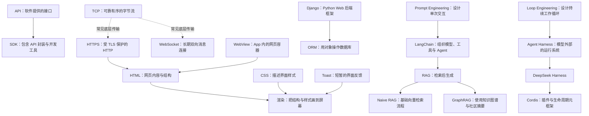

# 计算机知识库总索引

> [!summary] 使用方法
> 这是整个知识库的入口。第一次学习时按照“建议学习顺序”阅读；以后遇到新问题，再从分类目录进入对应笔记。

## 建议学习顺序

1. 先理解软件如何互相调用：[[SDK与API]]。
2. 再理解网络怎样传输网页和消息：[[TCP、HTTP、HTTPS与WebSocket]]。
3. 然后理解网页与界面：[[HTML]]、[[CSS]]、[[渲染逻辑]]、[[Toast提示]] 和 [[WebView]]。
4. 学习 Python 和数据库基础后，再看 [[Django]] 与 [[ORM]]。
5. 理解大语言模型的基本使用后，再看 [[LangChain]]、[[Prompt Engineering与Loop Engineering]] 和 [[RAG、Naive RAG与GraphRAG]]。
6. 最后学习 Agent 工程：[[DeepSeek Harness、Everything is a Plugin与Cordis]]。

## 01 软件开发基础

- [[SDK与API]]：软件之间如何交流，以及开发工具包如何帮助开发者调用接口。
- [[TCP、HTTP、HTTPS与WebSocket]]：可靠传输、网页请求、安全连接和实时双向通信。

## 02 Web 前端与界面

- [[HTML]]：描述网页内容、结构和语义的标记语言。
- [[Toast提示]]：开发者说“弹个 Toast”到底要做什么。
- [[CSS]]：网页的样式、布局和视觉效果由什么控制。
- [[渲染逻辑]]：数据如何变成用户最终看到的界面。
- [[WebView]]：嵌入手机或桌面 App 内部的网页显示组件。

## 03 Web 后端与数据库

- [[Django]]：用 Python 开发网站后端的完整框架。
- [[ORM]]：如何用程序里的对象操作关系型数据库。

## 04 AI 应用基础

- [[LangChain]]：组织模型、工具、提示词和 Agent 的开发框架。
- [[RAG、Naive RAG与GraphRAG]]：让大模型先查外部资料，再基于资料回答。

## 05 AI Agent 与框架

- [[Prompt Engineering与Loop Engineering]]：设计一次模型交互，与设计持续运行、检查和纠错的工作循环。
- [[DeepSeek Harness、Everything is a Plugin与Cordis]]：DeepSeek Harness 的插件化架构、能力边界和 Cordis 元框架。

## 这些概念之间是什么关系

## 阅读笔记时重点关注什么

- **它解决什么问题？** 不要先背定义。
- **输入和输出是什么？** 这能帮助你判断它位于系统的哪一层。
- **它和相似概念有什么区别？** 例如 SDK 不等于 API，Django 不等于 Python。
- **什么时候不应该使用它？** 技术没有“越高级越好”，只有是否适合当前问题。

## 后续维护约定

- 新问题会先判断所属类别，再创建或更新笔记。
- 对同一个概念的追问，会继续补充到原笔记中。
- 快速变化的项目会记录核对日期，避免把旧版本行为当作永久事实。
