# 计算机知识库总索引

> [!summary] 使用方法
> 这是整个知识库的入口。第一次学习时按照“建议学习顺序”阅读；以后遇到新问题，再从分类目录进入对应笔记。

## 建议学习顺序

如果正在学习计算机组成，可以先从 [[计算机硬件与底层软件学习地图]] 入门，依次认识电路板与供电散热、CPU/GPU、存储层次、启动与操作系统，再看机器语言、汇编和硬件描述语言。之后衔接下面的系统、编程与应用路线。

1. 先理解终端怎样运行命令，并区分 Web、桌面 GUI 与 CLI 只是不同的交互和承载方式：[[CMD、Bash与PowerShell]]、[[Web端、桌面软件与CLI程序的区别]]；再认识 Unix/Linux 为什么用小工具、管道和可裁剪组件组织系统，以及 Linux 实际运行在哪里：[[Unix与Linux设计哲学：文件、小工具与管道]]、[[Linux为什么可以做得很小]]、[[Linux的主要用途、普及原因与桌面现状]]。
2. 先认识电脑中负责存储和联网的设备，以及机器上电后怎样从固件逐层启动；再理解驱动怎样让操作系统控制硬件，以及代码怎样使用地址、寄存器、DMA 和中断：[[磁盘与网卡：存储设备和网络接口]]、[[固件、ROM代码与计算机启动链]]、[[设备驱动：操作系统控制硬件的翻译层]]、[[内存映射、MMIO与代码控制硬件]]；然后学习 [[进程、线程、多进程与多线程]] 和 [[Sidecar边车程序与辅助进程]]。最后认识常见编程语言、Java 高并发、位置与查找含义、程序状态与重复操作，以及 JavaScript 工具链：[[常见编程语言及其用途]]、[[Java为什么适合高并发]]、[[高并发系统：瓶颈分析、扩容与稳定性治理]]、[[Index的常见含义]]、[[状态机与幂等性]]、[[TypeScript与JavaScript]]、[[Node.js与pnpm]]、[[ESLint与JavaScript静态代码检查]]。
3. 学习 Git 基础后，再看 Git 暂存区、自动检查和协作合并：[[Index的常见含义#四、Git Index：暂存区|Git Index]]、[[Git Hook与自动化检查]]、[[GitHub Pull Request与合并策略]]；准备把软件交付给用户时，先分清 [[开发、测试、预发布与生产环境]]，结合 [[Docker容器与DI容器：运行隔离和对象装配]] 区分运行环境与对象依赖，再学习 [[软件供应链：代码签名、SBOM与发布门禁]] 和 [[金丝雀发布、灰度发布与渐进式交付]]。
4. 理解软件如何互相调用：[[SDK与API]]。
5. 再理解域名怎样找到服务器、网络怎样传输网页、TLS 怎样保护连接，以及代理、防火墙如何改变流量路径：[[DNS域名系统]]、[[TCP、HTTP、HTTPS与WebSocket]]、[[TLS与数字证书]]、[[系统代理、VPN与端口]]、[[防火墙与端口对外开放]]、[[内网、公网与私有化服务器部署]]、[[SSE与流式响应]]。掌握网络、哈希、签名和状态机的基本概念后，再学习 [[区块链基础：原理、共识、钱包与智能合约]]。
6. 然后理解网页、界面、组件化开发、桌面应用和前端构建：[[HTML]]、[[CSS]]、[[渲染逻辑]]、[[React组件化前端开发|React]]、[[React前端技术栈：Vite、Router、Zustand与PWA]]、[[Toast提示]]、[[../02-Web前端与界面/WebView]]、[[Electron桌面应用架构]]、[[Tauri跨平台桌面应用架构]] 和 [[Webpack与HMR]]。
7. 学习 Python 时先理解 [[Anaconda与Python环境管理|环境与依赖管理]]，再看 [[Django]] 与 [[ORM]]；通过 [[SQLite、SQLCipher与PostgreSQL|SQLite、MySQL、SQLCipher与PostgreSQL]] 分清嵌入式数据库与数据库服务器。沿 [[SQL与关系型数据库学习地图]] 学习表设计与范式、JOIN/CTE、统计报表、窗口函数、清洗、B+ 树与索引、锁/MVCC、事务日志和主从复制，用 [[SQL订单实战：样例数据与练习]] 验证。理解同步请求和事务后，再学习 [[Celery分布式任务队列]] 怎样把后台任务交给独立 Worker。
8. 理解大语言模型的基本使用后，先通过 [[Transformer与注意力机制]] 认识 Token、Embedding、自注意力、QKV、Encoder/Decoder 和 GPT 的生成过程，再用 [[大模型从数据、Token到训练与本地部署]] 串起训练数据、Tokenizer、预训练、模型权重和本地推理。然后沿着 [[大模型架构与效率技术地图]] 学习六条技术主线：[[MoE稀疏专家模型与DeepSeekMoE|MoE 稀疏专家]]、[[高效注意力：FlashAttention、GQA、MLA与线性注意力|高效与线性注意力]]、[[状态空间模型与长期记忆：Mamba、Titans与外部记忆|状态空间与长期记忆]]、[[推理模型、RL推理与测试时计算扩展|推理模型与测试时计算]]、[[多模态模型：ViT、DiT与视觉语言模型|多模态模型]]、[[大模型推理加速：FP8、量化、KV Cache与多Token预测|部署推理加速]]。然后学习 [[RLHF与大模型对齐]]，并区分 [[知识库是什么：个人、团队与AI知识库|个人、团队与 AI 知识库]]，继续学习 [[LangChain]]、[[Prompt Engineering与Loop Engineering]]、[[RAG、Naive RAG与GraphRAG]] 和 [[LLM Wiki]]。
9. 最后学习 Agent 工程及外部能力连接：先看 [[MCP模型上下文协议]]、[[DI容器、Pi与轻量钩子方案]]、[[DeepSeek Harness、Everything is a Plugin与Cordis]] 和 [[Preset与Agent Trajectory]]，再深入 [[Cordis运行时机制：Fiber、Effect与Scope]]、[[Agent工具运行时：执行流水线、并发调度与Code Mode]] 与 [[Agent评测：上下文成本、轨迹与独立验收]]。
10. 用实际产品案例串联前面的知识：先沿着 [[Otto使用技术学习地图]] 学习拆开的技术，再看 [[Otto与Otto USB对比及重点摘要]]，最后分别学习 [[Otto产品总体技术架构]] 和 [[Otto USB便携智能体]]。

## 01 软件开发基础

- [[CMD、Bash与PowerShell]]：终端、Shell 和命令是什么，以及三种常见命令解释器的区别。
- [[Web端、桌面软件与CLI程序的区别]]：区分界面、应用/Agent、本地工具和模型服务，理解桌面 GUI 怎样包装 CLI，以及跨端迁移前的核心分层、协议、权限、数据和发布准备。
- [[Unix与Linux设计哲学：文件、小工具与管道]]：理解万物皆文件、Do one thing well、标准流、管道，以及 ls、file、ping 等工具。
- [[Linux为什么可以做得很小]]：理解内核裁剪、最小启动链、BusyBox、rootfs、Buildroot，以及小型系统和容器镜像的区别。
- [[嵌入式系统为什么经常使用Linux]]：理解复杂设备为什么复用 Linux 驱动、网络、文件系统和进程模型，以及何时应改用裸机或 RTOS。
- [[Linux的主要用途、普及原因与桌面现状]]：理解 Linux 在服务器、云、Android 和嵌入式设备中的用途，以及传统 PC 较少预装 Linux 的生态原因。
- [[磁盘与网卡：存储设备和网络接口]]：区分 HDD、SSD、物理磁盘、分区、卷和文件系统，理解物理/虚拟网卡、MAC、IP、端口及数据收发路径。
- [[计算机硬件与底层软件学习地图]]：串起 PCB、供电散热、CPU/GPU、内存硬盘、固件启动、OS/驱动和底层语言，区分 VRAM/VRM、RAM/Arm 与 PCB 的不同含义。
- [[PCB、供电与散热：计算机硬件的物理基础]]：理解电路板、VRM 稳压、MOSFET、电感电容、功耗与热传导，以及散热和安全边界。
- [[CPU、指令集与计算机体系结构]]：理解取指执行、寄存器、核心、ISA 与微架构，区分 Arm/x86，并用 IBM System/360、370 理解系列机兼容。
- [[GPU、显存与CUDA并行计算]]：区分 GPU 与显卡、VRAM 与系统内存、容量与带宽，理解 CUDA 平台、运行库、驱动和线程模型。
- [[存储层次：RAM、SRAM、DRAM、Cache与Flash]]：从寄存器到硬盘理解存储层次，区分存储技术与角色、刷新与易失性、ROM/Flash 及 NAND/NOR。
- [[操作系统、内核与硬件管理]]：理解 OS、内核、系统调用、用户态/内核态、资源隔离与驱动，并串起固件启动和裸机运行。
- [[机器语言、汇编与硬件描述语言]]：比较机器指令、汇编、编译与 VHDL/Verilog，用半加器理解并发电路、仿真、综合与 FPGA/ASIC。
- [[固件、ROM代码与计算机启动链]]：区分 Boot ROM、Bootloader、BIOS/UEFI、设备固件、微码和驱动，理解分阶段启动、安全验证与更新风险。
- [[设备驱动：操作系统控制硬件的翻译层]]：理解操作系统怎样通过功能驱动、总线驱动、过滤驱动和驱动栈控制设备，以及内核驱动为何可能引发蓝屏。
- [[内存映射、MMIO与代码控制硬件]]：区分虚拟内存映射、`mmap()` 和 MMIO，理解代码怎样通过驱动、设备寄存器、中断与 DMA 控制硬件。
- [[进程、线程、多进程与多线程]]：区分资源容器与执行单元，理解共享内存、隔离、IPC、同步和多核执行。
- [[Docker容器与DI容器：运行隔离和对象装配]]：区分镜像、隔离进程与应用内部对象装配，理解安装依赖、对象依赖、单例范围及二者怎样配合。
- [[Sidecar边车程序与辅助进程]]：理解配套辅助进程、Tauri 外部二进制、stdin/stdout 与本地端口通信，以及生命周期和安全边界。
- [[常见编程语言及其用途]]：比较 Go、JavaScript、TypeScript、Rust、Java、Python、C/C++、C#、Kotlin、Swift 等语言的用途与学习选择。
- [[Java为什么适合高并发]]：区分并发、并行、吞吐与延迟，理解线程池、JMM、NIO、Netty 和虚拟线程。
- [[高并发系统：瓶颈分析、扩容与稳定性治理]]：用指标和压测定位 CPU、数据库、连接池、锁、缓存、队列与下游瓶颈，并通过扩容、限流、背压、降级、熔断和幂等治理高并发。
- [[Anaconda与Python环境管理]]：区分 Anaconda、conda、Miniconda、pip、Jupyter 和 Python 虚拟环境。
- [[Index的常见含义]]：区分数组下标、数据库/搜索索引、Git 暂存区以及常见入口文件。
- [[算法复杂度与ASL：渐近符号、平均情况和查找长度]]：区分大 O、小 o、Ω、Θ 与最好/平均/最坏情况，推导成功/失败 ASL、概率加权平均和均摊分析。
- [[TypeScript与JavaScript]]：TS 如何在 JavaScript 上增加运行前静态类型检查。
- [[Node.js与pnpm]]：JavaScript 运行环境与项目依赖包管理器。
- [[ESLint与JavaScript静态代码检查]]：理解 JavaScript/TypeScript 的 AST、规则、插件、Flat Config、自动修复，以及它和类型检查、Prettier、测试的分工。
- [[Git Hook与自动化检查]]：在提交、推送等 Git 时刻自动触发检查脚本。
- [[GitHub Pull Request与合并策略]]：理解分支怎样通过 PR 接受审查和自动检查后进入目标分支，并比较 Merge Commit、Squash 与 Rebase 三种合并历史。
- [[开发、测试、预发布与生产环境]]：理解本地、开发、测试、预发布和生产的真正边界，以及数据、配置、网络、权限、依赖、缓存、发布和运维为何都会造成环境差异。
- [[SDK与API]]：软件之间如何交流，以及开发工具包如何帮助开发者调用接口。
- [[SSE与流式响应]]：服务器怎样通过一条 HTTP 连接持续向客户端推送文本和事件。
- [[DNS域名系统]]：域名怎样通过根服务器、递归解析、权威服务器和缓存得到 IP 等记录。
- [[TCP、HTTP、HTTPS与WebSocket]]：可靠传输、网页请求、安全连接和实时双向通信。
- [[TLS与数字证书]]：怎样协商密钥、验证证书并为 HTTPS 等协议建立安全通道。
- [[系统代理、VPN与端口]]：系统代理、TUN/VPN、梯子、端口和应用分流怎样共同影响联网。
- [[防火墙与端口对外开放]]：区分程序监听、防火墙入站放行、路由器端口转发和真正的互联网暴露。
- [[内网、公网与私有化服务器部署]]：区分网络访问边界、基础设施控制权、离线隔离和完整生产部署，并理解私有化不自动等于安全或数据不外发。
- [[状态机与幂等性]]：怎样限制合法状态转换，以及怎样让重复请求不重复产生业务效果。
- [[密码学基础：AES-GCM、scrypt、Ed25519与SHA-256]]：区分认证加密、口令派生、数字签名和哈希。
- [[区块链基础：原理、共识、钱包与智能合约]]：理解交易、区块、哈希链、钱包、共识、比特币、以太坊和智能合约，以及它与普通数据库的适用边界。
- [[密钥管理：DEK、KEK、KMS、HSM与信封加密]]：数据密钥怎样生成、包裹、保管、轮换、撤销和恢复。
- [[端到端加密E2EE与MLS]]：发送端加密、接收端解密，以及群组密钥怎样随成员变化更新。
- [[身份认证与授权：ACL、RBAC、MFA、OAuth、OIDC、SAML与SCIM]]：区分“你是谁”和“你能做什么”，理解企业身份协议。
- [[Windows ACL与NTFS权限]]：理解 Windows 怎样用 SID、ACE、DACL、SACL 和继承控制文件等对象的访问。
- [[Windows UAC与管理员权限提升]]：理解管理员账户为什么仍会受限、UAC 弹窗如何提升进程，以及它与访问令牌、ACL 和完整性级别的关系。
- [[CHKDSK、SFC与DISM：Windows检查与修复工具]]：区分磁盘文件系统、受保护系统文件和 Windows 组件存储，并按风险选择检查与修复命令。
- [[Minidump与Windows崩溃转储分析]]：理解应用崩溃和 Windows 蓝屏怎样保存现场快照，以及如何用符号和 WinDbg 从异常、线程、调用栈与模块定位原因。
- [[SSRF、DNS Rebinding与浏览器来源安全]]：防止服务器和本机服务被诱导访问错误目标。
- [[软件供应链：代码签名、SBOM与发布门禁]]：用签名、时间戳、组件清单和门禁保证制品可追溯。
- [[金丝雀发布、灰度发布与渐进式交付]]：区分 Canary、灰度、滚动、蓝绿、发布环、Feature Flag、A/B、影子流量和冒烟测试，并理解 Codex 中 Canary 标签的可能含义。
- [[高可用、健康检查与故障恢复]]：判断服务是否可用，并通过冗余、备份和演练应对故障。

## 02 Web 前端与界面

- [[HTML]]：描述网页内容、结构和语义的标记语言。
- [[Toast提示]]：开发者说“弹个 Toast”到底要做什么。
- [[CSS]]：网页的样式、布局和视觉效果由什么控制。
- [[渲染逻辑]]：数据如何变成用户最终看到的界面。
- [[React组件化前端开发]]：理解组件、JSX、Props、State、Hooks、Render/Commit，以及 React 与浏览器、框架和服务端渲染的边界。
- [[React前端技术栈：Vite、Router、Zustand与PWA]]：把 React 18、TypeScript、Vite、React Router、Zustand、HTTPS REST、WebSocket 和 PWA 串成一套完整前端架构，并说明各自边界。
- [[../02-Web前端与界面/WebView]]：嵌入手机或桌面 App 内部的网页显示组件。
- [[Webpack与HMR]]：怎样分析、转换和打包前端模块，以及开发时怎样局部热更新。
- [[Electron桌面应用架构]]：怎样用 Web 技术构建桌面应用，并隔离 Main、Preload 和 Renderer 权限。
- [[Tauri跨平台桌面应用架构]]：理解系统 WebView、Rust Core、IPC、Capability/Permission/Scope，以及它与 Electron 的取舍。

## 03 Web 后端与数据库

- [[Django]]：用 Python 开发网站后端的完整框架。
- [[Celery分布式任务队列]]：理解 Django/Python 怎样通过 Broker 把后台任务交给 Worker，以及 Result Backend、Beat、重试、幂等和监控。
- [[ORM]]：如何用程序里的对象操作关系型数据库。
- [[SQL与关系型数据库学习地图]]：系统串起存储设计、查询分析、清洗质量、性能和并发可靠性。
- [[SQL基础查询与多表关联]]：筛选、NULL、JOIN、GROUP BY、HAVING、子查询、公用表表达式 CTE 与递归。
- [[关系型数据库设计：建模、约束与范式]]：主键、外键、候选键、复合键、约束、前三范式、历史快照与分析建模。
- [[SQL复杂统计与报表设计]]：指标口径、条件聚合、关联放大、退款、补日历、比例、中位数、复购与报表交付。
- [[SQL窗口函数：排名、累计与同期比较]]：排名并列、每组最新、ROWS/RANGE 框架、累计、LAG/LEAD 与移动平均。
- [[SQL数据清洗与质量校验]]：缺失、格式、去重、拒绝原因、原始留存、幂等导入和金额对账。
- [[SQL事务、锁与并发一致性]]：ACID、条件扣库存、乐观/悲观锁、记录与间隙锁、MVCC、隔离级别、死锁与重试。
- [[B+树与数据库索引原理]]：数据页、有序树、范围扫描、聚簇/二级索引、回表、覆盖与联合索引原理。
- [[SQL索引、执行计划与性能优化]]：EXPLAIN、估算与实际、关联策略、索引设计、深分页、连接池与优化验收。
- [[数据库事务日志、主从复制与故障恢复]]：WAL、redo/undo/binlog、检查点、复制延迟、同步保证、切主、备份与恢复。
- [[SQL订单实战：样例数据与练习]]：统一订单样例与内存库校验脚本，核对 27 个标注 SQL 示例及约束、回滚和质量检查。
- [[SQLite、SQLCipher与PostgreSQL|SQLite、MySQL、SQLCipher与PostgreSQL]]：比较嵌入式单文件数据库、MySQL/PostgreSQL 数据库服务器、整库加密、并发写入和常见选型边界。
- [[Redis缓存与分布式协调]]：用高速内存数据结构保存缓存、限流、租约和短期共享状态。
- [[S3与MinIO对象存储]]：用 Bucket、Key 和 Object 保存附件、备份与大型二进制文件。

## 04 AI 应用基础

- [[Transformer与注意力机制]]：理解 Token、Embedding、QKV、自注意力、多头注意力、位置表示、Encoder/Decoder，以及 GPT 怎样训练和逐 Token 生成。
- [[大模型从数据、Token到训练与本地部署]]：理解原始资料怎样变成训练 Token、模型权重怎样学到、调用云端 API 与下载权重进行内网推理有何区别。
- [[大模型架构与效率技术地图]]：从参数容量、注意力、记忆、推理、多模态和部署六条主线理解现代大模型技术怎样组合。
- [[MoE稀疏专家模型与DeepSeekMoE]]：理解总参数与激活参数、Top-k 路由、共享/细粒度专家、负载均衡和跨设备通信。
- [[高效注意力：FlashAttention、GQA、MLA与线性注意力]]：区分精确注意力的 I/O 优化、KV Cache 压缩以及真正改变序列复杂度的稀疏/线性路线。
- [[状态空间模型与长期记忆：Mamba、Titans与外部记忆]]：区分有限递归状态、推理时神经记忆、上下文窗口和 RAG 外部存储。
- [[推理模型、RL推理与测试时计算扩展]]：理解强化学习训练、候选搜索、验证、回溯、工具使用和回答时增加计算的成本边界。
- [[多模态模型：ViT、DiT与视觉语言模型]]：理解图片、音频和视频怎样编码、对齐并进入模型，以及 ViT、DiT、VLM 的不同职责。
- [[大模型推理加速：FP8、量化、KV Cache与多Token预测]]：区分精度压缩、缓存压缩、推测解码，以及首 Token 延迟、每 Token 延迟和吞吐。
- [[RLHF与大模型对齐]]：理解 SFT、人类偏好数据、奖励模型、PPO、KL 约束、DPO、RLAIF、GRPO、奖励投机与独立评测。
- [[知识库是什么：个人、团队与AI知识库]]：区分个人笔记库、企业 Wiki、客服帮助中心、RAG 知识库和 LLM Wiki。

- [[LangChain]]：组织模型、工具、提示词和 Agent 的开发框架。
- [[RAG、Naive RAG与GraphRAG]]：让大模型先查外部资料，再基于资料回答。
- [[LLM Wiki]]：让大模型把原始资料持续编译成结构化、互相链接、可长期维护的 Markdown 知识库。

## 05 AI Agent 与框架

- [[MCP模型上下文协议]]：AI 应用怎样用统一协议连接外部资料、提示模板和工具。
- [[Prompt Engineering与Loop Engineering]]：设计一次模型交互，与设计持续运行、检查和纠错的工作循环。
- [[DI容器、Pi与轻量钩子方案]]：区分依赖注入、事件 Hook、Pi Agent Harness 与 Cordis 元框架。
- [[DeepSeek Harness、Everything is a Plugin与Cordis]]：DeepSeek Harness 的插件化架构、能力边界和 Cordis 元框架。
- [[Preset与Agent Trajectory]]：怎样预先装配 Agent，以及怎样记录和复盘它的实际执行路径。
- [[Cordis运行时机制：Fiber、Effect与Scope]]：插件怎样等待依赖、启动、登记可逆副作用、分层可见并安全退出。
- [[Agent工具运行时：执行流水线、并发调度与Code Mode]]：模型工具调用怎样经过审批、Guard、调度和记录，以及 Code Mode 怎样编排多个工具。
- [[Agent评测：上下文成本、轨迹与独立验收]]：怎样同时评价正确性、安全性、token 成本、人工干预和可复现性。
- [[RPA、UI Automation与CDP]]：区分业务流程自动化、Windows 语义控件和 Chromium 调试协议。
- [[Control Plane、Data Plane、Edge Gateway与Federation]]：理解控制面、数据面、模型入口和跨部署协作的职责边界。

## 06 项目与产品

- [[Otto使用技术学习地图]]：把两份 Otto 手册涉及的界面、Agent、数据、安全和交付技术拆成独立学习路线。

- [[Otto与Otto USB对比及重点摘要]]：快速区分 Otto 企业平台与 Otto USB 便携产品，并总结两份手册最重要的产品、安全和交付结论。
- [[Otto产品总体技术架构]]：从 Desktop、Core、Server、Control、Edge、Federation、数据平面和发布门禁理解 Otto 主产品。
- [[Otto USB便携智能体]]：理解 U 盘便携运行时、BYOK、工具审批、加密保险库、介质授权、防复制边界和当前 RC 状态。

## 这些概念之间是什么关系

```mermaid
flowchart TD
    Shell["Shell：解释命令并启动程序"] --> Node["Node.js：运行 JavaScript"]
    Languages["常见编程语言"] --> JST["JavaScript/TypeScript：Web 与跨平台应用"]
    Languages --> Python["Python：AI、数据与自动化"]
    Languages --> Java["Java：企业后端与 JVM 生态"]
    Languages --> Go["Go：云服务、网络工具与 CLI"]
    Languages --> Rust["Rust：系统、性能与内存安全"]
    JST --> Node
    JST --> ReactUI["React：用组件和状态组织UI"]
    Python --> Conda["Anaconda/conda：Python 环境与依赖管理"]
    Conda --> Django
    Node --> PNPM["pnpm：安装依赖并运行项目脚本"]
    Shell --> Git["Git：版本控制"]
    Git --> Hook["Git Hook：在 Git 事件点触发脚本"]
    Hook --> PNPM
    State["状态机：约束状态与合法转换"] --> Fiber
    Retry["网络或任务重试"] --> Idempotency["幂等性：重复执行不叠加效果"]
    Idempotency --> ToolRuntime
    API["API：软件提供的接口"] --> SDK["SDK：包含 API 封装与开发工具"]
    DNS["DNS：查询域名对应的地址等记录"] --> TLS["TLS：认证、协商密钥并保护数据"]
    TCP["TCP：可靠有序的字节流"] -. "常见承载" .-> TLS
    TLS --> HTTPS["HTTPS：受 TLS 保护的 HTTP"]
    SystemProxy["系统代理：告诉应用使用代理"] --> LocalProxy["本地代理端口：例如 127.0.0.1:7890"]
    LocalProxy --> HTTPS
    VPN["TUN/VPN：通过虚拟网卡与路由接管流量"] --> HTTPS
    VPN -. "可能接管 DNS 查询" .-> DNS
    TCP -. "常见底层传输" .-> WS["WebSocket：长期双向消息连接"]
    HTTPS --> HTML["HTML：网页内容与结构"]
    WebView["WebView：App 内的网页容器"] --> HTML
    Tauri["Tauri：WebView界面 + Rust原生核心"] --> WebView
    Rust --> Tauri
    ReactUI -. "可作为前端" .-> Tauri
    Tauri -. "可捆绑并启动" .-> Sidecar["Sidecar：配套辅助进程"]
    HTML --> Render["渲染：把结构与样式画到屏幕"]
    ReactUI --> Render
    CSS["CSS：描述界面样式"] --> Render["渲染：把结构与样式画到屏幕"]
    Toast["Toast：短暂的界面反馈"] --> Render
    Django["Django：Python Web 后端框架"] --> ORM["ORM：用对象操作数据库"]
    Prompt["Prompt Engineering：设计单次交互"] --> LC["LangChain：组织模型、工具与 Agent"]
    RAG["RAG：检索后生成"] --> Naive["Naive RAG：基础向量检索流程"]
    RAG --> Graph["GraphRAG：使用知识图谱与社区摘要"]
    RAG -. "可以组合" .-> LLMWiki["LLM Wiki：持久化、可阅读的知识层"]
    LC --> RAG
    Transformer["Transformer：注意力与逐Token生成"] --> ModelMap["大模型技术地图：容量、注意力、记忆、推理、多模态、部署"]
    ModelMap --> MoE["MoE：总参数大、每Token稀疏激活"]
    ModelMap --> EfficientAttention["高效注意力：FlashAttention/GQA/MLA/KDA"]
    ModelMap --> LongMemory["状态与记忆：Mamba/Titans/RAG"]
    ModelMap --> ReasoningModel["推理扩展：RL、验证与测试时计算"]
    ModelMap --> Multimodal["多模态：ViT/DiT/VLM"]
    ModelMap --> InferenceSpeed["部署加速：FP8/量化/KV压缩/MTP"]
    API --> MCP["MCP：连接 AI Host 与外部资料和工具"]
    MCP --> Harness["Agent Harness：模型外部的运行系统"]
    Loop["Loop Engineering：设计持续工作循环"] --> Harness["Agent Harness：模型外部的运行系统"]
    Harness --> DSH["DeepSeek Harness"]
    Harness --> Otto["Otto：桌面优先Agent产品"]
    Otto --> OttoMap["Otto技术学习地图：分项学习入口"]
    Otto --> OttoMain["Otto主产品：企业平台"]
    Otto --> OttoUSB["Otto USB：便携个人/课程产品"]
    DSH --> Cordis["Cordis：插件与生命周期元框架"]
    Cordis --> Fiber["Fiber/Effect/Scope：依赖、撤销与可见性"]
    Preset["Agent Preset：预先装配模型、工具与权限"] --> DSH
    Harness --> ToolRuntime["Tool Runtime：审批、Guard 与调度"]
    ToolRuntime --> CodeMode["Code Mode：用程序编排工具"]
    Loop --> Trajectory["Trajectory：循环实际运行的轨迹"]
    Trajectory --> Eval["Agent Eval：正确性、安全、成本与独立验收"]
```

## 阅读笔记时重点关注什么

- **它解决什么问题？** 不要先背定义。
- **输入和输出是什么？** 这能帮助你判断它位于系统的哪一层。
- **它和相似概念有什么区别？** 例如 SDK 不等于 API，Django 不等于 Python。
- **什么时候不应该使用它？** 技术没有“越高级越好”，只有是否适合当前问题。

## 后续维护约定

- 新问题会先判断所属类别，再创建或更新笔记。
- 对同一个概念的追问，会继续补充到原笔记中。
- 快速变化的项目会记录核对日期，避免把旧版本行为当作永久事实。
