# 计算机知识库总索引

> [!summary] 使用方法
> 这是整个知识库的入口。第一次学习时按照“建议学习顺序”阅读；以后遇到新问题，再从分类目录进入对应笔记。

## 建议学习顺序

1. 先理解终端怎样运行命令：[[CMD、Bash与PowerShell]]。
2. 再认识常见编程语言、位置与查找含义、程序状态与重复操作，以及 JavaScript 工具链：[[常见编程语言及其用途]]、[[Index的常见含义]]、[[状态机与幂等性]]、[[TypeScript与JavaScript]]、[[Node.js与pnpm]]。
3. 学习 Git 基础后，再看 Git 暂存区和自动检查：[[Index的常见含义#四、Git Index：暂存区|Git Index]]、[[Git Hook与自动化检查]]。
4. 理解软件如何互相调用：[[SDK与API]]。
5. 再理解域名怎样找到服务器、网络怎样传输网页、TLS 怎样保护连接，以及代理如何改变流量路径：[[DNS域名系统]]、[[TCP、HTTP、HTTPS与WebSocket]]、[[TLS与数字证书]]、[[系统代理、VPN与端口]]、[[SSE与流式响应]]。
6. 然后理解网页、界面、桌面应用和前端构建：[[HTML]]、[[CSS]]、[[渲染逻辑]]、[[Toast提示]]、[[../02-Web前端与界面/WebView]]、[[Electron桌面应用架构]] 和 [[Webpack与HMR]]。
7. 学习 Python 时先理解 [[Anaconda与Python环境管理|环境与依赖管理]]，再看 [[Django]] 与 [[ORM]]。
8. 理解大语言模型的基本使用后，再看 [[LangChain]]、[[Prompt Engineering与Loop Engineering]]、[[RAG、Naive RAG与GraphRAG]] 和 [[LLM Wiki]]。
9. 最后学习 Agent 工程及外部能力连接：先看 [[MCP模型上下文协议]]、[[DI容器、Pi与轻量钩子方案]]、[[DeepSeek Harness、Everything is a Plugin与Cordis]] 和 [[Preset与Agent Trajectory]]，再深入 [[Cordis运行时机制：Fiber、Effect与Scope]]、[[Agent工具运行时：执行流水线、并发调度与Code Mode]] 与 [[Agent评测：上下文成本、轨迹与独立验收]]。
10. 用实际产品案例串联前面的知识：先沿着 [[Otto使用技术学习地图]] 学习拆开的技术，再看 [[Otto与Otto USB对比及重点摘要]]，最后分别学习 [[Otto产品总体技术架构]] 和 [[Otto USB便携智能体]]。

## 01 软件开发基础

- [[CMD、Bash与PowerShell]]：终端、Shell 和命令是什么，以及三种常见命令解释器的区别。
- [[常见编程语言及其用途]]：比较 Go、JavaScript、TypeScript、Rust、Java、Python、C/C++、C#、Kotlin、Swift 等语言的用途与学习选择。
- [[Anaconda与Python环境管理]]：区分 Anaconda、conda、Miniconda、pip、Jupyter 和 Python 虚拟环境。
- [[Index的常见含义]]：区分数组下标、数据库/搜索索引、Git 暂存区以及常见入口文件。
- [[TypeScript与JavaScript]]：TS 如何在 JavaScript 上增加运行前静态类型检查。
- [[Node.js与pnpm]]：JavaScript 运行环境与项目依赖包管理器。
- [[Git Hook与自动化检查]]：在提交、推送等 Git 时刻自动触发检查脚本。
- [[SDK与API]]：软件之间如何交流，以及开发工具包如何帮助开发者调用接口。
- [[SSE与流式响应]]：服务器怎样通过一条 HTTP 连接持续向客户端推送文本和事件。
- [[DNS域名系统]]：域名怎样通过根服务器、递归解析、权威服务器和缓存得到 IP 等记录。
- [[TCP、HTTP、HTTPS与WebSocket]]：可靠传输、网页请求、安全连接和实时双向通信。
- [[TLS与数字证书]]：怎样协商密钥、验证证书并为 HTTPS 等协议建立安全通道。
- [[系统代理、VPN与端口]]：系统代理、TUN/VPN、梯子、端口和应用分流怎样共同影响联网。
- [[状态机与幂等性]]：怎样限制合法状态转换，以及怎样让重复请求不重复产生业务效果。
- [[密码学基础：AES-GCM、scrypt、Ed25519与SHA-256]]：区分认证加密、口令派生、数字签名和哈希。
- [[密钥管理：DEK、KEK、KMS、HSM与信封加密]]：数据密钥怎样生成、包裹、保管、轮换、撤销和恢复。
- [[端到端加密E2EE与MLS]]：发送端加密、接收端解密，以及群组密钥怎样随成员变化更新。
- [[身份认证与授权：ACL、RBAC、MFA、OAuth、OIDC、SAML与SCIM]]：区分“你是谁”和“你能做什么”，理解企业身份协议。
- [[SSRF、DNS Rebinding与浏览器来源安全]]：防止服务器和本机服务被诱导访问错误目标。
- [[软件供应链：代码签名、SBOM与发布门禁]]：用签名、时间戳、组件清单和门禁保证制品可追溯。
- [[高可用、健康检查与故障恢复]]：判断服务是否可用，并通过冗余、备份和演练应对故障。

## 02 Web 前端与界面

- [[HTML]]：描述网页内容、结构和语义的标记语言。
- [[Toast提示]]：开发者说“弹个 Toast”到底要做什么。
- [[CSS]]：网页的样式、布局和视觉效果由什么控制。
- [[渲染逻辑]]：数据如何变成用户最终看到的界面。
- [[../02-Web前端与界面/WebView]]：嵌入手机或桌面 App 内部的网页显示组件。
- [[Webpack与HMR]]：怎样分析、转换和打包前端模块，以及开发时怎样局部热更新。
- [[Electron桌面应用架构]]：怎样用 Web 技术构建桌面应用，并隔离 Main、Preload 和 Renderer 权限。

## 03 Web 后端与数据库

- [[Django]]：用 Python 开发网站后端的完整框架。
- [[ORM]]：如何用程序里的对象操作关系型数据库。
- [[SQLite、SQLCipher与PostgreSQL]]：比较本地嵌入式数据库、整库加密和企业级关系数据库。
- [[Redis缓存与分布式协调]]：用高速内存数据结构保存缓存、限流、租约和短期共享状态。
- [[S3与MinIO对象存储]]：用 Bucket、Key 和 Object 保存附件、备份与大型二进制文件。

## 04 AI 应用基础

- [[LangChain]]：组织模型、工具、提示词和 Agent 的开发框架。
- [[RAG、Naive RAG与GraphRAG]]：让大模型先查外部资料，再基于资料回答。
- [[LLM Wiki]]：让大模型把原始资料持续编译成结构化、互相链接、可长期维护的 Markdown 知识库。

## 05 AI Agent 与框架

- [[MCP模型上下文协议]]：AI 应用怎样用统一协议连接外部资料、提示模板和工具。
- [[Prompt Engineering与Loop Engineering]]：设计一次模型交互，与设计持续运行、检查和纠错的工作循环。
- [[DI容器、Pi与轻量钩子方案]]：区分依赖注入、事件 Hook、Pi Agent Harness 与 Cordis 元框架。
- [[DeepSeek Harness、Everything is a Plugin与Cordis]]：DeepSeek Harness 的插件化架构、能力边界和 Cordis 元框架。
- [[Preset与Agent Trajectory]]：怎样预先装配 Agent，以及怎样记录和复盘它的实际执行路径。
- [[Cordis运行时机制：Fiber、Effect与Scope]]：插件怎样等待依赖、启动、登记可逆副作用、分层可见并安全退出。
- [[Agent工具运行时：执行流水线、并发调度与Code Mode]]：模型工具调用怎样经过审批、Guard、调度和记录，以及 Code Mode 怎样编排多个工具。
- [[Agent评测：上下文成本、轨迹与独立验收]]：怎样同时评价正确性、安全性、token 成本、人工干预和可复现性。
- [[RPA、UI Automation与CDP]]：区分业务流程自动化、Windows 语义控件和 Chromium 调试协议。
- [[Control Plane、Data Plane、Edge Gateway与Federation]]：理解控制面、数据面、模型入口和跨部署协作的职责边界。

## 06 项目与产品

- [[Otto使用技术学习地图]]：把两份 Otto 手册涉及的界面、Agent、数据、安全和交付技术拆成独立学习路线。

- [[Otto与Otto USB对比及重点摘要]]：快速区分 Otto 企业平台与 Otto USB 便携产品，并总结两份手册最重要的产品、安全和交付结论。
- [[Otto产品总体技术架构]]：从 Desktop、Core、Server、Control、Edge、Federation、数据平面和发布门禁理解 Otto 主产品。
- [[Otto USB便携智能体]]：理解 U 盘便携运行时、BYOK、工具审批、加密保险库、介质授权、防复制边界和当前 RC 状态。

## 这些概念之间是什么关系

```mermaid
flowchart TD
    Shell["Shell：解释命令并启动程序"] --> Node["Node.js：运行 JavaScript"]
    Languages["常见编程语言"] --> JST["JavaScript/TypeScript：Web 与跨平台应用"]
    Languages --> Python["Python：AI、数据与自动化"]
    Languages --> Java["Java：企业后端与 JVM 生态"]
    Languages --> Go["Go：云服务、网络工具与 CLI"]
    Languages --> Rust["Rust：系统、性能与内存安全"]
    JST --> Node
    Python --> Conda["Anaconda/conda：Python 环境与依赖管理"]
    Conda --> Django
    Node --> PNPM["pnpm：安装依赖并运行项目脚本"]
    Shell --> Git["Git：版本控制"]
    Git --> Hook["Git Hook：在 Git 事件点触发脚本"]
    Hook --> PNPM
    State["状态机：约束状态与合法转换"] --> Fiber
    Retry["网络或任务重试"] --> Idempotency["幂等性：重复执行不叠加效果"]
    Idempotency --> ToolRuntime
    API["API：软件提供的接口"] --> SDK["SDK：包含 API 封装与开发工具"]
    DNS["DNS：查询域名对应的地址等记录"] --> TLS["TLS：认证、协商密钥并保护数据"]
    TCP["TCP：可靠有序的字节流"] -. "常见承载" .-> TLS
    TLS --> HTTPS["HTTPS：受 TLS 保护的 HTTP"]
    SystemProxy["系统代理：告诉应用使用代理"] --> LocalProxy["本地代理端口：例如 127.0.0.1:7890"]
    LocalProxy --> HTTPS
    VPN["TUN/VPN：通过虚拟网卡与路由接管流量"] --> HTTPS
    VPN -. "可能接管 DNS 查询" .-> DNS
    TCP -. "常见底层传输" .-> WS["WebSocket：长期双向消息连接"]
    HTTPS --> HTML["HTML：网页内容与结构"]
    WebView["WebView：App 内的网页容器"] --> HTML
    HTML --> Render["渲染：把结构与样式画到屏幕"]
    CSS["CSS：描述界面样式"] --> Render["渲染：把结构与样式画到屏幕"]
    Toast["Toast：短暂的界面反馈"] --> Render
    Django["Django：Python Web 后端框架"] --> ORM["ORM：用对象操作数据库"]
    Prompt["Prompt Engineering：设计单次交互"] --> LC["LangChain：组织模型、工具与 Agent"]
    RAG["RAG：检索后生成"] --> Naive["Naive RAG：基础向量检索流程"]
    RAG --> Graph["GraphRAG：使用知识图谱与社区摘要"]
    RAG -. "可以组合" .-> LLMWiki["LLM Wiki：持久化、可阅读的知识层"]
    LC --> RAG
    API --> MCP["MCP：连接 AI Host 与外部资料和工具"]
    MCP --> Harness["Agent Harness：模型外部的运行系统"]
    Loop["Loop Engineering：设计持续工作循环"] --> Harness["Agent Harness：模型外部的运行系统"]
    Harness --> DSH["DeepSeek Harness"]
    Harness --> Otto["Otto：桌面优先Agent产品"]
    Otto --> OttoMap["Otto技术学习地图：分项学习入口"]
    Otto --> OttoMain["Otto主产品：企业平台"]
    Otto --> OttoUSB["Otto USB：便携个人/课程产品"]
    DSH --> Cordis["Cordis：插件与生命周期元框架"]
    Cordis --> Fiber["Fiber/Effect/Scope：依赖、撤销与可见性"]
    Preset["Agent Preset：预先装配模型、工具与权限"] --> DSH
    Harness --> ToolRuntime["Tool Runtime：审批、Guard 与调度"]
    ToolRuntime --> CodeMode["Code Mode：用程序编排工具"]
    Loop --> Trajectory["Trajectory：循环实际运行的轨迹"]
    Trajectory --> Eval["Agent Eval：正确性、安全、成本与独立验收"]
```

## 阅读笔记时重点关注什么

- **它解决什么问题？** 不要先背定义。
- **输入和输出是什么？** 这能帮助你判断它位于系统的哪一层。
- **它和相似概念有什么区别？** 例如 SDK 不等于 API，Django 不等于 Python。
- **什么时候不应该使用它？** 技术没有“越高级越好”，只有是否适合当前问题。

## 后续维护约定

- 新问题会先判断所属类别，再创建或更新笔记。
- 对同一个概念的追问，会继续补充到原笔记中。
- 快速变化的项目会记录核对日期，避免把旧版本行为当作永久事实。
