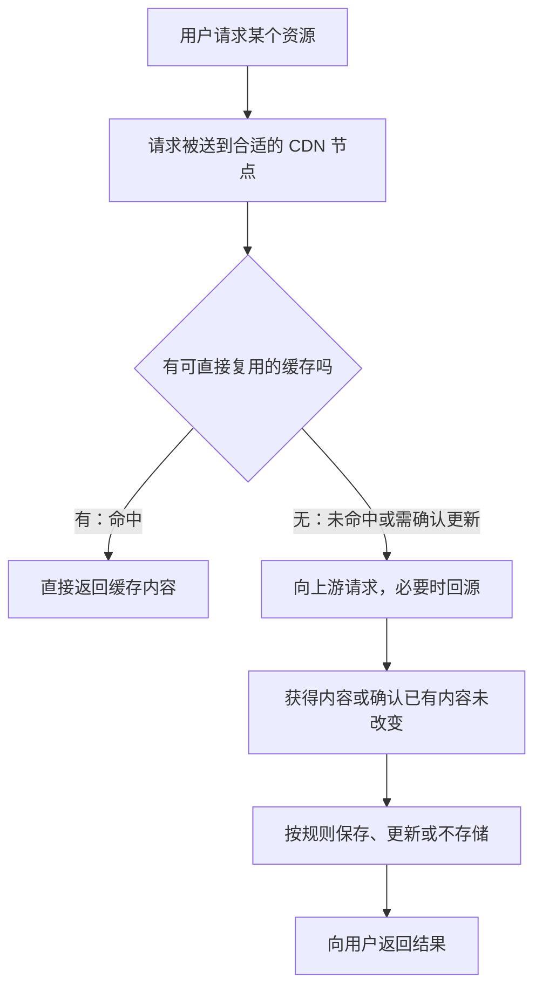
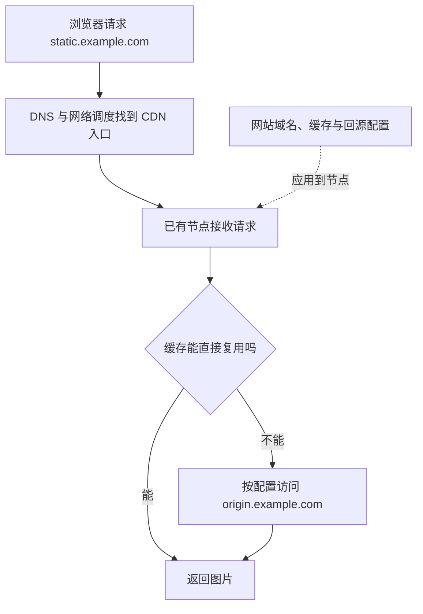

# CDN内容分发网络：边缘缓存、回源与加速

> [!summary] 一句话解释
> CDN 把内容分发到多个网络节点，让用户从合适的节点获取内容；通过缓存、请求调度和传输优化，减少等待并减轻网站原始服务器的负担。

## 一、CDN 是什么，怎么读

**CDN（Content Delivery Network，内容分发网络，按字母读“西—迪—恩”）** 是一种分布式内容交付基础设施。

它不是某一种编程语言，也不是单独一台服务器。许多服务商提供 CDN，但具体节点布局、缓存规则和附加功能不同。[Cloudflare：CDN 的基本定义](https://www.cloudflare.com/learning/cdn/what-is-a-cdn/)

## 二、生活类比：总仓库与各地配送仓

假设一家商店的总仓库在北京，全国用户都要买同一种商品。

- 没有分仓：每一单都从北京发货。
- 有各地分仓：常用商品先放到多个分仓，由合适的分仓发给用户。
- 分仓缺货：再向总仓库调货。

映射到网站：

| 类比 | CDN 中的概念 |
|---|---|
| 总仓库 | Origin（源站）：内容的原始提供方 |
| 各地分仓 | Edge Node（边缘节点）：面向用户交付内容的节点 |
| 分仓存货 | Cache（缓存）：可按规则复用的内容副本 |
| 分仓有货，直接发出 | Cache Hit（缓存命中） |
| 分仓缺货，需要向上游获取 | Cache Miss（缓存未命中） |
| 向原始提供方请求 | 回源 |

类比的边界：数字文件可以复制，用户下载不会像买走商品一样消耗掉这一份缓存；缓存也不是永久备份。

源站可以是网页服务器、对象存储或多个后端组成的服务，不一定只有一台电脑。

## 三、不用 CDN 与使用 CDN，路径有什么不同

### 不用 CDN 的简化路径

```text
用户浏览器 → 网站源站 → 返回图片、页面或数据
```

如果源站离用户网络较远、出口带宽紧张或访问人数很多，获取内容就可能较慢。

### 使用 CDN 的典型缓存路径



图中省略了鉴权、绕过缓存、失败重试等分支。真实 CDN 还可能有多级缓存：当前节点没有内容，可以先从上级缓存拿，并非每次未命中都直接打到源站。[缓存机制](https://www.cloudflare.com/learning/cdn/what-is-caching/)、[分层缓存架构实例](https://developers.cloudflare.com/reference-architecture/architectures/cdn/)

### 一张图片的例子

用户请求教学地址 `https://static.example.com/cat.jpg`：

1. 浏览器请求图片；如果浏览器本地已有可用缓存，可能根本不用发出这次网络请求。
2. 若需要联网，请求被送到 CDN 的某个节点。
3. 节点已有匹配且可直接复用的图片副本，就直接返回。
4. 没有可用副本时，节点向上游获取，必要时由源站提供。
5. 如果允许缓存，节点保留副本，后续匹配的请求可能直接命中。

这里不是“全世界第一个人请求一次，所有节点就同时拥有图片”。有些内容按需获取，有些可以提前预热，不同节点的缓存状态可能不同。

## 四、它为什么能加速

### 1. 改善网络路径，减少往返等待

用户连接一个网络上更合适的节点，通常可以减少长距离往返或跨网络拥堵的影响。但“合适”不等于地图上直线距离最近，还涉及运营商互联、路由、节点负载与调度策略。

### 2. 同一份内容不必每次都由源站发送

假设有 1,000 次请求同一张大小为 1 MB 的图片。**MB（Megabyte，兆字节，按字母读）** 是数据量单位，此处不考虑额外协议开销。

再假设其中 900 次由 CDN 缓存回答，另外 100 次全部回源，没有额外的重验证或上级缓存：

```text
缓存命中率 = 900 / 1,000 = 90%
不用 CDN 时，源站发送约 1,000 MB
在此假设下，源站发送约 100 MB
用户获得的图片总量仍约为 1,000 MB
```

省下的是源站重复承担的传输，不是让用户下载的数据凭空消失。请求命中率与字节命中率也不同：如果各资源大小差别很大，命中很多小文件不代表节省了同样比例的带宽。

### 3. 分散负载与提供传输优化

多个节点可以分担用户请求；服务还可能提供连接复用、压缩、图片处理或路径优化。具体能力取决于平台与配置，不是“用了 CDN 就全部自动具备”。

CDN 主要改善内容交付；如果慢的是源站数据库查询或复杂业务计算，单靠 CDN 未必能解决。参见 [[高并发系统：瓶颈分析、扩容与稳定性治理]]。

## 五、哪些内容适合缓存

| 内容 | 常见处理思路 | 注意点 |
|---|---|---|
| 公开图片、字体、安装包 | 通常适合缓存 | 更新、授权与文件版本要明确 |
| 带内容版本的脚本和样式文件 | 通常适合较长缓存 | 内容变化时换地址，不能覆盖后继续假定旧缓存立刻失效 |
| 公开文章页面 | 可按更新频率设置策略 | 评论、登录状态等部分可能不同 |
| 所有人看到的同一份榜单数据 | 可考虑短时间缓存 | 要能接受明确的数据延迟 |
| 用户订单、账户页面 | 不能直接作为所有人共享的缓存 | 需要身份隔离、权限检查，常应绕过共享缓存 |
| 提交订单、上传、实时交互 | 通常要送到实际服务处理 | 转发流量不等于缓存业务操作 |

**静态／动态不等于可缓存／不可缓存。** 后端动态生成的公开榜单可以设计为可缓存；一个名为 `.jpg` 的私人图片也可能不允许公开共享。

**API（Application Programming Interface，应用程序编程接口，按字母读“诶—皮—艾”）** 返回的数据同样要看共享范围和时效要求，不能因为请求地址里有 `/api` 就一律缓存或一律排除。

有些 CDN 能转发 WebSocket（实时双向通信连接）等流量，但这不等于把一条实时聊天连接当成图片保存下来，给后来的所有用户复用。

直播也是内容分发的重要场景，但还需要采集、编码、推流、播放器和观看权限等能力；多人连麦又涉及实时互动链路。准备找人开发平台时，参见 [[直播平台开发前的需求、架构、成本与验收清单]]，不要把采购 CDN 当成采购整套直播平台。

## 六、缓存时间由什么决定

网站可以通过 **HTTP（Hypertext Transfer Protocol，超文本传输协议，按字母读）** 响应头说明缓存策略。响应头是服务器随内容一起返回的控制信息，不是页面正文。

最常见的字段之一是 `Cache-Control`（缓存控制）。以下是响应指令的基础含义：

| 指令 | 含义 |
|---|---|
| `public` | 明确允许共享缓存存储该响应；不是鉴权机制 |
| `private` | 不允许共享缓存存储完整响应，私有缓存如浏览器仍可能存储 |
| `max-age=300` | 设置通常适用的缓存新鲜度期限为 300 秒 |
| `s-maxage=3600` | 为共享缓存设置 3,600 秒的新鲜度期限，并覆盖共享缓存适用的 `max-age` |
| `no-cache` | 可以存，但复用前必须成功确认是否仍然有效 |
| `no-store` | 要求缓存不要存储该响应 |

指令可相互影响，还需要结合请求、响应状态及其他字段理解。最容易误解的是：**`no-cache` 不等于禁止存储；它强调先验证再复用。**[MDN：Cache-Control](https://developer.mozilla.org/en-US/docs/Web/HTTP/Reference/Headers/Cache-Control)

### 一个公开资源的教学示例

```http
Cache-Control: public, max-age=300, s-maxage=3600
```

这是响应头，不是终端命令。假设没有其他规则覆盖、资源确实适合公开共享：

- 浏览器按 `max-age` 处理，通常是 5 分钟的新鲜度期限。
- CDN 等共享缓存按 `s-maxage` 处理，期限是 1 小时。
- 期限要结合响应已经经过的时间计算，不是每次访问都重新给完整的一小时。

新鲜度期限不保证内容一定会保留到最后一秒；缓存可能因空间、清理或其他策略提前被移除。过期也不一定立即物理删除，可以先向上游验证。

若内容未修改，服务器可能返回 **`304 Not Modified`（未修改）**，让缓存继续复用已有内容，而不再传完整响应体。

实际 CDN 还存在平台级缓存规则与显式覆盖配置，必须检查最终行为；仅看源站响应头，不足以证明部署一定正确。

## 七、缓存键：为什么不能把所有人的页面混在一起

**Cache Key（缓存键）** 是缓存判断“这次请求能否使用那份副本”的标识，可能涉及域名、路径、查询参数，以及配置中指定的其他信息。

例如 `/product?id=1` 和 `/product?id=2` 返回不同商品，如果错误地忽略了关键参数，就可能返回错误内容。

用户 A 和用户 B 都访问 `/account`，地址相同也不代表内容可以共享。**Cookie（用于携带会话等信息的数据）** 和 `Authorization`（授权信息）是否影响缓存、是否触发绕过，需要明确设计，不能凭猜测。

私人或敏感响应应有适当的“不存储／不共享”策略，CDN 也要明确绕过或进行可靠的隔离与鉴权。不能给所有响应统一加 `public` 或“缓存全部”。共享缓存处理不当可能把一个用户的信息返回给另一个用户。[MDN：私有与共享缓存](https://developer.mozilla.org/en-US/docs/Web/HTTP/Guides/Caching)

缓存指令不是加密、访问控制或删除历史泄露内容的万能开关，已有副本还可能需要单独失效处理。

## 八、为什么更新网站后，别人还看到旧版本

因为至少可能存在以下独立状态：源站已更新、某个 CDN 节点仍保留旧副本、浏览器也有自己的旧副本。

常见处理方式：

1. **合理设置期限**：频繁变化的内容采用合适的短缓存或重验证策略。
2. **主动失效**：通过 CDN 的 Purge（清除／失效）功能让指定缓存失效；它不等于删除所有用户浏览器的副本。
3. **使用版本化资源地址**：例如从 `/assets/app.a1b2.js` 改为 `/assets/app.c3d4.js`。新页面引用新地址，避免沿用旧文件的缓存。

对于第三种方式，作为入口的页面本身也需要合理的更新策略，否则用户拿到旧页面，仍然会请求旧资源。上线还要考虑旧页面和新后端的兼容，不只是“清一次缓存”。

版本化是常见模式，不保证所有服务都采用同样的缓存键；尤其只改查询参数时，要确认平台是否把它计入缓存键。[MDN：HTTP 缓存与资源更新](https://developer.mozilla.org/en-US/docs/Web/HTTP/Guides/Caching)

## 九、CDN 与 DNS 是什么关系

**DNS（Domain Name System，域名系统，按字母读“迪—恩—艾斯”）** 帮助把域名解析到网络地址；CDN 负责交付网站内容。DNS 不会代替 CDN 把图片内容传过来。

网站接入 CDN 后，域名可以解析到 CDN 入口，而不是直接指向源站。某些接入方式使用 **CNAME（Canonical Name，规范名称，读作“西—内姆”）** 记录，把一个域名作为另一个名称的别名；不是所有接入都必须采用 CNAME。

常见节点调度方式包括：

- 根据解析请求的来源等信息，通过 DNS 返回不同的地址。
- 使用 **Anycast（任播，近似读“艾尼卡斯特”）**：多个位置通告同一个 **IP（Internet Protocol，互联网协议，按字母读“艾—皮”）** 地址，由网络路由将请求送到某个位置。

两种机制可以组合。路由选择与运营策略意味着“最近”通常是网络意义上的合适位置，不保证是地图直线距离最近。[CDN 调度与任播架构实例](https://developers.cloudflare.com/reference-architecture/architectures/cdn/)

**TTL（Time To Live，生存时间，按字母读）** 在不同层里含义要分清：DNS 记录的缓存期限，和 CDN 内容的缓存期限，不是同一个计时器。参见 [[DNS域名系统]]。

## 十、CDN 与 HTTPS、代理有什么关系

### HTTPS：可能是两段分别加密

**HTTPS（Hypertext Transfer Protocol Secure，安全的超文本传输协议，按字母读）** 是受到 **TLS（Transport Layer Security，传输层安全协议，按字母读）** 保护的 HTTP。

常见的可缓存 HTTPS 反向代理架构是：

```text
浏览器 ← TLS 连接一 → CDN ← TLS 连接二 → 源站
```

CDN 作为第一段连接的端点解密并处理请求，再通过另一段连接向源站通信。因此：

- 浏览器显示 HTTPS，不自动证明 CDN 到源站也加密并正确验证证书。
- 在这种 TLS 终止架构中，CDN 能处理解密后的应用层内容，不是只能看到不可读的密文。
- 回源连接应正确加密并验证源站身份；例如 Cloudflare 的 Full (strict) 模式体现了这一要求，但不同平台设置名称不同。

这不是说“第三方在任意偷解密 HTTPS”，而是网站配置了 CDN 作为受信任的连接端点。详见 [[TLS与数字证书]] 与[源站证书验证配置实例](https://developers.cloudflare.com/ssl/origin-configuration/ssl-modes/full-strict/)。

### 代理：CDN 通常是在网站这一侧接请求

| 概念 | 主要职责 |
|---|---|
| 正向代理 | 代表客户端向目标服务发请求 |
| 反向代理 | 代表网站接收请求，再转交后端或自行回答 |
| CDN | 常以分布式反向代理与缓存方式交付内容，并加入调度等能力 |
| 系统代理设置 | 告诉遵循该设置的应用使用哪个代理地址 |

普通访客通常不需要打开系统代理或安装 CDN 客户端，网站经营者配置好接入后，浏览器正常访问即可。**CDN 不等于梯子，也不是开了系统代理才生效。**

你启用梯子后，如果请求出口或 DNS 解析路径改变，可能被分配到不同节点；可能更快，也可能因绕路更慢。不能把“换代理后速度变了”只归因于 CDN。参见 [[系统代理、VPN与端口]]。

## 十一、与边缘计算、负载均衡、数据库缓存的区别

- **边缘计算**：强调把计算放到靠近数据产生或使用的位置。CDN 的边缘交付与它有关，但边缘计算还包括现场设备分析等更广泛的用途。
- **边缘网关**：可以连接现场设备、适配协议，与面向网站用户分发内容的 CDN 不是同一种职责。见 [[边缘计算模块与边缘网关]]。
- **负载均衡**：把请求分配给多个可用服务，通常不要求保存内容副本；CDN 可以使用负载均衡。
- **Redis 等应用缓存**：常用于后端缓存查询结果或共享状态；CDN 通常更靠近用户，缓存的是可复用的网络响应。见 [[Redis缓存与分布式协调]]。

## 十二、CDN 能保证不宕机、不被攻击吗

不能。节点冗余可以改善可用性，但错误配置、源站故障、缓存大规模失效、网络问题或 CDN 自身故障仍可能影响访问。

部分平台还提供 **WAF（Web Application Firewall，Web 应用防火墙，按字母读）** 和 **DDoS（Distributed Denial of Service，分布式拒绝服务）** 防护。这些是相关安全能力，不等于 CDN 的全部定义，也不保证所有套餐或接入方式都有相同保护。

如果请求仍能绕开 CDN 直接到源站，相关边缘保护也未必覆盖那条路径。CDN 更不等于备份系统；不能认为源站丢了文件，所有边缘节点都会永远替你保管。

它可能减少源站传输成本，但 CDN 自身的请求、流量、回源及附加功能也可能产生费用，总成本要结合实际业务评估，不能推断“用了就一定省钱”。

## 十三、站点和节点怎样建立：接入服务与自建网络

> [!summary] 先分清谁在建设
> CDN 节点在物理上由服务器、缓存软件、存储和网络连接等组成。通常是 CDN 服务商先建设并维护节点网络，网站经营者再配置自己的域名、源站和缓存规则来使用它；接入 CDN 不等于为每个网站新建一套遍布各地的机房。

### 1. “网站”“站点”“节点”并不是同一个东西

- **网站（Website）**：用户访问的页面、文件与应用服务，是逻辑上的一套服务。
- **源站**：给 CDN 提供原始内容的服务，可以是服务器、对象存储或后端集群。
- **CDN 节点**：负责接收和处理用户请求、缓存和返回内容的服务节点。
- **PoP（Point of Presence，网络接入点，常读作“pop”或逐字母读）**：服务商在某个网络位置设立的接入设施，通常包含一组服务器及网络设备。有人把这样的设施也称为“站点”。

“节点”在不同产品中的粒度不完全一致：有时指一台缓存服务器，有时泛指一个接入地点或服务器集群，不能只按名字推断硬件数量。

一个网站可以由许多 CDN 节点共同服务，一个节点也可以服务许多网站。平台根据请求域名及相应配置区分网站和源站，并进行必要的隔离，不要求每个网站独占一台节点服务器。[CloudFront：边缘接入点与分发配置](https://docs.aws.amazon.com/AmazonCloudFront/latest/DeveloperGuide/Introduction.html)

### 2. 服务商怎样在现实中建节点

可以把建设工作拆成以下几部分；这是通用工程分解，不是某家服务商内部实施过程的逐项披露：

| 部分 | 实际要做什么 | 为什么需要 |
|---|---|---|
| 机房与基础设施 | 使用自有机房或租用机房位置，准备机柜、供电、散热 | 服务器要持续可靠运行 |
| 服务器与存储 | 部署处理请求的机器、内存和缓存磁盘 | 保存副本、处理并发连接 |
| 网络接入 | 接入运营商或互联网络，配置交换、路由与带宽 | 让用户和源站能够到达节点 |
| 缓存与代理软件 | 接收请求，查缓存，回源，按规则返回结果 | 让普通服务器承担 CDN 职责 |
| 请求调度 | 根据 DNS、网络路由、健康状态等分配请求 | 避免所有访问集中到一台机器或故障地点 |
| 配置与运维系统 | 下发域名、证书、回源和缓存规则，收集日志与监控 | 大量节点要能一致管理、升级与处理故障 |

所以“在上海建一个节点”可以是租用上海机房的资源并部署服务，不一定要自己建楼、铺设所有长途光纤。小型实验也可以使用租用的云服务器，但它仍依赖真实机房和网络基础设施。

相反，单独改一条 DNS 记录，只是改变名字解析到哪里，并不会凭空创建服务器、网络线路或缓存软件。

### 3. 普通网站接入已有 CDN，通常需要什么

常见逻辑流程如下，控制台按钮和具体限制要看所选平台：

1. **准备源站与内容**：确保网页或文件本来就能由某个服务提供。源站不一定要对所有人开放，但 CDN 必须有合适的连接方式和访问权限。
2. **创建 CDN 分发配置**：告诉平台“服务哪个域名，原始内容去哪里取”。有的平台称为 Distribution（分发配置），有的称为加速域名或站点配置。
3. **设置缓存与回源规则**：哪些路径可以共享缓存、哪些应绕过、是否保留查询参数，以及源站路径与协议是什么。
4. **配置域名与证书**：如果使用自己的域名，需要完成必要的所有权验证和证书配置，确保浏览器访问的名称与证书匹配，也正确验证回源连接。
5. **验证后导入流量**：通过平台提供的测试方式确认内容、证书与权限正确，再按平台接入方式设置 DNS，并让网页使用正确的资源地址。
6. **持续观察**：检查命中率、回源量、错误、更新效果和成本；出现问题时能恢复原有路径或配置。

CloudFront 的官方流程包括源站、分发配置、测试与域名接入，说明这些是“使用现有网络”的配置步骤，而不是逐个部署城市节点。[创建分发的官方说明](https://docs.aws.amazon.com/AmazonCloudFront/latest/DeveloperGuide/distribution-web-creating-console.html)

不要为了接 CDN 就把私有对象存储或管理后台对所有人公开；网络上能够连接和业务上允许访问，是需要分别满足的条件。参见 [[防火墙与端口对外开放]]、[[S3与MinIO对象存储]]。

### 4. 用一张图片看懂域名、配置与节点怎样接起来

以下名称全部是教学占位符，不是真实可直接填入控制台的配置，也不代表你的仓库已经有这些域名。

| 项目 | 教学值 | 含义 |
|---|---|---|
| 原始图片地址 | `https://origin.example.com/images/cat.jpg` | 源站能够提供的资源 |
| 网站希望用户访问的域名 | `static.example.com` | 公开的资源入口，配置到 CDN |
| 假设服务商分配的入口名 | `delivery.example.net` | 代表服务商交付网络的入口，不是某一台固定机器 |
| DNS 别名关系 | `static.example.com` → `delivery.example.net` | 本例采用 CNAME 方式，不表示所有平台都如此 |
| CDN 中配置的回源目标 | `origin.example.com` | 未命中时知道去哪里获取原始内容 |

在这个简化例子里，假设不改写路径，网页中的图片地址应使用：

```text
https://static.example.com/images/cat.jpg
```

浏览器仍是访问 `static.example.com`，只是解析与路由把连接送到了 CDN；DNS 别名本身不等于浏览器地址栏跳转。



这里同时存在两件不同的配置：**DNS 决定用户找到谁，CDN 回源配置决定节点缺内容时找谁。** 只改 DNS，不配置 CDN 的域名和源站，并不会自动完成接入。

本例浏览器侧证书需要覆盖 `static.example.com`；回源使用 `origin.example.com` 时，也要按该连接实际使用的名称验证源站证书。源站不要错误地绕回同一个 CDN 入口，造成循环；域名和回源地址可以不同，但不是所有架构都必须额外注册一套源站域名。[源站与回源设置](https://docs.aws.amazon.com/AmazonCloudFront/latest/DeveloperGuide/DownloadDistValuesOrigin.html)

如果只给 `static.example.com` 接入 CDN，网页仍引用不经过 CDN 的源站地址，那些图片请求就不会自动改走 CDN。整站接入和单独资源域名接入是两种不同范围。

另外，**仅把域名的 DNS 托管给某个平台，不等于内容已经通过其 CDN。** 例如 Cloudflare 官方说明，DNS-only（仅解析、未代理）的记录不经过其 CDN 缓存；应核对实际请求路径。[Cloudflare 缓存接入说明](https://developers.cloudflare.com/cache/get-started/)

### 5. 建好配置之后，谁把文件送到节点

常见的按需拉取方式是：配置先部署到相关节点；有用户请求且没有可用缓存时，节点再从上游获取文件。

CloudFront 文档明确区分“分发配置到边缘接入点”和“分发内容”：创建分发配置并不是先把整站文件复制到每一个地点。[CloudFront 配置与内容交付](https://docs.aws.amazon.com/AmazonCloudFront/latest/DeveloperGuide/Introduction.html)

部分平台也有预热机制，可以提前触发内容加载，但不应假定所有节点都会长期保存网站的全部内容。图片更新以后，仍需按照前面的缓存失效或版本化策略处理。

普通缓存接入通常也不会把数据库、完整后端程序和所有业务状态复制到每个节点。边缘函数或边缘应用部署属于另外的能力，要显式设计与部署。

### 6. 如果确实要自己搭节点呢

一个便于理解的实验拓扑是：

```text
源站
├─ 缓存代理节点 A
└─ 缓存代理节点 B

用户通过调度入口访问 A 或 B，节点在必要时回源。
```

**NGINX（读作“engine-x”，近似“恩金艾克斯”）** 是一种 Web 服务器及反向代理软件，可以提供缓存代理功能。它的官方代理模块文档中，`proxy_pass` 指定上游，`proxy_cache_path` 配置缓存存储，`proxy_cache` 选择使用的缓存区域。[NGINX 官方代理模块](https://nginx.org/en/docs/http/ngx_http_proxy_module.html)

但在两台机器上安装 NGINX，只是有了两个可用来做缓存的节点，还需要：

- 实际配置上游、缓存键、缓存范围、存储大小与更新策略。
- 让访问入口正确调度到节点，能够识别故障并改变分配。
- 管理域名、证书、回源权限与节点访问限制，避免变成任意人都能使用的开放代理。
- 统一配置发布，监控磁盘、带宽、延迟与错误，并处理更新、回滚和容量问题。

在同一台电脑上用多个进程或容器模拟源站与节点，可以学习缓存命中和回源；但它们仍共用这台电脑的硬件与网络，**不等于已经拥有多个城市的分布式加速网络**。参见 [[Docker容器与DI容器：运行隔离和对象装配]]、[[高可用、健康检查与故障恢复]]。

### 7. 初学者可以怎样理解两条路线

- **想让已有网站使用 CDN**：重点是源站、域名、证书、缓存规则和测试，通常不管理服务商的实体节点。
- **想理解或研究 CDN 内部实现**：可以先学一个受控环境中的反向代理缓存，再学多节点调度与故障处理。

两者都不是“打开一个开关，空白电脑就自动成为全球节点”。本节只补充原理与规划，没有创建云资源、购买服务器、安装 NGINX、修改 DNS 或开放端口。

### 8. 想使用这些节点，应该找谁

**如果目标是让网站使用 CDN，应找 CDN 服务商，而不是逐个联系节点或节点所在机房。** 你通常开通的是内容分发服务，使用服务商已有的网络；不必购买或指定每一台节点服务器。

截至 2026-09-11 核对，可以从以下官方入口了解服务。它们是可比较的实例，不是排名，也不代表某一项对所有地区和网站都最快。

| 服务商与官方入口 | 要找的产品 | 可以怎样理解 |
|---|---|---|
| [阿里云 CDN](https://www.aliyun.com/product/cdn) | 内容分发网络 CDN | 配置源站、加速域名与缓存等规则，使用其节点交付内容 |
| [腾讯云 EdgeOne](https://cloud.tencent.com/product/teo) | 边缘安全加速平台 EdgeOne | 集成内容加速、安全与相关边缘能力，具体能力看产品与套餐 |
| [Cloudflare CDN](https://www.cloudflare.com/products/cdn/) | CDN 与网站代理加速服务 | 让网站请求通过其网络处理，提供缓存等能力 |
| [Amazon CloudFront](https://aws.amazon.com/cloudfront/) | CloudFront 内容分发服务 | 创建分发配置，将已有源站与交付网络连接起来 |

其中 **AWS（Amazon Web Services，亚马逊云服务，按字母读）** 是云服务平台名称，**CloudFront** 才是它提供的 CDN 产品名称。类似地，“腾讯云”是平台，“EdgeOne”是具体产品，不能把品牌与单个产品混为一谈。

#### 什么需求该找什么服务

| 你的真实需求 | 应寻找的服务 | 与 CDN 的区别 |
|---|---|---|
| 已有网站，想加速内容交付 | CDN 服务商 | 正是本篇的主要场景 |
| 还没有地方运行网站程序 | 云服务器或应用托管服务 | 先解决程序在哪里运行，再判断是否另接 CDN |
| 想发布静态网页或公开笔记站 | 静态网站托管平台 | 先查平台是否已集成内容分发，不一定需要单独购买 CDN |
| 想拥有自己的网址 | 域名注册服务 | 注册名字不会自动生成网站、源站或节点 |
| 想研究并运行自己的缓存节点 | 云服务器，再配合自建代理缓存软件 | 租到的是机器，自行负责软件、调度与运维 |
| 想自己运营大规模实体节点网络 | 机房、网络接入等基础设施供应方 | 是另一类基础设施建设任务，远超普通网站接入 |

同一家云厂商可能同时卖其中好几项，但这些服务的职责、配置和计费可能不同。**买了一台云服务器，不等于自动购买了覆盖各地的 CDN。**

#### 实际怎样联系或开始

普通接入可以从服务商官方产品页进入文档和控制台，了解前提条件、配置与费用；需要方案协助时使用官方客服或工单；大规模或特殊需求再联系官方销售与技术支持。此处提供入口，不代替注册、下单或提交咨询。

如果你向客服说明需求，可以用这个模板，先不要发送密码、密钥或私人业务数据：

> 我有一个用于【公开图片／网页／文件下载等用途】的网站，源站在【地区或托管平台】，主要用户在【地区】。我想接入 CDN。请确认支持的加速区域、域名与内容接入要求、缓存限制，以及费用的计算方式。

这是沟通模板，方括号需要按真实情况填写，不是你的现有网站配置。

#### 选择前先确认四件事

1. **用户在哪里**：比较实际服务区域与网络表现，不按公司国籍判断速度。“全球网络”不代表你所选套餐自动包含每个地区的节点；中国大陆、其他地区及不同站点版本的接入条件要分别核对。
2. **加速什么**：公开图片、网页、视频下载和实时交互的需求不同，不能套用同一缓存策略。
3. **已有些什么**：是否已有域名、源站和网站托管；已有平台是否已集成相关服务，避免不了解现状就叠加一层。
4. **怎样计费与限制**：确认套餐或按量规则、流量和请求、附加功能、超额处理及支持方式，不把试用或免费额度理解为无条件无限使用。

目前没有用户网站的域名、源站、访问地区与流量信息，因此本篇只给服务类型和官方入口，不替用户断言哪一家最适合，也不自动购买或迁移服务。

## 十四、常见误区与学习建议

| 误区 | 正确认识 |
|---|---|
| CDN 就是 DNS | 一个主要做内容交付，一个做名称解析 |
| CDN 就是梯子 | 网站侧交付基础设施与客户端代理不同 |
| 有缓存就完全不用源站 | 未命中、需验证及不可缓存的业务仍可能回源 |
| 接入 CDN 后所有内容都缓存 | 要看请求、响应和平台规则 |
| `no-cache` 表示绝不存储 | 它允许存储，但要求复用前验证 |
| 清了 CDN 缓存，用户一定立刻看到新版 | 浏览器缓存、入口页面与其他层仍可能影响结果 |
| HTTPS 一定对 CDN 也保密 | 若 CDN 是 TLS 端点，它可以处理解密后的内容 |
| 接入 CDN 要自己在每个城市买服务器 | 通常使用服务商已有网络，自己配置源站、域名和策略 |
| 改 DNS 就是建节点 | DNS 只改变解析关系，节点仍需要实际服务器、软件与网络 |
| 创建分发配置就会复制整站到全部节点 | 常见方式是配置先部署，内容按需获取；预热是另外的机制 |
| 想用节点必须逐个找机房购买 | 普通网站通常直接接入 CDN 服务商已有网络 |
| 云服务器、域名和 CDN 是同一个产品 | 它们分别解决运行、命名和内容交付等问题 |

初学先记住“源站、节点、缓存命中、回源”四个词，再依次学习缓存时间、更新策略与私人数据边界。

关联学习：[[TCP、HTTP、HTTPS与WebSocket]] → [[DNS域名系统]] → 本篇 → [[TLS与数字证书]] → [[开发、测试、预发布与生产环境]]。

本篇只解释原理，没有修改域名、证书、代理或线上缓存规则；所有地址、数字与响应头均为教学示例。

## 参考资料

核对日期：2026-09-11。产品资料用于说明机制；不把某个平台的默认规则、节点数量或付费功能泛化到所有 CDN。

- [Cloudflare：What is a CDN?](https://www.cloudflare.com/learning/cdn/what-is-a-cdn/)
- [Cloudflare：What is caching?](https://www.cloudflare.com/learning/cdn/what-is-caching/)
- [Cloudflare：CDN 参考架构、任播与分层缓存](https://developers.cloudflare.com/reference-architecture/architectures/cdn/)
- [MDN：HTTP caching](https://developer.mozilla.org/en-US/docs/Web/HTTP/Guides/Caching)
- [MDN：Cache-Control 响应与请求指令](https://developer.mozilla.org/en-US/docs/Web/HTTP/Reference/Headers/Cache-Control)
- [Cloudflare：Full (strict) 回源加密与证书验证](https://developers.cloudflare.com/ssl/origin-configuration/ssl-modes/full-strict/)
- [CloudFront：边缘接入点、分发配置与内容](https://docs.aws.amazon.com/AmazonCloudFront/latest/DeveloperGuide/Introduction.html)
- [CloudFront：创建分发、测试与域名接入](https://docs.aws.amazon.com/AmazonCloudFront/latest/DeveloperGuide/distribution-web-creating-console.html)
- [CloudFront：源站域名、路径与回源配置](https://docs.aws.amazon.com/AmazonCloudFront/latest/DeveloperGuide/DownloadDistValuesOrigin.html)
- [Cloudflare：缓存接入与 DNS-only 的区别](https://developers.cloudflare.com/cache/get-started/)
- [NGINX：反向代理与缓存模块](https://nginx.org/en/docs/http/ngx_http_proxy_module.html)
- [阿里云：CDN 产品入口](https://www.aliyun.com/product/cdn)
- [腾讯云：EdgeOne 产品入口](https://cloud.tencent.com/product/teo)
- [腾讯云 EdgeOne：官方产品概述](https://edgeone.ai/zh/document/45961)
- [Cloudflare：CDN 产品入口](https://www.cloudflare.com/products/cdn/)
- [Amazon：CloudFront 产品入口](https://aws.amazon.com/cloudfront/)
