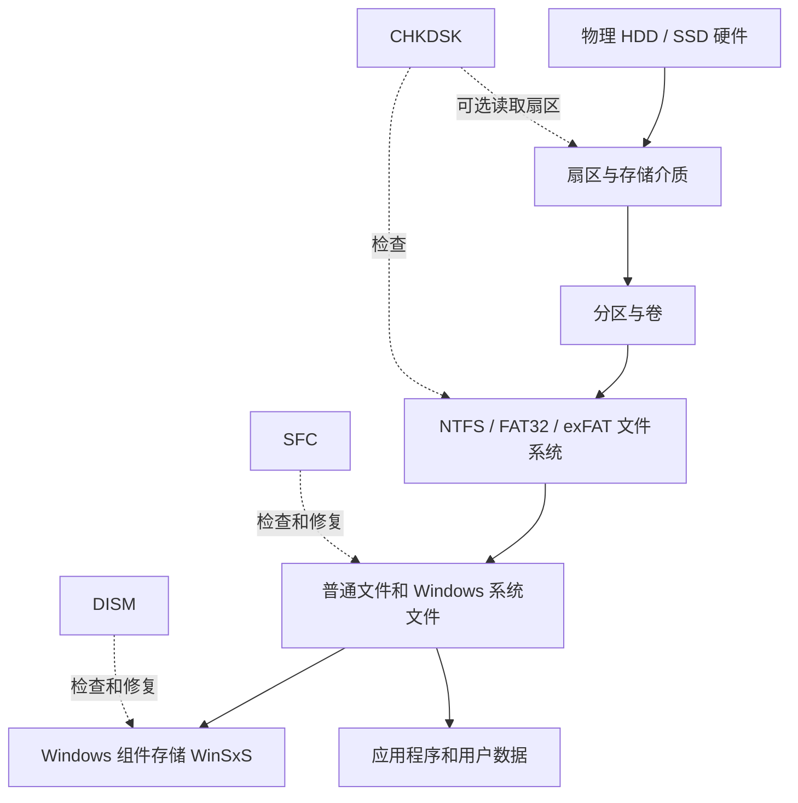

# CHKDSK、SFC 与 DISM：Windows 检查与修复工具

## 一句话解释

> **CHKDSK 检查磁盘卷上的文件系统，SFC 检查正在使用的 Windows 受保护系统文件，DISM 检查和修复 Windows 组件存储或系统映像；它们处理不同层级，不能互相替代。**

最先记住这张表：

| 工具 | 英文与中文 | 主要检查什么 | 常用命令 |
|---|---|---|---|
| `CHKDSK` | Check Disk，磁盘检查 | 文件系统结构、元数据、逻辑错误；可选检查坏扇区 | `chkdsk C: /scan` |
| `SFC` | System File Checker，系统文件检查器 | 当前 Windows 的受保护系统文件 | `sfc /scannow` |
| `DISM` | Deployment Image Servicing and Management，部署映像服务和管理 | Windows 系统映像、组件存储、功能和更新组件 | `DISM /Online /Cleanup-Image /RestoreHealth` |

---

## 一、生活类比：医院的三个检查科室

可以把 Windows 想成一家正在营业的医院。

### CHKDSK：检查楼房、档案柜和编号

它检查：

- 哪个房间属于哪个科室；
- 档案目录是否指向正确文件；
- 空闲空间记录是否正确；
- 有没有一个空间被重复登记；
- 某些物理位置是否已经无法可靠读取。

这里对应的是磁盘卷和文件系统结构。

### SFC：检查正在上岗的标准设备

它检查：

- Windows 正在使用的系统文件是不是正确版本；
- 文件有没有损坏、丢失或被错误替换；
- 能不能从系统保存的正确副本中还原。

### DISM：检查存放标准备件的中央仓库

它检查：

- Windows 用来安装功能、更新和修复系统文件的组件仓库；
- 仓库本身是否损坏；
- 能不能从 Windows Update 或指定来源补充正确组件。

因此常见关系是：

```text
DISM 修备件仓库
        ↓
SFC 用仓库里的正确备件修正在岗系统文件
```

如果连备件仓库都坏了，SFC 就可能报告发现损坏但无法修复。

---

## 二、它们在 Windows 的哪一层工作



注意这只是帮助理解的分层图：真实 Windows 中，系统文件、组件存储、硬链接和服务机制之间还有更复杂的关系。

---

## 三、运行前先做什么

### 1. 先判断是不是硬盘正在物理故障

如果出现以下迹象，不要第一时间对重要盘反复运行 `chkdsk /r`：

- 机械硬盘有异常敲击或摩擦声；
- 磁盘时而出现、时而消失；
- 复制文件时大量 I/O 错误；
- S.M.A.R.T. 报警；
- 坏扇区数量持续增加；
- 系统频繁卡死，磁盘响应时间异常；
- 盘里有唯一一份非常重要的数据。

此时优先级通常应该是：

```text
停止不必要写入
→ 备份或制作尽可能完整的镜像
→ 检查硬盘健康信息
→ 必要时寻求专业数据恢复
→ 再决定是否运行修复命令
```

CHKDSK 是文件系统修复工具，不是专业的数据恢复工具。修复文件系统会写入磁盘，可能改变原有结构；对于正在严重物理故障的盘，长时间全盘读取也可能增加压力。

备份和故障恢复思想见 [[高可用、健康检查与故障恢复]]。

### 2. 备份重要数据

特别是在运行这些命令以前：

- `chkdsk /f`；
- `chkdsk /r`；
- `chkdsk /x`；
- 离线修复；
- 手工替换系统文件；
- 使用安装介质做系统修复。

任何“修复结构”的操作都不等于备份。

### 3. 保证电源稳定

笔记本接上电源，台式机尽量避免在可能断电的时候修复。不要因为进度一段时间没变化就立刻强制关机。

### 4. 先安装更新并重启

针对 SFC/DISM，微软面向 Windows 10/11 的当前支持文档建议先安装最新 Windows 更新并重启，再执行修复。

这样可以先完成已经挂起的更新操作，减少组件仍在变更造成的干扰。

### 5. 使用管理员终端

大多数修复操作需要管理员权限。

操作方法：

1. 在开始菜单搜索“终端”“PowerShell”或“命令提示符”；
2. 右键选择“以管理员身份运行”；
3. 核对 [[Windows UAC与管理员权限提升|UAC]] 提示中的程序；
4. 点击“是”。

CMD、PowerShell 与命令参数基础见 [[CMD、Bash与PowerShell]]。

---

## 四、什么时候应该使用哪个工具

| 症状 | 优先考虑 | 原因 |
|---|---|---|
| 突然断电后提示扫描驱动器 | CHKDSK | 可能是文件系统结构未正确落盘 |
| 某个卷提示“文件或目录损坏且无法读取” | CHKDSK，并先备份 | 可能有文件系统或介质问题 |
| Windows 自带功能打不开、系统组件报错 | DISM → SFC | 可能是组件存储或系统文件损坏 |
| Windows Update 因组件损坏失败 | DISM → SFC | DISM 可以修组件存储 |
| SFC 找到损坏但无法修复 | DISM → 再运行 SFC | SFC 的修复来源可能有问题 |
| 单个游戏崩溃 | 先查游戏、驱动、运行库和日志 | 通常不应一上来就运行三件套 |
| 浏览器无法上网 | 先查 DNS、代理、防火墙和网络 | 不一定与磁盘或系统文件有关 |
| 机械盘异响、掉盘、SMART 报警 | 先备份和评估硬件 | CHKDSK 不能修复损坏的硬件 |
| 误删自己的照片或文档 | 停止写入并考虑数据恢复 | SFC 只管受保护系统文件 |
| 怀疑病毒 | 使用 Defender/安全工具 | UAC、SFC、DISM 都不是完整杀毒工具 |

---

## 五、CHKDSK 是什么

`CHKDSK` 来自 **Check Disk**，可以理解为“检查磁盘”。

更准确地说，它检查指定**卷**上的：

- 文件系统逻辑结构；
- 文件和目录元数据；
- NTFS 主文件表等结构；
- 空闲空间和已分配空间记录；
- 安全描述符等元数据；
- 使用特定参数时，可读取扇区并寻找无法可靠读取的位置。

### 磁盘、分区、卷和盘符不是完全一样

初学阶段可以这样理解：

- **物理磁盘**：一块 HDD、SSD 或 NVMe 设备；
- **分区**：物理磁盘上划出的区域；
- **卷**：Windows 可以挂载和使用的文件系统空间；
- **盘符**：例如 `C:`、`D:`，是卷的一种访问入口。

`chkdsk C:` 中的 `C:` 指向一个卷，不代表它检查电脑里的所有物理磁盘。

---

## 六、CHKDSK 最常用的参数

### 1. `chkdsk C:`：只检查状态

```cmd
chkdsk C:
```

不带 `/f`、`/r`、`/x` 等修复参数时，主要检查并显示状态，不主动修复错误。

需要注意：对正在活跃使用、无法锁定的卷进行只读检查时，可能因数据持续变化而出现不准确或看似矛盾的报告。

### 2. `chkdsk C: /scan`：NTFS 在线扫描

```cmd
chkdsk C: /scan
```

- 只适用于 NTFS；
- 在卷保持在线时扫描；
- 适合作为 Windows 正常运行时的初步检查；
- 某些需要离线修复的问题会被记录下来，之后再进行修复。

### 3. `/f`：修复文件系统逻辑错误

```cmd
chkdsk D: /f
```

`/f` 表示 **fix**：

- 修正文件系统逻辑错误；
- 需要锁定目标卷；
- 如果目标卷正在使用，Windows 可能要求下次重启时检查；
- 它不等于逐扇区检查硬件。

如果检查系统盘 `C:` 时看到：

```text
Would you like to schedule this volume to be checked
the next time the system restarts? (Y/N)
```

输入 `Y` 表示安排在下次启动阶段检查，因为那时普通 Windows 程序还没有占用系统盘中的大量文件。

### 4. `/r`：寻找坏扇区并尝试恢复可读信息

```cmd
chkdsk D: /r
```

`/r` 会：

- 包含 `/f` 的功能；
- 寻找文件系统可见的坏扇区；
- 尝试读取并恢复仍能读取的数据；
- 标记相应坏簇，避免文件系统继续使用；
- 读取范围大，可能耗时非常长。

关键边界：

> `/r` 可以处理文件系统如何避开坏簇，但不能让磨损、损坏的磁头、NAND、控制器或线缆恢复健康。

如果坏扇区继续增加，应考虑备份和更换硬盘。

### 5. `/x`：强制卸载卷

```cmd
chkdsk D: /x
```

`/x` 会在需要时强制卸载卷，并包含 `/f` 功能。

风险在于：

- 指向该卷的已打开句柄会失效；
- 正在使用该卷的程序可能报错；
- 未保存的数据可能受影响。

不要在不了解影响时对正在工作的数据盘随便使用 `/x`。

### 6. `/spotfix`：离线修复已发现的问题

```cmd
chkdsk C: /spotfix
```

- 只适用于 NTFS；
- 对已经发现的问题执行针对性修复；
- 通常需要卷离线；
- 系统盘可能安排到重启阶段。

### 7. `/offlinescanandfix`：离线扫描并修复

```cmd
chkdsk D: /offlinescanandfix
```

它要求目标卷离线进行扫描和修复，适合在线检查无法完成的情况。

### 8. `/b`：重新评估坏簇列表

`/b` 只适用于 NTFS，会清除已有坏簇列表后重新扫描已分配和空闲簇，并包含 `/r`。

微软给出的典型用途是：把卷映像恢复到一块新的硬盘以后，重新评估旧盘留下的坏簇标记。

这是非常重的操作，不是日常维护参数。

---

## 七、`/f`、`/r` 和 `/x` 的关系

```text
/f = 修复逻辑文件系统错误
/r = /f + 扫描坏扇区 + 尝试恢复可读信息
/x = 必要时强制卸载卷 + /f
/b = 重新扫描坏簇列表 + /r
```

所以没有必要写成：

```cmd
chkdsk D: /f /r
```

因为 `/r` 已经包含 `/f`。写在一起通常也能识别，但理解包含关系更重要。

---

## 八、CHKDSK 会不会伤 SSD

偶尔正常使用 CHKDSK 检查 SSD，一般不构成显著问题。

但要区分：

- 普通文件系统在线扫描；
- `/f` 修复逻辑结构；
- `/r` 或 `/b` 的全盘读取和相关处理。

微软文档指出，反复进行完整表面扫描，尤其是 `/r`，可能造成不必要的读写/擦除周期，略微影响 SSD 寿命；偶尔检查则不是显著问题。

更实际的问题通常是：

- `/r` 很耗时；
- 它不能代替 SSD 的 S.M.A.R.T. 和厂商诊断；
- 它不会修复已经磨损的闪存硬件；
- 没有迹象时不需要天天运行。

---

## 九、CHKDSK 不能做什么

CHKDSK 不能：

- 修复机械硬盘磁头；
- 修复 SSD 控制器或 NAND 磨损；
- 修复松动的 SATA/USB 线缆；
- 保证找回误删文件；
- 修复所有 Windows 系统文件；
- 清除病毒；
- 自动解决所有蓝屏；
- 让电脑“优化加速”；
- 检查映射到网络共享的盘符；
- 替代备份。

---

## 十、怎样查看 CHKDSK 结果

如果在当前终端运行，结束时会直接显示报告。

如果系统盘在启动阶段检查，可以打开：

```text
事件查看器
→ Windows 日志
→ 应用程序
```

然后查找来源为：

- `Wininit`；
- `Chkdsk`。

也可以在管理员 PowerShell 中进行筛选：

```powershell
Get-WinEvent -FilterHashtable @{LogName='Application'; Id=1001} |
  Where-Object ProviderName -Match 'Wininit|Chkdsk' |
  Select-Object -First 1 -ExpandProperty Message
```

这段命令的作用是：

1. 读取“应用程序”事件日志；
2. 筛选常见的检查磁盘事件；
3. 显示最近一条匹配记录的正文。

---

## 十一、SFC 是什么

`SFC` 全称是 **System File Checker**，中文是“系统文件检查器”。

它由 **Windows Resource Protection（Windows 资源保护）**机制支持，用于：

- 扫描受保护的 Windows 系统文件；
- 验证文件完整性和正确版本；
- 发现丢失、损坏或错误版本；
- 在可能的情况下替换成正确副本。

这里的“系统文件”不是你电脑上的所有文件。

SFC 不会检查和修复：

- 你的照片、视频和文档；
- 普通第三方软件的全部文件；
- 游戏资源包；
- 浏览器扩展；
- 硬盘坏扇区；
- 文件系统目录结构。

---

## 十二、最常用的 SFC 命令

### 1. 扫描并修复全部受保护系统文件

```cmd
sfc /scannow
```

它会：

1. 扫描所有受保护系统文件；
2. 比对完整性和版本；
3. 发现问题时尝试替换；
4. 到 100% 后显示结论。

不要在验证尚未完成时关闭终端。

### 2. 只检查，不修复

```cmd
sfc /verifyonly
```

适合只想确认有没有完整性问题，而暂时不想执行修复的情况。

### 3. 检查并修复指定文件

```cmd
sfc /scanfile=C:\Windows\System32\kernel32.dll
```

这只针对指定的受保护文件。

### 4. 只验证指定文件

```cmd
sfc /verifyfile=C:\Windows\System32\kernel32.dll
```

只检查，不修复。

### 5. 离线扫描

当 Windows 无法正常启动时，可以在恢复环境中指定离线系统：

```cmd
sfc /scannow /offbootdir=D:\ /offwindir=D:\Windows
```

这里的 `D:` 只是示例。进入 Windows 恢复环境后，原本的 `C:` 可能变成其他盘符，必须先确认实际卷，不要照抄。

---

## 十三、SFC 的四种常见结果

### 结果 1：没有发现完整性冲突

```text
Windows Resource Protection did not find any integrity violations.
```

说明本次扫描没有发现受保护系统文件损坏。

它不代表：

- 硬盘绝对健康；
- 第三方软件没有问题；
- 没有病毒；
- 所有驱动和设置都正确。

### 结果 2：发现损坏并成功修复

```text
Windows Resource Protection found corrupt files and successfully repaired them.
```

建议：

1. 重启；
2. 再运行一次 `sfc /scannow`；
3. 确认不再报告损坏；
4. 检查原问题是否消失。

### 结果 3：发现损坏，但有些无法修复

```text
Windows Resource Protection found corrupt files but was unable to fix some of them.
```

通常下一步是：

```cmd
DISM /Online /Cleanup-Image /RestoreHealth
sfc /scannow
```

因为 SFC 使用的修复来源可能损坏或缺失。

### 结果 4：无法执行请求的操作

```text
Windows Resource Protection could not perform the requested operation.
```

可能需要：

- 重启后再试；
- 完成挂起的 Windows Update；
- 在安全模式运行；
- 检查文件系统；
- 检查 `%WinDir%\WinSxS\Temp` 相关状态；
- 使用恢复环境进行离线扫描；
- 查看 CBS 日志确定失败位置。

---

## 十四、怎样查看 SFC 日志

SFC 的详细信息会进入：

```text
%windir%\Logs\CBS\CBS.log
```

这个文件很大，而且还包含其他 Component-Based Servicing（基于组件的服务）记录。

微软文档给出的筛选方式是：

```cmd
findstr /c:"[SR]" %windir%\Logs\CBS\CBS.log > "%userprofile%\Desktop\sfcdetails.txt"
```

它的作用是：

1. 在 CBS 日志里寻找带 `[SR]` 的 SFC 记录；
2. 把匹配行写到桌面的 `sfcdetails.txt`；
3. 方便查看最近一次哪些文件无法修复。

注意 `sfcdetails.txt` 可能包含多次运行记录，要结合日期和时间判断。

---

## 十五、DISM 是什么

`DISM` 全称是：

> **Deployment Image Servicing and Management**

中文通常翻译为：

> **部署映像服务和管理**

这里的 **Image（映像）**不是普通图片，而是一套 Windows 系统内容和组件的可部署表示。

DISM 的用途很广，可以：

- 检查和修复 Windows 组件存储；
- 维护正在运行的 Windows；
- 维护离线 Windows 映像；
- 添加或删除更新包；
- 启用或禁用 Windows 功能；
- 处理驱动、语言包和部署映像。

普通个人电脑排错时，最常用的是：

```cmd
DISM /Online /Cleanup-Image /RestoreHealth
```

---

## 十六、什么是 Windows 组件存储

Windows 需要一套可信的组件，用于：

- 安装或卸载功能；
- 应用系统更新；
- 维护不同组件版本；
- 修复受保护系统文件；
- 保持系统组件之间的一致性。

这些内容与 `C:\Windows\WinSxS` 密切相关，通常称为 **Component Store（组件存储）**。

不要把 WinSxS 简单理解成“可以手动删除的重复文件夹”。其中还可能使用硬链接等文件系统机制，资源管理器看到的表面大小不等于真实可回收空间。

不要手工删除 WinSxS 内容。

---

## 十七、读懂 DISM 命令

```cmd
DISM /Online /Cleanup-Image /RestoreHealth
```

逐段解释：

### `DISM`

启动部署映像服务和管理工具。

### `/Online`

目标是当前正在运行的 Windows，而不是“需要联网”。

这是一个非常常见的误区：

> `/Online` 表示在线运行中的系统映像，不等于“网络在线”。

不过没有指定修复来源时，DISM 可能需要通过 Windows Update 获取正确组件，所以实际修复仍可能使用网络。

### `/Cleanup-Image`

选择针对映像执行清理、检查或恢复操作的功能组。

它不是在删除你的照片、下载文件或文档。

### `/RestoreHealth`

扫描组件存储损坏并自动执行修复。

---

## 十八、DISM 的三个健康检查参数

### 1. `/CheckHealth`：快速查看已记录状态

```cmd
DISM /Online /Cleanup-Image /CheckHealth
```

它主要查看系统是否已经被标记为损坏，以及损坏是否可修复。

- 速度通常很快；
- 不执行完整扫描；
- 不修复。

所以“CheckHealth 没发现问题”不能完全等同于做过深度扫描。

### 2. `/ScanHealth`：实际扫描组件存储

```cmd
DISM /Online /Cleanup-Image /ScanHealth
```

- 执行更深入的组件存储扫描；
- 可能需要几分钟或更久；
- 只检查，不修复。

### 3. `/RestoreHealth`：扫描并修复

```cmd
DISM /Online /Cleanup-Image /RestoreHealth
```

- 扫描组件存储；
- 发现可修复损坏时执行修复；
- 默认可能使用 Windows Update 或策略指定的来源；
- 可能长时间停留在某个进度数字，但不一定真的卡死。

### 三者的关系

```text
/CheckHealth  = 快速读现有损坏标记
/ScanHealth   = 做实际扫描，但不修
/RestoreHealth = 扫描并修复
```

如果你已经确定要修复，通常不必为了形式把三个命令全部依次执行；`RestoreHealth` 本身会扫描并修复。

---

## 十九、DISM 从哪里取得修复文件

### 默认来源

在未指定 `/Source` 时，当前在线 Windows 通常会依据系统配置，尝试使用 Windows Update 或功能按需安装的修复来源。

因此 DISM 失败有时不是“DISM 工具坏了”，而是：

- Windows Update 服务有问题；
- 系统代理或网络阻止访问；
- 企业组策略指定了其他来源；
- 找不到与当前版本匹配的组件；
- 组件存储损坏过重。

### 指定修复来源

概念示例：

```cmd
DISM /Online /Cleanup-Image /RestoreHealth /Source:C:\RepairSource\Windows /LimitAccess
```

含义：

- `/Source`：指定可信的正确文件来源；
- `/LimitAccess`：不再访问 Windows Update。

安装镜像中常见的是 `install.wim` 或 `install.esd`。使用 WIM 时可能类似：

```cmd
DISM /Online /Cleanup-Image /RestoreHealth /Source:wim:E:\sources\install.wim:6 /LimitAccess
```

但这只是语法示例，不能直接照抄：

- `E:` 要替换为实际安装介质盘符；
- `6` 是映像索引示例；
- Windows 版本、Edition、语言、架构和构建应尽量匹配；
- 有的介质使用 `install.esd`，前缀语法不同；
- 索引不匹配可能导致找不到源文件。

可以先查看 WIM 中包含的版本：

```cmd
DISM /Get-WimInfo /WimFile:E:\sources\install.wim
```

如果不确定映像版本和索引，不要盲目执行来源修复。

---

## 二十、怎样查看 DISM 日志

DISM 的主要日志通常位于：

```text
%windir%\Logs\DISM\dism.log
```

组件服务相关问题还可能需要查看：

```text
%windir%\Logs\CBS\CBS.log
```

查看日志时重点找：

- 最后一次运行的时间；
- `Error`；
- 错误码；
- `source`；
- `corrupt`；
- `repair`；
- 哪个 package 或 component 失败。

不要看到一个旧错误就认为它一定属于当前这次运行。

---

## 二十一、为什么微软推荐 DISM 后运行 SFC

可以把它们的关系画成：


当前微软支持文档给出的顺序是：

```cmd
DISM.exe /Online /Cleanup-Image /RestoreHealth
sfc /scannow
```

原因是 DISM 先为后续系统文件修复提供健康的组件来源。

如果之前已经先运行了 SFC，也不用恐慌。可以在 DISM 成功后再运行一次 SFC。

---

## 二十二、适合普通用户的安全操作顺序

### 情况 A：Windows 功能异常，但磁盘没有明显故障迹象

1. 保存工作并备份重要数据；
2. 安装 Windows Update；
3. 重启电脑；
4. 打开管理员终端；
5. 运行：

```cmd
DISM /Online /Cleanup-Image /RestoreHealth
```

6. 等待成功完成；
7. 运行：

```cmd
sfc /scannow
```

8. 重启；
9. 再运行一次 SFC 确认；
10. 检查原始故障是否消失。

### 情况 B：突然断电后怀疑文件系统错误

1. 先备份重要文件；
2. 查看磁盘健康状态；
3. 对 NTFS 卷先运行在线扫描：

```cmd
chkdsk C: /scan
```

4. 如果报告需要离线修复，再根据提示安排重启或使用 `/spotfix`；
5. 如果 Windows 系统文件仍异常，再执行 DISM → SFC。

### 情况 C：怀疑硬盘物理故障

1. 不要继续大量写入；
2. 优先复制最重要的数据；
3. 获取 S.M.A.R.T. 和厂商诊断结果；
4. 必要时制作磁盘镜像；
5. 重要数据不可替代时，考虑专业数据恢复；
6. 不要先用 `/r` 长时间“拷打”故障盘。

---

## 二十三、这三个工具要不要全部运行

不需要形成“电脑有一点问题，就固定运行三件套”的习惯。

### 应该根据问题分层

```text
磁盘卷/文件系统问题 → CHKDSK
Windows受保护系统文件问题 → SFC
组件存储/更新来源问题 → DISM
硬件健康问题 → SMART、厂商诊断、备份和更换
第三方应用问题 → 应用日志、重装、配置、依赖和兼容性
网络问题 → DNS、代理、路由、防火墙和服务状态
恶意软件问题 → Defender/EDR 和安全响应
```

无针对性地运行修复命令，可能：

- 浪费很多时间；
- 让你误以为“没有报错就代表所有硬件正常”；
- 掩盖真正的驱动、应用、网络或硬件原因；
- 在故障磁盘上增加不必要的读取压力。

---

## 二十四、为什么命令可能长时间停在某个百分比

常见原因包括：

- 正在处理大量组件或文件；
- 硬盘速度慢；
- HDD 正在频繁寻道；
- `/r` 正在读取大量扇区；
- DISM 正在等待 Windows Update 或修复源；
- 系统正在处理组件事务；
- 磁盘本身存在读重试或硬件问题。

百分比显示不是线性计时器。

例如从 20% 到 40% 不一定和从 40% 到 60% 花同样时间。

正确做法是：

1. 保持供电；
2. 观察磁盘、CPU 和网络是否仍有活动；
3. 查看对应日志是否继续更新；
4. 不要因为十几分钟没跳数字就立刻强制关机；
5. 如果已经异常数小时，再结合硬件状态和日志判断。

微软明确不建议中断 CHKDSK。官方同时说明，中断通常不会让卷比开始检查前更加损坏，但应该重新运行以检查和完成剩余修复。实际操作中仍应尽量避免强制中断。

---

## 二十五、管理员权限和 UAC 为什么重要

这些工具需要读取或修改系统级资源：

- 锁定或修复卷；
- 访问受保护系统文件；
- 维护组件存储；
- 读取系统日志；
- 在启动阶段安排磁盘检查。

因此普通终端可能返回：

- `Access Denied`；
- 必须以管理员身份运行；
- 需要提升权限；
- 无法锁定当前驱动器。

这涉及当前进程使用的访问令牌，详见 [[Windows UAC与管理员权限提升]]。

即使已经提升，目标对象的 [[Windows ACL与NTFS权限|ACL]] 和其他保护机制仍然有效。

---

## 二十六、不要混淆的命令与操作

### 1. CHKDSK 不等于磁盘碎片整理

- CHKDSK 检查文件系统一致性；
- Optimize Drives 负责针对介质执行优化；
- SSD 通常涉及 TRIM，不是传统机械盘式碎片整理。

### 2. SFC 不等于重装 Windows

SFC 只处理受保护系统文件，不会把整个系统恢复成出厂状态。

### 3. DISM `/RestoreHealth` 不等于删除个人文件

它针对组件存储和映像健康进行修复，不是“重置此电脑”。

### 4. DISM 不只是修复工具

DISM 还是完整的系统映像部署和服务工具。添加驱动、功能、更新包和维护离线映像也是它的工作。

### 5. `/Online` 不等于联网

它表示目标是当前运行的 Windows；是否访问网络取决于修复来源和系统策略。

---

## 二十七、哪些 DISM 参数不要随便照抄

网上经常出现很长的“万能 DISM 命令”。初学者尤其要小心下面这些操作。

### `/ResetBase`

例如：

```cmd
DISM /Online /Cleanup-Image /StartComponentCleanup /ResetBase
```

微软文档说明，执行带 `/ResetBase` 的组件清理以后，已经安装的 Windows 更新将不能再卸载。

它不是修复系统文件的必需步骤，不应因为想“清理 C 盘”就随便运行。

### `/RevertPendingActions`

它用于特定的离线系统恢复场景，尝试撤销导致启动失败的挂起维护操作，不支持对正在运行的系统随便使用。

### 不明来源的 `/Source`

版本、语言、架构和 Edition 不匹配的来源可能修复失败。不要从陌生网站下载所谓的“系统 DLL 修复包”。

---

## 二十八、如果 DISM 或 SFC 仍然修不好怎么办

可以按风险从低到高继续排查：

1. 记录完整错误消息和错误码；
2. 查看 `DISM.log` 与 `CBS.log`；
3. 确认 Windows Update、网络、代理和系统时间正常；
4. 重启后重新运行 DISM → SFC；
5. 在安全模式运行 SFC；
6. 使用匹配版本的 Windows 安装介质作为 DISM 来源；
7. 在 Windows 恢复环境中做离线修复；
8. 使用系统还原或“修复安装/就地升级”；
9. 确认硬盘和内存没有硬件故障；
10. 备份数据后再考虑重置或重装 Windows。

手工取得系统文件所有权并替换文件属于高风险操作。虽然微软文档提供了流程，但初学者不应在没有确认文件版本、签名和依赖关系时盲目操作。

---

## 二十九、常见误区

### 误区 1：这三个命令是“一键修复所有 Windows 问题”

错误。它们只覆盖磁盘文件系统、受保护系统文件和组件存储等特定层级。

### 误区 2：`chkdsk /r` 越常跑越健康

错误。它是耗时的全盘读取检查，不是日常优化命令。

### 误区 3：CHKDSK 找到坏扇区并修好，硬盘就恢复健康

错误。它可能标记坏簇并尝试救出可读数据，但硬件故障仍然存在，并且可能继续发展。

### 误区 4：SFC 会扫描电脑上的所有文件

错误。它主要扫描受 Windows 资源保护的系统文件。

### 误区 5：SFC 没报错，电脑硬件就没问题

错误。SFC 不负责检查 CPU、内存、显卡、硬盘机械结构或 SSD 寿命。

### 误区 6：DISM `/Online` 必须联网

错误。`/Online` 表示当前运行的系统；但默认修复来源可能需要 Windows Update。

### 误区 7：DISM 卡在 62.3% 就一定死机

错误。进度可能长时间停留。应结合磁盘、网络、进程活动和日志判断。

### 误区 8：系统盘无法锁定说明 CHKDSK 坏了

错误。正在运行的 Windows 必然占用大量系统盘文件，需要修复时通常会安排在重启阶段。

### 误区 9：修复命令可以替代备份

错误。修复解决结构和组件问题，备份解决数据副本和灾难恢复问题。

### 误区 10：网上的长命令越多越专业

错误。命令应针对故障层级。参数越激进，影响范围和不可逆风险可能越大。

---

## 三十、典型故障案例

### 案例 1：Windows 更新后设置应用打不开

合理顺序：

```cmd
DISM /Online /Cleanup-Image /RestoreHealth
sfc /scannow
```

然后重启并检查设置应用。

### 案例 2：突然断电后 D 盘目录报错

先备份仍能读取的文件，然后：

```cmd
chkdsk D: /scan
```

根据扫描结论决定是否：

```cmd
chkdsk D: /f
```

同时检查磁盘健康，避免只修文件系统而忽略硬件问题。

### 案例 3：SFC 报告无法修复部分文件

运行：

```cmd
DISM /Online /Cleanup-Image /RestoreHealth
sfc /scannow
```

若 DISM 报找不到源文件，再调查 Windows Update 或使用匹配安装介质。

### 案例 4：机械硬盘异响而且复制速度降到零

不要先跑 `/r`。优先断开不必要程序、复制最重要的数据、检查 SMART，并评估是否需要专业恢复。

### 案例 5：只有某个游戏启动失败

先看：

- 游戏文件验证；
- 显卡驱动；
- DirectX、Visual C++ 运行库；
- 反作弊；
- 游戏日志；
- 插件和覆盖层；
- 权限与防病毒拦截。

SFC/DISM 可以作为有系统组件损坏证据时的后续步骤，不应自动成为第一步。

---

## 三十一、最实用的速查表

### Windows 系统组件异常

```cmd
DISM /Online /Cleanup-Image /RestoreHealth
sfc /scannow
```

### 只验证系统文件

```cmd
sfc /verifyonly
```

### NTFS 在线检查

```cmd
chkdsk C: /scan
```

### 修复非系统卷文件系统

```cmd
chkdsk D: /f
```

### 查组件存储是否已有损坏标记

```cmd
DISM /Online /Cleanup-Image /CheckHealth
```

### 深度扫描组件存储但不修复

```cmd
DISM /Online /Cleanup-Image /ScanHealth
```

### 查看 SFC 筛选日志

```cmd
findstr /c:"[SR]" %windir%\Logs\CBS\CBS.log > "%userprofile%\Desktop\sfcdetails.txt"
```

---

## 三十二、初学者学习顺序

1. 先理解 [[CMD、Bash与PowerShell|终端、命令和参数]]；
2. 理解 [[Windows UAC与管理员权限提升|管理员终端为什么需要 UAC]]；
3. 区分物理磁盘、分区、卷、文件系统和普通文件；
4. 学会用症状判断 CHKDSK、SFC、DISM 的层级；
5. 先学习只读检查，再学习会修改数据的修复参数；
6. 最后再了解离线映像、WIM、WinRE 和组件服务。

---

## 三十三、最后记忆

如果只记住八句话，请记住：

1. **CHKDSK 管文件系统和磁盘卷。**
2. **SFC 管 Windows 受保护系统文件。**
3. **DISM 管 Windows 映像和组件存储。**
4. **修系统文件时，微软当前推荐先 DISM，后 SFC。**
5. **`chkdsk /r` 包含 `/f`，还会进行大范围扇区读取，可能很久。**
6. **硬盘出现物理故障迹象时先备份，不要先反复全盘扫描。**
7. **`DISM /Online` 表示当前运行的 Windows，不等于必须联网。**
8. **三种工具都不能替代备份、硬件诊断、杀毒和针对性排错。**

最短公式：

```text
磁盘文件系统 → CHKDSK
Windows系统文件 → SFC
系统文件的组件来源 → DISM
```

---

## 参考资料

以下均为微软官方资料，核对日期：**2026-08-23**。

- [Microsoft Learn：chkdsk 命令](https://learn.microsoft.com/en-us/windows-server/administration/windows-commands/chkdsk)
- [Microsoft Learn：sfc 命令](https://learn.microsoft.com/en-us/windows-server/administration/windows-commands/sfc)
- [Microsoft Support：使用 DISM 和 SFC 修复缺失或损坏的系统文件](https://support.microsoft.com/en-us/windows/experience/backup-recovery/use-the-system-file-checker-tool-to-repair-missing-or-corrupted-system-files)
- [Microsoft Support：Using System File Checker in Windows](https://support.microsoft.com/en-US/Windows/Experience/backup-recovery/using-system-file-checker-in-windows)
- [Microsoft Learn：Repair a Windows Image](https://learn.microsoft.com/en-us/windows-hardware/manufacture/desktop/repair-a-windows-image?view=windows-11)
- [Microsoft Learn：DISM 操作系统包服务命令](https://learn.microsoft.com/en-us/windows-hardware/manufacture/desktop/dism-operating-system-package-servicing-command-line-options?view=windows-11)
