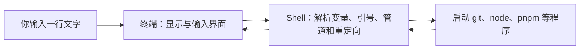

# CMD、Bash 与 PowerShell

> [!summary] 一句话解释
> **CMD、Bash 和 PowerShell 都是 Shell——读取你输入的命令、解释语法并启动程序的命令解释器；它们的语法和擅长场景不同。**

## 先分清终端和 Shell

初学者最容易把下面几个东西都叫“命令行”：

| 概念 | 是什么 | 类比 |
|---|---|---|
| Terminal（终端） | 显示文字、接收键盘输入的窗口或界面 | 电话机 |
| Shell（壳层/命令解释器） | 理解命令语法并组织程序运行 | 接线员 |
| Command（命令） | 你要求计算机执行的具体指令 | 你说的话 |
| CLI（Command-Line Interface，命令行界面） | 一个程序通过文本命令提供的操作入口 | 某项电话服务的菜单 |

Windows Terminal、VS Code 集成终端属于“终端界面”。它们里面可以运行 CMD、PowerShell、Bash 等不同 Shell。



## CMD 是什么

**CMD** 通常指 Windows 的命令解释器 `cmd.exe`，也常被叫作 **Command Prompt（命令提示符）**。运行 `cmd` 会启动一个新的 Windows 命令解释器实例。

它主要用于：

- 运行传统 Windows 命令；
- 执行 `.bat` 或 `.cmd` 批处理脚本；
- 兼容历史工具和旧式自动化流程。

几个基础命令：

```bat
dir
cd D:\krxstudy
set NAME=Alice
echo %NAME%
```

- `dir`：列出当前目录内容；
- `cd`：切换目录；
- `set`：设置变量；
- `%NAME%`：读取 CMD 环境变量。

CMD 历史很长、兼容性好，但脚本语言能力和数据处理体验相对有限。

## Bash 是什么

**Bash** 的全称是 **Bourne-Again SHell**，读作“拜什”。它是 GNU 项目的 Shell，也是 Unix/Linux 世界最常见的 Shell 之一。

它既可以交互式接收命令，也是一种脚本语言，支持：

- 变量；
- 条件和循环；
- 函数；
- 管道与重定向；
- 把多条命令写进 `.sh` 文件自动执行。

几个基础命令：

```bash
ls
cd /home/alice/project
export NAME=Alice
echo "$NAME"
```

- `ls`：列出目录内容；
- `/home/...`：Unix 风格路径；
- `export`：把变量导出给子进程；
- `$NAME`：读取变量。

Shell 脚本的第一行常写：

```bash
#!/usr/bin/env bash
```

这叫 **shebang（解释器声明）**，大意是“请找到 Bash，并用它解释这个文件”。

### Windows 上为什么也会看到 Bash

Windows 原生主要提供 CMD 和 PowerShell，但可以通过以下环境使用 Bash：

- **Git Bash**：安装 Git for Windows 时常见的 Unix 风格命令环境；
- **WSL（Windows Subsystem for Linux，适用于 Linux 的 Windows 子系统）**；
- MSYS2、Cygwin 等兼容环境；
- 容器或远程 Linux 服务器。

Git Hook 和很多开源项目脚本使用 `sh`/Bash 语法，所以 Windows 开发者也经常遇到它。

## PowerShell 是什么

**PowerShell** 是现代 Windows 中常用的 Shell 和自动化语言。你的这个 Obsidian 仓库当前就是由 PowerShell 环境操作的。

它与 CMD/Bash 的一个重要区别是：PowerShell 管道主要传递结构化的 .NET 对象，而传统 Shell 管道通常传递文本。这使它很适合管理 Windows、筛选对象属性和编写系统自动化脚本。

```powershell
Get-ChildItem
Set-Location 'D:\krxstudy'
$env:NAME = 'Alice'
$env:NAME
```

PowerShell 命令常叫 **Cmdlet（命令小程序）**，一般采用“动词-名词”形式，如 `Get-ChildItem`。

## 三者的常用语法对照

| 目的 | CMD | Bash | PowerShell |
|---|---|---|---|
| 列出文件 | `dir` | `ls` | `Get-ChildItem` |
| 查看当前目录 | `cd` | `pwd` | `Get-Location` |
| 切换目录 | `cd 路径` | `cd 路径` | `Set-Location 路径` |
| 读取环境变量 | `%NAME%` | `$NAME` | `$env:NAME` |
| 设置环境变量 | `set NAME=value` | `export NAME=value` | `$env:NAME = 'value'` |
| 脚本扩展名 | `.bat`、`.cmd` | 常见 `.sh` | `.ps1` |
| 常见路径样式 | `C:\Users\...` | `/home/...` | `C:\Users\...` |

表里只展示常用写法。某些命令是 Shell 内建命令，某些是独立程序或别名，所以在不同机器上的表现可能略有差异。

## 为什么 `git`、`node`、`pnpm` 在多个 Shell 中都能运行

`git`、`node` 和 `pnpm` 通常是独立的可执行程序，不专属于某一个 Shell。

当你输入：

```text
pnpm install
```

Shell 会大致执行：

1. 按自己的语法解析这一行；
2. 从 `PATH` 环境变量列出的目录中查找 `pnpm`；
3. 把 `install` 作为参数交给 pnpm；
4. 等待程序结束并接收退出状态码。

因此，只要程序安装正确并位于 `PATH` 中，同一个 `git status` 或 `node app.js` 经常能在 CMD、Bash 和 PowerShell 中运行。但变量、引号、路径、通配符、管道和重定向仍由各自的 Shell 解释，复杂命令不能保证通用。

## 一个常见的“复制命令却报错”例子

文档给出 Bash 命令：

```bash
export API_KEY=abc
echo "$API_KEY"
```

如果直接粘贴到 PowerShell，会因为语法不同而失败。PowerShell 写法是：

```powershell
$env:API_KEY = 'abc'
$env:API_KEY
```

CMD 写法则是：

```bat
set API_KEY=abc
echo %API_KEY%
```

所以阅读教程时，先看代码块标注的是 `bash`、`powershell` 还是 `cmd`。

## Shell 怎样解释一条命令

以 Bash 为例，它通常需要：

1. 读取输入；
2. 按引号和运算符拆分词语；
3. 展开变量、通配符和命令替换；
4. 处理输入输出重定向；
5. 找到并执行命令；
6. 收集退出状态码。

这就是为什么引号和特殊字符很重要。路径中有空格时，通常要正确加引号，否则 Shell 可能把一个路径拆成多个参数。

## 它们和 Git Hook、Node.js 的关系

```text
你在终端输入 git commit
→ Shell 启动 Git
→ Git 到达 pre-commit 时触发 Hook
→ Hook 由指定的 Shell 解释
→ 脚本调用 pnpm
→ pnpm 再让 Node.js 运行检查工具
```

相关笔记：[[Git Hook与自动化检查]]、[[Node.js与pnpm]]。

## 常见误区

### 误区 1：终端就是 Bash

终端只是承载 Shell 的界面。同一个 Windows Terminal 标签页可以启动 PowerShell，另一个标签页可以启动 CMD 或 WSL Bash。

### 误区 2：CMD、PowerShell 和 Bash 只是皮肤不同

不是。它们有不同的语法、内建命令、变量规则、对象/文本管道模型和脚本格式。

### 误区 3：所有以 `$` 开头的变量写法都一样

Bash 的 `$NAME` 与 PowerShell 的 `$env:NAME` 含义和作用域规则不同。

### 误区 4：`node`、`git` 是 Bash 命令

它们通常是外部程序。Bash、CMD 或 PowerShell只是负责找到并启动它们。

### 误区 5：网上的命令可以不看系统直接粘贴

命令可能修改文件、安装软件或上传数据。先确认操作系统、Shell、当前目录和命令含义，尤其不要盲目执行来源不明的下载并运行命令。

## 学习建议

作为 Windows 初学者，可以先以 PowerShell 为主，因为当前环境就使用它；同时认识基础 Bash，因为 GitHub 项目和 Linux 服务器文档中经常出现 Bash。

建议先掌握：

1. 当前目录、切换目录、列出文件；
2. 运行一个外部程序并传参数；
3. 路径和引号；
4. 环境变量与 `PATH`；
5. 管道、重定向和退出状态码；
6. 最后再写 `.ps1`、`.sh` 或 `.cmd` 脚本。

## 参考资料

- [Microsoft Learn：cmd](https://learn.microsoft.com/en-us/windows-server/administration/windows-commands/cmd)
- [Microsoft Learn：PowerShell 概述](https://learn.microsoft.com/powershell/scripting/overview)
- [GNU Bash Reference Manual：What is Bash?](https://www.gnu.org/software/bash/manual/html_node/What-is-Bash_003f.html)
- [GNU Bash Reference Manual：Basic Shell Features](https://www.gnu.org/software/bash/manual/html_node/Basic-Shell-Features.html)

