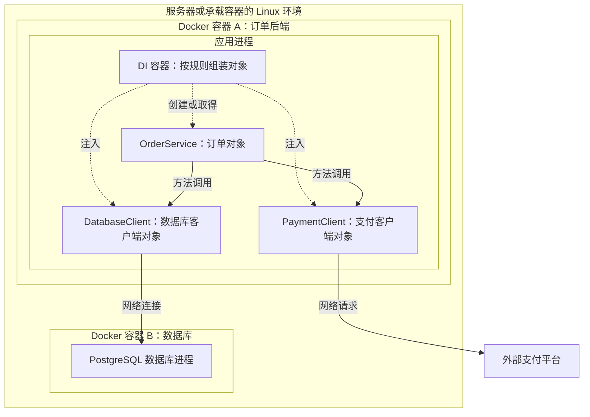

# Docker 容器与 DI 容器：运行隔离和对象装配

> [!summary] 一句话解释
> **Docker 容器提供程序的隔离运行环境；DI 容器在程序内部创建、连接和管理对象。一个运行在 Docker 容器里的程序，完全可以在内部使用 DI 容器。**

Container（容器，读作 container）是一个广泛使用的比喻。在这两个语境里，它所管理的东西不同。

**Docker** 通常读作“多克”，是构建、分发镜像及管理容器的工具和平台。**DI** 是 **Dependency Injection（依赖注入，读作 D-I）**；DI Container 就是依赖注入容器。

## 一、放在一起比较

| 比较项 | Docker 容器 | DI 容器 |
|---|---|---|
| 所处层次 | 程序运行与部署层 | 应用内部的软件结构层 |
| 管理对象 | 进程、文件系统视图、网络、运行配置等 | 对象、接口到实现的注册、依赖关系、实例生命周期 |
| 核心问题 | 程序怎样在合适的环境中隔离运行 | 某个组件需要谁，怎样创建并交给它 |
| 一个例子 | 启动一个运行订单后端的容器 | 给订单服务注入支付对象和数据库客户端 |
| 常见操作 | 构建镜像、创建、启动、停止容器 | 注册、解析、注入、创建作用域、释放对象 |
| 隔离含义 | 操作系统层面的进程等隔离，程度受配置影响 | 通常只是依赖可见范围和对象复用范围 |
| 资源管理 | 可以配置内存、处理器等资源限制 | 管理实例数量、复用和清理，不提供操作系统资源配额 |
| 是否安装运行依赖 | 镜像构建流程可以安装程序包和系统库 | 通常使用已经安装的库创建对象 |
| 典型使用者 | Docker Engine 等容器运行工具 | Spring、.NET、NestJS 等框架中的 DI 系统 |
| 能否一起用 | 可以承载内部使用 DI 的应用 | 可以运行在 Docker 中，也可以直接在本机运行 |

## 二、生活类比：厨房和人员统筹

假设你开一家餐厅：

- Docker 容器像一间配好炉灶、食材存放位置和工作区域的厨房，让这个餐厅在明确的运行条件下开工；
- DI 容器像厨房里的人员统筹，主厨需要切菜员和配菜员时，由统筹把合适的人安排给他；
- 程序启动相当于厨房开始营业；
- 对象注入相当于把具体协作者交给负责某项工作的人。

Docker 关心厨房作为一个工作环境怎样运行，DI 关心厨房内部的工作单元怎样配合。这个类比只解释职责：真实 Docker 的隔离依靠操作系统机制，真实 DI 的“人员”则是程序对象。

## 三、Docker 容器究竟是什么

先理解 Process（进程）：它是操作系统中一个正在运行的程序实例。详见 [[进程、线程、多进程与多线程]]。

以常见的 Linux 容器为例，Docker 让应用进程在特定的文件系统、网络和进程可见范围中运行。容器可以包含一个或多个进程，通常围绕一个主要服务组织。

Linux 的 Namespaces（命名空间）可以隔离进程所看到的环境，例如进程列表和网络；cgroups（Control Groups，控制组）用于统计和限制资源。这些能力由操作系统提供，Docker 将它们组织成便于使用的运行方式。

资源上限需要配置。启动一个容器，并不自动意味着它只能使用一小块内存，也不意味着它获得了一份专属物理硬件。

### 镜像与容器的关系

**Image（镜像）**是用于创建容器的文件和配置模板。一个后端应用镜像可能包含：

- Node.js 或 Python 等运行时；
- 应用代码或编译后的程序；
- 已安装的依赖库；
- 必要的系统文件；
- 默认启动命令。

**Container（容器）**则是由镜像创建的实例，拥有自己的运行配置和可写层；容器也可以处于已停止状态。

```text
同一个订单应用镜像
├─ 创建容器 A → 运行订单应用实例 A
└─ 创建容器 B → 运行订单应用实例 B
```

“镜像里带了应用所需文件”不表示它包含整个业务世界。数据库、外部接口、运行密钥和持久化数据仍可能来自外部，兼容的内核与处理器架构也仍然重要。

### 与虚拟机的区别

通常的 Linux 容器共享承载它们的 Linux 内核；传统虚拟机通常拥有自己的客户机内核。因此 Docker 不需要给每个普通 Linux 容器都启动一套独立内核。

在 Windows 的 Docker Desktop 上运行 Linux 容器时，通常由 Linux 虚拟化环境提供内核，容器共享的是那里的 Linux 内核，并非直接共享 Windows 内核。原生 Windows 容器是另一类情况。相关背景见 [[Linux为什么可以做得很小]]。

### 文件保存在哪里

容器内存中的数据随进程结束而消失；容器可写层中的文件在删除该容器时也会失去。需要独立于容器保留的数据，可放进 Volume（数据卷）、绑定挂载目录或外部存储。

停止容器、删除容器、删除数据卷是不同操作。数据卷也需要备份，不能因为叫持久化存储就认为它不会损坏。

## 四、DI 容器究竟是什么

先把 Object（对象）理解成程序内存中一个有职责的单元：它可以保存数据，也可以提供方法。例如订单对象负责创建订单，支付对象负责发起付款。

如果订单服务要调用支付能力，那么支付能力就是它的 Dependency（依赖）。

下面是简化的 TypeScript 示例：

```ts
interface Payment {
  pay(amount: number): void
}

class OrderService {
  constructor(private payment: Payment) {}

  checkout() {
    this.payment.pay(100)
  }
}
```

这段代码分三部分：

1. `Payment` 描述约定：支付对象需要有 `pay` 方法；
2. 构造函数接收外部传来的支付对象；
3. `checkout` 使用这个对象完成支付调用。

这里已经使用了依赖注入，即“把需要的对象从外部传入”。它本身并不要求安装 DI 框架。可以由你手动创建对象：

```ts
const fakePayment: Payment = {
  pay: (amount) => console.log(`模拟付款：${amount}`),
}

const orders = new OrderService(fakePayment)
orders.checkout()
```

`fakePayment` 只输出信息，不进行真实付款；第二行把它交给订单服务。这使得测试订单流程时，可以替换支付实现。

对象变多后，由程序员手动安排所有创建顺序会越来越复杂。DI 容器根据注册规则自动组装它们，例如以下**伪代码，并非某个框架的直接可运行写法**：

```ts
container.register('payment', () => fakePayment)
container.register('orders', (c) =>
  new OrderService(c.resolve('payment')),
)

const orders = container.resolve('orders')
```

`register` 登记“怎样得到对象”；`resolve` 根据规则找到或创建对象。请求订单对象时，容器先取得支付对象，再把它传入订单构造函数。

这里使用字符串作为注册名称。TypeScript 的 `interface` 在运行时会被擦除，真实 DI 框架需要使用类、符号、名称或框架支持的元数据表达运行时依赖。

完整的依赖注入、生命周期和框架比较见 [[DI容器、Pi与轻量钩子方案]]。

## 五、为什么它们都说“管理依赖”

“依赖”在不同层次指不同东西：

| 层次 | 依赖举例 | 常见管理方式 |
|---|---|---|
| 安装依赖 | Node.js、Python、程序包、系统库 | 包管理器、镜像构建流程 |
| 程序内部依赖 | 支付实现对象、日志对象、数据库客户端 | 手动注入或 DI 容器 |
| 外部服务依赖 | 数据库服务器、模型接口、邮件服务 | 部署配置、网络连接、服务编排 |

例如 npm/pnpm 把数据库客户端的代码库安装到磁盘；DI 根据配置创建数据库客户端对象；这个对象通过网络连接数据库服务器。

Docker 可以运行这个应用，也可以另外启动数据库容器。Docker 并不因此知道应用内部的 `OrderService` 构造函数需要哪个对象。

## 六、它们在同一个系统里怎样配合

下面是一种可能的订单系统架构：



阅读这张图时要区分两种“服务”：

- DI 文档中的服务，往往是程序里的对象；
- 部署文档中的服务，往往是独立运行、通过网络访问的程序。

**DI 管理数据库客户端对象，不代表它把整台数据库服务器装进了应用内存。**客户端像电话，数据库服务器像电话另一端的工作人员。

运行过程可以是：Docker 启动后端容器 → 应用进程启动 → 应用初始化 DI 容器 → DI 根据依赖关系创建对象 → 业务对象处理请求并通过客户端访问外部服务。具体对象是否在启动时就创建，取决于框架的加载和生命周期规则。

## 七、“生命周期”在两处也不相同

Docker 层主要管理容器的创建、运行、停止、重启和删除；DI 层主要管理对象何时创建、复用和释放。

以 .NET 等 DI 系统的常见概念为例：

| DI 生命周期 | 含义 | 与 Docker 的关系 |
|---|---|---|
| Transient（瞬时） | 每次解析时创建一个新实例 | 一次解析不需要启动一个 Docker 容器 |
| Scoped（作用域） | 同一作用域内复用；Web 后端常使用请求作用域 | 作用域通常是应用内部的逻辑范围 |
| Singleton（单例） | 同一 DI 容器中的该项注册通常复用同一个实例 | 扩容成多个应用进程后，各进程仍各有实例 |

不同框架规则可能不同。Singleton 的“一个”必须说明范围，它不自动意味着整家公司、整个集群或者全部 Docker 容器只能有一个。

例如两个后端副本都在内存里维护一个单例计数器：A 上显示 5，B 上可能显示 2。需要跨副本一致的计数，应通过适当的数据库或其他协调机制处理。

DI 释放数据库客户端，也不等于停止远程数据库。Docker 终止应用时，应用若有机会优雅退出，可以通知 DI 清理连接等资源；强制终止时不应保证清理回调必然执行。

## 八、隔离与 Cordis 的关系

Docker 提供操作系统层面的运行隔离。它能控制程序看见哪些目录、使用怎样的网络，以及资源上限；实际隔离程度取决于权限、挂载和网络等配置，共享内核也意味着隔离并非绝对。

DI 的作用域主要控制“从这里能取得哪个对象”以及“是否复用该对象”。同一进程中的模块仍通常共享进程权限。一个模块注册进 DI 容器，不会因此自动失去读取文件或发起网络请求的能力。

你之前学过的 [[Cordis运行时机制：Fiber、Effect与Scope|Cordis]] 在应用内部组织服务依赖、插件及其生命周期。它可以成为 Docker 所运行的应用的一部分。Cordis 的上下文与作用域，也不能直接等同于操作系统进程隔离；运行不可信插件时，需要按要求另外设计运行边界。

## 九、怎样判断现在遇到的是哪一类问题

| 遇到的问题 | 更直接相关的层次 |
|---|---|
| 服务器没有合适的 Python 或系统库 | 镜像与运行环境 |
| 希望本地和生产使用相同应用文件及依赖 | 镜像构建与部署流程 |
| 希望测试时把真实支付换成模拟支付 | DI 或手动依赖注入 |
| 十几个组件都需要复用日志对象 | DI 注册和生命周期 |
| 数据库客户端错误地跨请求保存用户信息 | 对象生命周期与业务状态设计 |
| 容器内程序不能访问某个目录或端口 | 挂载、网络、操作系统权限 |
| 两个后端副本的内存计数不一致 | 跨进程状态与数据设计 |
| 删除并重建容器后文件不见了 | 容器可写层与持久化存储 |

Docker 和 DI 都可以单独使用。一个很小的脚本可以直接放进 Docker 运行，完全不用 DI；一个使用 DI 的后端也可以直接在本机或服务器上启动。

## 十、与本地和生产环境的关系

Docker 主要帮助固定应用文件、运行时和依赖版本，减少“我这里能跑、另一台机器缺依赖”的问题。

DI 则让程序在不同环境使用不同的实现：例如测试使用假邮件发送器，生产注入真实邮件客户端。配置仍需决定具体注入什么，框架不会自动知道你的业务意图。

二者一起使用，也仍需考虑真实网络、数据、监控、备份和权限。继续阅读 [[开发、测试、预发布与生产环境]]。

## 十一、学习建议与关联概念

1. 先读 [[进程、线程、多进程与多线程]]，理解运行中的程序。
2. 用本笔记区分镜像与容器，再结合 [[Linux为什么可以做得很小]] 理解共享内核。
3. 阅读 [[DI容器、Pi与轻量钩子方案]]，尝试手写一次构造函数注入。
4. 沿 [[Node.js与pnpm]]、[[TypeScript与JavaScript]] 区分安装依赖、类型和运行时对象。
5. 用 [[SQLite、SQLCipher与PostgreSQL]] 区分数据库客户端与数据库服务器。
6. 最后看 [[Cordis运行时机制：Fiber、Effect与Scope]] 和 [[开发、测试、预发布与生产环境]]，把对象装配与应用部署联系起来。

## 参考资料

Docker 与 DI 基础资料核对日期：**2026-09-05**。DI 生命周期采用 .NET 官方文档作具体例子，其他框架以各自规则为准。

- [Docker：What is a container?](https://docs.docker.com/get-started/docker-concepts/the-basics/what-is-a-container/)
- [Docker：What is Docker?](https://docs.docker.com/get-started/docker-overview/)
- [Docker：What is an image?](https://docs.docker.com/get-started/docker-concepts/the-basics/what-is-an-image/)
- [Docker：Resource constraints](https://docs.docker.com/engine/containers/resource_constraints/)
- [Docker：Volumes](https://docs.docker.com/engine/storage/volumes/)
- [Docker：Platform FAQs，含 Desktop 容器隔离说明](https://docs.docker.com/faqs/platform/)
- [Microsoft：Dependency injection overview](https://learn.microsoft.com/en-us/dotnet/core/extensions/dependency-injection/overview)
- [Microsoft：Service lifetimes](https://learn.microsoft.com/en-us/dotnet/core/extensions/dependency-injection/service-lifetimes)
