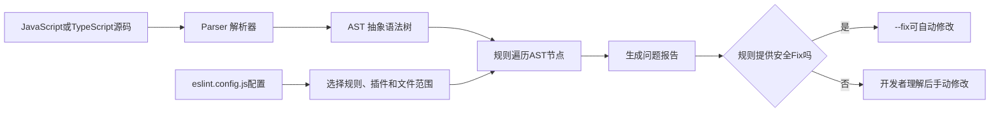

# ESLint 与 JavaScript 静态代码检查

## 一句话解释

> **ESLint 是 JavaScript/TypeScript 项目的静态代码检查工具：它不运行程序，而是解析源代码并按一组规则寻找可疑写法、潜在错误和团队约定问题，其中一部分还能自动修复。**

`ESLint` 通常读作 **E-S-Lint**，可以读成“伊艾斯林特”。

- **ES** 与 ECMAScript 有关，ECMAScript 是 JavaScript 所依据的语言标准；
- **Lint** 读作“林特”，在软件开发中常指静态检查代码中的问题。

最先记住：

```text
ESLint ≠ JavaScript运行环境
ESLint ≠ TypeScript编译器
ESLint ≠ 单元测试
ESLint ≠ Prettier格式化器
```

---

## 一、生活类比：写作文时的智能审稿员

假设你写了一篇作文。

不同工具像不同角色：

| 工具 | 类比 |
|---|---|
| JavaScript 引擎 | 真正让演员把剧本演出来 |
| TypeScript 类型检查器 | 检查人物、道具和动作的类型是否匹配 |
| ESLint | 审稿员，寻找可疑句式、没用到的角色和容易出错的写法 |
| Prettier | 排版员，统一空格、缩进、换行和引号布局 |
| 单元测试 | 按具体场景试演，验证结果是否符合要求 |

ESLint 不知道你的全部业务意图，但它可以说：

- “这个变量定义了却没用。”
- “你使用了一个没有声明的名字。”
- “这个循环方向可能永远到不了终点。”
- “这里可能漏写了 `return`。”
- “团队规定不能使用 `var`。”
- “React Hook 的调用方式不符合规则。”

---

## 二、为什么 JavaScript 特别需要 Lint

JavaScript 可以直接由浏览器或 Node.js 执行，很多项目没有传统语言那样强制的编译检查阶段。

它又具有：

- 动态类型；
- 隐式类型转换；
- 灵活的对象结构；
- 多种模块和运行环境；
- 大量框架与构建工具；
- 很多语法上合法、逻辑上可疑的写法。

例如：

```js
const total = 100;

if (price == "10") {
  sendReceipt();
}
```

这段代码可能有三个问题：

1. `total` 定义后没有使用；
2. `price` 没有在当前作用域声明；
3. `==` 会发生隐式类型转换，团队可能要求使用 `===`。

浏览器不一定在加载文件时一次性把这些问题都清楚地告诉你，ESLint 可以在编辑或提交代码时提前报告。

---

## 三、什么叫静态代码检查

**Static Analysis（静态分析）**是指：

> 不真正运行程序，而是读取源代码结构，分析其中可能存在的问题。

与之相对的是 **Dynamic Analysis（动态分析）**：把程序运行起来，通过测试、日志、监控等观察行为。

### 静态检查能发现什么

- 未定义变量；
- 未使用变量；
- 无效或可疑语法模式；
- 某些永远不会执行的代码；
- 错误的 API 使用方式，取决于插件；
- 不符合团队约定的代码结构；
- 某些安全风险模式；
- TypeScript 中需要类型信息才能发现的问题，使用 typed linting 时。

### 静态检查不能保证什么

- 业务逻辑一定正确；
- 数据库里一定有这条数据；
- 网络请求一定成功；
- 用户一定按预期操作；
- 并发时序一定正确；
- 第三方服务一定可用；
- 所有安全漏洞都能被发现；
- 程序运行性能一定良好。

所以 ESLint 不能替代测试和运行时监控。

---

## 四、ESLint 怎样工作



### 1. Parser：解析器

**Parser（解析器）**把源代码文本转换成程序可以分析的数据结构。

### 2. AST：抽象语法树

**AST（Abstract Syntax Tree，抽象语法树）**是代码语法的树形表示。

例如：

```js
const answer = 40 + 2;
```

可以概念化为：

```text
变量声明
├─ 变量名：answer
└─ 初始值：加法表达式
   ├─ 数字：40
   └─ 数字：2
```

ESLint 规则看到的主要不是一整行字符串，而是“变量声明”“标识符”“二元表达式”等 AST 节点。

### 3. Rule：规则

每条规则是一段检查逻辑。

例如：

- `no-undef`：报告未声明的变量；
- `no-unused-vars`：报告未使用的变量；
- `eqeqeq`：要求使用严格相等比较；
- `no-debugger`：禁止残留 `debugger`；
- `no-unreachable`：报告无法到达的代码。

### 4. Report：报告

规则发现问题后会报告：

- 文件；
- 行号和列号；
- 规则名称；
- 严重级别；
- 问题说明；
- 是否可以自动修复或提供建议。

### 5. Fix：自动修复

部分规则提供自动修复。运行 `eslint --fix` 时，ESLint 会尽量应用这些修复。

但不是所有问题都能安全自动改，因为工具不能随便猜测业务意图。

---

## 五、一个最小示例

### 有问题的代码

```js
function calculatePrice(price) {
  const tax = 0.13;

  if (price == "0") {
    return 0;
  }

  return pirce * 1.13;
}
```

ESLint 可能发现：

- `tax` 定义了但没有使用；
- `==` 不符合 `eqeqeq` 规则；
- `pirce` 是未定义变量，很可能是 `price` 的拼写错误。

### 修改以后

```js
function calculatePrice(price) {
  const tax = 0.13;

  if (price === 0) {
    return 0;
  }

  return price * (1 + tax);
}
```

ESLint 帮你发现的是“代码结构上非常可疑的地方”。至于税率是不是 13%、价格能否为负数，仍要由业务需求和测试决定。

---

## 六、规则的三个严重级别

ESLint 规则可以配置为：

| 字符串 | 数字 | 含义 |
|---|---:|---|
| `"off"` | `0` | 关闭规则 |
| `"warn"` | `1` | 报警告，默认不因它返回失败状态 |
| `"error"` | `2` | 报错误，存在违规时命令返回非零状态 |

示例：

```js
rules: {
  "no-unused-vars": "warn",
  "eqeqeq": "error",
  "no-console": "off",
}
```

含义：

- 未使用变量先作为警告；
- 非严格相等作为错误；
- 允许使用 `console`。

### 警告会不会让 CI 失败

默认情况下，普通 warning 不会因为规则严重级别本身让 ESLint 返回失败退出码。

如果项目要求“警告也不能进入主分支”，可以运行：

```sh
eslint . --max-warnings 0
```

这样只要存在 warning，检查也会失败。

---

## 七、当前推荐的 Flat Config

ESLint 当前使用 **Flat Config（扁平配置）**作为现行配置格式。

常见文件名是：

```text
eslint.config.js
eslint.config.mjs
eslint.config.cjs
```

旧教程常见：

```text
.eslintrc
.eslintrc.json
.eslintrc.js
package.json中的eslintConfig
```

这些属于 **Legacy Config（旧版配置）**。维护旧项目时仍会遇到，但新项目应该先阅读当前 Flat Config 文档，不要把两套格式混在一起。

---

## 八、创建一个 JavaScript 项目的 ESLint 配置

如果项目已经有 `package.json`，官方提供的初始化方式包括：

```sh
pnpm create @eslint/config@latest
```

它会询问：

- 检查 JavaScript 还是 TypeScript；
- 使用哪种模块方式；
- 代码运行在浏览器还是 Node.js；
- 是否使用框架；
- 使用哪个包管理器。

回答后会生成当前格式的配置，并安装需要的依赖。

Node.js 和 pnpm 基础见 [[Node.js与pnpm]]。

---

## 九、一个基础 Flat Config 示例

```js
import js from "@eslint/js";
import { defineConfig } from "eslint/config";

export default defineConfig([
  {
    ignores: ["dist/**", "coverage/**"],
  },

  js.configs.recommended,

  {
    files: ["src/**/*.js"],
    rules: {
      "no-unused-vars": "warn",
      "eqeqeq": "error",
    },
  },
]);
```

逐段理解：

### `import js from "@eslint/js"`

导入 ESLint 官方 JavaScript 配置包。

### `defineConfig(...)`

帮助书写配置，并让配置结构更清晰。

### `ignores`

忽略构建产物和覆盖率报告，避免检查自动生成文件。

### `js.configs.recommended`

启用官方推荐规则集合。

### `files`

说明后面的配置只应用于匹配的文件。

### `rules`

在推荐配置基础上调整单独规则。

---

## 十、为什么必须主动启用规则

ESLint 是可配置、可插拔的工具，不会替所有团队决定唯一风格。

官方入门文档特别说明：如果既没有继承共享配置，也没有显式打开规则，ESLint 不会自动替你检查一套想象中的完整标准。

常见起点是：

```js
js.configs.recommended
```

推荐配置不是“打开所有规则”，而是开启官方认为适合作为常见起点的一组规则。

不要一开始就启用 `all`，否则规则过多、升级变化和噪声可能让团队难以维护。

---

## 十一、怎样运行 ESLint

### 检查整个项目

```sh
pnpm eslint .
```

这里的 `.` 表示当前目录。

### 检查指定目录

```sh
pnpm eslint src
```

### 检查指定文件

```sh
pnpm eslint src/main.js
```

### 自动修复能安全处理的问题

```sh
pnpm eslint . --fix
```

### 只允许零警告

```sh
pnpm eslint . --max-warnings 0
```

### 查看某个文件最终获得的配置

```sh
pnpm eslint --print-config src/main.js
```

`--print-config` 对排查“为什么这条规则没生效”很有用，因为一个文件可能匹配多段配置。

---

## 十二、把 ESLint 加到 package.json

可以在 `package.json` 中加入：

```json
{
  "scripts": {
    "lint": "eslint .",
    "lint:fix": "eslint . --fix"
  }
}
```

然后运行：

```sh
pnpm run lint
pnpm run lint:fix
```

这里的关系是：

```text
pnpm
→ 读取package.json中的scripts
→ 找到lint脚本
→ 启动项目本地安装的ESLint
→ ESLint读取配置并扫描代码
```

脚本名 `lint` 只是项目约定，可以换名字；真正执行什么由冒号后的命令决定。

---

## 十三、ESLint 为什么通常安装为开发依赖

安装示例：

```sh
pnpm add -D eslint @eslint/js
```

`-D` 表示放入 `devDependencies`。

因为 ESLint 通常用于：

- 本地开发；
- 编辑器检查；
- 提交前检查；
- CI 检查；

而不是在生产服务器处理用户请求时运行。

把它固定为项目依赖还有好处：

- 团队使用相同版本；
- CI 能重现本地结果；
- 配置与插件版本一起被锁文件记录；
- 不依赖每个开发者全局安装不同版本。

---

## 十四、ESLint 的核心组件

### 1. Parser：解析器

把代码转换成 ESLint 能分析的结构。

普通 JavaScript 可以使用 ESLint 默认解析能力；TypeScript 通常需要 typescript-eslint 提供的解析和规则工具。

### 2. Rule：规则

针对 AST 查找特定模式并报告问题。

### 3. Plugin：插件

**Plugin（插件）**可以提供：

- 新规则；
- 推荐配置；
- 处理器；
- 语言支持；
- 其他扩展信息。

例如框架插件可以检查框架特有 API，而 ESLint 核心不需要内置所有框架知识。

### 4. Shareable Config：共享配置

**Shareable Config（可共享配置）**是一组预先整理好的 ESLint 设置。

它可能规定：

- 启用哪些规则；
- 规则严重级别；
- 使用哪些插件；
- 适用哪些文件；
- 语言选项。

团队可以把共同标准发布成内部配置包，多个项目复用。

### 5. Processor：处理器

某些文件不只是纯 JavaScript，例如 Markdown 或组件文件中嵌入了代码。Processor 可以抽取或转换其中的代码片段，再交给规则检查。

### 6. Formatter：报告格式器

这里的 Formatter 指“怎样展示 ESLint 报告”，例如终端、JSON、HTML，不等于 Prettier 这种代码格式化工具。

---

## 十五、插件、共享配置和规则有什么关系

```text
规则 Rule
= 一项具体检查

插件 Plugin
= 一组规则及相关扩展能力

共享配置 Shareable Config
= 帮你选择并配置一组规则和插件
```

例如：

```text
某框架插件
├─ 规则A：检查Hook调用
├─ 规则B：检查组件写法
└─ recommended配置：默认启用A和B
```

安装插件不等于自动启用它的所有规则。还需要在配置中加载插件、继承它的配置，或手动打开规则。

---

## 十六、ESLint 与 TypeScript 是什么关系

TypeScript 和 ESLint 都能在运行前检查代码，但关注点不同。

| TypeScript 类型检查 | ESLint |
|---|---|
| 检查类型是否匹配 | 按规则检查代码模式和实践 |
| 理解接口、泛型、联合类型等 | 检查未使用代码、可疑控制流、框架规则等 |
| 可将 TS 转换为 JS | 不负责把 TS 编译成 JS |
| 由 `tsc` 等工具执行 | 由 `eslint` 执行 |

例如：

```ts
const userName: string = 123;
```

TypeScript 会报告数字不能赋给字符串。

而：

```ts
const userName = "Alice";
```

如果变量从未使用，ESLint/typescript-eslint 可以按规则报告。

完整的 TS 与 JS 关系见 [[TypeScript与JavaScript]]。

---

## 十七、TypeScript 项目为什么需要 typescript-eslint

TypeScript 比 JavaScript 多出：

- 类型注解；
- 接口；
- 枚举；
- 泛型；
- `as` 类型断言；
- 类型空间中的声明；
- 其他 TS 专属语法和语义。

**typescript-eslint** 提供让 ESLint 理解和检查 TypeScript 的工具，包括解析器、插件和共享配置。

官方当前快速开始安装示例：

```sh
pnpm add -D eslint @eslint/js typescript typescript-eslint
```

基础配置：

```js
import js from "@eslint/js";
import { defineConfig } from "eslint/config";
import tseslint from "typescript-eslint";

export default defineConfig({
  files: ["**/*.{js,ts}"],
  extends: [
    js.configs.recommended,
    tseslint.configs.recommended,
  ],
});
```

这会同时启用：

- ESLint 的 JavaScript 推荐规则；
- typescript-eslint 的 TypeScript 推荐规则。

---

## 十八、普通 TypeScript Lint 和 Typed Linting 的区别

### 不使用类型信息的 Lint

解析 TypeScript 语法和 AST，但不建立完整 TypeScript 类型程序。

优点：

- 配置简单；
- 速度较快；
- 能发现许多语法模式和常见问题。

### Typed Linting：使用类型信息的检查

**Typed Linting（基于类型信息的静态检查）**会利用 TypeScript 类型系统，能发现更深入的问题，例如：

- Promise 被错误忽略；
- 不安全的赋值或成员访问；
- 条件表达式的类型总是真或总是假；
- 某些 API 调用的返回值没有正确处理。

代价是：

- 配置更多；
- 需要让文件属于正确的 TypeScript Project；
- 建立类型信息需要更多时间和内存；
- Monorepo 中需要认真设计范围。

typescript-eslint 当前提供 `projectService` 等方式，让 Lint 使用与编辑器更一致的类型信息。

初学者可以先使用 `recommended`，理解基础后再引入 `recommendedTypeChecked`。

---

## 十九、为什么 JavaScript 核心规则不应直接检查 TypeScript

有些 ESLint 核心规则和 TypeScript 专用规则目标相似，例如“未使用变量”。

但 TypeScript 的类型声明和语法会让核心规则误判。

因此 typescript-eslint 的推荐配置会关闭已知与 TypeScript 规则冲突或不适合 TS 的核心规则，再启用对应扩展规则。

不要同时无脑打开：

```text
no-unused-vars
@typescript-eslint/no-unused-vars
```

在 TypeScript 文件里通常应让 TypeScript 专用版本负责，并依据官方共享配置处理核心规则。

---

## 二十、ESLint 与 Prettier 的区别

### ESLint：代码质量和可疑逻辑

主要关心：

- 未定义和未使用变量；
- 容易出错的控制流；
- API 和框架使用；
- Promise 和异步问题；
- 命名或代码实践；
- 可由规则表达的团队约束。

### Prettier：代码排版

主要关心：

- 缩进；
- 空格；
- 换行；
- 引号布局；
- 逗号；
- 一行太长时怎样重新排版。

最短记忆：

```text
ESLint：这段代码是否可疑、不符合规则？
Prettier：这段代码怎样排得统一、易读？
```

ESLint 当前不再推荐由核心承担主要格式化规则，而是建议使用 Prettier、dprint 等专用格式化器。

---

## 二十一、eslint-config-prettier 与 eslint-plugin-prettier

它们名字相似，但不是同一个东西。

### eslint-config-prettier

作用是：

> 关闭 ESLint 或其他配置中可能与 Prettier 冲突、不必要的格式化规则。

它本身不运行 Prettier。

### eslint-plugin-prettier

作用是：

> 在 ESLint 内部运行 Prettier，并把格式差异报告成 ESLint 问题。

这种方式可能更慢，也会让编辑器出现大量格式红线。Prettier 官方和 typescript-eslint 文档都更倾向于分别运行格式化器与 Linter，再用 `eslint-config-prettier` 关闭冲突规则。

常见思路：

```text
prettier --check .
eslint .
```

一个检查排版，一个检查代码质量。

---

## 二十二、`--fix` 能修什么

规则可以提供三种相关结果：

### 1. 普通报告

告诉你哪里违反规则，但没有自动修改。

### 2. Fix

规则作者认为可以安全、明确地自动修改。

运行：

```sh
pnpm eslint . --fix
```

ESLint 会尽量应用这些修复。

### 3. Suggestion

提供可能的修改建议，但因为可能改变行为，不会像普通 Fix 一样被全部自动应用。编辑器可以让开发者选择建议。

### 为什么不能修所有问题

例如：

```js
sendEmail(user);
```

如果 `user` 未定义，ESLint 不知道你真正想要：

- 当前登录用户；
- 管理员；
- 函数参数；
- 数据库查询结果；
- 还是应该删除整行。

自动猜测会改变业务逻辑，所以只能报告给开发者。

---

## 二十三、自动修复是否绝对安全

ESLint 的 Fix 设计目标通常是安全应用、不改变代码行为，但工程上仍应该：

1. 使用 Git 保存修改；
2. 查看 `--fix` 产生的差异；
3. 运行类型检查；
4. 运行测试；
5. 不在有未保存重要改动时盲目对整个旧项目修复。

尤其当：

- 使用大量第三方插件；
- 插件版本刚升级；
- 一次修复数千个文件；
- 规则会调整复杂语法；

更应该分批处理和审查。

---

## 二十四、ESLint 怎样进入开发流程


### 编辑器阶段

尽早看到问题，反馈最快。

### Git Hook 阶段

可以在提交前检查将要提交的文件。

例如 `package.json` 中已有：

```json
{
  "scripts": {
    "lint": "eslint ."
  }
}
```

Git Hook 运行：

```sh
pnpm run lint
```

相关知识见 [[Git Hook与自动化检查]]。

### CI 阶段

CI（Continuous Integration，持续集成）在干净、统一的环境中重新检查，不能只依赖开发者本地 Hook，因为本地 Hook 可能被跳过或环境不一致。

---

## 二十五、为什么编辑器检查通过，CI 却失败

可能原因包括：

- 本地和 CI 的 ESLint 版本不同；
- Node.js 版本不同；
- 锁文件未提交或安装方式不同；
- 编辑器只检查打开的文件，CI 检查整个项目；
- 本地插件没有正确加载；
- CI 使用 `--max-warnings 0`；
- 大小写文件名在 Windows 和 Linux 上表现不同；
- 本地有未提交配置；
- 生成文件或测试目录匹配范围不同；
- 编辑器使用了另一个工作目录；
- Monorepo 包的配置继承不同。

所以团队应：

- 把 ESLint 和插件放入项目依赖；
- 提交锁文件；
- 在 `package.json` 固定统一脚本；
- 本地和 CI 都调用同一个脚本；
- 在 CI 中使用干净安装。

---

## 二十六、浏览器环境与 Node.js 环境为什么要配置

浏览器提供全局变量：

- `window`；
- `document`；
- `location`；
- `fetch`。

Node.js 提供或曾提供自己的全局环境：

- `process`；
- `Buffer`；
- `__dirname`，取决于模块类型；
- `global`。

如果 ESLint 不知道代码运行在哪里，`no-undef` 可能把合法运行时全局变量当成未声明。

因此配置要说明：

- 浏览器代码；
- Node.js 代码；
- 测试代码；
- Service Worker；
- Worker；
- 特定框架环境。

不要为消除一个错误就全局声明所有名字。环境范围越准确，检查越可靠。

---

## 二十七、忽略文件与“文件没被检查”

通常不应该检查：

- `node_modules`；
- `dist`；
- `build`；
- `coverage`；
- 自动生成代码；
- 压缩后的第三方脚本；
- 某些工具缓存。

Flat Config 示例：

```js
export default [
  {
    ignores: [
      "dist/**",
      "coverage/**",
      "src/generated/**",
    ],
  },
];
```

但忽略范围过宽会让真正源码逃过检查。

如果某个文件没有被检查，应确认：

1. 命令是否包含它；
2. `files` glob 是否匹配；
3. `ignores` 是否把它排除；
4. 文件扩展名是否由当前配置支持；
5. 是否在正确项目目录运行；
6. `--print-config` 显示了什么。

---

## 二十八、怎样按文件类型配置不同规则

项目可能同时包含：

- 浏览器源码；
- Node.js 脚本；
- 测试文件；
- 配置文件；
- TypeScript；
- JavaScript。

它们不应该完全使用同一组全局变量和规则。

概念示例：

```js
export default [
  {
    files: ["src/**/*.{js,ts}"],
    rules: {
      "no-console": "warn",
    },
  },
  {
    files: ["scripts/**/*.js"],
    rules: {
      "no-console": "off",
    },
  },
];
```

业务前端代码可能限制 `console`，而命令行脚本本来就需要输出，因此可以关闭这条规则。

配置应该表达运行环境和真实意图，而不是追求“所有文件一模一样”。

---

## 二十九、什么时候可以临时禁用规则

代码中可以使用配置注释，例如：

```js
// eslint-disable-next-line no-console -- CLI需要输出最终结果
console.log(result);
```

合理场景：

- 规则无法理解某个合法特殊用法；
- 外部 API 强制要求特定模式；
- CLI 的职责就是输出；
- 正在等待上游插件修复误报。

不合理场景：

- 不想理解错误；
- 为了让 CI 变绿而关闭全部规则；
- 直接在文件顶部 `eslint-disable` 却不说明原因；
- 长期保留无范围、无理由的豁免。

好的禁用应该：

- 范围尽可能小；
- 写明原因；
- 必要时关联 issue；
- 定期复查是否仍需要。

---

## 三十、ESLint 能检查框架代码吗

ESLint 核心主要提供通用语言规则。框架和库知识通常来自插件。

插件可以检查：

- React Hooks 调用约束；
- Vue 单文件组件中的脚本；
- import/export 关系；
- 测试框架中的断言；
- Node.js API 实践；
- Promise 使用；
- 安全相关模式；
- 公司内部架构约束。

这就是 ESLint “Pluggable JavaScript Linter（可插拔 JavaScript 检查器）”的含义。

使用插件前要确认：

- 是否支持当前 ESLint 主要版本；
- 是否支持 Flat Config；
- 是否仍在维护；
- 推荐配置会打开哪些规则；
- 是否与其他插件重复或冲突；
- 是否需要类型信息。

---

## 三十一、团队为什么会编写自定义规则

通用规则无法知道每家公司的架构约定。

团队可能希望自动禁止：

- UI 层直接访问数据库模块；
- 在日志中输出密钥字段；
- 绕过统一 HTTP 客户端；
- 从内部私有路径导入模块；
- 使用已经废弃的公司 API；
- 未包装的危险函数；
- 某些目录之间的反向依赖。

自定义规则可以把代码评审中的重复提醒变成自动检查。

但规则应该：

- 目标明确；
- 有可靠测试；
- 错误消息可行动；
- 误报率低；
- 提供迁移方案；
- 不把个人偏好包装成所有项目的绝对真理。

---

## 三十二、ESLint 与测试的区别

### ESLint

分析代码结构：

```text
“这里用了未定义变量。”
“这个Promise可能没有被等待。”
“这个Hook调用位置不合法。”
```

### 测试

运行代码验证具体行为：

```text
“输入2和3，结果是不是5？”
“未登录用户访问接口，是否返回401？”
“付款失败后订单状态是否正确？”
```

一段代码可以 ESLint 全部通过，但业务结果仍然错误：

```js
function add(a, b) {
  return a - b;
}
```

这段代码语法和常见规则可能都没问题，但函数名说加法，实际做减法。需要测试和代码评审发现。

---

## 三十三、ESLint 与编译器的区别

编译器或转换器可能负责：

- 把 TypeScript 转成 JavaScript；
- 把现代语法转换成兼容旧环境的语法；
- 生成可执行文件；
- 检查语言必须满足的语义或类型规则。

ESLint 负责可配置的规则检查。

```text
编译通过
≠ Lint通过
≠ 测试通过
≠ 业务正确
```

它们是互补的质量关卡。

---

## 三十四、ESLint 与代码格式化器的推荐分工

一个清晰的项目脚本可以是：

```json
{
  "scripts": {
    "lint": "eslint .",
    "lint:fix": "eslint . --fix",
    "format": "prettier . --write",
    "format:check": "prettier . --check",
    "typecheck": "tsc --noEmit",
    "test": "vitest run"
  }
}
```

对应职责：

| 脚本 | 负责什么 |
|---|---|
| `lint` | 代码规则和可疑模式 |
| `format:check` | 排版是否统一 |
| `typecheck` | TypeScript 类型是否正确 |
| `test` | 程序在测试场景中的行为 |

CI 可以分别展示哪一层失败，比把所有工具塞进一个命令更容易排查。

---

## 三十五、常见报错和排查方法

### 1. 找不到配置文件

确认项目根目录是否有：

```text
eslint.config.js
eslint.config.mjs
eslint.config.cjs
```

并确认在正确目录执行命令。

### 2. `Parsing error`

可能原因：

- 代码语法不完整；
- 文件需要 TypeScript 解析器；
- JSX/TSX 配置不正确；
- ECMAScript 版本或模块设置不匹配；
- 插件或解析器版本不兼容。

### 3. 合法的浏览器或 Node 全局变量被报告 `no-undef`

检查是否配置了正确运行环境和 globals。

### 4. 规则没有生效

运行：

```sh
pnpm eslint --print-config path/to/file.js
```

确认最终规则、插件和语言选项。

### 5. 文件被忽略

检查 `ignores`、`files` 和命令参数。

### 6. 插件找不到

确认：

- 包已安装在正确 workspace；
- 名称正确；
- 版本兼容；
- Flat Config 使用了正确的 import；
- 包管理器依赖边界没有被破坏。

### 7. TypeScript 文件不在项目中

使用 Typed Linting 时，文件必须被适当的 TypeScript Project 或 `projectService` 包含。配置文件、脚本和测试文件经常是遗漏来源。

### 8. Lint 很慢

检查：

- 是否扫描 `dist`、生成代码或大目录；
- 是否对所有文件启用了类型感知规则；
- Monorepo 的 TypeScript Project 是否过多；
- 是否在 ESLint 内部运行 Prettier；
- 编辑器是否重复启动多个 ESLint 服务；
- 缓存和文件范围是否合理。

---

## 三十六、怎样设计一套可维护的规则

### 1. 从 recommended 开始

先启用官方或插件的推荐配置，再根据项目需求调整。

### 2. 优先处理真实错误

先关注：

- 可能崩溃；
- 未处理 Promise；
- 未定义变量；
- 不可达代码；
- 错误的框架用法；
- 安全和资源泄漏。

不要一开始为引号和空格争论数天。

### 3. 规则要有理由

团队应该知道：

- 这条规则防什么问题；
- 为什么是 warning 或 error；
- 怎样修复；
- 哪些例外合法。

### 4. 新规则逐步引入

旧项目一次打开严格规则可能产生数千条问题。可以：

1. 先阻止新增违规；
2. 按目录逐步修复；
3. 将规则从 off 调为 warn；
4. 清理完成后升为 error；
5. 用 CI 防止回退。

### 5. 避免警告永久堆积

如果几千条 warning 从来没人处理，开发者会忽略所有提示。

警告应该有清理计划，否则应重新判断规则是否真的有价值。

---

## 三十七、Git Hook 和 CI 应怎样配合

### 本地 Hook

优点：反馈快，可以只检查暂存文件。

缺点：

- 可以被跳过；
- 开发者环境可能不同；
- 对整个大型项目运行可能很慢。

### CI

优点：

- 环境统一；
- 每个 PR 都执行；
- 结果可以作为合并门禁；
- 不依赖某个人的编辑器配置。

正确关系：

```text
编辑器：最早反馈
Git Hook：提交前快速拦截
CI：权威的统一复查
```

Git Hook 不应成为唯一质量保证，详见 [[Git Hook与自动化检查]]。

---

## 三十八、ESLint 配置也是代码和依赖

Flat Config 本身通常是 JavaScript 模块，因此可能：

- import 插件；
- 根据文件类型组合配置；
- 使用共享常量；
- 根据项目结构应用规则。

这带来灵活性，也意味着配置会受：

- Node.js 模块系统；
- 依赖版本；
- 包导出方式；
- Monorepo 工作目录；
- ESM/CJS 差异；
- 供应链安全；

影响。

所以配置文件和锁文件都应进入 Git，并由代码评审审查。

---

## 三十九、ESLint 能不能检查其他语言

ESLint 最初是 JavaScript Linter，生态也主要围绕 JavaScript、TypeScript 和 Web 技术。

ESLint 从较新的架构开始可以通过语言插件扩展到其他语言，但这不表示它自动理解所有文件。

具体语言仍需要：

- 解析器或语言实现；
- SourceCode 表示；
- 对应规则；
- 插件配置。

对 Python、Go、Rust、Java 等语言，通常仍优先使用各自成熟的原生 Linter 和工具链。

---

## 四十、常见误区

### 误区 1：ESLint 只是检查缩进和分号

错误。它的核心价值是发现可疑逻辑、未定义变量、控制流问题和框架/API 误用。格式化通常交给专用格式化器。

### 误区 2：ESLint 通过，代码就没有 Bug

错误。ESLint 只能发现规则能够表达的静态模式。

### 误区 3：TypeScript 项目不需要 ESLint

错误。类型检查和 Lint 关注点不同，通常应该同时使用。

### 误区 4：安装插件后规则自动生效

错误。还需要在配置中加载插件、继承配置或开启规则。

### 误区 5：`--fix` 会修复所有错误

错误。只有规则提供明确、安全 Fix 的问题才会自动修改。

### 误区 6：把所有规则设成 error 最严格也最好

错误。不适合项目的规则会制造噪声和错误激励。规则集应有明确价值。

### 误区 7：`.eslintrc` 是所有新项目的推荐格式

错误。它属于 Legacy Config；当前新项目应优先使用 Flat Config。

### 误区 8：Prettier 可以替代 ESLint

错误。Prettier 主要统一排版，不负责大多数代码质量规则。

### 误区 9：ESLint 可以替代测试

错误。静态模式检查无法验证真实输入、数据库、网络和业务结果。

### 误区 10：本地 Hook 通过就不需要 CI

错误。本地 Hook 可以跳过，CI 才能提供统一环境的合并门禁。

---

## 四十一、初学者建议学习顺序

1. 学习 [[TypeScript与JavaScript|JavaScript 和 TypeScript 的基本区别]]；
2. 学习 [[Node.js与pnpm|Node.js、package.json、依赖和 scripts]]；
3. 理解语法错误、类型错误、Lint 错误、测试失败的区别；
4. 用 `pnpm create @eslint/config@latest` 建立一个最小项目；
5. 从 `recommended` 配置开始；
6. 故意写出未使用变量和未定义变量，观察报告；
7. 尝试 `--fix`，并查看 Git diff；
8. 再学习 TypeScript 的 typescript-eslint；
9. 区分 ESLint 与 Prettier；
10. 最后把 `pnpm run lint` 接入 [[Git Hook与自动化检查|Git Hook]] 和 CI。

---

## 四十二、最后记忆

如果只记住十句话，请记住：

1. **ESLint 是静态代码检查器，不运行你的业务程序。**
2. **它先把代码解析成 AST，再让规则检查节点。**
3. **规则可以是 off、warn 或 error。**
4. **`--fix` 只能自动处理规则提供安全修复的问题。**
5. **插件提供额外规则，共享配置负责选择和组合规则。**
6. **当前新项目优先使用 `eslint.config.js/.mjs` Flat Config。**
7. **TypeScript 通常使用 typescript-eslint。**
8. **ESLint 管代码质量，Prettier 管排版，TypeScript 管类型，测试管运行行为。**
9. **本地编辑器和 Git Hook 提前反馈，CI 负责统一复查。**
10. **Lint 通过不等于代码一定正确。**

最短公式：

```text
源代码
+ ESLint配置
+ 规则与插件
→ 静态问题报告
+ 部分自动修复
```

完整质量链路：

```text
Prettier格式检查
+ ESLint静态规则
+ TypeScript类型检查
+ 单元/集成测试
+ 代码评审
+ CI门禁
= 更可靠的代码
```

---

## 关联笔记

- [[TypeScript与JavaScript]]：类型检查与 Lint 为什么互补。
- [[Node.js与pnpm]]：ESLint 怎样作为开发依赖安装并由 scripts 运行。
- [[Git Hook与自动化检查]]：怎样在提交代码前自动运行 `pnpm run lint`。
- [[软件供应链：代码签名、SBOM与发布门禁]]：怎样把 Lint、测试和依赖安全纳入发布门禁。
- [[Agent评测：上下文成本、轨迹与独立验收]]：为什么 Agent 自检后还需要独立 Lint、类型检查和测试。

---

## 参考资料

以下均为项目官方文档，核对日期：**2026-08-24**。

- [ESLint：Getting Started](https://eslint.org/docs/latest/use/getting-started)
- [ESLint：Core Concepts Glossary](https://eslint.org/docs/latest/use/core-concepts/glossary)
- [ESLint：Rules Reference](https://eslint.org/docs/latest/rules/)
- [ESLint：Configuration Migration Guide](https://eslint.org/docs/latest/use/configure/migration-guide)
- [ESLint：About ESLint](https://eslint.org/docs/latest/about/)
- [typescript-eslint：Getting Started](https://typescript-eslint.io/getting-started/)
- [typescript-eslint：Shared Configs](https://typescript-eslint.io/users/configs/)
- [typescript-eslint：What About Formatting?](https://typescript-eslint.io/users/what-about-formatting/)
- [Prettier：Prettier vs. Linters](https://prettier.io/docs/comparison)
- [Prettier：Integrating with Linters](https://prettier.io/docs/next/integrating-with-linters.html)
