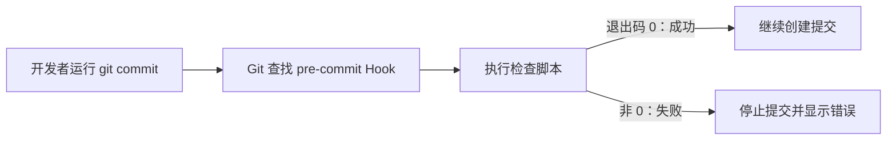

# Git Hook 与自动化检查

> [!summary] 一句话解释
> **Git Hook（Git 钩子）是在 Git 运行到某个特定时刻时，自动触发的一段程序或脚本。**

`Hook` 读作“胡克”，本义是“钩子”。在编程里，它表示：**系统运行到预先约定的位置时，允许另一段代码挂上去执行。**

## 生活类比

把 Git 提交想成乘飞机：

```text
准备登机 → 检查证件 → 登机 → 起飞
```

机场可以在“登机前”设置安检。Git 也可以在“提交前”设置 `pre-commit` Hook：

```text
准备提交 → 自动检查格式和测试 → 通过才提交
```

Hook 不是 Git 提交本身，而是被挂在某个时间点上的自动流程。

## 它是怎样工作的



程序结束时会返回一个 **Exit Status（退出状态码）**：

- `0` 通常代表成功；
- 非 `0` 通常代表失败；
- 对许多“执行前”Hook 来说，失败会阻止当前 Git 操作继续。

## 常见 Git Hook

| Hook 名称 | 触发时间 | 常见用途 |
|---|---|---|
| `pre-commit` | 创建提交之前 | 格式检查、代码检查、小型测试 |
| `commit-msg` | 提交信息写好后 | 检查提交信息格式 |
| `post-commit` | 提交完成之后 | 通知、记录日志 |
| `pre-push` | 推送到远程仓库之前 | 运行测试，防止明显错误被推送 |
| `pre-receive` | 远程 Git 服务器接收更新之前 | 服务器端权限和分支规则检查 |

`pre` 表示“之前”，`post` 表示“之后”。通常只有执行前的 Hook 才有机会阻止操作；执行后的 Hook 更适合通知和记录。

## Hook 放在哪里

Git 默认在下面的位置寻找本地 Hook：

```text
.git/hooks/
```

也可以通过 `core.hooksPath` 指定其他目录。例如把团队 Hook 放进可被 Git 跟踪的 `.githooks`：

```bash
git config core.hooksPath .githooks
```

这里的 `.git` 是本地仓库内部目录，通常不会随普通文件一起提交。因此，**直接写在 `.git/hooks` 里的 Hook 默认不会因为 `git clone` 自动分享给团队成员。**

团队常用以下办法共享 Hook：

- 把脚本放到仓库内，再配置 `core.hooksPath`；
- 使用 Husky、Lefthook、simple-git-hooks 等第三方工具；
- 把真正必须执行的检查再放进 CI（持续集成）系统。

## 一个最小例子

下面是一个 `pre-commit` 脚本。它要求项目里已经配置好 `lint` 命令：

```sh
#!/usr/bin/env sh

pnpm run lint
```

逐行理解：

1. `#!/usr/bin/env sh` 告诉系统用兼容 `sh` 的 Shell 解释脚本；
2. `pnpm run lint` 执行 `package.json` 中名为 `lint` 的脚本；
3. 如果检查失败并返回非 `0`，`pre-commit` 就会失败，Git 通常停止提交。

这里同时出现了 [[Node.js与pnpm|pnpm]] 和 [[CMD、Bash与PowerShell|Shell]]：Hook 负责“什么时候触发”，Shell 负责“怎样解释脚本”，pnpm 负责“运行项目里的检查命令”。

## Hook、脚本和 CI 的区别

| 概念 | 主要回答的问题 |
|---|---|
| Hook | **什么时候**自动触发？ |
| Shell 脚本 | 触发后**具体执行什么命令**？ |
| CI（Continuous Integration，持续集成） | 代码进入共享仓库后，服务器怎样统一检查？ |

本地 Hook 反馈很快，但不应成为唯一防线：

- 部分 Hook 可以用 `--no-verify` 绕过；
- 开发者可能没有安装或启用 Hook；
- 每个人的操作系统和运行环境可能不同；
- 恶意程序也不能只靠客户端 Hook 防御。

因此常见做法是：**Hook 提前提醒，CI 最终把关。**

## 常见误区

### 误区 1：Hook 是 GitHub 的功能

Git Hook 属于 Git。GitHub Actions、GitLab CI 等是远程平台提供的自动化系统，虽然都能运行检查，但触发位置和运行环境不同。

### 误区 2：写进 `.git/hooks` 就会自动分享给所有人

默认不会。`.git` 内部内容通常不进入版本历史。

### 误区 3：所有 Hook 失败都能撤销 Git 操作

不是。`post-commit` 等操作发生后才触发，通常只能通知，不能让已经完成的提交消失。

### 误区 4：Hook 越多越好

每次提交都运行很慢的完整测试，会让开发体验变差。可把快速格式检查放在 `pre-commit`，较重的测试放到 `pre-push` 或 CI。

### 误区 5：Bash 脚本可以原样放进 CMD

不一定。[[CMD、Bash与PowerShell|CMD、Bash 和 PowerShell]] 的变量、路径和语法不同。脚本开头的解释器声明和机器上实际安装的解释器必须匹配。

## 学习建议

初学阶段按这个顺序实践：

1. 先能手动运行 `git status`、`git add`、`git commit`；
2. 学会在终端里手动运行 `pnpm run lint`；
3. 再把这个命令放进 `pre-commit`；
4. 故意制造一个检查错误，观察 Hook 怎样阻止提交；
5. 最后再了解 Husky 或 CI。

## 关联概念

- [[Node.js与pnpm]]：前端和 Node.js 项目中，Hook 经常调用 pnpm 脚本。
- [[CMD、Bash与PowerShell]]：Hook 文件需要由某种命令解释器执行。
- [[SDK与API|API]]：服务器端自动化平台通常也通过 API 与 Git 托管服务交流。

## 参考资料

- [Git 官方 githooks 文档](https://git-scm.com/docs/githooks)
- [Git 官方 core.hooksPath 配置文档](https://git-scm.com/docs/git-config#Documentation/git-config.txt-corehooksPath)

