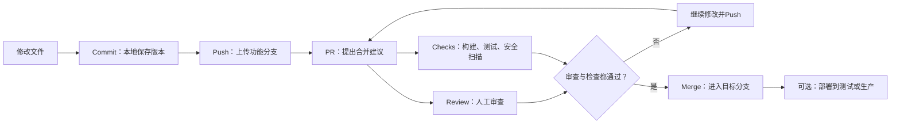

# GitHub Pull Request 与合并策略

> [!summary] 一句话解释
> **PR 是请求项目维护者审查并接纳某个分支的改动；“合并 PR”就是确认这些改动可以进入目标分支，然后把它们整合进去。**

**PR** 是 **Pull Request（拉取请求，读作 P-R 或 Pull Request）** 的缩写。

它不是“从 GitHub 下载代码”的按钮。它表达的是：

> 我已经在自己的分支中完成了一组改动，请你查看差异、讨论、运行检查；如果没有问题，请把这些改动纳入目标分支。

GitHub 官方将 PR 定义为：提出把一个分支中的代码变化合并到另一个分支，并提供讨论、审查和验证这些变化的协作空间。

---

## 一、先理解为什么需要分支

假设 `main` 是当前稳定版本：

```text
main: A──B
```

开发者要增加登录功能时，可以从 B 创建新分支：

```text
main:           A──B
                    \
feature/login:      C──D
```

- A、B、C、D 都代表 Commit（提交）；
- `main` 是准备保持稳定的目标分支；
- `feature/login` 是隔离开发登录功能的分支；
- C、D 是登录功能产生的新提交。

如果直接把每一次未完成修改都推到 `main`，其他人可能立即拿到半成品或错误代码。分支给开发者一个独立空间，PR 则是在改动完成后建立审查和合并流程。

### 生活类比：修改正式合同

- `main`：已经生效的正式合同；
- 功能分支：修改草稿；
- Commit：一次次保存草稿版本；
- PR：把草稿和修改说明送去会签；
- Review：法务、业务和负责人逐条检查；
- Merge：批准后，把修改正式纳入合同；
- Deploy：把新合同真正发给所有执行部门。

所以 Merge 和 Deploy 不是同一个动作。

---

## 二、一个 PR 中的两个关键分支

创建 PR 时，GitHub 通常会显示：

```text
base: main  ←  compare: feature/login
```

### Base Branch（基础/目标分支）

Base 是改动准备进入的分支，例如：

- `main`；
- `develop`；
- `release/2.0`。

### Head Branch（头部/来源分支）

Head 是已经包含新改动、希望被合并的分支，例如：

- `feature/login`；
- `fix/payment-timeout`；
- 贡献者 Fork 中的分支。

PR 的方向非常重要：

```text
feature/login → main
```

表示把登录功能交给 `main`；如果方向选反，可能变成让 `main` 的所有变化进入功能分支。

---

## 三、Commit、Push、PR、Merge 和 Deploy 的区别

| 动作 | 中文 | 做了什么 | 改动进入 `main` 了吗 | 用户一定能看到吗 |
|---|---|---|---|---|
| Commit | 提交 | 在本地 Git 历史中保存一次版本 | 不一定 | 不能 |
| Push | 推送 | 把本地分支提交上传到 GitHub | 只有直接推 `main` 才是 | 不一定 |
| Open PR | 创建 PR | 请求审查来源分支与目标分支的差异 | 还没有 | 不能 |
| Review | 审查 | 评论、批准或要求修改 | 还没有 | 不能 |
| Merge PR | 合并 PR | 把来源分支改动整合进目标分支 | 是 | 不一定 |
| Deploy | 部署 | 把某个版本放到正式运行环境 | 代码已经选择用于发布 | 通常完成后才可能看到 |

一个常见流程：



合并 PR 可能触发自动部署，但这取决于仓库的 CI/CD 配置。GitHub 的 Merge 按钮本身不等于生产发布，详见 [[开发、测试、预发布与生产环境]]。

---

## 四、PR 页面里可以看什么

一个 GitHub PR 通常包含几个重要区域。

### Conversation（会话）

包含：

- PR 标题和说明；
- 评论和讨论；
- 审查结果；
- 自动化机器人消息；
- 谁在什么时候提交、批准或合并。

### Commits（提交）

显示来源分支中准备进入目标分支的提交。

### Files changed（文件变更）

显示 Diff（差异）：

- 哪些文件新增、修改或删除；
- 哪些行被增加或移除；
- 审查者可以在哪一行留下评论或修改建议。

### Checks（检查）

可运行：

- 编译和生产构建；
- TypeScript 类型检查；
- ESLint；
- 单元测试和端到端测试；
- 依赖漏洞、代码安全和密钥扫描；
- 自定义发布门禁。

### Merge Box（合并区域）

告诉你当前能否合并，以及还缺少什么：

- 等待审查批准；
- 检查尚未结束或失败；
- 来源分支需要更新；
- 存在 Merge Conflict（合并冲突）；
- PR 仍是 Draft（草稿）；
- 当前用户没有写入权限。

---

## 五、Review 不是只看“代码能不能运行”

审查者可以采取三种常见操作：

### Comment（评论）

留下意见，但不明确批准或阻止合并。

### Approve（批准）

表示审查者认为改动可以合并。

### Request Changes（请求修改）

表示存在需要先解决的问题。在启用了必要审查规则的仓库中，它可能阻止合并。

审查内容可能包括：

- 需求是否真正实现；
- 是否会破坏已有功能；
- 是否存在安全和权限问题；
- 数据库迁移是否安全；
- API 是否保持兼容；
- 错误处理和边界情况是否充分；
- 测试是否覆盖关键行为；
- 代码是否容易理解和维护；
- 是否意外提交密钥、构建产物或临时文件。

PR 的核心价值不仅是“多一个按钮”，而是把代码变化变成一场有记录、可定位到具体代码行的讨论。

---

## 六、“合并 PR”之后究竟发生了什么

假设 PR 是：

```text
feature/login → main
```

合并后：

1. `feature/login` 的改动成为 `main` 历史的一部分；
2. GitHub 把 PR 状态标记为 Merged；
3. PR 中的讨论、审查和检查记录继续保留；
4. 来源分支仍可能存在，可以选择删除；
5. 其他开发者需要更新自己的本地 `main` 才能取得最新代码；
6. CI/CD 可能根据 `main` 的变化启动构建或部署；
7. 如果没有部署流程，正式网站可能完全不变。

### 其他开发者怎样同步合并结果

```bash
git switch main
git pull --ff-only origin main
```

- 第一条切换到本地 `main`；
- 第二条把 GitHub 上最新的 `origin/main` 快进同步下来；
- `--ff-only` 可以避免一次普通拉取意外创建合并提交。

如果本地还有未提交修改，切换或拉取前要先确认这些修改怎样处理，不要盲目覆盖。

---

## 七、GitHub 的三种主要 PR 合并方式

GitHub 仓库可以允许一种或多种合并策略。按钮旁边的下拉菜单可能出现：

1. Create a merge commit；
2. Squash and merge；
3. Rebase and merge。

这三种方式最终都能把改动带进目标分支，但提交历史的形状不同。

### 1. Create a merge commit：保留分叉和完整提交

合并前：

```text
main:     A──B────────
              \
feature:       C──D
```

合并后：

```text
main:     A──B──────M
              \    /
feature:       C──D
```

M 是新产生的 Merge Commit（合并提交），它同时连接原 `main` 和功能分支历史。

优点：

- C、D 等每个原始提交都保留；
- 明确显示“这个 PR 在这里合并”；
- 适合每个提交都有独立意义的改动；
- 适合希望保留真实分支结构的团队。

缺点：

- `main` 历史可能出现很多分叉和合并节点；
- 如果功能分支充满“改一下”“再修一下”的提交，历史会比较杂乱。

GitHub 默认的 Merge pull request 会用 `--no-ff` 形式创建明确的合并提交。

### 2. Squash and merge：把整个 PR 压成一个提交

合并前：

```text
main:     A──B
              \
feature:       C──D──E
```

合并后：

```text
main:     A──B──S
```

S 包含 C、D、E 的最终文件变化，但目标分支不再把它们保留为三个独立提交。

优点：

- 一个 PR 对应 `main` 中一个提交；
- 主分支历史简洁；
- 适合功能分支有很多修补和试验提交；
- 回滚整个 PR 时通常容易定位。

缺点：

- 中间提交不会作为独立提交保留在目标分支；
- 如果每个提交本来都有重要语义，会丢失这层历史结构；
- 不适合长期复用同一个来源分支反复发 PR，否则提交关系可能变得难理解。

对于“一个 PR 表示一个完整功能或一次笔记更新”的小团队项目，Squash and merge 经常是容易理解的选择。

### 3. Rebase and merge：逐个重放，保持直线历史

合并前：

```text
main:     A──B
              \
feature:       C──D
```

合并后：

```text
main:     A──B──C'──D'
```

GitHub 把来源分支的每个提交依次接到目标分支末尾，不创建 Merge Commit。`C'`、`D'` 的内容对应 C、D，但因为父提交和提交者信息等发生变化，会产生新的 Commit SHA。

**SHA** 是 Git 用来标识对象的哈希值，可以把它理解成提交的身份证号。

优点：

- 历史保持线性；
- 每个整理良好的独立提交仍然保留；
- 阅读 `git log` 比较直观。

缺点：

- 会创建新的提交身份；
- 提交没有整理好时，杂乱历史仍会全部进入 `main`；
- Rebase（变基）的心智模型比 Squash 更复杂；
- 发生冲突时可能需要逐个提交处理。

---

## 八、三种方式怎样选

| 需求 | 更常见选择 | 原因 |
|---|---|---|
| 一个 PR 就是一项完整功能，分支中有很多小修补 | Squash and merge | 主分支只留下一个清晰提交 |
| 每个提交都经过整理并且有独立价值 | Rebase and merge | 保留提交且保持线性历史 |
| 想完整保留分支和审查修复过程 | Create a merge commit | 保留原始提交与明确合并点 |
| 初学者个人项目，希望历史简单 | Squash and merge | 最容易把“一次 PR”作为一个整体理解 |
| 长期分支或复杂版本集成 | Merge commit 可能更合适 | 不必反复改写长期分支关系 |

没有对所有项目都绝对正确的方式。真正重要的是团队制定一致规则，并确保 Commit/PR 标题清楚、自动检查可靠、回滚方法明确。

---

## 九、什么是合并冲突

如果 `main` 和功能分支修改了同一文件的同一部分，而 Git 无法自动判断保留哪一边，就会出现 Merge Conflict（合并冲突）。

例如 `main` 把按钮写成：

```text
提交订单
```

功能分支在同一个位置把它改成：

```text
立即购买
```

Git 不知道产品真正想要哪个文案，只能让人决定。

解决冲突不是简单删除红色提示，而是：

1. 理解双方为什么修改；
2. 决定保留一边、组合两边或重新设计；
3. 删除冲突标记；
4. 重新构建和测试；
5. 提交解决结果并更新 PR。

冲突解决后“能编译”也不代表业务逻辑一定正确，因此仍需重新审查和测试。

---

## 十、为什么有时 Merge 按钮不可用

### PR 还是 Draft

Draft Pull Request（草稿 PR）表示作者认为工作尚未准备好正式审查，GitHub 不允许直接合并草稿 PR。

### 必需检查没有通过

例如：

- 构建失败；
- 测试失败；
- 类型检查失败；
- 安全扫描发现问题；
- 分支落后于目标分支且规则要求更新。

### 没有获得足够批准

受保护分支可能要求：

- 至少一名或多名审查者批准；
- CODEOWNERS（代码所有者）批准；
- 新提交出现后旧批准自动失效。

### 存在冲突

GitHub 无法安全自动合并，需要先解决冲突。

### 没有权限

查看 PR 不代表拥有合并权限。合并通常需要仓库写入权限，并受到 Ruleset（规则集）或 Branch Protection（分支保护）约束。

### 使用 Merge Queue

繁忙仓库可能启用 Merge Queue（合并队列）：PR 满足条件后先排队，GitHub 根据最新目标分支再次验证，再按顺序合并，避免多个“各自检查成功”的 PR 组合后互相破坏。

---

## 十一、合并和关闭 PR 的区别

### Merge PR（合并）

表示接受改动，并让来源分支变化进入目标分支。

### Close PR（关闭但不合并）

表示结束这次提议，但不把改动纳入目标分支。常见原因：

- 需求取消；
- 实现方向不对；
- 已被另一个 PR 替代；
- 只是实验；
- 改动已经通过其他方式进入目标分支。

Closed 不等于 Merged。GitHub 会用不同状态和颜色区分它们。

---

## 十二、合并后为什么经常删除来源分支

合并后，功能分支通常已经完成使命，可以点击 Delete branch。

删除来源分支：

- 不会删除已经进入 `main` 的代码；
- 不会删除 PR 的讨论和审查记录；
- 可以减少无用分支；
- 避免以后误以为旧分支还在继续开发。

GitHub 支持在一定条件下恢复已删除的 PR 来源分支。不要删除仓库的默认分支，也不要删除仍被其他开放 PR 当作基础的分支。

本地分支可以在确认合并后删除：

```bash
git branch -d feature/login
```

小写 `-d` 会在 Git 认为分支尚未合并时拒绝删除，比强制删除 `-D` 更适合初学者。

---

## 十三、PR 与 Fork 是什么关系

如果你没有某个仓库的写入权限，通常可以：

1. Fork（派生）一份仓库到自己的 GitHub 账号；
2. 在自己的 Fork 中创建分支并提交；
3. 向原仓库创建 PR；
4. 原仓库维护者审查；
5. 维护者决定是否合并。

所以 PR 可以来自：

- 同一仓库中的另一个分支；
- 另一个账号 Fork 仓库中的分支。

开源项目经常使用第二种方式接收外部贡献。

---

## 十四、一个完整例子

小王准备修改首页标题。

### 1. 创建功能分支

```bash
git switch -c fix-home-title
```

### 2. 修改并提交

```bash
git add src/Home.tsx
git commit -m "fix: correct home page title"
```

### 3. 推送分支

```bash
git push -u origin fix-home-title
```

### 4. 在 GitHub 创建 PR

```text
base: main
compare: fix-home-title
```

PR 标题说明修复了什么，正文说明原因、验证方式和影响范围。

### 5. 审查和自动检查

- 同事在 Files changed 查看差异；
- CI 运行类型检查、测试和构建；
- 审查者要求补一个测试；
- 小王继续向同一分支 Push，新提交会自动出现在原 PR 中。

### 6. 合并

检查和审查通过后，维护者选择 Squash and merge。`main` 得到一个代表完整修复的新提交。

### 7. 删除分支并同步本地

```bash
git switch main
git pull --ff-only origin main
git branch -d fix-home-title
```

### 8. 是否上线

如果仓库设置了“`main` 更新后自动部署”，流水线可能开始发布；如果没有，仍需另行部署。合并只是代码历史事件，不自动代表用户已经使用新版本。

---

## 十五、你的 Obsidian 仓库目前有没有使用 PR

截至这篇笔记创建时，`D:\krxstudy` 的常规笔记流程是：

```text
直接修改本地 main
→ 创建 Commit
→ Push 到 origin/main
```

这表示此前的笔记提交是**直接推送主分支**，没有先创建功能分支和 PR。

对于只有你自己维护、主要保存 Markdown 笔记的仓库，这种方式简单直接。但以下情况可以考虑使用 PR：

- 多个人共同维护知识库；
- 一次改动涉及大量文件，需要先整体审查；
- 想让 GitHub Actions 自动检查死链接、Markdown 格式或敏感信息；
- 希望 `main` 始终保持可用；
- 使用 Codex Worktree 或功能分支完成较大任务；
- 需要通过 PR 留下明确的讨论和批准记录。

是否使用 PR 与仓库是不是公开没有直接关系；私人仓库也可以使用 PR。

---

## 十六、初学者合并前检查清单

不要只看到绿色按钮就马上点击。至少确认：

1. **Base 分支正确**：真的是准备进入 `main` 或指定发布分支；
2. **PR 范围清楚**：没有混入无关修改；
3. **Files changed 看过**：特别留意删除文件、配置和密钥；
4. **Checks 通过**：构建、类型、测试和安全扫描没有失败；
5. **Review 完成**：必须修改的问题已经解决；
6. **冲突已正确处理**：不是只把冲突标记删掉；
7. **数据变化安全**：数据库迁移、兼容和回滚已考虑；
8. **合并方式合适**：Merge、Squash 或 Rebase 符合项目规则；
9. **知道合并后会触发什么**：是否自动部署、发布包或通知用户；
10. **有回退方法**：出现问题时知道怎样 Revert（反向提交）或回滚部署。

---

## 十七、常见误区

### 误区 1：PR 就是上传代码

上传分支是 Push。PR 是在 GitHub 上提出审查和合并请求。

### 误区 2：打开 PR 后，目标分支已经改变

没有。创建 PR 只是提出建议，合并后目标分支才取得改动。

### 误区 3：合并 PR 就等于发布上线

不一定。只有配置了对应 CI/CD 流程时，合并才可能进一步触发部署。

### 误区 4：删除合并后的分支会删除功能

不会。只要提交已经进入目标分支，删除来源分支不会从目标分支移除代码。

### 误区 5：绿色检查通过就证明业务一定正确

自动检查只能验证已经编写的规则和测试。需求理解、权限边界、数据迁移和未覆盖场景仍需人工判断。

### 误区 6：没有冲突就一定能安全合并

Git 能自动拼接文本，不代表两组改动在业务逻辑上兼容。两个 PR 修改不同文件，也可能产生逻辑冲突。

### 误区 7：Rebase 只是给提交排序

Rebase 会把提交放到新的父提交之后重新创建，因此 Commit SHA 会变化。

### 误区 8：任何人都能合并公开仓库的 PR

公开只代表可以查看或在许可范围内使用。合并仍需要仓库权限并满足规则。

---

## 十八、关联概念

- [[Git Hook与自动化检查]]：本地 Git 事件发生时运行检查，但不能完全替代服务器端 PR 检查。
- [[Index的常见含义#四、Git Index：暂存区|Git Index]]：`git add` 怎样把修改放进下一次 Commit。
- [[开发、测试、预发布与生产环境]]：合并代码和部署生产为什么是两个阶段。
- [[金丝雀发布、灰度发布与渐进式交付]]：PR 合并后怎样把版本逐步交给真实用户。
- [[软件供应链：代码签名、SBOM与发布门禁]]：怎样保证从源码到构建制品的可追溯和安全检查。
- [[状态机与幂等性]]：PR 的 Draft、Open、Merged、Closed 状态，以及自动化重复执行的边界。
- [[GitHub Pull Request与合并策略#七、GitHub 的三种主要 PR 合并方式|Merge、Squash 与 Rebase]]：三种历史整理方式的对比。

---

## 参考资料

以下 GitHub 官方资料均在 **2026-09-05** 核对：

- [GitHub Docs：About pull requests](https://docs.github.com/en/pull-requests/get-started/about-pull-requests)
- [GitHub Docs：Merging a pull request](https://docs.github.com/en/pull-requests/how-tos/merge-and-close-pull-requests/merging-a-pull-request)
- [GitHub Docs：Pull request merges](https://docs.github.com/en/pull-requests/reference/pull-request-merges)
- [GitHub Docs：About pull request reviews](https://docs.github.com/en/pull-requests/collaborating-with-pull-requests/reviewing-changes-in-pull-requests/about-pull-request-reviews)
- [GitHub Docs：About protected branches](https://docs.github.com/en/repositories/configuring-branches-and-merges-in-your-repository/managing-protected-branches/about-protected-branches)
- [GitHub Docs：Deleting and restoring branches in a pull request](https://docs.github.com/en/repositories/configuring-branches-and-merges-in-your-repository/managing-branches-in-your-repository/deleting-and-restoring-branches-in-a-pull-request)
