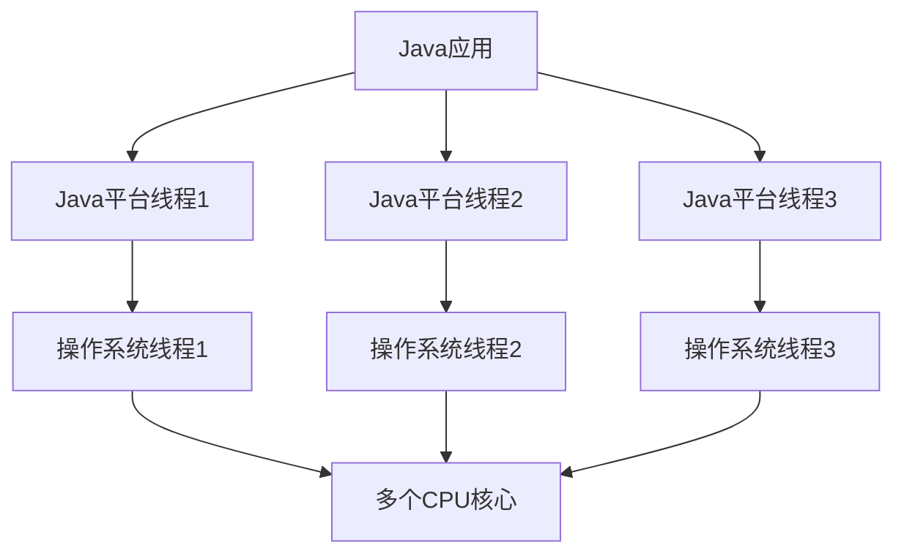
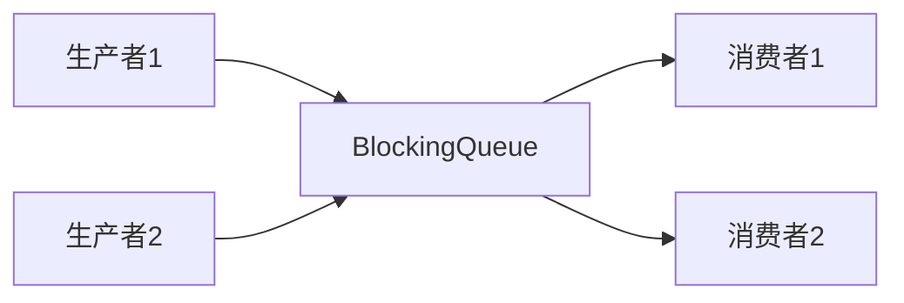
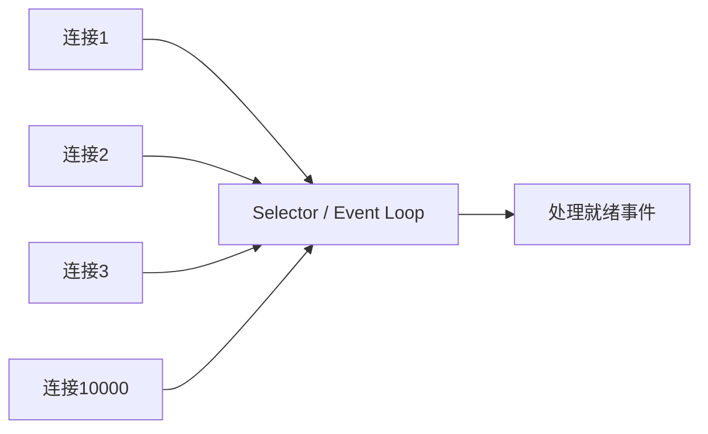
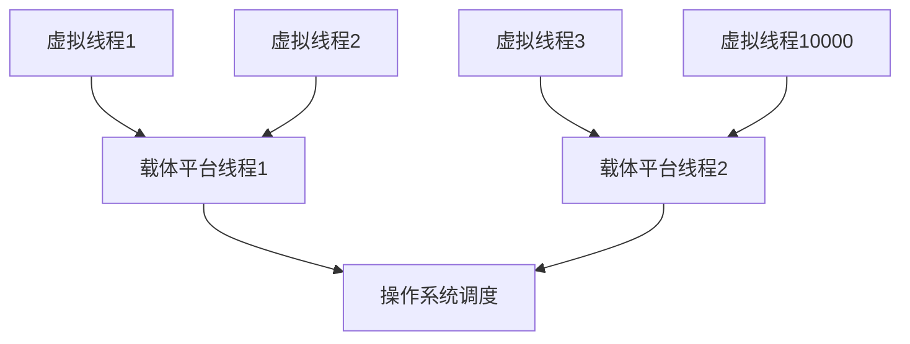
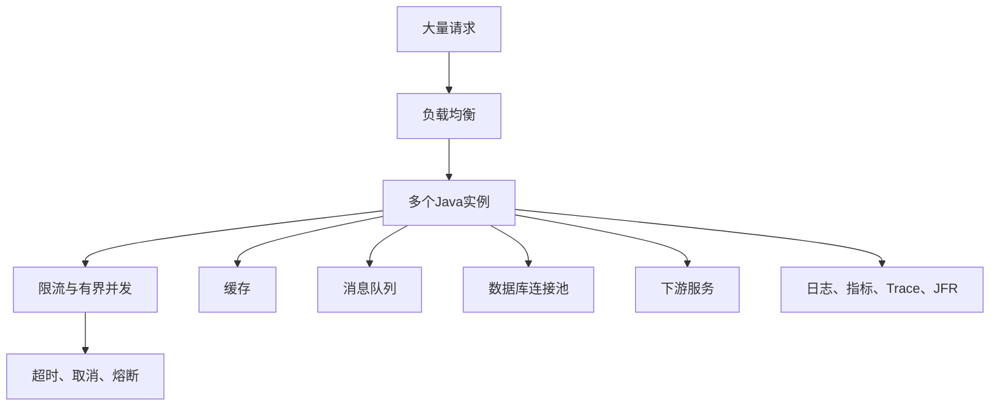
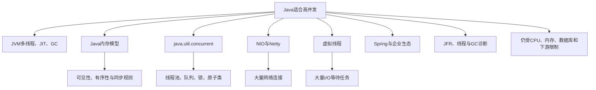

# Java 为什么适合高并发

> [!summary] 一句话结论
> **Java 适合高并发，不是因为 Java 语法会自动让程序更快，而是 JVM 提供成熟的多线程运行时和内存模型，标准库提供线程池、并发集合、锁和原子类，NIO/Netty 支持事件驱动网络，Java 21 起的虚拟线程又让大量 I/O 等待任务可以用更简单的“一任务一线程”方式扩展。**

可以先记住这个公式：

```text
Java 高并发能力
= JVM 多线程与多核执行
+ 明确的 Java 内存模型
+ java.util.concurrent 并发工具箱
+ NIO / Netty 网络模型
+ 虚拟线程
+ Spring 等服务器生态
+ GC、JIT、诊断与监控工具
```

但还必须加上一句：

> **语言和运行时只提供工具；数据库、锁、连接池、超时、限流和架构设计不正确，Java 服务一样会在高并发下崩溃。**

---

## 一、先纠正“多并发”这个说法

日常更常说：

- 并发；
- 高并发；
- 多线程；
- 并行；
- 高吞吐。

这些词不完全相同。

### Concurrency：并发

**Concurrency（并发）**表示一段时间内有多个任务都在推进。

任务不一定在同一个瞬间真的同时执行。单核 CPU 也可以在多个任务之间快速切换，让它们交替前进。

### Parallelism：并行

**Parallelism（并行）**表示多个任务在同一时刻真正同时运行，通常需要多个 CPU 核心。

### High Concurrency：高并发

**High Concurrency（高并发）**通常表示系统同一时间要处理大量尚未结束的请求、连接或任务。

例如：

- 同时有 10,000 个 HTTP 请求；
- 同时维护 100,000 个长连接；
- 大量请求正在等待数据库、Redis 或其他服务；
- 短时间内大量订单消息进入系统。

### Throughput：吞吐量

**Throughput（吞吐量）**是单位时间内完成的工作量，例如：

```text
每秒完成 5,000 个请求
```

常写成：

- RPS：Requests Per Second，每秒请求数；
- QPS：Queries Per Second，每秒查询数；
- TPS：Transactions Per Second，每秒事务数。

### Latency：延迟

**Latency（延迟）**是单个请求从开始到完成用了多久。

高吞吐不等于低延迟。一个系统可能每秒处理很多请求，但个别请求仍然很慢。

| 概念 | 关注的问题 |
|---|---|
| 并发 | 有多少任务同时处于进行中 |
| 并行 | 有多少任务在多个核心上同时计算 |
| 吞吐量 | 单位时间完成多少任务 |
| 延迟 | 单个任务需要多久 |

---

## 二、为什么 Web 请求天然需要并发

假设一个电商请求要做这些事：


CPU 真正计算的时间可能并不长，大量时间花在等待：

- 网络数据回来；
- 数据库返回查询结果；
- Redis 返回库存；
- 磁盘完成读写；
- 下游 API 响应；
- 消息队列确认。

如果服务器在等待请求 A 时什么都不做，就会浪费 CPU。并发让服务器可以在 A 等待 I/O 时继续处理 B、C、D 请求。

这类任务叫 **I/O-bound（I/O 密集型）**：主要瓶颈在输入输出和等待，而不是 CPU 计算。

---

## 三、第一个原因：Java 很早就有成熟的多线程模型

Java 从早期就把线程作为平台核心抽象。

传统 **Platform Thread（平台线程）**通常与操作系统线程紧密对应。多个 Java 平台线程可以在多个 CPU 核心上并行执行。



开发者可以使用：

- `Thread` 创建线程；
- `synchronized` 保护临界区；
- `volatile` 建立特定可见性和顺序保证；
- `wait`、`notify` 进行传统线程协作；
- 更常见地使用 `java.util.concurrent` 的高级工具。

### 为什么不建议业务代码到处手动 new Thread

操作系统线程并不轻：

- 创建和销毁有成本；
- 每个线程需要栈等内存；
- 线程太多会产生调度和上下文切换成本；
- 无限制创建可能耗尽内存或操作系统资源；
- 生命周期、异常和关闭难以统一管理。

因此传统 Java 服务一般使用线程池，而不是每来一个任务就无限创建平台线程。

---

## 四、第二个原因：Java Memory Model 定义了并发规则

**JMM（Java Memory Model，Java 内存模型）**规定多个线程之间怎样观察共享内存中的读写。

现代 CPU、编译器和 JVM 会为了性能进行：

- 指令重排序；
- 寄存器和缓存优化；
- JIT 编译优化；
- 多核缓存处理。

如果没有明确规则，一个线程修改变量后，另一个线程什么时候能看到，会非常难以推断。

JMM 主要帮助定义：

- **Visibility（可见性）**：一个线程的写入何时能被另一个线程看到；
- **Ordering（有序性）**：哪些操作必须表现出先后关系；
- **Atomicity（原子性）**：哪些操作不能被看成中途拆开的状态；
- **Happens-before（先行发生）**：哪些动作之间具有保证的可见性和顺序关系。

### Happens-before 是什么

它不是单纯说“墙上时钟先发生”，而是并发语义中的保证：

> 如果操作 A happens-before 操作 B，那么 B 必须能看到 A 按规则产生的效果。

常见例子包括：

- 解锁某个监视器 happens-before 之后对同一监视器加锁；
- 对 `volatile` 变量的写 happens-before 之后对它的读；
- 启动线程之前的操作，对被启动线程具有规定的可见性；
- 线程结束前的操作，对成功 `join` 该线程的一方具有规定关系。

这套模型让 JVM 实现可以在不同 CPU 和操作系统上优化，同时仍向开发者提供统一的并发语义。

> [!warning] 有内存模型不等于代码自动线程安全
> 如果多个线程无同步地读写可变共享数据，仍然可能发生数据竞争、丢失更新和不可预期结果。JMM 是规则说明书，不是自动修复器。

---

## 五、第三个原因：`java.util.concurrent` 工具非常成熟

Java 标准库的 `java.util.concurrent` 包提供大量经过长期使用的并发构件，避免开发者重复手写容易出错的底层逻辑。

### Executor 和线程池

**Executor（执行器）**把“提交任务”和“任务在哪个线程运行”分开。

```text
业务代码提交任务
        ↓
Executor负责排队、调度、执行和关闭
        ↓
平台线程池或虚拟线程运行任务
```

常见类型：

- `Executor`；
- `ExecutorService`；
- `ThreadPoolExecutor`；
- `ScheduledExecutorService`；
- `ForkJoinPool`。

### Future 与 CompletableFuture

- `Future` 表示一个以后可能完成的结果；
- `CompletableFuture` 可以组合异步阶段、错误处理和回调。

它适合某些异步工作流，但过长回调链也可能难读、难调试。虚拟线程出现后，许多 I/O 流程可以重新使用更直观的顺序代码。

### Concurrent Collections：并发集合

普通 `HashMap` 不适合被多个线程无保护地同时修改。Java 提供：

- `ConcurrentHashMap`；
- `ConcurrentLinkedQueue`；
- `CopyOnWriteArrayList`；
- `ConcurrentSkipListMap` 等。

这些集合针对并发访问设计，通常比“给整个普通集合套一把大锁”拥有更好的扩展性或更适合特定读写比例。

### BlockingQueue：阻塞队列

`BlockingQueue` 很适合生产者—消费者模型：



队列为空时消费者可以等待；有界队列满时生产者可以等待或失败，这可以成为背压设计的一部分。

### Locks、Atomic 与同步器

常见工具包括：

- `ReentrantLock`：可重入锁；
- `ReadWriteLock`：读写锁；
- `StampedLock`：支持乐观读等模式；
- `AtomicInteger`、`AtomicLong`：原子变量；
- `LongAdder`：适合高竞争统计场景；
- `Semaphore`：信号量，限制同时进入的任务数；
- `CountDownLatch`：等待多个事件完成；
- `CyclicBarrier`、`Phaser`：多任务阶段协作。

关键优势不是“类很多”，而是很多常见并发模式已经有标准化、测试充分的实现。

---

## 六、第四个原因：NIO 可以用少量线程管理大量连接

**NIO（New I/O，也常解释为 Non-blocking I/O 相关体系）**提供 Channel、Buffer、Selector 等网络和文件 I/O 能力。

### 传统阻塞线程模型

```text
连接1 → 线程1等待数据
连接2 → 线程2等待数据
连接3 → 线程3等待数据
……
```

如果连接很多但大部分时间没有数据，大量平台线程会处于等待状态。

### Selector 多路复用模型

**Selector（选择器）**可以让少量线程观察许多 Channel：



线程不必阻塞在每一个连接上，而是等待“哪些连接已经可读、可写或可接受”，再处理就绪事件。

这种模型对大量长连接、网关和消息系统很有用。

### Netty 做了什么

**Netty** 是 Java 生态中成熟的异步、事件驱动网络框架，封装了大量 NIO、事件循环、Channel、Buffer、协议编解码和 TLS 等复杂细节。

许多高性能网络组件、RPC 框架和网关会直接或间接使用 Netty。

但事件循环有一个重要要求：

> **不要在 Event Loop 中执行长时间阻塞或重 CPU 任务，否则一个事件循环负责的许多连接都会被拖慢。**

---

## 七、第五个原因：Java 21 的虚拟线程

**Virtual Thread（虚拟线程）**是在 JDK 中实现的轻量级线程。

它在 Java 21 通过 JEP 444 成为正式特性。

### 平台线程和虚拟线程的区别



平台线程通常长期占用一个操作系统线程。虚拟线程只在需要执行 Java 代码时挂载到少量平台线程上；执行支持的阻塞 I/O 时，JDK 可以暂停虚拟线程并释放载体线程去运行其他虚拟线程。

### 它为什么适合服务器

Web 请求往往：

```text
算一点 → 等数据库 → 算一点 → 等HTTP → 算一点 → 返回
```

传统平台线程在等待时仍占用昂贵的操作系统线程资源。虚拟线程等待时可以暂时卸载，因此可以存在远多于操作系统线程的并发任务。

这让开发者仍可写直观的顺序代码：

```java
try (var executor = Executors.newVirtualThreadPerTaskExecutor()) {
    executor.submit(() -> callDatabase());
    executor.submit(() -> callRemoteApi());
}
```

示例表达的是“一项任务创建一个虚拟线程”。具体生产代码还需要超时、取消、异常处理和资源限制。

### 虚拟线程不是什么

OpenJDK 官方特别强调：

- 虚拟线程不是“更快的线程”；
- 它主要提高规模和吞吐，而不是让单个任务降低延迟；
- 它适合高并发、经常等待的 I/O 任务；
- CPU 密集任务不会因为创建十万个虚拟线程就计算更快；
- 虚拟线程很轻，通常不应该像平台线程那样池化；
- 应为每个任务创建一个虚拟线程，再对数据库连接等稀缺资源单独限流。

### Java 24 又改善了什么

JEP 491 在 Java 24 改进了虚拟线程与 `synchronized` 的配合，消除了绝大多数因为进入 `synchronized` 区域而长期固定载体线程的情况。

仍然不能理解成“虚拟线程从此没有任何限制”。原生代码、某些 JVM 内部场景、下游资源容量和应用锁竞争仍需观察。

---

## 八、传统 Java 高并发的三种主要模型

Java 并不是只有一种并发写法。

### 模型 A：平台线程池 + 阻塞 I/O

```text
请求 → 线程池 → 阻塞等待数据库/网络 → 返回
```

优点：

- 代码直观；
- 调试和堆栈容易理解；
- 传统框架支持成熟。

限制：

- 平台线程数量有限；
- 大量任务等待 I/O 时，线程容易成为吞吐瓶颈；
- 线程池和队列必须合理配置。

### 模型 B：NIO / Netty 事件驱动

```text
大量连接 → 少量Event Loop → 就绪事件 → 异步处理
```

优点：

- 很适合大量网络连接；
- 线程数量可以较少；
- 高性能网络生态成熟。

限制：

- 异步回调和状态管理更复杂；
- 不能阻塞事件循环；
- 调试跨异步阶段的调用链更困难。

### 模型 C：虚拟线程 + 阻塞风格代码

```text
每个请求 → 一个虚拟线程 → 正常阻塞式写法 → JDK负责调度
```

优点：

- 保持容易理解的顺序代码；
- 适合大量 I/O 等待请求；
- 堆栈、异常和调试模型更贴近传统线程。

限制：

- 不能突破 CPU、内存、数据库连接数和下游容量；
- 使用旧库、原生调用、ThreadLocal 或大量锁时仍需评估；
- 项目必须确认 JDK 和框架版本是否真正启用、支持虚拟线程。

| 场景 | 常见合适模型 |
|---|---|
| 普通企业 API、并发中等 | 平台线程池或虚拟线程均可评估 |
| 大量阻塞式数据库/API 调用 | 虚拟线程很有吸引力 |
| 网关、协议服务器、大量长连接 | NIO/Netty 常见 |
| CPU 密集并行计算 | 固定大小计算池、ForkJoin、并行算法 |
| 旧系统 | 先测量现有线程池和瓶颈，不要只为新技术重写 |

---

## 九、CPU 密集型为什么不能靠无限线程解决

假设服务器有 8 个 CPU 核心，任务全是在做大型数学计算，没有等待 I/O。

无论创建：

- 8 个平台线程；
- 800 个平台线程；
- 80,000 个虚拟线程；

同一时刻真正执行 CPU 指令的能力仍主要受 CPU 核心和硬件资源限制。

线程过多还可能增加：

- 调度成本；
- 缓存失效；
- 内存占用；
- 竞争；
- 尾延迟。

因此：

```text
I/O密集型：可以有很多并发任务，因为大部分在等待
CPU密集型：并行度通常应接近可用核心数，再通过测量调整
```

虚拟线程解决的是“等待时不浪费昂贵线程”的问题，不是让一颗 CPU 变成一百颗。

---

## 十、第六个原因：JVM 的 JIT 和 GC 很成熟

### JIT：即时编译

**JIT（Just-In-Time Compilation，即时编译）**会在程序运行时观察热点代码，并把重要字节码编译和优化为机器码。

可能涉及：

- 方法内联；
- 消除部分不必要操作；
- 根据真实运行情况进行优化；
- 针对当前 CPU 生成机器码。

长期运行的服务器应用可以在预热后获得较好的持续性能。

### GC：垃圾回收

**GC（Garbage Collection，垃圾回收）**自动回收不再使用的对象，减少手动释放内存和许多内存安全问题。

Java 提供多种收集器和大量调优、观测能力，可以在吞吐量、停顿时间和资源占用之间选择。

但 GC 也不是免费午餐：

- 对象分配过快会产生回收压力；
- 堆设置不合理会影响吞吐或暂停；
- 内存泄漏仍可能发生——对象一直被引用就不会回收；
- 高并发场景要关注尾延迟和暂停，而不只看平均值。

### 为什么这对高并发有帮助

成熟运行时意味着团队可以：

- 让 JVM 优化长期热点代码；
- 使用成熟 GC 管理大量短生命周期请求对象；
- 通过参数和监控观察堆、线程、锁与暂停；
- 在统一运行时上跨平台部署。

它提高的是工程可管理性，不保证默认参数适合所有负载。

---

## 十一、第七个原因：高并发生态成熟

企业很少只靠语言标准库搭建完整服务。Java 的优势还来自长期生态积累。

### Web 和服务框架

- Spring Boot；
- Spring MVC；
- Spring WebFlux；
- Jakarta Servlet；
- Tomcat、Jetty、Undertow；
- Micronaut、Quarkus 等。

### 网络和 RPC

- Netty；
- gRPC Java；
- RSocket；
- 各类网关和服务框架。

### 数据与消息

- JDBC 和数据库连接池；
- Redis 客户端；
- Kafka、RabbitMQ、Pulsar 等客户端；
- ORM 和事务框架。

### 监控与诊断

- 线程 dump；
- Heap dump；
- `jcmd`、`jstack`、`jstat`；
- JFR（Java Flight Recorder，Java 飞行记录器）；
- JDK Mission Control；
- Micrometer、OpenTelemetry 等指标和追踪生态。

高并发问题往往只在生产压力下偶发。能观察线程、锁、分配、GC、CPU 和调用延迟，本身就是非常重要的能力。

---

## 十二、为什么静态类型和异常堆栈也有帮助

高并发系统通常代码量大、团队成员多、运行时间长。

Java 的静态类型可以在编译阶段发现一部分接口和数据类型错误。线程仍保留清晰的调用栈，异常通常可以沿调用链传播并记录。

尤其虚拟线程保留“一请求一线程”的思维后，开发者仍能使用：

- 顺序控制流；
- `try/catch/finally`；
- Stack Trace（堆栈跟踪）；
- 调试器单步；
- 线程分析工具。

这不直接提高 CPU 性能，却能降低大型并发系统的理解、排错和长期维护成本。

---

## 十三、Java 高并发为什么仍然会失败

语言再成熟，也绕不过真实资源上限。

### 1. 数据库连接池太小或太大

连接太小：大量请求排队。

连接太大：数据库承受不住，锁竞争和上下文开销加剧。

创建十万个虚拟线程不等于数据库能同时执行十万个 SQL。

### 2. 下游服务变慢

如果没有超时和并发限制，请求会不断堆积：

```text
下游变慢
  ↓
本服务等待任务增加
  ↓
内存、连接、队列被占满
  ↓
更多超时和重试
  ↓
雪崩
```

### 3. 锁竞争

如果所有请求都争抢同一把锁，即使有很多线程，关键部分仍只能一个个执行。

### 4. 共享可变状态

并发修改普通集合、计数器或缓存，可能发生数据竞争和错误结果。

### 5. 无界队列

请求进入速度大于处理速度时，无界队列会持续吃内存，最终可能触发长时间 GC 或 OOM。

**OOM（Out Of Memory，内存耗尽）**表示 JVM 无法继续分配所需内存。

### 6. 在事件循环中阻塞

Netty/WebFlux 的少量事件循环线程一旦被数据库、文件或重计算阻塞，会拖慢其负责的大量连接。

### 7. 无限重试

下游越坏，上游重试越多，会形成 **Retry Storm（重试风暴）**。

### 8. 没有背压

**Backpressure（背压）**是下游处理不过来时，让上游减速、排队在有限范围内，或者明确拒绝，而不是无限接收。

---

## 十四、真正的高并发系统还需要什么

Java 只是其中一层。



常见工程能力包括：

- 负载均衡和水平扩容；
- 无状态服务或明确的状态管理；
- 缓存；
- 数据库索引和 SQL 优化；
- 合理连接池；
- 消息队列和异步削峰；
- 超时；
- 限流；
- 熔断和降级；
- 幂等；
- 背压；
- 日志、指标和分布式追踪；
- 容量规划和压测；
- 故障隔离与恢复。

因此“Java 能高并发”不等于“写一个 Spring Boot 接口就自动获得百万并发”。

---

## 十五、线程池为什么重要

在传统平台线程模型中，线程池主要解决：

1. 复用昂贵线程；
2. 限制同时执行任务数；
3. 用队列吸收短期波动；
4. 统一任务提交和关闭；
5. 配置拒绝策略。

### 一个线程池有哪些关键参数

- 核心线程数；
- 最大线程数；
- 队列类型和容量；
- 空闲线程存活时间；
- 线程工厂；
- 拒绝策略。

### 无界队列为什么危险

假设每秒进入 10,000 个任务，只能处理 8,000 个：

```text
每秒积压 2,000 个
一分钟积压 120,000 个
```

线程池看似还活着，内存和延迟却不断恶化。

### 虚拟线程时代还要不要限流

需要，但限流对象变了。

- 虚拟线程本身通常不需要池化；
- 数据库连接、外部 API 配额、内存和 CPU 仍然稀缺；
- 可以用 `Semaphore`、有界连接池和速率限制控制这些资源。

> **不要用平台线程池大小偶然充当全部业务背压；应明确限制真正稀缺的资源。**

---

## 十六、Java 与 Go、Node.js、Rust 的并发思路

| 技术 | 常见并发模型 | 典型印象 |
|---|---|---|
| Java | 平台线程池、NIO/Event Loop、虚拟线程 | 选择多、生态成熟、企业工程能力强 |
| Go | goroutine、channel、运行时调度 | 轻量并发语法直接，云服务常见 |
| Node.js | JavaScript Event Loop + 异步 I/O | I/O 并发自然，主线程不能被重计算阻塞 |
| Rust | OS 线程或 async runtime | 性能和资源控制强，类型与所有权约束严格 |

不能只问“谁并发最高”。实际结果取决于：

- 工作负载是 I/O 还是 CPU；
- 库和框架；
- 团队能力；
- 数据库和网络；
- 内存预算；
- 延迟目标；
- 部署方式；
- 代码和参数；
- 是否做过真实压测。

Go 的 goroutine 与 Java 虚拟线程有相似的“轻量任务”效果，但语言、调度、栈、生态和 API 设计并不完全相同。

---

## 十七、常见误区

### 误区 1：Java 线程越多，性能越好

错误。平台线程过多会增加内存和调度成本；CPU 密集任务也受核心数限制。

### 误区 2：虚拟线程会让单个请求变快

不一定。它主要让系统能以较低线程成本同时等待更多任务，提高可扩展性和吞吐机会。

### 误区 3：有 `ConcurrentHashMap` 就不需要考虑并发

错误。单个集合操作线程安全，不代表多个操作组成的业务事务自动原子。

### 误区 4：用了 `volatile` 就等于加锁

错误。`volatile` 提供特定可见性和顺序语义，但 `count++` 这类读—改—写复合操作仍不自动原子。

### 误区 5：用了 Spring Boot 就自动高并发

错误。线程模型、数据库、连接池、SQL、缓存、下游和代码锁都决定最终能力。

### 误区 6：非阻塞一定比阻塞快

错误。非阻塞模型减少线程等待成本，但代码复杂度、调度、序列化、缓存和实际负载都会影响结果。虚拟线程也让阻塞式代码重新具备很强可扩展性。

### 误区 7：平均延迟很低就说明系统很好

错误。高并发下要关注 P95、P99、P99.9 等尾延迟，以及错误率、超时和资源饱和。

### 误区 8：压测 RPS 越高越好

错误。如果错误率上升、数据不正确、下游被压垮或延迟不可接受，高 RPS 没有业务意义。

---

## 十八、一个简化例子

假设服务要处理 10,000 个请求，每个请求：

```text
CPU计算 2 毫秒
等待数据库 100 毫秒
CPU计算 1 毫秒
```

大部分时间都在等数据库。

### 使用少量平台线程

线程一旦阻塞等数据库，就暂时不能处理其他请求。线程数量成为吞吐限制之一。

### 使用大量平台线程

能同时等待更多请求，但线程栈、操作系统线程和调度成本上升。

### 使用 NIO/异步模型

等待数据库或网络时释放线程，少量线程可以推进大量任务，但业务代码可能变成异步链条。

### 使用虚拟线程

可以让每个请求拥有一个轻量虚拟线程；等待支持的 I/O 时释放载体线程，同时保持顺序代码。

但是，如果数据库连接池只有 50 个连接，仍然只有有限 SQL 能同时执行。其余虚拟线程必须等待连接。因此还需要：

- 有界连接池；
- 超时；
- 查询优化；
- 并发限制；
- 过载时快速失败或降级。

---

## 十九、怎样判断 Java 服务是不是真的适合这个负载

不要只凭语言宣传，应该测量。

### 先分类负载

- CPU 密集；
- I/O 密集；
- 长连接；
- 短请求；
- 读多写少；
- 数据库事务密集；
- 消息消费；
- 批处理。

### 再定义目标

- 峰值 RPS；
- 平均和 P99 延迟；
- 最大错误率；
- 内存和 CPU 上限；
- 可接受的恢复时间；
- 下游配额；
- 成本预算。

### 最后压测和观察

关注：

- CPU 使用率；
- 堆和非堆内存；
- GC 次数和暂停；
- 平台线程数和虚拟线程活动；
- 线程池队列；
- 锁竞争；
- 数据库连接池等待；
- 下游调用延迟；
- 网络连接；
- P95/P99 延迟；
- 超时和错误率。

Java 常用 JFR、线程 dump、指标和 Trace 帮助定位，但最终仍要结合业务链路解释。

---

## 二十、初学者学习顺序

建议按这个顺序理解：

1. 进程与线程；
2. 并发与并行；
3. 共享变量和数据竞争；
4. `synchronized`、`volatile`；
5. Happens-before；
6. `ExecutorService` 和传统线程池；
7. `ConcurrentHashMap`、`BlockingQueue`；
8. `AtomicInteger`、锁和信号量；
9. I/O 密集与 CPU 密集；
10. NIO、Selector 和 Event Loop；
11. `CompletableFuture`；
12. Java 21 虚拟线程；
13. 超时、限流、背压、熔断和幂等；
14. 压测、JFR、线程 dump 与 GC 观察。

初学阶段先写正确的小例子，再研究高并发优化。并发错误经常无法稳定复现，理解规则比背 API 更重要。

---

## 二十一、记忆地图



最后记住：

> **Java 的优势是“并发能力完整、实现选择多、工程生态成熟、问题可观测”；真正性能仍来自正确模型、有限资源控制和实际压测。**

---

## 关联概念

- [[常见编程语言及其用途]]：Java、Go、Rust、Node.js 等语言的典型定位与并发模型对比。
- [[TCP、HTTP、HTTPS与WebSocket]]：高并发后端真正处理的网络连接和应用协议。
- [[状态机与幂等性]]：并发请求、重试和消息重复时怎样保证业务结果正确。
- [[Redis缓存与分布式协调]]：缓存、分布式锁、租约和限流怎样影响并发系统。
- [[高可用、健康检查与故障恢复]]：高流量服务怎样面对下游故障、过载与恢复。
- [[防火墙与端口对外开放]]：Java 网络服务监听端口后还要经过哪些网络边界。
- [[SDK与API]]：Java 服务怎样调用数据库、远程 API 和其他服务。

## 参考资料

以下内容于 2026-08-22 核对：

- [OpenJDK JEP 444：Virtual Threads](https://openjdk.org/jeps/444)
- [OpenJDK JEP 491：Synchronize Virtual Threads without Pinning](https://openjdk.org/jeps/491)
- [Oracle Java API：java.util.concurrent](https://docs.oracle.com/en/java/javase/26/docs/api/java.base/java/util/concurrent/package-summary.html)
- [Oracle Java API：java.nio.channels](https://docs.oracle.com/en/java/javase/26/docs/api/java.base/java/nio/channels/package-summary.html)
- [Java Language Specification：Threads and Locks](https://docs.oracle.com/en/java/javase/26/docs/specs/jls/jls-17.html)
- [Oracle：HotSpot Virtual Machine Garbage Collection Tuning Guide](https://docs.oracle.com/en/java/javase/25/gctuning/hotspot-virtual-machine-garbage-collection-tuning-guide.pdf)
- [Netty 官方文档](https://netty.io/wiki/user-guide.html)
- [Oracle：JDK Mission Control](https://docs.oracle.com/en/java/java-components/jdk-mission-control/index.html)
