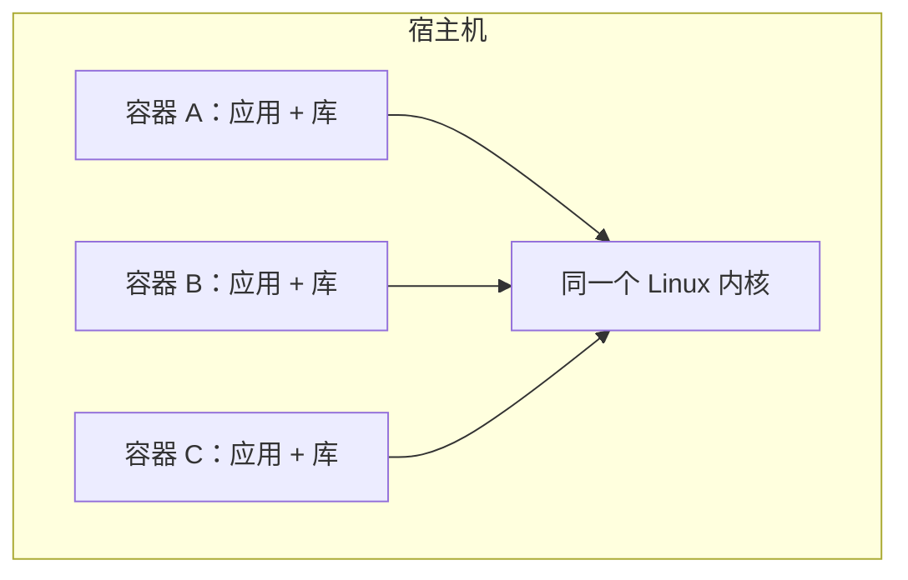
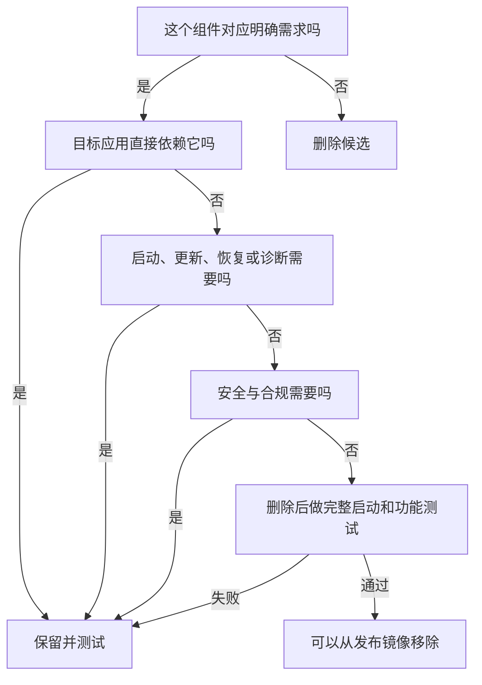
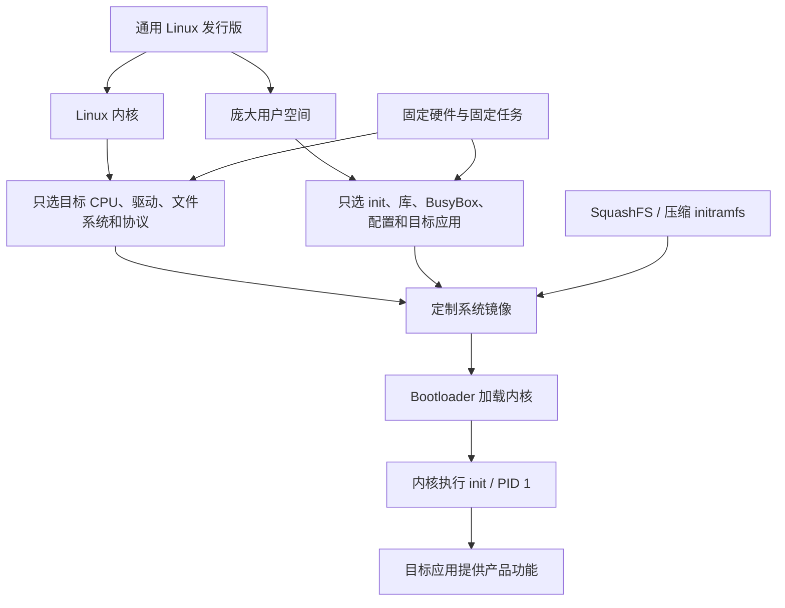

# Linux 为什么可以做得很小

> [!summary] 一句话结论
> **Linux 能做得很小，不是因为把完整 Ubuntu 压缩成了一个小文件，而是因为 Linux 内核和用户空间可以分别裁剪：只编译目标设备需要的内核功能和驱动，再只放入根文件系统、PID 1、目标程序及其必需依赖，桌面、软件商店、开发工具、文档和无关后台服务都可以不装。这样的系统“能用”，是因为它只需完成预先规定的任务，而不是满足所有人的所有用途。**

先记住一句更口语化的话：

> **电脑里的软件不必“整套购买”。Linux 很像一盒可以按需取件的积木：路由器只拿联网所需的积木，相机只拿拍摄和上传所需的积木。**

---

## 一、先把最大的误区拆开：Linux 不完全等于 Ubuntu

日常聊天里的“Linux”至少可能指两个不同层次。

### 1. Linux 内核

**Kernel（内核，读作“科讷尔”）**是操作系统中直接管理硬件和系统资源的核心程序。

它主要负责：

- CPU 该让哪个进程运行；
- 每个进程可以使用哪些内存；
- 程序怎样访问磁盘、网卡、USB、显示器等设备；
- 文件系统怎样被挂载和访问；
- TCP/IP 等网络协议怎样工作；
- 普通程序怎样通过 **System Call（系统调用）**向内核请求服务；
- 用户、权限、进程隔离等基础机制。

Linux 内核本身不等于浏览器、桌面、软件商店、文本编辑器，也不等于日常使用的全部命令。

### 2. Linux 发行版

**Distribution（发行版，常简称 Distro）**是在 Linux 内核外面，配好一整套用户软件后形成的可使用系统。

例如一个桌面发行版通常包含：

```text
Linux 内核
+ 启动与服务管理程序
+ C 标准库和其他运行库
+ Shell 与命令行工具
+ 软件包管理器
+ 网络、声音、打印、蓝牙等服务
+ 图形服务器与桌面环境
+ 字体、图标、语言包、帮助文档
+ 浏览器、编辑器等应用
= 日常看到的完整 Linux 发行版
```

Ubuntu、Debian、Fedora、Alpine、OpenWrt 都可以使用 Linux 内核，但它们选择的用户空间组件和服务不同。

所以：

> **完整 Ubuntu 很大，主要说明它准备服务很多种硬件、用户和用途，不说明 Linux 天生必须这么大。**

### 3. 一个类比

可以把它们想成：

| 概念 | 类比 |
|---|---|
| Linux 内核 | 汽车的发动机、传动和基础控制系统 |
| 驱动 | 各种具体零件与控制系统之间的适配器 |
| 用户空间 | 仪表、空调、导航、音响、座椅控制等功能 |
| Linux 发行版 | 厂商装配完成、可以交付使用的整车 |

一台工程车和一台豪华家用车可以使用相似的机械原理，但配件数量完全不同。

---

## 二、“Linux 很小”到底在说什么

“小”并不是一个单一指标，至少有下面几种含义：

| 指标 | 它在衡量什么 |
|---|---|
| 存储体积 | 内核、根文件系统和应用放进 Flash 或磁盘后占多少空间 |
| 压缩镜像体积 | 下载或烧录的压缩文件有多大 |
| 运行内存 | 启动后内核和进程实际占用多少 RAM |
| 进程数量 | 系统启动后有多少后台程序 |
| 启动时间 | 从上电到应用可用需要多久 |
| 依赖数量 | 应用需要多少库、配置、解释器和辅助程序 |
| 攻击面 | 有多少可被外界接触和利用的功能 |

这些指标有关联，但不能混为一谈：

- 5 MB 的压缩镜像解压后不一定只有 5 MB；
- 磁盘占用很小，不代表运行内存一定同样小；
- 文件少，不代表没有安全漏洞；
- 启动快，不代表功能多；
- 一个静态链接程序磁盘上可能更大，但部署依赖更少。

所以听到“这个 Linux 只有多少 MB”时，应继续问：

1. 说的是内核、根文件系统，还是整个可烧录镜像？
2. 说的是压缩前还是压缩后？
3. 是否包含 Bootloader（引导加载程序）？
4. 是否包含应用数据、字体、网页和 AI 模型？
5. 启动后需要多少 RAM？
6. 它能完成什么任务，又舍弃了什么？

---

## 三、最小 Linux 是怎样启动起来的

一个典型的嵌入式 Linux 启动链可以简化成：


下面逐步拆开。

### 第 1 步：上电后的固件先运行

CPU 刚上电时并不会自动知道“去运行 Linux”。它通常先执行芯片或主板规定位置上的固件代码。

固件会做一些最早期工作，例如：

- 初始化最低限度的 CPU 和内存；
- 确定从哪里加载下一阶段；
- 检查或选择启动介质。

PC 上可能是 UEFI；嵌入式设备上可能是芯片内部 ROM 和厂商固件。

### 第 2 步：Bootloader 加载内核

**Bootloader（引导加载程序）**负责把 Linux 内核镜像放进内存，并把控制权交给内核。

嵌入式系统常见 U-Boot，但 Bootloader 不等于 Linux 内核。

它还可能提供：

- 内核启动参数；
- initramfs 的地址；
- **DTB（Device Tree Blob，设备树二进制文件）**。

设备树可以理解为“这块板子的硬件说明单”：CPU、内存、串口、网卡和外设位于哪里，使用什么中断等。

### 第 3 步：Linux 内核接管硬件

内核开始：

- 初始化内存管理；
- 初始化进程调度；
- 根据配置和设备树加载必要驱动；
- 建立文件系统与网络等基础能力；
- 找到最初的根文件系统；
- 寻找并执行第一个用户空间程序。

### 第 4 步：挂载 Root Filesystem

**Root Filesystem（根文件系统，常写作 rootfs）**是以 `/` 为起点的文件目录树。

它可能来自：

- 内核中携带的 initramfs；
- Flash 芯片上的分区；
- SD 卡或硬盘；
- 网络文件系统；
- 只读压缩文件系统。

**initramfs（initial RAM filesystem，初始内存文件系统）**通常是一个压缩的 `cpio` 归档。内核启动时把它解包到内存中的 rootfs。

### 第 5 步：执行 `/init`，形成 PID 1

Linux 内核文档描述的关键行为是：如果 initramfs 解开后存在 `/init`，内核就执行它，并让它成为 **PID 1**。

- **PID（Process Identifier，进程标识号）**是操作系统给进程分配的编号；
- PID 1 是第一个用户空间进程；
- 它通常继续挂载 `/proc`、`/sys`、`/dev`，启动服务和目标应用；
- 如果要使用另一个真正的根分区，它还可以切换过去再启动正式的 init。

这里有一个非常重要的边界：

> **内核能开始执行，不等于系统已经可用。内核最终必须成功启动一个合适的用户空间程序；否则常见结果是启动失败或 Kernel Panic（内核恐慌）。**

### 第 6 步：目标应用提供真正用途

路由器的网络管理服务启动，才算“路由器可用”；相机的采集程序启动，才算“相机可用”。

因此可以把“运行”分为四层：

| 层级 | 判断标准 |
|---|---|
| 内核开始运行 | CPU 已进入 Linux 内核代码 |
| 内核成功初始化 | 内存、调度和必要驱动等已就绪 |
| 用户空间启动 | `/init` 或其他 PID 1 已运行 |
| 产品功能可用 | 设备真正需要的应用和服务已就绪 |

---

## 四、一个最小可用系统究竟需要什么

不存在适合所有硬件的唯一“最小文件清单”，但基本组成可以理解为：

```text
必要的启动固件和 Bootloader
+ 为目标 CPU 与硬件配置的 Linux 内核
+ 内核识别硬件所需的信息，例如设备树
+ 可作为 / 的根文件系统
+ 内核能执行的 init / PID 1
+ init 和目标应用真正需要的库、配置与数据
+ 产品的目标应用
```

一个用于教学的极简 rootfs 目录可能看起来像：

```text
/
├── init
├── bin/
│   └── busybox
├── dev/
├── proc/
├── sys/
└── etc/
```

这只是结构示意，不是说创建几个空目录就能启动。

### 必须特别注意的依赖

#### 1. CPU 架构必须匹配

为 x86-64 编译的程序通常不能直接放到 ARM 设备运行。内核、程序和库都要面向正确的架构和 ABI。

**ABI（Application Binary Interface，应用二进制接口）**规定编译好的程序怎样调用函数、使用寄存器和组织二进制数据。

#### 2. 必要驱动必须在正确时机可用

如果根文件系统放在某种 Flash 或存储控制器上，读取这种设备所需的驱动必须足够早地可用。

驱动可以：

- 直接编译进内核；
- 编译成 Kernel Module（内核模块），以后按需加载。

但如果“加载模块所需的磁盘”本身就必须靠这个模块才能读取，就会形成先有鸡还是先有蛋的问题。早期启动所需驱动通常直接编进内核，或放进 initramfs。

#### 3. 动态程序需要加载器和共享库

如果 `/init` 是动态链接程序，那么只有这个文件还不够；它引用的动态加载器和共享库也必须存在。

可以用 `ldd` 检查一个常规 Linux 动态程序依赖哪些共享库：

```bash
ldd ./my-program
```

而一个正确构建的静态链接程序，可以把需要的库代码包含进自身，减少启动时的外部文件依赖。

#### 4. 脚本需要解释器

如果 `/init` 是 Shell 脚本：

```sh
#!/bin/sh
```

那么 `/bin/sh` 必须存在且能运行。脚本文件存在，不代表系统就有解释它的程序。

#### 5. PID 1 有特殊责任

PID 1 不能把自己当作普通的一次性命令：

- 它通常不能完成任务后直接退出；
- 如果它启动子进程，需要考虑回收已结束子进程；
- 它对某些信号的默认处理与普通进程有区别；
- 它退出往往意味着整个用户空间无法继续正常工作。

所以“直接把业务程序当 PID 1”是可以做到的，但业务程序必须按 PID 1 的处境设计，或在前面放一个轻量 init。

---

## 五、Linux 内核为什么可以裁剪

### 1. 内核有大量编译时配置

Linux 内核并不是每次都把所有支持的硬件和功能编译进去。它使用 **Kconfig（Kernel Configuration，内核配置系统）**选择功能。

可以选择的内容包括：

- 处理器架构和具体特性；
- 成千上万种硬件驱动；
- 不同文件系统；
- 网络协议和过滤功能；
- USB、声音、图形、蓝牙等子系统；
- 虚拟化功能；
- 调试、追踪与性能分析功能；
- 各种安全模块。

官方构建系统甚至提供 `make tinyconfig`，用于生成“尽可能小”的初始内核配置。

但要注意：

> **tinyconfig 的目标是小，不是自动帮你的硬件生成可启动配置。**

它很可能缺少你的串口、存储、网卡或根文件系统驱动。实际工作是从一个已知可启动配置出发逐项裁剪，或从小配置逐项加入目标设备必需功能。

### 2. 通用电脑要“以防万一”，固定设备不用

桌面发行版不知道用户会插入什么：

- 不同品牌显卡；
- 各种 USB 设备；
- 不同 Wi-Fi 与蓝牙芯片；
- 多种磁盘和文件系统；
- 虚拟机、打印机、摄像头等。

所以它需要广泛支持。

嵌入式产品的硬件在出厂前已经确定。例如一台路由器可能永远只有：

- 一种 ARM SoC；
- 固定容量的内存和 Flash；
- 两种固定网卡芯片；
- 一个串口；
- 某一种根文件系统。

不可能出现的硬件，其驱动就没有必要随产品出货。

### 3. Linux 是“可配置的宏内核”，不是一整块不可拆代码

Linux 通常被归类为 **Monolithic Kernel（宏内核）**，许多核心子系统和驱动运行在内核态。但“宏内核”不等于“所有功能必须一起编译”。

Linux 同时具有：

- 大量配置开关；
- 可加载内核模块；
- 按架构和子系统组织的源代码；
- 由构建系统只编译选中部分的能力。

所以它可以是“宏内核架构”，又是“高度可配置、可以裁剪的实现”。

---

## 六、用户空间为什么也可以很小

内核启动后，日常命令和应用运行在 **User Space（用户空间）**。大型发行版的绝大部分文件通常属于用户空间，因此这里有很大的精简空间。

### 1. 不安装不需要的东西

单用途设备常常可以去掉：

- 图形桌面和窗口系统；
- 浏览器和办公软件；
- 软件包管理器及其缓存；
- 编译器、头文件和构建工具；
- 多余的 Shell 和管理工具；
- 打印、蓝牙、音频等无关服务；
- 多国语言包、字体、帮助文档和手册页；
- 测试文件、源代码、调试符号；
- 不使用的共享库；
- 自动发现和兼容各种 PC 硬件的组件。

### 2. BusyBox：一个程序扮演许多命令

**BusyBox** 是小型和嵌入式 Linux 中非常常见的工具集合。官方把它形容成“嵌入式 Linux 的瑞士军刀”。

它把许多常见 Unix 工具的精简实现放进一个可执行文件，例如：

- `sh`；
- `ls`；
- `cp`；
- `mv`；
- `mount`；
- `ps`；
- `ip`；
- `init`。

目录里看起来可能有许多命令：

```text
/bin/sh
/bin/ls
/bin/cp
/bin/mount
```

但这些名称可以只是指向同一个 `/bin/busybox` 的符号链接：

```text
/bin/ls  ──────┐
/bin/cp  ──────┼──> /bin/busybox
/bin/sh  ──────┘
```

BusyBox 根据自己被用什么名字调用，选择执行哪个 **Applet（小程序功能）**：

```bash
/bin/busybox ls
```

和通过名为 `ls` 的链接调用 BusyBox，可以得到 `ls` 功能。

这样做小的原因包括：

- 许多命令可以共享相同的底层代码；
- 不需要每个命令都重复携带完整的可执行文件结构；
- 可以在编译时只选择产品真正需要的 applet；
- 功能和命令选项通常比 GNU 完整工具更精简。

BusyBox 不是 Linux 内核。它是运行在 Linux 内核之上的用户空间工具集。

### 3. 使用更轻量的 C 标准库

许多 C/C++ 程序不直接手写每一次系统调用，而是通过 **libc（C Standard Library，C 标准库）**使用文件、内存、字符串、线程等常见能力。

常见实现包括：

- glibc：GNU C Library，通用 Linux 发行版常见，功能和兼容性广；
- musl：面向 Linux 的轻量 C 标准库实现，重视简洁和静态链接；
- uClibc-ng：也常见于资源受限和嵌入式场景。

选择 musl 等实现，有时可以减少库和程序体积，但不是“换了就必然更好”：

- 某些依赖 glibc 特有行为的软件可能需要适配；
- 预编译的第三方二进制可能不兼容；
- 调试、语言环境、DNS 等细节需要测试；
- 性能和兼容性不能只看文件大小。

### 4. 静态链接与动态链接各有取舍

**Static Linking（静态链接）**把需要的库代码复制进可执行程序；**Dynamic Linking（动态链接）**让多个程序在运行时使用共享库。

| 方案 | 优点 | 代价 |
|---|---|---|
| 静态链接 | 单文件部署简单；不容易漏掉动态加载器和库 | 每个程序可能重复携带库代码；修复库漏洞通常要重新构建程序 |
| 动态链接 | 多个程序可共享库；库可以集中升级 | 必须携带正确加载器和共享库；依赖关系更复杂 |

如果系统只有一两个程序，静态链接常常很方便；如果系统有大量程序，共享库可能更节省总体空间。不能简单记成“静态一定更小”。

### 5. 只运行一个目标程序

极端情况下，用户空间可以没有交互式 Shell、没有软件包管理器，也没有常见管理命令，而是让一个专门编写的程序承担 PID 1 并完成设备任务。

此时系统依然可以工作，只是人不能像使用 Ubuntu 那样登录进去随意操作。

这说明：

> **“机器能工作”和“人能方便地进入机器调试”是两种不同需求。**

---

## 七、根文件系统怎样继续缩小

### 1. initramfs：把早期文件系统打包进启动流程

initramfs 可以只放：

- `/init`；
- 少量命令；
- 必要驱动模块；
- 挂载真实根文件系统所需工具；
- 救援或单用途应用。

启动完成后，内核还可以丢弃一部分只在初始化阶段使用的代码和数据。

### 2. SquashFS：只读压缩文件系统

**SquashFS** 是 Linux 支持的压缩只读文件系统，适合受限存储和嵌入式设备。

它能够压缩：

- 文件内容；
- inode 等元数据；
- 目录信息。

只读有几个好处：

- 更容易压缩；
- 不容易被意外改坏；
- 每次重启都能回到稳定的基础系统；
- 便于做镜像校验和升级。

如果设备又需要保存少量修改，可以采用：

```text
只读 SquashFS 基础层
+ 可写的数据分区或 OverlayFS 上层
= 用户看到的可写系统
```

**OverlayFS（叠加文件系统）**可以把只读下层和可写上层合并成一个目录视图。

### 3. 删除开发期产物

产品运行通常不需要：

- 编译器和构建缓存；
- C/C++ 头文件；
- 静态开发库；
- 单元测试；
- 源码；
- 大量调试符号；
- 软件包下载缓存。

对可执行文件执行 **strip（移除符号信息）**，也能减少发布体积。但发布团队通常应在别处保存带符号版本，否则崩溃分析会更困难。

---

## 八、为什么删掉这么多以后还“能用”

核心原因不是某一种压缩算法，而是下面几种设计共同作用。

### 原因 1：任务边界明确

一台路由器不需要运行 Photoshop，一台摄像头不需要安装数据库管理桌面。

产品定义越固定，就越能提前回答：

- 只有哪一种 CPU？
- 只需要哪些设备驱动？
- 只使用哪些网络协议？
- 只需要哪几个程序？
- 用户是否需要登录终端？
- 系统是否允许现场安装新软件？

知道答案后就能排除大量“也许以后会用到”的组件。

### 原因 2：内核和应用之间有清楚接口

用户程序主要通过系统调用使用内核能力。只要程序需要的系统调用、驱动、文件和库仍然存在，它不关心系统有没有桌面和软件商店。

例如一个网络服务可能只需要：

- 创建进程和线程；
- 分配内存；
- 打开配置文件；
- 创建网络 Socket；
- 监听端口；
- 读取和写入数据。

它不需要显卡、打印机或蓝牙驱动。

### 原因 3：功能可以在构建时选择

内核、BusyBox、Buildroot 等工具都允许在构建阶段按目标设备选择组件，而不是运行时再携带所有可能功能。

### 原因 4：固定硬件不需要通用兼容包袱

通用系统要应对未知硬件，产品系统只需应对出厂硬件。

### 原因 5：一个实现可以复用公共代码

BusyBox 的多个 applet 共享公共代码；动态库可以供多个程序共享；内核中的公共子系统也为不同驱动提供统一机制。

### 原因 6：可压缩、只读、分层存储

文件和元数据可以用 SquashFS 等压缩；稳定基础系统可以只读；变化的数据单独保存。这样无需为通用写入和软件安装准备完整结构。

### 原因 7：Linux 继承了模块化组合思想

Unix/Linux 文化倾向于让不同工具有明确职责，通过文件、标准流和进程组合。详见 [[Unix与Linux设计哲学：文件、小工具与管道]]。

这不代表所有 Linux 软件天然都小，而是这种分层和清晰边界让“只选择所需部分”更可行。

---

## 九、用三个真实场景理解

### 场景 1：家用路由器

一个路由器系统可能只需要：

```text
Linux 内核
+ 网卡、Wi-Fi、Flash 等固定驱动
+ TCP/IP、路由、桥接和防火墙能力
+ BusyBox 基本命令
+ DHCP、DNS、Wi-Fi 等服务
+ 一个 Web 管理页面
+ 配置与升级程序
```

它不需要：

- 桌面窗口；
- 办公软件；
- 完整开发环境；
- 几千种 PC 硬件驱动。

对路由器来说，能够转发网络流量、保存配置和升级，就是“可用”。

### 场景 2：网络摄像头

它可能只保留：

- 摄像头传感器驱动；
- 视频编码器驱动；
- 网络和存储驱动；
- 采集、编码和上传程序；
- 一个配置接口；
- 日志、时间同步和更新功能。

即使它没有 `bash`、没有 `apt`、没有显示器，仍然能完成监控任务。

### 场景 3：救援系统

initramfs 中可以放 BusyBox 和少量磁盘、网络工具。主系统损坏时，它仍可：

- 检查分区；
- 挂载磁盘；
- 恢复文件；
- 下载修复镜像；
- 切换到修复后的根文件系统。

它功能少，却对“救援”这个目标足够有用。

---

## 十、Buildroot 在这件事里做什么

**Buildroot** 是一个自动构建嵌入式 Linux 系统的工具。它可以为目标设备生成：

- Cross-compilation Toolchain（交叉编译工具链）；
- Root Filesystem（根文件系统）；
- Linux Kernel Image（Linux 内核镜像）；
- Bootloader（引导加载程序）。

### 什么叫交叉编译

例如在性能较强的 x86-64 Windows/Linux 开发机上，生成可以给 ARM 路由器运行的程序，这叫 **Cross Compilation（交叉编译）**。

```text
x86-64 开发电脑
        │ 编译
        ▼
ARM 目标设备可运行的内核、库和程序
```

Buildroot 的价值不是“发明了最小 Linux”，而是把下面这些相互依赖的工作组织起来：

1. 选择目标 CPU；
2. 构建合适的编译器和 libc；
3. 构建内核；
4. 选择 BusyBox 和其他软件包；
5. 生成 rootfs；
6. 生成可烧录或可启动的镜像。

### Buildroot、Yocto 和 Alpine 不完全相同

| 名称 | 更像什么 | 典型场景 |
|---|---|---|
| Buildroot | 简洁的嵌入式系统镜像生成器 | 学习、固定设备、快速构建单用途系统 |
| Yocto Project | 构建定制 Linux 发行版的工程体系 | 复杂产品线、分层定制、长期维护和可复现构建 |
| Alpine Linux | 已有包管理生态的轻量发行版 | 服务器、容器、轻量通用环境 |

它们都可能得到较小系统，但抽象层次、维护方式和使用目标不同。

---

## 十一、很小的容器镜像，不等于很小的完整 Linux

这是另一个高频误区。

**Container（容器）**本质上是宿主机上的隔离进程。Linux 容器通常使用宿主 Linux 内核提供的 namespace、cgroup 等隔离机制。



所以一个很小的容器镜像可以只带：

```text
目标程序 + 程序需要的用户空间库和文件
```

它通常不需要在镜像中携带自己的 Linux 内核，因为运行它的宿主机已经有内核。

对比：

| 对象 | 是否通常自带内核 | 能否单独在裸硬件上启动 |
|---|---:|---:|
| 嵌入式 Linux 固件 | 是 | 可以，但还需要硬件固件/Bootloader 等配合 |
| 虚拟机镜像 | 是 | 在虚拟硬件环境中启动 |
| Linux 容器镜像 | 否，通常共享宿主内核 | 不可以 |

例如所谓 `scratch` 容器镜像可以几乎没有用户空间基础文件，只放一个静态编译程序。但这不是“一个没有内核也能独立启动的 Linux”，而是“借用宿主内核运行的一个隔离程序”。

在 Windows 或 macOS 的 Docker Desktop 上，Linux 容器通常实际共享 Docker Desktop 管理的 Linux 虚拟机内核，而不是直接使用 Windows 或 macOS 内核。

---

## 十二、“小”不是免费午餐

每删除一个组件，都可能失去某种能力。

### 1. 调试更困难

没有 Shell、`ps`、`ip`、`strace`、日志工具时，产品出问题后很难现场观察。

工程上常见折中是：

- 生产镜像保持精简；
- 单独保留调试镜像；
- 通过受控方式开启串口或维护模式；
- 在构建服务器保存调试符号。

### 2. 更新可能更复杂

没有软件包管理器时，不能随手执行 `apt install` 或只更新一个包。产品可能需要：

- 整体镜像 A/B 更新；
- 签名验证；
- 断电恢复；
- 失败回滚；
- 数据与系统分区分离。

### 3. 兼容性降低

删掉驱动和库后，新硬件或新软件不一定能直接使用。

### 4. 压缩会消耗计算

压缩文件系统节省 Flash 空间和读取流量，但使用文件时需要解压。压缩算法选择是在体积、CPU 时间、内存和启动速度之间权衡。

### 5. 静态链接也有维护代价

某个基础库出现漏洞时，每一个静态链接它的程序可能都要重新构建和发布；动态共享库有时可以集中更新。

### 6. 极小系统未必适合所有设备

有些微控制器只有很少的 RAM 和 Flash，或者要求非常严格的确定性实时响应。这时 Linux 即使裁剪后仍可能不合适，可能选择：

- Bare Metal（裸机程序，没有通用操作系统）；
- RTOS（Real-Time Operating System，实时操作系统）；
- 专用固件。

Linux 适合“资源已经能支撑内存管理、进程、驱动和复杂网络，同时希望使用成熟生态”的设备，而不是所有带芯片的设备。

---

## 十三、小系统一定更安全吗

不一定。

减少无关服务、端口、解释器和工具，通常可以缩小 **Attack Surface（攻击面）**。攻击者能接触和利用的入口可能变少。

但是“小”不能替代安全设计。一个很小的系统仍可能：

- 使用有漏洞的旧内核；
- 所有程序都以 root 运行；
- 开放不安全的管理端口；
- 把默认密码写进固件；
- 没有签名升级和回滚保护；
- 没有及时更新机制；
- 泄露 TLS 私钥；
- 允许任意写入系统分区。

更稳妥的做法包括：

- 关闭不用的功能和端口；
- 及时更新内核与依赖；
- 默认使用只读根文件系统；
- 把可写业务数据单独存放；
- 使用最小权限和 Linux capabilities；
- 对固件和更新包做数字签名；
- 使用 Secure Boot / Verified Boot；
- 保存 SBOM 并跟踪组件漏洞；
- 对外服务配合 [[防火墙与端口对外开放|防火墙]] 与 [[TLS与数字证书|TLS]]。

详见 [[软件供应链：代码签名、SBOM与发布门禁]]。

---

## 十四、常见误区

### 误区 1：Linux 内核就是完整操作系统

不准确。内核负责核心资源和硬件机制，但一个有用途的系统通常还需要根文件系统、PID 1、库、配置和应用。

### 误区 2：BusyBox 是一个很小的 Linux 内核

错误。BusyBox 是用户空间工具集合，要运行在 Linux 内核之上。

### 误区 3：有 `/init` 文件就一定能启动

错误。还要看：

- CPU 架构是否正确；
- 文件是否可执行；
- 脚本解释器是否存在；
- 动态加载器和共享库是否存在；
- 内核能否读取 rootfs；
- 必要设备和控制台驱动是否可用。

### 误区 4：系统必须有 systemd

错误。systemd 是常见的 init 与服务管理体系，但不是 Linux 内核强制要求。BusyBox init、OpenRC、runit、s6 或专用 PID 1 都可以在合适场景使用。

### 误区 5：系统必须有 Shell

错误。Shell 方便人输入命令，却不是业务程序运行的必要条件。只是没有 Shell 会显著增加调试难度。

### 误区 6：小型 Linux 就是 Alpine

不准确。Alpine 是轻量发行版；专门为一块板子裁剪的 Buildroot 系统可以采用完全不同的组件和结构。

### 误区 7：很小的 Docker 镜像就是很小的完整 Linux

错误。容器通常共享宿主机的 Linux 内核，镜像体积没有计算被共享的宿主内核。

### 误区 8：压缩镜像多大，运行时就只占多大

错误。文件解压、页缓存、内核数据结构、进程堆栈和运行数据都会占 RAM。

### 误区 9：越小一定越快、越稳定、越安全

错误。裁剪可能减少启动工作，也可能删掉诊断、安全或恢复能力。正确目标是“保留满足产品需求和运维需求的最小集合”，而不是盲目追求最小数字。

---

## 十五、怎样判断一个组件能不能删

可以依次问五个问题：



最危险的做法是只看文件名，觉得“不认识，所以删除”。正确方法是：

1. 从产品需求确定能力；
2. 追踪运行依赖；
3. 生成镜像；
4. 在真实硬件或等价环境启动；
5. 测试网络、存储、升级、断电、恢复与安全；
6. 记录为什么保留或删除。

---

## 十六、给初学者的动手学习路线

不要先在主力电脑的系统分区上实验。使用 QEMU、虚拟机或开发板更安全。

### 第 1 阶段：观察现有 Linux

在 Linux 虚拟机里尝试：

```bash
ps -ef
```

观察启动了多少进程。

```bash
mount
```

观察根文件系统、`/proc`、`/sys` 和 `/dev`。

```bash
du -sh /usr/* 2>/dev/null
```

观察用户空间里哪些目录占空间。

```bash
ldd /bin/ls
```

观察普通动态程序依赖的加载器和共享库。

### 第 2 阶段：理解 BusyBox

尝试：

```bash
busybox --list
```

查看一个 BusyBox 可执行文件能够提供哪些 applet。

再比较：

```bash
busybox ls --help
ls --help
```

观察精简实现和 GNU 完整工具的功能差别。

### 第 3 阶段：用 Buildroot 生成 QEMU 镜像

适合初学者的目标不是立即做出“世界最小 Linux”，而是理解：

1. 一个配置怎样决定内核功能；
2. BusyBox 怎样进入 rootfs；
3. `/init` 或 init 系统怎样启动服务；
4. QEMU 怎样模拟目标硬件；
5. 增加一个功能会带来哪些依赖和体积变化。

### 第 4 阶段：逐项裁剪和测量

每次只改一个变量，并记录：

| 实验 | 镜像体积 | 启动时间 | RAM | 功能变化 |
|---|---:|---:|---:|---|
| 基础配置 | 记录 | 记录 | 记录 | 能登录 Shell |
| 删除某驱动 | 记录 | 记录 | 记录 | 检查设备是否还能使用 |
| 改用 SquashFS | 记录 | 记录 | 记录 | 检查读写策略 |
| 删除调试工具 | 记录 | 记录 | 记录 | 检查故障诊断能力 |

这样才能真正理解“为什么变小”，而不只是背名词。

---

## 十七、把整个原理压缩成一张图



最重要的逻辑是：

```text
功能范围更小而且明确
→ 所需硬件支持更少
→ 所需内核功能更少
→ 所需用户程序和库更少
→ 文件可以进一步压缩、只读和复用
→ 系统镜像可以很小
→ 只要剩余组件完整覆盖目标任务，它仍然能用
```

---

## 十八、最终记忆

### 最短版

> **Linux 能很小，是因为它可以只带“启动某台固定设备并完成某个固定任务”所需的组件。**

### 稍完整版

> **Bootloader 把经过裁剪的 Linux 内核加载起来，内核获得必需驱动并挂载精简 rootfs，再执行 `/init` 成为 PID 1，最后启动目标应用。BusyBox、轻量 libc、静态链接、initramfs、SquashFS 等手段可以减少重复和无关文件。它能用，是因为产品任务有限；它不能自动拥有被删除的通用能力。**

### 判断公式

```text
最小可用系统
≠ 文件越少越好

最小可用系统
= 目标任务所需运行组件
+ 启动、更新、恢复、诊断和安全所需组件
- 已验证无用的组件
```

---

## 关联概念

- [[Unix与Linux设计哲学：文件、小工具与管道]]：理解小工具、统一接口和组合思想。
- [[Linux的主要用途、普及原因与桌面现状]]：Linux 主要运行在哪些设备上、为什么基础设施大量使用它，以及传统 PC 为何较少预装。
- [[进程、线程、多进程与多线程]]：理解 init 为什么是 PID 1，以及程序怎样被内核调度。
- [[CMD、Bash与PowerShell]]：区分 Linux 内核、终端、Shell 和命令行工具。
- [[常见编程语言及其用途]]：嵌入式 Linux 的内核、系统程序与应用分别常用哪些语言。
- [[防火墙与端口对外开放]]：精简设备为什么仍需控制监听服务和入站流量。
- [[TLS与数字证书]]：联网设备保留 HTTPS 等安全连接能力时需要哪些基础材料。
- [[软件供应链：代码签名、SBOM与发布门禁]]：小型固件怎样管理组件、签名和升级风险。

## 参考资料

以下内容于 2026-08-23 核对：

- [Linux Kernel Documentation：ramfs、rootfs 与 initramfs](https://docs.kernel.org/filesystems/ramfs-rootfs-initramfs.html)
- [Linux Kernel Documentation：内核构建与 `make tinyconfig`](https://docs.kernel.org/admin-guide/README.html)
- [BusyBox 官方文档：一个可执行文件提供多个 applet](https://busybox.net/BusyBox.html)
- [BusyBox FAQ：多调用程序怎样共享代码以减小体积](https://busybox.net/FAQ.html)
- [Buildroot 2026.05 用户手册：生成工具链、rootfs、内核和 Bootloader](https://buildroot.org/downloads/manual/manual.html)
- [Linux Kernel Documentation：SquashFS 压缩只读文件系统](https://docs.kernel.org/filesystems/squashfs.html)
- [musl 官方 Wiki：轻量 libc 与静态链接支持](https://wiki.musl-libc.org/)
- [Docker 官方入门：容器是宿主机上的隔离进程](https://docs.docker.com/get-started/workshop/)
