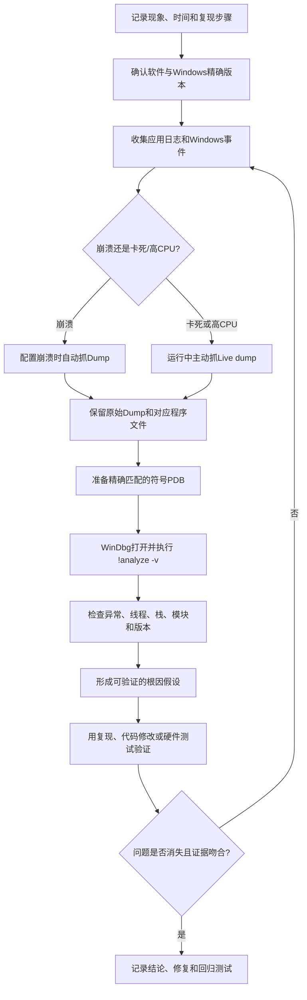

# Minidump与Windows崩溃转储分析

> [!summary] 一句话解释
> **Minidump（读作“迷你 dump”，小型转储）是程序或 Windows 崩溃、卡死时保存的一份“运行现场快照”，其中通常有异常、线程、调用栈、模块和部分内存，开发者可以用 WinDbg 等调试器分析它为什么出错。**

这里的 **dump** 原意是“倾倒”，在计算机中表示：把某一时刻内存中的一部分状态“倒”进文件里。常见扩展名是 `.dmp` 或 `.mdmp`。

---

## 一、先用交通事故理解 Minidump

假设一个程序突然崩溃，就像路口发生了一起事故：

- **日志（Log）**像车辆沿途留下的行车记录：之前发生过什么；
- **转储（Dump）**像事故发生瞬间拍下的现场照片：谁在哪里、车辆朝向、碰撞点是什么；
- **跟踪（Trace）**像持续录像：能够看到事情怎样一步步发展；
- **源代码和符号文件**像道路图、车辆零件图和人员名单：帮助你认出照片里的地址和部件；
- **调试器**像事故分析人员：把照片、地图和记录组合起来推断原因。

Minidump 通常不是完整录像，而是经过筛选的现场照片。因此它：

- 比完整内存转储小，生成和上传更快；
- 往往足够判断在哪个线程、函数或模块附近崩溃；
- 但可能没有包含真正需要查看的那块内存。

> [!important] 最重要的边界
> 转储记录的是“某一刻是什么状态”，不一定直接记录“之前为什么会变成这样”。分析结果通常是证据和假设，还要结合日志、版本、复现步骤、源代码和测试确认。

---

## 二、Minidump 到底保存了什么

具体内容由生成转储时使用的选项决定。一个基础的应用程序 Minidump 通常可能包含：

- 崩溃时的异常代码和异常地址；
- 进程中的线程列表；
- 每个线程的寄存器状态；
- 线程的调用栈；
- 已加载的 EXE、DLL 等模块；
- 模块的版本、基址和时间戳等信息；
- 操作系统和处理器架构信息；
- 与线程栈等有关的少量内存。

根据生成选项，它还可能增加：

- 更多内存区域；
- 句柄信息；
- 已卸载模块信息；
- 完整进程内存；
- 其他用于诊断的数据。

所以不能把 Minidump 简单理解成“永远只有固定几百 KB 的文件”。微软的 `MiniDumpWriteDump` API 提供了许多标志，生成者可以决定保存哪些内容；有些名字仍叫 Minidump 的文件其实也可以非常大。

### 它通常没有什么

小型转储可能没有：

- 完整堆内存中的所有对象；
- 崩溃前很长时间的执行过程；
- 未被选中的内存页；
- 数据库、网络服务或文件系统当时的完整状态；
- 开发者为什么这样写代码的业务意图；
- 能直接证明根因的所有证据。

这就是为什么“有 `.dmp` 文件”不等于“一定能查出原因”。

---

## 三、应用崩溃转储和蓝屏转储不是同一层

Windows 中经常被混在一起说的“崩溃转储”，至少有两个层级。

### 1. 用户模式转储：某个应用程序出了问题

**User-mode dump（用户模式转储）**针对一个普通进程，例如：

- 浏览器；
- 游戏；
- Electron 桌面应用；
- Python、Java、Node.js 程序；
- Windows 服务；
- 公司的业务软件。

它主要记录这个进程自己的线程、模块和内存。一个应用崩溃，通常不会让整个 Windows 蓝屏。

### 2. 内核模式转储：Windows 内核出了严重问题

**Kernel-mode dump（内核模式转储）**用于 Windows 蓝屏，也叫 **Bug Check（错误检查）**或 **Stop Error（停止错误）**。

它关注的是：

- Windows 内核；
- 内核线程；
- 设备驱动；
- 内核使用的内存；
- 蓝屏停止代码及其参数。

蓝屏经常和驱动、硬件、内核状态有关，但不能看到某个驱动名就立刻断言“它一定是元凶”。它也可能只是最后接触到已损坏数据的“受害者”。

### 直观对比

| 对比项 | 应用程序转储 | Windows 蓝屏转储 |
|---|---|---|
| 故障范围 | 某个进程 | 操作系统内核 |
| 常见现象 | 软件闪退、无响应 | 蓝屏后重启 |
| 关注对象 | 应用线程、DLL、进程内存 | 内核、驱动、Bug Check |
| 常用工具 | WinDbg、ProcDump、应用崩溃收集器 | WinDbg、KD |
| 常见位置 | 由收集工具决定 | `%SystemRoot%\Minidump` 或 `%SystemRoot%\MEMORY.DMP` |

---

## 四、Windows 有哪些常见转储类型

### 用户模式：应用程序转储

| 类型 | 大致内容 | 优点 | 局限 |
|---|---|---|---|
| Mini dump | 线程、栈、模块及选定内存 | 小、生成快、方便上传 | 可能缺少堆对象和关键内存 |
| Full dump | 进程当时可访问的完整内存等 | 能检查更多对象和数据 | 文件大、生成慢、隐私风险高 |
| 自定义 dump | 按标志选择内容 | 大小与信息量可平衡 | 需要工具或程序正确配置 |

### 内核模式：系统转储

| 类型 | 主要特点 | 常见用途 |
|---|---|---|
| Small Memory Dump | 只保存蓝屏分析所需的一小部分信息 | 快速收集停止代码、栈和驱动线索 |
| Kernel Memory Dump | 保存崩溃时正在使用的内核内存，通常不含用户模式内存 | 大多数驱动和内核故障分析 |
| Automatic Memory Dump | 内容接近内核转储，并让 Windows 自动管理页面文件设置 | Windows 常用默认选择 |
| Active Memory Dump | 尽量排除不重要的内存页，缩小体积 | 内存很大的系统 |
| Complete Memory Dump | 保存 Windows 使用的物理内存，信息最多 | 疑难内核问题，代价也最高 |

### Live dump：系统还没崩，也可以拍快照

**Live dump（实时转储）**是在进程或系统仍运行时主动捕获状态。例如：

- 程序卡死但没有崩溃；
- CPU 异常升高；
- 某个进程疑似死锁；
- 需要检查内核状态，但不希望故意让电脑蓝屏。

Windows 11 的任务管理器可以为用户进程创建实时内存转储，也支持创建部分实时内核转储。

> [!note]
> `.dmp` 只是常见文件扩展名，并不能单凭扩展名判断它是用户模式还是内核模式、Mini 还是 Full。需要用生成方式、文件位置和调试器识别。

---

## 五、常见文件保存在哪里

### 1. Windows 蓝屏的小型转储

```text
%SystemRoot%\Minidump
```

一般情况下 `%SystemRoot%` 就是：

```text
C:\Windows
```

因此常见实际目录是：

```text
C:\Windows\Minidump
```

这里通常会保留多个按时间命名的小型转储。

### 2. 内核、自动或完整内存转储

```text
%SystemRoot%\MEMORY.DMP
```

常见实际位置：

```text
C:\Windows\MEMORY.DMP
```

这个文件可能很大，而且新的转储可能覆盖旧文件。

### 3. Windows Error Reporting 收集的应用转储

**WER（Windows Error Reporting，Windows 错误报告）**配置 `LocalDumps` 后，默认目录通常是：

```text
%LOCALAPPDATA%\CrashDumps
```

也就是当前用户目录下类似：

```text
C:\Users\用户名\AppData\Local\CrashDumps
```

WER 本地转储默认没有为所有程序启用，需要管理员配置注册表；还可以为特定程序单独设置。

### 4. 任务管理器创建的实时转储

用户模式实时转储通常先保存在：

```text
%LOCALAPPDATA%\Temp
```

实时内核转储的默认目录通常是：

```text
%LOCALAPPDATA%\Microsoft\Windows\TaskManager\LiveKernelDumps
```

不同 Windows 版本、工具和企业策略可能改变位置，因此应以工具弹出的实际路径为准。

---

## 六、理解转储前必须认识的几个概念

### 1. Exception：异常

**Exception（异常）**是 CPU 或程序运行时发现无法按正常方式继续执行的事件。

一个常见例子是：

```text
0xC0000005
```

它通常表示 **Access Violation（访问冲突）**：程序试图读取、写入或执行一个自己无权访问或无效的内存地址。

这可能来自：

- 空指针；
- 已释放对象仍被使用；
- 数组越界；
- 内存被其他代码提前破坏；
- 错误的函数指针；
- 本机扩展或驱动问题。

异常地址是事故发生点，但不一定是最初犯错的地方。

### 2. Register：寄存器

**Register（寄存器）**是 CPU 内部非常快的小型存储位置。程序崩溃时，寄存器可以告诉调试器：

- 下一条或当前指令在哪里；
- 栈在哪里；
- 当时参与运算的一些地址和值是什么。

### 3. Thread：线程

**Thread（线程）**是进程中的执行单元。详细解释见 [[进程、线程、多进程与多线程]]。

一个进程可能有很多线程，但崩溃转储一般会标记触发异常的线程。卡死问题则可能需要检查所有线程是否互相等待。

### 4. Call Stack：调用栈

**Call Stack（调用栈）**记录函数的调用层级。比如：

```text
main
└─ LoadConfig
   └─ ParseJson
      └─ CopyString  ← 崩溃附近
```

它能回答“程序怎样一路调用到这里”。但栈顶函数也可能只是使用了早先被破坏的数据。

### 5. Module：模块

**Module（模块）**通常是加载进进程或内核的 EXE、DLL 或驱动文件。调试器会列出模块名、版本、加载地址和时间戳，帮助判断：

- 崩溃发生在哪个组件；
- 使用的是不是预期版本；
- 模块和符号是否匹配；
- 是否存在第三方插件或旧驱动。

---

## 七、PDB 和符号为什么非常重要

机器运行时更关心的是地址，例如：

```text
0x00007ff6a1234567
```

人更希望看到：

```text
MyApp!ParseConfig+0x42
```

把地址翻译成函数名、源文件和行号所需的信息叫 **Symbol（符号）**。Windows/C++ 项目常使用：

```text
PDB = Program Database，程序数据库
```

可以把它理解为“编译后地址和源代码名称之间的地图”。

### 符号必须尽量精确匹配

最好使用生成这个 EXE/DLL 时同时生成的那份 PDB。即使源代码看起来相同，重新编译后地址也可能发生变化。

没有正确符号时，调试器可能只能显示：

```text
MyApp+0x12345
```

而不能显示具体函数和行号。

### 公共符号和私有符号

- Microsoft 为 Windows 系统组件提供公共符号服务器；
- 公司自己的应用需要保存自己构建时产生的符号；
- 第三方闭源软件通常只能由厂商使用其私有符号深入分析。

因此，发布程序时通常应该把“程序版本—构建产物—符号文件—源代码提交”关联保存。这也是 [[软件供应链：代码签名、SBOM与发布门禁|软件发布可追溯]] 的一部分。

---

## 八、用 WinDbg 分析转储的入门流程

**WinDbg（Windows Debugger，Windows 调试器）**是微软提供的 Windows 调试工具。

### 第一步：保存原始文件和现场信息

先记录：

- 出错时间；
- Windows 版本；
- 软件和模块版本；
- 用户当时做了什么；
- 是否可以稳定复现；
- 同一时间的应用日志和 Windows 事件；
- 转储是怎样生成的。

建议先复制一份 `.dmp` 再分析，不要把唯一原件随意移动或覆盖。

### 第二步：打开转储

在 WinDbg 中选择：

```text
File → Open dump file
```

也可以使用命令行：

```powershell
windbg -z C:\Dumps\example.dmp
```

### 第三步：设置并加载符号

常见入门命令：

```text
.symfix
.reload
```

- `.symfix`：把符号路径设置为微软公共符号服务器的常用配置；
- `.reload`：重新加载符号。

公司自己的程序还需要加入对应版本的私有 PDB 路径。

### 第四步：让调试器先做自动分析

```text
!analyze -v
```

- `!analyze`：分析当前异常或最近一次 Bug Check；
- `-v`：显示更详细的信息。

这是入口，不是最终判决。

### 第五步：检查异常现场和栈

用户模式崩溃常用：

```text
.ecxr
kv
lm
lmvm 模块名
```

- `.ecxr`：切换到异常发生时的寄存器上下文；
- `k` 或 `kv`：显示调用栈，`kv` 信息更详细；
- `lm`：列出加载的模块；
- `lmvm 模块名`：查看某个模块的版本、路径和符号状态。

蓝屏分析还会关注：

```text
.bugcheck
!analyze -v
lmvm 驱动名
```

### 第六步：理解常见输出字段

| 字段 | 大致含义 | 应怎样理解 |
|---|---|---|
| `EXCEPTION_CODE` | 应用异常代码 | 说明直接故障类型，不一定说明根因 |
| `BUGCHECK_CODE` | 蓝屏停止代码 | 用参数和文档继续缩小范围 |
| `FAULTING_THREAD` | 发生异常的线程 | 重点看它，但也要检查其他线程 |
| `STACK_TEXT` | 调用栈 | 观察调用路径和第一个己方函数 |
| `MODULE_NAME` | 相关模块 | 是线索，不等于已经定罪 |
| `IMAGE_NAME` | 映像文件名 | 确认版本、签名和来源 |
| `FAILURE_BUCKET_ID` | 用于归类相似故障的标识 | 适合比较多次崩溃是否同类 |
| `Probably caused by` | 调试器推测的相关模块 | 只是启发式推断，必须继续验证 |

> [!warning]
> 如果 WinDbg 显示 `Probably caused by: xxx.sys`，不能只凭这一行卸载驱动或认定硬件损坏。需要结合栈、参数、多个转储、驱动版本、硬件诊断和能否复现来判断。

---

## 九、怎样生成应用程序转储

### 方法一：应用自己在崩溃时生成

Windows 提供 `MiniDumpWriteDump` API，C/C++ 程序或崩溃报告组件可以在发现异常时调用它。

微软建议尽量让另一个健康进程替崩溃进程生成转储，因为崩溃进程可能已经出现：

- 堆损坏；
- 栈耗尽；
- 死锁；
- 状态不一致。

在已经损坏的进程内部继续做复杂工作，本身可能再次失败。

### 方法二：Windows 任务管理器

在支持该功能的 Windows 11 中，可以：

```text
任务管理器
→ 详细信息
→ 右键目标进程
→ 创建内存转储文件
```

它适合：

- 程序卡死但没有闪退；
- 想主动保存当前进程状态；
- 没有提前安装其他抓取工具。

如果进程受保护或权限更高，可能需要以管理员身份运行任务管理器。参见 [[Windows UAC与管理员权限提升]]。

### 方法三：Windows Error Reporting LocalDumps

WER 可以通过注册表中的以下位置配置本地应用转储：

```text
HKEY_LOCAL_MACHINE\SOFTWARE\Microsoft\Windows\Windows Error Reporting\LocalDumps
```

常见设置概念：

| 设置 | 用途 |
|---|---|
| `DumpFolder` | 转储保存目录 |
| `DumpCount` | 最多保留多少个转储 |
| `DumpType` | Mini、Full 或自定义类型 |

也可以在 `LocalDumps` 下为某个 `程序名.exe` 建立子项，使设置只影响这个程序。

> [!warning]
> 修改注册表前应确认目标、备份设置并使用可信的官方步骤。保存目录的 [[Windows ACL与NTFS权限|ACL 权限]] 必须允许崩溃进程写入，否则配置正确也可能生成不了文件。

### 方法四：ProcDump

**ProcDump（Process Dump，进程转储工具）**是 Microsoft Sysinternals 的命令行工具，可以按崩溃、卡死、CPU 等条件抓取进程转储。

示例：

```powershell
# 为名为 notepad 的进程生成默认的 Mini dump
procdump notepad

# 为进程 ID 4572 生成 Full dump
procdump -ma 4572

# 监控 MyApp.exe，在未处理异常时生成 Full dump
procdump -ma -e MyApp.exe C:\Dumps

# 程序窗口无响应时生成转储
procdump -h MyApp.exe C:\Dumps
```

常见参数：

| 参数 | 意义 |
|---|---|
| `-mm` | Mini dump，也是常见默认选择 |
| `-ma` | Full dump，包含完整进程内存等 |
| `-e` | 在未处理异常时抓取；`-e 1` 还会观察 first-chance exception |
| `-h` | 窗口挂起时抓取 |
| `-w` | 等待指定进程启动 |
| `-n` | 指定生成转储的数量 |

**First-chance exception（第一次机会异常）**表示调试器在程序自己的异常处理代码接手之前先看到了异常。很多程序会正常捕获某些异常，所以 `-e 1` 可能生成大量无用文件，初学者不要无条件使用。

---

## 十、蓝屏转储是怎样生成的

Windows 在无法安全继续运行时触发 Bug Check，并根据“启动和故障恢复”设置写入转储。

常见设置入口是：

```text
系统属性
→ 高级
→ 启动和故障恢复
→ 设置
→ 写入调试信息
```

写入转储需要：

- 合适的页面文件和系统配置；
- 足够的磁盘空间；
- 存储设备在崩溃阶段仍能工作；
- 没有被清理工具立刻删除；
- 系统确实有机会把数据写到磁盘。

如果是突然断电、磁盘本身故障，或者机器直接冻结到无法执行转储代码，就可能没有 `.dmp`。

蓝屏转储用于诊断，不会自己修复问题。[[CHKDSK、SFC与DISM：Windows检查与修复工具|CHKDSK、SFC 和 DISM]] 也不是通用“蓝屏修复按钮”：它们分别检查文件系统、系统文件和组件存储，不能替代转储分析、驱动排查和硬件诊断。

---

## 十一、什么时候选择 Mini，什么时候选择 Full

### 优先尝试 Mini 的情况

- 故障频繁，担心生成大量大文件；
- 先想知道异常代码、崩溃线程和模块；
- 网络上传条件有限；
- 已有详细日志和稳定复现步骤；
- 只需要给故障分组、统计哪个版本更常崩溃。

### 更可能需要 Full 的情况

- 需要检查堆中的对象和值；
- 怀疑内存损坏、对象生命周期或缓存状态；
- .NET 等托管程序需要检查更多托管堆信息；
- 程序卡死、死锁或内存泄漏；
- 故障很少出现，下一次可能很久以后；
- Mini 分析到关键位置时发现所需内存没有保存。

### 一个实用原则

```text
先问“为了验证当前假设，需要哪些数据”，再选择转储大小。
```

不是文件越大越专业。Full dump 会显著增加：

- 磁盘占用；
- 生成时间；
- 上传成本；
- 敏感信息泄露风险。

---

## 十二、一个简化的应用崩溃例子

假设某应用读取配置文件后闪退，WinDbg 显示：

```text
EXCEPTION_CODE: c0000005
MODULE_NAME: MyApp
STACK_TEXT:
MyApp!CopyName
MyApp!ParseConfig
MyApp!LoadConfig
MyApp!main
```

可以先提出假设：

> `ParseConfig` 调用 `CopyName` 时传入了无效地址，最终出现访问冲突。

但还不能直接下结论。接下来要确认：

1. PDB 是否与这个版本的 `MyApp.exe` 精确匹配；
2. `.ecxr` 后故障指令是在读、写还是执行地址；
3. 参数和局部变量是否包含在转储中；
4. 配置文件内容是否异常；
5. 是否存在更早的越界写入，直到这里才表现出来；
6. 同版本其他转储是否有相同 `FAILURE_BUCKET_ID`；
7. 修复代码后是否能通过相同输入验证。

这就是“转储给线索，实验确认根因”。

---

## 十三、卡死分析和崩溃分析有什么不同

### 崩溃

程序发生未处理异常，重点通常是：

- 哪个线程触发异常；
- 异常代码和故障指令；
- 当前调用栈；
- 参数或内存为什么无效。

### 卡死

程序还活着，但不响应。重点通常是：

- UI 线程是不是在等待锁、磁盘、网络或另一个线程；
- 多个线程是否形成死锁；
- 是否有线程无限循环；
- 是否有同步调用长时间阻塞；
- CPU 是接近 0% 还是持续很高。

因此卡死时要主动生成 Live dump，并查看多个线程，不能只找“异常线程”。如果问题间歇出现，隔一段时间连续抓几份转储，可以判断栈是否一直停在同一位置。

---

## 十四、日志、Dump、Trace 和 Core Dump 的区别

| 名称 | 回答的问题 | 优点 | 局限 |
|---|---|---|---|
| Log 日志 | 之前记录了哪些事件 | 易检索，适合看时间线 | 开发者没记录的内容就没有 |
| Dump 转储 | 某一时刻内存和线程是什么状态 | 适合看异常现场、栈和对象 | 缺少完整时间线 |
| Trace 跟踪 | 一段时间内事件或指令怎样流动 | 能看过程和性能 | 数据量大，捕获成本更高 |
| Core dump | Unix/Linux 中的进程内存转储 | 与应用转储概念相近 | 工具链和格式不同 |

理想的故障材料通常是：

```text
复现步骤 + 精确版本 + 日志 + 转储 + 符号 + 必要的跟踪
```

它们互相补充，不是谁完全取代谁。

---

## 十五、转储文件可能包含隐私和秘密

转储来自内存，而内存里可能有：

- 用户名和文件路径；
- 正在编辑的文档片段；
- 聊天内容；
- URL 和查询参数；
- Cookie、Session、Access Token；
- API Key；
- 密码或私钥的短暂副本；
- 数据库查询结果；
- 客户和企业数据。

即使是 Minidump，也不能保证没有敏感数据。Full dump 的风险更高。

正确做法包括：

- 只收集解决问题所必需的信息；
- 明确取得用户或组织授权；
- 使用受控目录和正确的 [[Windows ACL与NTFS权限|ACL]]；
- 传输和存储时加密；
- 限制谁能下载和分析；
- 设置保留数量和删除期限；
- 分享前确认接收方和渠道；
- 问题结束后按制度安全清理。

> [!danger]
> 不要把来源不明的 `.dmp` 直接上传到公开论坛、公开网盘或公共 GitHub 仓库。也不要因为它“只是 Minidump”就认为一定没有账号凭证。

---

## 十六、常见误区

### 误区 1：Minidump 永远是固定大小

不是。它包含什么由转储选项、Windows 版本和生成工具决定。

### 误区 2：`.dmp` 就一定是蓝屏文件

不是。应用崩溃、应用卡死、实时内核状态和蓝屏都可能生成 `.dmp`。

### 误区 3：有 Dump 就一定能查出原因

不一定。它可能缺少关键内存、符号、版本信息或崩溃前过程。

### 误区 4：栈顶模块一定是罪魁祸首

不一定。真正的错误可能早已破坏内存，后来由另一个模块触发。

### 误区 5：WinDbg 的自动结论就是最终答案

`!analyze -v` 是很好的入口，但仍要由人结合现场证据判断。

### 误区 6：没有 Dump 就说明 Windows 没有崩溃

突然断电、磁盘故障、配置不正确、空间不足或系统完全冻结都可能使转储写不出来。

### 误区 7：清理磁盘时可以随便删

如果问题还未分析，转储可能是唯一现场证据。先确认已经备份、脱敏或不再需要。

### 误区 8：修复磁盘和系统文件就能解决所有蓝屏

CHKDSK、SFC、DISM 各有边界。驱动错误、内存故障、超频、不兼容固件和程序缺陷需要其他证据和方法。

---

## 十七、经常导致分析失败的技术原因

### 1. 符号不匹配

拿了另一个版本的 PDB，函数名和行号可能错误。

### 2. 程序文件和转储不是同一版本

必须保留转储发生时实际运行的 EXE、DLL 和驱动版本信息。

### 3. Mini 没有保存目标内存

调试器显示地址不可读，可能不是地址本来就坏了，而是该内存页根本没被收进转储。

### 4. 只分析一次偶发故障

多个转储如果落在相同调用路径，证据会更强；如果每次随机，可能要怀疑更早的内存破坏或硬件不稳定。

### 5. 混淆崩溃和卡死

卡死不一定有异常代码，要检查所有线程的等待关系。

### 6. 跨语言运行时需要额外工具

- .NET 可能需要对应运行时的 SOS 调试扩展；
- Java 常结合 JVM 的错误日志、线程转储和 heap dump；
- Python 常先看 traceback，本机扩展崩溃时再看原生 dump；
- Electron/Chromium 是多进程架构，要确认崩的是主进程、渲染进程还是 GPU/Utility 进程。

### 7. 权限或路径错误

高权限进程、服务账户或受保护进程生成转储时，当前工具可能没有足够权限；保存目录的 ACL 也可能阻止写入。这和 [[Windows UAC与管理员权限提升]]、[[Windows ACL与NTFS权限]] 直接相关。

---

## 十八、一套适合初学者的排查顺序



### 给别人提交转储时一起提供什么

- `.dmp` 文件；
- 软件的精确版本和构建号；
- Windows 版本和 CPU 架构；
- 故障发生时间；
- 可复现步骤；
- 同时段日志；
- 是否每次发生；
- 最近安装、升级或更换了什么；
- 转储类型和生成工具；
- 对应程序文件和私有符号的内部位置。

---

## 十九、它和高可用、自动恢复有什么关系

线上程序常见的处理流程是：

```text
程序异常
→ 崩溃收集器生成转储
→ 服务管理器重启程序
→ 监控系统告警
→ 转储和日志上传到受控存储
→ 相同故障按 Bucket 聚合
→ 开发者分析并修复
```

这里要区分：

- **重启**让服务暂时恢复；
- **转储**保存故障证据；
- **监控**告诉人们故障是否发生、影响多大；
- **修复**才消除根因。

更多系统恢复思路见 [[高可用、健康检查与故障恢复]]。

---

## 二十、适合你的记忆方式

先只记住四句话：

1. **Dump 是某一时刻的运行现场快照。**
2. **Minidump 保存部分现场，Full dump 保存更多内存。**
3. **应用崩溃转储和 Windows 蓝屏转储不是同一个层级。**
4. **正确符号、日志、版本和复现步骤与转储同样重要。**

再记一条安全规则：

> **转储可能含密码、令牌和文档内容，不能随便公开上传。**

---

## 二十一、相关概念

- [[进程、线程、多进程与多线程]]：理解转储里的进程、线程和调用栈。
- [[内存映射、MMIO与代码控制硬件]]：理解虚拟地址、内存页和进程地址空间。
- [[Windows UAC与管理员权限提升]]：理解为什么抓取高权限进程可能要求提升。
- [[Windows ACL与NTFS权限]]：理解为什么进程可能无权把转储写进目标目录。
- [[CHKDSK、SFC与DISM：Windows检查与修复工具]]：区分诊断崩溃和修复磁盘/系统文件。
- [[高可用、健康检查与故障恢复]]：理解自动重启、监控和故障证据的配合。
- [[软件供应链：代码签名、SBOM与发布门禁]]：理解版本、构建产物和符号的可追溯性。

---

## 参考资料

以下资料均为微软官方文档，核对日期：**2026-08-24**。

- [User-Mode Dump Files](https://learn.microsoft.com/en-us/windows-hardware/drivers/debugger/user-mode-dump-files)
- [MiniDumpWriteDump function](https://learn.microsoft.com/en-us/windows/win32/api/minidumpapiset/nf-minidumpapiset-minidumpwritedump)
- [Collecting User-Mode Dumps with Windows Error Reporting](https://learn.microsoft.com/en-us/windows/win32/wer/collecting-user-mode-dumps)
- [Varieties of Kernel-Mode Dump Files](https://learn.microsoft.com/en-us/windows-hardware/drivers/debugger/varieties-of-kernel-mode-dump-files)
- [Small Memory Dump](https://learn.microsoft.com/en-us/windows-hardware/drivers/debugger/small-memory-dump)
- [Kernel Memory Dump](https://learn.microsoft.com/en-us/windows-hardware/drivers/debugger/kernel-memory-dump)
- [Complete Memory Dump](https://learn.microsoft.com/en-us/windows-hardware/drivers/debugger/complete-memory-dump)
- [Analyze User-Mode Dump Files](https://learn.microsoft.com/en-us/windows-hardware/drivers/debugger/analyzing-a-user-mode-dump-file)
- [WinDbg !analyze command](https://learn.microsoft.com/en-us/windows-hardware/drivers/debuggercmds/-analyze)
- [ProcDump](https://learn.microsoft.com/en-us/sysinternals/downloads/procdump)
- [Task Manager Live Memory Dump](https://learn.microsoft.com/en-us/windows-hardware/drivers/debugger/task-manager-live-dump)
- [Stop error or blue screen error troubleshooting](https://learn.microsoft.com/en-us/troubleshoot/windows-client/performance/stop-code-error-troubleshooting)

