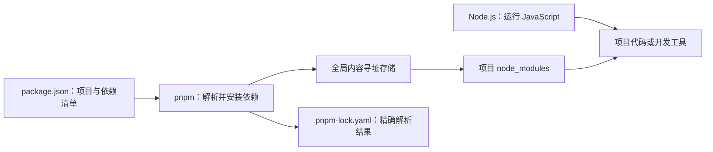

# Node.js 与 pnpm

> [!summary] 一句话解释
> **Node.js 是让 JavaScript 能在浏览器之外运行的运行环境；pnpm 是为 JavaScript/Node.js 项目安装依赖、管理版本和运行项目脚本的包管理器。**

这两个词经常一起出现，但不是同一个东西。

## 先说 Node.js

**Node.js** 读作“诺德·杰埃斯”。其中 `JS` 是 **JavaScript** 的简称。Node.js 不是一门新的编程语言，它运行的主要语言仍是 JavaScript。

早期 JavaScript 主要运行在浏览器里，用来控制网页交互。Node.js 把 JavaScript 运行能力带到浏览器之外，因此可以用 JavaScript：

- 编写 Web 服务器和 API；
- 读写文件；
- 连接数据库；
- 开发命令行工具；
- 执行前端项目的构建、测试和打包工具；
- 编写实时聊天、自动化脚本和 Agent 工具。

### 生活类比

可以把 JavaScript 看成“菜谱语言”，把运行环境看成“厨房”：

- 浏览器是一间厨房，擅长操作网页和页面按钮；
- Node.js 是另一间厨房，擅长文件、网络、服务器和开发工具；
- 菜谱语言都是 JavaScript，但厨房提供的设备不同。

浏览器提供 `document`、页面按钮等能力；Node.js 提供文件系统、进程、服务器等能力。两边的 JavaScript 语法大体相同，但可用的环境接口不完全相同。

## Node.js 的工作原理

Node.js 主要包含：

- **V8**：执行 JavaScript 的引擎，也是 Chromium 系浏览器使用的 JavaScript 引擎；
- Node.js 提供的文件、网络、进程等 API；
- **Event Loop（事件循环）**：协调定时器、网络结果和其他异步任务；
- 底层系统组件：帮助处理文件、网络和跨平台差异。

它的重要特点是 **event-driven（事件驱动）** 和 **non-blocking I/O（非阻塞输入输出）**。初学时可理解为：

> 程序发起一次网络或文件请求后，不必一直站在原地干等；结果准备好时，再通过事件通知程序继续处理。

这使 Node.js 很适合需要同时处理许多网络连接的应用。它并不代表所有计算都自动并行，也不意味着任何任务都会更快。

## 最小 Node.js 例子

创建 `hello.js`：

```js
console.log('你好，Node.js');
```

在终端运行：

```text
node hello.js
```

流程是：

```text
终端找到 node 程序 → Node.js 读取 hello.js → 执行 JavaScript → 打印文字
```

## `node` 这个词也可能有别的含义

`node` 普通英文是“节点”。在其他语境中，它可能表示：

- 树形结构中的节点；
- 网络中的一台设备；
- HTML 文档中的 DOM 节点；
- 区块链网络节点。

但当它和 `pnpm`、`package.json`、前端构建或后端 JavaScript 一起出现时，通常指 **Node.js** 或 `node` 命令。

## pnpm 是什么

**pnpm** 通常逐字母读作“P-N-P-M”。它是一种 JavaScript **Package Manager（包管理器）**。

别人已经写好的可复用代码通常叫 **Package（软件包）** 或 **Dependency（依赖）**。包管理器帮助项目：

1. 从软件包仓库下载依赖；
2. 按指定版本安装；
3. 记录直接依赖和间接依赖；
4. 生成锁文件，使团队安装出尽量一致的结果；
5. 运行项目在 `package.json` 里定义的脚本；
6. 管理包含多个子项目的 workspace/monorepo。

### 生活类比

开发一个项目像组装电脑：你不需要自己制造每一颗螺丝。`package.json` 是配件清单，pnpm 是采购和仓储管理员，包仓库则像供应市场。

## 为什么还需要 pnpm

Node.js 负责**执行 JavaScript**，但它不负责替项目决定和下载所有第三方依赖。pnpm 主要解决依赖管理。



pnpm 的一个特点是 **content-addressable store（内容寻址存储）**：相同内容的包可以在机器上的统一存储中保留一份，再通过链接组织到不同项目。这通常比每个项目都完整复制一份更节省磁盘空间。

pnpm 还采用较严格的依赖组织方式，使项目通常只能直接访问自己明确声明的依赖，有助于暴露“代码用了某个包，却忘记在清单里声明”的问题。

## `package.json` 是什么

它是 Node.js/JavaScript 项目的主要清单文件。一个简化例子：

```json
{
  "name": "hello-app",
  "scripts": {
    "dev": "node server.js",
    "test": "node test.js"
  },
  "dependencies": {
    "express": "^5.0.0"
  }
}
```

- `name`：项目名；
- `scripts`：给常用命令起名字；
- `dependencies`：程序正常运行所需的依赖；
- `devDependencies`：开发、测试、格式化、构建阶段所需的依赖。

运行 `pnpm run dev` 时，pnpm 会查找 `scripts.dev`，然后执行这里的 `node server.js`。

## 常用 pnpm 命令

| 命令 | 含义 |
|---|---|
| `pnpm install` | 根据项目清单和锁文件安装依赖 |
| `pnpm add 包名` | 添加运行时依赖 |
| `pnpm add -D 包名` | 添加开发依赖，`-D` 表示 dev dependency |
| `pnpm remove 包名` | 移除依赖 |
| `pnpm run dev` | 运行 `package.json` 中的 `dev` 脚本 |
| `pnpm run test` | 运行 `test` 脚本 |
| `pnpm exec 工具名` | 执行项目依赖提供的命令行工具 |

命令中的“包名”“工具名”只是占位说明，实际输入时要换成具体名称。

## `node_modules` 和锁文件

### `node_modules`

这是安装依赖后生成的目录。通常不要手工修改里面的文件，因为重新安装时修改会丢失。它一般也不提交进 Git。

### `pnpm-lock.yaml`

这是 pnpm 的锁文件，记录解析到的具体依赖版本和关系。应用项目一般应把它提交到 Git，让团队和 CI 获得更一致的安装结果。

锁文件不是依赖代码本身，而是“这次到底选中了哪些版本”的精确记录。

## Node.js、npm、pnpm 的区别

| 名称 | 类型 | 主要职责 |
|---|---|---|
| Node.js | JavaScript 运行环境 | 执行 JavaScript，提供文件、网络和进程能力 |
| npm | 包管理器及软件包生态中的常用客户端 | 安装依赖、运行脚本 |
| pnpm | 另一种包管理器 | 完成类似任务，强调速度、磁盘效率和严格依赖结构 |

很多 Node.js 安装包会附带 npm；pnpm 通常需要另外启用或安装。一个项目最好按仓库说明使用指定的包管理器，不要随意混用锁文件。

## 和 Git Hook 的关系

项目可能在 [[Git Hook与自动化检查|Git Hook]] 中执行：

```text
pnpm run lint
pnpm run test
```

完整关系是：

```text
Git 到达提交前时刻
→ 触发 Hook 脚本
→ Shell 解释脚本
→ pnpm 找到 package.json 中的命令
→ Node.js 运行 JavaScript 检查工具
```

## 常见误区

### 误区 1：Node.js 是框架

不是。它是运行环境。Express、NestJS 等才是运行在 Node.js 上的框架或库。

### 误区 2：pnpm 是一种编程语言

不是。它是命令行包管理工具。

### 误区 3：安装 Node.js 就等于安装了所有项目依赖

不是。Node.js 是运行环境；还要在具体项目目录运行 `pnpm install` 等命令安装项目依赖。

### 误区 4：`pnpm install` 和 `pnpm run dev` 是同一件事

前者安装依赖，后者运行项目定义的开发脚本。

### 误区 5：依赖安装脚本绝对安全

软件包可能在安装阶段运行代码。不要在不可信项目中随意执行安装命令，也不要把密钥放在容易被依赖读取的位置。

## 学习建议

1. 先学最基本的 JavaScript 变量、函数和对象；
2. 安装项目要求的 Node.js 版本，学会运行 `node 文件名.js`；
3. 阅读一个简单 `package.json`；
4. 练习 `pnpm install`、`pnpm run dev` 和 `pnpm run test`；
5. 最后再研究 workspace、monorepo 和 pnpm 的链接结构。

## 关联概念

- [[TypeScript与JavaScript]]：TypeScript 检查并转换后，通常生成由 Node.js 或浏览器执行的 JavaScript。
- [[HTML]]、[[CSS]]：前端源码常由 Node.js 工具链构建，但 HTML/CSS 本身不等于 Node.js。
- [[SDK与API|API]]：Node.js 后端可以提供或调用 API。
- [[Git Hook与自动化检查]]：常用 pnpm 运行自动检查。
- [[CMD、Bash与PowerShell]]：`node` 和 `pnpm` 命令通常在某种 Shell 中输入。

## 参考资料

- [Node.js 官方入门：Introduction to Node.js](https://nodejs.org/learn/getting-started/introduction-to-nodejs)
- [pnpm 官方文档：Motivation](https://pnpm.io/motivation)
- [pnpm 官方文档：CLI commands](https://pnpm.io/pnpm-cli)
- [pnpm 官方文档：Symlinked node_modules structure](https://pnpm.io/symlinked-node-modules-structure)
