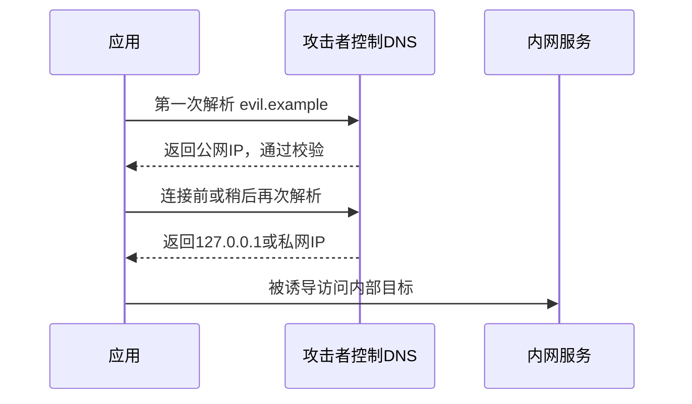

# SSRF、DNS Rebinding 与浏览器来源安全

> [!summary] 一句话解释
> **SSRF 是攻击者诱导服务器替自己访问不该访问的地址；DNS Rebinding 利用域名解析结果变化绕过网络边界；Origin、SameSite、HttpOnly 和 Fetch Metadata 用来帮助本机 Web 服务区分可信页面与跨站请求。**

## SSRF

**SSRF（Server-Side Request Forgery，服务器端请求伪造）**发生在应用允许用户影响服务器将要访问的 URL。

例如有一个“抓取网页摘要”接口：

```text
GET /fetch?url=https://example.com/article
```

攻击者可能改成：

```text
http://127.0.0.1:8080/admin
http://169.254.169.254/metadata
http://192.168.1.1/
```

虽然攻击者自己不能访问内网，但服务器可能可以，于是服务器被当成跳板。

## SSRF 能造成什么

- 访问本机管理接口；
- 扫描企业内网；
- 读取云环境元数据和临时凭据；
- 绕过 IP 白名单；
- 调用只能由服务器访问的内部 API；
- 把受信网络变成开放代理；
- 使用非 HTTP 协议攻击其他服务。

## 为什么只检查字符串不够

危险地址有很多写法：

- IPv4、IPv6；
- 十进制/十六进制等异常表示；
- 域名解析到私网；
- 重定向后进入私网；
- 用户名密码形式的 URL；
- 混淆端口；
- Unicode/IDN 域名；
- 解析和连接之间结果变化。

应使用成熟 URL 和 IP 解析库，并在最终连接点检查实际目标。

## DNS Rebinding

**DNS Rebinding（DNS 重绑定）**利用同一个域名在不同时间解析到不同 IP。



如果程序“校验域名时解析一次，真正连接时由网络库再解析一次”，两次结果可能不同，这属于 TOCTOU 风险。

## 防 SSRF 的基本策略

### 能用 Allowlist 就不要接受任意 URL

如果业务只需要访问几个已知服务，明确允许固定域名、端口和协议最安全。

### 检查解析后的所有 IP

拒绝：

- 回环；
- 私网；
- 链路本地；
- 组播；
- IPv6 ULA；
- 文档和保留地址；
- 云元数据地址；
- 不符合业务的端口和协议。

### 固定已验证的连接地址

校验后连接同一个已验证 IP，同时为 HTTPS 保留正确 Host/SNI 和证书校验，避免再次解析到别处。

### 逐跳检查重定向

不能只检查初始 URL。每次 3xx 跳转后的新目标都要重新验证。

### 限制协议

通常只允许 `https:`，必要时允许受控 `http:`。拒绝 `file:`、`gopher:` 等非业务协议，并考虑 WebSocket、WebRTC、QUIC 等旁路。

### 网络层隔离

使用防火墙、代理、容器网络和云策略，让应用即使校验出错也无法访问敏感网段。

## 本机 HTTP 服务为什么危险

桌面应用可能在 `127.0.0.1` 启动 Web 服务。恶意网页也运行在用户浏览器中，可能尝试向本机端口发送请求。

“只监听回环”可以防外部机器直连，但不能自动防同一台电脑上的恶意网页和进程。

## Origin

**Origin（来源）**由协议、主机和端口组成：

```text
https://app.example.com:443
```

服务端可以检查 `Origin`，只接受自己工作台页面发来的请求。Host 也要限制，避免错误域名和 DNS 重绑定路径。

## CORS 不是完整鉴权

**CORS（Cross-Origin Resource Sharing，跨来源资源共享）**主要控制浏览器是否允许页面读取跨来源响应。

它不代替：

- 用户身份验证；
- CSRF 防护；
- Origin 校验；
- 服务端权限；
- 本机恶意程序防护。

某些跨站请求即使页面读不到响应，也可能已经对服务端产生副作用。

## Cookie 安全属性

### HttpOnly

浏览器 JavaScript 不能直接读取 Cookie，降低部分 XSS 窃取风险。

### Secure

只通过 HTTPS 发送 Cookie。纯回环开发场景需要结合平台能力设计，正式远程服务不应关闭。

### SameSite

- `Strict`：最严格限制跨站携带；
- `Lax`：部分顶级导航可携带；
- `None`：允许跨站，通常必须配合 Secure。

SameSite 能降低部分 CSRF，但不应作为唯一安全边界。

## Fetch Metadata

浏览器可发送 `Sec-Fetch-Site`、`Sec-Fetch-Mode` 等请求头，帮助服务器判断请求来自同源、同站还是跨站。

它是额外信号，不代替会话、Origin 和权限检查。

## 一次性启动握手

桌面应用打开本机浏览器时，可以把短期一次性 Nonce 用于首次换取 HttpOnly 会话 Cookie，然后跳转到不含 Token 的干净 URL。

这样可以减少 Token 出现在：

- 浏览器历史；
- 截图；
- Referer；
- 日志；
- HTML 源码。

## 常见误区

### 只允许 HTTPS 就没有 SSRF

内网也可能有 HTTPS；攻击者控制的域名也能使用有效证书。

### 域名不写 127.0.0.1 就安全

域名可以解析到回环或私网地址。

### CORS 拒绝就不会产生请求

CORS 主要约束响应读取，不是所有跨站副作用请求的防火墙。

### 本机服务不需要鉴权

恶意网页和本机进程都可能访问回环端口。

## 在 Otto 中的作用

在 [[Otto USB便携智能体]] 中：

- 本机服务只监听回环；
- 检查 Host、Origin 和 Fetch Metadata；
- 使用一次性启动握手和严格 Cookie；
- 网页自动化拒绝非公网地址；
- DNS 解析后固定 IP，同时保留 HTTPS SNI/证书校验；
- 限制 WebSocket、WebRTC、WebTransport 和 QUIC 旁路。

DNS 基础见 [[DNS域名系统]]，HTTPS 基础见 [[TLS与数字证书]]。

## 参考资料

- [OWASP SSRF Prevention Cheat Sheet](https://cheatsheetseries.owasp.org/cheatsheets/Server_Side_Request_Forgery_Prevention_Cheat_Sheet.html)
- [MDN：Origin](https://developer.mozilla.org/en-US/docs/Web/HTTP/Reference/Headers/Origin)
- [MDN：Set-Cookie](https://developer.mozilla.org/en-US/docs/Web/HTTP/Reference/Headers/Set-Cookie)
- [W3C Fetch Metadata Request Headers](https://www.w3.org/TR/fetch-metadata/)
- 核对日期：2026-08-21。
