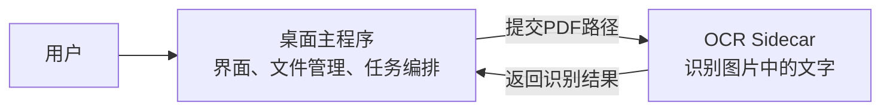
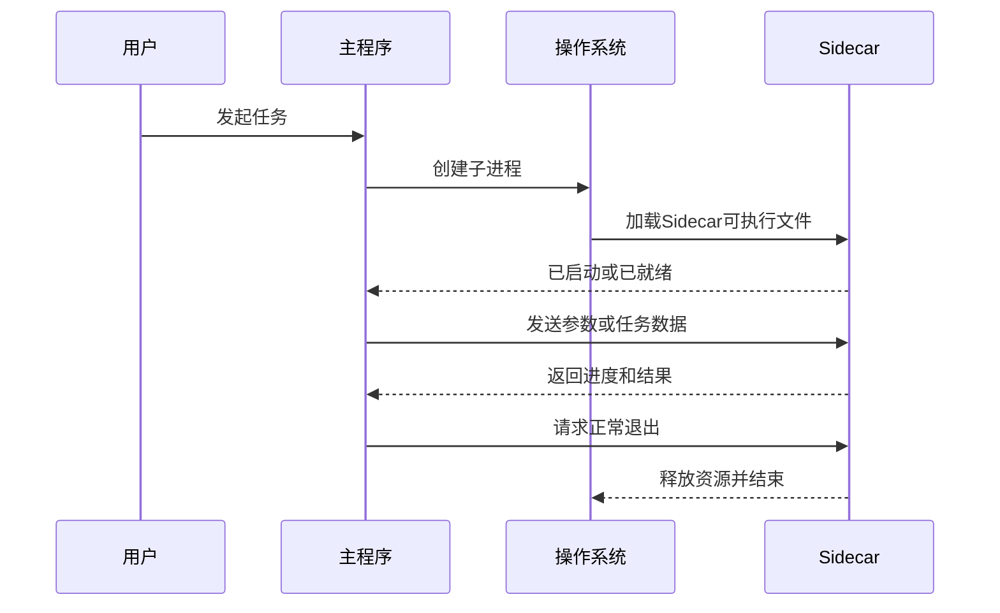
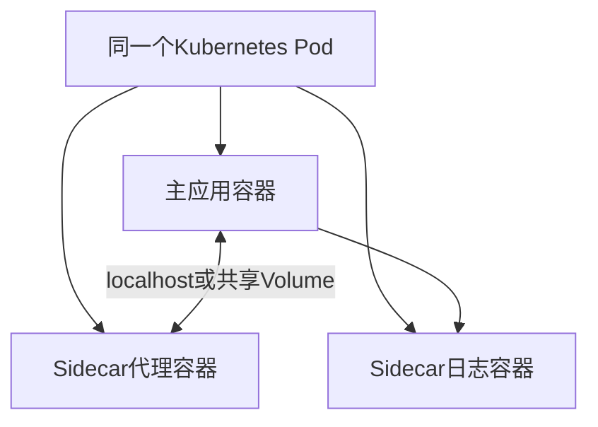
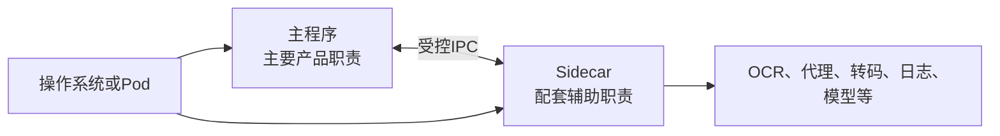

# Sidecar边车程序与辅助进程

> [!summary] 一句话解释
> **Sidecar（读作“赛德卡”，中文常译“边车”）是跟主程序放在一起、为主程序提供辅助能力的独立程序或容器；它通常有自己的进程和生命周期，但不承担产品最主要的界面或业务。**

---

## 一、为什么叫 Sidecar

Sidecar 原本指摩托车旁边加装的边斗：

```text
摩托车          边斗
主动力和驾驶  + 额外座位或载物能力
```

在软件里也是类似关系：

```text
主程序              Sidecar
主要界面和业务逻辑 + OCR、转码、代理、日志等辅助能力
```

Sidecar 不取代主程序，而是在旁边补充主程序不方便直接实现的能力。

---

## 二、Sidecar 到底是什么

Sidecar 不是一种编程语言，也不是某个固定软件，更不是一种唯一的通信协议。它是一种 **architecture pattern（架构模式）**。

一个组件通常具有下面几个特征时，会被称为 Sidecar：

1. 它和某个主程序或主容器紧密配套；
2. 它以独立进程、独立可执行文件或独立容器运行；
3. 它提供辅助能力，而不是承担主要产品功能；
4. 主程序通过参数、管道、文件、Socket 或本地网络与它通信；
5. 它通常与主程序一起安装、部署、启动、监控或升级。

例如，一个桌面笔记应用可以这样组织：



OCR 可以由 Python 编写，主程序可以由 Tauri + Rust 编写。它们语言不同，只要双方约定好通信格式就能合作。

---

## 三、Sidecar 是不是“后端”

**它可以承担本地后端能力，但 Sidecar 不等于 Web 后端。**

“后端”通常泛指界面背后负责数据和业务处理的部分；“Sidecar”强调的是部署位置和配套关系。

Sidecar 可能是：

- 输入一个文件、处理完就退出的 CLI（Command-Line Interface，命令行程序）；
- 长期运行的本地 HTTP 服务；
- 通过标准输入和标准输出持续收发消息的 Worker；
- 本地代理；
- 日志收集器；
- 数据库进程；
- Kubernetes Pod 里的辅助容器。

因此下面两句话都可能成立：

```text
“这个Sidecar是桌面应用的本地后端。”
“这个Sidecar只是一个转码工具，不是网络后端。”
```

判断它是不是后端，要看它承担什么职责；判断它是不是 Sidecar，要看它和主程序怎样部署、运行和配合。

---

## 四、为什么不把所有代码都写进主程序

### 1. 复用已有程序

团队可能已经有成熟的：

- Python AI/OCR 程序；
- Go 网络代理；
- Rust 高性能解析器；
- FFmpeg 音视频工具；
- Java 数据处理程序；
- Node.js 自动化工具。

重写成主程序使用的语言成本很高。把已有程序作为 Sidecar，可以继续复用。

### 2. 进程隔离

Sidecar 在独立进程中运行。它崩溃时，主程序有机会捕获退出状态、显示错误并重新启动它，而不是一定把主程序一起带崩。

不过，隔离不代表完全没有影响：Sidecar 仍可能耗尽内存、CPU、磁盘或端口，进而拖慢整个系统。

### 3. 依赖隔离

某些能力需要复杂运行时、原生库或特定版本。放到 Sidecar 后，可以减少它们和主程序内部依赖的直接冲突。

### 4. 语言各取所长

例如：

```text
Tauri/React → 做桌面界面
Rust        → 管理本机权限和任务
Python      → 调用AI模型
FFmpeg      → 处理音视频
```

Sidecar 让这些程序以进程边界组合，而不要求全部使用同一种语言。

### 5. 独立升级和替换

在设计允许的情况下，Sidecar 可以单独更新或替换。但桌面应用通常仍要严格检查版本兼容性，不能随意混用主程序和 Sidecar 版本。

---

## 五、主程序怎样启动 Sidecar

典型过程如下：



操作系统会给 Sidecar 分配独立的：

- PID（Process Identifier，进程标识符）；
- 虚拟内存空间；
- 文件句柄；
- 标准输入、标准输出和标准错误流；
- 线程和调度时间；
- 访问令牌或 Unix 用户权限；
- 可能使用的网络端口。

主程序需要保存子进程句柄，才能读取输出、写入输入、等待退出或在必要时结束进程。相关基础参见 [[进程、线程、多进程与多线程]]。

---

## 六、Sidecar 一定需要端口吗

**不一定。只有选择 TCP、HTTP、WebSocket 等网络通信方式时，才通常需要端口。**

常见通信方式如下：

| 通信方式 | 是否需要网络端口 | 适合场景 | 主要注意点 |
|---|---:|---|---|
| 命令行参数 | 否 | 启动时传少量配置 | 参数可能出现在进程列表中，不适合放秘密 |
| stdin/stdout 管道 | 否 | 主程序与子进程持续交换文本或二进制数据 | 要定义消息边界、编码、超时和异常输出 |
| 一次执行并收集输出 | 否 | 转码、压缩、计算等短任务 | 输出过大会占用内存 |
| Named Pipe / Unix Socket | 否（不使用 TCP 端口） | 长连接、本机 IPC | 平台实现和权限配置不同 |
| `127.0.0.1` 上的 HTTP/TCP | 是 | 已有 Web API、多个本地调用方 | 端口冲突、鉴权、来源检查、启动就绪 |
| 临时文件或共享数据库 | 否 | 大文件、松耦合批处理 | 文件权限、竞争、清理和一致性 |

### 使用 stdin/stdout 的例子

```text
主程序写入：{"id":1,"action":"ocr","file":"a.png"}（末尾换行）
Sidecar输出：{"id":1,"ok":true,"text":"识别结果"}（末尾换行）
```

这种按行传 JSON 的格式常叫 **JSON Lines / NDJSON（Newline-Delimited JSON，换行分隔 JSON）**。它不需要监听端口，通信通道通常只属于父子进程。

### 使用本地 HTTP 的例子

```text
Sidecar监听：http://127.0.0.1:39127
主程序请求：POST /ocr
Sidecar返回：JSON结果
```

这容易复用已有 Web 服务，但必须注意：

- 尽量只监听 `127.0.0.1`，不要无意监听 `0.0.0.0`；
- 选择端口时处理冲突，不要假设固定端口永远空闲；
- 即使只监听本机，也要考虑随机令牌、来源检查和 [[SSRF、DNS Rebinding与浏览器来源安全|DNS Rebinding]]；
- 不要把未经限制的管理接口暴露给浏览器页面；
- 处理服务尚未就绪、意外退出和重启后的连接恢复；
- 结合 [[防火墙与端口对外开放]] 理解“监听本机”和“对外开放”的区别。

---

## 七、短任务和长驻 Sidecar

### 短任务：执行完就退出

例如：

```text
输入：一段音频和输出路径
执行：FFmpeg转码
输出：退出码、标准输出、标准错误
结束：进程退出
```

优点是生命周期简单；缺点是每次启动都有进程创建和运行时初始化成本。

### 长驻任务：一直在后台运行

例如本地模型服务、代理或文件索引器。主程序通常需要：

- 启动进程；
- 等待 readiness（就绪）；
- 持续发送任务；
- 读取日志和事件；
- 检测进程是否存活；
- 崩溃后按退避策略重启；
- 主程序退出时通知它正常关闭；
- 超时后才强制结束。

长驻 Sidecar 不能只写一句“启动 `.exe`”就算完成，它实际上是一套小型进程管理系统。

---

## 八、`execute` 和 `spawn` 有什么区别

在很多进程 API 中，包括 Tauri Shell 插件，可以看到两种思路：

### `execute`：运行并等待完整结果

```text
启动 → 等待程序结束 → 一次性得到退出码、stdout、stderr
```

适合：

- 运行时间较短；
- 输出量可控；
- 不需要中途交互；
- 只关心最终成功或失败。

### `spawn`：启动后立即获得子进程句柄

```text
启动 → 立即返回Child句柄 → 持续收消息/写stdin/等待退出/结束进程
```

适合：

- 长期运行的 Sidecar；
- 需要持续显示进度；
- 需要向 stdin 多次写入任务；
- 需要主动停止或重启。

> [!warning] 不要用 `execute` 无限制收集海量输出
> 如果子进程持续输出几 GB 日志，而调用方一直把内容保存在内存中，可能造成严重内存问题。长数据流应使用流式读取、限制日志量或写入受控文件。

---

## 九、Tauri 中的 Sidecar

在 [[Tauri跨平台桌面应用架构|Tauri]] 中，Sidecar 指随应用捆绑的外部可执行文件。它可以用任何语言编写，只要最后能成为目标平台可执行的程序。

### 1. 配置需要打包的程序

在 `src-tauri/tauri.conf.json` 中配置 `externalBin`：

```json
{
  "bundle": {
    "externalBin": ["binaries/my-sidecar"]
  }
}
```

配置里通常写不带平台目标后缀的名称，真正文件要带 Rust 的 target triple（目标三元组）。例如 Windows x64 MSVC 构建可能使用：

```text
src-tauri/binaries/
└─ my-sidecar-x86_64-pc-windows-msvc.exe
```

其他平台和 CPU 架构需要对应版本，不能把 Windows `.exe` 直接拿到 macOS 或 Linux 运行。

在 Windows PowerShell 中，可以这样查看当前 Rust 工具链的 target triple：

```powershell
rustc -Vv | Select-String "host:" | ForEach-Object { $_.Line.Split(" ")[1] }
```

### 2. 给指定 Sidecar 最小权限

Tauri 2 的 Shell 插件默认阻止潜在危险命令。下面示意只允许主窗口执行指定 Sidecar：

```json
{
  "identifier": "main-capability",
  "windows": ["main"],
  "permissions": [
    "core:default",
    {
      "identifier": "shell:allow-execute",
      "allow": [
        {
          "name": "binaries/my-sidecar",
          "sidecar": true
        }
      ]
    }
  ]
}
```

这个规则的意思不是“允许执行任何程序”，而是允许匹配这个名字的 Sidecar 使用 `execute()`。

如果应用使用 `spawn()`，要配置对应的 `shell:allow-spawn`。如果还要向子进程写 stdin、结束进程，也要检查并只开放确实需要的插件权限。

### 3. 从 TypeScript 运行

```ts
import { Command } from '@tauri-apps/plugin-shell'

const command = Command.sidecar('binaries/my-sidecar')
const output = await command.execute()

if (output.code === 0) {
  console.log(output.stdout)
} else {
  console.error(output.stderr)
}
```

`Command.sidecar()` 中的名字必须和 `externalBin` 中的配置匹配。

### 4. 参数也要限制

危险做法：

```text
前端传来任意字符串
→ 直接拼成Shell命令
→ Sidecar或Shell执行
```

较安全的思路：

```text
前端传结构化参数
→ Rust或权限规则验证
→ 使用参数数组启动固定Sidecar
→ 不经过Shell字符串拼接
```

Tauri Shell 权限可以为参数定义静态值或校验规则。规则应尽量具体，不要为了省事允许任意程序和任意参数。

---

## 十、Python 程序怎样变成 Sidecar

假设已有：

```text
ocr_service.py
```

仅把 `.py` 文件放进安装包通常不够，因为用户电脑上未必安装了正确版本的 Python 和依赖。

常见做法有两种：

### 方案 A：要求用户安装运行时

主程序调用：

```text
python ocr_service.py
```

优点是开发简单，缺点是用户环境难以控制，容易出现 Python 版本、虚拟环境和依赖问题。

### 方案 B：打包成独立可执行文件

可以使用 PyInstaller、Nuitka 等工具，把 Python 解释器和依赖打入平台可执行文件，再作为 Tauri Sidecar。

优点是用户不必安装 Python；代价是：

- 文件通常明显变大；
- 每个平台和 CPU 架构都要构建；
- 原生依赖可能仍需额外处理；
- 启动速度、杀毒软件误报、许可证和签名需要评估；
- Sidecar 版本必须与主程序匹配。

所以“Sidecar 可以用 Python 写”不等于“把一个 `.py` 文件复制进去就能在任何电脑运行”。相关环境概念参见 [[Anaconda与Python环境管理]]。

---

## 十一、生命周期必须设计清楚

一个可靠的 Sidecar 至少要回答这些问题：

### 启动

- 谁负责启动？
- 启动参数从哪里来？
- 如何确认启动成功？
- 多开主程序时启动一个还是多个？
- 已经有旧进程时怎么办？

### 运行

- 怎样判断它已经 ready，而不只是“进程存在”？
- 通信超时是多少？
- 日志放在哪里、最多保留多少？
- CPU 和内存是否需要限制？
- Sidecar 卡死但没有退出时怎样发现？

### 崩溃

- 读取哪个退出码和错误输出？
- 是否自动重启？
- 重启多少次后停止？
- 怎样避免每毫秒反复崩溃重启？
- 正在处理的任务怎样恢复或标记失败？

### 退出

- 主程序退出时如何通知 Sidecar？
- 给它多少时间保存数据？
- 什么时候强制结束？
- 如何避免遗留孤儿进程？

### 升级

- 主程序怎样确认 Sidecar 版本兼容？
- 能否回滚？
- 更新时旧进程是否仍占用文件？
- 二进制文件怎样签名、校验和替换？

最实用的办法之一，是在通信握手时交换协议版本：

```json
{
  "protocolVersion": 2,
  "sidecarVersion": "1.4.0",
  "features": ["ocr", "pdf"]
}
```

主程序发现不兼容时应给出明确错误，而不是继续发送对方不理解的请求。

---

## 十二、安全风险

### 1. 命令注入

不要把用户输入直接拼进 `cmd.exe`、PowerShell 或 Bash 命令字符串。优先直接启动固定可执行文件，并把参数作为数组传递。

### 2. 路径越界

Sidecar 收到 `C:\`、`..\..\`、符号链接或网络路径时，要判断是否真的允许访问，不能只检查文件扩展名。

### 3. 本地端口并不自动安全

本机其他进程也可能访问 `127.0.0.1` 服务。浏览器网页也可能通过某些方式尝试请求本地服务。需要随机认证令牌、来源检查、最小 API 和合理的网络绑定。

### 4. 权限继承

子进程通常继承主程序的用户权限和部分环境。如果主程序通过 [[Windows UAC与管理员权限提升|UAC]] 提升，Sidecar 也可能获得更高权限，所以不能用“它只是辅助程序”降低安全要求。

### 5. 二进制替换

如果攻击者能替换 Sidecar 可执行文件，主程序下次启动它时就可能执行恶意代码。要结合文件权限、哈希校验、安装目录保护和 [[软件供应链：代码签名、SBOM与发布门禁|代码签名]]。

### 6. 秘密泄漏

不要把 API Key、密码和 Token 放在命令行参数里，因为它们可能出现在进程查看工具、日志或崩溃转储中。优先使用受控 stdin、操作系统凭据存储或短期凭据。

### 7. 更新链

主程序签名不代表随意下载的新 Sidecar 自动可信。下载、校验、签名验证、版本选择和回滚必须形成完整链路。

---

## 十三、Sidecar、库、插件和独立服务的区别

| 形式 | 运行位置 | 常见通信 | 优点 | 代价 |
|---|---|---|---|---|
| Library（库） | 主程序同一进程 | 函数调用 | 快、数据传递简单 | 崩溃和依赖与主程序耦合，跨语言较难 |
| Plugin（插件） | 取决于框架，常在主进程内 | 插件接口/函数 | 有统一扩展规范和生命周期 | 受插件框架限制，插件可能拥有较高权限 |
| Sidecar | 同一台机器的独立进程，或同一 Pod 的独立容器 | 管道、Socket、HTTP、文件 | 跨语言、进程隔离、可复用现有程序 | 打包、IPC、生命周期和安全更复杂 |
| 独立服务 | 独立部署，可能在另一台机器 | 网络 API / 消息队列 | 可独立扩容和运维 | 网络、认证、部署和可用性成本更高 |

### Sidecar 与插件不是同义词

插件强调“按照宿主定义的扩展接口接入”；Sidecar 强调“在旁边运行的辅助进程或容器”。

一个插件可以在进程内运行，也可以由插件启动 Sidecar；一个 Sidecar 也完全可以不知道宿主有没有插件系统。

### Sidecar 与普通子进程也不完全相同

所有 Sidecar 都可能是子进程，但不是所有子进程都值得称为 Sidecar。例如程序临时运行一次 `git status`，通常只叫“调用外部命令”。只有它与主应用形成明确、持续或随产品交付的辅助组件关系时，“Sidecar”这个名称才更有意义。

---

## 十四、Kubernetes 中的 Sidecar

在 Kubernetes 中，Sidecar 通常指与主应用容器运行在同一个 Pod 里的辅助容器。



它们可以共享 Pod 的网络，因而能通过 `localhost` 通信；也可以通过 Volume 共享文件。常见用途包括：

- Service Mesh（服务网格）代理；
- 日志收集；
- 证书刷新；
- 配置同步；
- 数据库代理；
- 监控和遥测。

Kubernetes Sidecar 容器和 Tauri Sidecar 可执行文件使用的是同一个“边车”思想，但具体机制完全不同：

| Tauri Sidecar | Kubernetes Sidecar |
|---|---|
| 桌面应用随包分发的外部二进制 | Pod 内的辅助容器 |
| 操作系统子进程 | 容器运行时和 Kubernetes 管理 |
| 常通过 stdin/stdout 或本机 IPC | 常通过 Pod 网络和共享 Volume |
| 面向单台用户设备 | 面向集群工作负载 |

---

## 十五、什么时候适合使用 Sidecar

适合：

- 已有可靠工具，不值得用主程序语言重写；
- 第三方程序本身就是独立可执行文件；
- 需要跨语言组合；
- 希望把易崩溃或重依赖能力与主进程隔离；
- 辅助能力天然适合长驻本地服务；
- 需要在 Kubernetes Pod 内为应用提供本地代理或日志能力。

不一定适合：

- 逻辑很小，直接写成库或主程序函数更简单；
- 每次调用都要传输大量内存数据，IPC 成本过高；
- 无法可靠管理它的安装、签名、版本和退出；
- 只是为了追求“微服务化”而拆进程；
- Sidecar 要求的权限比主程序还广，却没有清晰安全边界；
- 团队无法承担每个平台和架构的构建测试。

---

## 十六、常见误区

### 误区 1：Sidecar 就是 Docker 容器

不是。Kubernetes 中常见 Sidecar 容器，但桌面应用中的 Sidecar 通常是普通本机进程。

### 误区 2：Sidecar 一定要监听端口

不是。命令参数、stdin/stdout、Named Pipe、Unix Socket 和文件都可以通信。

### 误区 3：把程序拆成 Sidecar 就自动更安全

不是。进程隔离能缩小部分故障影响，但命令注入、权限过宽、端口暴露和二进制替换仍可能更危险。

### 误区 4：Sidecar 可以直接跨平台

架构模式可以跨平台，但二进制文件通常不行。Windows、macOS、Linux 以及 x64、ARM64 往往要分别构建。

### 误区 5：Sidecar 崩溃一定不会影响主程序

它可能占满资源、损坏共享文件、让关键功能不可用，或导致主程序等待超时。隔离降低耦合，但不能取消故障处理。

### 误区 6：Sidecar 和微服务是一回事

Sidecar 通常与主程序共置并为它服务；微服务通常独立部署、独立扩缩容，并通过网络为多个调用方提供业务能力。

### 误区 7：只要是后台进程就是 Sidecar

不是。Windows 系统服务、独立数据库服务器和任意后台程序不一定与某个主程序形成“配套边车”关系。

---

## 十七、设计检查清单

在决定使用 Sidecar 前，可以逐项回答：

- 它为什么不能做成库或普通插件？
- 主程序怎样找到正确的二进制文件？
- Windows、macOS、Linux 和不同 CPU 架构怎样构建？
- 使用参数、管道、Socket、端口还是文件通信？
- 协议怎样分帧、版本化和返回错误？
- 启动、就绪、超时、崩溃、重启和退出由谁管理？
- 多开主程序时是一对一还是共享一个 Sidecar？
- 权限、文件路径和参数如何收紧？
- 本地端口是否鉴权，是否只绑定回环地址？
- 日志是否可能泄露秘密或无限增长？
- 二进制怎样签名、校验、更新和回滚？
- 主程序和 Sidecar 版本不兼容时怎样明确失败？
- 如何避免主程序退出后留下孤儿进程？

如果这些问题没有答案，Sidecar 很容易从“复用现有能力”变成新的故障来源。

---

## 十八、一张图记住 Sidecar



最重要的判断句是：

```text
它是不是独立运行？
它是不是与某个主程序共置和配套？
它提供的是不是辅助能力？
主程序是否负责或参与它的生命周期？
```

---

## 十九、关联概念

- [[Web端、桌面软件与CLI程序的区别]]：理解桌面 GUI 如何把 CLI 作为子进程包装，以及这种方式和直接调用 API/SDK 的差别。
- [[Tauri跨平台桌面应用架构]]：桌面应用怎样捆绑和调用外部二进制。
- [[进程、线程、多进程与多线程]]：理解 Sidecar 为什么拥有独立进程和内存空间。
- [[CMD、Bash与PowerShell]]：理解可执行文件、命令参数和标准流。
- [[防火墙与端口对外开放]]：理解本地监听与网络暴露。
- [[SSRF、DNS Rebinding与浏览器来源安全]]：理解网页攻击本地服务的风险。
- [[Windows ACL与NTFS权限]]：限制谁能读取或替换 Sidecar 文件。
- [[Windows UAC与管理员权限提升]]：理解子进程可能继承的提升权限。
- [[软件供应链：代码签名、SBOM与发布门禁]]：保护 Sidecar 的构建、签名和更新链。
- [[Anaconda与Python环境管理]]：理解 Python Sidecar 的运行时和依赖问题。
- [[高可用、健康检查与故障恢复]]：设计就绪检查、重启、退避和恢复。

---

## 参考资料

以下内容于 **2026-08-29** 按官方资料核对：

- [Tauri：嵌入外部二进制文件](https://v2.tauri.app/zh-cn/develop/sidecar/)
- [Tauri Shell Plugin](https://v2.tauri.app/plugin/shell/)
- [Tauri Capabilities](https://v2.tauri.app/security/capabilities/)
- [Kubernetes：Sidecar Containers](https://kubernetes.io/docs/concepts/workloads/pods/sidecar-containers/)
- [Kubernetes：Services, Load Balancing, and Networking](https://kubernetes.io/docs/concepts/services-networking/)
