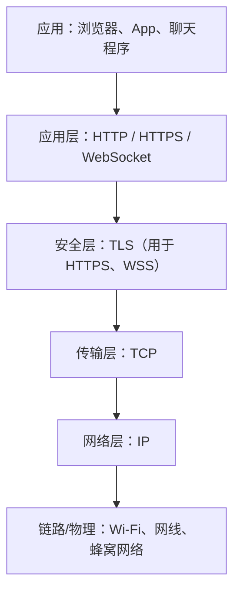
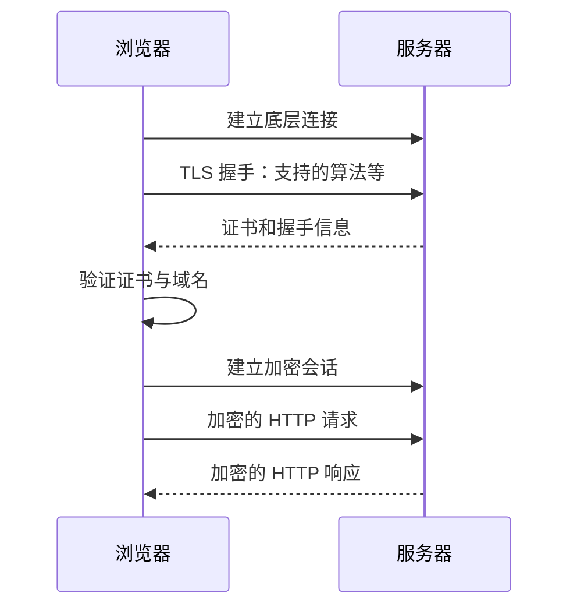

# TCP、HTTP、HTTPS 与 WebSocket

## 先用一句话分别解释

- **TCP（Transmission Control Protocol，传输控制协议）**：在两台设备之间提供可靠、按顺序的双向字节流传输。
- **HTTP（HyperText Transfer Protocol，超文本传输协议）**：Web 中客户端发送请求、服务器返回响应的一套应用层规则。
- **HTTPS（HyperText Transfer Protocol Secure）**：经过 TLS 加密、校验和服务器身份认证保护的 HTTP。
- **WebSocket**：客户端和服务器建立一条长期保持的全双工消息通道，双方都能随时发送消息。

它们不是四个互相竞争的同类产品，而是位于不同层次、可以组合使用的协议。

## 先理解“协议”

网络协议就是通信双方共同遵守的规则。像寄快递需要统一填写收件地址、单号和包装格式，计算机通信也需要约定：

- 数据怎样分段；
- 地址和端口写在哪里；
- 谁先发、谁回应；
- 丢失后怎么办；
- 数据格式是什么；
- 怎样开始和结束；
- 是否加密、怎样证明身份。

## 它们在网络分层中的位置



这是便于初学的典型简化图。需要注意：

- HTTP/1.1 和 HTTP/2 通常使用 TCP；
- HTTPS 通常表示 HTTP 受到 TLS 保护；
- HTTP/3 使用 QUIC（建立在 UDP 之上），不是传统 TCP；
- WebSocket 的常见 `ws`/`wss` 实现通常使用 TCP，`wss` 还加 TLS。

## TCP 详细解释

### 它解决什么问题

IP 网络尽力把一个个数据包送到目的地，但包可能丢失、重复、乱序或延迟。TCP 在应用程序和 IP 之间补上一层可靠传输机制。

TCP 向应用提供的是：

- **connection-oriented（面向连接）**：传输前建立连接；
- **reliable（可靠）**：检测丢包并重传；
- **in-order（有序）**：应用按正确顺序收到数据；
- **byte stream（字节流）**：像连续水流，不保留应用消息边界；
- **bidirectional（双向）**：双方都能发送数据；
- **flow control（流量控制）**：避免接收方来不及处理；
- **congestion control（拥塞控制）**：避免过度冲击网络。

### 建立连接：三次握手

典型 TCP 连接以三次握手开始：

```text
客户端 → 服务器：SYN，我想建立连接
服务器 → 客户端：SYN + ACK，我收到了，我也准备好了
客户端 → 服务器：ACK，我知道你准备好了
```

之后双方才能稳定交换数据。实际 TCP 细节远比这三句话复杂，初学先理解“互相确认连接状态”即可。

### TCP 怎样保证可靠

- 给字节编号；
- 接收方发送 ACK 确认；
- 发送方发现超时或缺失后重传；
- 校验传输错误；
- 把乱序数据重新排列。

“可靠”表示尽力保证数据正确、有序到达，或明确报告连接失败；不表示网络永远不断。

### TCP 不负责什么

- 默认不加密内容；
- 不理解“用户”“订单”“网页”等业务含义；
- 不规定 JSON、HTML 等数据格式；
- 不自动验证服务器是不是你想访问的网站；
- 不保留每条应用消息的边界。

加密和身份认证通常由 TLS 提供；请求/响应或消息规则由 HTTP、WebSocket 等上层协议提供。

### 端口是什么

IP 地址定位一台设备，port（端口）帮助定位设备上的某项网络服务。

- HTTPS 默认端口通常是 `443`；
- HTTP 默认端口通常是 `80`。

可以粗略类比：IP 是办公楼地址，端口是楼内部门或窗口号。

## HTTP 详细解释

HTTP 是典型的 client-server（客户端—服务器）请求/响应协议：

```text
客户端请求：请给我 /index.html
服务器响应：200 OK，这里是 HTML 内容
```

HTTP 请求通常包含：

- method：`GET`、`POST`、`PUT`、`DELETE` 等；
- URL/path：要访问的资源；
- headers：认证、内容类型、缓存等附加信息；
- body：可选的请求数据。

响应通常包含：

- status code：`200`、`404`、`500` 等；
- headers；
- body：HTML、JSON、图片或其他内容。

HTTP 规则本身强调一条条请求和响应。核心 HTTP 是 stateless（无状态）的，但网站可以用 Cookie、Token 和数据库建立登录会话。

它和 [[SDK与API|Web API]] 的关系很紧密：许多 Web API 就是在 HTTP 请求和响应中传输 JSON。

## HTTPS 详细解释

HTTPS 不是一种完全不同的网页内容格式，可以简化理解为：

```text
HTTPS = HTTP + TLS 安全保护
```

TLS（Transport Layer Security，传输层安全协议）主要带来三件事：

### 1. Confidentiality（机密性）

通信内容被加密。网络中间人即使截获数据，也不应直接读懂密码、Cookie 和正文。

### 2. Integrity（完整性）

可以检测传输内容是否被篡改。

### 3. Authentication（身份认证）

服务器通过数字证书证明自己控制相应域名。浏览器会检查证书链、域名和有效期。

### 一次典型 HTTPS 访问



### HTTPS 不代表网站一定可信

小锁图标主要说明：

- 你与当前域名之间的连接受到加密保护；
- 证书证明了域名控制关系。

它不保证网站商品真实、不诈骗、没有恶意代码，也不保护数据离开服务器后的使用方式。

HTTPS 也不会隐藏所有元数据。网络仍可能观察到连接的 IP、流量大小和时序；域名可见程度取决于 DNS、SNI/ECH 等具体配置。

## WebSocket 详细解释

### 它解决什么问题

普通 HTTP 常是客户端主动问、服务器再回答。如果浏览器需要实时知道新消息，一种笨办法是每隔几秒询问一次：

```text
有新消息吗？没有。
有新消息吗？没有。
有新消息吗？有一条。
```

这叫 polling（轮询），会产生很多无意义请求和延迟。

WebSocket 建立长期连接后，服务器有消息时可以立刻主动发送：

```text
浏览器 ↔ 长期 WebSocket 连接 ↔ 服务器
```

### 全双工是什么

**Full-duplex（全双工）**表示两边可以独立、同时发送数据，不必严格等对方问完再回答。

适合：

- 即时聊天；
- 在线协作编辑；
- 实时行情和仪表盘；
- 多人游戏；
- 任务进度和设备状态推送。

### 怎样建立 WebSocket

传统 WebSocket 通常先发送一次 HTTP opening handshake（开启握手），请求服务器把连接升级为 WebSocket。升级成功后，同一连接进入 WebSocket 的消息通信阶段。

URL 常见形式：

- `ws://example.com/socket`：不使用 TLS；
- `wss://example.com/socket`：使用 TLS 保护，类似 HTTPS，更适合生产环境。

### JavaScript 示例

```javascript
const socket = new WebSocket("wss://example.com/chat")

socket.addEventListener("open", () => {
  socket.send("你好")
})

socket.addEventListener("message", (event) => {
  console.log("收到消息：", event.data)
})
```

程序还必须处理错误、断开、重连、身份认证和消息格式。

### WebSocket 不自动解决什么

- 不自动规定业务消息格式，可自行使用 JSON 等格式；
- 不自动完成用户身份和权限验证；
- 不自动保存离线消息；
- 网络断开后不会凭空恢复业务状态；
- 不自动处理消息过快导致的 backpressure（背压）；
- 连接很多时，服务器仍要解决负载均衡和扩容。

## HTTP 与 WebSocket 对比

| 维度 | 普通 HTTP/HTTPS | WebSocket/WSS |
|---|---|---|
| 主要模式 | 请求 → 响应 | 长连接、双向消息 |
| 谁通常先发 | 客户端 | 连接建立后双方都可以 |
| 适合 | 页面、REST API、普通增删改查 | 高频实时更新、聊天、协作 |
| 调试和缓存 | 成熟、简单 | 状态更多、运维更复杂 |
| 是否应全部替代 | 否 | 只在真正需要实时双向通信时使用 |

如果服务器只需单向推送，也可以了解 Server-Sent Events（SSE）；如果更新不频繁，普通 HTTPS 请求或适度轮询往往更简单。

## 把一次网页访问串起来

假设打开：

```text
https://example.com/index.html
```

大致过程是：

1. [[DNS域名系统|DNS]] 把域名解析成服务器 IP；
2. 建立底层传输连接；
3. 进行 TLS 握手并验证证书；
4. 浏览器发送 HTTPS 请求；
5. 服务器返回 [[HTML]]；
6. 浏览器再请求 [[CSS]]、JavaScript 和图片；
7. 浏览器执行 [[渲染逻辑]]，显示页面。

如果这是聊天网站：

8. 页面再建立 `wss://` WebSocket 连接；
9. 用户和服务器通过长连接实时交换消息。

## 最容易混淆的地方

### “TCP 和 HTTPS 哪个更快”

它们不在同一层，不能简单二选一。HTTPS 往往借助 TCP 或 QUIC 传输，讨论性能要看 HTTP 版本、TLS、网络距离和具体实现。

### “TCP 已经可靠，所以 HTTPS 没必要”

可靠不等于安全。TCP 可保证字节有序传输，但默认不加密，也不验证网站身份。

### “WebSocket 比 HTTP 高级，所以所有接口都用它”

错误。普通页面和大多数增删改查 API 使用 HTTPS 更简单、易缓存、易监控。WebSocket 适合持续实时双向通信。

### “HTTPS 加密后服务器也看不到数据”

错误。HTTPS 保护传输途中；客户端和目标服务器是通信端点，需要看到解密后的数据才能处理。

## 推荐学习顺序

1. IP 地址、域名、[[DNS域名系统|DNS]] 和端口；
2. TCP 的连接、可靠字节流；
3. HTTP 请求和响应；
4. TLS 证书与 HTTPS；
5. 浏览器开发者工具中的 Network 面板；
6. 最后学习 WebSocket、SSE、重连和实时系统。

## 参考资料

- [RFC 9293：TCP 规范](https://www.rfc-editor.org/rfc/rfc9293.html)
- [MDN：HTTP Overview](https://developer.mozilla.org/en-US/docs/Web/HTTP/Guides/Overview)
- [MDN：HTTPS](https://developer.mozilla.org/en-US/docs/Glossary/HTTPS)
- [MDN：WebSocket API](https://developer.mozilla.org/en-US/docs/Web/API/WebSockets_API)
- [RFC 6455：The WebSocket Protocol](https://www.rfc-editor.org/rfc/rfc6455)
