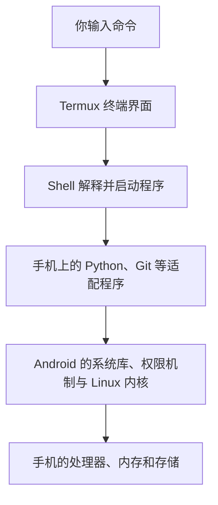

# Termux：Android上的终端与Linux工具环境

> [!summary] 一句话解释
> Termux 是运行在 Android 手机上的终端应用和 Linux 工具环境，让你不必先给手机获取 root 权限，就能执行命令、安装开发工具、运行程序和连接远程服务器。

Termux 是产品名称，可近似读作“特姆克斯”，不必当成需要展开的英文缩写。它的标准应用面向 Android，并不是给 iPhone 或 Windows 直接安装的同一款程序。[Termux 官网](https://termux.dev/en/)

## 一、生活类比：给手机增加一个命令行工作台

平时用手机，你通过点按钮告诉应用做事。用 Termux，则可以输入一行命令，让手机运行某个工具。

可以把手机看作一间已经正常运转的工作室，Termux 在里面增加了一张工作台：终端是显示和输入界面，Shell 是理解指令的人，Python、Git 等程序是按需放上去的工具。

**它不是拆掉 Android 再安装另一套操作系统，而是在 Android 允许的范围内增加工具环境。**

## 二、先分清 Termux、终端、Shell 与 Linux

| 名称 | 是什么 | 与 Termux 的关系 |
|---|---|---|
| Terminal，终端 | 接收键盘输入、显示程序输出的界面 | Termux 提供终端模拟功能 |
| Shell，命令解释器 | 解释命令语法并启动程序 | Termux 内可以运行 Bash 等 Shell |
| Bash | Bourne-Again SHell，读作“拜什”，一种 Shell | 不是 Termux 本身，也不等于 Linux |
| Linux 内核 | 管理进程、内存、设备等底层资源 | Android 使用基于 Linux 的内核，Termux 默认沿用它 |
| Python、Git 等工具 | 实际完成编程、版本管理等任务的程序 | 可按需安装，并由 Shell 启动 |

**CLI（Command-Line Interface，命令行界面，按字母读）** 描述通过文字命令操作程序的方式，不是某种手机型号或操作系统。参见 [[CMD、Bash与PowerShell]]、[[操作系统、内核与硬件管理]]。

Termux 不只是一个画着黑底白字的窗口，也包含启动工具环境和安装软件包的能力；但初始安装不等于所有开发软件都已经装好。

## 三、命令到底在哪里运行

### 1. 默认：在你的 Android 手机上运行



默认情况下，适配的程序在 Android 上原生执行；不是必须先启动虚拟机，也不是每条命令都发到云服务器。终端“模拟”主要指模拟文字终端的交互行为，不意味着默认模拟另一种处理器。[Termux 官方执行环境说明](https://github.com/termux/termux-packages/wiki/Termux-execution-environment)

例如你在 Termux 中运行 Python 做加法，使用的是手机的计算资源。程序是否联网，取决于程序在做什么，而不是所有命令都需要网络。

### 2. 主动远程连接后：命令可以在服务器上运行

**SSH（Secure Shell，安全外壳协议，按字母读“艾斯—艾斯—艾尺”）** 用于安全地登录远程机器、执行命令等。Termux 可以安装 OpenSSH 这类工具作为客户端。[Termux 官网：远程访问能力](https://termux.dev/en/)

当你通过 SSH 登录自己有权限访问的服务器，远程会话里的命令由服务器执行；手机主要负责输入、显示和传输。这时服务器的处理器与内存才是主要计算资源。

“手机里能看到终端”无法判断命令在哪里运行，还要看是否已进入远程会话。也不要把手机本地路径与 Windows 的 `D:\krxstudy` 当成同一个目录；同步需要另外建立明确流程。

## 四、它通常能做什么

- **学习命令行**：练习查看目录、切换目录、查找文字、管道和脚本。
- **写代码和运行脚本**：安装 Python、Node.js 等适配工具，做小型开发或自动化练习。
- **使用 Git**：下载自己有权访问的代码、检查修改、提交和同步；安装 Git 不代表自动同步所有文件。
- **远程管理服务器**：通过 SSH 操作你获准访问的服务器。
- **调试网络和接口**：请求网页或接口，观察返回结果；仍需遵守目标系统的权限与使用规则。
- **运行小型本地服务**：用于学习或测试，但是否能被其他设备访问，取决于监听地址、网络与权限设置。

可以把它当作口袋里的轻量开发工作台，但复杂项目是否能运行，要具体检查依赖、平台适配与资源。Python 或 Node.js 能安装，并不保证其生态里的每一个包都能原样安装。[Termux 官网的工具能力介绍](https://termux.dev/en/)

相关知识：[[Unix与Linux设计哲学：文件、小工具与管道]]、[[常见编程语言及其用途]]、[[Node.js与pnpm]]、[[防火墙与端口对外开放]]。

## 五、一个很小的使用例子

> [!note] 运行位置
> 以下是给“已经安装好 Termux 的 Android 手机”的教学示例，不是当前 Windows 仓库应执行的命令。本次仅编写笔记，没有在手机安装软件或运行这些命令。

先认识位置与文件查看：

```bash
pwd
ls
```

- `pwd` 显示当前所在目录。
- `ls` 列出当前目录的内容。

再按需准备 Python。下面的更新与安装会联网、下载文件并改变手机里的 Termux 软件环境，应阅读确认提示和所需空间：

```bash
pkg update
pkg upgrade
pkg install python
```

- `pkg update`：刷新可用软件包的信息。
- `pkg upgrade`：升级已安装的软件包。
- `pkg install python`：安装 Python 及所需依赖。

`pkg` 是 Termux 的软件包管理命令。它使用 **APT（Advanced Package Tool，高级软件包工具，按字母读）** 相关能力管理软件，但使用 Termux 适配的软件来源，不代表可以混用 Ubuntu 软件源。包管理与仓库故障可参考 [官方软件包管理说明](https://github.com/termux/termux-packages/wiki/Package-Management)；该页面包含历史版本信息，其中旧 Play 版本的说明不能替代第八节引用的当前安装指引。

安装完成后运行：

```bash
python -c "print(1 + 1)"
```

它让 Python 执行引号内的一小段代码，预期输出 `2`。这个计算在手机本地完成，不需要把算式发给服务器。

## 六、为什么它不等于完整的 Ubuntu 电脑

### 1. 共用 Linux 内核基础，不代表用户环境完全相同

Android 与常见桌面 Linux 发行版在系统库、目录结构、权限和服务管理上有差别。Termux 的原生软件通常针对 Android 的 Bionic 系统库与自身目录进行适配；很多普通 Linux 发行版的程序则依赖另一套环境。[Termux 执行与动态链接说明](https://github.com/termux/termux-packages/wiki/Termux-execution-environment)

所以不能只看到文件写着“Linux 版”，就认为它能直接在 Termux 运行。还要检查处理器指令集、系统库和依赖；电脑上的可执行文件不一定能复制到手机上直接运行。参见 [[CPU、指令集与计算机体系结构]]、[[Ubuntu：Linux发行版、软件管理与架构选择]]。

### 2. “用 Termux 装 Ubuntu”通常是另一层用户空间环境

一些教程通过 **PRoot / PRoot-Distro**，在 Termux 上管理 Ubuntu、Debian 等发行版的文件与程序环境。PRoot 通过用户空间的系统调用处理与路径转换，让程序看到类似另一套系统目录的环境，并不替换手机内核。

这类环境里显示的 `root` 身份，不等于真正获得 Android 的系统管理员权限；它也不具备普通 Docker 容器的全部内核隔离能力。不能把它当成能够安全运行任意不可信代码的强隔离沙箱。[PRoot-Distro 官方原理与限制](https://github.com/termux/proot-distro#limitations)

初学阶段不必先装这层环境，先在 Termux 原生工具环境里学会基本命令即可。参见 [[Docker容器与DI容器：运行隔离和对象装配]]。

## 七、root、文件权限与运行限制

**root** 在 Unix/Linux 语境通常指超级用户；不是英文缩写。手机“获取 root”指获得更高的系统权限，和普通安装应用不是一回事。

Termux 的常规使用不要求手机 root。反过来，装了 Termux 也不会自动让手机获得 root。[Termux 官网](https://termux.dev/en/)

正常情况下它仍受 Android 应用沙箱和权限机制限制，不能因为能够输入命令，就随意读取其他应用的私有数据。访问共享文件或设备能力，也要看系统版本、授予的权限和相应接口。[Android 官方：应用沙箱](https://source.android.com/docs/security/app-sandbox)

需要特别注意：

- Termux 自己的工作目录与手机共享存储不是一回事；项目放在哪里会影响权限和可用文件特性。
- 卸载或清除应用数据可能删除其中的代码、密钥和笔记，迁移前应备份。
- Android 的后台进程与资源管理可能终止运行中的程序；不同版本和厂商的行为可能不同。
- 手机还受电量、温度、网络切换和存储空间限制，不能把“测试能运行”理解为“适合长期生产服务”。

官方安装说明同时提醒了 Android 后台进程限制与备份问题。[Termux 应用说明](https://github.com/termux/termux-app)

在你之前讨论的直播项目里，Termux 更适合当学习、测试或远程运维工具，不宜把私人手机默认作为正式直播和现金红包后台。参见 [[开发、测试、预发布与生产环境]]。

## 八、从哪里安装，为什么旧教程可能不对

截至 2026-09-14 核对，官方主仓库列出以下安装渠道：

- **F-Droid**：开源 Android 应用分发渠道；从官方仓库的安装指引进入对应条目。
- **Termux 官方 GitHub 发布页**：注意辨别正式发布与测试构建，按设备和官方说明选择。
- **Google Play 分支**：官方说明中仍有面向 Android 11 及以上的单独实验分支，功能与问题可能不同；不能简单套用“所有 Play 版本都已永久废弃”的旧结论。

主应用与配套插件要遵循相同渠道的签名兼容要求，不要随意把不同来源的安装包混装；换来源前先备份，而不是直接卸载再发现数据丢失。只从官方指引的来源获取，不使用不明群聊转发的“增强版”。[Termux 官方安装说明](https://github.com/termux/termux-app#installation)

手机型号、Android 版本和现有安装来源尚未确认，因此这里不是针对某台设备的安装操作方案。

## 九、常见误区

- **“Termux 就是手机上的 Linux 操作系统”**：更准确地说，它是在 Android 上提供终端和适配的工具环境。
- **“终端模拟器意味着程序是假运行”**：默认适配程序通常原生运行；模拟的是终端交互，不是默认模拟整台电脑。
- **“输入命令就能绕过权限”**：命令行只是一种交互方式，仍然受系统和目标服务权限约束。
- **“只要是 Linux 教程就能直接照抄”**：程序包、路径、系统库、架构和后台服务管理可能不同。
- **“把窗口关了，服务一定继续运行”**：是否继续与会话、进程、Android 后台管理等有关。
- **“Termux 本身就是翻墙或破解工具”**：它是通用开发和命令行工具环境，能做什么取决于安装的软件、配置与合法授权。
- **“网上的一键脚本都适合新手”**：脚本可能删除、上传或修改数据，执行前应理解来源和行为，不将密钥写进公开仓库。

## 十、建议学习顺序与参考资料

先读 [[CMD、Bash与PowerShell]]，区分终端、Shell 与命令；再练习 `pwd`、`ls`、`cd`。之后学习软件包管理，运行一段小程序；最后根据实际需要学习 Git、SSH、本地服务或 PRoot，不必一次安装所有工具。

官方资料已在正文对应位置链接，主要包括 Termux 官网、应用安装说明、软件包管理、执行环境、PRoot-Distro 和 Android 应用沙箱。程序名称、安装渠道及兼容情况会变化；本笔记不承诺任意项目都能运行，也没有对 Android 真机做安装或运行验证。
