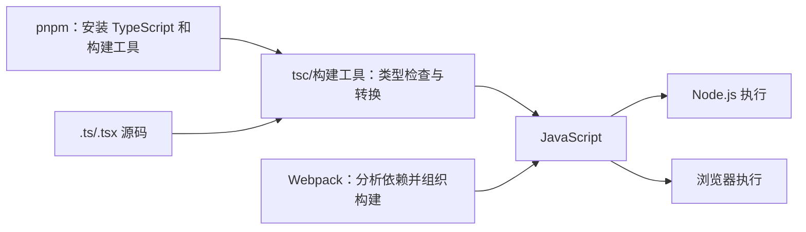

# TypeScript 与 JavaScript

> [!summary] 一句话解释
> **TypeScript（简称 TS）是在 JavaScript 基础上增加静态类型检查的编程语言；开发时用类型提前发现错误，构建后通常去掉类型并生成 JavaScript，再交给浏览器或 Node.js 执行。**

## TS 全称是什么

**TS** 是 **TypeScript** 的简称，读作“Type Script”，中文常译为“类型脚本”。

**JS** 是 **JavaScript** 的简称，读作“Java Script”。

最重要的关系是：

```text
TypeScript = JavaScript + 类型语法 + 静态类型检查工具
```

TypeScript 不是 JavaScript 的竞争对手，也不是另一个完全无关的运行平台。官方称它为 JavaScript 的 **Typed Superset（带类型的超集）**。

“超集”可以先理解为：

- JavaScript 的大部分合法语法也是 TypeScript 语法；
- TypeScript 在其上增加类型标注、接口、泛型等能力；
- TypeScript 保留 JavaScript 的运行行为；
- 学 TypeScript 仍然必须学习 JavaScript。

## 生活类比：写作与校对

JavaScript 像直接写文章并发布；TypeScript 像写文章时开启一位了解全文结构的校对员：

- 变量原本应该是数字，却传入文字时提醒；
- 对象没有某个属性，却拼错名字时提醒；
- 函数需要两个参数，却少传一个时提醒；
- 修改接口后，告诉你哪些调用位置可能受影响。

校对员可以提前发现很多问题，但不能保证文章事实一定正确。TypeScript 也能发现很多类型错误，却不能证明程序没有任何业务漏洞。

---

## 为什么 JavaScript 还需要 TypeScript

JavaScript 是动态类型语言。变量的实际类型通常在程序运行时体现：

```js
let value = 10
value = '十'
```

这在 JavaScript 中允许发生。灵活性很高，但大型项目中也容易出现问题：

```js
function add(a, b) {
  return a + b
}

add(1, 2)       // 3
add('1', 2)     // '12'
```

第二次调用没有报错，但结果可能不是开发者想要的数字 `3`。

TypeScript 可以把预期写进代码：

```ts
function add(a: number, b: number): number {
  return a + b
}

add(1, 2)       // 正确
add('1', 2)     // 类型检查错误
```

这里：

- `a: number` 表示参数 `a` 应是数字；
- `b: number` 表示参数 `b` 应是数字；
- 函数括号后的 `: number` 表示返回值应是数字。

在第二次调用真正运行之前，编辑器或 TypeScript 编译器就能提醒错误。

## 什么是静态类型检查

**Static Type Checking（静态类型检查）**是指：不真正执行程序，而是根据代码中的类型信息提前分析可能的错误。

```text
静态检查：运行之前分析
动态行为：运行时才发生
```

例如：

```ts
const user = {
  name: '小明',
  age: 18
}

console.log(user.naem)
```

`naem` 拼错了。JavaScript 运行时可能得到 `undefined`；TypeScript 可以提前提示：“对象上不存在 `naem`，你是不是想写 `name`？”

这类能力对大型项目、多人协作和重构尤其有帮助。

---

## TypeScript 是怎样运行的

通常可以理解为：


例如 TypeScript：

```ts
function greet(name: string): string {
  return `你好，${name}`
}
```

类型被擦除后，生成的 JavaScript 大致类似：

```js
function greet(name) {
  return `你好，${name}`
}
```

浏览器或 [[Node.js与pnpm|Node.js]] 看到的主要是 JavaScript；`string` 之类的类型信息通常不再存在。

某些现代运行时或开发工具可以直接接收 `.ts` 文件并在内部处理类型语法，但初学阶段仍建议用“检查并转换成 JavaScript，再执行”理解整体流程。

## Type Erasure（类型擦除）

TypeScript 官方强调：类型检查完成后，编译器大体会擦除类型，输出普通 JavaScript。

这带来一个非常重要的结论：

> **TypeScript 类型通常只在开发和构建阶段帮助你，不会自动在运行时检查网络请求、用户输入和数据库数据。**

例如：

```ts
interface User {
  id: number
  name: string
}
```

这个接口不会在运行时自动拦截下面的数据：

```json
{
  "id": "本应是数字，却传来了文字",
  "name": null
}
```

从 [[SDK与API|API]]、文件或数据库获得的外部数据，仍需要实际运行时验证，例如手写判断或使用 schema 验证库。

---

## 常见基础类型

### 字符串、数字和布尔值

```ts
let name: string = '小明'
let age: number = 18
let isStudent: boolean = true
```

### 数组

```ts
let scores: number[] = [90, 85, 100]
let names: Array<string> = ['小明', '小红']
```

`number[]` 和 `Array<number>` 都可以表示数字数组。

### 对象与 Interface

**Interface（接口）**可以描述对象应有什么属性：

```ts
interface User {
  id: number
  name: string
  nickname?: string
}

const user: User = {
  id: 1,
  name: '小明'
}
```

`nickname?` 中的问号表示这个属性可以不存在。

这里的 interface 是类型约定，不等于 [[SDK与API|API 接口]]。同一个英文词在不同上下文中含义不同。

### Union Type（联合类型）

竖线 `|` 表示一个值可以属于多种类型：

```ts
let id: number | string

id = 100
id = 'user-100'
```

### `null` 与 `undefined`

它们表示“没有值”或“值尚不存在”，但具体区别和检查行为受到 `tsconfig.json` 中严格选项影响。

### `any`

`any` 表示基本放弃这部分的类型检查：

```ts
let data: any
data.notExist().anything
```

它像一张“跳过安检卡”，短期方便，但使用过多会失去 TypeScript 的主要价值。

### `unknown`

`unknown` 表示“我现在不知道它是什么类型”，使用前必须检查：

```ts
function printValue(value: unknown) {
  if (typeof value === 'string') {
    console.log(value.toUpperCase())
  }
}
```

对于不可信的外部数据，`unknown` 通常比 `any` 更安全。

## Type Inference（类型推断）

TypeScript 不要求每个变量都手写类型。它可以根据初始值推断：

```ts
let count = 10
```

虽然没有写 `: number`，TypeScript 仍通常知道 `count` 是数字：

```ts
count = '十' // 类型错误
```

因此实际项目中常见原则是：**能清楚推断时让工具推断；公共接口、函数边界和容易误解的位置明确标注。**

## Narrowing（类型收窄）

当一个变量可能有多种类型时，先检查再使用：

```ts
function format(value: string | number) {
  if (typeof value === 'string') {
    return value.toUpperCase()
  }

  return value.toFixed(2)
}
```

在 `if` 内部，TypeScript 知道 `value` 是字符串；另一条路径中则知道它是数字。这叫类型收窄。

---

## 常见 TypeScript 文件

| 文件 | 作用 |
|---|---|
| `.ts` | 普通 TypeScript 源码 |
| `.tsx` | 可以包含 JSX 的 TypeScript，常用于 React 组件 |
| `.d.ts` | Declaration File（声明文件），描述 JavaScript 库的类型 |
| `tsconfig.json` | TypeScript 项目配置文件 |

### `.d.ts` 是什么

有些 JavaScript 库运行时没有 TypeScript 类型。`.d.ts` 像一份“类型说明书”，告诉编辑器：

- 库导出了哪些函数；
- 函数需要什么参数；
- 返回什么类型；
- 对象有哪些属性。

它通常只提供类型信息，不包含真正业务实现。

## `tsc` 是什么

`tsc` 是 **TypeScript Compiler（TypeScript 编译器）**的命令。

常见用途：

```text
tsc             根据 tsconfig.json 检查并构建
tsc --noEmit    只检查类型，不输出 JavaScript
```

在 pnpm 项目中可能写成：

```text
pnpm exec tsc --noEmit
```

意思是使用当前项目安装的 TypeScript 编译器，只做类型检查。

## `tsconfig.json` 是什么

它是 TypeScript 项目的配置入口，告诉编译器：

- 哪些文件属于项目；
- 输出目标 JavaScript 版本；
- 使用哪种模块系统；
- 是否只检查而不输出；
- 是否启用严格检查；
- 源码与输出目录在哪里；
- 怎样解析模块和类型声明。

一个简化例子：

```json
{
  "compilerOptions": {
    "target": "ES2022",
    "module": "ESNext",
    "strict": true,
    "outDir": "dist"
  },
  "include": ["src"]
}
```

`strict: true` 会组合启用一组更严格的类型检查。新项目通常值得尽早开启；老 JavaScript 项目迁移时可能需要逐步收紧。

---

## TypeScript 与 JavaScript 的区别

| 比较项 | JavaScript | TypeScript |
|---|---|---|
| 是否可直接作为浏览器主要运行语言 | 是 | 通常先去除类型并转换成 JavaScript |
| 类型检查 | 主要在运行时体现 | 提供运行前静态类型检查 |
| 文件扩展名 | `.js`、`.mjs`、`.cjs` | `.ts`、`.tsx` |
| 类型标注 | 没有 TypeScript 类型语法 | 支持 `: string`、interface、泛型等 |
| 学习成本 | 先学运行语法和动态行为 | 还要学习类型系统和编译配置 |
| 运行行为 | 由 JavaScript 规范和运行时决定 | 官方原则上保留 JavaScript 的运行行为 |

TypeScript 的目标不是让程序运行得更快，而是让开发过程更可检查、更容易维护。

## TypeScript 带来的好处

- 在运行前发现部分错误；
- 编辑器自动补全更准确；
- 重命名和大规模重构更可靠；
- 函数参数和对象结构更容易理解；
- 团队协作时接口约定更清晰；
- 第三方库可以通过声明文件提供类型说明；
- 大型插件、事件和 API 项目更容易维护。

## 成本和局限

- 要学习类型系统；
- 需要编译器和项目配置；
- 类型过度复杂时，代码可能难读；
- 第三方类型声明可能不准确或过期；
- 类型检查会增加构建时间；
- `any`、类型断言等可以绕过检查；
- 类型正确不代表业务逻辑、安全性和运行时数据一定正确。

---

## Type Assertion（类型断言）不是转换和验证

下面的 `as User` 是告诉 TypeScript“相信我，这是 User”：

```ts
const user = responseData as User
```

它通常不会：

- 把字符串自动转换成数字；
- 检查对象真的拥有所有字段；
- 在数据错误时自动抛出异常；
- 修改运行时数据。

类型断言更像“开发者签字担保”，不是安检机器。对 API 响应和用户输入仍要做运行时验证。

## TypeScript 与 Node.js、pnpm、Webpack 的关系



- [[Node.js与pnpm|Node.js]]：运行 JavaScript，也运行很多 TypeScript 构建工具；
- [[Node.js与pnpm|pnpm]]：安装 TypeScript、类型声明和相关工具；
- [[Webpack与HMR|Webpack]]：可以通过 Loader 或其他工具链处理 TypeScript，并把模块打包；
- 浏览器：最终主要执行构建后的 JavaScript。

项目可能让 `tsc` 同时检查和输出 JavaScript，也可能让 `tsc --noEmit` 只检查类型，再由 Webpack、Babel、esbuild 等处理输出。不同项目的构建流水线不完全相同。

## TypeScript 与 DeepSeek Harness/Cordis

[[DeepSeek Harness、Everything is a Plugin与Cordis|DeepSeek Harness 和 Cordis]] 的主体位于 TypeScript/Node.js 生态。

在这类大型插件系统中，TypeScript 可以帮助约束：

- Service 的方法和返回值；
- 事件名称和参数；
- 工具的输入输出；
- 插件配置结构；
- 上下文中不同 `ctx` 服务的类型。

但 TypeScript 类型本身不会管理插件生命周期。依赖、事件、加载、卸载和可逆 effect 仍由 Cordis 等运行框架负责。

## 常见误区

### 误区 1：TypeScript 是浏览器中的另一套运行环境

不是。浏览器最终主要执行 JavaScript；TypeScript 通常在开发和构建阶段发挥作用。

### 误区 2：用了 TypeScript 就不需要学 JavaScript

不可能。TypeScript 共享 JavaScript 的语法、标准库和运行行为。循环、函数、Promise、DOM、事件循环等仍是 JavaScript 知识。

### 误区 3：所有变量都必须手写类型

不是。TypeScript 有类型推断，很多局部变量无需重复标注。

### 误区 4：编译通过就绝对没有 Bug

不是。类型系统不能证明业务需求正确，也不能自动检查所有外部数据、权限和网络失败。

### 误区 5：`any` 可以解决类型问题

`any` 通常只是关闭检查。它可能让报错消失，却也让问题重新推迟到运行时。

### 误区 6：`as` 会转换数据

通常不会。类型断言主要影响 TypeScript 如何看待代码，不会自动改变运行时值。

### 误区 7：TypeScript 会让程序运行得更快

类型检查主要改善开发可靠性，不直接保证生成的 JavaScript性能更高。

## 学习建议

1. 先掌握 JavaScript 的变量、函数、对象、数组、模块和 Promise；
2. 再学习 `string`、`number`、`boolean`、数组和函数类型；
3. 学习 interface、可选属性与联合类型；
4. 理解类型推断和类型收窄；
5. 学会区分 `unknown` 与 `any`；
6. 理解类型擦除和运行时验证；
7. 再学习泛型、utility types、条件类型等高级能力；
8. 最后研究复杂 `tsconfig` 和声明文件发布。

初学阶段最重要的不是写出复杂类型，而是让类型帮助你表达真实数据结构和函数边界。

## 关联概念

- [[Index的常见含义]]：数组下标和 `index.ts` 入口/聚合文件中的 Index 含义。
- [[Node.js与pnpm]]：运行 JavaScript，安装和执行 TypeScript 工具。
- [[Webpack与HMR]]：构建和打包 TypeScript/JavaScript 项目。
- [[SDK与API]]：可以用类型描述 API 请求和响应，但外部数据仍需运行时验证。
- [[HTML]]、[[CSS]]：TypeScript 常负责网页交互逻辑，HTML/CSS 负责结构和样式。
- [[DeepSeek Harness、Everything is a Plugin与Cordis]]：大型 TypeScript 插件系统实例。
- [[DI容器、Pi与轻量钩子方案]]：类型可以描述服务与 Hook，但运行时组装由框架完成。

## 参考资料

- [TypeScript 官方：TypeScript for the New Programmer](https://www.typescriptlang.org/docs/handbook/typescript-from-scratch.html)
- [TypeScript 官方手册：The Basics](https://www.typescriptlang.org/docs/handbook/2/basic-types.html)
- [TypeScript 官方手册：Type Inference](https://www.typescriptlang.org/docs/handbook/type-inference.html)
- [TypeScript 官方 TSConfig Reference](https://www.typescriptlang.org/tsconfig/)
