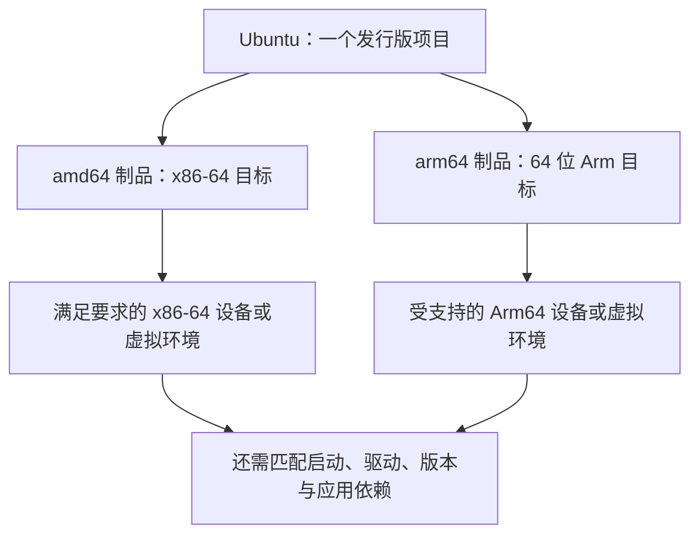

# Ubuntu：Linux 发行版、软件管理与架构选择

> [!summary] 一句话解释
> Ubuntu 是围绕 Linux 内核、系统工具、软件包和更新机制组织起来的操作系统发行版；它既能用于桌面，也能用于服务器，并有面向不同处理器架构和设备环境的版本。

**Ubuntu（通常读“乌班图”）** 是项目名称，不是由几个英文单词首字母拼成的缩写。它与 Debian 发行版有技术渊源，由 Canonical 公司与社区共同推动，不是微软开发的 Windows 皮肤。[Ubuntu 项目介绍](https://ubuntu.com/about)

**OS = Operating System（操作系统，读 O-S）**。如果把 Linux 内核比作发动机，Ubuntu 更像把发动机、控制系统、维护工具和用户操作环境组装好的车型。类比只说明组件与成套系统的关系，内核本身并不是完整桌面。

入口：[[计算机硬件与底层软件学习地图]]；架构比较见 [[CPU、指令集与计算机体系结构]]。

## 一、Ubuntu、Linux、Debian 和 Windows 分别是什么

| 名称 | 所处层次 | 如何理解 |
|---|---|---|
| Linux 内核 | 关键底层软件 | 调度任务、管理内存、提供设备与系统机制 |
| Linux 发行版 | 成套操作系统环境 | 在内核上组织工具、软件包、默认配置和维护方式 |
| Debian | 一个 Linux 发行版项目 | 提供自己的软件与发布体系，Ubuntu 与其有渊源 |
| Ubuntu | 一个具体发行版 | 有自己的发布、软件仓库、配置、支持与产品形态 |
| Windows | 另一套操作系统家族 | 不使用 Ubuntu 的同一套内核与原生应用接口 |

日常说“服务器装了 Linux”，可能实际装的是 Ubuntu、Debian 或其他发行版。说“Ubuntu 是 Linux”是在发行版语境下简写；说“Ubuntu 与 Linux 完全是同一个东西”就不够准确。

Ubuntu 与 Debian 有渊源，也不意味着它们的所有软件源、安装包和版本都可以任意混用。其他 Linux 发行版还可能使用不同包管理体系。

## 二、Ubuntu 由什么组成

通常可以看到以下组成：

1. Linux 内核与适合平台的驱动。
2. 基础库、命令行工具、用户与权限机制。
3. 启动与服务管理、网络配置、日志等系统组件。
4. 软件包管理工具和配置好的软件来源。
5. 桌面版还包括图形界面、文件管理器与常用桌面应用。
6. 安装、更新、安全维护和版本升级机制。

所以 Ubuntu 不是“只能输入黑窗口命令的工具”。服务器经常没有桌面，是因为用途与默认安装内容不同，而不是 Linux 不支持图形界面。

## 三、它主要可以用来做什么

- 桌面学习与办公：浏览网页、处理文件、使用支持 Linux 的应用。
- 软件开发：运行编辑器、编译器、Python、Java、Go 等开发环境。
- 服务端：部署网站、数据库、后台任务与网络服务。
- 云与容器：作为云主机系统或容器所需的用户空间基础。
- 科学计算与模型应用：在驱动、硬件与软件框架受支持时运行计算任务。

这些工作并不是 Ubuntu 独占。它的价值在于把很多常用组件和维护流程组织到一起；安装 Ubuntu 也不会自动获得高并发、数据安全或 GPU 加速能力。

关联 [[Linux的主要用途、普及原因与桌面现状]]、[[开发、测试、预发布与生产环境]]。

## 四、Desktop、Server、Core 是什么区别

| 形态 | 主要用途与默认侧重 | 注意 |
|---|---|---|
| Ubuntu Desktop（桌面版） | 面向人直接使用的图形桌面、开发和日常应用 | 不代表不能运行服务器软件 |
| Ubuntu Server（服务器版） | 面向服务部署、远程管理与较精简安装 | 不代表使用另一种 CPU 指令集，也不是绝对不能装桌面 |
| Ubuntu Core | 面向专用设备的不同交付与更新模型，以 snap 组件为核心 | 不是把普通 Server 随意删掉几包就等价得到的系统 |

Desktop 与 Server 的差别主要在默认包集合、配置、安装体验与使用定位，不应简化成“桌面版内核不会处理并发，服务器版内核才会”。

Core、云镜像、开发板镜像和普通安装镜像的格式与启动环境也可能不同，不能只看名字里都有 Ubuntu 就互换。

## 五、Ubuntu 与 x86、Arm 的关系

**CPU = Central Processing Unit（中央处理器，读 C-P-U）** 是硬件；**ISA = Instruction Set Architecture（指令集体系结构，读 I-S-A）** 是软硬件之间的行为约定。

x86、Arm 是处理器架构家族，Ubuntu 是操作系统发行版。它们回答的是不同问题：

- 架构：处理器理解什么机器指令？
- 发行版：使用哪套内核、工具、软件包与维护体系？
- 设备支持：这套系统能否启动并控制这台具体机器？



这不是“一个安装文件装遍所有机器”。官方桌面下载页分别提供 Intel/AMD 64 位和 Arm 64 位入口，服务器也有 Arm 入口；具体可用镜像和支持范围以选择的版本为准。[Ubuntu Desktop 下载](https://ubuntu.com/download/desktop)、[Ubuntu Server for ARM](https://ubuntu.com/download/server/arm)

### amd64、x86_64、arm64、aarch64 为什么看起来这么乱

| 常见名称 | 常见出现位置 | 主要含义 |
|---|---|---|
| amd64 | Ubuntu/Debian 包架构、镜像文件名 | x86-64 目标，不仅适用于 AMD 厂商 |
| x86_64 / x86-64 / x64 | 内核输出、工具或安装包标签 | 常见 64 位 x86 家族名称，具体标签用法看工具 |
| arm64 | Ubuntu 包架构、镜像或平台标签 | 64 位 Arm 软件目标 |
| aarch64 / AArch64 | 内核工具输出、编译器与架构文档 | 对应 64 位 Arm 执行架构的常见名称 |

`amd64` 中的 AMD 源于这一架构扩展的历史命名；满足系统要求的 Intel x86-64 处理器也使用相应制品。反过来，旧 32 位 x86 处理器不因同属 x86 家族就能运行 64 位镜像。

同样是 amd64 或 arm64，仍可能有最低架构版本、可选指令扩展和发行版要求。不要只看“64 位”三个字。

### 为什么不是任何 Arm 设备都能安装

还需要考虑：

1. 设备是否允许启动所需系统，启动流程是否匹配。
2. 系统内核是否支持这颗芯片和该板卡。
3. 显示、存储、网卡、触控、电源管理等驱动是否可用。
4. 内存、存储等资源是否达到该镜像的要求。
5. 镜像是否面向该类通用平台、特定开发板、云环境或虚拟机。

**UEFI = Unified Extensible Firmware Interface（统一可扩展固件接口，读 U-E-F-I）**；**ACPI = Advanced Configuration and Power Interface（高级配置与电源接口，读 A-C-P-I）**。它们能为相应平台提供较标准的启动与硬件描述环境，但不保证所有外设都自动有驱动。

Ubuntu 的通用 Arm64 桌面镜像逐步支持符合相关平台条件的设备，但部分硬件仍需专门适配。手机、开发板、Apple Silicon 电脑和 Arm 云服务器不应仅凭架构同名就被视为相同安装目标。[Ubuntu 团队关于 Arm64 桌面的说明](https://discourse.ubuntu.com/t/ubuntu-desktop-on-arm64-history-benefits-and-what-s-next/57775)

## 六、安装包与系统兼容：CPU 对了还不够

假设有三个下载选项：

```text
Windows x64
Linux amd64
Linux arm64
```

第一项和第二项可能面向相同 CPU 架构，但操作系统接口与程序格式不同。第二项和第三项可能来自同一软件项目，但机器码与本地依赖不同。

Ubuntu 通常不能直接原生执行任意 Windows `.exe` 应用。兼容层、仿真或虚拟机可以解决某些场景，但覆盖范围、外设、性能和维护要另行确认。

同理，Python 脚本、Java 程序看起来跨平台，也依赖目标系统的解释器/运行环境以及相应原生扩展。Windows 下的整个虚拟环境目录，通常不应原样搬给 Ubuntu 当作可复用安装。

程序文件也不是唯一迁移对象：大小写敏感的路径、权限、换行、后台服务、环境变量、文件锁与部署脚本都可能不同。见 [[Web端、桌面软件与CLI程序的区别]]。

## 七、Ubuntu 怎样安装与更新软件

**APT = Advanced Packaging Tool（高级软件包管理工具，读 A-P-T）** 是常用的 Debian 包管理工具体系，`apt` 是常见命令入口。

软件仓库在这里通常是提供安装包、版本与索引的服务，不等于把任意 GitHub 源码仓库下载下来。Ubuntu 按软件来源、系统发行版和包架构寻找适合的包，并处理依赖。

`dpkg` 是较底层的 Debian 包管理工具；`.deb` 是相关软件包格式。Ubuntu 也可以使用 snap 等其他分发机制，所以并不是所有应用都只有一种安装方法。

下面是已经进入 Ubuntu 后的只读查询示例，不安装软件：

```bash
apt search '^git$'
apt show git
```

第一条从本地已有包索引搜索名为 git 的包；第二条查看包信息。若包索引过旧或尚未配置，结果可能不完整；这两个命令不等于更新索引，也不是升级软件。[Ubuntu 软件包管理](https://ubuntu.com/server/docs/how-to/software/package-management/)

系统包与 Python 环境管理又是不同层次：系统工具由发行版管理，项目依赖可以在适当隔离环境中管理，见 [[Anaconda与Python环境管理]]。不要为了安装某个库就随意替换系统依赖或混用不同发行版的软件源。

## 八、版本号和 LTS 怎么理解

例如 `24.04` 表示该版本系列在 2024 年 4 月发布；之后的 `.1`、`.2` 等点版本会整合更新，不是每个点版本都重新开始完整支持年限。

**LTS = Long Term Support（长期支持，读 L-T-S）**。Ubuntu 有较长维护周期的 LTS 系列，也有支持周期较短的中间版本。

按本次核对的项目说明，LTS 通常提供五年的标准安全维护，标准范围需要看组件；更长维护期、更广软件包覆盖或商业服务涉及相应支持计划。不要把宣传里的最长支持年限理解成“任意下载的软件全部免费维护那么久”。[Ubuntu 发布与支持规则](https://ubuntu.com/project/docs/release-team/ubuntu-releases/)

截至 2026-09-08，本次读取的官方桌面及 Arm 服务器下载页展示 `26.04.1 LTS`。这是核对时的状态，不应把它写成以后永久不变的最新版本。实际安装时还要检查具体硬件和所需软件是否支持该版本。

## 九、在 Windows 里看到 Ubuntu，是不是已经换系统

不一定，要看运行方式。

| 方式 | 它意味着什么 | 主要边界 |
|---|---|---|
| 直接安装 | Ubuntu 直接管理对应机器硬件 | 可能涉及分区、引导与原数据，风险较高 |
| 虚拟机 | 在宿主系统上提供虚拟硬件来运行 Ubuntu | 需要相应资源和虚拟化支持，不自动跨架构 |
| WSL | Windows 提供 Linux 运行环境的功能 | 不是直接替换 Windows，也不是完整裸机硬件环境 |
| 容器 | 运行 Ubuntu 相关用户空间与应用 | 通常共享承载它的 Linux 内核，不是启动完整 Ubuntu 桌面 |

**WSL = Windows Subsystem for Linux（适用于 Linux 的 Windows 子系统，读 W-S-L）**。WSL 2 使用轻量受管理虚拟机中的真实 Linux 内核；运行其中的 Ubuntu 环境不意味着 Windows 已被卸载。[Microsoft WSL 说明](https://learn.microsoft.com/en-us/windows/wsl/about)

WSL 1 与 WSL 2 实现不同，不能把 WSL 2 的描述无条件套给 WSL 1。虚拟机、WSL 与裸机安装的设备、网络、启动和文件系统行为也可能不同。

若只想学习终端和开发环境，可先理解 WSL；若想体验完整桌面，可了解虚拟机。具体选择与安装另行确认。本次没有安装 WSL、创建虚拟机、写启动盘或修改分区。

## 十、如何只读确认当前 Ubuntu 环境

以下命令只应在已经打开的 Ubuntu/Linux 终端中理解或执行，不是 Windows CMD 的通用命令：

```bash
uname -m
dpkg --print-architecture
cat /etc/os-release
```

- `uname -m`：查看当前内核环境报告的机器架构，常见 `x86_64` 或 `aarch64`。
- `dpkg --print-architecture`：查看该包管理环境的主架构，常见 `amd64` 或 `arm64`。
- `cat /etc/os-release`：读取发行版标识和版本信息；它不是修改配置。

**虚拟机、容器或仿真环境中的输出不一定等于底层实体宿主机的全部信息。** 特别是内核架构与用户空间包架构可能处于不同兼容安排中，要结合运行方式判断。

这些命令在本次笔记中作为语义示例，没有声称已在用户电脑的 Ubuntu 中执行，也没有据此判断用户当前处理器型号。

## 十一、常见误区

- Ubuntu 是 Arm：不对，发行版与处理器架构是两层概念。
- Intel 不能下载 amd64：不对，amd64 通常是 x86-64 架构标签。
- Arm64 镜像适合一切 Arm 设备：不对，还要看位宽、平台、驱动与资源。
- Linux 没桌面：不对，Ubuntu Desktop 就提供图形桌面。
- Server 版才能承受并发：不对，实际能力由软件、配置、资源和系统设计共同决定。
- 免费开源等于自动安全：不对，仍需更新、配置、权限和备份。
- LTS 等于永远不升级：不对，支持有范围和期限。
- 装个容器就能把 x86 变成 Arm：不对，跨架构另有构建或仿真条件。

## 十二、学习建议与关联概念

先学发行版与内核的关系，再辨认架构和版本，然后学习目录、权限、包管理与进程；有实际部署需求后再学习服务、网络、日志和备份。

可以自问：我说的 Ubuntu 是哪一版、哪一种形态、哪一个架构、运行在哪里？这四个问题比只说“我装了 Linux”更利于排查问题。

- [[CPU、指令集与计算机体系结构]]：x86 与 Arm 的详细比较、原生运行与兼容机制。
- [[操作系统、内核与硬件管理]]：系统怎样管理资源，驱动与内核怎样配合。
- [[Unix与Linux设计哲学：文件、小工具与管道]]：目录、工具与命令组合的设计思路。
- [[设备驱动：操作系统控制硬件的翻译层]]：为什么能启动系统还不等于全部外设受支持。
- [[固件、ROM代码与计算机启动链]]：镜像、启动固件与加载器的关系。
- [[Docker容器与DI容器：运行隔离和对象装配]]：容器为何不是一台独立启动的电脑。
- [[Linux为什么可以做得很小]]：按用途裁剪组件与资源需求。
- [[嵌入式系统为什么经常使用Linux]]：复杂设备为什么复用成熟系统。

## 参考资料

核对日期：2026-09-08。具体版本、支持周期、系统要求与设备认证应在安装前再次核对。

- [Ubuntu：项目介绍与历史](https://ubuntu.com/about)
- [Ubuntu：桌面下载与架构入口](https://ubuntu.com/download/desktop)
- [Ubuntu：Arm 服务器](https://ubuntu.com/download/server/arm)
- [Ubuntu：发布与 LTS 规则](https://ubuntu.com/project/docs/release-team/ubuntu-releases/)
- [Ubuntu：软件包管理](https://ubuntu.com/server/docs/how-to/software/package-management/)
- [Ubuntu 团队：Arm64 桌面支持的演进](https://discourse.ubuntu.com/t/ubuntu-desktop-on-arm64-history-benefits-and-what-s-next/57775)
- [Ubuntu：Core](https://ubuntu.com/core)
- [Microsoft：WSL 与 WSL 2](https://learn.microsoft.com/en-us/windows/wsl/about)
- [Docker：多平台镜像与构建](https://docs.docker.com/build/building/multi-platform/)
