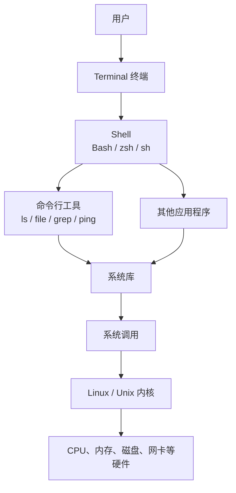
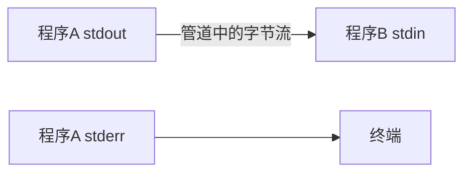
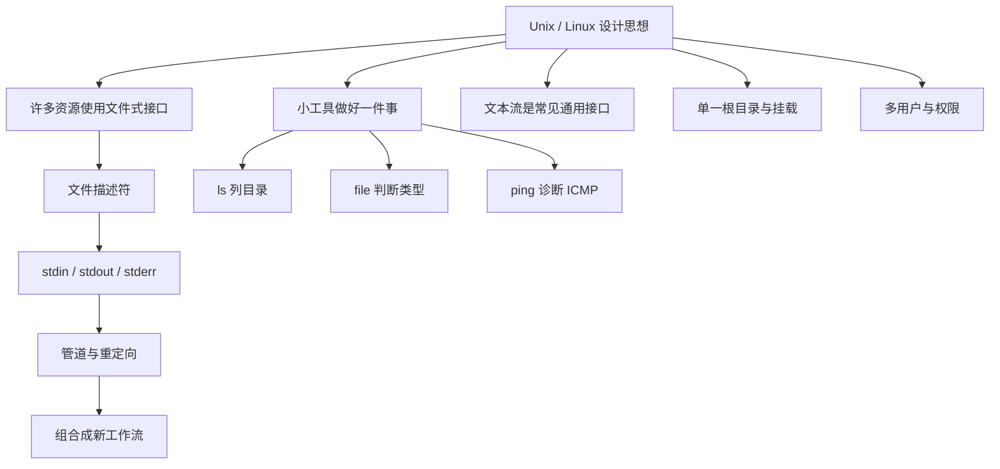

# Unix 与 Linux 设计哲学：文件、小工具与管道

> [!summary] 一句话结论
> **Unix/Linux 的经典设计思想，是把许多系统资源抽象成类似文件的统一接口，让一个个只做好一件事的小工具通过标准输入、标准输出和管道自由组合；`ls`、`file`、`ping` 都是这种命令行工具文化中的程序，但职责各不相同。**

你提到的几个词可以先这样对应：

| 词 | 实际含义 |
|---|---|
| `file` | 可能指“万物皆文件”的设计思想，也可能指判断文件类型的 `file` 命令 |
| `well` | 通常不是命令，来自“Do one thing and do it well” |
| `pipe` | 管道，写作竖线 `|`，把一个程序的输出交给另一个程序 |
| `ping` | 用 ICMP Echo 测试网络可达性和往返时间的程序 |
| `ls` | 列出文件或目录内容的程序 |

如果你原本把 `pipe` 写成了 `ping`，不用担心：本篇会把两个都讲清楚。

---

## 一、先分清 Unix、Linux 和 GNU/Linux

### Unix 是什么

**Unix** 是一套从 1960 年代末、1970 年代初在贝尔实验室发展起来的操作系统及其设计传统。

它带来的重要思想包括：

- 分层文件系统；
- 多用户和权限模型；
- 进程；
- Shell；
- 重定向和管道；
- 小工具组合；
- 以文本作为常见程序接口；
- 用 C 语言提高操作系统的可移植性。

后来出现了不同 Unix 分支、商业 Unix，以及 POSIX 等兼容标准。

### Linux 是什么

**Linux** 严格来说首先是一个操作系统内核，由 Linus Torvalds 在 1991 年开始开发。

内核负责：

- 进程调度；
- 内存管理；
- 文件系统；
- 设备驱动；
- 网络协议栈；
- 系统调用；
- 权限和资源隔离等。

我们日常说的 Ubuntu、Debian、Fedora、Arch Linux 等，是 **Linux Distribution（Linux 发行版）**，通常包含：

```text
Linux 内核
+ GNU 或其他基础工具
+ Shell
+ 软件包管理器
+ 系统服务
+ 桌面环境（可选）
+ 发行版自己的配置
```

### Linux 是 Unix 吗

更准确的说法是：

> **Linux 是 Unix-like（类 Unix）系统的重要内核，继承了大量 Unix 接口、工具习惯和设计思想，但它不是最初贝尔实验室 Unix 的同一份内核。**

因此“Unix/Linux 世界”通常是在泛指 Unix、Linux、BSD、macOS 等拥有相似命令行和系统接口传统的环境，但它们仍会有具体差异。

---

## 二、Unix 系统可以分成哪些层

先建立一个整体结构：



### Kernel：内核

**Kernel（内核）**直接管理硬件与核心系统资源。

### Shell：命令解释器

**Shell（壳层）**读取你输入的命令，处理变量、通配符、引号、管道和重定向，然后启动程序。Bash、zsh、dash 都是 Shell。

### Utility：小工具

`ls`、`file`、`grep`、`sort`、`wc`、`ping` 等通常是独立程序。Shell 负责找到并启动它们，它们不一定是 Shell 本身的一部分。

### Terminal：终端

**Terminal（终端）**是显示文字和接收键盘输入的界面。终端、Shell 和命令不是同一层。详见 [[CMD、Bash与PowerShell]]。

---

## 三、Everything is a file：万物皆文件

Unix 世界经常说：

> **Everything is a file——万物皆文件。**

这句话便于记忆，但不应按字面理解成“所有东西都是硬盘上的普通文本文档”。更准确的解释是：

> **许多不同类型的系统资源，都尽量通过统一的文件或文件描述符接口来访问。**

程序面对不同资源时，经常可以复用类似操作：

```text
打开 open
读取 read
写入 write
关闭 close
```

这减少了每种设备、每种数据源都设计一套完全不同接口的需要。

### 哪些东西会表现得像文件

| 对象 | 示例 | 表现方式 |
|---|---|---|
| 普通文件 | `/home/alice/note.txt` | 保存字节数据 |
| 目录 | `/home/alice` | 保存名称到文件对象的组织关系 |
| 设备 | `/dev/null`、`/dev/sda` | 通过设备文件与驱动交互 |
| 终端 | `/dev/tty` | 可以读取键盘输入、写出终端文字 |
| 进程和系统信息 | `/proc/1234/status`、`/proc/meminfo` | 内核生成的伪文件接口 |
| 内核设备模型 | `/sys/...` | sysfs 暴露的设备和内核属性 |
| 命名管道 | FIFO 文件 | 进程间传递数据 |
| Unix 域套接字 | 某些路径下的 socket 节点 | 本机进程间通信入口 |

### `/proc` 中的文件真的在磁盘上吗

通常不是。

`/proc` 是 **Pseudo-filesystem（伪文件系统）**。读取 `/proc/meminfo` 时，内核根据当前内存状态动态生成内容；它并不是一份静态文本文件永久存放在磁盘中。

这说明“文件”在 Unix 中不仅是存储格式，也可以是一种访问接口。

### `/dev/null` 是什么

`/dev/null` 是一个特殊设备文件：

- 写进去的数据会被丢弃；
- 读取它会立即得到文件结束。

例如丢弃一个程序的正常输出：

```bash
some_command > /dev/null
```

它像一个“数据黑洞”。

### Socket 也真的是文件吗

网络 socket 创建后通常也由 **File Descriptor（文件描述符）**表示，可以使用很多类似文件的 I/O 机制，但网络 socket 不一定在目录树里拥有一个普通文件路径。

所以“万物皆文件”最好理解为：**统一的 I/O 抽象非常广泛**，而不是每个对象都等同于磁盘普通文件。

---

## 四、File Descriptor：文件描述符

**File Descriptor，简称 FD，中文叫文件描述符**，是进程内部用来代表已打开资源的小整数。

例如程序打开一个文件后，内核可能返回：

```text
文件描述符 3
```

以后程序可通过 FD 3 读写这个资源，而不必每次重新用路径查找。

文件描述符可以代表：

- 普通文件；
- 管道的一端；
- 网络 socket；
- 终端；
- 设备；
- 其他内核 I/O 对象。

### 每个进程默认的三个描述符

Unix/POSIX 程序启动时通常已经有三个标准流：

| FD | 名称 | 中文 | 默认连接到 |
|---:|---|---|---|
| 0 | stdin | 标准输入 | 键盘或上一个管道 |
| 1 | stdout | 标准输出 | 终端或下一个管道 |
| 2 | stderr | 标准错误 | 终端或单独的错误文件 |

它们是管道和重定向能够通用工作的基础。

---

## 五、Do one thing and do it well

**Do one thing and do it well** 可以翻译成：

> **让一个程序专注做好一件事。**

这里的 `well` 是英语“做好”的意思，通常不是 Linux 命令。

贝尔实验室 Unix 历史资料中，Doug McIlroy 对经典 Unix 哲学的概括包括：

1. 程序只做一件事，并把它做好；
2. 程序应当能够互相配合；
3. 程序应处理文本流，因为文本流是一种通用接口。

### 为什么要拆成小工具

假设需要：

1. 读取日志；
2. 找出包含 `ERROR` 的行；
3. 提取错误类型；
4. 排序；
5. 统计重复次数。

一种做法是写一个巨大的“日志万能程序”。Unix 风格更倾向于组合现有工具：

```text
读取 → 过滤 → 提取 → 排序 → 统计
```

每个工具只负责其中一步，组合方式由用户决定。

### 小工具有什么好处

- 每个程序更容易理解；
- 可以独立测试；
- 能在不同任务中复用；
- 某一步可以单独替换；
- 不必提前知道未来所有使用方式；
- 用户可以在 Shell 中快速组合新流程。

### 它不是绝对法律

现代软件经常需要图形界面、数据库事务、结构化 API、分布式协调等复杂能力。一个大型应用不可能只用几个文本过滤器完成。

Unix 哲学更像设计偏好：

> **优先建立边界清楚、接口稳定、容易组合的组件，避免把所有功能无边界地塞进一个程序。**

---

## 六、Pipe：管道是怎样组合程序的

**Pipe（管道）**在 Shell 中通常写成：

```text
|
```

它把左边程序的标准输出连接到右边程序的标准输入：



例如：

```bash
printf "banana\napple\nbanana\n" | sort | uniq -c
```

过程是：

1. `printf` 输出三行文本；
2. `sort` 对行排序；
3. `uniq -c` 统计相邻重复行；
4. 最终看到每个单词出现多少次。

可能得到：

```text
      1 apple
      2 banana
```

### 管道传递的是 stdout

普通 `|` 默认连接：

```text
左边的 stdout → 右边的 stdin
```

左边的 stderr 通常仍显示在终端，不会自动进入右边程序。

如果明确需要把标准错误也合并进去，Bash 常见写法是：

```bash
some_command 2>&1 | grep "error"
```

其中：

- `2` 表示 stderr；
- `1` 表示 stdout；
- `2>&1` 表示让 stderr 指向当前 stdout 去向。

### 管道通常传递字节或文本，不理解业务含义

管道只负责搬运数据。右边程序怎样解释这些字节，由程序自己决定。

传统 Unix 工具常使用按行文本，这种格式便于查看和临时组合；但文本也存在空格、换行、编码和转义歧义。现代工具也可能传 JSON、二进制数据或使用 socket/API。

### 与 PowerShell 管道的区别

传统 Unix Shell 管道主要传递字节流或文本；PowerShell 管道通常传递带属性的 .NET 对象。

例如 PowerShell 可以直接按对象属性筛选，而 Bash 常通过 `grep`、`awk`、`cut` 等解析文本。参见 [[CMD、Bash与PowerShell]]。

---

## 七、Redirection：重定向

**Redirection（重定向）**改变标准输入、标准输出或标准错误连接到哪里。

| 写法 | 作用 |
|---|---|
| `command > out.txt` | stdout 覆盖写入文件 |
| `command >> out.txt` | stdout 追加到文件 |
| `command < input.txt` | 从文件作为 stdin 读取 |
| `command 2> error.txt` | stderr 写入文件 |
| `command > out.txt 2> error.txt` | 正常输出和错误分开保存 |
| `command > /dev/null` | 丢弃正常输出 |

### `>` 和 `>>` 不一样

- `>` 通常会先清空目标文件再写入；
- `>>` 在文件末尾追加。

使用 `>` 前一定确认路径，防止覆盖重要内容。

---

## 八、`ls` 是什么

`ls` 来自 **list**，作用是列出文件或目录信息。

最简单的使用：

```bash
ls
```

没有给路径时，通常列出当前目录内容。

### 常见选项

```bash
ls -l
```

使用长格式显示权限、链接数、所有者、组、大小、时间和名称。

```bash
ls -a
```

显示名字以 `.` 开头的隐藏项。

```bash
ls -la
```

组合 `-l` 和 `-a`。

```bash
ls -lh
```

以较容易阅读的单位显示大小，例如 KiB、MiB、GiB。

### `ls -l` 每一列怎么看

可能看到：

```text
-rw-r--r-- 1 alice staff 2048 Aug 22 10:30 notes.txt
```

初步拆解：

```text
-            文件类型：普通文件
rw-r--r--    所有者、组、其他人的权限
1            硬链接数
alice        所有者
staff        所属组
2048         大小
Aug 22 10:30 修改时间
notes.txt    文件名
```

### 第一位表示文件类型

| 字符 | 类型 |
|---|---|
| `-` | 普通文件 |
| `d` | 目录 |
| `l` | 符号链接 |
| `c` | 字符设备 |
| `b` | 块设备 |
| `p` | FIFO / 命名管道 |
| `s` | socket |

这张表本身就体现了 Unix 把多种对象统一放进文件系统命名空间的思想。

### `rwx` 是什么

- `r`：read，读取；
- `w`：write，写入；
- `x`：execute，执行。

三组通常依次对应：

```text
文件所有者 | 所属组 | 其他用户
```

目录上的 `rwx` 含义与普通文件略有不同，例如目录的 `x` 关系到能否进入和访问其中名称，不应只按“执行目录”理解。

### `ls` 的重要误区

- `ls` 只是列目录，不是 Shell 本身；
- Linux 上常见实现来自 GNU Coreutils，但其他 Unix/macOS 选项可能不同；
- `ls` 默认通常不显示点号开头的隐藏文件；
- `ls` 输出主要适合人看，不适合所有脚本安全解析；文件名可以包含空格甚至换行；
- Shell 中的 `ls` 可能被配置为 alias，自动加颜色或选项。

查看当前系统说明：

```bash
man ls
```

或在 GNU 版本中：

```bash
ls --help
```

---

## 九、`file` 命令是什么

`file` 命令用于判断文件或对象的类型：

```bash
file notes.txt
file photo.jpg
file /bin/ls
```

可能输出：

```text
notes.txt: UTF-8 Unicode text
photo.jpg: JPEG image data
/bin/ls: ELF 64-bit executable
```

### 它为什么有用

Unix/Linux 不要求只靠扩展名决定文件类型。一个文件叫 `data`，没有 `.txt` 或 `.jpg`，仍可能通过内容和元数据判断其类型。

`file` 通常综合：

- 文件系统元数据；
- 特殊文件类型；
- 文件开头的 magic bytes（魔数）；
- 内容特征；
- 文本编码等。

它的判断很有帮助，但不是无法出错的安全证明。恶意或特殊构造的文件可能具有迷惑性，最终仍要由实际解析程序谨慎处理。

### `file` 命令和“万物皆文件”不是同一件事

- `file` 命令：一个具体程序，用于判断类型；
- Everything is a file：一种系统接口设计思想。

二者只是使用了同一个英文单词。

---

## 十、`ping` 是什么

`ping` 是一个网络诊断程序，它通常发送 **ICMP Echo Request（ICMP 回显请求）**，等待目标返回 **ICMP Echo Reply（ICMP 回显应答）**。

ICMP 全称是 **Internet Control Message Protocol，互联网控制消息协议**。

基本使用：

```bash
ping example.com
```

Linux 上常见 `ping` 会持续发送，按 `Ctrl+C` 停止。只发四次可以写：

```bash
ping -c 4 example.com
```

Windows 的 `ping` 默认行为和选项不同，Windows 常用 `-n 4` 指定次数。这说明同名命令在不同系统上不保证参数完全一致。

### `ping` 能告诉你什么

- 域名是否可能解析出了 IP；
- ICMP 请求是否收到回复；
- 大致往返时间 RTT；
- 测试期间的丢包情况；
- IPv4 或 IPv6 某条路径是否具备一定可达性。

**RTT（Round-Trip Time，往返时间）**是请求发出到收到回复所经过的时间。

### `ping` 不能证明什么

`ping` 不使用 TCP 或 UDP 业务端口，因此：

- ping 通，不代表 TCP 443 可访问；
- ping 通，不代表 HTTPS 网站正常；
- ping 通，不代表 TLS 证书有效；
- ping 不通，也不一定代表主机宕机，因为防火墙可能只禁止 ICMP；
- ping 不能代替应用层健康检查。

详细网络关系参见 [[DNS域名系统]]、[[TCP、HTTP、HTTPS与WebSocket]] 和 [[防火墙与端口对外开放]]。

### `ping` 和 Unix 管道哲学有什么关系

`ping` 本身主要负责一件事：发送和观察网络探测结果。它会把结果写到 stdout，把错误写到 stderr，并用退出状态告诉脚本成功或失败，因此也能参与自动化和管道。

但 `ping` 不是“万物皆文件”的直接例子，也不是 `pipe`。两者拼写相近，含义完全不同：

```text
ping：网络探测程序
pipe：进程之间传递数据的管道
```

---

## 十一、命令一般怎样组成

许多 Unix 命令遵循类似结构：

```text
命令 选项 参数或操作数
```

例如：

```bash
ls -la /etc
```

拆解：

- `ls`：程序名；
- `-l`、`-a`：选项，可以合并成 `-la`；
- `/etc`：要处理的目录。

再例如：

```bash
ping -c 4 example.com
```

- `ping`：程序；
- `-c 4`：发送次数；
- `example.com`：目标。

### 短选项和长选项

GNU/Linux 工具常见：

```text
-a
-l
--all
--help
```

但不是所有工具都采用完全相同规则。以当前系统的 `man` 手册为准。

---

## 十二、退出状态码也是组合接口

程序结束时通常返回一个整数 **Exit Status（退出状态码）**：

- `0`：通常表示成功；
- 非 `0`：通常表示某种失败或特殊状态。

Bash 中可以查看上一条命令的退出状态：

```bash
echo $?
```

这让 Shell 能写出条件逻辑：

```bash
if ping -c 1 example.com > /dev/null 2>&1; then
  echo "收到 ping 回复"
else
  echo "没有收到 ping 回复"
fi
```

注意：这里只能说明 ping 的结果，不能证明网站整体健康。

Unix 工具之间能组合，不只依赖文本，还依赖：

- stdin；
- stdout；
- stderr；
- 退出状态；
- 信号；
- 文件和环境变量等约定。

---

## 十三、单一根目录与挂载

Unix/Linux 路径从根目录 `/` 开始：

```text
/
├── home
├── etc
├── var
├── tmp
├── dev
├── proc
├── sys
└── usr
```

不像 Windows 常见的 `C:\`、`D:\` 分盘符模型，Linux 会把不同磁盘、分区、网络文件系统和伪文件系统 **mount（挂载）**到这棵目录树中的某个位置。

例如另一块磁盘可以挂载到：

```text
/mnt/data
```

程序只需使用统一路径访问，不必为每种存储设备发明完全不同的路径体系。

### 常见目录

| 目录 | 大致用途 |
|---|---|
| `/` | 整棵目录树的根 |
| `/home` | 普通用户主目录 |
| `/root` | root 用户主目录，不是文件系统根目录的同义词 |
| `/etc` | 系统级配置 |
| `/var` | 经常变化的数据，例如日志、缓存和队列 |
| `/tmp` | 临时文件，保存期限取决于系统策略 |
| `/dev` | 设备文件 |
| `/proc` | 进程和内核信息伪文件系统 |
| `/sys` | 设备和内核对象信息 |
| `/usr` | 大量用户空间程序、库和共享数据 |
| `/bin` | 基础命令；现代系统中可能链接到 `/usr/bin` |

这些是常见约定，不同发行版、容器和 Unix 系统可能有所差异。

---

## 十四、多用户、权限和最小权限

Unix 从早期就强调多用户系统。文件常与这些信息关联：

- Owner：所有者；
- Group：所属组；
- Mode bits：所有者、组和其他用户的 `rwx` 权限；
- 可选的 ACL；
- 某些系统还有 SELinux、AppArmor、Capabilities 等额外安全机制。

### root 是什么

`root` 是传统 Unix/Linux 的超级用户账号，UID 通常为 0，拥有强大的系统管理能力。

`sudo` 可以让经过授权的用户以另一个身份运行特定命令，常见是临时使用 root 权限。

不要因为出现权限错误就随手在所有命令前加 `sudo`。先确认：

- 为什么需要高权限；
- 命令要修改什么；
- 路径是否正确；
- 是否存在更小权限的做法。

---

## 十五、Shell 把小工具组合成“临时程序”

例如统计文本中每个单词的大致出现次数：

```bash
tr ' ' '\n' < article.txt | sort | uniq -c | sort -nr
```

每一段只负责一步：

| 程序 | 工作 |
|---|---|
| `tr` | 把空格换成换行 |
| `sort` | 排序，让相同单词相邻 |
| `uniq -c` | 统计连续重复行 |
| `sort -nr` | 按数字倒序排列 |

这只是教学例子，不是完整自然语言分词器，但很好地展示了“工具箱 + 管道”的思想。

### 组合不是胡乱解析文本

下面写法看起来方便：

```bash
ls | xargs some_command
```

但文件名可以包含空格、引号、换行和以 `-` 开头的内容，直接解析 `ls` 输出可能出错。

处理真实文件名时常用更安全的方式，例如 GNU 工具中的 NUL 分隔：

```bash
find . -type f -print0 | xargs -0 some_command
```

这说明 Unix 哲学强调组合，但组合仍需要明确数据格式和边界。

---

## 十六、常见工具分别只做什么

| 工具 | 主要工作 |
|---|---|
| `ls` | 列目录和文件信息 |
| `file` | 判断文件类型 |
| `cat` | 连接并输出文件内容 |
| `grep` | 筛选匹配某种模式的文本行 |
| `sort` | 排序文本行 |
| `uniq` | 处理相邻重复行 |
| `wc` | 统计行、词或字节数 |
| `head` | 查看开头部分 |
| `tail` | 查看末尾部分 |
| `find` | 按条件查找目录树中的项目 |
| `ps` | 查看进程信息 |
| `ping` | 发送 ICMP Echo 网络探测 |
| `man` | 查看本机手册页 |

有些工具经历几十年发展，选项已经非常多，所以“只做一件事”指的是职责相对集中，并不表示只能有一个选项。

---

## 十七、为什么命令名称这么短

早期终端速度慢、输入条件有限，Unix 命令经常使用短名称：

- `ls`：list；
- `cp`：copy；
- `mv`：move；
- `rm`：remove；
- `pwd`：print working directory；
- `cd`：change directory；
- `grep`：源自早期编辑器命令传统；
- `cat`：concatenate。

短名称输入很快，但对初学者不够直观。遇到命令时可以使用：

```bash
man ls
man ping
man file
```

手册页编号还表示类别，例如：

- `man 1`：普通用户命令；
- `man 2`：系统调用；
- `man 3`：库函数；
- `man 5`：文件格式和配置；
- `man 8`：系统管理命令。

具体分类以系统手册为准。

---

## 十八、Unix 哲学对现代软件的影响

这套思想不只存在于 Bash 命令中。

### 微服务与小组件

把系统拆成边界清楚的服务，与“小工具各司其职”有相似之处。但微服务还引入网络失败、部署、观测和数据一致性等成本，不能只因为 Unix 哲学就盲目拆分。

### API 和协议

稳定、简单、可组合的接口，与 stdin/stdout 的统一接口思想相通。

### 容器

容器常让一个主要进程运行在受控环境中，也继承了 Linux 进程、文件系统、权限和命名空间模型。

### Agent 与工具调用

AI Agent 调用许多边界明确的小工具，也很像“工具箱 + 调度者”的结构：工具各自负责有限能力，Agent 负责选择和组合。参见 [[SDK与API]] 和 [[MCP模型上下文协议]]。

### Everything is a Plugin

插件化强调通过统一扩展接口组合能力，与 Unix 的可组合思想相似；但插件生命周期、依赖注入和隔离机制与文件描述符、管道不是同一套技术。参见 [[DeepSeek Harness、Everything is a Plugin与Cordis]]。

---

## 十九、Unix 哲学的局限与现代补充

### 纯文本不是万能接口

文本容易阅读和调试，但可能缺少类型、结构、版本和精确错误语义。复杂系统可能选择：

- JSON；
- Protocol Buffers；
- 数据库；
- HTTP API；
- 消息队列；
- PowerShell 对象管道。

### 小程序也可能难以维护

一条过长的 Shell 管道可能：

- 不容易阅读；
- 错误处理薄弱；
- 引号和特殊字符复杂；
- 不同 Unix 实现不兼容；
- 中间某一步失败却未被发现。

复杂流程应考虑写清晰脚本、启用合理错误处理、添加测试，或者改用 Python、Go 等语言。

### “万物皆文件”也有例外

某些操作仍需要专用系统调用，例如创建进程、管理内存映射和执行特殊设备控制。文件抽象很强大，但不覆盖一切。

---

## 二十、常见误区

### 误区 1：Linux 就是 Unix 的另一个名字

不准确。Linux 是类 Unix 内核；Linux 发行版大量继承 Unix 思想和接口，但历史来源与认证身份不能混为一谈。

### 误区 2：万物皆文件表示所有东西都是 `.txt`

错误。重点是统一的文件和文件描述符接口，不是文本扩展名。

### 误区 3：目录只是一个普通文本文件

不准确。目录是特殊文件系统对象，由文件系统维护名称和对象之间的映射，普通程序不能把它当普通文本随意写坏。

### 误区 4：`ls`、`ping` 都是 Bash 内置命令

通常不是。它们一般是 Shell 启动的外部程序；不同系统的软件包和实现可能不同。

### 误区 5：ping 不通就是网站宕机

错误。目标或防火墙可能阻止 ICMP，但 TCP/HTTPS 仍正常。

### 误区 6：ping 通就说明网络和网站全部正常

错误。ping 不检查 TCP 端口、TLS、HTTP 和业务服务。

### 误区 7：管道会自动传递所有错误

错误。普通 `|` 主要连接 stdout 和 stdin，stderr 需要单独处理；Shell 对整条管道退出状态的处理也需要了解。

### 误区 8：Unix 哲学要求永远不能开发大程序

错误。它强调组件边界和可组合性，不是限制源代码行数的硬规则。

---

## 二十一、给初学者的学习顺序

建议按以下顺序练习：

1. 终端、Shell 和命令的区别；
2. 根目录、绝对路径和相对路径；
3. `pwd`、`ls`、`cd`；
4. `file`、`cat`、`less`；
5. `cp`、`mv`、`mkdir`，谨慎学习 `rm`；
6. stdin、stdout、stderr；
7. `>`、`>>`、`<` 等重定向；
8. `grep`、`sort`、`uniq`、`wc`；
9. 管道 `|`；
10. 文件权限、用户和用户组；
11. 进程、信号和退出状态；
12. `ping`、`ip`、`ss` 等网络工具；
13. 最后编写 Bash 脚本。

Windows 用户可以在 WSL、Linux 虚拟机或可信测试服务器中练习。删除、覆盖、权限和 `sudo` 命令要先理解后执行。

---

## 二十二、最小实践示例

### 查看当前位置

```bash
pwd
```

### 查看当前目录全部项目

```bash
ls -la
```

### 判断某个对象是什么

```bash
file ./example
```

### 读取文本前十行

```bash
head -n 10 notes.txt
```

### 筛选包含 error 的行

```bash
grep -i "error" app.log
```

### 通过管道统计错误行数量

```bash
grep -i "error" app.log | wc -l
```

### 发送四次网络探测

```bash
ping -c 4 example.com
```

每次练习都问自己：

```text
谁读取 stdin？
谁写 stdout？
错误写到哪里？
退出状态是什么？
这个工具只负责哪一步？
```

---

## 二十三、记忆地图



一句记忆：

> **资源尽量统一成文件式接口，程序尽量成为边界清楚的小工具，再用标准流和管道把工具组合起来。**

---

## 关联概念

- [[CMD、Bash与PowerShell]]：终端、Shell、命令和不同管道模型的区别。
- [[Windows ACL与NTFS权限]]：对比 Windows ACL 与 Unix/Linux 的所有者、用户组、mode bits 和扩展 ACL。
- [[DNS域名系统]]：`ping` 域名时首先涉及名称解析。
- [[TCP、HTTP、HTTPS与WebSocket]]：理解为什么 ICMP ping 不能代替 TCP 和应用层检查。
- [[防火墙与端口对外开放]]：防火墙可能允许业务端口但阻止 ICMP，或反过来。
- [[常见编程语言及其用途]]：Linux 系统编程常用 C、C++、Rust、Go 和 Shell。
- [[MCP模型上下文协议]]：现代 Agent 怎样通过标准协议组合外部工具和数据源。

## 参考资料

以下内容于 2026-08-22 核对：

- [Bell Labs Unix History：Creating a programming philosophy from pipes and a tool box](https://www.nokia.com/bell-labs/unix-history/philosophy.html)
- [Bell Labs Unix History：连接数据流与管道](https://s3-us-west-2.amazonaws.com/belllabs-microsite-unixhistory/streams.html)
- [POSIX：stdin、stdout 与 stderr](https://pubs.opengroup.org/onlinepubs/9699919799/functions/stdin.html)
- [GNU Coreutils：ls 命令](https://www.gnu.org/software/coreutils/ls)
- [POSIX file：判断文件类型](https://www.man7.org/linux/man-pages/man1/file.1p.html)
- [Linux man-pages：proc 伪文件系统](https://www.man7.org/linux/man-pages/man5/procfs.5.html)
- [Linux man-pages / iputils：ping](https://man7.org/linux/man-pages/man8/ping.8.html)
