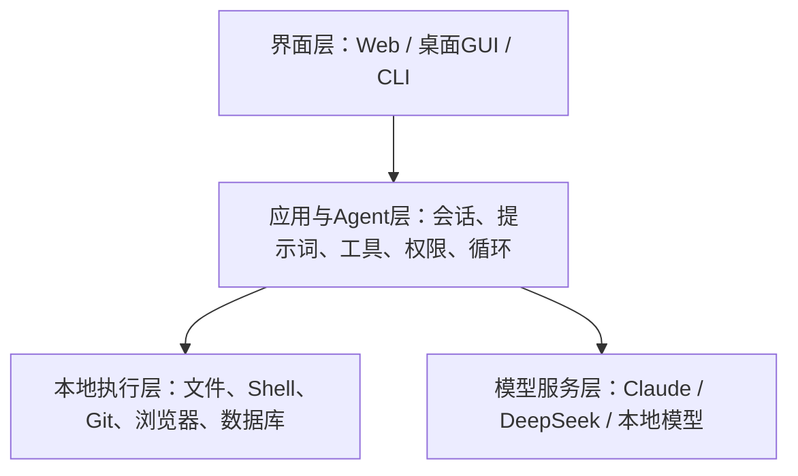
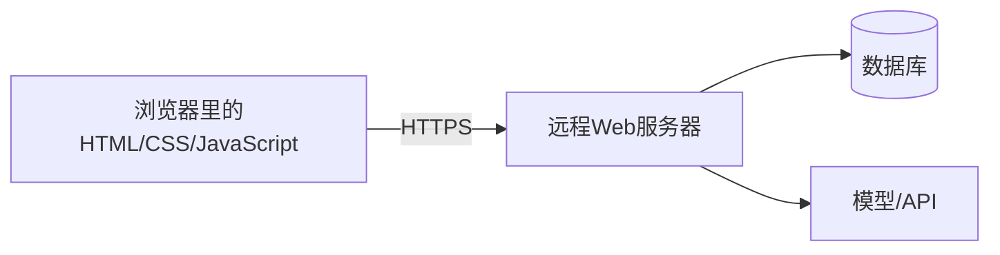
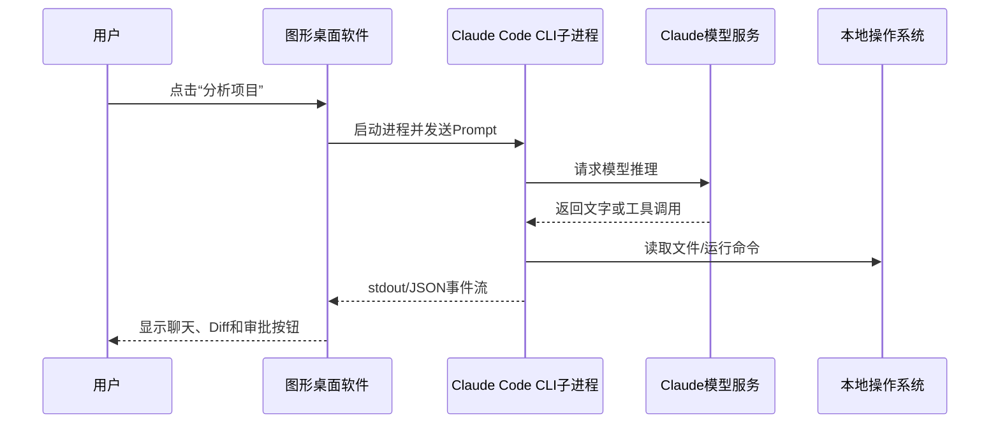

# Web端、桌面软件与CLI程序的区别

> [!summary] 一句话结论
> **Web 端、桌面软件和 CLI 首先是三种不同的交互与承载方式，不代表背后一定使用不同模型或业务能力；一个图形软件可以启动 Claude Code CLI 作为子进程，也可以绕过 CLI 直接调用 API/SDK，两种“包装”在稳定性、权限和控制力上差别很大。**

## 一、先分清四个层次

讨论“Web 端和软件有没有本质区别”时，最容易犯的错误是把界面、程序、Agent 和模型混成一个东西。



### 1. 界面层

决定用户怎样操作：

- 点击按钮；
- 输入聊天消息；
- 在终端敲命令；
- 查看文件 Diff、进度和权限弹窗。

### 2. 应用或 Agent 层

决定：

- System Prompt 是什么；
- 保存多少历史；
- 有哪些工具；
- 是否循环执行；
- 怎样审批危险操作；
- 失败后是否重试；
- 怎样记录状态和审计。

### 3. 本地执行层

真正读取文件、启动进程、运行 Git、执行测试或操作浏览器。

### 4. 模型服务层

负责根据上下文推理并生成下一步或回答。模型可能在云端，也可能在本地 GPU。

> 同一个 Claude 模型，装上不同的 System Prompt、工具、权限和 Agent Loop，表现出来就可能像不同产品。

## 二、Web 端是什么

Web Application（Web 应用，网页应用）通常由浏览器打开。

常见结构是：



### Web 端的特点

- 通常无需安装，打开网址即可使用；
- 更新主要发生在服务器，刷新页面就能获得新版；
- 天然适合跨 Windows、macOS、Linux 和移动设备；
- 数据和会话通常更多保存在远程服务器；
- 浏览器沙箱限制了直接访问任意本地文件、Shell 和系统设置；
- 可以通过文件上传、浏览器权限、扩展或本地辅助程序获得部分本机能力。

### Web 端不一定在公网

网页只是界面形式。企业可以把 Web 服务部署到内网，用户通过浏览器访问内部地址。因此：

```text
Web端 ≠ 一定是公网云服务
```

详见 [[内网、公网与私有化服务器部署]]。

## 三、桌面软件是什么

Desktop Application（桌面应用）是安装或直接运行在操作系统中的应用程序。

它可以用多种技术实现：

- C++、C#、Java、Swift 等原生界面；
- [[Electron桌面应用架构|Electron]]：Chromium + Node.js；
- [[Tauri跨平台桌面应用架构|Tauri]]：系统 WebView + Rust Core；
- Python + Qt 等框架。

### 桌面软件通常更容易获得的能力

- 访问用户授权的本地文件；
- 启动子进程和 CLI；
- 使用系统托盘、通知、快捷键和剪贴板；
- 调用摄像头、麦克风和 USB；
- 管理本地数据库与缓存；
- 在后台运行任务；
- 与 Git、编译器、编辑器等工具集成。

但桌面软件也不一定是“本地服务”。很多桌面客户端只是把界面装到了电脑上，账号、数据和模型仍在云端。

```text
桌面软件 ≠ 本地模型
安装在电脑上 ≠ 数据不出电脑
```

## 四、CLI 是什么

CLI（Command-Line Interface，命令行界面，通常逐字母读作“C-L-I”，即“西—艾勒—艾”）是通过文字命令与程序交互的方式。

例如：

```powershell
git status
node app.js
claude
```

终端负责显示文字和接收键盘输入，Shell 负责解析命令，`git`、`node`、`claude` 等通常是被 Shell 启动的独立程序。详见 [[CMD、Bash与PowerShell]]。

### CLI 的特点

- 便于脚本化、批处理和远程 SSH 操作；
- 输入输出常可通过 stdin/stdout 和管道连接；
- 更容易组合 Git、编译器、测试器等开发工具；
- 界面不直观，需要记命令和参数；
- 交互式终端可能需要 PTY，光标、颜色和快捷键处理比较复杂；
- CLI 在本机运行，不代表它背后的 AI 模型也在本机。

## 五、Claude Web 和 Claude Code CLI 为什么感觉不同

即使两者使用同一个 Claude 模型，外围系统也可能不同。

| 维度 | Web 聊天产品 | Claude Code CLI 类编码 Agent |
|---|---|---|
| 主要界面 | 浏览器聊天页面 | 终端 |
| 工作对象 | 对话、上传内容、在线功能 | 当前代码目录、Git、Shell、测试 |
| 文件访问 | 浏览器上传或产品连接器 | 在授权范围内直接读取本地工作区 |
| 工具 | 由 Web 产品提供 | 文件、Shell、Git、MCP 等开发工具 |
| 权限确认 | 产品内控制 | CLI 权限规则和终端确认 |
| 会话与上下文 | Web 产品管理 | CLI 按目录、会话和本地配置管理 |
| 模型位置 | 通常云端 | CLI 本地运行，但 Claude 推理通常仍是云端 |

官方 Claude Code 安装文档明确说明需要互联网进行认证和 AI 处理。也就是说：

```text
Claude Code程序：运行在你的电脑上
文件和命令工具：运行在你的电脑上
Claude模型推理：默认通过外部模型服务完成
```

它和 [[大模型从数据、Token到训练与本地部署|真正本地运行模型权重]]不是同一件事。

## 六、别人怎样把 CLI “包装成软件”

最常见的是桌面 GUI 启动 CLI 子进程：



桌面软件可能做这些事：

1. 使用 `spawn` 等系统 API 启动 `claude` 可执行程序；
2. 设置 Working Directory（工作目录）；
3. 通过 stdin 发送问题；
4. 读取 stdout/stderr；
5. 解析 JSON 或 Stream JSON 事件；
6. 把终端文字变成聊天气泡、文件 Diff 和进度条；
7. 把取消按钮转换成中断子进程；
8. 保存会话 ID，并在下次恢复。

Claude Code 官方 CLI 提供非交互 `-p` 模式，以及 `text`、`json`、`stream-json` 输出格式。这类机器可读接口比“读取彩色终端文字并猜含义”更适合程序包装。

## 七、包装 CLI 与直接调用 API/SDK 有什么区别

### 路线 A：调用 CLI 子进程

```text
图形界面 → CLI进程 → Claude API/工具
```

优点：

- 可以快速复用 CLI 已有的 Agent Loop、工具和配置；
- 用户熟悉的 CLI 能力可能原样保留；
- 开发者不必重新实现所有文件编辑和 Shell 工具。

缺点：

- 多一层进程和版本兼容问题；
- CLI 输出格式变化可能破坏包装器；
- 交互式权限提示和 PTY 不容易处理；
- CLI 更新后参数、行为和配置可能变化；
- 并发、多窗口、取消和崩溃恢复更复杂；
- 包装器未必能精确控制 CLI 内部每一步。

### 路线 B：直接调用模型 API

```text
图形界面/后端 → Messages API → Claude模型
```

开发者自己实现：

- System Prompt；
- 会话状态；
- 工具调用循环；
- 文件读写；
- 权限确认；
- 重试、取消和审计。

优点是控制更细、协议更稳定、产品可深度定制；缺点是 Agent 工程量很大，安全责任也更多。

### 路线 C：使用 Agent SDK

```text
图形界面 → Agent SDK → 现成Agent循环与工具 → Claude模型
```

SDK（Software Development Kit，软件开发工具包）让程序直接调用结构化接口，同时复用一部分 Agent Loop、工具和会话能力。它通常比启动 CLI 更适合正式产品集成，但仍要遵守对应 SDK、API 和许可证规则。

## 八、包装以后“能力一样吗”

### 可能基本一样

如果包装器只是：

- 启动相同版本 CLI；
- 使用相同账号和模型；
- 使用相同工作目录；
- 保留相同 Prompt、配置、工具和权限；
- 原样展示 CLI 事件；

那么核心 Agent 能力可能非常接近，主要区别是操作体验。

### 也可能差别很大

包装器可以改变：

- System Prompt；
- 模型和推理强度；
- 上下文裁剪方式；
- 可用工具和 MCP 服务；
- 自动批准规则；
- 最大 Agent 回合数；
- 是否允许多 Agent；
- 文件范围和沙箱；
- 记忆、RAG、重试与错误处理。

所以“底层用了 Claude CLI”不能证明两个产品行为完全一样。

可以用这个类比：

> 模型像发动机，CLI/Agent Harness 像整车控制系统，Web 或桌面 GUI 像方向盘、仪表盘和车身。发动机相同，不代表整辆车的权限、安全和体验相同。

## 九、包装 CLI 真正增加了什么价值

好的包装器可能增加：

- 对初学者友好的按钮和表单；
- 文件选择器和项目管理；
- 实时 Token、费用和进度显示；
- 可视化 Git Diff 与一键接受/撤销；
- 权限中心和危险命令确认；
- 多任务队列、通知和后台运行；
- 会话搜索和工作区切换；
- 自动安装、更新和环境诊断；
- 企业登录、审计和策略下发。

差的包装器可能只把终端隐藏起来，再套一个聊天框，却额外获得了读取 Prompt、文件和凭证的机会。

判断价值不能只看界面更漂亮，而要看它是否真正改善了工作流、安全边界和可靠性。

## 十、包装器会带来哪些风险

### 1. 权限继承

CLI 子进程通常继承桌面软件当前账号的权限和环境变量。包装成 GUI 不会自动产生沙箱。

### 2. 隐藏危险操作

终端中本来清楚显示的命令，可能被 GUI 折叠或隐藏。如果包装器自动跳过权限确认，风险会显著增加。

Claude Code CLI 存在控制允许/禁止工具和权限模式的参数，也有明确标为危险的跳过权限选项。包装器不应悄悄启用高风险模式。

### 3. 凭证风险

第三方包装器可能读取：

- Claude 登录凭证或 API Key；
- 环境变量；
- SSH Key；
- Git 凭证；
- 项目源码和配置文件。

不要因为它“只是一个皮肤”就降低警惕。

### 4. 参数与日志泄露

敏感 Prompt 不宜直接放进容易被系统进程列表或日志记录的命令行参数。更合适的方式通常是受控 stdin 或结构化 IPC，并对日志脱敏。

### 5. 供应链风险

要确认包装器来源、代码签名、自动更新、依赖和安装包是否可信。它可能比官方 CLI 多出一整条新的供应链。

### 6. 版本兼容

CLI 自动升级后，输出字段或行为变化可能让包装器解析失败。正式产品需要固定兼容范围、健康检查和升级回归测试。

### 7. 许可证和商标

“调用用户已安装的 CLI”“随软件重新分发 CLI 二进制”“宣称自己是官方 Claude 客户端”是不同事情，需要分别核对许可证、服务条款和商标规则。

## 十一、速度和成本会不会不同

纯界面包装的额外开销通常不大，AI 请求的主要延迟仍可能来自：

- 云端模型推理；
- 上下文长度；
- 工具执行；
- 网络传输；
- 多轮 Agent Loop。

但是包装器改变以下策略后，成本可以明显变化：

- 自动附加更多文件；
- 保存和发送更长历史；
- 自动重试；
- 并行启动多个 Agent；
- 使用更贵的模型；
- 增加验证回合和工具调用。

因此界面看起来相同，不代表 Token、费用和执行次数相同。

## 十二、Web、桌面和 CLI 怎么选择

| 需求 | 更常见选择 |
|---|---|
| 无需安装、快速登录、跨设备 | Web |
| 深度访问本地文件和系统能力 | 桌面软件 |
| 自动化、批处理、SSH、脚本组合 | CLI |
| 给非技术用户使用本地 CLI 能力 | 桌面 GUI 包装 CLI/SDK |
| 正式定制 Agent 产品 | API 或 Agent SDK，必要时复用 CLI |
| 完全内网、模型不出网 | 本地应用 + 本地模型权重，界面形式不是关键 |

一种产品也可以同时提供三种入口，并共享同一个后端和账号系统。

## 十三、怎样判断一个“Claude CLI 包装软件”

安装前最好回答：

- [ ] 它是启动官方 CLI，还是直接调用 Claude API？
- [ ] CLI 是要求用户自己安装，还是被重新打包分发？
- [ ] 使用哪个账号、API Key 和计费主体？
- [ ] Prompt、源码和工具结果会发给谁？
- [ ] 它能访问哪些目录、命令和环境变量？
- [ ] 是否保留官方权限确认，能否查看实际执行命令？
- [ ] 是否启用了跳过权限或自动批准？
- [ ] 会话和日志保存在本地还是包装器服务器？
- [ ] 包装器自己的后端是否还能看到内容？
- [ ] CLI/SDK 版本怎样固定、更新和回滚？
- [ ] 安装包是否签名，源码和隐私政策是否可信？
- [ ] 出错后能否取消、恢复并审计？

## 十四、不同端之间迁移前要做什么准备

### 1. 先确定到底在迁移什么

“把 Web 端转成桌面端”可能表示完全不同的事情：

- 只想给网页套一个桌面窗口；
- 想复用 React 页面，但增加本地文件和 Shell 能力；
- 想把云端后端也搬到用户电脑；
- 想把 CLI 的能力做成 GUI；
- 想让 Web、桌面和 CLI 共用同一套业务核心。

目标不同，迁移方案和数据边界也完全不同。开始写代码前先画出：

```text
哪些代码留在原处
哪些代码进入新端
模型和后端在哪里
数据经过哪些网络
新端获得哪些系统权限
```

### 2. 盘点哪些代码可以复用

| 代码类型 | 跨端复用程度 | 原因 |
|---|---:|---|
| 纯算法、数据转换、校验规则 | 高 | 不依赖界面和操作系统 |
| TypeScript 类型、协议和 API Client | 高 | 可作为各端共同契约 |
| React/Vue 页面 | Web → Electron/Tauri 较高 | 桌面端仍可使用 WebView/Chromium |
| HTML/CSS | WebView 桌面端较高，原生 GUI 较低 | 原生控件体系不同 |
| Node.js `fs`、`child_process` | 桌面/CLI 可用，浏览器不能直接用 | 浏览器沙箱禁止任意文件和进程访问 |
| CLI 参数解析、ANSI 颜色和终端光标 | GUI 复用较低 | 这是终端表现层，不是业务核心 |
| 数据库表结构和业务 API | 较高 | 但连接方式、身份和部署位置可能变化 |
| localStorage、注册表、钥匙串代码 | 低到中 | 各平台存储和安全机制不同 |
| 安装、更新、签名代码 | 低 | 每个操作系统和发布渠道不同 |

“能复制”不等于“应该复制”。如果一段代码同时包含业务判断、终端输出、文件读写和网络请求，直接复制到新端通常会越来越难维护。

### 3. 把核心逻辑与端代码分离

比较理想的结构是：

```text
shared-core/
  业务规则、数据类型、状态机、错误类型

adapters/
  web/       浏览器、HTTP、localStorage
  desktop/   文件、IPC、系统通知、Secure Storage
  cli/       参数、stdin/stdout、退出码

apps/
  web-app/
  desktop-app/
  cli-app/
```

三个端都调用 `shared-core`，只有与平台相关的部分分别实现。

可以把它类比成：

- 核心逻辑是同一台发动机；
- Web、桌面和 CLI 是不同方向盘、仪表盘和车门；
- Adapter（适配器）负责把不同操作方式翻译成发动机能理解的命令。

### 4. 先定义稳定的输入输出契约

不要让 GUI 依赖“终端第 17 行出现绿色文字”。应提前定义结构化协议，例如：

```json
{"type":"task.started","taskId":"123"}
{"type":"tool.approval_required","tool":"bash","command":"npm test"}
{"type":"file.changed","path":"src/app.ts"}
{"type":"task.completed","result":"..."}
```

还要规定：

- 请求和响应字段；
- 事件顺序；
- 错误码；
- 协议版本；
- 进度、日志和最终结果怎样区分；
- 取消后会发生什么；
- 旧客户端遇到新字段怎样处理。

CLI 可使用 JSON/NDJSON/Stream JSON，桌面进程之间可使用受控 IPC，前后端可使用 HTTP、SSE 或 WebSocket。选择哪一种取决于是否需要流式、双向通信和跨机器访问。

### 5. 重新设计权限边界

Web 代码通常处于浏览器沙箱中；把它迁移到桌面主进程后，可能突然获得文件、Shell 和系统凭证权限。这不是简单增加几个 API，而是改变了安全边界。

桌面端建议分层：

```text
Renderer：显示界面，低权限
  ↓ 只允许白名单IPC
Main/Rust Core：验证参数并执行本机能力
  ↓
文件系统、CLI、系统API
```

迁移前要明确：

- 允许访问哪些目录；
- 哪些命令必须确认；
- 子进程继承哪些环境变量；
- 是否允许联网；
- 哪些 API Key 只能放在后端或系统安全存储；
- 日志中哪些字段必须脱敏；
- Renderer 被恶意内容控制后，最多能做什么。

### 6. 重新设计身份认证

不同端常使用不同登录方式：

| 端 | 常见方式 | 需要注意 |
|---|---|---|
| Web | Cookie、Session、OAuth Redirect | CSRF、Cookie 属性、浏览器同源策略 |
| 桌面 | 系统浏览器 OAuth、Deep Link、PKCE | 回调劫持、Token 安全存储 |
| CLI | Device Code、浏览器 OAuth、环境变量/API Key | 共享服务器、Shell History、凭证文件权限 |

不能把后端 Secret 或厂商 API Key直接编译进 Web JavaScript 或桌面安装包，因为用户可以提取它们。客户端应持有用户凭证或短期令牌，真正的服务密钥放在受控后端。

### 7. 设计数据与状态迁移

先列出旧端保存了什么：

- 用户设置；
- 会话历史；
- 本地数据库；
- 工作区路径；
- 缓存；
- 登录 Token；
- 插件和 MCP 配置；
- 未完成任务与恢复点。

然后决定新端放在哪里：

```text
Web localStorage/IndexedDB
桌面SQLite/配置文件/系统钥匙串
CLI配置目录/环境变量
服务器数据库/对象存储
```

需要准备 Schema Version（数据结构版本）、迁移脚本、备份、失败回滚和旧版本兼容。不要让新程序第一次启动就直接改写唯一一份用户数据而没有备份。

### 8. 处理文件和路径差异

浏览器一般只获得用户明确选择的文件内容，不能随意读取 `D:\project`。桌面和 CLI 则使用真实路径。

跨 Windows、macOS、Linux 还要处理：

- `\` 与 `/` 路径分隔符；
- 盘符和 UNC 网络路径；
- 大小写敏感；
- 文件权限；
- 换行符 CRLF/LF；
- UTF-8 和控制台编码；
- 符号链接；
- 路径中空格和引号；
- 文件被其他程序占用。

业务核心尽量接收抽象的文件接口，不要到处拼接操作系统路径字符串。

### 9. 处理进程和终端差异

把 CLI 搬进 GUI 时要考虑：

- CLI 是否需要真实 PTY；
- 怎样区分 stdout 和 stderr；
- 怎样发送 stdin；
- 怎样处理中断信号；
- 主程序退出时怎样清理子进程；
- 多个任务能否并发；
- 子进程崩溃后是否重启；
- 工作目录和 `PATH` 是否正确；
- Windows、Bash 和 PowerShell 命令是否不同；
- 输出太多时怎样背压，避免内存无限增长。

这些问题属于 [[Sidecar边车程序与辅助进程]] 和 [[进程、线程、多进程与多线程]] 的范围。

### 10. 处理网络差异

Web 迁移到桌面后，网络请求可能遇到不同问题：

- 浏览器 CORS 和同源策略；
- 桌面端代理是否跟随系统代理；
- 企业 TLS 证书与证书代理；
- 内网 DNS、VPN 和离线模式；
- API 地址怎样区分开发、测试、生产；
- 本地服务监听 `127.0.0.1` 还是 `0.0.0.0`；
- 本地端口如何鉴权，避免被网页攻击；
- 请求取消、超时、重试和幂等。

桌面端不受普通浏览器 CORS 限制，不代表可以放弃来源验证和服务端授权。

### 11. 准备构建和发布体系

Web 通常发布服务器资源；桌面软件和 CLI 还需要：

- Windows/macOS/Linux 构建产物；
- CPU 架构区分，例如 x64、ARM64；
- 依赖和外部 CLI 的版本锁定；
- Windows Authenticode、macOS 签名与公证；
- 安装、卸载和升级；
- 自动更新签名；
- 版本兼容矩阵；
- SBOM 和依赖漏洞检查；
- 灰度发布与回滚。

如果把第三方 CLI 一起放入安装包，还必须确认能否重新分发，以及许可证、商标和更新责任。

### 12. 建立跨端测试矩阵

至少测试：

- 核心业务单元测试；
- Web/桌面/CLI 各适配器测试；
- IPC、API 或 JSON 协议兼容测试；
- Windows/macOS/Linux 路径和权限；
- 登录、Token 过期和退出登录；
- 子进程取消、崩溃与超时；
- 网络断开、代理和内网证书；
- 数据升级、降级和恢复；
- 安装包、代码签名和自动更新；
- 危险命令是否确实要求确认。

只验证“主页面能打开”，不能证明迁移完成。

### 13. 三种常见迁移策略

#### 策略 A：快速包装

```text
新GUI → 启动原CLI → 解析结构化输出
```

适合快速验证产品需求，改动少；但长期会受 CLI 版本、进程和权限模型限制。

#### 策略 B：抽取共享核心

```text
CLI ─┐
GUI ─┼→ Shared Core/Agent Runtime
Web ─┘
```

适合长期维护。CLI 和 GUI 都只是 Adapter，但前期需要重构原代码。

#### 策略 C：把核心做成服务

```text
Web / 桌面 / CLI → 统一后端API → 核心能力
```

适合多端、团队和统一数据；但引入服务器、网络、账号、成本和数据出境问题。本机文件操作仍可能需要桌面辅助进程。

### 14. 包装 Claude Code CLI 的最低准备清单

如果目标是把 Claude Code CLI 做成桌面 GUI，至少需要：

- [ ] 明确使用官方 CLI 子进程，还是 Claude API/Agent SDK；
- [ ] 检测 CLI 是否安装，并检查兼容版本；
- [ ] 优先使用官方 JSON/Stream JSON，而不是解析 ANSI 终端画面；
- [ ] 为每个任务指定明确工作目录；
- [ ] 安全处理登录凭证和环境变量；
- [ ] 显示工具调用、真实命令和文件修改；
- [ ] 保留权限确认，不暗中跳过权限；
- [ ] 支持取消、超时和子进程清理；
- [ ] 分开 stdout、stderr、事件和最终结果；
- [ ] 处理 CLI 自动更新与包装器版本兼容；
- [ ] 明确会话、源码和日志是否经过包装器服务器；
- [ ] 核对 CLI 二进制重新分发与品牌使用条件；
- [ ] 在真实项目副本中做破坏性、断网和恢复测试。

## 十五、常见误区

> [!warning] 常见误区
> - **CLI 在本机运行，所以模型也在本机**：不对，Claude Code 默认仍需要联网进行 AI 推理。
> - **桌面软件一定比 Web 更本地、更隐私**：不对，桌面客户端也可能把全部内容发到云端。
> - **Web 端一定部署在公网**：不对，企业 Web 应用也可以只在内网访问。
> - **包装 CLI 只是换皮，没有任何技术工作**：不一定；可靠的进程、权限、取消、会话和更新管理并不简单。
> - **包装成 GUI 就更安全**：不对，GUI 可能隐藏命令并扩大凭证和文件访问范围。
> - **同一个模型就会得到相同结果**：不对，Prompt、历史、工具、权限和 Agent Loop 都会改变行为。
> - **使用 CLI 就不能做自动化**：不对，机器可读 JSON、stdin/stdout 和非交互模式正适合脚本与包装。
> - **API、SDK、CLI 是三个完全不同的模型**：不对，它们可以只是访问同一服务的不同开发接口。

## 十六、记忆口诀

```text
Web、桌面、CLI：用户怎样操作
本地进程、云端服务：代码在哪里运行
模型：谁负责推理
Agent Harness：怎样给模型工具、权限和循环
CLI包装：外层GUI管理内层子进程
API/SDK集成：应用直接调用结构化能力
端迁移：共享核心，分别适配界面、系统和权限
```

## 关联概念

- [[CMD、Bash与PowerShell]]：终端、Shell 和 CLI 程序之间的关系。
- [[进程、线程、多进程与多线程]]：图形主程序为什么可以启动独立 CLI 子进程。
- [[Sidecar边车程序与辅助进程]]：把 CLI 作为桌面应用配套进程时的生命周期和 IPC。
- [[SDK与API]]：直接调用 SDK/API 与启动 CLI 的区别。
- [[Electron桌面应用架构]]：用 Web 技术构建桌面 GUI，并通过主进程启动受控能力。
- [[Tauri跨平台桌面应用架构]]：WebView 界面、Rust Core 与外部二进制的边界。
- [[../02-Web前端与界面/WebView]]：桌面软件里嵌入网页渲染界面。
- [[Agent工具运行时：执行流水线、并发调度与Code Mode]]：模型、工具、审批和执行循环怎样组成 Agent。
- [[大模型从数据、Token到训练与本地部署]]：本地 CLI、本地应用与真正本地模型的区别。
- [[内网、公网与私有化服务器部署]]：界面形式和数据部署位置为什么是两条独立判断轴。
- [[软件供应链：代码签名、SBOM与发布门禁]]：第三方包装器和内置 CLI 的分发安全。

## 参考资料

以下内容于 2026-09-04 核对。Claude Code、Claude API 和 SDK 的参数与产品形态可能变化，应以当前官方文档为准。

- [Anthropic：Claude Code 安装与运行要求](https://docs.anthropic.com/en/docs/claude-code/getting-started)
- [Anthropic：Claude Code CLI Reference](https://docs.anthropic.com/en/docs/claude-code/cli-usage)
- [Claude Platform：CLI、SDK 与 Libraries](https://platform.claude.com/docs/en/cli-sdks-libraries/overview)
- [Claude Platform：API Overview](https://platform.claude.com/docs/en/api/overview)
- [Electron：Process Model](https://www.electronjs.org/docs/latest/tutorial/process-model)
- [Tauri：Embedding External Binaries](https://v2.tauri.app/develop/sidecar/)
