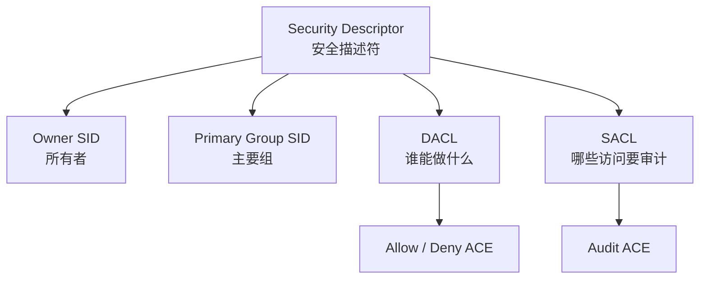
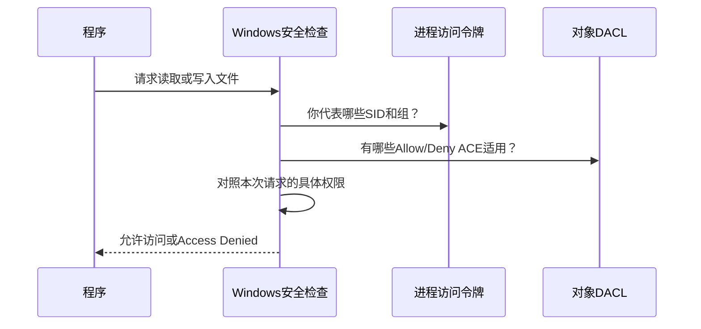

# Windows ACL 与 NTFS 权限

> [!summary] 一句话结论
> **Windows ACL 是附在文件、文件夹、注册表项等受保护对象上的“权限清单”，它用一条条规则记录哪个用户或用户组，可以或不可以对这个对象执行读取、写入、删除等操作。**

ACL 的英文全称是 **Access Control List**，中文叫**访问控制列表**，通常读作“A-C-L”。

最重要的关系是：

```text
ACL（整张权限清单）
└── ACE（清单中的一条权限规则）
    ├── SID：这条规则管谁
    ├── Allow / Deny / Audit：允许、拒绝还是审计
    ├── Rights：允许或拒绝什么操作
    └── Inheritance：是否传给子文件和子文件夹
```

---

## 先用生活类比理解

把一个文件夹想成公司的档案室：

- 文件夹是档案室；
- 用户和用户组是员工或部门；
- ACL 是门口的完整访客规则表；
- ACE 是规则表中的一行；
- SID 是员工或部门不会重复的内部编号；
- 读取、写入、删除是不同操作权限；
- DACL 决定放不放人；
- SACL 决定哪些进出行为需要记入审计日志；
- Owner 是有权调整权限安排的对象所有者。

例如：

| 主体 | 规则 | 权限 |
|---|---|---|
| Alice | Allow | 读取、写入 |
| 财务组 | Allow | 读取 |
| 临时访客组 | Deny | 删除 |

Alice 同时属于“财务组”并不冲突：她可以从不同身份得到权限。Windows 会综合她本人和所有所属组的适用规则，计算最终结果。

---

## 一、Windows 为什么需要 ACL

一台电脑可能同时运行许多用户和程序。如果没有访问控制：

- 普通用户可以修改系统文件；
- 一个程序可以随意读取另一个用户的私人文件；
- 恶意软件可以篡改服务、注册表和配置；
- 公司无法区分谁能读取、修改或审计敏感资料。

Windows 因此把很多资源设计成 **Securable Object（可保护对象）**。常见对象包括：

- NTFS 文件和文件夹；
- 注册表项；
- Windows 服务；
- 进程和线程；
- 打印机；
- 命名管道、共享内存等系统对象；
- Active Directory 对象；
- 某些设备和网络共享资源。

不同对象支持的具体权限不完全相同。例如文件有读取、写入、执行，服务则有启动、停止、修改配置等权限。

---

## 二、Security Descriptor：对象的安全说明书

Windows 不只是给对象存一张 ACL，而是保存一个更完整的 **Security Descriptor（安全描述符）**。

安全描述符通常包括：



### Owner：所有者

对象通常有一个所有者。所有者与“当前谁可以读取文件”不是同一个概念。

所有者通常有能力调整对象的 DACL，或者授权其他人调整，但这不等于所有者在当前 DACL 下天然拥有每一种文件访问权限。

### Primary Group：主要组

这是安全描述符中的一个组成部分。在现代 Windows 文件权限日常管理中，它通常没有 DACL 那么常见；它更多与兼容性及特定系统场景有关。

### DACL：决定允许和拒绝

**DACL（Discretionary Access Control List，自主访问控制列表）**记录哪些用户或组被允许或拒绝执行哪些操作。

我们平时在文件属性的“安全”选项卡里看到的权限，主要就是 DACL。

### SACL：决定审计什么

**SACL（System Access Control List，系统访问控制列表）**不是用来直接允许或拒绝访问，而是规定哪些访问尝试要生成审计记录，例如：

- Alice 成功读取文件时记录；
- 临时访客删除失败时记录；
- 管理员修改对象权限时记录。

要真正看到相应安全日志，通常还需要系统审计策略已启用。

> [!important] DACL 与 SACL 的核心区别
> **DACL 管“能不能做”，SACL 管“做了或尝试做时要不要记日志”。**

---

## 三、ACE：ACL 中的一条规则

**ACE（Access Control Entry，访问控制项）**就是 ACL 中的一条具体记录。

一条 ACE 通常要回答四个问题：

1. 规则适用于谁？
2. 是允许、拒绝还是审计？
3. 涉及哪些权限？
4. 是否传给子对象？

可以把它想成：

```text
Allow  财务组  读取和写入  传给子文件
Deny   访客组  删除        传给子文件与子文件夹
```

Windows 内部不会只依赖容易变化或重复的用户名，而主要使用 SID 识别主体。

---

## 四、SID：Windows 如何准确识别“谁”

**SID（Security Identifier，安全标识符）**是 Windows 给用户、用户组和某些系统身份分配的唯一标识。

形式可能类似：

```text
S-1-5-21-123456789-234567890-345678901-1001
```

用户名更像通讯录里的显示名称，SID 更像不会轻易重复的身份证号。

这也解释了一个常见现象：删除旧账号后，即使新建一个同名账号，新账号也不一定自动获得旧账号的文件权限，因为两者的 SID 不同。

当 Windows 无法再把 SID 解析成现有账号时，权限界面可能直接显示一串 `S-1-5-...`，通常表示：

- 原用户已经删除；
- 来自已不可用的域；
- 账号信息暂时无法查询；
- 对象从另一台 Windows 系统迁移而来。

---

## 五、Windows 怎样判断一次访问能不能通过

当你登录 Windows 后，系统会为进程建立 **Access Token（访问令牌）**。它大致包含：

- 当前用户的 SID；
- 用户所属组的 SID；
- 已启用或禁用的系统特权；
- 完整性级别；
- 与 UAC 有关的令牌状态等。

程序尝试打开文件时，过程可以简化为：



注意，Windows 检查的是**运行这个操作的进程所持有的令牌**，不只是看“电脑主人是谁”。

所以同一个账号运行的两个程序，也可能因为：

- 一个普通启动，一个“以管理员身份运行”；
- 一个处于沙箱或 AppContainer；
- 一个服务使用了不同服务账号；
- 两者完整性级别不同；

而得到不同的访问结果。

---

## 六、文件和文件夹常见权限

在 NTFS 文件系统中，常见基础权限包括：

| 权限 | 大致含义 |
|---|---|
| Full control（完全控制） | 读、写、执行、删除，还能修改权限和取得所有权等 |
| Modify（修改） | 读取、写入、执行和删除，一般不含完整的权限管理能力 |
| Read & execute（读取和执行） | 查看内容并运行程序 |
| List folder contents（列出文件夹内容） | 查看文件夹中有哪些项目 |
| Read（读取） | 读取内容和基本属性 |
| Write（写入） | 创建或修改内容及部分属性 |

“高级安全设置”里还能看到更细的权限，例如：

- 创建文件；
- 创建文件夹；
- 追加数据；
- 删除子文件和子文件夹；
- 读取属性；
- 读取权限；
- 更改权限；
- 取得所有权。

### 文件夹的“删除子项”和文件本身的“删除”

删除操作可能受到多个权限共同影响。某人即使没有文件自身的 Delete 权限，也可能因为父文件夹拥有“删除子文件和子文件夹”权限而能删除它。

这就是为什么 Windows 权限不能永远只靠勾选框表面猜测；复杂场景应查看高级权限和有效访问。

---

## 七、权限继承是什么

**Inheritance（继承）**让子文件和子文件夹自动获得父文件夹的部分权限规则。

例如：

```text
D:\公司资料
└── 财务组：允许读取（可继承）
    ├── 2025年报表.xlsx  ← 继承财务组读取权限
    └── 2026年
        └── 预算.xlsx     ← 继续继承
```

继承的好处是不用为成千上万个文件逐个配置权限。

### 显式权限与继承权限

- **Explicit permission（显式权限）**：直接设置在当前对象上；
- **Inherited permission（继承权限）**：从父文件夹传下来。

在 Windows 高级安全界面中，通常能看到权限来自哪里。

### 禁用继承时会发生什么

Windows 通常会让你选择：

1. 把已经继承的规则转换成当前对象的显式规则；
2. 删除从父对象继承的规则。

第二种选择可能突然让用户或程序失去访问权限，因此修改前应先看清对象、父目录和当前所有规则。

---

## 八、Allow 和 Deny 怎样共同生效

Windows 会把用户本人以及所属用户组的适用 ACE 一起参与计算，并按照 DACL 中 ACE 的顺序检查本次请求的具体权限。

规范顺序通常会把 ACE 排成：

```text
显式 Deny
显式 Allow
继承 Deny
继承 Allow
```

初学时可以先记：

> **针对同一项操作，适用的 Deny 往往会阻止由其他组获得的 Allow，因此不要随意添加 Deny。**

但“Deny 永远压过一切”仍然过于简单，因为：

- ACE 有明确顺序；
- 一条 ACE 可能只针对读取，另一条针对写入；
- 规则可能只作用于当前文件夹、子文件或子文件夹；
- 有些权限由父目录或对象所有者相关权利影响；
- 访问请求可能一次要求多项具体权限。

实际排查应使用“高级安全设置 → 有效访问”，或用系统工具检查完整 ACL，而不是只数 Allow 和 Deny 的数量。

### 为什么更推荐少用 Deny

多数普通权限设计可以通过“不给 Allow”实现。显式 Deny 更适合必须覆盖其他组授权的特殊限制，但它会让继承和组成员关系更难理解。

---

## 九、管理员为什么也可能出现“拒绝访问”

“我是管理员”不等于“任何程序随时都能读写所有对象”。

可能原因包括：

1. 当前程序没有提升权限；
2. 对象 DACL 没有给当前访问令牌所需权限；
3. 存在适用的拒绝 ACE；
4. 文件属于另一个用户或特殊系统身份；
5. 对象所有者不是当前账号；
6. 文件正被另一个程序独占占用；
7. Windows Defender 的“受控文件夹访问”或其他安全软件阻止操作；
8. 应用运行在沙箱、AppContainer 或受限服务身份中；
9. 网络共享层还存在另一套权限；
10. 文件系统损坏、磁盘只读或资源本身不可用。

管理员经提升后通常拥有更多系统特权，例如在授权条件满足时取得所有权或调整 ACL，但这是一种管理能力，不表示原 ACL 从来不存在。

---

## 十、ACL、UAC 和“以管理员身份运行”有什么区别

### ACL

回答：

> 这个用户、组或进程身份，对这个对象有什么权限？

### UAC

**UAC（User Account Control，用户账户控制）**主要管理管理员权限何时提升使用。管理员账号日常运行程序时，通常不会让每个程序都自动使用完整管理员能力。

右键“以管理员身份运行”会让程序在用户同意后获得提升令牌。

### 二者关系

```text
UAC 决定程序当前拿什么级别的访问令牌
ACL 决定这个令牌对具体对象能做什么
```

提升权限可能让程序具备修改 ACL 或取得所有权所需的特权，但不应把“关闭 UAC”当作修复权限问题的正常方法。

---

## 十一、NTFS 权限和共享权限不是一回事

### NTFS 权限

保存在 NTFS 文件或文件夹的安全描述符中，本机访问和网络访问通常都会受到它影响。

### 共享权限

当文件夹通过 SMB 网络共享时，共享本身还可以设置另一层权限，例如读取、更改和完全控制。

网络访问通常要同时通过两层：

```text
SMB 共享权限
    ↓ 通过后
NTFS 文件权限
    ↓ 通过后
才能访问文件
```

例如：

- 共享权限允许“读取和更改”；
- NTFS 权限只允许“读取”；
- 最终通过网络访问时通常仍只能读取。

本机直接通过 `D:\资料` 访问时，不经过 SMB 共享权限，但仍要经过 NTFS 权限检查。

---

## 十二、ACL 和这些概念也不是一回事

| 概念 | 解决的问题 | 与 ACL 的区别 |
|---|---|---|
| 文件“只读”属性 | 提示某些程序不要修改文件 | 不是完整的用户级安全边界 |
| UAC | 管理管理员权限提升 | 不保存每个文件的 Allow/Deny 清单 |
| BitLocker | 加密整个卷，重点防设备丢失后的离线读取 | 系统解锁后仍由 ACL 管理用户访问 |
| EFS | 按证书加密特定文件 | 即使 ACL 放行，没有解密密钥仍未必能读明文 |
| 文件锁 | 协调正在使用的文件 | 可能导致访问失败，但不是 ACL 拒绝 |
| 防火墙 ACL/规则 | 控制网络流量 | 与 NTFS 文件 ACL 的对象和权限类型不同 |
| 应用内权限 | 决定用户能否查看页面、订单或文档 | 由应用自己实现，不等于 Windows 文件 ACL |

“ACL”是一个通用思想，Windows 文件权限、网络设备、云存储和应用系统里都可能出现 ACL，但规则对象和权限含义不同。

---

## 十三、你看到的 `deny-read ACLs` 是什么意思

如果工具报错类似：

```text
apply deny-read ACLs
```

可以理解为：

> 工具或沙箱准备启动某个进程时，为它应用了“禁止读取某些路径”的 Windows 访问控制规则，结果该进程读取目标文件或目录时被系统拒绝。

它通常不表示：

- 文件是空的；
- 文件被删除了；
- Git 仓库损坏了；
- 你的 Windows 账号永远没有权限。

更可能表示：**当前这个特定进程的安全边界不允许读取该路径**。同一个文件可能仍能被 Obsidian、VS Code 或获得授权的另一个进程正常读取。

在自动化工具和沙箱中，这种限制是为了减少程序误读私人文件或越过工作区范围。得到明确授权后，工具可能使用不同的受控权限路径完成任务。

---

## 十四、怎样在 Windows 图形界面查看 ACL

以 NTFS 文件或文件夹为例：

1. 右键对象；
2. 选择“属性”；
3. 打开“安全”选项卡；
4. 查看“组或用户名”；
5. 选择一个主体，查看基础权限；
6. 点击“高级”，查看所有者、继承来源和详细 ACE；
7. 使用“有效访问”检查指定用户最终可能拥有的权限。

> [!warning] 修改前先记录原状态
> 权限、所有者和继承修改错误，可能让程序停止运行或让自己失去访问。系统目录、应用数据目录和整个磁盘根目录尤其不要随意批量修改。

---

## 十五、怎样用命令查看 ACL

### PowerShell：Get-Acl

```powershell
Get-Acl -LiteralPath "D:\krxstudy" | Format-List
```

查看具体访问规则：

```powershell
(Get-Acl -LiteralPath "D:\krxstudy").Access
```

常见字段包括：

- `IdentityReference`：用户或组；
- `FileSystemRights`：具体权限；
- `AccessControlType`：Allow 或 Deny；
- `IsInherited`：是否继承；
- `InheritanceFlags`：怎样向下继承；
- `PropagationFlags`：继承传播方式。

### 命令提示符：icacls

```powershell
icacls "D:\krxstudy"
```

`icacls` 可以显示或修改文件和文件夹 DACL。Microsoft 官方也提供保存、恢复、验证、授予和删除规则等参数。

> [!danger] 不要照抄陌生的权限修改命令
> `icacls /grant`、`/deny`、`/reset`、`/inheritance`，以及 PowerShell 的 `Set-Acl` 都会改变真实权限。特别是递归参数可能影响大量文件。先理解目标、主体、继承和恢复方案，再做修改。

---

## 十六、几个常见例子

### 例 1：自己创建的文件却打不开

可能是文件从其他电脑复制、从备份恢复，或上级目录 ACL 发生变化。文件显示的用户名可能相同，但 SID 或继承关系不同。

### 例 2：程序能读取配置，却不能保存

读取和写入是不同权限。程序可能有 Read，但没有 Write、Modify，或者临时文件创建、重命名、删除权限不足。

### 例 3：文件能修改，却不能删除

写入文件内容和删除文件是不同的具体权限；删除还可能受到父文件夹权限影响。

### 例 4：本机能打开，共享访问却失败

本机只需要通过 NTFS 权限；网络访问还要通过 SMB 共享权限、网络身份认证和可能存在的防火墙规则。

### 例 5：以管理员身份运行后能用

说明普通令牌缺少某些权限或特权，但仍应查清应用为什么需要高权限。长期让普通程序以管理员身份运行会扩大安全风险。

---

## 十七、常见误区

### 误区 1：ACL 就是一条权限

错误。ACL 是整张列表；其中每一条记录叫 ACE。

### 误区 2：SACL 是“超级 ACL”

错误。SACL 主要控制审计记录，DACL 才主要控制允许和拒绝访问。

### 误区 3：用户名相同，权限身份就一定相同

错误。Windows 主要根据 SID 识别安全主体。

### 误区 4：管理员可以无条件绕过所有 ACL

错误。当前进程令牌、UAC、所有者、特权、DACL 和其他安全机制都会影响结果。

### 误区 5：看到 Access Denied 就一定是 ACL

错误。文件锁、安全软件、沙箱、应用规则、网络共享权限、只读介质等也可能导致类似错误。

### 误区 6：没有 DACL 和空 DACL 一样

错误，而且这是危险区别：Microsoft 文档说明，没有 DACL 的对象会向所有人授予完全访问；存在但没有任何 ACE 的空 DACL 则不授予任何访问。应用开发时不能把两者混淆。

### 误区 7：给 Everyone 完全控制最省事

短期可能让报错消失，却可能把敏感文件暴露给本机其他用户、服务或恶意程序。应按最小权限原则只授予真正需要的主体和操作。

---

## 十八、学习建议与排查顺序

遇到“拒绝访问”时，可以按以下顺序检查：

```text
1. 具体是哪个文件、文件夹或系统对象？
2. 哪个程序、服务或命令正在访问？
3. 它使用哪个用户身份和访问令牌？
4. 请求的是读取、写入、删除还是修改权限？
5. 对象的 Owner、DACL 和继承来自哪里？
6. 用户还属于哪些组，是否存在适用 Deny？
7. 是否还涉及 UAC、文件锁、安全软件或沙箱？
8. 如果是网络共享，SMB 共享权限是否也通过？
```

不要一开始就：

- 关闭 UAC；
- 给 Everyone 完全控制；
- 对整个磁盘递归重置权限；
- 强行取得所有系统文件的所有权；
- 关闭安全软件。

这些做法可能把一个小问题扩大成系统安全或软件运行故障。

---

## 十九、记忆口诀

> **ACL 是清单，ACE 是每一条；SID 认身份，DACL 管放行，SACL 管审计。**

再记住：

```text
最终能否访问
= 进程当前身份和令牌
+ 用户及用户组的适用权限
+ DACL中的Allow/Deny与继承
+ UAC、共享权限和其他安全边界
```

这里的加号表示“综合考虑”，不是简单把权限数量相加。

---

## 关联概念

- [[身份认证与授权：ACL、RBAC、MFA、OAuth、OIDC、SAML与SCIM]]：从更通用的身份认证和授权角度理解 ACL。
- [[CMD、Bash与PowerShell]]：使用 PowerShell、`Get-Acl` 和 `icacls` 查看 Windows 权限。
- [[防火墙与端口对外开放]]：防火墙也在做访问控制，但保护的是网络流量，不是 NTFS 文件。
- [[软件供应链：代码签名、SBOM与发布门禁]]：文件权限之外，怎样验证软件来源和制品完整性。
- [[Electron桌面应用架构]]：桌面应用进程权限、沙箱和系统资源访问边界。

## 参考资料

以下内容于 2026-08-22 核对：

- [Microsoft Learn：Access Control Lists](https://learn.microsoft.com/en-us/windows/win32/secauthz/access-control-lists)
- [Microsoft Learn：Security Descriptors](https://learn.microsoft.com/en-us/windows/win32/secauthz/security-descriptors)
- [Microsoft Learn：Access Control Entries](https://learn.microsoft.com/en-us/windows/win32/secauthz/access-control-entries)
- [Microsoft Learn：Security Principals](https://learn.microsoft.com/en-us/windows-server/identity/ad-ds/manage/understand-security-principals)
- [Microsoft Learn：icacls 命令](https://learn.microsoft.com/en-us/windows-server/administration/windows-commands/icacls)
