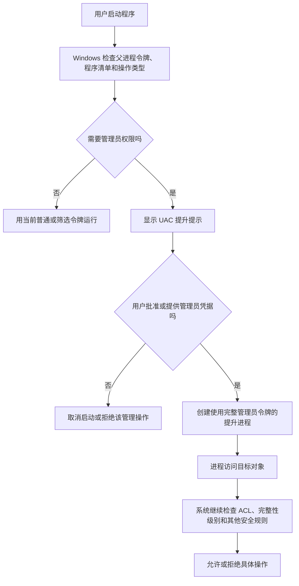

# Windows UAC 与管理员权限提升

## 一句话解释

> **UAC（User Account Control，用户账户控制）是 Windows 的管理员权限提升机制：程序平时先以较低权限运行，确实需要修改系统时，再由 Windows 弹窗让用户决定是否把这个程序提升为管理员权限。**

UAC 可以读作字母 **U-A-C**，中文通常叫“用户账户控制”。

它主要解决的问题不是“这个用户是不是管理员”，而是：

> **这个具体进程，现在是否应该使用管理员权限？**

---

## 一、先看生活类比：管理员有两张门禁卡

假设你是办公楼管理员，拥有两张门禁卡：

- **日常卡**：可以进入自己的工位、打开普通会议室；
- **管理卡**：可以进入机房、配电室，还能更改整栋楼的门禁设置。

为了安全，你不会把管理卡一直插在每一个办事人员身上。平时大家只使用日常卡；真的要进入机房时，保安会拦住并询问：

> “某个程序要进入系统管理区域，你是否确认？”

在这个类比里：

| 现实中的东西 | Windows 中的概念 |
|---|---|
| 你本人 | 用户账户 |
| 管理员身份 | Administrators 管理员组成员身份 |
| 门禁卡 | Access Token，访问令牌 |
| 日常卡 | 经过筛选的普通访问令牌 |
| 管理卡 | 完整管理员访问令牌 |
| 保安确认 | UAC 提权提示 |
| 机房门上的准入名单 | [[Windows ACL与NTFS权限|ACL 权限清单]] |

最关键的一点是：

> **管理员账户拥有管理卡，不等于它启动的每个程序都在使用管理卡。**

---

## 二、UAC 到底在防什么

如果管理员登录以后，所有程序都自动获得完整管理员权限，那么你打开的每一个程序，包括浏览器、聊天软件、下载器和来历不明的脚本，都可能直接：

- 修改 Windows 系统目录；
- 修改影响所有用户的注册表项；
- 安装系统服务或驱动；
- 改防火墙规则；
- 修改其他用户的文件；
- 关闭部分安全功能；
- 把恶意代码设置成开机启动。

UAC 的思路是**最小权限原则**：

> 一个程序只应该拿到完成当前工作真正需要的权限，并且只在真正需要时提升。

因此，即使你使用的是管理员账户，从桌面正常双击启动的大多数程序，也会先使用较受限的令牌运行。

UAC 可以降低两类风险：

1. **误操作**：普通软件意外修改整个系统；
2. **静默提权**：恶意程序在用户毫不知情时直接使用管理员能力。

但 UAC 不是杀毒软件，也不能保证“点了否就绝对不会中毒”。恶意程序即使没有管理员权限，仍可能读取或破坏当前用户有权访问的文件。

---

## 三、理解 UAC 前必须认识的五个概念

### 1. 用户账户

用户账户表示“谁登录了 Windows”。账户可以是：

- 本地账户；
- Microsoft 账户对应的本地身份；
- 公司域账户；
- 标准用户；
- 管理员组成员。

账户身份和进程当前使用的权限不是完全相同的概念。

### 2. 管理员组

Windows 中的 `Administrators` 是一个本地用户组。加入这个组，代表账户**有资格**取得许多系统管理权限。

但启用了 UAC 后，“有资格取得”不等于“所有程序自动取得”。

### 3. 进程

程序运行起来以后，操作系统会为它创建一个**进程**。例如：

- 打开一个普通 PowerShell，是一个进程；
- 再打开一个“管理员 PowerShell”，是另一个进程；
- 两个窗口看起来相似，但它们使用的访问令牌可能不同。

进程基础见 [[进程、线程、多进程与多线程]]。

### 4. Access Token：访问令牌

**Access Token（访问令牌）**不是网页 API 的 Token，而是 Windows 内核用来描述进程安全身份的数据结构。

它大致记录：

- 当前用户的 SID（Security Identifier，安全标识符）；
- 用户属于哪些组；
- 当前启用了哪些系统特权；
- 完整令牌还是筛选令牌；
- 是否已经提升；
- 完整性级别；
- 其他安全限制。

当进程访问文件、注册表、服务或其他受保护对象时，Windows 会结合这个令牌和对象的 ACL 做授权判断。

### 5. Elevation：权限提升

**Elevation** 可读作“艾勒维申”，在这里表示**从普通或筛选后的权限上下文，切换到更高权限上下文**。

Windows 中常说的：

- 提权；
- 提升运行；
- 管理员方式运行；
- elevated process；

通常都与此有关。

---

## 四、管理员登录后为什么仍然会弹 UAC

### 1. 管理员常见的“双令牌”

管理员组成员登录时，在默认的 **Admin Approval Mode（管理员批准模式）**下，Windows 会为其准备两种相关令牌：

- **筛选后的标准令牌**：移除或禁用一部分管理员 SID 和特权；
- **完整管理员令牌**：包含管理员任务需要的完整能力。

桌面外壳 `explorer.exe` 通常使用筛选后的令牌启动。

而从资源管理器双击启动的普通程序，会继承父进程的令牌，所以也通常先以未提升状态运行。

### 2. 弹窗不是“给账户变成管理员”

当程序需要管理员权限时，UAC 并不是把你的整个登录会话永久改成管理员模式。

更准确地说，它会：

1. 识别某个程序提出了提升请求；
2. 展示同意或凭据提示；
3. 用户批准后，使用更高权限令牌创建该程序的提升进程；
4. 其他普通程序仍然保持原来的未提升权限。

所以你可以同时拥有：

- 一个普通 PowerShell；
- 一个管理员 PowerShell；
- 一个普通记事本；
- 一个提升后的安装程序。

它们属于同一个登录用户，但权限上下文不同。

---

## 五、一次 UAC 提权是怎样发生的



这张图揭示了两个容易忽略的事实：

1. **点“是”只是允许该程序以更高令牌启动，不代表它从此无所不能；**
2. **提升以后仍要经过 ACL、完整性级别、文件锁、沙箱等其他检查。**

---

## 六、管理员看到的弹窗和标准用户看到的不一样

### 1. 管理员账户：Consent Prompt

**Consent Prompt（同意提示）**通常显示：

- 是否允许此应用对设备进行更改；
- 程序名称；
- 已验证或未知的发布者；
- 文件来源；
- “是”和“否”。

管理员是在决定：

> 是否允许这个程序使用我已经具备的完整管理员令牌？

### 2. 标准用户：Credential Prompt

**Credential Prompt（凭据提示）**通常要求输入管理员账户的用户名、密码或其他凭据。

标准用户不能仅靠点“是”把自己的账户变成管理员。他需要让一个管理员身份为这一次操作授权。

### 3. 一张表看懂

| 当前登录账户 | 常见提示 | 用户要做什么 |
|---|---|---|
| 管理员组成员 | Consent，同意提示 | 确认“是/否” |
| 标准用户 | Credential，凭据提示 | 输入有效管理员凭据 |

这也是 [[身份认证与授权：ACL、RBAC、MFA、OAuth、OIDC、SAML与SCIM|身份认证与授权]] 的一个实际例子：

- 输入管理员凭据涉及“你是谁”；
- 获取提升令牌涉及“这次允许你做什么”。

---

## 七、为什么弹窗时整个桌面会变暗

默认情况下，UAC 提示会出现在 **Secure Desktop（安全桌面）**上。

桌面变暗不只是视觉效果，而是 Windows 从普通交互桌面切换到了一个受保护的桌面：

- 普通应用不能随意在上面点击按钮；
- 普通程序更难伪造或操纵真正的提示；
- 用户必须先处理提升提示，才能继续操作原来的桌面。

这能降低恶意软件自动替你按“是”、覆盖真正弹窗或窃取输入的风险。

如果设置成“不使桌面变暗”，提示会出现在普通桌面，隔离保护会变弱。

---

## 八、什么操作经常触发 UAC

常见例子包括：

- 安装某些桌面软件；
- 安装或更新设备驱动；
- 写入 `C:\Windows`；
- 写入 `C:\Program Files` 的受保护位置；
- 修改 `HKEY_LOCAL_MACHINE` 中的系统级注册表配置；
- 创建或修改 Windows 服务；
- 修改影响整台机器的防火墙规则；
- 修改其他用户账户；
- 运行磁盘分区工具；
- 以管理员身份打开 CMD、PowerShell 或 Windows Terminal；
- 某个程序的清单声明自己必须以管理员权限运行。

并不是“所有安装软件”都会弹窗。只安装到当前用户目录、没有执行系统级修改的程序，可能不需要提升。

反过来，也不是“只要会弹 UAC 就一定安全”。恶意安装包同样可以请求管理员权限。

---

## 九、程序怎样告诉 Windows“我需要管理员权限”

正规的 Windows 桌面程序可以在 **Application Manifest（应用程序清单）**中声明执行级别。

清单是随程序提供的一段 XML 元数据。常见的 `requestedExecutionLevel` 有三种：

| 声明值 | 含义 | 适合场景 |
|---|---|---|
| `asInvoker` | 使用启动者当前令牌 | 绝大多数普通应用 |
| `highestAvailable` | 使用当前用户能取得的最高级别 | 同时支持标准用户和管理员功能的特殊工具 |
| `requireAdministrator` | 启动时必须取得管理员权限 | 真正需要系统级修改的管理工具 |

示意清单：

```xml
<trustInfo xmlns="urn:schemas-microsoft-com:asm.v3">
  <security>
    <requestedPrivileges>
      <requestedExecutionLevel
        level="asInvoker"
        uiAccess="false" />
    </requestedPrivileges>
  </security>
</trustInfo>
```

这里的意思是：让程序使用启动它的进程当前拥有的令牌，不主动要求管理员权限。

### 为什么不应该所有程序都写 `requireAdministrator`

不必要的提权会：

- 扩大程序被攻击后的破坏范围；
- 让用户习惯性地不看内容就点“是”；
- 导致标准用户无法使用程序；
- 让拖放、进程通信和自动化出现权限层级问题；
- 掩盖程序错误地向系统目录写数据的设计缺陷。

正确的软件设计应该把普通功能和确实需要提升的管理功能拆开。

---

## 十、“以管理员身份运行”究竟做了什么

右键程序并选择“以管理员身份运行”，相当于主动要求 Windows 为这个程序发起一次提升流程。

如果批准：

- 新进程获得提升后的令牌；
- 通常具有高完整性级别；
- 能尝试执行更多管理操作；
- 其子进程通常继承它的高权限令牌。

最后一点尤其重要。

如果你以管理员身份启动开发工具，然后从里面运行：

- 终端；
- 构建脚本；
- 插件；
- 下载的项目代码；
- 包管理器生命周期脚本；

这些子进程也可能获得高权限。因此不要为了省事长期把 VS Code、IDE、浏览器或聊天软件固定成管理员运行。

软件供应链风险见 [[软件供应链：代码签名、SBOM与发布门禁]]。

---

## 十一、UAC、管理员账户、管理员权限和 ACL 的区别

这是整篇最重要的一组区别。

### 1. 管理员账户

说明账户属于管理员组，具备取得管理能力的资格。

### 2. 管理员权限

说明某个进程当前令牌中拥有或启用了相应管理员 SID、权限和特权。

### 3. UAC

控制程序何时请求并取得提升令牌，并让用户看见这次提升。

### 4. ACL

**ACL（Access Control List，访问控制列表）**附在文件、文件夹、注册表项等对象上，规定哪个 SID 可以读取、写入、删除或修改对象。

### 5. 它们怎样共同工作

```text
账户属于管理员组
        ↓
UAC 决定当前进程是否取得提升令牌
        ↓
进程携带访问令牌请求访问一个对象
        ↓
Windows 对比令牌、完整性级别和对象 ACL
        ↓
最终允许或拒绝
```

因此：

> **UAC 管“是否提权”，ACL 管“提权后的这个身份能否操作这个具体对象”。**

详见 [[Windows ACL与NTFS权限]]。

---

## 十二、为什么点了“是”仍然可能 Access Denied

“以管理员身份运行”并不是万能钥匙。提升后仍然失败，可能因为：

### 1. ACL 明确拒绝

对象的 DACL 中可能存在有效的 Deny 规则，或者根本没有授予当前身份所需权限。

### 2. 所有者和系统保护

某些系统文件由 `TrustedInstaller` 等主体所有，并受到额外保护。管理员也不应该随意替换它们。

### 3. 文件正被占用

文件锁和共享模式可能禁止删除或覆盖。这个问题与是否管理员无关。

### 4. 完整性级别或进程隔离

Windows 还会进行 Mandatory Integrity Control（强制完整性控制）等检查。

### 5. 安全软件或受控文件夹访问

Microsoft Defender、EDR、沙箱或勒索软件防护可能额外拦截操作。

### 6. 应用自身权限

数据库、Web 服务、云平台还有自己的账户和权限体系。Windows 管理员不自动等于数据库管理员或云平台管理员。

所以排查权限问题时，不能只重复点击“以管理员身份运行”。

---

## 十三、UAC 和完整性级别是什么关系

Windows 进程还有 **Integrity Level（完整性级别）**。常见级别包括：

- Low：低；
- Medium：中；
- High：高；
- System：系统。

通常：

- 普通桌面进程处于 Medium；
- 提升后的管理员进程处于 High；
- 系统服务可能处于 System；
- 某些沙箱化进程可能是 Low 或使用 AppContainer。

简单理解：

> ACL 主要问“你的身份是否在名单里”，完整性级别还会问“低可信进程是否正在尝试修改更高可信对象”。

强制完整性检查会在普通 DACL 检查之前发挥作用。即使某个 DACL 看似允许，较低完整性进程也不一定能向较高完整性对象写入。

---

## 十四、UAC 和其他安全机制的区别

| 机制 | 主要回答的问题 | UAC 不能替代它的原因 |
|---|---|---|
| UAC | 是否允许某个程序取得管理员令牌 | 只关注权限提升的一部分过程 |
| ACL / NTFS 权限 | 谁能对具体对象做什么 | UAC 不保存每个文件的 Allow/Deny 规则 |
| Microsoft Defender | 文件或行为是否可能恶意 | UAC 不负责识别病毒 |
| SmartScreen | 下载文件、网站或发布者是否可疑 | 签名和信誉不等于管理员权限 |
| 防火墙 | 哪些网络流量可以进入或离开 | UAC 不过滤网络数据包 |
| 沙箱 / AppContainer | 程序能接触哪些资源 | UAC 提示不是完整应用隔离 |
| 登录密码 / Windows Hello | 登录者是不是账户本人 | 登录成功不代表每个程序都应提权 |

防火墙相关内容见 [[防火墙与端口对外开放]]。

---

## 十五、UAC 和 Linux `sudo` 有什么区别

两者都与最小权限和临时执行管理操作有关，但机制不同。

### 相似点

- 平时不让所有命令一直使用最高权限；
- 执行管理操作时需要明确授权；
- 应尽量只提升真正需要的那条命令或程序。

### 不同点

| Windows UAC | Linux `sudo` |
|---|---|
| 主要围绕 Windows 访问令牌、管理员批准模式和图形化提升 | 依据 sudoers 策略，以指定用户身份运行命令 |
| 管理员常见“筛选令牌 + 完整令牌” | 常见做法是普通用户通过策略临时以 root 或其他用户执行命令 |
| 常出现安全桌面弹窗 | 常在终端要求密码，也可由策略配置 |
| 不等于完整的命令授权策略系统 | `sudoers` 可细分谁能以谁的身份执行哪些命令 |

Linux 思想和命令基础见 [[Unix与Linux设计哲学：文件、小工具与管道]]、[[CMD、Bash与PowerShell]]。

---

## 十六、UAC 的四档通知设置

在 Windows 10/11 中，可以搜索“更改用户账户控制设置”，看到一个滑块。

### 第 1 档：始终通知

程序和用户自己更改 Windows 设置时都通知，并切换到安全桌面。

适合希望获得更明显提醒的环境，但弹窗更多。

### 第 2 档：仅当应用尝试更改计算机时通知（默认）

程序尝试做系统级修改时通知；用户主动修改部分 Windows 设置时不一定提示；使用安全桌面。

这是多数个人电脑的默认平衡设置。

### 第 3 档：仅当应用尝试更改时通知，但不使桌面变暗

仍然弹出提示，但不切换安全桌面。

普通程序更容易和提示处在同一个交互桌面，安全性弱于上面两档。

### 第 4 档：从不通知

管理员发起的提升请求通常会自动批准，不再显示提示；标准用户的提升请求通常会被自动拒绝。

微软不推荐这一档。

### “从不通知”是否等于彻底关闭 UAC

日常界面和部分支持文档常把它称作“禁用 UAC”，因为提示和管理员批准效果基本消失。

但从技术实现看，微软的 UAC 架构文档指出：

- UAC 服务仍会运行；
- 管理员的提升请求变成自动批准；
- 标准用户的提升请求会自动拒绝；
- 真正彻底关闭 Admin Approval Mode 还涉及单独的安全策略，并可能让部分 Windows 应用无法工作。

所以更严谨的说法是：

> **滑块拉到“从不通知”会严重削弱 UAC 的保护和提示，但不等于所有 UAC 内部组件都消失。**

不要把降低或关闭 UAC 当成解决软件兼容问题的首选办法。

---

## 十七、看到 UAC 弹窗时应该检查什么

不要只凭“我刚才点了一个按钮”就直接同意。至少看下面几项。

### 1. 我是否主动发起了这个操作

例如你刚刚启动可信安装程序，出现一次弹窗可能合理。

如果你没有安装软件或改设置，弹窗却突然出现，应先拒绝并调查。

### 2. 程序名称是否符合预期

攻击者可能使用相似文件名，例如把恶意文件伪装成系统工具。

### 3. 发布者是谁

- **Verified publisher（已验证发布者）**：签名可以验证到某个发布者；
- **Unknown publisher（未知发布者）**：文件没有可验证签名，风险更高。

但“已验证发布者”只说明签名身份和文件完整性验证成功，不保证软件绝对没有漏洞或恶意行为。

### 4. 文件来源和路径

从官网下载安装包，和从陌生聊天链接、临时目录、压缩包中运行，风险不同。

### 5. 这个功能真的需要管理员权限吗

磁盘分区工具需要提升很合理；一个简单图片查看器每次启动都要求管理员权限，就值得怀疑或检查其设计。

---

## 十八、开发和使用软件时的正确做法

### 对普通用户

1. 保持 UAC 开启，通常保留默认档位；
2. 不要形成看到弹窗就机械点“是”的习惯；
3. 只从可信来源下载安装包；
4. 核对程序名、发布者和来源；
5. 不要长期把普通软件设置成管理员运行；
6. 权限报错时先查具体原因，而不是直接关闭 UAC。

### 对开发者

1. 默认使用 `asInvoker`；
2. 用户数据写到用户目录，不要写入 `Program Files`；
3. 配置分清“当前用户配置”和“全局机器配置”；
4. 只把真正需要提升的管理动作拆到单独进程；
5. 不让主界面、插件系统和网页内容长期运行在高权限下；
6. 为可执行文件提供清晰名称、版本信息和代码签名；
7. 不把“要求管理员运行”当成修复错误权限模型的捷径。

---

## 十九、几个具体例子

### 例 1：普通记事本编辑桌面文件

桌面文件属于当前用户，ACL 允许当前用户写入，所以普通记事本通常不需要 UAC。

### 例 2：编辑 `C:\Windows\System32` 中的文件

这是系统保护位置。程序可能需要提升，而且提升后仍会接受 ACL、文件保护和占用状态等检查。

### 例 3：修改 Windows 防火墙入站规则

规则影响整个系统，通常需要管理员权限，因此管理工具会触发提升。

开放端口的完整链路见 [[防火墙与端口对外开放]]。

### 例 4：普通软件只有管理员运行才正常

这往往说明软件可能：

- 错误地把数据写到安装目录；
- 需要访问系统级注册表；
- 依赖服务或驱动；
- 访问的目录 ACL 配置不当；
- 是面向旧版 Windows 编写的遗留软件。

正确做法是定位具体失败操作，而不是永久勾选管理员运行。

### 例 5：管理员终端里运行包管理器

如果在管理员 PowerShell 中运行安装脚本，脚本和它启动的子进程可能继承高权限。一个恶意依赖的破坏范围会随之扩大。

### 例 6：点击 UAC“否”以后程序打不开

如果程序声明 `requireAdministrator`，拒绝提升后，它可能不能启动。这不代表 Windows 坏了，而是程序把管理员权限设成了启动条件。

---

## 二十、UAC 虚拟化是什么

这是一个容易和虚拟机混淆的高级概念。

早期 Windows 程序可能习惯向 `Program Files` 或机器级注册表写入数据，但现代权限模型不允许普通进程这样做。

为了兼容部分旧的、未正确适配 UAC 的程序，Windows 可以把某些写入重定向到当前用户自己的虚拟化位置。

例如，程序以为自己写入了全局目录，实际内容可能被写到用户配置中的对应位置。

需要注意：

- 这是应用兼容措施，不是虚拟机；
- 主要面向特定旧式 32 位应用；
- 提升后的应用不使用这种重定向；
- 声明了执行级别的现代应用不应依赖它；
- 开发者应把文件写到正确目录，而不是长期依赖虚拟化。

---

## 二十一、UAC 是不是安全边界

这里需要非常严谨。

UAC 是重要的 Windows 安全功能，可以减少程序静默使用管理员权限的机会；但微软明确指出，**同一桌面上的 UAC 提升本身不应被当作一个不可跨越的安全边界**。

原因包括：

- 用户可能被诱导点击“是”；
- 恶意程序不一定需要管理员权限，也能破坏当前用户可访问的数据；
- 已经在同一用户桌面运行的恶意代码可能利用其他漏洞或社会工程；
- 管理员用户本身就是高价值身份。

因此应该把 UAC 放在“纵深防御”中理解：

```text
可信下载来源
+ 代码签名与信誉检查
+ UAC 最小权限和提权提示
+ ACL 与完整性级别
+ Defender / EDR
+ 防火墙与应用隔离
+ 系统更新和备份
= 更完整的安全防护
```

UAC 很重要，但不是单独解决所有安全问题的魔法开关。

---

## 二十二、怎样判断当前终端是否提升

### 方法 1：看窗口标题和界面

管理员终端的标题通常会显示“管理员”字样，但不要只依靠标题判断第三方程序。

### 方法 2：PowerShell 检查当前令牌

```powershell
$identity = [Security.Principal.WindowsIdentity]::GetCurrent()
$principal = [Security.Principal.WindowsPrincipal]::new($identity)
$principal.IsInRole([Security.Principal.WindowsBuiltInRole]::Administrator)
```

如果当前 PowerShell 已提升，通常输出：

```text
True
```

普通未提升窗口通常输出：

```text
False
```

这段代码检查的是**当前进程令牌**是否以管理员角色运行，不只是账户在不在管理员组。

### 方法 3：查看令牌组和完整性级别

```powershell
whoami /groups
```

输出较长，可以留意：

- `BUILTIN\Administrators`；
- Mandatory Label；
- Medium Mandatory Level；
- High Mandatory Level。

普通初学者不需要背输出，只要知道它在查看当前安全令牌中的组和完整性信息。

---

## 二十三、怎样主动启动管理员 PowerShell

在开始菜单搜索 PowerShell 或 Terminal，右键选择“以管理员身份运行”。

也可以从普通 PowerShell 发起提升：

```powershell
Start-Process powershell -Verb RunAs
```

这里的 `RunAs` 会请求 Windows 启动另一个提升后的 PowerShell，因此会出现 UAC 提示。

不要把管理员终端当成日常终端。完成确实需要提升的操作后，就关闭它。

---

## 二十四、常见问题怎么排查

### 问题 1：为什么没有弹 UAC，却提示拒绝访问

可能是：

- 程序没有主动请求提升；
- 程序清单使用 `asInvoker`；
- 你在普通终端里直接运行了需要高权限的命令；
- 失败来自 ACL、文件锁或应用自身权限，而不是 UAC；
- 系统策略不允许当前用户提升。

### 问题 2：为什么每次打开程序都弹

可能是：

- 程序清单声明 `requireAdministrator`；
- 快捷方式被设置成始终以管理员身份运行；
- 兼容性设置勾选了管理员运行；
- 程序被识别为需要提升的安装或管理工具。

### 问题 3：为什么管理员账户也不能直接改文件

管理员身份、当前令牌、对象 ACL、所有者、完整性级别和系统保护会一起决定结果。加入管理员组不是绕过所有安全规则。

### 问题 4：为什么一个程序能修改自己的文件，却不能改安装目录

程序可能拥有当前用户数据目录的写权限，但 `Program Files` 是机器级受保护目录。配置和数据通常应该放在 `%APPDATA%`、`%LOCALAPPDATA%` 或其他合适的用户目录。

### 问题 5：为什么从管理员终端启动的程序不再弹窗

子进程通常继承父进程的访问令牌。如果父进程已经提升，子进程可能直接得到高权限上下文，不需要再次请求同一级别的提升。

这也说明管理员终端中不应该随便运行不可信程序。

---

## 二十五、常见误区

### 误区 1：我是管理员，所以所有软件都有管理员权限

错误。管理员账户的普通桌面程序通常先使用筛选令牌。

### 误区 2：弹 UAC 说明程序是病毒

错误。很多合法安装程序和系统工具确实需要提升；恶意程序也可能请求提升。弹窗只说明程序想使用管理员权限。

### 误区 3：发布者已验证，所以一定安全

错误。数字签名主要证明发布者身份和文件签名后没有被篡改，不是无漏洞、无恶意的保证。

### 误区 4：点“是”以后一定可以修改任何文件

错误。ACL、所有者、完整性级别、文件锁、安全软件和系统保护仍可能拒绝操作。

### 误区 5：关闭 UAC 可以修好所有权限问题

错误。它可能掩盖软件设计或 ACL 配置问题，同时扩大所有程序的权限风险。

### 误区 6：UAC 就是 Windows 的 sudo

不完全正确。二者目标有相似之处，但 Windows 访问令牌、管理员批准模式和 Linux sudoers 策略不是同一种实现。

### 误区 7：只要不点 UAC“是”，恶意软件就什么也做不了

错误。未提升程序仍可以操作当前用户本来就有权限访问的内容，例如部分个人文件和用户配置。

### 误区 8：ACL 报错就一定需要 UAC

错误。ACL 是对象权限清单，UAC 是提升流程。即使提升也不一定满足目标 ACL；即使没有提升，当前用户也可能已经被 ACL 允许。

---

## 二十六、和这次 Codex/Obsidian 操作有什么关系

有时工具会报告类似：

```text
access denied
deny-read ACLs
sandbox restriction
```

它们不一定意味着 Windows 正在等待一个 UAC 弹窗。

可能的来源包括：

- 文件或目录 ACL；
- Codex 自身的文件沙箱；
- 当前工具进程的访问令牌；
- 文件被其他程序占用；
- 企业安全软件的限制；
- 操作超出了工作区授权范围。

UAC 只处理管理员权限提升这一层。不能把所有“权限不足”都简单理解为“再点一次管理员运行”。

---

## 二十七、初学者应该记住的判断顺序

遇到管理员权限或拒绝访问问题时，可以依次问：

1. **谁在运行？** 当前是哪个用户？
2. **哪个进程在操作？** 是普通进程还是提升进程？
3. **它使用什么令牌？** 是否包含所需 SID 和特权？
4. **UAC 是否发起并批准提升？**
5. **目标对象的 ACL 怎么写？**
6. **是否受到完整性级别、所有者或系统保护影响？**
7. **文件是否被占用？**
8. **是否还有 Defender、沙箱或应用内部权限？**
9. **这个操作真的需要管理员权限吗？**

这个顺序比“遇到问题就关闭 UAC”安全得多，也更容易找到真正原因。

---

## 二十八、适合初学者的学习路线

1. 先学习 [[进程、线程、多进程与多线程]]，理解程序运行后为什么会变成进程；
2. 再学习 [[身份认证与授权：ACL、RBAC、MFA、OAuth、OIDC、SAML与SCIM]]，区分身份与权限；
3. 学习 [[Windows ACL与NTFS权限]]，理解对象怎样保存具体权限规则；
4. 再回来看 UAC 的访问令牌、提权和完整性级别；
5. 最后练习比较普通 PowerShell 与管理员 PowerShell 的差异。

不需要一开始就背 SID、ACE、特权名称或注册表策略。先建立下面这条主线：

```text
用户登录
→ 进程取得访问令牌
→ 普通程序默认不使用完整管理员令牌
→ UAC 控制是否提升
→ ACL 和其他机制决定具体资源能否访问
```

---

## 二十九、最后记忆

如果只记住六句话，请记住：

1. **UAC 全称是 User Account Control，中文是用户账户控制。**
2. **它控制的是具体程序何时提升，不是简单判断账户是不是管理员。**
3. **管理员账户启动的普通程序，默认也不一定使用完整管理员权限。**
4. **点“是”会让目标程序使用提升令牌，但 ACL 和其他安全检查仍然存在。**
5. **弹 UAC 不等于程序安全，不弹也不等于程序什么坏事都做不了。**
6. **不要用关闭 UAC 或长期管理员运行来掩盖真正的权限问题。**

最短公式：

```text
UAC = 管理员权限的“按需启用 + 用户确认”机制
```

更完整的公式：

```text
最终能否操作资源
= 当前进程访问令牌
+ UAC 提升状态
+ 完整性级别
+ 对象 ACL / 所有者
+ 系统保护、文件锁和其他安全机制
```

---

## 参考资料

以下资料均为微软官方文档，核对日期：**2026-08-23**。

- [Microsoft Learn：User Account Control overview](https://learn.microsoft.com/en-us/windows/security/application-security/application-control/user-account-control/)
- [Microsoft Learn：How User Account Control works](https://learn.microsoft.com/en-us/windows/security/application-security/application-control/user-account-control/how-it-works)
- [Microsoft Learn：UAC architecture](https://learn.microsoft.com/en-us/windows/security/application-security/application-control/user-account-control/architecture)
- [Microsoft Support：User Account Control settings](https://support.microsoft.com/en-gb/windows/user-account-control-settings-d5b2046b-dcb8-54eb-f732-059f321afe18)
- [Microsoft Learn：Running with Administrator Privileges](https://learn.microsoft.com/en-us/windows/win32/secbp/running-with-administrator-privileges)
- [Microsoft Learn：Application manifests](https://learn.microsoft.com/en-us/windows/win32/sbscs/application-manifests)
- [Microsoft Learn：Mandatory Integrity Control](https://learn.microsoft.com/en-us/windows/win32/secauthz/mandatory-integrity-control)
- [Microsoft Learn：Disable User Account Control（包含安全边界说明）](https://learn.microsoft.com/en-us/troubleshoot/windows-server/windows-security/disable-user-account-control)
