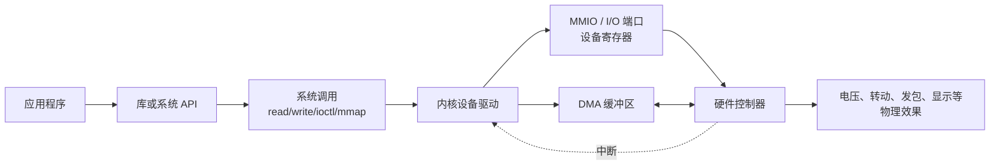
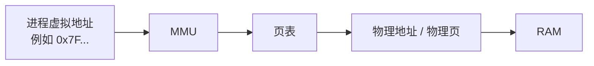
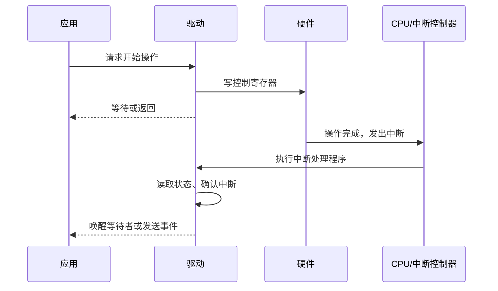
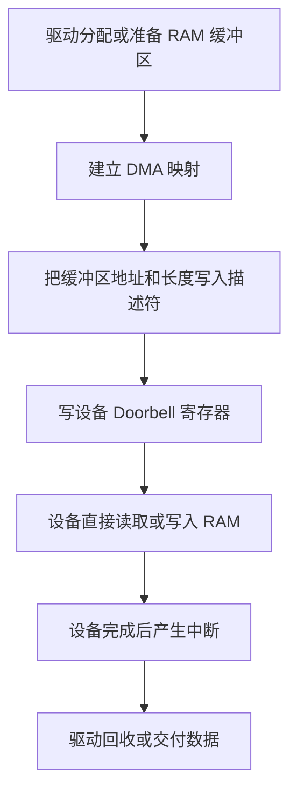

# 内存映射、MMIO 与代码控制硬件

> [!summary] 一句话结论
> **代码先被编译成 CPU 能执行的机器指令；CPU 执行读写指令时，把地址和数据送到芯片内部总线，地址译码电路再把请求交给 RAM 或某个硬件控制器。MMIO 把设备寄存器安排在 CPU 地址空间的一段区域，使驱动能够用专门的读写操作配置硬件；普通应用通常不能直接访问，而是通过系统调用和设备驱动间接控制。**

最短记忆链：

```text
源代码
→ 机器指令
→ CPU 执行
→ 读写设备寄存器
→ 硬件电路改变状态
→ 灯亮、网卡发包、磁盘读数据、屏幕显示图像
```

“代码控制硬件”不是软件隔空发号施令，而是：

> **硬件设计者事先规定了一组可以读写的接口，软件按照说明书写入正确数值，硬件电路被设计成在看到这些数值后执行动作。**

---

## 一、先建立完整分层图

在 Linux 电脑中，普通应用控制硬件的典型链路是：



例如应用要让一个 LED 亮起来：

```text
应用请求“把 GPIO 3 设为高电平”
→ 进入内核
→ GPIO 驱动检查权限和占用情况
→ 驱动修改 GPIO 控制器的设备寄存器
→ GPIO 控制器改变芯片引脚电压
→ 电流通过 LED
→ LED 发光
```

在没有通用操作系统的单片机或裸机程序中，链路可以更短：

```text
业务代码
→ 直接读写设备寄存器
→ 硬件动作
```

Linux 多出来的驱动和权限层不是多此一举，而是为了让多个程序安全地共享复杂硬件。

---

## 二、代码最终是怎样被 CPU 执行的

### 1. 源代码不是 CPU 直接理解的东西

CPU 不直接理解 C、Rust、Java 或 Python 的文字。

以 C 为例：

```c
result = a + b;
```

编译器会把它转换成目标 CPU 架构的机器指令。概念上可能类似：

```asm
LOAD  R1, [a]
LOAD  R2, [b]
ADD   R3, R1, R2
STORE [result], R3
```

不同 CPU 的真实指令名称和编码不同，这里只是帮助理解。

### 2. CPU 不断取指、译码和执行

CPU 大致循环做：

```text
Fetch：取出下一条机器指令
→ Decode：判断这是什么指令
→ Execute：执行计算、跳转或读写
→ 更新程序计数器
→ 继续下一条
```

如果指令要求读取某个地址，CPU 会产生一次读请求；如果要求写入某个地址，CPU 会产生一次写请求。

### 3. 地址不只可以指向 RAM

CPU 发出的地址经过内存控制器、互连或总线系统后，可能到达：

- RAM；
- ROM/Flash；
- 显卡或帧缓冲；
- GPIO 控制器；
- 串口控制器；
- USB 控制器；
- 网卡；
- 中断控制器；
- 其他片上或外接设备。

地址最终代表谁，由硬件地址布局和操作系统映射共同决定。

---

## 三、“寄存器”有两种，不要混淆

### 1. CPU 寄存器

**CPU Register（CPU 寄存器）**位于 CPU 执行核心内部，用于暂存：

- 正在计算的数据；
- 地址；
- 程序计数器；
- 栈指针；
- 状态标志。

它们速度很快，是指令执行的一部分。

### 2. 设备寄存器

**Device Register（设备寄存器）**是硬件设备暴露给软件的控制和状态接口。

常见种类包括：

| 寄存器类型 | 作用 |
|---|---|
| Control Register | 开启、关闭、复位或选择工作模式 |
| Status Register | 告诉软件设备是否忙、是否完成、是否出错 |
| Data Register | 读写少量设备数据 |
| Interrupt Mask Register | 决定哪些事件可以产生中断 |
| Doorbell Register | 软件写一下，通知设备“队列里有新任务” |
| Address Register | 告诉设备 DMA 缓冲区位于哪里 |

二者区别：

| 对比 | CPU 寄存器 | 设备寄存器 |
|---|---|---|
| 位于哪里 | CPU 执行核心内部 | GPIO、网卡、磁盘控制器等硬件内部 |
| 谁使用 | CPU 指令直接使用 | 驱动通过 MMIO 或 I/O 指令访问 |
| 主要用途 | 计算和保存执行状态 | 控制设备并读取设备状态 |
| 地址形式 | 由指令编码指定寄存器编号 | 常被映射到一段 I/O 地址 |

“把 1 写进寄存器”必须先问：是 CPU 寄存器，还是某个设备的控制寄存器？

---

## 四、内存映射到底是什么意思

**Memory Mapping（内存映射）**不是唯一一种技术名词。在不同上下文中，它至少可能指四件事。

### 含义 1：虚拟地址映射到物理地址

现代操作系统通常让每个进程看到自己的 **Virtual Address Space（虚拟地址空间）**。

程序里出现的指针一般是虚拟地址，不是直接焊死在内存条上的物理位置。



**MMU（Memory Management Unit，内存管理单元）**是负责虚拟地址转换的硬件。操作系统建立 **Page Table（页表）**，记录：

- 这段虚拟地址对应哪个物理页；
- 是否允许读取；
- 是否允许写入；
- 是否允许执行；
- 当前是否有效。

如果程序访问没有映射或没有权限的地址，MMU 会触发异常，由内核处理；程序可能最终收到段错误。

这类映射主要解决隔离、权限、内存共享、按需加载等问题。

### 含义 2：使用 Linux `mmap()` 映射文件或设备

`mmap()` 是 Linux/POSIX 常见的内存映射接口。它可以在调用进程的虚拟地址空间中建立一段新映射。

传统读取文件：

```text
open 文件
→ read 到用户缓冲区
→ 程序访问缓冲区
```

文件映射：

```text
open 文件
→ mmap 建立虚拟地址映射
→ 程序像访问内存一样访问文件内容
→ 内核在需要时把相应页面放入内存
```

简化示例：

```c
int fd = open("data.bin", O_RDONLY);
void *p = mmap(NULL, length, PROT_READ, MAP_PRIVATE, fd, 0);
```

这里的 `p` 是进程虚拟地址。程序读取 `p` 附近的数据时，内核和 MMU 负责把它对应到文件内容所在的内存页面。

`mmap()` 不一定意味着“立刻把完整文件复制到 RAM”，也不自动意味着零开销；缺页、页缓存、权限和写回策略仍然存在。

常见模式：

| 模式 | 大意 |
|---|---|
| `MAP_PRIVATE` | 私有写时复制，修改通常不写回原文件 |
| `MAP_SHARED` | 映射可以与其他映射者共享，修改可反映到底层对象 |
| 匿名映射 | 不对应普通文件，常用于分配内存 |

### 含义 3：MMIO，把设备放进地址空间

**MMIO（Memory-Mapped I/O，内存映射输入输出，读作 M-M-I-O）**把一段 CPU 地址空间解释成设备访问，而不是普通 RAM 访问。

例如下面是一份完全假设的芯片地址图：

```text
0x0000_0000 ─ 0x1FFF_FFFF    RAM
0x2000_0000 ─ 0x2000_FFFF    Flash 控制器
0x4000_0000 ─ 0x4000_0FFF    GPIO 控制器
0x4000_1000 ─ 0x4000_1FFF    串口控制器
0x5000_0000 ─ 0x5000_FFFF    网卡控制器
```

当 CPU 向 `0x4000_0004` 写数据时：

```text
CPU 发出：写地址 0x4000_0004，数据 0x0000_0008
→ 地址译码电路发现这个地址属于 GPIO
→ 请求被送到 GPIO 控制器，而不是 RAM
→ GPIO 控制器把相应设备寄存器改成新值
→ 某个引脚输出高电平
```

从机器指令的表面看，它像一次内存写入；从物理结果看，它是在控制硬件。

### 含义 4：硬件手册里的 Memory Map

芯片数据手册里的 **Memory Map（内存地址图）**是一张地址分配表，说明：

- 哪段地址是 RAM；
- 哪段地址是 Flash；
- 哪段地址属于 GPIO；
- 各控制器的寄存器偏移；
- 每个寄存器的位分别表示什么。

它相当于硬件和驱动开发者之间的地址合同。

---

## 五、MMIO 为什么真的能让硬件动作

关键不在“内存”两个字，而在硬件电路的地址译码。

### 1. CPU 把请求放到互连系统

一次写操作通常包含：

- 地址；
- 要写的数据；
- 访问宽度，例如 8、16、32 或 64 位；
- 读还是写；
- 权限和事务属性。

### 2. 地址译码器选择目标设备

芯片中的总线或互连系统判断该地址属于 RAM 还是某个设备控制器。

### 3. 设备保存控制位

设备寄存器后面连接着数字逻辑。例如：

```text
控制寄存器 bit 3 = 1
→ 输出使能逻辑开启
→ GPIO 3 输出高电平
```

### 4. 数字逻辑改变物理状态

最终可能表现为：

- 某根引脚电压变化；
- PWM 占空比变化；
- 电机驱动器收到脉冲；
- 网卡开始读取待发送数据；
- 磁盘控制器开始执行命令；
- 显示控制器扫描新的像素缓冲区。

所以代码能控制硬件，是因为：

```text
软件写入约定数值
+ CPU 和总线把写入送到正确设备
+ 设备电路被设计成响应这个数值
= 物理动作发生
```

---

## 六、一个简化的 GPIO 点灯例子

假设某芯片手册规定：

```text
GPIO 基地址：0x4000_0000
方向寄存器偏移：0x00
输出寄存器偏移：0x04
bit 3 对应 GPIO 3
```

那么：

```text
方向寄存器地址 = 0x4000_0000 + 0x00
输出寄存器地址 = 0x4000_0000 + 0x04
```

在适合直接访问物理地址的裸机环境中，概念代码可能类似：

```c
#include <stdint.h>

#define GPIO_BASE 0x40000000u
#define GPIO_DIR  (*(volatile uint32_t *)(GPIO_BASE + 0x00u))
#define GPIO_OUT  (*(volatile uint32_t *)(GPIO_BASE + 0x04u))

GPIO_DIR |= (1u << 3);  // 把 GPIO 3 配置为输出
GPIO_OUT |= (1u << 3);  // 让 GPIO 3 输出高电平
```

逐句理解：

- `GPIO_BASE` 来自假设的硬件手册；
- `uint32_t` 表示按 32 位宽度访问；
- `1u << 3` 生成只有 bit 3 为 1 的掩码；
- `|=` 尝试只把 bit 3 设为 1，保留其他位；
- `volatile` 告诉编译器，每次都要真正执行这次访问，不要把它当成普通不变内存随意省略。

> [!warning] 这只是概念示例
> 地址和寄存器是虚构的，不要在电脑上直接运行。真实芯片可能还需要开启时钟、解除复位、配置复用功能、电气模式和权限；某些寄存器也不能用普通“读—修改—写”方式操作。

### `volatile` 不是什么

`volatile` 很容易被误解。它不能自动提供：

- Linux 用户空间访问物理地址的权限；
- 多线程互斥；
- CPU 之间的同步；
- 完整的内存屏障；
- 正确的设备访问顺序；
- 正确的大小端转换；
- 硬件寄存器访问宽度保证；
- 防止两个执行者同时改坏寄存器。

在 Linux 内核驱动中，应使用架构无关的设备 I/O API，而不是随意解引用普通指针。

---

## 七、Linux 驱动怎样使用 MMIO

### 1. 驱动先知道设备资源在哪里

设备地址可能通过下面方式获得：

- 芯片固定地址；
- Device Tree（设备树）；
- ACPI 表；
- PCI/PCIe 枚举和 BAR；
- 固件提供的资源描述。

**BAR（Base Address Register，基地址寄存器）**是 PCI/PCIe 设备用来声明 I/O 或内存资源的一种机制。

### 2. 驱动把物理 MMIO 区域映射进内核地址空间

Linux 驱动常用 `ioremap()` 或更高层的资源管理辅助函数建立适合内核访问的映射。

概念示例：

```c
void __iomem *regs;

regs = ioremap(device_phys_addr, device_region_size);
```

这里：

- `device_phys_addr` 是设备 MMIO 物理地址；
- `regs` 是内核用于访问设备的 I/O 映射；
- `__iomem` 是帮助检查“这是设备 I/O 地址，不是普通 RAM 指针”的标记。

### 3. 使用专门的访问函数

Linux 驱动通常使用：

```c
uint32_t status = readl(regs + STATUS_OFFSET);
writel(command, regs + CONTROL_OFFSET);
```

常见函数名称：

| 宽度 | 读取 | 写入 |
|---:|---|---|
| 8 位 | `readb()` | `writeb()` |
| 16 位 | `readw()` | `writew()` |
| 32 位 | `readl()` | `writel()` |
| 64 位 | `readq()` | `writeq()` |

这些 API 会处理不同架构上的一些 I/O 访问差异。便携驱动不应该假设设备寄存器和普通内存完全一样。

### 4. 驱动向应用提供稳定接口

驱动可以让用户程序使用：

- `open()`；
- `read()`；
- `write()`；
- `ioctl()`；
- `mmap()`；
- `poll()`；
- 网络 Socket；
- `/dev/...` 设备文件；
- Linux 某个子系统提供的专用 API。

**ioctl（input/output control，输入输出控制）**通常用于那些难以表示成简单字节读写的设备控制请求。

于是普通应用不需要知道寄存器地址，只需表达“设置 GPIO”“发送网络包”或“开始采集视频”。

---

## 八、为什么普通应用不能随便写硬件地址

如果每个程序都能任意访问设备寄存器，会出现严重问题：

- 一个程序可以覆盖另一个程序正在发送的数据；
- 错误地址可能让设备死机；
- 恶意程序可以读取其他用户的数据；
- DMA 配置错误可能破坏任意内存；
- 多个程序同时操作会产生竞态；
- 电源、时钟和复位顺序错误会损坏状态；
- 用户程序崩溃后，设备可能留在不可恢复状态。

因此现代系统通常通过两层机制保护硬件。

### 1. 虚拟内存保护

普通进程只看到内核为它建立的虚拟地址映射。设备物理地址默认不会出现在它的地址空间中。

### 2. CPU 特权级保护

内核运行在更高特权级，普通应用运行在用户态。某些指令、页表修改、中断管理和设备访问只能由内核完成。

用户应用需要通过 **System Call（系统调用）**进入内核，由驱动检查：

- 调用者有没有权限；
- 设备有没有被占用；
- 参数是否合法；
- 操作顺序是否正确；
- 是否需要锁、等待或超时；
- 错误后怎样恢复。

### 可以把设备映射给用户空间吗

可以，但必须由内核驱动有意识地授权和限制。

例如：

- 摄像头驱动可以把视频缓冲区映射给应用，减少数据复制；
- 显示或加速设备可以映射受控缓冲区；
- UIO、VFIO 等框架可用于某些用户态驱动场景；
- `/dev/mem` 能力通常受到严格权限和内核限制。

这不等于普通程序可以随意映射整个物理内存。

---

## 九、Linux 的 `mmap()` 和 MMIO 是什么关系

两者有关联，但不能画等号。

```text
mmap()：建立进程虚拟地址映射的系统接口
MMIO：把某些地址访问解释成设备 I/O 的硬件/系统设计方法
```

`mmap()` 可以映射：

- 普通文件；
- 匿名内存；
- 共享内存；
- 驱动提供的设备缓冲区；
- 在受控情况下，某段设备内存或 MMIO 区域。

因此：

| 情况 | 是 `mmap()` 吗 | 是 MMIO 吗 |
|---|---:|---:|
| 把普通文件映射进进程 | 是 | 否 |
| 匿名映射一段内存 | 是 | 否 |
| 内核用 `ioremap()` 访问网卡寄存器 | 不是用户态 `mmap()` | 是 |
| 驱动把受控设备缓冲区映射给应用 | 是 | 可能是设备内存，但不一定是控制寄存器 |
| 裸机程序直接访问固定外设地址 | 否 | 是 |

一句话：

> **`mmap()` 是“怎样把对象放进进程地址空间”的软件接口；MMIO 是“访问这段地址时，硬件把请求送给设备”的机制。**

---

## 十、硬件怎样把结果通知给代码：中断

如果 CPU 不断读取状态寄存器：

```text
完成了吗？
完成了吗？
完成了吗？
```

这叫 **Polling（轮询）**。轮询简单，但可能浪费 CPU。

更常见的方式是 **Interrupt（中断）**：



中断让硬件在事件发生时主动通知 CPU。

中断处理程序通常需要快速完成，较复杂的工作会被推迟到合适的内核上下文中处理。

---

## 十一、大量数据怎样传输：DMA

用 CPU 一字节一字节搬运网卡、磁盘或摄像头数据会浪费大量计算时间。

**DMA（Direct Memory Access，直接内存访问，读作 D-M-A）**允许设备直接在设备和 RAM 之间传输数据。

典型流程：



### 网卡发送数据的例子

```text
应用调用 send()
→ Linux TCP/IP 协议栈生成数据包
→ 网卡驱动准备内存中的发送描述符
→ 驱动把 DMA 地址告诉网卡
→ 驱动写 Doorbell 寄存器
→ 网卡通过 DMA 从 RAM 读取数据
→ 网卡变成电信号或无线信号发出去
→ 完成后网卡产生中断
```

### MMIO 和 DMA 的分工

可以粗略记成：

```text
MMIO 寄存器：发送少量命令、状态、地址和通知
DMA 缓冲区：搬运大量真实数据
中断：设备通知 CPU“发生事件或完成任务”
```

但 DMA 也有复杂问题：

- CPU 虚拟地址不一定就是设备使用的 DMA 地址；
- 设备可能只能访问某个地址范围；
- CPU 缓存和设备看到的数据必须保持一致；
- 需要控制设备能访问哪些内存；
- 某些系统使用 IOMMU 做设备地址转换和隔离。

驱动应使用操作系统的 DMA API，而不是随便把一个程序指针交给设备。

---

## 十二、为什么 MMIO 不能完全当普通内存使用

普通 RAM 的目标是快速保存数据，CPU 和编译器可能进行缓存、预取、合并或重排。

设备寄存器的每次访问却可能产生动作：

- 读取状态寄存器可能顺便清除标志；
- 写 1 可能表示清除某个事件；
- 连续两次写入的顺序可能不能交换；
- 错误宽度或未对齐访问可能失败；
- 读取某些地址可能没有意义；
- 写入保留位可能产生未定义行为。

因此驱动要考虑：

### 1. 访问宽度和对齐

硬件可能要求某寄存器必须以 32 位、4 字节对齐方式访问。

### 2. 大小端

**Endianness（字节序）**决定多字节数值的字节排列。CPU 与设备的字节序可能不同，驱动需要使用正确的转换或访问函数。

### 3. 访问顺序和内存屏障

编译器、CPU 和总线可能重新安排某些操作。驱动需要使用正确的 MMIO accessor 和 **Memory Barrier（内存屏障）**保证必要顺序。

### 4. Posted Write

某些总线上的写入是 **Posted Write（投递式写入）**：CPU 认为写指令已经发出，可以继续执行，但数据可能还在总线途中，并未真正到达设备。

在需要确认完成时，驱动可能根据硬件和内核 API 要求做一次读取或使用适当屏障。

### 5. 并发和锁

中断处理程序、多个 CPU 或多个线程可能同时访问同一设备。驱动需要锁、原子操作或设备队列来避免竞态。

### 6. 寄存器语义

常见特殊语义：

| 标记 | 常见含义 |
|---|---|
| RO | Read Only，只读 |
| WO | Write Only，只写 |
| RW | Read/Write，可读写 |
| W1C | Write 1 to Clear，写 1 清除对应位 |
| RC | Read to Clear，读取后清除 |
| Reserved | 保留位，通常必须按手册要求保持 |

所以不能看到“地址”就随意用普通指针访问。

---

## 十三、并非所有硬件都只使用 MMIO

MMIO 很常见，但不是唯一方式。

### 1. Port-Mapped I/O

x86 等架构还存在独立的 **I/O Port Space（I/O 端口空间）**，使用 `in`、`out` 一类特殊指令访问。

Linux 内核提供 `inb()`、`outb()` 等接口。这里的“端口”不是 TCP/UDP 网络端口，而是硬件 I/O 地址编号。

### 2. 专用总线协议

CPU 或控制器可能通过下面协议与外设通信：

- I²C；
- SPI；
- UART；
- USB；
- PCIe；
- CAN。

软件通常先通过 MMIO 配置相应的总线控制器，再由控制器按协议与外部芯片通信。

例如：

```text
程序请求读取温度
→ I²C 设备驱动
→ 配置 I²C 控制器寄存器
→ 控制器在两根信号线上发送地址和命令
→ 温度传感器返回数据
→ 控制器产生中断
→ 驱动把温度交给应用
```

### 3. 固件协议和命令队列

复杂设备内部可能还有自己的处理器和固件。主 CPU 不直接控制每个电路，而是提交命令；设备固件再执行复杂流程。

显卡、网卡、SSD 和 Wi-Fi 芯片经常采用这种模式。

---

## 十四、应用控制硬件的几个完整例子

### 例子 1：播放声音

```text
播放器产生音频样本
→ 调用音频 API
→ 音频服务和内核音频驱动
→ 把音频数据放进 DMA 缓冲区
→ 配置声卡寄存器并启动 DMA
→ 声卡把数字样本转换并输出
→ 扬声器振膜运动
→ 人听到声音
```

### 例子 2：显示一个像素

```text
应用绘制界面
→ 图形 API 和图形驱动
→ 像素或绘图命令进入显存/缓冲区
→ GPU 或显示控制器处理
→ 显示控制器周期性扫描画面
→ 屏幕像素电路改变亮度和颜色
```

### 例子 3：读取键盘

```text
用户按键
→ 键盘控制器检测开关变化
→ USB/蓝牙等链路传输事件
→ 控制器向 CPU 发中断
→ 内核驱动解析键码
→ 输入子系统分发事件
→ 窗口系统和应用收到按键
```

### 例子 4：保存文件到 SSD

```text
应用调用 write()
→ 文件系统决定数据和元数据怎样保存
→ 块设备层组织请求
→ NVMe/SATA 驱动建立命令和 DMA 缓冲区
→ 写 Doorbell 通知 SSD
→ SSD 控制器通过 DMA 读取数据
→ SSD 固件管理 Flash 写入
→ 完成后产生中断
```

你在应用里只写了一行 `write()`，下面却有很多层共同工作。

---

## 十五、Linux 为什么把设备表现成文件

Unix/Linux 经常通过 `/dev/...` 设备文件向用户空间暴露设备接口。

例如：

- `/dev/gpiochip0`：GPIO 字符设备；
- `/dev/input/event...`：输入设备事件；
- `/dev/video0`：视频设备；
- `/dev/nvme...`：NVMe 设备节点；
- `/dev/tty...`：终端或串口。

应用可以先 `open()` 获得文件描述符，再使用 `read()`、`write()`、`ioctl()`、`mmap()` 或 `poll()`。

但“设备是文件”只是统一接口思想，不表示设备里面真的存着普通文本，也不表示所有控制都能用简单的 `echo` 完成。

详见 [[Unix与Linux设计哲学：文件、小工具与管道]]。

### GPIO 的现代用户空间方式

Linux 提供 GPIO Character Device Userspace API，设备通常表现为 `/dev/gpiochipX`。应用请求某些 GPIO line，再读取、设置或监听边沿事件。

旧的 sysfs GPIO 接口已经被标记为过时。新开发应优先使用字符设备 API 或 libgpiod，而不是照抄旧教程中的 `/sys/class/gpio` 操作。

如果内核已有专门的 LED、I²C、SPI、PWM 等驱动和子系统，也应优先使用它们，而不是在用户空间自己“位敲击”硬件。

---

## 十六、Windows 控制硬件的原理一样吗

底层原理基本相同：

```text
Windows 应用
→ Win32 / 系统 API
→ 系统调用
→ Windows 内核驱动
→ MMIO、I/O 端口、DMA 和中断
→ 硬件
```

差别主要在驱动模型、API、权限体系和工具名称，而不是“Windows 用魔法、Linux 用寄存器”。

普通 Windows 应用同样不能随意访问任意物理地址。

---

## 十七、常见误区

### 误区 1：内存映射就是把所有数据复制进内存

错误。映射首先是建立地址对应关系；真实页面可能按需进入 RAM，也可能指向共享内存、文件页面或设备区域。

### 误区 2：`mmap()` 就是 MMIO

错误。`mmap()` 是建立进程虚拟地址映射的接口；映射普通文件时完全不涉及设备寄存器。

### 误区 3：有一个指针就能控制硬件

错误。还需要正确的地址映射、权限、访问宽度、寄存器定义、时钟、复位、顺序和并发控制。

### 误区 4：`volatile` 可以解决所有硬件并发问题

错误。`volatile` 主要约束编译器对该访问的优化，不能代替锁、原子操作、内存屏障和内核 I/O API。

### 误区 5：设备寄存器就是 CPU 寄存器

错误。CPU 寄存器用于执行指令；设备寄存器位于外设控制器中，用于控制和读取硬件状态。

### 误区 6：驱动只是给硬件取一个名字

错误。驱动还负责设备发现、寄存器配置、DMA、中断、并发、错误恢复、电源管理和用户接口。

### 误区 7：DMA 表示设备可以访问所有内存

错误。DMA 地址需要由操作系统正确映射和限制；IOMMU 等机制还可以进一步隔离设备访问范围。

### 误区 8：所有 I/O 端口都是网络端口

错误。硬件 I/O 端口空间与 TCP/UDP 的网络端口是两个完全不同的概念。

### 误区 9：直接访问寄存器一定比驱动更好

错误。绕开驱动会失去权限检查、资源协调、并发控制、可移植性和错误恢复。Linux 官方 GPIO 文档也建议已有合适内核驱动时不要在用户空间重新直接操纵硬件。

---

## 十八、初学者学习路线

建议按下面顺序学习，不要一开始就在主力电脑上读写物理地址。

### 第 1 步：理解二进制和位运算

重点理解：

- 二进制和十六进制；
- `&`、`|`、`^`、`~`；
- `<<` 和 `>>`；
- bit、byte、32 位寄存器；
- 掩码怎样设置和清除某一位。

### 第 2 步：理解 CPU、RAM 和地址

理解：

- 指令怎样执行；
- 指针是什么；
- CPU 寄存器；
- 虚拟地址和物理地址；
- MMU 和页表。

### 第 3 步：学习单片机或模拟环境

选择资料完整的开发板，在厂商 SDK 和示例范围内操作 GPIO、UART、定时器。

不要照搬网上的物理地址；必须查看对应芯片和开发板手册。

### 第 4 步：理解 Linux 用户 API

学习：

- `/dev`；
- 文件描述符；
- `open/read/write/ioctl/mmap/poll`；
- libgpiod；
- V4L2、ALSA、input 等子系统的基本思想。

### 第 5 步：再学习 Linux 驱动

学习：

- Device Tree；
- platform/PCI/USB 等设备模型；
- `ioremap()`、`readl()`、`writel()`；
- 中断；
- DMA；
- 锁与内存屏障；
- 电源管理和错误恢复。

### 一个安全的观察练习

在 Linux 中可以查看进程的虚拟内存区域：

```bash
cat /proc/self/maps
```

它能帮助你观察：

- 程序代码映射；
- 共享库映射；
- 堆和栈；
- 不同区域的读、写、执行权限。

这个命令只是查看当前进程映射，不会直接控制硬件。

---

## 十九、最终记忆

### 第一层：代码为什么能动硬件

```text
硬件手册规定寄存器地址和位含义
→ 驱动按照规则读写
→ CPU 发出总线事务
→ 地址译码选中设备
→ 设备数字电路改变状态
→ 产生物理效果
```

### 第二层：三种容易混淆的映射

```text
虚拟内存映射：虚拟地址 → 物理页或其他对象
mmap()：在进程地址空间建立映射的系统接口
MMIO：某段地址 → 设备寄存器，而不是普通 RAM
```

### 第三层：完整硬件协作

```text
MMIO：下命令、读状态
DMA：搬大量数据
Interrupt：硬件通知 CPU
Driver：管理权限、顺序、并发和错误
```

最准确的一句话：

> **代码控制硬件，本质上是 CPU 按照硬件定义的协议改变设备寄存器和数据缓冲区；操作系统驱动把危险、设备相关的底层细节封装成应用可以安全使用的接口。**

---

## 关联概念

- [[Linux为什么可以做得很小]]：裁剪内核时为什么必须保留目标硬件驱动和早期存储支持。
- [[Linux的主要用途、普及原因与桌面现状]]：Linux 怎样进入服务器、Android、路由器和嵌入式设备。
- [[Unix与Linux设计哲学：文件、小工具与管道]]：Linux 为什么通过文件描述符和 `/dev` 暴露许多设备接口。
- [[进程、线程、多进程与多线程]]：应用、驱动等待、中断唤醒与并发访问之间的关系。
- [[CMD、Bash与PowerShell]]：Shell 命令怎样启动程序并通过系统调用间接使用硬件。
- [[Windows ACL与NTFS权限]]：文件权限和设备访问权限都在防止未经授权的操作。
- [[防火墙与端口对外开放]]：硬件 I/O 端口与 TCP/UDP 网络端口不是同一种端口。

## 参考资料

以下内容于 2026-08-23 核对：

- [Linux Kernel Documentation：设备 I/O、MMIO、`ioremap()` 与 `readl()`/`writel()`](https://docs.kernel.org/driver-api/device-io.html)
- [Linux Kernel Documentation：页表把虚拟地址映射为物理地址](https://docs.kernel.org/mm/page_tables.html)
- [Linux man-pages：`mmap()` 把文件或设备映射进进程虚拟地址空间](https://man7.org/linux/man-pages/man2/mmap.2.html)
- [Linux Kernel Documentation：Dynamic DMA Mapping Guide](https://docs.kernel.org/core-api/dma-api-howto.html)
- [Linux Kernel Documentation：MMIO 写入顺序](https://docs.kernel.org/driver-api/io_ordering.html)
- [Linux Kernel Documentation：GPIO Character Device Userspace API](https://docs.kernel.org/userspace-api/gpio/chardev.html)
- [Linux Kernel Documentation：旧 GPIO sysfs API 已过时](https://docs.kernel.org/userspace-api/gpio/sysfs.html)
