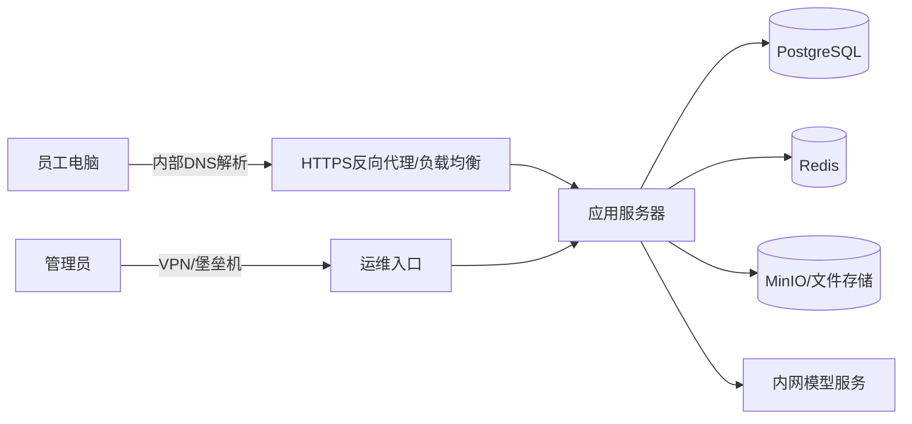

# 内网、公网与私有化服务器部署

> [!summary] 一句话结论
> **内网部署强调“谁可以通过什么网络访问”，私有化部署强调“软件和数据运行在谁控制的基础设施里”；企业经常把软件私有化部署到公司内网，但私有化系统也可能开放公网入口，内网系统也不一定由客户自己运维。**

## 一、先把“服务器”和“部署”说清楚

### 服务器是什么

Server（服务器，读作“瑟沃”）首先是一种**角色**：一台运行服务程序、等待其他设备请求的计算机。

它可以是：

- 机房中的物理服务器；
- 普通台式机；
- 一台虚拟机；
- 云平台中的云主机；
- Kubernetes 集群里的多个容器；
- 一台 NAS 或小型边缘设备。

服务器不一定长得特殊。只要一台电脑运行程序并通过网络为其他设备提供服务，它就在扮演服务器角色。

### 部署是什么

Deployment（部署）不是“把代码复制过去”这么简单，而是把软件变成一个可以持续提供服务、可以维护和恢复的运行系统，通常包括：

1. 准备服务器、操作系统、CPU、内存、磁盘和网络；
2. 安装程序、依赖、容器或运行时；
3. 配置域名、IP、端口、TLS 证书和防火墙；
4. 准备数据库、缓存和文件存储；
5. 设置账号、权限、Secret 和身份认证；
6. 启动服务并做健康检查；
7. 配置日志、监控、告警、备份和恢复；
8. 建立升级、回滚和故障处理流程。

因此，“程序能启动”只代表部署链路中的一步，不代表已经适合生产使用。

## 二、什么是内网

Intranet（内联网，通常简称内网）是组织或家庭内部受控制的网络，通常只允许内部设备、专线设备或经过身份验证的远程设备访问。

常见内网包括：

- 家中路由器下的 Wi-Fi/LAN；
- 公司办公网；
- 工厂生产网；
- 学校校园网；
- 云上的 VPC（Virtual Private Cloud，虚拟私有云）；
- 通过专线连接的多个办公地点。

### 常见私有 IPv4 地址

RFC 1918 规定了三段常见私有地址：

```text
10.0.0.0/8
172.16.0.0/12
192.168.0.0/16
```

例如家中设备可能是：

```text
电脑：192.168.1.20
手机：192.168.1.30
路由器：192.168.1.1
```

私有 IPv4 地址通常不能直接在公网路由。设备访问互联网时，路由器或网关通常通过 NAT 转换地址。详见 [[防火墙与端口对外开放]]。

> [!important]
> “内网”是访问范围和网络边界，不只由 IP 地址决定。企业可以在内部使用 VPN、VLAN、访问控制和内部 DNS；仅仅看到 `192.168.x.x` 不能证明系统安全。

## 三、内网不等于不能上互联网

这是最常见的误解。

公司电脑可以同时：

- 访问公司内部 OA、数据库和文件服务器；
- 经过网关、代理或防火墙访问互联网；
- 阻止互联网用户主动访问公司内部设备。


所以“系统在内网”不自动表示：

- 服务器完全断网；
- 数据绝不会外发；
- 员工在家一定不能访问；
- 外部攻击者永远进不来。

员工可能通过 VPN、零信任访问代理或专线进入；内网服务器也可能主动调用外部 API。

## 四、什么是公网

Internet/Public Network（互联网/公网）是可以通过公共互联网路由到达的网络范围。

一个网站能被公网访问，通常需要：

1. 有公网可达的 IP、域名或云负载均衡入口；
2. DNS 把域名解析到正确入口；
3. 网络路由可达；
4. 云安全组和操作系统防火墙允许相应端口；
5. 服务监听正确地址和端口；
6. HTTPS/TLS、身份认证和应用权限正确配置。

“有公网 IP”“防火墙开放 443”和“程序正在监听”是不同条件。详见 [[DNS域名系统]]、[[TLS与数字证书]] 和 [[防火墙与端口对外开放]]。

## 五、什么是私有化部署

Private Deployment 或 On-Premises Deployment（本地化/私有化部署，On-Premises 常简称 On-Prem）通常是指：

> 软件的服务端、数据库和主要业务数据运行在客户自己拥有或控制的基础设施中，而不是所有客户共同使用软件厂商提供的公共 SaaS 平台。

生活类比：

- 公共 SaaS 像住酒店：房屋和公共设施由酒店运营，用户开房即用。
- 私有化部署像在自己的园区盖办公楼：出入口、设备和数据由自己控制，但也要负责维护、消防和修缮。

私有化基础设施可能位于：

- 客户自己的机房；
- 客户租用的数据中心机柜；
- 客户自己的 VMware/Hyper-V 虚拟化平台；
- 客户专属的私有云；
- 客户自己的公有云账号和 VPC；
- 严格隔离的专用服务器环境。

因此，私有化部署并不必然要求服务器摆在公司办公室，也不必然要求物理机。

## 六、内网部署与私有化部署的区别

| 维度 | 内网部署 | 私有化部署 |
|---|---|---|
| 主要问题 | 谁能从什么网络访问 | 软件和数据由谁控制 |
| 关注点 | 网络可达性、路由、防火墙、VPN | 基础设施、数据归属、运维、升级、授权 |
| 一定断网吗 | 不一定 | 不一定 |
| 一定由客户运维吗 | 不一定 | 客户通常承担或委托较多运维责任 |
| 一定在客户办公室吗 | 不一定 | 不一定，可以在客户云账号中 |
| 一定更安全吗 | 不一定 | 不一定，取决于实际安全和运维能力 |

### 四种可能组合

| 场景 | 内网限制 | 私有化 | 例子 |
|---|---:|---:|---|
| 公共 SaaS | 否 | 否 | 厂商运营的网站，用户通过公网登录 |
| 公网可达的私有部署 | 否或部分 | 是 | 软件装在客户云账号中，并给外地员工提供 HTTPS 入口 |
| 内网可达的托管服务 | 是 | 不一定 | 厂商云服务通过专线/Private Link 接入企业网络 |
| 内网私有化部署 | 是 | 是 | 软件、数据库和文件都在企业服务器，只有内网/VPN 可访问 |

这张表说明：**“内网”与“私有化”是两条不同的判断轴。**

## 七、离线部署、隔离网和私有化也不同

### 离线部署

Offline Deployment（离线部署）可能指部署过程中不能从互联网下载安装包，需要提前准备离线软件包、镜像、License 和依赖。

### 隔离网

Air-Gapped Network（物理或逻辑隔离网络）强调网络与互联网及其他低信任网络之间没有普通直接通路，数据进出需要严格介质、网闸或审批流程。

### 私有化部署

私有化只说明控制权，不保证断网。私有化系统仍可能：

- 联网检查 License；
- 下载更新；
- 调用云端大模型；
- 上传遥测、日志或告警；
- 使用外部邮件、短信和对象存储。

若合同要求“数据不出内网”，必须逐项检查全部外部依赖，而不能只看到“私有化”三个字。

## 八、一次内网私有化访问怎样发生

假设公司部署一个内部 AI 系统：



请求大致经历：

1. 员工在浏览器或客户端输入内部域名，例如 `ai.corp.example`。
2. 内部 DNS 返回内网负载均衡或服务器地址。
3. 员工电脑通过公司网络或 VPN 访问 TCP 443。
4. 反向代理终止 TLS、检查请求并转发到应用服务器。
5. 应用服务器验证企业身份和权限。
6. 应用按需要访问数据库、缓存、对象存储和模型服务。
7. 日志、指标和审计进入受控系统。

数据库一般不应直接向所有员工电脑开放；客户端通常只访问应用入口，应用服务器再访问内部数据服务。

## 九、一套私有化系统通常包含什么

私有化交付往往不只是一个安装包：

| 组件 | 作用 |
|---|---|
| 反向代理/负载均衡 | 提供 HTTPS 入口，把流量分发给服务实例 |
| 应用服务 | 处理业务逻辑和 API |
| 数据库 | 保存账号、权限、业务数据和状态 |
| 缓存/消息系统 | 保存短期状态、协调并发或传递任务 |
| 对象存储 | 保存附件、模型文件、备份等大文件 |
| 身份系统 | 对接 LDAP、AD、OIDC、SAML 等企业身份 |
| Secret 管理 | 保存数据库口令、API Key、证书私钥 |
| 日志和监控 | 发现错误、延迟、容量和安全事件 |
| 备份与恢复 | 应对误删除、磁盘损坏和灾难 |
| 升级与回滚 | 安全安装新版本，失败时恢复 |
| License | 控制授权范围，但不能代替安全机制 |

Docker 或 Kubernetes 只是运行和编排方式，不自动完成网络、安全、数据库备份和生产验收。

## 十、私有化部署的典型过程

### 1. 需求和边界确认

先确认：

- 用户人数、并发量和数据规模；
- 是否允许访问互联网；
- 哪些数据不能离开企业；
- 身份系统和权限模型；
- 需要接入哪些数据库、文件和模型；
- 可接受的停机时间与数据丢失量；
- 谁负责服务器、系统、数据库和应用运维。

### 2. 准备基础设施

分配服务器/虚拟机、内网 IP、DNS、磁盘、网络区域、防火墙规则和证书。生产、测试和开发环境应尽量隔离。

### 3. 安装和配置

部署应用、数据库、缓存、存储和反向代理；Secret 不能硬编码进 Git、镜像或普通配置模板。

### 4. 联调和安全检查

验证登录、权限、TLS、端口、数据路径、外部依赖、日志脱敏、漏洞修复和最小权限。

### 5. 生产验收

至少测试：

- 正常功能和权限边界；
- 性能、容量和长时间稳定性；
- 服务重启、网络断开、磁盘满和依赖故障；
- 备份能否真正恢复；
- 升级失败能否回滚；
- 日志、监控和告警是否有效。

### 6. 持续运维

部署完成后仍需补丁、证书续期、容量扩展、备份检查、账号清理、漏洞处置和版本升级。

## 十一、私有化部署的优点

- 数据和基础设施控制权更强；
- 可接入企业内部身份、数据库和文件系统；
- 可按合规要求限制数据路径；
- 对稳定的大流量场景可能降低长期外部服务依赖；
- 可以在弱网、专网或部分离线环境工作；
- 便于进行深度定制和网络隔离。

## 十二、私有化部署的代价

- 需要采购或租用服务器；
- 客户或服务商要承担运维责任；
- 更新、补丁和漏洞修复更慢、更分散；
- 数据库、高可用、监控和备份需要专业能力；
- 不同客户环境差异大，交付和排障成本高；
- 离线依赖、License、证书和镜像分发更复杂；
- 单台服务器损坏可能导致整体停机。

私有化不是“安装后厂商就不用管”，也不是“客户一定能独立维护”。合同和交付手册必须划清责任。

## 十三、私有化为什么不自动等于安全

系统即使只在内网，也可能发生：

- 员工账号被盗；
- 终端感染恶意软件；
- 服务使用默认口令；
- 数据库端口向整个办公网开放；
- 服务器长期不打补丁；
- Secret 写在脚本或日志中；
- 备份未加密或从未恢复测试；
- 应用主动把数据发送给外部 API；
- 内部人员越权访问。

更可靠的做法包括：

- 网络分区与最小开放端口；
- 最小权限、MFA 和细粒度授权；
- 内部连接也使用 TLS；
- 通过堡垒机或受控运维入口管理服务器；
- Secret 集中管理和轮换；
- 审计日志、监控和告警；
- 定期补丁、漏洞扫描和恢复演练；
- 按身份和设备验证访问，而不是盲目信任“人在内网”。

这也是 Zero Trust（零信任）强调的思想：网络位置只是一个信号，不能因为请求来自内网就自动完全信任。

## 十四、AI 私有化部署要额外检查什么

AI 系统可能在内网运行应用和知识库，却把 Prompt 发给外部模型 API。此时它仍是“应用私有化”，但不能直接宣称“所有推理数据不出内网”。

需要逐项确认：

- 基础模型是在内网 GPU 上运行，还是调用外部 API；
- Embedding、OCR、语音转写是否调用云服务；
- RAG 文档和检索片段会不会进入外部模型；
- 日志、Trace、崩溃报告和遥测会不会外发；
- 模型和镜像更新怎样进入隔离环境；
- GPU 数量、显存、并发量和响应时间是否满足要求；
- 外部模型供应商的数据保留和训练政策是什么；
- 哪些工具能访问互联网，谁批准数据外发。

如果要求完全离线推理，就需要把模型、推理服务、Embedding、OCR、数据库和监控等依赖都放入受控环境，并准备离线更新和漏洞修复机制。

以 DeepSeek 为例，必须区分两种用法：调用 DeepSeek 云端 API 时，请求会从私有服务器发送到外部模型服务；下载可用的 DeepSeek 模型权重和 Tokenizer，并在企业自己的 GPU 上运行推理时，模型计算可以留在内网。后者不要求企业从头训练基础模型。完整过程见 [[大模型从数据、Token到训练与本地部署]]。

## 十五、以 Otto 为例理解

[[Otto产品总体技术架构]] 中的“单服务器私有化”可以理解为：Otto Server、PostgreSQL、Redis、MinIO、HTTPS 反向代理等先运行在客户控制的一台服务器上。

但仍要继续问：

1. 服务器只允许内网/VPN 访问，还是有公网入口？
2. Otto Edge 和模型供应商在内网还是公网？
3. Prompt、文件片段和日志哪些会离开客户环境？
4. Control Plane 是否只交换 License、版本和健康信息？
5. 单机损坏时，数据库和附件怎样恢复？
6. 谁负责补丁、证书、备份、监控和升级？

所以“已支持私有化部署”只是交付方式的概括，不等于这些问题已经自动解决。

## 十六、常见误区

> [!warning] 常见误区
> - **内网等于断网**：不对，内网设备通常仍可经过网关访问互联网。
> - **私有化等于只在内网访问**：不对，客户也可以为私有系统配置公网 HTTPS 入口。
> - **私有 IP 等于绝对安全**：不对，内网终端、VPN、错误路由和应用漏洞仍可能造成攻击。
> - **服务器是一种特殊电脑**：不完全对，服务器首先是提供服务的角色。
> - **Docker 跑起来就完成部署**：不对，还缺权限、TLS、备份、监控、升级和恢复。
> - **私有化后数据绝不外发**：不对，要检查模型 API、OCR、邮件、遥测和更新等所有依赖。
> - **单服务器等于高可用**：不对，单机通常仍是单点故障。
> - **内网系统不需要 TLS**：不对，内部网络也可能被监听、冒用或横向移动。

## 十七、验收时的简单清单

可以要求部署方明确回答：

- [ ] 软件和数据分别运行在哪里？
- [ ] 用户从内网、VPN 还是公网访问？
- [ ] 开放了哪些端口，分别给谁访问？
- [ ] 哪些数据会离开客户网络？
- [ ] 外部依赖断开后哪些功能不能用？
- [ ] 管理员怎样登录，是否通过 MFA/堡垒机？
- [ ] Secret、证书和 API Key 怎样保管与轮换？
- [ ] 数据库和附件怎样备份，是否做过恢复演练？
- [ ] 日志是否包含敏感数据，保存多久？
- [ ] 怎样升级、回滚和修补高危漏洞？
- [ ] 单机故障后多久恢复，最多能丢多少数据？
- [ ] 客户、厂商和第三方分别负责什么？

## 十八、记忆口诀

```text
内网：谁能从哪里访问
私有化：系统和数据由谁控制
离线：能否访问互联网和在线依赖
部署：让软件可运行、可维护、可恢复
高可用：一部分故障后仍能继续服务
```

## 关联概念

- [[防火墙与端口对外开放]]：程序监听、系统防火墙、云安全组和 NAT 怎样共同决定是否可访问。
- [[系统代理、VPN与端口]]：远程员工如何通过 VPN 进入企业网络，以及代理怎样控制外部访问。
- [[DNS域名系统]]：内部域名和公网域名怎样解析到不同入口。
- [[TLS与数字证书]]：内外网 HTTPS 怎样认证服务器并保护传输。
- [[身份认证与授权：ACL、RBAC、MFA、OAuth、OIDC、SAML与SCIM]]：进入网络后仍要验证身份和权限。
- [[SQLite、SQLCipher与PostgreSQL]]：私有化系统为什么通常需要独立数据库服务。
- [[高可用、健康检查与故障恢复]]：从单服务器演进到多实例、主备和可恢复系统。
- [[软件供应链：代码签名、SBOM与发布门禁]]：离线包、镜像和升级制品如何验证来源与完整性。
- [[Otto产品总体技术架构]]：AI Agent 产品的私有化组件示例。

## 参考资料

以下资料于 2026-09-01 核对：

- [RFC 1918：Address Allocation for Private Internets](https://www.rfc-editor.org/rfc/rfc1918)
- [NIST SP 800-145：The NIST Definition of Cloud Computing](https://csrc.nist.gov/pubs/sp/800/145/final)
- [NIST SP 800-207：Zero Trust Architecture](https://csrc.nist.gov/pubs/sp/800/207/final)
