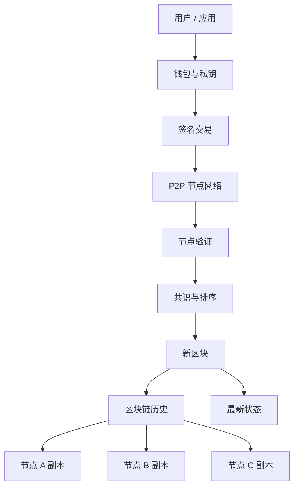
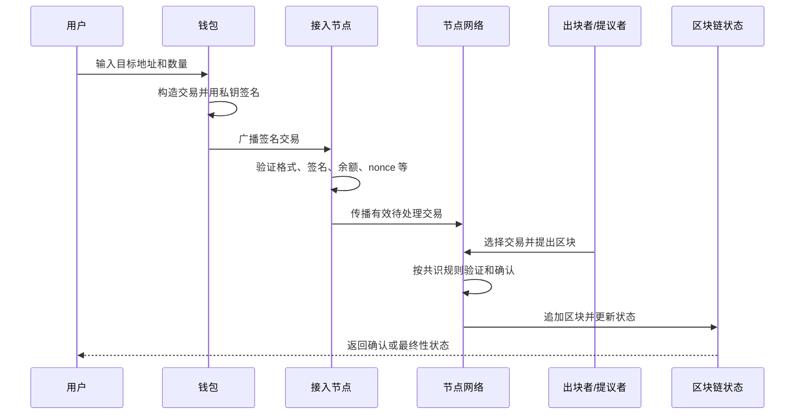
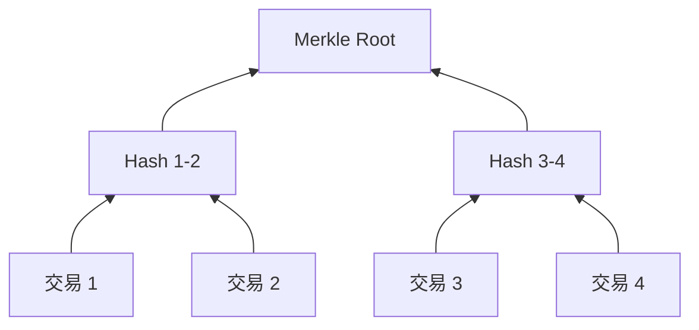
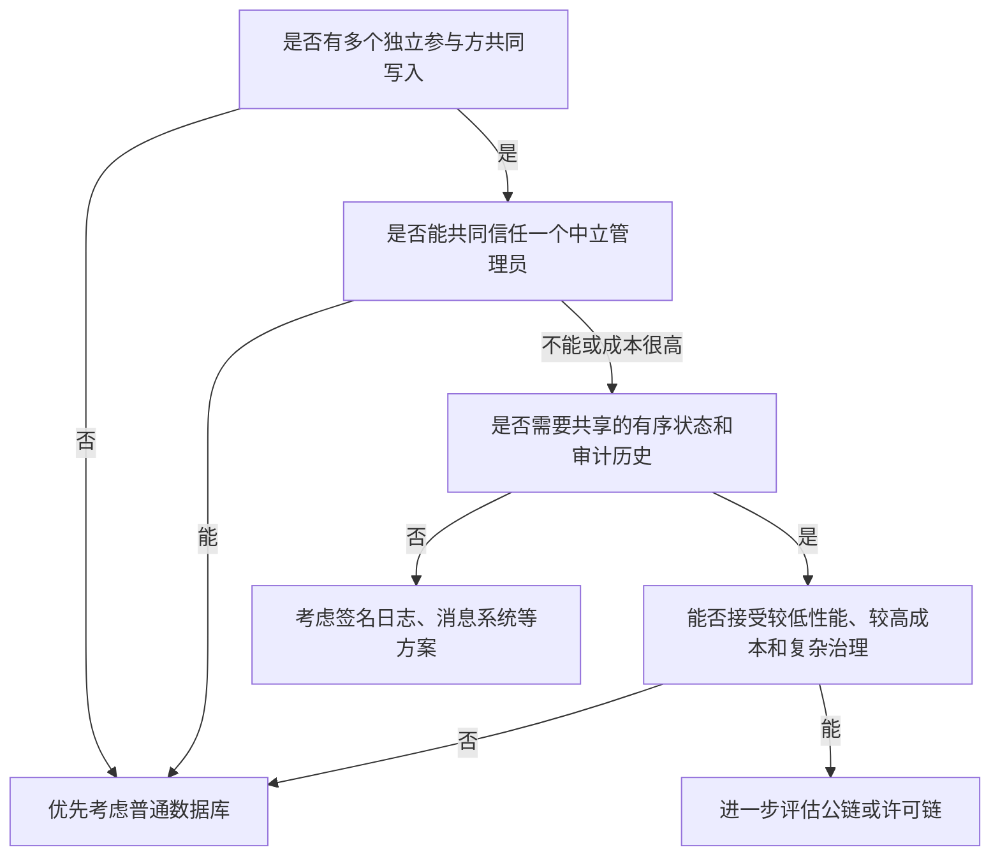
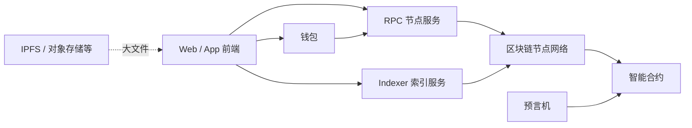
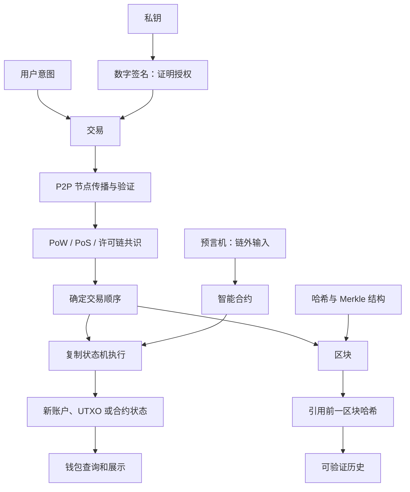

# 区块链基础：原理、共识、钱包与智能合约

> [!summary] 一句话结论
> **区块链是一种由多台计算机共同维护、按共识确认记录顺序、使用哈希和数字签名验证完整性与授权的分布式账本；它擅长让互不完全信任的参与者共享一份难以事后篡改的状态，但通常比普通数据库更慢、更贵、更难修改，也不等于比特币、炒币或“绝对不可篡改”。**

最短记忆：

```text
交易提出状态变化
→ 数字签名证明授权
→ 节点检查规则
→ 共识决定交易顺序
→ 交易被写入区块
→ 区块通过哈希前后连接
→ 所有节点按同样顺序更新状态
```

---

## 一、用“多人共同记账”理解区块链

假设甲、乙、丙三家公司需要共同记录货物交接。

### 传统中心化做法

找一家公司或第三方维护一个数据库：

```text
甲 ─┐
乙 ─┼─> 中央数据库
丙 ─┘
```

这种方式通常最快、最简单，但所有人需要信任数据库管理员：

- 管理员不会偷偷修改记录；
- 管理员不会偏袒某一方；
- 数据库不会单点故障；
- 管理员会保留审计记录；
- 所有人看到的是同一个版本。

### 区块链式做法

让多个参与者各自保存账本副本：

```text
甲节点：账本副本
乙节点：账本副本
丙节点：账本副本
丁节点：账本副本
```

每一批新记录都要按照共同协议验证和排序。有效记录确认后，各节点更新自己的副本。

可以类比一本多人共同维护的账本：

1. 每页装若干条记录；
2. 每页都有内容“指纹”；
3. 新一页写上前一页的指纹；
4. 大家按规则决定哪一页被接受；
5. 每个人保存相同页序；
6. 想改旧页，会改变其后所有指纹，并与多数节点保存的版本冲突。

这个类比能帮助入门，但真实区块链是网络协议、数据结构、密码学和共识机制共同组成的系统。

---

## 二、区块链主要想解决什么问题

区块链不是为了让数据库查询更快，而是为了处理一种特殊信任问题：

> **多个参与者希望共同维护状态，但不想把最终控制权完全交给一个中心管理员。**

典型问题包括：

- 谁先发起了哪一笔交易；
- 同一份资产是否被重复使用；
- 哪个状态才是大家共同承认的状态；
- 没有中心管理员时，谁有权追加记录；
- 有节点宕机或作恶时，系统怎样继续；
- 后加入的节点怎样验证历史。

比特币白皮书重点解决的是 **Double Spending（双花）**：一份数字资产可能被复制或同时花给两个人，网络怎样在没有传统金融机构统一记账的情况下确定有效顺序。

### 区块链的真正核心

区块链可以从三个角度理解：

| 角度 | 重点 |
|---|---|
| 数据结构 | 区块通过哈希引用前一区块，形成链 |
| 网络协议 | 节点传播交易和区块，并验证规则 |
| 分布式状态机 | 共识决定交易顺序，各节点执行相同状态转换 |

只做一条“每个记录包含前一个哈希”的链表，并不自动得到完整区块链；还缺少网络、身份、验证、共识和治理。

---

## 三、区块链由哪些基本组件组成



基本组件包括：

### 1. Transaction：交易

**Transaction（交易）**是用户提出的一次状态变更请求。

它不一定只是转钱，也可以表示：

- 转移代币；
- 调用智能合约；
- 铸造数字资产；
- 修改链上登记状态；
- 对协议提案投票。

### 2. Node：节点

**Node（节点）**是运行区块链协议软件、参与网络通信的计算机或进程。

节点可能负责：

- 接收和转发交易；
- 检查签名和余额；
- 保存区块与状态；
- 执行智能合约；
- 提议或验证新区块；
- 向钱包和应用提供 RPC 查询接口。

不同网络对“全节点、轻节点、验证者、矿工”的定义和职责不同。

### 3. Block：区块

**Block（区块）**通常包含：

- 一批交易或交易摘要；
- 前一区块的哈希；
- 本区块的时间、序号或其他元数据；
- 交易集合的密码学摘要；
- 共识所需证明或签名。

具体字段取决于区块链协议。

### 4. Hash：哈希

**Hash Function（哈希函数）**把任意长度数据映射成固定长度摘要。

重要性质包括：

- 同样输入得到同样结果；
- 输入改变一点，输出通常大幅变化；
- 很难从摘要反推出原始内容；
- 很难找到两个不同输入得到同一摘要。

哈希可以用来检测数据是否变化，但哈希本身不加密内容，也不能证明“内容在现实世界中是真的”。

### 5. Digital Signature：数字签名

用户使用私钥对交易签名，节点使用公钥相关信息验证：

- 交易是否由控制该私钥的人授权；
- 交易签名后是否被修改。

数字签名证明的是“某个密钥授权了这段数据”，不是自动证明签名者的真实姓名，也不是自动证明交易内容合法。

### 6. Consensus：共识

**Consensus Mechanism（共识机制）**让分布在网络中的节点对有效交易顺序和当前链状态形成共同结果。

常见类别包括：

- PoW：Proof of Work，工作量证明；
- PoS：Proof of Stake，权益证明；
- 许可链中基于已知身份、投票和法定人数的协议。

共识不是让所有人对所有观点达成哲学一致，而是对协议关心的状态和顺序形成可执行决定。

---

## 四、交易是怎样进入区块链的

以一笔普通转账为例：



### 第 1 步：钱包构造交易

钱包根据用户输入生成交易数据，例如：

- 从哪个账户或哪些可花费输出支付；
- 发给哪个地址；
- 数量；
- 手续费参数；
- 防止重复执行的序号；
- 要调用的合约函数和参数。

### 第 2 步：私钥签名

钱包在本地用私钥生成数字签名。私钥不应该发送给节点或网站。

### 第 3 步：交易广播

签名后的交易被发送给一个节点，并通过 P2P 网络继续传播。

**P2P（Peer-to-Peer，点对点）**表示节点之间可以互相连接和转发信息，而不只依赖一台中央服务器。

### 第 4 步：节点独立验证

节点会检查协议规则，例如：

- 格式是否合法；
- 签名是否正确；
- 输入是否已经花费；
- 账户余额是否足够；
- nonce 是否正确；
- 智能合约执行是否满足规则；
- 交易是否支付必要费用。

通过本地验证，不需要盲目信任广播者。

### 第 5 步：进入待处理池

很多网络会把尚未进入区块的有效交易放进 **Mempool（Memory Pool，内存池/交易池）**。

交易进入 mempool 不等于已经最终确认。

### 第 6 步：出块者打包

矿工、验证者或排序节点按协议选择一批交易，构造候选区块。

### 第 7 步：网络确认

其他节点验证区块及其交易，并根据共识规则接受或拒绝。

### 第 8 步：状态更新

节点按确定顺序执行交易：

```text
旧状态 + 有序交易列表 + 协议规则 = 新状态
```

这就是 **Replicated State Machine（复制状态机）**思想：多个节点只要从相同旧状态出发，以相同顺序执行确定性规则，就能得到相同新状态。

详见 [[状态机与幂等性]]。

---

## 五、区块为什么能“链”起来

假设有三个区块：

```text
区块 100
哈希 = H100

区块 101
前一区块哈希 = H100
哈希 = H101

区块 102
前一区块哈希 = H101
哈希 = H102
```

如果有人修改区块 100 中的一笔交易：

```text
区块 100 内容变化
→ H100 变化
→ 区块 101 保存的“前一区块哈希”不再匹配
→ H101 也会变化
→ 区块 102 的引用继续失效
```

这会让篡改容易被检测。

但要特别注意：

> **哈希链提供的是 Tamper Evidence（篡改可检测性），不是单靠一个哈希就产生绝对不可修改性。**

真正让历史难以重写的还有：

- 很多独立节点保存副本；
- 共识机制决定被接受的历史；
- 重写历史需要重新获得足够工作量、权益或治理授权；
- 经济激励与惩罚提高攻击成本；
- 用户和节点软件可以拒绝不符合协议的历史。

如果攻击者控制足够共识权力，或参与者共同决定硬分叉，历史或规则并不是宇宙定律般绝对不可改变。

---

## 六、Merkle Tree 是什么

**Merkle Tree（默克尔树）**是一种用哈希逐层汇总数据的树形结构。



特点：

- 任意一笔交易变化，根哈希也会变化；
- 不必下载所有交易，就可以用一条证明路径验证某笔交易是否属于集合；
- 区块头只需保存一个根值，就能承诺整批交易内容。

Merkle Proof（默克尔证明）证明的是“某数据包含在这个根承诺的集合中”，不是证明现实世界的商品、身份或事件真实。

以太坊的状态使用更复杂的经过修改的 Merkle Patricia Trie，把账户、余额和合约状态汇总到可验证的根值中。

---

## 七、钱包、私钥、公钥和地址

### 1. 钱包通常不真正保存“币”

**Wallet（钱包）**更准确地说是密钥和账户操作工具。

资产状态记录在区块链账本中，钱包保存或管理能够授权交易的密钥。

```text
链上账本：记录哪些地址/输出拥有多少状态或资产
钱包：管理密钥，构造交易，签名并查询链上状态
```

### 2. 私钥

**Private Key（私钥）**是必须保密的随机数，用于产生数字签名。

谁能使用私钥，谁通常就能以该账户名义授权交易。

私钥丢失可能意味着无法再控制资产；私钥泄露可能意味着别人可以转走资产。区块链一般没有统一客服可以撤销一笔有效签名的交易。

### 3. 公钥

**Public Key（公钥）**由私钥导出，用来验证签名。公开公钥不会正常地让别人反推出私钥。

### 4. 地址

**Address（地址）**是账户或支付目标的标识，通常由公钥或脚本等信息按照协议规则生成。

地址不一定直接等于真实身份。公开链常被称为 **Pseudonymous（假名/化名式）**，不是绝对匿名：地址活动公开，结合交易所实名、网络信息和行为分析可能关联真实主体。

### 5. 助记词

**Seed Phrase / Recovery Phrase（种子短语/恢复助记词）**可以派生一组密钥，常常相当于钱包的总钥匙。

它不是普通登录密码：

- 网站密码泄露后有时可以找回或重置；
- 助记词泄露后，攻击者可能在任何设备恢复钱包；
- 助记词丢失且没有其他备份时，第三方通常无法帮你恢复。

> [!danger] 安全底线
> 任何自称客服、空投、验证工具或技术人员的人索要助记词和私钥，都应视为高风险。不要把真实助记词粘贴到聊天、网页、代码、截图或云笔记中。

---

## 八、PoW：工作量证明

**PoW（Proof of Work，工作量证明）**通过计算成本来竞争出块权并保护历史。

比特币是典型例子。

简化过程：

```text
矿工收集交易
→ 不断改变 nonce 等字段
→ 计算区块头哈希
→ 直到结果满足难度目标
→ 广播候选区块
→ 节点快速验证工作量和交易规则
```

### 为什么寻找答案难、验证答案快

矿工可能需要尝试大量哈希才能找到满足目标的结果；其他节点拿到候选区块后只需计算少量哈希就能验证。

### 它提供什么安全性

想重写过去区块，攻击者不仅要修改数据，还要重新完成相应工作量，并追赶或超过诚实网络继续增长的链。

### 代价

- 消耗能源和硬件资源；
- 出块吞吐和确认速度有限；
- 算力集中可能削弱去中心化；
- 足够算力控制可能进行重组或双花攻击。

“51% 攻击”通常不是让攻击者凭空获得任意私钥，而是可能影响交易排序、审查和近期历史重组；具体能力取决于协议。

---

## 九、PoS：权益证明

**PoS（Proof of Stake，权益证明）**让参与者锁定协议资产成为验证者，并通过协议选择提议和证明区块。

以太坊目前使用 PoS。

简化过程：

```text
验证者质押资产
→ 协议选择区块提议者
→ 其他验证者进行证明/投票
→ 达到协议条件后获得确认和最终性
→ 诚实行为获得奖励
→ 某些作恶行为可能被罚没
```

**Slashing（罚没）**是对某些可证明违反共识规则行为的经济惩罚。

### 优点

- 不需要像 PoW 一样持续进行大规模哈希竞争；
- 可以使用经济惩罚约束某些作恶行为；
- 能设计更明确的最终性机制。

### 风险和取舍

- 权益可能集中在大型质押服务中；
- 协议设计和客户端实现复杂；
- 治理、托管和流动性质押可能形成新中心；
- 安全依赖经济激励、网络同步和社会恢复等多层机制。

PoW 和 PoS 不是简单的“一个绝对安全、一个绝对不安全”，它们使用不同资源、攻击成本和治理方式。

---

## 十、公链、联盟链和私有链

### 1. 公有无许可链

**Public Permissionless Blockchain（公有无许可链）**通常允许任何人：

- 读取公开数据；
- 发送交易；
- 运行节点；
- 在满足协议条件时参与共识。

比特币和以太坊属于这一大类。

### 2. 许可链或联盟链

**Permissioned Blockchain（许可链）**要求参与者经过身份和权限批准。

它常见于：

- 多家企业共享业务记录；
- 供应链和金融机构协作；
- 有明确治理组织的行业网络。

Hyperledger Fabric 是面向企业场景的许可型分布式账本平台。

### 3. 私有链

如果链完全由单一机构控制，它可以叫私有链，但需要认真问：

> 如果唯一管理员本来就能决定所有节点和历史，普通数据库加审计日志是否更简单？

### 对比

| 维度 | 公有无许可链 | 许可/联盟链 | 普通中心数据库 |
|---|---|---|---|
| 参与身份 | 可未知或假名 | 已知并准入 | 由系统管理员控制 |
| 写入权限 | 按公开协议 | 按组织规则 | 按数据库权限 |
| 共识成本 | 通常较高 | 通常较低 | 由中心数据库提交 |
| 性能 | 通常较低 | 可以较高 | 通常最高、最简单 |
| 治理 | 社区、验证者和协议规则 | 联盟协议 | 单一组织 |
| 数据隐私 | 公开链通常较弱 | 可做更细权限 | 容易集中控制 |
| 是否必须有代币 | 常见但不是理论必需 | 通常不必 | 不需要 |

---

## 十一、比特币是什么

**Bitcoin（比特币）**是区块链技术最著名的早期应用之一。白皮书将它描述为一种点对点电子现金系统。

### 主要目标

- 在没有传统中央记账机构的情况下转移价值；
- 防止同一数字资产被重复花费；
- 通过 PoW 对交易历史排序；
- 让节点可以独立验证规则。

### UTXO 模型

比特币常使用 **UTXO（Unspent Transaction Output，未花费交易输出）**理解资产状态。

它更像一组尚未花掉的“电子票据”，而不是数据库里简单的一行账户余额。

例如：

```text
你有一个 10 单位的 UTXO
要支付 3 单位
→ 消耗原来的 10
→ 创建 3 给收款人
→ 创建约 7 的找零给自己
→ 另外考虑手续费
```

节点检查输入是否存在、是否尚未花费，以及解锁条件是否满足。

### 比特币不是“区块链”的同义词

```text
区块链 = 一类系统设计与数据结构
比特币 = 使用区块链、PoW 和特定货币规则的具体网络
```

---

## 十二、以太坊是什么

**Ethereum（以太坊）**把区块链扩展成可以执行通用智能合约的共享状态机。

它不只记录“谁给谁转了多少”，还可以运行部署在链上的程序。

### EVM

**EVM（Ethereum Virtual Machine，以太坊虚拟机）**是执行以太坊智能合约字节码的环境。

节点按照相同交易顺序执行相同合约代码，得到相同状态结果。

### 账户模型

以太坊常从账户状态理解：

- 外部拥有账户，由私钥控制；
- 合约账户，由部署的代码控制。

交易可以：

- 转移 ETH；
- 调用合约函数；
- 部署新合约；
- 携带输入数据。

### 以太坊和比特币的简化对比

| 维度 | 比特币 | 以太坊 |
|---|---|---|
| 主要定位 | 点对点价值转移与电子现金/结算网络 | 可编程区块链与智能合约平台 |
| 状态模型 | 以 UTXO 为核心 | 账户和合约状态 |
| 合约能力 | 脚本能力相对受限 | EVM 上的通用智能合约 |
| 当前共识 | PoW | PoS |
| 原生资产 | BTC | ETH |

这张表是入门级简化，不能代替协议细节。

---

## 十三、智能合约是什么

**Smart Contract（智能合约）**是部署并运行在区块链上的程序和状态。

以太坊官方的直白定义是：智能合约就是运行在以太坊区块链上的程序。

它可以定义：

- 什么条件下允许转账；
- 怎样交换代币；
- 怎样投票；
- 怎样抵押和清算；
- 怎样管理多签账户；
- 游戏资产怎样变化。

### 它是怎样执行的

```text
用户提交交易调用合约
→ 节点验证交易
→ EVM 执行合约字节码
→ 读取旧状态
→ 按规则计算
→ 写入新状态
→ 结果进入区块链共识
```

### 智能合约不一定是法律合同

“Contract”是历史名称。智能合约首先是代码；它是否构成法律合同，要看司法管辖区、条款、身份和现实协议。

### 它并不真正“智能”

普通智能合约通常只是确定性程序，不是 AI，也不会自行理解现实世界。

### 合约怎样知道天气、汇率或比赛结果

区块链节点不能让每个节点随意访问不同网站，否则可能得到不同结果。

通常使用 **Oracle（预言机）**把链外数据带到链上。

这引入新的信任问题：

```text
链上代码完全正确
+ 预言机提供错误数据
= 合约仍可能执行错误的现实结果
```

这叫“Oracle Problem（预言机问题）”。区块链只能保证按收到的数据执行规则，不能自动保证现实输入真实。

---

## 十四、Gas 和手续费是什么

以太坊等可编程区块链需要限制程序使用的计算和存储资源。

**Gas** 是对执行操作所需计算资源的计量单位。

它的作用包括：

- 给不同操作标记资源成本；
- 防止无限循环占满所有节点；
- 让用户为网络计算和存储付费；
- 帮助出块者选择和执行交易。

可以类比：

```text
Gas Used：程序实际消耗了多少计算单位
Gas Price / Fee 参数：每单位愿意支付多少
总费用：由消耗量和费用机制共同决定
```

Gas 不是现实中的汽油，也不是固定法币价格。网络拥堵、协议规则和资产价格都会影响用户感受到的成本。

交易执行失败也可能消耗已经完成的计算资源，因此不一定完全退还费用。

---

## 十五、Coin、Token、NFT 和稳定币

### Coin：原生币

**Coin（原生币）**由区块链协议本身定义，用于手续费、激励或价值转移。

例如 BTC、ETH 分别是其网络的原生资产。

### Token：代币

**Token（代币）**通常由智能合约在现有区块链上定义。

它可能表示：

- 可互换积分；
- 治理权；
- 游戏资产；
- 某种债权或凭证；
- 纯粹投机性符号。

“链上存在一个 Token”不自动证明发行人可信、资产真实或具有法律权利。

### NFT

**NFT（Non-Fungible Token，非同质化代币）**用于表示彼此可区分的 Token 标识。

NFT 通常记录 Token ID、所有者和元数据引用，不一定把大图片本身完整存储在区块链上，也不自动等于作品版权。

### Stablecoin：稳定币

**Stablecoin（稳定币）**尝试与法币或其他参考资产保持相对稳定价值。

不同稳定币依赖不同机制：

- 中心机构保管储备资产；
- 加密资产超额抵押；
- 算法和市场激励。

“稳定”是设计目标，不是无风险承诺。需要分析储备、赎回、合约、治理、托管和脱锚风险。

---

## 十六、Layer 1、Layer 2、侧链和跨链桥

### Layer 1

**L1（Layer 1，第一层）**是基础区块链本身，例如比特币主网或以太坊主网。

### Layer 2

**L2（Layer 2，第二层）**是在基础链之上处理交易，并按特定方式继承或依赖 L1 安全性的扩展方案。

以太坊的 Rollup 会在链外批量执行交易，再把数据、结果或证明提交到 L1。

常见类别：

- Optimistic Rollup：乐观汇总，默认结果有效并提供挑战机制；
- ZK Rollup：零知识汇总，提交可验证的有效性证明。

### Sidechain

**Sidechain（侧链）**有自己的共识和验证者集合，其安全性通常不是直接由主链全部提供。

### Bridge

**Bridge（跨链桥）**在不同链或层之间传递资产和消息。

桥可能需要锁定、铸造、验证消息或依赖一组签名者。它是复杂系统的安全边界，历史上也是高风险攻击目标。

“资产已经跨链”往往意味着你持有另一套合约或系统对原资产的表示，需要理解托管和验证假设。

---

## 十七、区块链和普通数据库的区别

| 维度 | 普通中心数据库 | 公有区块链 |
|---|---|---|
| 管理者 | 一个组织或明确管理员 | 多个节点按协议共同维护 |
| 写入 | 通过数据库权限 | 通过签名、交易和共识 |
| 性能 | 通常更高 | 通常更低 |
| 延迟 | 可以很低 | 需要传播、出块和确认 |
| 修改错误 | 管理员可更新或回滚 | 通常只能追加纠正交易，历史难直接改 |
| 隐私 | 可以严格控制查询权限 | 公开链数据通常广泛可见 |
| 存储成本 | 保存必要副本 | 多节点重复保存和验证 |
| 信任假设 | 信任管理员和基础设施 | 信任协议、共识分布、客户端和经济机制 |
| 治理 | 组织内部决定 | 协议社区、验证者、开发者和用户共同影响 |

### 为什么区块链通常更慢

普通数据库写一次，主库确认即可；区块链可能需要：

- 向网络广播；
- 多个节点重复验证；
- 等待共识排序；
- 多个节点重复执行；
- 多处保存历史和状态；
- 等待若干确认或最终性。

这些重复不是为了性能，而是为了降低对单一管理员的依赖。

### 区块链不是数据库的全面升级

如果一个公司完全控制写入者、服务器和规则，普通数据库通常：

- 更快；
- 更便宜；
- 更容易备份；
- 更容易删除隐私数据；
- 更容易纠错；
- 开发和运维更成熟。

不能因为“区块链听起来高级”就替换正常数据库。

---

## 十八、什么时候可能值得使用区块链

可以用下面的问题判断：



可能适合的特征：

- 多个组织需要共同写入；
- 参与方互不完全信任；
- 没有大家都接受的中央管理员；
- 需要可验证的记录顺序；
- 需要公开结算或可编程资产；
- 用户需要自行验证，不只依赖运营方报告；
- 可以接受公开性、成本、延迟和治理复杂度。

通常不适合：

- 只有一个可信公司负责全部数据；
- 需要极高吞吐和极低延迟；
- 数据必须随时删除或秘密保存；
- 错误必须由管理员立即回滚；
- 现实数据仍完全依赖一个中心上传；
- 使用区块链只是为了营销。

### 一个重要替代方案

有时真正需要的只是：

- 数字签名；
- Append-only Log（只追加日志）；
- 审计日志；
- 时间戳；
- 多方签名；
- 数据库复制；
- 第三方公证。

这些方案可能比完整区块链简单得多。

---

## 十九、区块链能保证什么、不能保证什么

### 相对擅长保证

- 数据是否符合协议格式；
- 数字签名是否有效；
- 交易是否按协议授权；
- 某条记录是否包含在已确认区块中；
- 节点能否重算状态；
- 历史改动是否会引起哈希和共识冲突。

### 不能自动保证

- 链上登记的房子现实中真的存在；
- 预言机上传的天气没有造假；
- 某个 Token 有真实价值；
- 智能合约没有漏洞；
- 私钥没有被偷；
- 交易双方遵守线下法律；
- 治理者不会改变规则；
- 前端网页和钱包没有被攻击；
- 交易所一定能提现；
- 网络永远不会分叉或停机。

一句话：

> **区块链可以验证链上规则和数据关系，但不能凭空验证链外现实。**

---

## 二十、主要风险和限制

### 1. 私钥风险

私钥被盗、助记词泄露、签署恶意交易，都可能导致资产失控。

### 2. 智能合约漏洞

重入、权限错误、价格操纵、整数和精度问题、升级配置错误，都可能造成损失。

“代码即法律”不是安全证明；有漏洞的代码也会按照漏洞运行。

### 3. 前端和供应链风险

合约本身可能没有变化，但官网 DNS、前端 JavaScript、钱包插件、依赖包或发布账户被攻击，仍可诱骗用户签署恶意请求。

### 4. 预言机风险

合约依赖的价格、天气或比赛数据如果错误，链上会忠实地执行错误输入。

### 5. 跨链桥风险

桥连接不同安全域，可能受到合约漏洞、签名者密钥泄露、验证逻辑错误和治理攻击。

### 6. 共识集中

矿池、质押服务、节点托管、RPC 提供商或区块构建者集中，都可能影响审查抗性和实际去中心化程度。

### 7. 性能和费用

多节点重复执行和保存数据造成吞吐限制、确认等待和手续费波动。

### 8. 隐私风险

公开链交易可以长期被分析。地址是假名，不代表匿名；把地址与真实身份关联后，历史行为可能一起暴露。

### 9. 治理与分叉

升级规则由谁决定、出现漏洞是否回滚、社区如何分裂，都是社会治理问题，不是哈希函数能单独解决的。

### 10. 法律和合规

Token、交易、托管、税务、证券属性、反洗钱和数据保护要求会因地区和业务变化。技术可行不等于法律允许。

---

## 二十一、常见骗局与安全底线

> [!warning] 这部分不是投资建议
> 区块链知识不能预测价格。高收益承诺、紧急转账、陌生空投和索要助记词都应优先按诈骗风险处理。

### 永远不要做

- 向任何人发送私钥或助记词；
- 把助记词粘贴进不明网页；
- 运行陌生人发来的“钱包修复工具”；
- 因客服私信而共享屏幕或远程控制；
- 只看名称相似就确认 Token 和合约地址；
- 看见高收益承诺就授权无限额度；
- 在不理解网络和地址时一次转入大额资产。

### 基本安全做法

- 从可信来源获取钱包；
- 校验域名、网络、地址和合约；
- 第一次先做小额测试；
- 大额资产考虑硬件钱包和离线备份；
- 签名之前阅读钱包显示的操作；
- 定期检查和撤销不再需要的 Token 授权；
- 把日常交互钱包与长期保存钱包分开；
- 不在 Git、聊天、截图和云盘中保存明文密钥；
- 了解托管钱包与自托管钱包的责任区别。

### 托管和自托管

| 模式 | 谁保管私钥 | 主要风险 |
|---|---|---|
| 托管交易所/平台 | 平台 | 平台倒闭、冻结、被盗或限制提现 |
| 自托管钱包 | 用户 | 助记词丢失、钓鱼、误签和保管错误 |

自托管减少对平台托管的依赖，也把安全责任直接交给用户。

---

## 二十二、开发一个区块链应用需要哪些部分

以 Ethereum DApp 为例：



### 前端

负责显示余额、表单、交易状态和钱包连接。

### 钱包

管理用户账户，在用户确认后签名交易或消息。DApp 不应获取用户私钥。

### RPC 节点

**RPC（Remote Procedure Call，远程过程调用）**让应用查询区块、余额、日志并广播交易。

使用第三方 RPC 会带来可用性、隐私和中心化依赖。

### 智能合约

保存关键链上状态并执行协议规则。修改和升级要经过严格设计和审计。

### Indexer

链上节点接口不一定适合复杂搜索。Indexer（索引器）读取区块和事件，建立普通数据库，方便前端快速查询。

这说明实际 DApp 往往不是“所有东西都在链上”，而是链上合约、普通服务器、索引数据库和前端共同组成。

### 链外存储

图片、视频和大文档放在链上通常昂贵，因此可能使用对象存储或内容寻址网络，只把哈希或引用放到链上。

---

## 二十三、常见误区

### 误区 1：区块链绝对不可篡改

不准确。它通过哈希链、分布式副本和共识提高改写成本并暴露改动；足够共识权力、协议分叉或治理决定仍可能改变结果。

### 误区 2：区块链中的数据默认加密

错误。哈希不是加密。公链交易和合约状态通常公开可见，隐私需要额外设计。

### 误区 3：钱包里面存着币

不准确。资产状态在链上，钱包主要管理控制这些状态的密钥。

### 误区 4：地址就是匿名身份

错误。地址是假名标识，交易图谱、交易所实名和网络数据可能把它关联到真实身份。

### 误区 5：智能合约会理解现实世界

错误。智能合约只处理链上可得数据；现实信息通常依赖预言机。

### 误区 6：智能合约就是法律合同

错误。它首先是程序，法律效力需要另行分析。

### 误区 7：共识证明交易内容现实上正确

错误。共识主要确认协议有效性和顺序，不验证货物真的发出或身份材料没有造假。

### 误区 8：去中心化表示完全没有中间人

错误。用户仍可能依赖钱包、交易所、RPC、前端、预言机、桥、托管商和核心开发团队。

### 误区 9：上链的数据就有价值

错误。区块链能证明某数据按规则存在和转移，不能自动创造真实需求、现金流或法律权利。

### 误区 10：区块链一定优于数据库

错误。它用性能、存储、复杂度和治理成本换取多方验证与降低中心信任；多数单组织应用仍应优先使用普通数据库。

### 误区 11：NFT 自动包含版权

错误。Token 所有权、文件存储和著作权是不同问题，具体权利取决于协议和法律文件。

### 误区 12：交易失败就完全不收费

不一定。网络已经为验证和执行消耗资源时，失败交易也可能产生费用。

---

## 二十四、给初学者的学习顺序

### 第 1 阶段：先补基础

先理解：

- 二进制和十六进制；
- 哈希；
- 对称加密和非对称密码；
- 数字签名；
- 网络节点与 P2P；
- 数据库和状态机。

建议先看 [[密码学基础：AES-GCM、scrypt、Ed25519与SHA-256]]、[[TCP、HTTP、HTTPS与WebSocket]] 和 [[状态机与幂等性]]。

### 第 2 阶段：理解一笔交易

重点回答：

1. 谁构造交易？
2. 谁签名？
3. 节点检查什么？
4. 谁决定顺序？
5. 什么时候只是待处理？
6. 什么时候算确认或最终？
7. 状态怎样变化？

### 第 3 阶段：分别学习比特币和以太坊

不要把两套模型混在一起：

- 比特币：UTXO、PoW、交易脚本和确认；
- 以太坊：账户、EVM、智能合约、Gas 和 PoS。

### 第 4 阶段：使用测试网络

学习钱包和合约时优先使用测试网或本地开发链，不要一开始使用真实资产。

### 第 5 阶段：再学习开发工具

可能涉及：

- Solidity；
- JavaScript/TypeScript；
- 钱包连接库；
- RPC；
- 智能合约测试；
- 本地节点和开发链；
- 安全审计和模糊测试。

### 第 6 阶段：最后研究扩容和跨链

L2、Rollup、零知识证明、数据可用性和跨链桥依赖前面大量概念，不适合作为第一课。

---

## 二十五、把整个原理压缩成一张图



---

## 二十六、最终记忆

### 技术核心

```text
签名解决：谁授权
哈希解决：数据是否变化、怎样形成摘要
共识解决：多个节点接受哪个顺序和状态
状态机解决：交易执行后状态怎样变化
P2P 网络解决：交易和区块怎样传播
经济机制解决：为什么有人维护、作恶成本是什么
```

### 价值核心

```text
区块链不是为了让数据库更快
而是用重复验证、公开规则和共识成本
降低对单一账本管理员的依赖
```

### 边界核心

```text
链上可验证
≠ 现实一定真实
≠ 合约没有漏洞
≠ 私钥不会泄露
≠ Token 一定有价值
≠ 系统完全去中心化
```

最准确的一句话：

> **区块链是一种在特定信任假设下，让多方对有序交易历史和共享状态进行独立验证的分布式系统；只有当“减少中心信任”带来的价值超过性能、费用、隐私和治理成本时，它才可能比普通数据库更合适。**

---

## 关联概念

- [[密码学基础：AES-GCM、scrypt、Ed25519与SHA-256]]：区分哈希、加密、密钥派生和数字签名。
- [[状态机与幂等性]]：节点怎样根据有序交易从旧状态计算新状态，以及怎样避免重复执行。
- [[TCP、HTTP、HTTPS与WebSocket]]：钱包、RPC 节点和 P2P 网络怎样传输消息。
- [[SDK与API]]：DApp 怎样通过 RPC、SDK 和钱包 API 访问区块链。
- [[常见编程语言及其用途]]：Solidity、Rust、Go、JavaScript 和 TypeScript 在区块链开发中的用途。
- [[Node.js与pnpm]]：区块链前端、脚本和开发工具为什么常使用 Node.js 生态。
- [[软件供应链：代码签名、SBOM与发布门禁]]：钱包、前端、合约依赖和发布账户也有供应链风险。
- [[身份认证与授权：ACL、RBAC、MFA、OAuth、OIDC、SAML与SCIM]]：比较私钥签名身份与传统账号、组织身份和权限系统。

## 参考资料

以下内容于 2026-08-23 核对：

- [NIST IR 8202：Blockchain Technology Overview](https://nvlpubs.nist.gov/nistpubs/ir/2018/NIST.IR.8202.pdf)
- [Satoshi Nakamoto：Bitcoin: A Peer-to-Peer Electronic Cash System](https://bitcoin.org/bitcoin.pdf)
- [Ethereum.org：Transactions](https://ethereum.org/developers/docs/transactions/)
- [Ethereum.org：Proof-of-Stake](https://ethereum.org/developers/docs/consensus-mechanisms/pos/)
- [Ethereum.org：Introduction to Smart Contracts](https://ethereum.org/developers/docs/smart-contracts/)
- [Ethereum.org：Merkle Patricia Trie](https://ethereum.org/developers/docs/data-structures-and-encoding/patricia-merkle-trie/)
- [Ethereum.org：Scaling and Layer 2 Rollups](https://ethereum.org/developers/docs/scaling/)
- [Ethereum.org：Security and Scam Prevention](https://ethereum.org/security/)
- [Hyperledger Fabric Documentation：Permissioned Distributed Ledger](https://hyperledger-fabric.readthedocs.io/en/latest/whatis.html)
