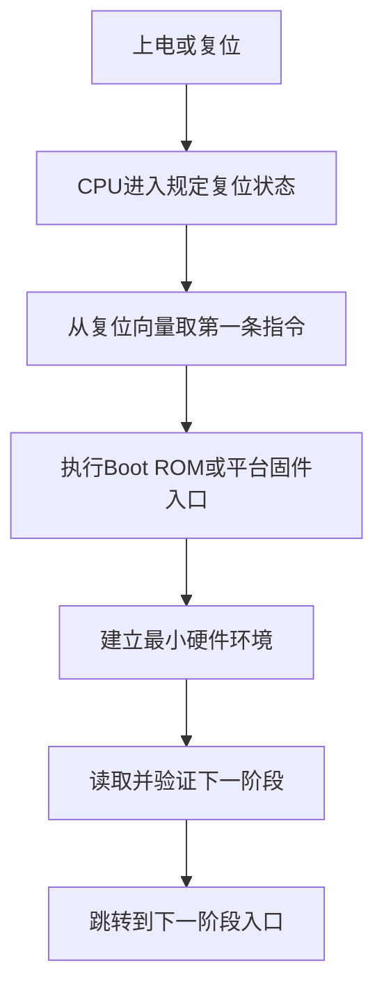
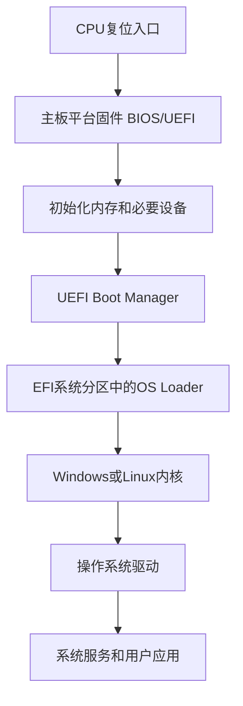
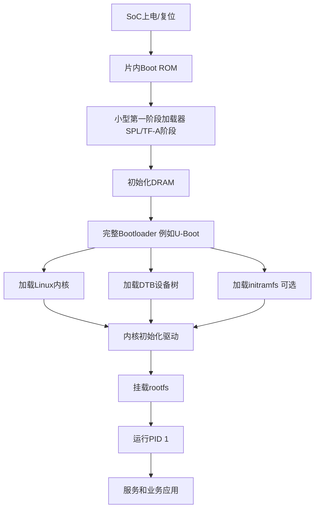
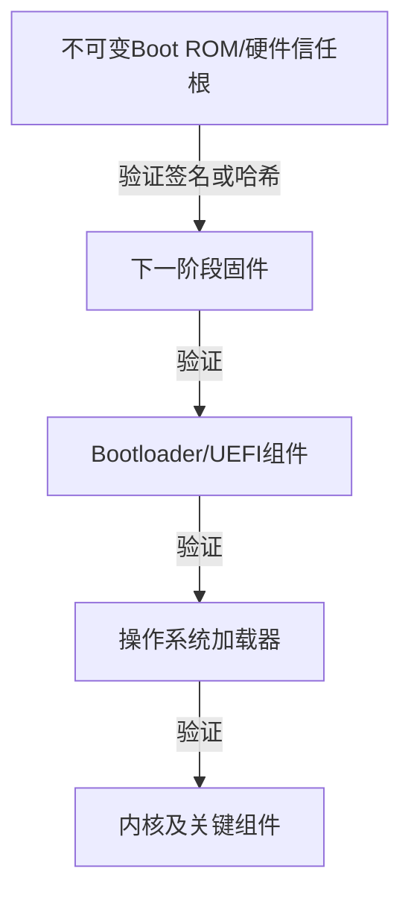

# 固件、ROM代码与计算机启动链

> [!summary] 一句话解释
> **固件（Firmware）是贴近硬件、负责初始化和控制设备的软件；ROM 代码通常是芯片复位后最先执行、存放在片内只读区域或受保护非易失性存储中的代码，它建立最小运行环境并寻找、验证、加载下一阶段程序。**

---

## 一、先用“新工厂开工”理解

把一台刚通电的计算机想成一座刚接通电源的工厂：

- CPU 像刚醒来的总负责人；
- ROM 代码像刻在门口的第一张开工流程卡；
- Bootloader 像负责开启更多车间、搬入操作手册的启动主管；
- BIOS/UEFI 像 PC 的开机管理系统；
- 操作系统像工厂正式投入运行后的总管理系统；
- 驱动像各类机器的专业操作员；
- 设备固件像设备内部自己的控制程序。

刚上电时：

- 磁盘里的 Windows 还没有运行；
- 内存中还没有完整操作系统；
- 文件系统和普通驱动也还没准备好；
- CPU 只能从芯片架构规定的初始位置开始取指令。

所以必须有一小段在操作系统之前就能执行的代码，一步步把系统启动起来。

---

## 二、Firmware 固件是什么

**Firmware（固件，读作“firm-ware”）**是一类与特定硬件紧密结合、负责设备初始化、控制、管理或启动的软件。

典型固件包括：

- PC 主板的 BIOS/UEFI 固件；
- SSD 控制器固件；
- 网卡固件；
- 显卡固件；
- 路由器固件；
- 键盘、鼠标和耳机固件；
- 摄像头、打印机固件；
- 嵌入式设备中的 Bootloader、RTOS 或控制程序；
- MCU（微控制器）Flash 中的产品程序。

### 为什么叫“固件”

它位于硬件和普通软件之间：

```text
硬件电路
↕
固件：控制设备内部细节
↕
驱动：让操作系统使用设备
↕
操作系统
↕
应用程序
```

早期固件常烧录在难以修改的 ROM 中，所以给人“固化的软件”这种感觉。现代固件经常存放在可更新的 Flash 中，因此“固件”不等于“永远不能修改”。

### 固件是一个角色，不是某一种固定文件格式

固件可能表现为：

- 芯片内部看不到的 Mask ROM；
- SPI NOR Flash 中的主板固件；
- MCU 内部 Flash 中的机器码；
- 磁盘上的 `.bin`、`.hex`、`.rom`、`.cap` 或厂商升级包；
- 操作系统启动后由驱动加载到设备 RAM 中的固件 blob；
- 包含内核、根文件系统和应用的整机“固件镜像”。

文件扩展名只能提供线索，不能单独证明内容是什么。

---

## 三、ROM 是什么

**ROM（Read-Only Memory，只读存储器，读作“R-O-M”或“rom”）**原本指正常工作时主要用于读取、内容不容易被修改的非易失性存储器。

### 常见 ROM 和非易失性存储类型

| 类型 | 全称 | 特点 |
|---|---|---|
| Mask ROM | 掩膜只读存储器 | 制造芯片时写定，通常不能现场改写 |
| PROM | Programmable ROM，可编程只读存储器 | 通常可编程一次 |
| EPROM | Erasable PROM，可擦除可编程 ROM | 传统器件可用紫外线擦除后重写 |
| EEPROM | Electrically Erasable PROM，电可擦除 ROM | 可以电气方式擦写，常按较小单位操作 |
| NOR Flash | NOR 闪存 | 支持随机读取，部分平台可直接取指，常存放启动代码 |
| NAND Flash | NAND 闪存 | 容量密度高，常用于 SSD、eMMC、UFS，通常需要控制器按页/块管理 |

现代工程语境里，“ROM”有时并不精确指某一种物理存储技术，还可能表示：

- 一块逻辑上只读的地址区域；
- 被硬件锁定的 Flash 区域；
- 芯片内部不可更新的启动代码；
- 模拟器或游戏使用的 ROM image（ROM 镜像文件）；
- Android 等语境中的整套系统镜像。

所以听到“ROM”时必须问：

> 指物理存储器、地址空间、启动代码，还是一个镜像文件？

---

## 四、ROM 代码是什么

“ROM 代码”通常指存放在 ROM 或等效受保护区域中的可执行机器代码。

在 SoC（System on Chip，片上系统）启动语境中，它常特指：

> **Boot ROM：芯片复位后首先执行的片内启动代码。**

### Boot ROM 的典型任务

不同芯片差异很大，但 Boot ROM 可能负责：

- 建立 CPU 最初始状态；
- 初始化少量片内 SRAM、时钟或安全模块；
- 读取引脚、熔丝或启动配置；
- 判断从 eMMC、SPI Flash、SD 卡、USB、UART 还是网络启动；
- 从启动介质读取下一阶段镜像；
- 计算哈希并验证数字签名；
- 检查防回滚版本；
- 进入量产烧录或恢复模式；
- 把下一阶段代码放入 SRAM/DRAM；
- 跳转到下一阶段入口地址。

### 为什么 Boot ROM 要很小

Boot ROM 往往在制造芯片时就固定下来：

- 占用芯片面积；
- 发现缺陷后很难或无法更新；
- 它位于整个启动信任链的根部；
- 功能越复杂，漏洞和测试范围越大。

因此它通常只完成最小且关键的工作，再把复杂初始化交给可更新的后续固件。

> [!important]
> Boot ROM 不一定已经能够访问完整 DRAM、磁盘文件系统和所有外设。很多芯片会先把一个很小的第二阶段加载到片内 SRAM，由后续阶段初始化 DRAM，再加载更大的程序。

---

## 五、CPU 上电后为什么会执行 ROM 代码

CPU 复位后，硬件会把部分寄存器设置成规定状态，并从架构规定的 **Reset Vector（复位向量）**或入口位置开始取第一条指令。

芯片设计会保证这个入口位置能够对应到：

- 片内 Mask ROM；
- 映射到启动地址的 NOR Flash；
- 主板固件 Flash 的特定区域；
- 一段硬件选择出来的启动存储。

简化流程：



不是 CPU 自己“理解 Windows 在哪里”，而是硬件规范先规定一个确定入口，启动代码再逐级寻找更复杂的软件。

---

## 六、为什么启动通常分很多阶段

刚上电时可用能力太少，而完整操作系统太大，不能一步完成所有工作。

分阶段可以逐步获得能力：

```text
阶段0：片内ROM，只依赖芯片最基本能力
阶段1：小型加载器，初始化时钟和片内资源
阶段2：初始化DRAM和更多控制器
阶段3：完整Bootloader或UEFI环境
阶段4：加载操作系统内核
阶段5：内核加载驱动并挂载根文件系统
阶段6：启动系统服务和应用
```

每一阶段的基本任务可以概括为：

```text
建立自己需要的环境
→ 找到下一阶段
→ 验证下一阶段
→ 加载或映射下一阶段
→ 传递参数
→ 交出控制权
```

实际产品中的阶段名称和数量会不同。

---

## 七、Bootloader 是什么

**Bootloader（引导加载程序/启动加载器，读作“boot-loader”）**负责准备运行环境并加载下一阶段程序，最终通常把操作系统内核放入内存并跳转过去。

它可能负责：

- 初始化 DRAM；
- 初始化存储控制器；
- 读取分区表和文件系统；
- 选择启动槽位；
- 加载内核、initramfs 和设备树；
- 验证签名；
- 处理启动参数；
- 提供恢复、烧录或调试命令；
- 在升级失败时回滚。

嵌入式 Linux 常见 U-Boot；Android 设备有自己的启动加载体系；PC 的 UEFI Boot Manager 会加载 Windows Boot Manager、GRUB 等 OS Loader。

### Bootloader 是不是固件

通常可以把 Bootloader 看作固件的一种，因为它：

- 运行在操作系统之前；
- 与平台硬件和启动流程紧密结合；
- 常存放在非易失性存储中。

但“固件”范围更广，SSD 控制程序、键盘控制代码等并不都是 Bootloader。

### Boot ROM 和 Bootloader 的边界

| 对比 | Boot ROM | Bootloader |
|---|---|---|
| 所在位置 | 常在芯片片内 ROM 或锁定区域 | 常在外部/内部 Flash、eMMC 或磁盘 |
| 可更新性 | 通常不可更新或极难更新 | 通常可以受控更新 |
| 体积 | 通常很小 | 可以更大、更复杂 |
| 主要任务 | 建立最小信任根并加载下一阶段 | 初始化更多硬件并加载 OS/应用 |
| 出错恢复 | 可能保留最低级下载模式 | 可实现 A/B、回滚、恢复菜单 |

边界并非所有平台都完全相同。有的资料也会把不可变的 Boot ROM 称为“第一阶段 Bootloader”。

---

## 八、PC 上的 BIOS 和 UEFI 是什么

### BIOS

**BIOS（Basic Input/Output System，基本输入/输出系统）**是传统 PC 平台固件体系。它负责早期硬件初始化并寻找可启动设备。

传统 BIOS 启动方式经常读取磁盘的 MBR 启动代码，再逐步加载操作系统。

### UEFI

**UEFI（Unified Extensible Firmware Interface，统一可扩展固件接口）**定义操作系统加载器与平台固件之间的一套现代接口和启动环境。

UEFI 固件可以：

- 初始化平台；
- 提供启动期服务；
- 读取 NVRAM 中的启动项；
- 访问 EFI System Partition；
- 加载 UEFI 驱动和应用；
- 启动 Windows Boot Manager、GRUB 等 OS Loader；
- 实现 Secure Boot 等验证机制；
- 提供固件设置界面。

UEFI Forum 将 UEFI 定义为操作系统与平台固件之间的接口；UEFI Boot Manager 根据 NVRAM 启动变量决定加载哪些驱动、应用或操作系统加载器。

### PC 启动链简图



### 主板固件不一定是物理 Mask ROM

现代 PC 的 UEFI 固件通常存放在主板上的 SPI NOR Flash 中，可以更新。人们有时仍沿用“刷 BIOS”“ROM 芯片”等旧称，但物理介质可能是可擦写 Flash。

---

## 九、嵌入式 Linux 的启动链

一块常见 ARM SoC 板可能经历：



其中：

- Boot ROM 是芯片厂商固化的最早代码；
- SPL 等小阶段帮助初始化 DRAM；
- U-Boot 提供较完整的加载、恢复和命令能力；
- DTB 描述板上有哪些设备和资源；
- Linux 内核接管 CPU、内存和设备；
- 驱动让内核使用网卡、Flash、显示器等硬件；
- rootfs 提供用户空间程序和配置。

相关背景见 [[Linux为什么可以做得很小]] 和 [[嵌入式系统为什么经常使用Linux]]。

---

## 十、设备自己的固件怎样运行

复杂外设内部常有自己的处理器或微控制器。

### SSD 示例

SSD 内部固件可能负责：

- 解析 NVMe/SATA 命令；
- 维护逻辑地址到物理闪存的映射；
- 磨损均衡；
- 垃圾回收；
- 错误校正；
- 坏块管理；
- 温度和功耗控制；
- 健康信息和日志。

```text
操作系统存储驱动
→ NVMe/SATA命令
→ SSD控制器上的固件
→ NAND闪存和内部电路
```

### 网卡示例

高性能网卡固件可能处理：

- 链路训练和协商；
- 队列管理；
- 数据包过滤；
- 校验和、分段等硬件卸载；
- 电源管理；
- 管理和诊断。

### 固件可能由驱动加载

某些设备没有把完整固件永久放在设备 Flash 中。操作系统启动后，驱动会从文件系统取得固件 blob，再上传到设备 RAM。

这意味着：

```text
驱动已经存在
但固件文件缺失
→ 设备仍可能无法工作
```

Linux 内核提供 `request_firmware` 等固件加载机制，用于驱动请求固件文件。驱动和固件是配合关系，不是同一个东西。

---

## 十一、驱动和固件的区别

| 对比 | 驱动 Driver | 固件 Firmware |
|---|---|---|
| 主要运行位置 | 主机操作系统的用户/内核空间 | 设备控制器或平台早期环境 |
| 面向对象 | 操作系统接口和设备 | 设备内部电路、启动和控制逻辑 |
| 启动时间 | 通常 OS 启动期间或之后 | 可能上电后立即运行，早于 OS |
| 常见更新方式 | Windows Update、驱动包、包管理器 | 厂商刷新工具、UEFI Capsule、设备升级包 |
| 常见故障 | 设备无法使用、性能异常、蓝屏 | 无法启动、设备失效、内部行为异常 |
| 示例 | Windows 网卡 `.sys` 驱动 | 网卡控制器内部代码 |

完整的驱动说明见 [[设备驱动：操作系统控制硬件的翻译层]]。

一个很实用的记法：

```text
驱动更像“主机这边怎样使用设备”
固件更像“设备内部怎样把自己运行起来”
```

但边界并非绝对。例如 UEFI 驱动本身运行在平台固件环境中，也属于固件体系的一部分。

---

## 十二、ROM、RAM 和 Flash 的关系

| 存储 | 断电保留 | 是否容易改写 | 常见用途 |
|---|---:|---:|---|
| Mask ROM | 是 | 基本不能 | 不可变 Boot ROM、固定逻辑 |
| NOR Flash | 是 | 可以按块擦写 | 主板固件、Bootloader、MCU代码 |
| NAND Flash | 是 | 可以按页写、按块擦 | SSD、eMMC、UFS、大容量存储 |
| EEPROM | 是 | 可以电气擦写 | 少量配置、校准和标识数据 |
| SRAM | 否 | 快速读写 | 片内早期工作区、缓存 |
| DRAM | 否 | 快速读写并需刷新 | 操作系统和应用主要运行内存 |

### 代码一定从 ROM 原地执行吗

不一定。

可能有两种方式：

1. **XIP（Execute In Place，原地执行）**：CPU 直接从映射的 NOR Flash/ROM 取指；
2. **Copy and Execute（复制后执行）**：启动代码从存储读取程序，复制或解压到 SRAM/DRAM，再跳转执行。

大型系统通常会把大部分代码放进 RAM 运行，因为 RAM 延迟和带宽更适合持续执行，且代码、栈和数据需要可写工作空间。

### ROM 中的代码运行时也需要 RAM 吗

经常需要。即使指令来自 ROM，程序仍可能需要：

- 栈；
- 局部变量；
- 缓冲区；
- 设备状态；
- 解密和验签工作区。

最早阶段可能先使用 CPU 寄存器和少量片内 SRAM，等 DRAM 初始化后再获得更大空间。

---

## 十三、CPU Microcode 微码是什么

**Microcode（微码）**是部分 CPU 用来实现或修正复杂指令内部行为的低层控制机制。

可以粗略理解为：

```text
程序中的机器指令
→ CPU译码
→ 某些指令由更底层微操作/微码实现
→ 执行单元完成运算
```

CPU 厂商可能发布微码更新以：

- 修复处理器勘误；
- 缓解安全问题；
- 调整特定内部行为。

微码更新可能由：

- BIOS/UEFI 在开机早期加载；
- 操作系统在启动过程中加载更新版本；

应用到 CPU。

微码常被广义归入固件，但它不是普通设备驱动，也不等于主板的整套 UEFI 固件。

---

## 十四、Option ROM 是什么

**Option ROM（扩展设备 ROM）**是扩展设备提供给平台启动环境使用的固件代码或数据。

传统或 UEFI 平台中，某些：

- 网卡；
- RAID 控制器；
- 显卡；
- 存储控制器；

可能提供 Option ROM，使设备在操作系统启动之前就能使用。例如：

- 网络 PXE 启动；
- RAID 配置；
- 显示启动画面；
- 从特殊存储控制器启动。

现代 UEFI Option ROM 可能包含 UEFI 驱动。它与 Windows 启动后的 `.sys` 驱动不是同一个运行阶段。

---

## 十五、安全启动和信任链

如果攻击者能修改最早期固件，就可能在操作系统和杀毒软件启动之前运行恶意代码。因此安全启动通常建立 **Chain of Trust（信任链）**。

简化流程：



每个阶段只在验证通过后执行下一阶段。

### Secure Boot

PC 上的 **Secure Boot（安全启动）**是 UEFI 安全机制的一部分，用受信任密钥验证 UEFI 驱动、应用和 OS Loader。

它主要保护启动链，并不等于：

- 所有固件都绝对安全；
- 操作系统内没有漏洞；
- 应用程序不会中毒；
- 用户数据自动加密。

### Anti-rollback

**Anti-rollback（防回滚）**阻止攻击者把设备刷回存在已知漏洞的旧固件版本。

但防回滚会影响维修和降级，因此需要可靠的版本策略、恢复路径和密钥管理。

### 固件韧性

NIST SP 800-193 将平台固件韧性的核心思路概括为：

- Protect：阻止未经授权的修改；
- Detect：检测固件是否被异常改变；
- Recover：安全快速地恢复可信版本。

---

## 十六、固件怎样更新

固件更新通常包含：

```text
厂商构建固件镜像
→ 生成版本和兼容信息
→ 对镜像签名
→ 更新工具验证设备型号和签名
→ 写入可更新Flash区域
→ 重启进入新版本
→ 验证启动结果
```

可能采用：

- 主板 UEFI 自带更新工具；
- Windows Update 的 Firmware Capsule；
- 设备厂商应用；
- USB 恢复方式；
- Bootloader 的更新命令；
- OTA（Over-the-Air，空中下载）更新；
- A/B 双槽升级。

### A/B 更新

设备保留 A、B 两套启动槽：

```text
当前从A运行
→ 把新固件写入B
→ 验证B
→ 下次尝试从B启动
→ 成功后确认B
→ 失败则回退A
```

它能降低更新中断导致“变砖”的风险，但会增加存储占用和状态管理复杂度。

---

## 十七、为什么刷错固件会“变砖”

**Brick（变砖）**表示设备无法正常启动或使用，像砖头一样失去主要功能。

可能原因：

- 固件型号不匹配；
- 写入过程断电；
- 更新包损坏；
- 签名、版本或分区配置错误；
- Bootloader 自身被覆盖；
- 校准数据或设备唯一信息被破坏；
- 新固件与硬件版本不兼容；
- 回滚保护阻止旧版本启动。

### Soft Brick 和 Hard Brick

- **Soft Brick（软变砖）**：仍能进入恢复、Bootloader 或下载模式，可以软件恢复；
- **Hard Brick（硬变砖）**：最早启动路径都无法工作，可能需要硬件编程器、调试接口或返厂。

### 更新前的安全原则

1. 确认设备精确型号、硬件修订和地区版本；
2. 只使用厂商可信来源；
3. 阅读更新说明和恢复说明；
4. 保证电源和电池稳定；
5. 暂停可能中断更新的操作；
6. 备份数据、设置和恢复密钥；
7. Windows 设备确认 BitLocker 恢复密钥可用；
8. 不要为了版本号而无目的刷新固件；
9. 生产设备先在相同测试设备验证；
10. 不要绕过签名或防回滚机制刷来源不明镜像。

> [!danger]
> 驱动安装失败通常还有较成熟的系统恢复方法；最早期平台固件损坏可能使设备连恢复环境都无法进入。固件更新的风险通常高于普通应用更新。

---

## 十八、不可修改的 ROM 就一定安全吗

不一定。

不可修改的优点：

- 攻击者难以持久篡改；
- 可以作为硬件信任根；
- 恢复路径不容易被更新覆盖。

但如果 ROM 代码本身有漏洞：

- 无法像普通软件一样直接打补丁；
- 大量同型号芯片都可能受影响；
- 只能由后续阶段绕过、限制或缓解；
- 严重时需要新芯片修订。

因此 Boot ROM 需要：

- 尽可能小；
- 严格验证输入长度和格式；
- 安全的密码学实现；
- 明确的密钥撤销和版本策略；
- 经过保护的恢复模式；
- 对调试和量产接口做生命周期控制。

“不可变”是安全设计条件之一，不是自动安全证明。

---

## 十九、固件是不是操作系统

取决于语境，但通常不是同一个概念。

### 普通 PC 语境

- UEFI 是平台固件；
- Windows/Linux 是操作系统；
- 两者是不同层级。

### 小型微控制器

一个 MCU 程序可能直接：

- 初始化硬件；
- 处理中断；
- 运行控制循环；
- 完成整个产品功能。

它通常被称为固件，设备可能根本没有通用操作系统。

### 嵌入式 Linux 设备

厂商下载页可能把：

```text
Bootloader + Linux内核 + 驱动 + rootfs + 应用
```

整体称为“Firmware Image（固件镜像）”。这里“固件”是产品交付包的广义叫法，其中实际上包含操作系统。

所以不能只靠名称判断内部结构。

---

## 二十、常见文件和名词怎样理解

| 名称 | 常见含义 | 注意事项 |
|---|---|---|
| `.bin` | 原始二进制镜像 | 不包含统一的地址和符号约定 |
| `.hex` | 常见文本编码固件格式 | 可能包含地址和校验信息 |
| `.elf` | 带段、符号等信息的可执行格式 | 烧录前可能转换成 bin/hex |
| `.rom` | ROM 镜像或厂商格式 | 扩展名不能保证可直接刷写 |
| `.cap` | 某些 UEFI Capsule 更新包 | 具体结构由平台规范和厂商决定 |
| Bootloader | 启动加载程序 | 可能包含多个阶段 |
| Boot ROM | 芯片最初启动代码 | 常不可更新 |
| BIOS/UEFI | PC 平台固件体系 | UEFI 不只是一个设置界面 |
| Firmware blob | 二进制固件数据 | 可能由驱动上传到设备 |
| Microcode | CPU 内部低层控制更新 | 不等于普通驱动 |
| Option ROM | 设备提供的启动期代码 | 可为预启动网络/存储服务 |

不要只因为某文件后缀是 `.rom` 或 `.bin` 就尝试刷写。更新工具还需要确认：

- 芯片型号；
- 映射地址；
- 分区布局；
- 签名；
- 校验；
- 版本；
- 硬件修订；
- 加密和压缩格式。

---

## 二十一、怎样在 Windows 查看平台固件信息

### 系统信息

按 `Win + R`，运行：

```text
msinfo32
```

可以看到类似：

- BIOS 版本/日期；
- BIOS 模式：UEFI 或传统；
- Secure Boot 状态；
- 主板和系统型号。

### PowerShell

```powershell
Get-CimInstance Win32_BIOS |
  Select-Object Manufacturer, SMBIOSBIOSVersion, ReleaseDate
```

这是读取信息，不会更新固件。

### 设备管理器

部分电脑会在：

```text
设备管理器 → 固件 → 系统固件
```

显示由 Windows 管理的平台固件设备和版本。

具体更新仍应以电脑或主板厂商支持页面为准，不能只根据 `msinfo32` 中一个版本字符串猜测升级包。

---

## 二十二、常见误区

### 误区 1：固件就是驱动

错误。驱动通常运行在主机操作系统一侧，固件通常运行在平台或设备内部。二者经常配合。

### 误区 2：固件一定存放在真正不可修改的 ROM

错误。现代固件经常存放在可更新 Flash 中。

### 误区 3：ROM 一定是一个具体芯片

错误。ROM 还可能指逻辑只读区域、镜像文件或受保护 Flash 区域。

### 误区 4：Boot ROM 就是完整 Bootloader

不一定。Boot ROM 通常只完成最小加载和验证，后面可能有多个 Bootloader 阶段。

### 误区 5：UEFI 就是开机按键进入的设置界面

错误。设置界面只是平台固件的一部分；UEFI 还定义启动服务、运行时服务、Boot Manager、变量和 OS Loader 接口。

### 误区 6：Bootloader 就是操作系统内核

错误。Bootloader 负责加载并启动内核；内核接管后才管理进程、内存、驱动和文件系统。

### 误区 7：固件版本越新越应该立刻刷

错误。应先看安全修复、兼容需求、厂商建议、风险和恢复路径。

### 误区 8：固件签名代表不会出错

错误。签名证明来源和完整性，不证明代码没有逻辑漏洞。

### 误区 9：ROM 不可修改，所以不可能有漏洞

错误。不可修改会防篡改，也会让已存在的漏洞更难修复。

### 误区 10：操作系统启动后固件就完全没用了

错误。设备固件持续控制设备；UEFI 也可能提供部分运行时服务；ACPI 等平台描述与固件行为仍影响电源和硬件管理。

---

## 二十三、先记住的九句话

1. **固件是贴近特定硬件的控制或启动软件。**
2. **ROM 代码通常指存放在只读或受保护非易失性区域中的代码。**
3. **Boot ROM 是芯片复位后最早的一段启动代码。**
4. **Boot ROM 通常加载 Bootloader，Bootloader 再加载操作系统。**
5. **现代固件经常存在 Flash 中，因此可以受控更新。**
6. **驱动主要在主机操作系统一侧，固件主要在设备或平台内部。**
7. **UEFI 是平台固件与 OS Loader 之间的现代接口和启动环境。**
8. **启动安全依赖逐阶段验证，而不是只信任最后的操作系统。**
9. **刷写错误固件可能导致设备无法启动，因此必须确认型号、来源、电源和恢复方案。**

---

## 二十四、相关概念

- [[设备驱动：操作系统控制硬件的翻译层]]：区分主机侧驱动与设备内部固件。
- [[磁盘与网卡：存储设备和网络接口]]：SSD 和网卡控制器为什么拥有自己的固件。
- [[内存映射、MMIO与代码控制硬件]]：启动代码和驱动怎样访问寄存器、Flash、RAM 与控制器。
- [[Linux为什么可以做得很小]]：Bootloader、内核、rootfs 和 PID 1 怎样组成最小启动链。
- [[嵌入式系统为什么经常使用Linux]]：Boot ROM、设备树、驱动和 rootfs 怎样适配板级硬件。
- [[密码学基础：AES-GCM、scrypt、Ed25519与SHA-256]]：签名、哈希和安全启动的密码学基础。
- [[密钥管理：DEK、KEK、KMS、HSM与信封加密]]：固件签名密钥和信任根为什么必须受控。
- [[软件供应链：代码签名、SBOM与发布门禁]]：固件构建、签名、版本和发布怎样保持可追溯。
- [[Minidump与Windows崩溃转储分析]]：驱动和固件兼容问题怎样表现为崩溃或蓝屏。

---

## 参考资料

以下资料核对日期：**2026-08-27**。

- [UEFI Forum：UEFI Specifications](https://uefi.org/specifications)
- [UEFI Specification：Introduction](https://uefi.org/specs/UEFI/2.10/01_Introduction.html)
- [UEFI Specification：Boot Manager](https://uefi.org/specs/UEFI/2.10/03_Boot_Manager.html)
- [UEFI Specification：Firmware Update and Reporting](https://uefi.org/specs/UEFI/2.10/23_Firmware_Update_and_Reporting.html)
- [NIST SP 800-193：Platform Firmware Resiliency Guidelines](https://csrc.nist.gov/pubs/sp/800/193/final)
- [Arm Platform Security Architecture：Trusted Boot and Firmware Update](https://developer.arm.com/-/media/Arm%20Developer%20Community/PDF/PSA/DEN0072-PSA_TBFU_1-0-REL.pdf)
- [Linux Kernel Documentation：Firmware API](https://docs.kernel.org/driver-api/firmware/index.html)
