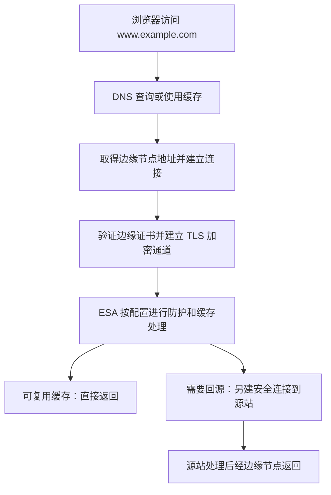

# 域名管理：WHOIS、RDAP、状态码与注册局安全锁

> [!summary] 一句话解释
> **WHOIS/RDAP 用来查域名登记信息，DNS 用来查访问地址，SSL/TLS 证书参与验证网站身份和建立加密连接，注册局安全锁保护域名登记层面的重要变更，ESA 则提供网站前面的边缘加速与防护。它们不是同一件事，也不是一个开关的不同名字。**

本文中的 ESA 按阿里云“边缘安全加速”产品解释；没有提供具体控制台截图或域名，因此不判断用户实际开通了哪些服务。

## 一、用一家网上店铺把这些词串起来

假设你经营一个课程网站，域名是 `www.example.com`。域名是方便人记忆的互联网名称，不是网站程序本身；注册域名也不等于已经买了服务器、做好了网页。

| 项目 | 生活类比 | 主要回答的问题 |
|---|---|---|
| 域名注册与续费 | 登记、续用店铺名称 | 这个名称目前由谁管理，使用期限到什么时候？ |
| WHOIS / RDAP | 查询登记资料 | 注册商是谁、有哪些状态、使用哪些名称服务器？ |
| DNS | 通讯录和指路信息 | 用这个名称访问时，应该找到哪个网络地址或服务？ |
| SSL/TLS 证书与安全连接 | 核验接待方身份，再使用加密通道交流 | 连接对象能否证明身份，传输如何防偷看和篡改？ |
| 注册局安全锁 | 重要登记变更需额外核验 | 能否阻止别人擅自转走、删除或修改域名登记？ |
| ESA | 各地的接待点、缓存仓和安检入口 | 能否更快交付内容，并过滤部分恶意访问？ |

这些只是分工类比。域名登记不是永久买断；数字证书也不是工商资质或商家诚信证明。

## 二、WHOIS：查域名登记资料，不是查网页内容

**WHOIS 读作“who is”，近似“胡伊兹”，字面意思是“是谁”**。它是传统的注册信息查询协议和服务名称，并不是一个需要展开为多词的英文首字母缩写。

在域名管理场景下，查询结果通常可能包含：

- 注册商名称：通过哪家机构办理注册。
- 创建时间、更新时间、登记到期时间。
- 域名状态：例如是否禁止转移、是否处于赎回期。
- 名称服务器：由哪些服务器提供权威 DNS 服务。
- 在政策允许范围内公开的注册联系信息。

查询结果不一定公开持有人的姓名、电话或邮箱。隐私保护、数据公开政策及不同后缀的规则都会影响展示；查不到个人信息，不等于域名没有持有人。

还要区分：**WHOIS/RDAP 看到的名称服务器，不等于网站当前全部解析记录，更不等于网站运行正常。**

### 现在为什么还会看到 RDAP

**RDAP 是 Registration Data Access Protocol（注册数据访问协议，按字母读 R-D-A-P）**，是更新一代的注册数据查询协议，支持结构化数据、安全访问和差异化信息公开等能力。

**ICANN 是 Internet Corporation for Assigned Names and Numbers（互联网名称与数字地址分配机构）**。其公告明确：从 **2025-01-28** 起，通用顶级域名的注册信息服务转向以 RDAP 为正式来源，取代原来的 WHOIS 服务要求。[ICANN 公告](https://www.icann.org/en/announcements/details/icann-update-launching-rdap-sunsetting-whois-27-01-2025-en)

因此，2026 年学习时不能只记“查域名就一定使用旧 WHOIS 协议”。一些网站仍把入口叫“WHOIS 查询”，但背后可能使用 RDAP；也不能把通用顶级域名的政策泛化成“所有国家和地区后缀都彻底没有 WHOIS”。

查询入口可使用 [ICANN Lookup](https://lookup.icann.org/en)。本文未查询某个实际用户域名。

## 三、域名“状态”具体指什么

控制台的“正常”“待验证”等标签可能是平台自定义状态。注册数据中常见的标准状态码则描述登记、转移限制或生命周期，并不是网站健康评分。

**EPP 是 Extensible Provisioning Protocol（可扩展供应协议）**，在这里用于注册商与注册局之间的域名管理交互。

| 常见状态码 | 初学者可以怎样理解 |
|---|---|
| `ok` | 没有其他待处理操作或禁止类状态；不代表网页、证书都正常 |
| `clientTransferProhibited` | 注册商侧禁止转移到另一家注册商，常见于防盗保护 |
| `clientUpdateProhibited` | 注册商侧禁止更新相关域名登记信息 |
| `serverTransferProhibited` | 注册局侧禁止转移 |
| `serverUpdateProhibited` | 注册局侧禁止更新相关登记信息 |
| `serverDeleteProhibited` | 注册局侧禁止删除 |
| `clientHold` / `serverHold` | 注册商或注册局侧使域名不在 DNS 中激活，通常导致不能正常解析 |
| `redemptionPeriod` | 处于赎回阶段，应尽快向注册商确认恢复条件 |
| `pendingDelete` | 处于待删除相关状态，应结合其他状态和注册商说明判断 |

同一域名可以出现多个状态。这里的 `client` 指注册商侧，不是你的浏览器；`server` 指注册局侧，不是你租用的网站服务器。[ICANN 状态码说明](https://www.icann.org/resources/pages/epp-status-codes-2014-06-16-en)

**“禁止转移”通常不妨碍网站正常访问，不能看见 Prohibited 就认为网站被封。**相反，Hold、到期与删除流程需要认真核实原因。不同后缀和服务商的续费、赎回规则不同，不应套用一个固定天数。

## 四、注册商、注册局和 DNS 服务商有什么区别

- **注册人（Registrant）**：登记使用域名的个人或组织。
- **注册商（Registrar）**：提供注册、续费、转移等办理服务的机构。
- **注册局（Registry）**：运营某个域名后缀注册系统的机构。例如 Verisign 运营 `.com`、`.net` 的注册系统。
- **DNS 服务商**：保存、提供你的域名解析记录的服务商。
- **网站托管或云服务商**：承载网站程序、文件等的服务商。

这些角色可以由同一家服务商提供部分组合，也可以分开。域名在一家注册，不代表 DNS 和网站也必须在同一家。

例如，更换网站服务器主要涉及网站迁移及解析配置；把域名从一家注册商转到另一家是另一种操作，不能混为一谈。

## 五、注册局安全锁：保护重要登记变更

**Registry Lock（注册局安全锁）** 是在注册局层面施加限制，并配合额外身份核验的保护机制。典型目标是防止域名被未经授权地转移、更新或删除。

以 Verisign 的服务为例，受保护变更需要注册商与注册局之间进行额外的带外认证，而不是只凭一次普通后台操作就解锁。**带外认证**可以理解为另外通过预先约定的渠道核验身份。[Verisign 注册局安全锁](https://www.verisign.com/resources/registrar-resources/registry-lock/)

### 与普通“禁止转移锁”比较

- 普通禁止转移锁主要阻止域名转出，常见状态为 `clientTransferProhibited`。
- 注册局安全锁通常涉及注册局设置的禁止更新、禁止转移和禁止删除，并有额外的解锁核验流程。
- 具体保护对象、支持后缀、价格、操作时效及解锁流程，必须以所购买服务为准。

阿里云也提供对应产品，但不是所有后缀和所有变更都按同一个流程处理；本篇不固化套餐价格或办理时长。[阿里云注册局安全锁说明](https://help.aliyun.com/zh/dws/user-guide/use-the-security-lock-of-domain-name-registries)

### 它没有保护哪些事情

**不能把注册局锁理解为“锁住所有 DNS 记录”，更不是去锁住全球 DNS 根服务器。**

需要分清两层：

1. 在域名登记层面，改用哪些名称服务器、转移域名等操作。
2. 在现有 DNS 服务商内部，修改 `www` 的地址等解析记录。

注册局锁主要针对其管理范围内的登记对象和变更；DNS 服务商内部的解析记录还需要该服务商的账号权限、审计和记录保护。阿里云也明确，其注册商禁止更新锁不影响 DNS 控制台中具体解析记录的增删改。[禁止更新锁的保护边界](https://help.aliyun.com/zh/dws/user-guide/enable-the-update-prohibition-lock)

它也不代替域名续费、网站漏洞修复、证书续期、服务器安全或流量攻击防护。看到某个 `server...Prohibited` 状态，不能单凭这一项就断言已经购买完整的注册局锁服务，仍要核实登记原因与服务状态。

## 六、DNS：这个域名应该找谁

**DNS 是 Domain Name System（域名系统，读作 D-N-S）**。它按名称查询对应记录，最常见的用途是帮助找到 **IP 地址（Internet Protocol Address，互联网协议地址）**，供程序建立网络连接。

例如，`www.example.com` 可以解析到你的网站服务器，也可以解析到 ESA 的边缘节点。DNS 通常不负责传输后续网页内容，更不负责把网页自动加密。

常见记录名可以先这样认识：

- `A`（Address，地址记录）：指向 IPv4，即互联网协议第 4 版地址。
- `AAAA`（四个 A，地址记录）：指向 IPv6，即互联网协议第 6 版地址。
- `CNAME`（Canonical Name，规范名称记录）：指向另一个名称，是别名关系，不是浏览器地址栏跳转。
- `NS`（Name Server，名称服务器记录）：说明由哪些名称服务器提供权威解析。
- `TXT`（Text，文本记录）：存放文本信息，常用于域名控制权验证等。

记录用途依据：[DNS 记录类型文档](https://developers.cloudflare.com/dns/manage-dns-records/reference/dns-record-types/)。完整解析过程、缓存与根服务器关系继续阅读 [[DNS域名系统]]。

## 七、SSL 证书：帮助验证连接对象，并配合建立加密通道

**SSL 是 Secure Sockets Layer（安全套接层，读作 S-S-L）**；其旧协议已经过时。日常“SSL 证书”通常仍沿用这个商品名称，实际现代安全连接使用 **TLS，即 Transport Layer Security（传输层安全协议）**。

**HTTPS 是 Hypertext Transfer Protocol Secure（安全的超文本传输协议）**，可以先理解为通过 TLS 保护的网页通信。

网站证书包含受保护的域名、公钥、有效期和签发信息等，由 **CA，即 Certificate Authority（证书颁发机构）** 签发。浏览器会检查证书是否覆盖当前访问的名称、是否在有效期内、信任链是否成立等，并结合服务器在握手中的证明建立安全连接。

**证书不是单独把网页加密的“魔法文件”**；它参与身份验证，实际连接还依赖相应私钥、TLS 握手和后续加密机制。完整原理见 [[TLS与数字证书]]。

常见的域名验证证书主要确认申请者能控制相应域名。它不证明商家诚信，也不证明网站没有病毒或业务漏洞。Let's Encrypt 的签发流程就展示了如何通过域名控制权验证申请证书。[证书签发原理](https://letsencrypt.org/how-it-works/)

另一个重要区别：**域名到期与证书到期是不同的期限**。域名续费，不会自动让所有证书续期；证书已签发，也不表示已部署到实际接待用户的服务器或边缘节点。

## 八、ESA：网站前面的边缘加速和安全服务

**ESA 是 Edge Security Acceleration（边缘安全加速，读作 E-S-A）**。这里按阿里云产品理解，它组合了内容加速、安全防护和边缘计算能力，不是另一种域名或证书。[阿里云 ESA 概述](https://help.aliyun.com/zh/edge-security-acceleration/esa/product-overview/what-is-esa)

**CDN 是 Content Delivery Network（内容分发网络）**。可以先把 ESA 看作包含 CDN 类交付能力，并整合多种安全与边缘能力的产品，而不是所有 CDN 的通用新名字。

在典型网页代理模式下，浏览器先与边缘节点通信；能按规则复用的缓存内容可由节点返回，其他请求再转向源站。**源站**就是原始提供网站内容或处理业务请求的系统。

具体接入方式、缓存、攻击防护和两段加密，见 [[CDN内容分发网络：边缘缓存、回源与加速#十五、ESA：把加速、安全与边缘能力组合起来|ESA 专节]]。

仅把域名加入控制台，或仅使用 DNS 解析，并不自动说明访问流量已经过 ESA 代理。必须核对站点、相关记录的代理状态和实际接入结果。[ESA 接入说明](https://www.alibabacloud.com/help/en/edge-security-acceleration/esa/getting-started/add-your-website-to-esa)

## 九、实际访问网站时，它们怎样配合

假设网站使用 ESA 的常规网页代理，并正确配置两段安全连接：

这是教学简化图，不描述连接复用、不同传输协议等全部细节。

WHOIS/RDAP 查询和注册局安全锁不在每次网页请求的上述主路径里：前者用于查登记资料，后者用于约束管理变更。源站回源加密也要单独配置和验证，不能因为浏览器显示 HTTPS 就认为所有链路自动安全。

## 十、看控制台时应该分层判断

| 看到的情况 | 应该先想到什么 |
|---|---|
| 注册信息正常，但网页打不开 | 还要看 DNS、证书、边缘接入、源站和应用本身 |
| 显示禁止转移 | 可能只是防盗限制，不应为“变绿”而盲目关锁 |
| 显示 Hold、赎回或待删除 | 向注册商核实原因和恢复流程，不要仅反复修改解析记录 |
| 域名仍有效，但浏览器报证书过期 | 分别检查证书续期和实际部署位置 |
| 已开注册局锁，但解析被修改 | 核实改的是登记层名称服务器，还是 DNS 服务商内部记录 |
| 已加 ESA，但流量没有经过边缘节点 | 检查接入、解析和代理是否真正生效 |
| 浏览器到边缘正常，但回源失败 | 检查源站地址、连通性、端口、回源协议和证书验证 |

上述是排查方向，不是对用户域名的诊断。没有具体域名、状态文本和访问现象，不能直接判定哪一层出了问题。

## 学习建议与关联概念

先记“登记、指路、验身份与加密、防改登记、边缘交付”这五个职责，再深入协议与配置。

- [[DNS域名系统]]：解析、缓存、权威服务器与根服务器。
- [[TLS与数字证书]]：证书、公私钥和连接保护。
- [[CDN内容分发网络：边缘缓存、回源与加速]]：节点、缓存与 ESA。
- [[防火墙与端口对外开放]]：解析正确后，为何连接仍可能失败。
- [[SDK与API]]：了解“提供服务”和“开放调用接口”的区别。

## 参考资料

核对日期：2026-10-02。本文没有购买服务、修改域名解析、申请证书或开关域名锁。

- [ICANN：RDAP 接替 WHOIS 的公告](https://www.icann.org/en/announcements/details/icann-update-launching-rdap-sunsetting-whois-27-01-2025-en)
- [ICANN：EPP 状态码](https://www.icann.org/resources/pages/epp-status-codes-2014-06-16-en)
- [ICANN Lookup：注册信息查询](https://lookup.icann.org/en)
- [Verisign：Registry Lock](https://www.verisign.com/resources/registrar-resources/registry-lock/)
- [阿里云：注册局安全锁](https://help.aliyun.com/zh/dws/user-guide/use-the-security-lock-of-domain-name-registries)
- [阿里云：禁止更新锁及其边界](https://help.aliyun.com/zh/dws/user-guide/enable-the-update-prohibition-lock)
- [Cloudflare：DNS 记录类型](https://developers.cloudflare.com/dns/manage-dns-records/reference/dns-record-types/)
- [Let's Encrypt：证书签发原理](https://letsencrypt.org/how-it-works/)
- [阿里云：ESA 产品概述](https://help.aliyun.com/zh/edge-security-acceleration/esa/product-overview/what-is-esa)
- [Alibaba Cloud：ESA 接入与 DNS-only 的边界](https://www.alibabacloud.com/help/en/edge-security-acceleration/esa/getting-started/add-your-website-to-esa)
