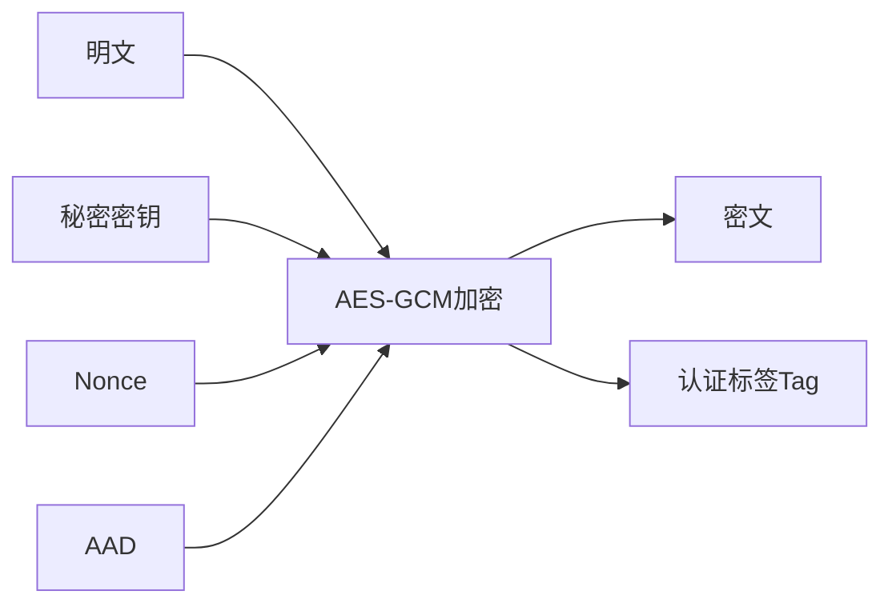
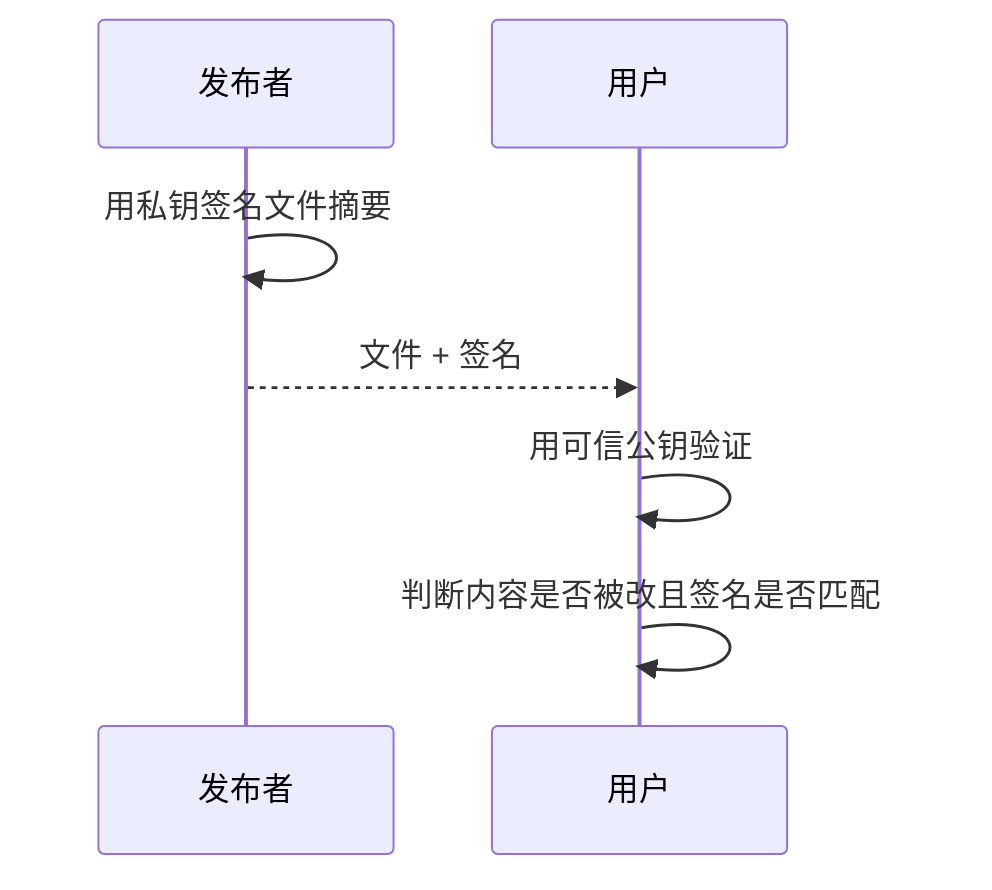

# 密码学基础：AES-GCM、scrypt、Ed25519 与 SHA-256

> [!summary] 一句话区分
> **AES-GCM 用密钥加密并检测篡改；scrypt 把人类口令变成更难暴力猜测的密钥材料；Ed25519 用私钥签名、公钥验证；SHA-256 计算固定长度指纹，但不能解密回原文。**

## 四种工具不是一回事

| 技术 | 输入 | 是否需要秘密 | 主要用途 |
|---|---|---|---|
| AES-GCM | 明文、密钥、Nonce、AAD | 需要对称密钥 | 加密与完整性验证 |
| scrypt | 口令、Salt、成本参数 | 口令是秘密 | 派生密钥、提高猜密码成本 |
| Ed25519 | 消息、私钥 | 私钥是秘密，公钥公开 | 数字签名和身份验证 |
| SHA-256 | 任意字节 | 不需要密钥 | 文件指纹、完整性比较 |

生活类比：

- AES-GCM：带防拆封条的密码箱；
- scrypt：把用户记得住的口令加工成机器使用的钥匙；
- Ed25519：只有本人能盖的印章，但所有人都能验章；
- SHA-256：给文件计算指纹。

## AES-GCM

**AES（Advanced Encryption Standard，高级加密标准）**是对称分组密码；**GCM（Galois/Counter Mode）**是一种认证加密模式。

“对称”表示加密和解密使用同一把秘密密钥。



解密时如果密钥、Nonce、AAD、密文或 Tag 不匹配，程序应该得到失败，而不是输出“可能正确”的明文。

### Nonce 是什么

**Nonce（Number used once，一次性数值）**在同一密钥下必须按算法要求保持唯一。

GCM 下重复使用 Key + Nonce 会严重破坏机密性和完整性。Nonce 通常不需要保密，可以和密文一起保存，但必须正确生成和管理。

### AAD 是什么

**AAD（Additional Authenticated Data，附加认证数据）**不会被加密，但会被完整性保护。

例如把下面信息作为 AAD：

```text
tenantId + recordType + keyId
```

攻击者即使复制密文，也不能把它悄悄换到另一个租户或记录类型而仍通过认证。

### AES-256 里的 256

它表示密钥长度为 256 位，不代表密文、Nonce 或 Tag 都是 256 位，也不意味着实现自动安全。

## scrypt

人类密码通常熵不高，不能直接当作 AES 密钥。**scrypt** 是 Password-Based Key Derivation Function（基于口令的密钥派生函数）。

```text
用户口令 + 随机Salt + N/r/p参数
  ↓ scrypt
派生密钥
```

### 为什么要故意变慢

合法用户偶尔解锁一次，多等几十或几百毫秒可以接受；攻击者如果要猜十亿个密码，每次都要付出 CPU 和内存成本。

scrypt 采用 memory-hard（内存困难）设计，目的是减少攻击者使用定制并行硬件的优势。

### Salt 是什么

**Salt（盐）**是每个密码记录独立生成的随机值。它不需要保密，但要与结果一起保存。

Salt 可以阻止：

- 相同密码产生相同结果；
- 直接复用预计算彩虹表。

Salt 不能让弱密码变强，也不能代替成本参数。

### N、r、p

- `N`：CPU/内存成本，通常要求是大于 1 的 2 的幂；
- `r`：块大小参数；
- `p`：并行化参数。

参数要根据目标设备、可接受延迟和当前硬件基准选择，并记录版本，便于未来升级。

## SHA-256

**SHA-256（Secure Hash Algorithm 256-bit，安全哈希算法）**把任意长度输入映射成 256 位摘要。

```text
SHA-256("hello") → 固定长度摘要
```

主要性质：

- 相同输入得到相同摘要；
- 输入变化一点，摘要通常大幅变化；
- 很难从摘要反推出原文；
- 很难找到两个输入具有相同摘要。

### 常见用途

- 下载文件校验；
- 发布清单；
- 内容寻址；
- 签名前先计算消息摘要；
- 数据迁移前后比对。

### SHA-256 不是加密

哈希没有解密钥匙。它也不适合直接保存密码，因为普通 SHA-256 速度太快，攻击者可以高速猜测。密码应使用 scrypt、Argon2、PBKDF2 等专用 KDF。

### 哈希也不自动证明发布者身份

如果攻击者同时替换文件和网页上的哈希，用户仍会得到匹配结果。要证明哈希来自可信发布者，需要数字签名或可信渠道。

## Ed25519

**Ed25519** 是 EdDSA（Edwards-curve Digital Signature Algorithm）的一种数字签名方案。

它使用一对密钥：

- 私钥：只能由签名者保存；
- 公钥：可以公开给验证者。



### 数字签名解决什么

- 完整性：签名后内容是否改变；
- 来源验证：是否由对应私钥持有者签名；
- 可审计发布：把版本、哈希和发布者绑定。

### 数字签名不解决什么

- 不加密内容；
- 不证明程序没有漏洞；
- 不证明签名者一定值得信任；
- 私钥被盗后，攻击者也可以生成有效签名；
- 公钥本身必须通过可信方式分发。

## 四者怎样配合

以加密备份为例：

```text
用户口令
  ↓ scrypt
派生密钥保护DEK
  ↓ AES-GCM
加密备份内容
  ↓ SHA-256
计算制品指纹
  ↓ Ed25519
签名发布清单
```

它们各自解决不同问题，不能互相替代。

## 常见误区

### “使用 AES-256”就绝对安全

密钥泄露、Nonce 重复、错误处理、明文日志和应用越权都可能破坏安全。

### SHA-256 可以加密密码

SHA-256 是快速哈希，不是密码存储 KDF，也不能解密。

### 公钥能用来生成签名

公钥只能验证；生成签名需要私钥。

### Salt 必须保密

Salt 通常公开保存。真正需要保密的是密码、派生密钥和加密密钥。

### 自己实现算法更安全

密码学实现容易出现侧信道、随机数、编码和参数错误，应优先使用经过维护和审核的库。

## 在 Otto 中的作用

在 [[Otto USB便携智能体]] 中：

- scrypt 从保险库口令派生密钥材料；
- AES-256-GCM 保护业务记录和 Secret 信封；
- SHA-256 校验运行时、文件和发布清单；
- Ed25519 验证 License 和发布清单签名。

更上层的密钥生命周期见 [[密钥管理：DEK、KEK、KMS、HSM与信封加密]]。

## 参考资料

- [NIST SP 800-38D：GCM/GMAC](https://csrc.nist.gov/pubs/sp/800/38/d/final)
- [RFC 7914：scrypt](https://www.rfc-editor.org/rfc/rfc7914.html)
- [RFC 8032：Ed25519/Ed448](https://www.rfc-editor.org/rfc/rfc8032.html)
- [NIST FIPS 180-4：Secure Hash Standard](https://csrc.nist.gov/pubs/fips/180-4/upd1/final)
- 核对日期：2026-08-21。
