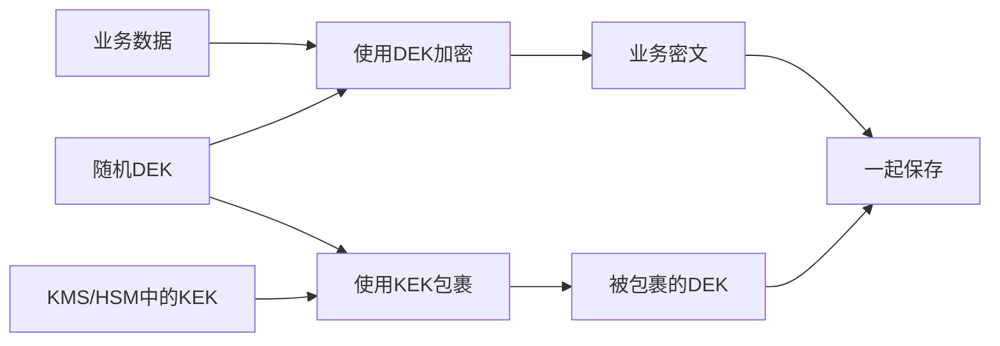
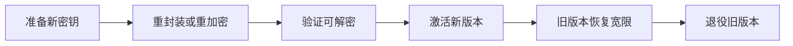

# 密钥管理：DEK、KEK、KMS、HSM 与信封加密

> [!summary] 一句话解释
> **信封加密用 DEK 加密大量业务数据，再用 KEK 包裹 DEK；KMS 管理密钥策略和操作，HSM 用受保护硬件保存或使用高价值密钥。**

## 为什么有好算法还不够

加密系统最终依赖密钥。如果密钥被写进 Git、日志或普通配置，即使算法很强，攻击者仍可以直接解密。

密钥管理要覆盖整个生命周期：

```text
生成 → 保存 → 分发 → 使用 → 轮换 → 备份/恢复 → 撤销 → 销毁
```

## 生活类比

想象酒店：

- 每个房间的临时房卡像 DEK；
- 能制作或保护房卡的总控钥匙像 KEK；
- 前台的钥匙管理制度和系统像 KMS；
- 锁在特殊保险设备中的总控钥匙像 HSM。

## DEK

**DEK（Data Encryption Key，数据加密密钥）**是真正加密数据库、文件或记录的密钥。

特点：

- 通常随机生成；
- 可以按文件、数据库、租户或数据批次划分；
- 使用频率较高；
- 不应该长期明文写入磁盘。

## KEK

**KEK（Key Encryption Key，密钥加密密钥）**用于加密、包裹或保护 DEK。

KEK 一般不直接加密所有业务数据，因为：

- 大量远程 KMS 调用会增加延迟和费用；
- 频繁暴露主密钥操作扩大风险；
- 轮换主密钥时不希望重写全部数据。

## 信封加密

**Envelope Encryption（信封加密）**的结构是：



保存的是“业务密文 + 被包裹 DEK + keyId/算法/版本”，而不是明文 DEK。

解密时：

1. 从存储读取被包裹 DEK；
2. 请求 KMS/HSM 使用 KEK 解封；
3. 在受控内存中得到 DEK；
4. 用 DEK 解密业务数据；
5. 尽快释放或清理敏感内存。

## KMS

**KMS（Key Management Service，密钥管理服务）**提供密钥操作和治理能力，例如：

- 创建密钥；
- `wrap`/`unwrap`；
- `encrypt`/`decrypt` 小数据；
- `rewrap`；
- 权限策略；
- Key ID 和版本；
- 轮换；
- 审计日志；
- 健康检查；
- 撤销和禁用。

KMS 可以是云服务，也可以是自建系统。

## HSM

**HSM（Hardware Security Module，硬件安全模块）**是在受保护硬件中生成、保存和使用密钥的设备或服务。

目标是让高价值私钥或 KEK 难以被直接导出，即使应用调用签名或解密操作，也不一定能拿到密钥原文。

HSM 不是魔法：

- 调用权限配置错误仍会被滥用；
- 管理员和恢复流程仍是高价值目标；
- 需要备份、集群、审计和灾难恢复；
- 硬件故障和厂商锁定也要考虑。

## KMS 和 HSM 的关系

| KMS | HSM |
|---|---|
| 强调密钥生命周期、API、权限和审计 | 强调受保护硬件边界 |
| 可以使用软件或硬件后端 | 通常提供底层密码操作 |
| 对应用暴露管理接口 | 常被 KMS 作为密钥保护底座 |

很多云 KMS 底层会使用 HSM，但具体保护等级和合规承诺要看服务文档。

## KeyProvider 是什么

应用可以定义统一 `KeyProvider` 接口：

```text
wrap(dek)
unwrap(wrappedDek)
rewrap(wrappedDek, newKey)
healthCheck()
getKeyVersion()
```

上层业务不必分别理解 AWS KMS、Azure Key Vault、Google Cloud KMS、Vault 或 PKCS#11 HSM 的所有差异。

统一接口不能抹掉供应商差异：错误语义、权限、延迟、限额和轮换行为仍需测试。

## KEK 轮换和 DEK 轮换

### KEK 轮换

通常只把已有 DEK 从旧 KEK 下重新包裹到新 KEK：

```text
旧Wrapped DEK → unwrap → rewrap with 新KEK
```

业务数据本身不用全部重加密，成本相对较低。

### DEK 轮换

生成新 DEK，并重新加密实际数据。数据库整库 `rekey` 可能需要维护窗口、快照、空间和回滚计划，成本高得多。

## 轮换状态机

可靠轮换不是简单替换字符串：



每一步需要幂等、审计、分布式锁、失败恢复和人工批准。

## Fail-closed

如果系统启动时无法解封 DEK，安全路径应该拒绝启动或进入受限恢复模式，而不是：

- 使用默认密钥；
- 回落到明文；
- 生成一个新密钥假装原数据为空；
- 把错误吞掉。

## 备份与恢复

加密备份必须同时考虑：

- 数据备份；
- 被包裹 DEK；
- KEK 版本和恢复能力；
- KMS/HSM 灾难恢复；
- 双人批准；
- 定期恢复演练。

只有数据没有密钥，备份无法解密；只有密钥没有数据，也不能恢复业务。

## 常见误区

### 把密钥 Base64 后就安全了

Base64 是编码，不是加密。

### 所有数据都直接调用 KMS 加密

KMS 更适合保护 DEK 或小型秘密。大量数据一般使用本地 DEK 加密。

### 开启自动轮换就完成了密钥管理

还要处理数据版本、旧备份、回滚、撤销、权限和审计。

### KMS 拿不到 E2EE 客户端私钥也没关系

这是正确的信任域分离。服务端 KMS 不应该自动接管客户端端到端加密身份私钥。

## 在 Otto 中的作用

在 [[Otto产品总体技术架构]] 中：

- SQLCipher 数据库使用 DEK；
- KMS/HSM 保护服务端 KEK；
- KeyProvider 抽象多个供应商；
- KMS 无法解封时 fail-closed；
- KEK 轮换和 SQLCipher DEK `rekey` 分开管理；
- E2EE 客户端私钥不进入服务端 KMS。

底层算法见 [[密码学基础：AES-GCM、scrypt、Ed25519与SHA-256]]。

## 参考资料

- [NIST Key Management Guidelines](https://csrc.nist.gov/projects/key-management/key-management-guidelines)
- [NIST SP 800-57 Part 1 Revision 5](https://csrc.nist.gov/pubs/sp/800/57/pt1/r5/final)
- 核对日期：2026-08-21。
