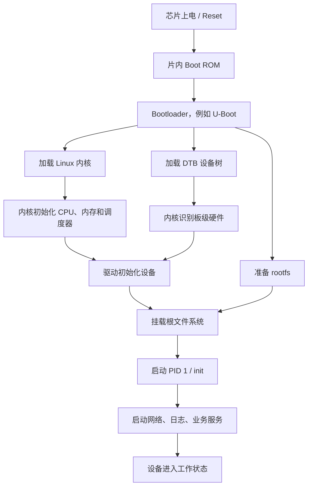
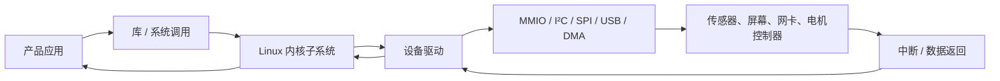
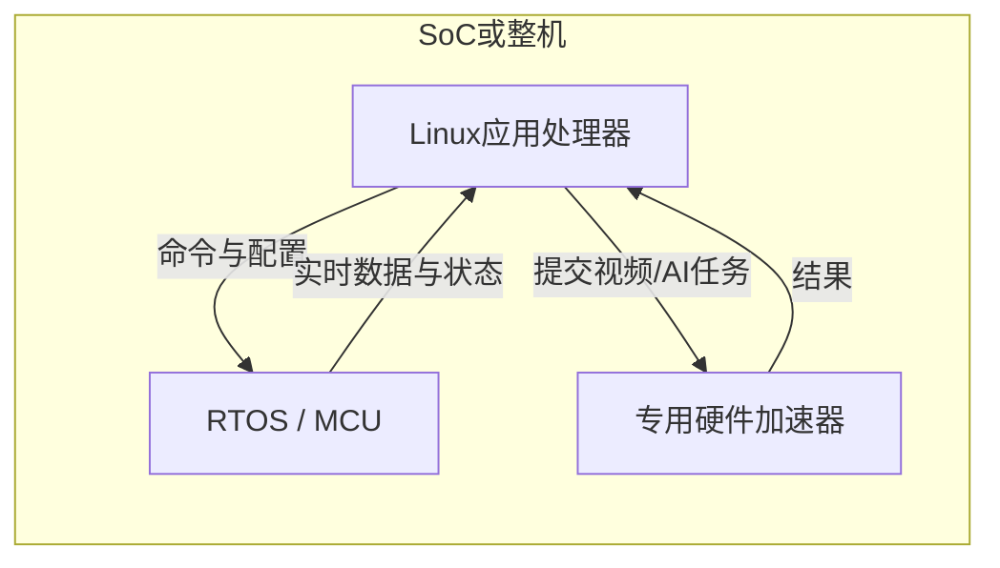

# 嵌入式系统为什么经常使用 Linux

## 一句话解释

> **复杂嵌入式设备经常使用 Linux，是因为它可以按固定硬件裁剪，同时直接复用成熟的驱动、网络、文件系统、进程隔离、安全和开发工具，让厂商不必从零编写一套操作系统；但资源极少、要求极低功耗或严格硬实时的设备，通常更适合裸机程序或 RTOS。**

先纠正一个常见拼写：

```text
正确：Linux
错误：Lunix
```

Linux 通常读作“利纳克斯”或“林纳克斯”。

---

## 一、先理解什么叫嵌入式系统

**Embedded System（嵌入式系统）**是被放进某种产品内部、主要为这个产品执行固定功能的计算机系统。

它可能没有键盘、鼠标和桌面，也不一定让用户意识到里面存在一台计算机。

例如：

- 路由器；
- 网络摄像头；
- 智能电视；
- 机顶盒；
- 智能音箱；
- 工业人机界面；
- 机器人控制器；
- 车载娱乐系统；
- 无人机图传模块；
- 售货机；
- 医疗成像设备；
- NAS；
- Raspberry Pi 一类单板计算机；
- 边缘 AI 盒子。

### “嵌入式组件”是不是准确说法

日常交流中可以理解，但更准确的词通常是：

- 嵌入式设备；
- 嵌入式系统；
- 嵌入式主控；
- 嵌入式计算模块；
- SoM（System on Module，系统模块）；
- SBC（Single-Board Computer，单板计算机）。

一个普通传感器元件不一定运行 Linux。通常是含有 CPU、内存、存储和外设控制器的主控系统，才需要考虑运行什么操作系统。

---

## 二、不是所有“芯片”都适合运行 Linux

### 1. MCU：微控制器

**MCU（Microcontroller Unit，微控制器）**常把下面这些集成在一块芯片中：

- CPU 核心；
- 少量 RAM；
- Flash；
- GPIO；
- 定时器；
- ADC；
- UART、SPI、I²C 等接口。

MCU 常用于：

- 电饭煲按键和加热控制；
- 鼠标、键盘；
- 温湿度传感器；
- 电机控制；
- 电池管理；
- 实时采样。

这类芯片的内存和存储可能很小，常运行：

- Bare Metal，裸机程序；
- RTOS，实时操作系统，例如 FreeRTOS、Zephyr。

### 2. MPU / Application Processor：微处理器或应用处理器

这类芯片通常具有：

- 更强的 ARM、RISC-V 或 x86 CPU；
- 外接或集成的大容量 RAM；
- MMU（Memory Management Unit，内存管理单元）；
- 高速存储接口；
- USB、PCIe、以太网、显示、摄像头等复杂外设；
- 运行多个复杂应用的能力。

它们更适合运行 Linux。

### 3. SoC：片上系统

**SoC（System on Chip，片上系统）**把 CPU、GPU、内存控制器、外设控制器和其他硬件集成在一块芯片里。

SoC 可能同时包含：

- 适合 Linux 的 Cortex-A 核心；
- 适合实时控制的 Cortex-M 核心；
- DSP；
- NPU；
- 专用编解码器。

因此一台设备内部甚至可以同时运行：

```text
Linux：界面、网络、文件、AI、业务逻辑
RTOS：电机、传感器、严格定时控制
```

它们通过共享内存、消息通道或硬件邮箱协作。

---

## 三、最核心原因：不用从零造操作系统

假设厂商要做一台网络摄像头，它需要：

- 识别摄像头传感器；
- 管理内存；
- 同时运行视频采集、编码、存储和网络服务；
- 支持 TCP/IP、HTTPS、DNS；
- 读写 SD 卡或 eMMC；
- 管理用户和权限；
- 远程升级；
- 记录日志；
- 出现故障时自动重启服务；
- 支持 SSH 或其他维护工具。

如果不使用成熟操作系统，团队就要自己实现或采购大量能力。

Linux 已经提供：

```text
任务调度
+ 虚拟内存
+ 进程隔离
+ 驱动框架
+ 文件系统
+ 网络协议栈
+ 用户与权限
+ 进程通信
+ 电源管理框架
+ 日志、调试和监控接口
```

厂商可以把主要精力放到摄像、编码和产品功能，而不是重新发明通用基础设施。

---

## 四、原因 1：硬件驱动和 SoC 生态成熟

代码不能直接“凭空”控制摄像头、网卡或屏幕。它需要设备驱动把操作系统的统一接口翻译成具体硬件操作。

Linux 已有大量驱动和子系统，例如：

- GPIO；
- I²C；
- SPI；
- UART；
- USB；
- PCIe；
- Ethernet；
- Wi-Fi；
- Bluetooth；
- MMC、SD、eMMC；
- NAND、NOR Flash；
- 显示和 DRM/KMS；
- V4L2 摄像头与视频；
- ALSA 音频；
- 输入设备；
- 温度、风扇和电源管理。

硬件控制的底层原理见 [[内存映射、MMIO与代码控制硬件]]。

### BSP 是什么

**BSP（Board Support Package，板级支持包）**是一组让操作系统支持某块板卡的材料，可能包括：

- Bootloader 配置；
- Linux 内核配置；
- 设备驱动；
- 设备树；
- 固件；
- 补丁；
- 工具链和构建脚本；
- 示例程序；
- 烧录工具和说明文档。

很多 SoC 厂商和开发板厂商会提供 Linux BSP。产品团队在它上面开发，比从寄存器手册开始写完整系统快得多。

但“厂商有 BSP”不等于质量一定好。BSP 可能：

- 基于旧内核；
- 含有大量私有补丁；
- 不能轻易升级；
- 某些驱动只有二进制版本；
- 安全维护周期很短。

选芯片时，软件支持质量和长期维护能力与硬件参数同样重要。

---

## 五、原因 2：设备树让硬件描述与驱动代码分开

嵌入式板卡上的很多设备不能像 USB 那样自动报告全部信息。例如内核需要知道：

- 某个串口的寄存器地址；
- 使用哪个中断；
- GPIO 引脚如何连接；
- I²C 总线上挂了什么芯片；
- 时钟频率和时钟来源；
- 内存范围；
- 哪些硬件已经启用；
- 某个驱动与哪种芯片兼容。

**Device Tree（设备树）**就是一份操作系统可读取的“硬件说明单”。

示意代码：

```dts
sensor@48 {
    compatible = "vendor,temp-sensor";
    reg = <0x48>;
    status = "okay";
};
```

它大致表示：

- I²C 地址是 `0x48`；
- 兼容某种温度传感器驱动；
- 这个设备已经启用。

这样做的价值是：

```text
驱动描述“这种芯片怎样工作”
设备树描述“这块板子怎样连接”
```

内核官方文档指出，设备树可以把硬件配置与板级驱动支持解耦，使平台支持更多地由数据驱动，而不是为每块板复制硬编码。

---

## 六、原因 3：Linux 的网络能力非常完整

许多现代嵌入式产品其实是“接入网络的小型服务器或客户端”。

例如：

- 路由器转发数据包；
- 摄像头提供视频流；
- 网关把现场协议转换成 MQTT/HTTPS；
- 电视运行流媒体应用；
- 工业屏访问后端 API；
- AI 盒子下载模型并上传结果。

Linux 提供成熟的：

- TCP/IP 协议栈；
- IPv4 和 IPv6；
- 路由和网络命名空间；
- 防火墙与 Netfilter；
- 网桥、VLAN、TUN/TAP；
- Wi-Fi、蓝牙和以太网支持；
- Socket 编程接口；
- TLS、SSH、HTTP、MQTT 等用户空间软件生态。

相关基础见：

- [[TCP、HTTP、HTTPS与WebSocket]]；
- [[DNS域名系统]]；
- [[TLS与数字证书]]；
- [[防火墙与端口对外开放]]。

如果团队自己从零实现这些协议，不仅工期大，安全和兼容问题也会更多。

---

## 七、原因 4：多进程、内存保护和权限机制

复杂产品通常不只运行一个循环，而是同时运行：

- 主业务程序；
- 网络服务；
- 数据库；
- 日志服务；
- 更新服务；
- 设备管理进程；
- Web 界面；
- AI 推理程序；
- 看门狗服务。

Linux 可以把它们分成多个进程。

好处包括：

### 1. 地址空间隔离

有 MMU 支持时，一个普通进程通常不能直接读写另一个进程的内存。某个应用崩溃，不一定把整个操作系统一起破坏。

### 2. 调度和并发

内核决定哪个任务何时使用 CPU，并可利用多核处理器。

进程与线程见 [[进程、线程、多进程与多线程]]。

### 3. 用户和权限

不同服务可以使用不同用户运行，限制文件、设备和网络操作。

### 4. 进程通信

Linux 提供：

- Pipe，管道；
- Socket，套接字；
- Signal，信号；
- Shared Memory，共享内存；
- Message Queue，消息队列；
- D-Bus 等用户空间机制。

### 5. 故障隔离和恢复

服务管理器可以检测进程退出并重启，而不必总是重启整台设备。

这并不表示 Linux 绝不会崩溃，但它为大型嵌入式软件提供了比单一裸机大循环更清晰的隔离边界。

---

## 八、原因 5：文件系统和存储能力完整

嵌入式设备经常需要保存：

- 配置；
- 日志；
- 用户数据；
- 图片和录像；
- 数据库；
- AI 模型；
- 升级包；
- 崩溃转储。

Linux 支持多种文件系统和存储技术，例如：

- ext4；
- SquashFS；
- UBIFS；
- OverlayFS；
- tmpfs；
- FAT/exFAT；
- NFS；
- 加密和只读挂载；
- eMMC、SD、NVMe、NAND、NOR。

产品可以采用：

```text
只读系统分区
+ 可写数据分区
+ 临时内存文件系统
+ A/B 双系统升级分区
```

这样可以减少意外断电和升级失败对系统的影响。

但文件系统成熟不等于自动安全。嵌入式产品仍要考虑：

- 突然断电；
- Flash 擦写寿命；
- 日志无限增长；
- 数据库事务；
- 升级中途掉电；
- 存储空间耗尽。

---

## 九、原因 6：Linux 可以裁剪

Linux 不是只能以 Ubuntu 桌面那样的形态存在。

一个嵌入式 Linux 可以只包含：

```text
Bootloader
+ 针对目标硬件裁剪的内核
+ 设备树
+ 少量驱动
+ 精简 rootfs
+ BusyBox
+ 必要库
+ 产品主程序
```

不需要：

- 桌面环境；
- 浏览器；
- 办公软件；
- 打印服务；
- 大量通用驱动；
- 本地软件商店；
- 完整 GNU 工具集合。

所以同一个 Linux 内核家族既能支撑服务器，也能被裁剪进路由器、摄像头和控制器。

详细原理见 [[Linux为什么可以做得很小]]。

### 内核怎样裁剪

Linux 使用 Kconfig 配置系统，可以选择：

- 支持哪些 CPU 架构；
- 启用哪些文件系统；
- 编译哪些驱动；
- 是否支持容器、调试、网络协议；
- 功能内建还是编译成模块；
- 是否启用不需要的子系统。

### 用户空间怎样裁剪

可以选择：

- BusyBox 代替许多独立命令；
- musl 或其他适合场景的 C 库；
- 精简 init 系统；
- 只读 SquashFS；
- 去掉开发头文件和调试符号；
- 只安装产品实际需要的软件包。

Linux 能做小，不是因为“什么功能都免费出现”，而是因为不需要的功能可以不编译、不打包、不启动。

---

## 十、原因 7：Buildroot 和 Yocto 降低系统集成成本

### Buildroot

**Buildroot** 是生成嵌入式 Linux 系统的构建工具。

官方手册说明，它可以通过交叉编译生成：

- Cross-Compilation Toolchain，交叉编译工具链；
- Root Filesystem，根文件系统；
- Linux Kernel Image，内核镜像；
- Bootloader，启动加载器。

它适合：

- 单用途设备；
- 相对简单、固定的产品；
- 快速建立可启动系统；
- 学习嵌入式 Linux 完整链路。

### Yocto Project

**Yocto Project** 不是一个现成发行版，而是一套创建定制 Linux 系统的工程体系。

它更适合：

- 多型号产品线；
- 多层配置与复用；
- 企业内部发行版；
- 可重复构建；
- 软件包配方、许可证信息和长期维护；
- 复杂 BSP 和供应链管理。

### 交叉编译是什么

开发电脑可能是 x86-64 Windows/Linux，而目标板是 ARM 或 RISC-V。

**Cross Compilation（交叉编译）**就是：

```text
在开发电脑上运行编译器
→ 生成目标设备 CPU 能执行的程序
```

Buildroot 和 Yocto 会帮助组织编译器、库、软件包、内核和镜像之间的依赖。

---

## 十一、原因 8：软件生态和开发工具丰富

嵌入式 Linux 可以复用大量成熟软件：

- C/C++、Rust、Go、Python 等运行环境；
- OpenSSL；
- SQLite；
- Web 服务器；
- GStreamer、FFmpeg；
- OpenCV；
- MQTT 客户端；
- SSH；
- Git；
- 日志和监控工具；
- AI 推理运行时；
- 容器技术，在资源允许时使用。

常见语言用途见 [[常见编程语言及其用途]]。

### 调试工具

Linux 还提供：

- `dmesg`：查看内核和驱动消息；
- `journalctl`：查看服务日志，取决于系统是否使用 systemd；
- `strace`：查看系统调用；
- `gdb`：调试程序；
- `top`：查看进程和资源；
- `ip`：查看网络；
- `ethtool`：查看网卡；
- `/proc` 和 `/sys`：观察内核、进程和设备状态。

开发者可以通过串口、SSH、JTAG 或网络远程排查问题。

这会显著缩短开发、测试和售后诊断时间。

---

## 十二、原因 9：应用更容易在不同硬件之间迁移

如果应用直接操作每块芯片的寄存器，更换 SoC 后可能需要大改。

Linux 提供相对稳定的抽象：

```text
应用程序
→ POSIX / 系统调用 / 库
→ Linux 内核子系统
→ 设备驱动
→ 具体硬件
```

应用可以通过标准接口使用：

- 文件；
- Socket；
- 线程；
- 进程；
- 定时器；
- 串口；
- 输入设备；
- 视频和音频设备。

更换硬件时，如果新平台提供兼容驱动和用户空间接口，业务应用的改动可以减少。

### 但不是“写一次，到处运行”

仍然可能遇到：

- CPU 架构不同；
- 大小端不同；
- 驱动接口不同；
- GPU/NPU 厂商 SDK 不同；
- 摄像头管线不同；
- 内核版本和 ABI 差异；
- 性能和内存限制不同；
- BSP 私有补丁。

Linux 提高可移植性，但不会消除硬件差异。

---

## 十三、原因 10：开放源代码、可修改，但不等于零成本

Linux 内核采用 GPL-2.0-only 许可证，源代码可获取、研究和修改。

对嵌入式厂商的价值包括：

- 能为自己的板卡增加驱动；
- 能裁剪不需要的功能；
- 能调查内核问题；
- 不必完全受制于单一闭源操作系统供应商；
- 可以利用社区和供应商共同维护的代码；
- 可以围绕同一基础建立多代产品。

### 开源不等于完全免费

总成本仍包括：

- 工程师工资；
- BSP 适配；
- 驱动开发；
- 测试和认证；
- 安全更新；
- 许可证合规；
- 长期维护；
- 商业支持；
- 芯片厂商工具和私有中间件。

### GPL 合规

分发含有 Linux 内核和相关 GPL 软件的产品时，需要根据实际使用和许可证履行相应义务，例如为受 GPL 约束的修改和二进制提供对应源码、许可证文本或适当的源码获取方式。

具体义务取决于组件、链接方式、修改方式和分发模式。产品团队应维护 SBOM 并进行法律合规审查，不应把“开源”理解成“代码拿来后不用管许可证”。

相关概念见 [[软件供应链：代码签名、SBOM与发布门禁]]。

---

## 十四、一个嵌入式 Linux 是怎样启动的



### Boot ROM

芯片厂商烧在芯片内部的最早启动代码。它从固定介质寻找下一阶段程序。

### Bootloader

**Bootloader（启动加载器）**初始化必要硬件，把内核、设备树和其他启动材料放入内存，并跳转到内核。

U-Boot 是嵌入式 Linux 中常见的 Bootloader，但不是 Linux 内核的一部分。

### Linux 内核

初始化内存管理、调度、中断、驱动和文件系统。

### DTB

**DTB（Device Tree Blob，设备树二进制）**告诉内核这块板卡的硬件连接。

### rootfs

**Root Filesystem（根文件系统）**包含 `/bin`、`/etc`、库、配置和产品程序。

### PID 1

内核启动的第一个用户空间进程，可能是 systemd、BusyBox init 或产品专用 init。它继续启动其他服务。

---

## 十五、Linux 应用如何控制嵌入式硬件



例如应用读取摄像头：

1. 应用通过 V4L2 API 请求视频帧；
2. 内核视频子系统把请求交给对应驱动；
3. 驱动配置摄像头、总线和 DMA；
4. 硬件把图像数据搬到内存；
5. 中断通知驱动数据完成；
6. 应用取得视频缓冲区。

应用不需要直接知道每个寄存器地址，因为驱动和内核子系统提供了抽象。

API 和 SDK 的区别见 [[SDK与API]]。

---

## 十六、Linux、RTOS 和裸机程序怎样选

### 三者对比

| 维度 | 裸机程序 | RTOS | 嵌入式 Linux |
|---|---|---|---|
| 基本形态 | 程序直接控制硬件 | 小型实时内核 + 多任务 | 完整通用操作系统内核 + 用户空间 |
| 资源需求 | 最低 | 低 | 通常更高 |
| 启动速度 | 很快 | 通常很快 | 通常较慢，但可优化 |
| 硬实时 | 可精确控制 | 强项 | 普通内核不以严格硬实时为首要目标 |
| 进程隔离 | 通常没有 | 取决于 MPU/MMU 和实现 | 有 MMU 时较成熟 |
| 网络与文件系统 | 自己实现或加库 | 按需添加 | 功能完整、生态丰富 |
| 驱动生态 | 针对芯片自己写 | 厂商/HAL/RTOS 驱动 | Linux 驱动和 BSP 生态庞大 |
| GUI、多媒体、AI | 实现成本高 | 受资源限制 | 更适合复杂应用 |
| 功耗 | 容易做到极低 | 适合低功耗控制 | 可以优化，但基础开销更高 |
| 维护复杂度 | 小项目简单，大项目易失控 | 中等 | 构建、安全和升级体系更复杂 |

### 什么时候选裸机

- 功能非常简单；
- RAM、Flash 极少；
- 只需要少数中断和状态机；
- 要求极快启动；
- 成本和功耗极端敏感。

例如：简单按键控制、LED 控制、小型电源管理。

### 什么时候选 RTOS

**RTOS（Real-Time Operating System，实时操作系统）**强调任务在可预测时间内得到调度。

适合：

- 电机控制；
- 实时采样；
- 小型无线传感器；
- 无人机姿态控制；
- 低功耗 MCU；
- 有多个实时任务，但不需要完整 Linux 生态。

FreeRTOS 官方将其定位为面向微控制器和小型微处理器、占用空间很小的实时内核；Zephyr 也强调面向资源受限嵌入式设备的小型内核。

### 什么时候选 Linux

- 需要复杂网络协议；
- 需要完整文件系统；
- 需要图形界面；
- 需要摄像头、音频和视频；
- 需要多进程隔离；
- 需要数据库和 Web 服务；
- 需要 SSH 和远程维护；
- 需要运行 Python、Java、Go、容器或 AI 框架；
- 硬件有足够 CPU、RAM、存储和 MMU。

---

## 十七、Linux 能不能做实时控制

先区分两个词。

### 响应很快

平均延迟很低，大多数时候很快。

### 硬实时

必须保证最坏情况下也在规定截止时间前完成；一次超时都可能不可接受。

普通 Linux 是通用操作系统，优先兼顾：

- 吞吐量；
- 公平调度；
- 多用户和多进程；
- 复杂驱动；
- 文件和网络性能。

它默认不保证所有任务都有非常严格的最坏时延上限。

### PREEMPT_RT

Linux 的 **PREEMPT_RT（实时抢占）**机制会提高内核可抢占性、线程化大部分中断处理，并采用优先级继承等手段降低调度延迟。

它可以让 Linux 适合更多软实时或较强实时场景，但系统是否满足要求还取决于：

- CPU 架构；
- 驱动质量；
- 中断；
- 缓存和内存；
- 总线；
- 电源管理；
- 最坏延迟测试；
- 安全认证要求。

对“错过一次截止时间就可能导致危险”的控制环，常见设计仍是：

```text
Linux 负责复杂上层功能
+ RTOS/MCU 负责严格实时闭环
```

---

## 十八、Linux 的缺点和成本

Linux 适合很多复杂产品，但不是免费的万能方案。

### 1. 资源开销更大

相比裸机或小型 RTOS，需要更多：

- RAM；
- Flash/eMMC；
- CPU 性能；
- 启动时间；
- 构建和维护资源。

Linux 没有一个适用于所有配置的固定最低内存数字。极端裁剪系统可以很小，但带网络、升级、日志、GUI 和业务程序的商业产品通常需要明显更多资源。

### 2. 启动过程更长

Bootloader、内核、驱动、rootfs、init 和应用都需要时间。可以优化，但比执行单一 MCU 固件复杂。

### 3. 功耗管理更复杂

Linux 支持休眠、CPUFreq、设备 Runtime PM 等机制，但复杂 SoC、DDR 和外设本身就比小 MCU 消耗更多功率。

### 4. 攻击面更大

网络服务、驱动、库和应用越多，潜在漏洞越多。

需要：

- 及时更新；
- 最小化软件包；
- 关闭不需要的端口和服务；
- 最小权限；
- Secure Boot；
- 镜像签名；
- 只读根文件系统；
- SELinux/AppArmor/seccomp 等适当机制；
- 漏洞和 SBOM 管理。

### 5. 更新和长期维护困难

嵌入式产品可能销售和使用多年，但芯片厂 BSP 可能只维护几年。

团队要考虑：

- 内核和驱动升级；
- CVE 修复；
- OTA 失败恢复；
- A/B 分区；
- 数据迁移；
- 签名密钥；
- 版本回滚；
- GPL 和第三方许可证。

更新过程本身也是一个状态机，相关思想见 [[状态机与幂等性]]。

### 6. 认证场景可能更难

汽车、航空、医疗、工业安全等领域可能需要功能安全或严格认证。大型通用 Linux 软件栈的验证成本可能很高，因此常采用分区、混合系统、专用安全 RTOS 或经过认证的软件栈。

---

## 十九、为什么路由器特别适合 Linux

路由器需要：

- 多网口和 Wi-Fi 驱动；
- IP 转发；
- DHCP；
- DNS 转发；
- NAT；
- 防火墙；
- VLAN；
- VPN；
- Web 管理界面；
- 日志；
- 远程升级。

这些都是 Linux 已经有成熟支持的领域。

像 OpenWrt 就是为嵌入式网络设备构建的 Linux 发行版。厂商只需适配硬件、配置功能、加入自己的界面和业务，而不是从零实现完整网络操作系统。

---

## 二十、为什么网络摄像头和智能屏也常用 Linux

网络摄像头需要：

- 传感器和 ISP 驱动；
- 视频采集；
- H.264/H.265 编码；
- 音频；
- 网络传输；
- 存储录像；
- Web/API 管理；
- OTA 更新；
- AI 检测。

智能屏还需要：

- 显示驱动；
- 触摸输入；
- 字体；
- GUI 框架；
- 浏览器或 WebView；
- 多媒体播放。

Linux 可以组合 V4L2、DRM/KMS、ALSA、GStreamer、Qt、WebKit/Chromium 等生态，显著降低从零开发成本。

---

## 二十一、为什么一个小传感器反而通常不用 Linux

假设设备只需要：

1. 每秒读取一次温度；
2. 通过低功耗蓝牙发出去；
3. 使用纽扣电池工作一年。

它可能只需要：

- 一个低功耗 MCU；
- 少量 RAM 和 Flash；
- 深度睡眠；
- 一个定时任务；
- 一个蓝牙协议栈。

使用完整 Linux 会带来不必要的：

- DDR 和更强处理器；
- 启动开销；
- 存储成本；
- 功耗；
- 软件维护；
- 攻击面。

这时裸机或 RTOS 更合理。

选操作系统不是比“谁更高级”，而是匹配产品约束。

---

## 二十二、常见的混合架构

复杂设备经常同时使用多种系统。



例如机器人：

- Linux：地图、视觉、UI、网络、任务规划；
- RTOS/MCU：电机闭环、编码器采样、安全急停；
- NPU/GPU：AI 和图像计算。

这样既利用 Linux 的复杂软件生态，又让实时关键功能保持可预测性。

---

## 二十三、如何判断某个产品是不是运行 Linux

不能只看外观，但可以从一些迹象推测：

- 开源许可证页面列出 Linux、BusyBox、U-Boot；
- 固件包中出现 `zImage`、`Image`、`uImage`、`dtb`、`rootfs`、`squashfs`；
- 串口启动日志出现 `Linux version`；
- 文件系统中有 `/proc`、`/sys`、`/dev`、`/etc`；
- 可以通过 SSH 登录并看到 BusyBox；
- 使用 OpenWrt、Android、Yocto 或 Buildroot 构建标识。

不要为了确认而随意拆机、刷写未知固件或绕过设备安全。错误固件可能使设备无法启动，也可能违反保修或授权边界。

---

## 二十四、常见误区

### 误区 1：Linux 就是 Ubuntu

错误。Linux 严格说是内核。Ubuntu 是包含 Linux 内核和大量用户空间软件的发行版。

嵌入式设备可能使用 Buildroot 或 Yocto 构建的定制系统，没有 Ubuntu 桌面。

### 误区 2：嵌入式 Linux 一定很大

错误。内核和用户空间都可以裁剪。具体大小取决于驱动、库、网络、GUI、升级和业务功能。

### 误区 3：所有嵌入式设备都使用 Linux

错误。大量 MCU 设备使用裸机或 RTOS。

### 误区 4：Linux 开源，所以开发不要钱

错误。BSP、驱动、测试、安全更新、认证和维护都需要成本。

### 误区 5：用了 Linux 就自动支持所有硬件

错误。必须有匹配驱动、设备树、固件和正确板级配置。

### 误区 6：Linux 不能实时

不准确。Linux 有实时调度和 PREEMPT_RT，可以满足许多实时需求；但严格硬实时必须做最坏延迟验证，部分场景仍更适合 RTOS 或专用 MCU。

### 误区 7：Linux 有权限系统，所以设备自动安全

错误。默认密码、开放端口、过期组件、root 运行所有服务和不安全 OTA 都会造成风险。

### 误区 8：Linux 驱动能用，应用就一定可以直接迁移

错误。GPU、NPU、摄像头、媒体和厂商 SDK 经常存在平台差异。

### 误区 9：设备没有屏幕，所以里面不可能有 Linux

错误。路由器、NAS、网关和摄像头都可能没有本地桌面，但照样运行 Linux。

### 误区 10：Raspberry Pi 就是普通单片机

错误。Raspberry Pi 的主处理器和内存足以运行完整 Linux，更接近单板计算机；许多 Arduino 类板卡则是 MCU 平台。

---

## 二十五、产品选型时应该问什么

### 硬件资源

- CPU 架构和性能如何？
- 是否有 MMU？
- RAM、Flash/eMMC 有多少？
- 是否需要 GPU、NPU、摄像头或显示？
- 功耗预算是多少？

### 时间要求

- 必须多快启动？
- 是否有毫秒或微秒级截止时间？
- 超时一次的后果是什么？
- 是平均快，还是必须保证最坏情况？

### 软件复杂度

- 是否需要 TCP/IP、HTTPS、Wi-Fi？
- 是否需要文件系统和数据库？
- 是否需要 GUI、多媒体或 AI？
- 是否需要运行多个隔离服务？
- 是否需要远程诊断？

### 维护与安全

- 产品计划使用几年？
- 芯片厂 BSP 维护多久？
- 谁负责内核和漏洞更新？
- OTA 失败怎样恢复？
- 是否有 Secure Boot 和签名验证？
- 是否需要功能安全认证？
- 开源许可证怎样合规？

### 成本

- 更强 SoC、RAM 和存储增加多少硬件成本？
- 自己开发网络栈和驱动要多少人月？
- 商业 RTOS 或 Linux 支持费用是多少？
- 长期维护成本是多少？

真正的选型是全生命周期权衡，不是只比较系统镜像大小。

---

## 二十六、初学者学习路线

### 第 1 步：理解硬件基础

学习：

- CPU；
- RAM 与 Flash；
- MCU、MPU、SoC；
- 中断；
- MMIO；
- I²C、SPI、UART。

详见 [[内存映射、MMIO与代码控制硬件]]。

### 第 2 步：理解 Linux 组成

区分：

- Bootloader；
- Linux 内核；
- 驱动；
- 设备树；
- rootfs；
- init；
- 用户空间应用。

详见 [[Linux为什么可以做得很小]]。

### 第 3 步：理解进程和系统调用

观察应用怎样通过系统调用进入内核，内核怎样通过驱动访问硬件。

### 第 4 步：尝试 Buildroot + QEMU

不需要立即买硬件，可以先：

1. 用 Buildroot 选择一个 QEMU 目标；
2. 生成内核和 rootfs；
3. 在虚拟机中启动；
4. 观察 `/proc`、`/sys`、`/dev`；
5. 运行 BusyBox 命令；
6. 写一个小程序交叉编译进去。

### 第 5 步：再接触真实开发板

学习：

- 串口日志；
- U-Boot；
- 设备树；
- 驱动加载；
- GPIO/I²C/SPI；
- 固件烧录和恢复。

---

## 二十七、最后记忆

如果只记住九句话，请记住：

1. **正确拼写是 Linux。**
2. **嵌入式系统是藏在产品内部、执行固定功能的计算机系统。**
3. **复杂设备用 Linux，核心原因是能复用驱动、网络、文件系统、进程和软件生态。**
4. **Linux 可以按固定硬件裁剪，不需要安装桌面和无关程序。**
5. **BSP 让 Linux 支持具体板卡，设备树描述板卡硬件连接。**
6. **Buildroot 和 Yocto 帮助生成可重复的定制 Linux 系统。**
7. **MCU、小内存、极低功耗或硬实时场景，通常更适合裸机或 RTOS。**
8. **复杂产品常让 Linux 和 RTOS/MCU 分工合作。**
9. **开源不等于零成本，也不等于自动安全，长期升级和许可证合规同样重要。**

最短判断公式：

```text
需要复杂网络、文件、界面、多媒体、多进程、AI
+ 硬件资源足够
→ 优先评估嵌入式 Linux

功能简单、资源极少、极低功耗或严格硬实时
→ 优先评估裸机或 RTOS
```

---

## 关联笔记

- [[边缘计算模块与边缘网关]]：区分硬件核心板、软件模块与网关职责，理解现场采集、推理、协议适配、断网缓存与控制安全边界。
- [[Linux为什么可以做得很小]]：内核、BusyBox、rootfs 和 Buildroot 怎样构成最小系统。
- [[Linux的主要用途、普及原因与桌面现状]]：Linux 在服务器、Android、网络设备和桌面的整体位置。
- [[Unix与Linux设计哲学：文件、小工具与管道]]：Linux 为什么强调小工具、管道、文件接口与模块化。
- [[内存映射、MMIO与代码控制硬件]]：驱动怎样通过寄存器、DMA 和中断控制设备。
- [[进程、线程、多进程与多线程]]：Linux 为什么能同时运行和隔离多个服务。
- [[常见编程语言及其用途]]：C、C++、Rust、Python 和其他语言在嵌入式系统里的位置。
- [[软件供应链：代码签名、SBOM与发布门禁]]：固件依赖、许可证、签名和发布安全。
- [[高可用、健康检查与故障恢复]]：看门狗、冗余、回滚和故障恢复的基本思想。

---

## 参考资料

以下均为官方或项目原始资料，核对日期：**2026-08-23**。

- [Linux Kernel Documentation：Linux and the Devicetree](https://www.kernel.org/doc/html/latest/devicetree/usage-model.html)
- [Linux Kernel Documentation：Real-time preemption](https://www.kernel.org/doc/html/latest/core-api/real-time/index.html)
- [Linux Kernel Documentation：Linux kernel licensing rules](https://kernel.org/doc/html/next/process/license-rules.html)
- [Buildroot 2026.05 User Manual](https://buildroot.buildroot.org/downloads/manual/manual.html)
- [Yocto Project Documentation：Introducing the Yocto Project](https://docs.yoctoproject.org/overview-manual/yp-intro.html)
- [FreeRTOS Documentation：What is FreeRTOS?](https://freertos.org/Why-FreeRTOS/What-is-FreeRTOS)
- [Zephyr Project Documentation：Introduction](https://docs.zephyrproject.org/latest/introduction/index.html)
