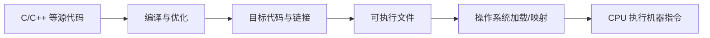
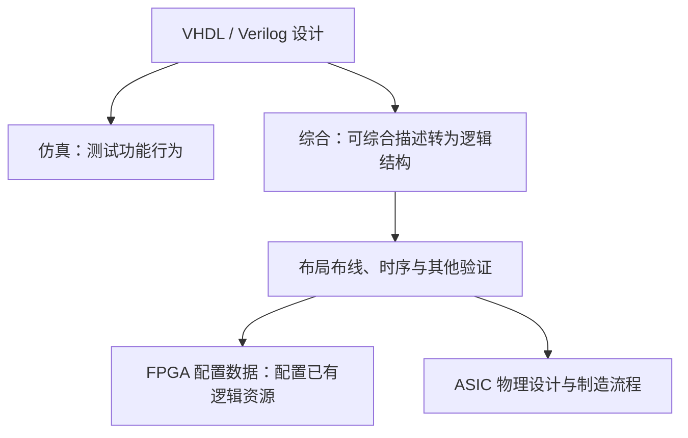

# 机器语言、汇编与硬件描述语言

> [!summary] 一句话解释
> 机器语言编码处理器执行的指令，汇编用便于人阅读的符号表达这些指令；硬件描述语言主要描述数字电路的结构与行为，用于仿真和在支持范围内综合实现。

生活类比：机器指令是现成机器理解的操作编码，汇编是人工可读的操作清单，硬件描述语言则更像设计机器内部电路的说明书。三者不只是“难度逐级增加的同一种写法”。

入口：[[计算机硬件与底层软件学习地图]]；软件常用语言见 [[常见编程语言及其用途]]。

## 机器语言：按指令集编码的位模式

Machine Language（机器语言）用处理器规定的编码表达“运算、读写、跳转”等指令。CPU 取到这些位模式后，由硬件译码和执行。

**CPU = Central Processing Unit（中央处理器，读 C-P-U）**；**ISA = Instruction Set Architecture（指令集体系结构，读 I-S-A）** 决定指令含义及相关规则。

二进制的 0、1 在实际电路中由符合规则的电气状态表达，不是芯片里有人在阅读字符。所有文件最终都可用位表示，但图片的位模式不因此自动成为合理的 CPU 程序。

机器码常用十六进制展示，是因为更紧凑；底层并未从二进制硬件改成“十六进制处理器”。一位十六进制数字对应 4 个二进制位。

## 汇编语言：给机器指令起可读名字

Assembly Language（汇编语言）使用助记符、寄存器名和标签等表达底层指令。Assembler（汇编器）负责把相应源代码转换为机器码等目标内容。

下面是 **x86 的 Intel 语法**指令示意，不是 Windows 命令行命令，也不是一份完整可运行程序：

```asm
mov eax, 42
add eax, 1
```

第一条把整数 42 放入 EAX 寄存器，第二条加 1，结果为 43。操作系统加载、程序入口和退出方式等没有在这两条指令中包含。

其中 `mov eax, 42` 的一种对应机器编码为：

```text
B8 2A 00 00 00
```

这里按字节用十六进制展示：B8 是该形式的操作码，后面四字节表达立即数 42。2A 是十六进制的 42；字节顺序遵循相应小端编码约定。

同样的数学工作在 Arm 或其他指令集下会用不同编码。即使同属 x86，汇编器语法、执行模式和构建目标也必须明确，不能把任意汇编代码粘到终端就期待运行。

## 一条汇编是否永远等于一条机器指令

真实指令助记符往往对应特定机器指令形式，但汇编源文件还可能包含伪指令、宏、数据定义和链接相关信息。一个宏可以展开为多条指令，有些伪指令根本不是交给 CPU 执行的指令。

所以“汇编与机器码接近”是对的，“汇编文件每一行都严格一对一对应一条机器指令”则不对。

## 高级语言到硬件的大致路径



编译器不一定需要在磁盘上生成一份人可见的汇编文本才继续处理。解释器、虚拟机和即时编译有不同路径；运行解释器或生成后的代码时，最终仍要依赖处理器执行相应机器指令。

所谓“机器能执行”，也不等于程序有权访问任意设备；操作系统与硬件权限机制仍有效，见 [[内存映射、MMIO与代码控制硬件]]。

## HDL：描述电路，不只是描述 CPU 下一步干什么

**HDL = Hardware Description Language（硬件描述语言，读 H-D-L）**，可以表达数字系统的连接、逻辑关系、状态与时序行为。

常见用途是：设计模型 → 仿真验证 → 对可综合部分进行综合 → 实现到目标硬件。

**RTL = Register-Transfer Level（寄存器传输级，读 R-T-L）** 是常见描述层次，关注寄存器保存的状态以及时钟节拍间数据经过什么组合逻辑。不意味着只有寄存器而没有逻辑门。

## VHDL 与 Verilog 是什么

**VHDL = VHSIC Hardware Description Language（VHSIC 硬件描述语言，读 V-H-D-L）**；其中 **VHSIC = Very High Speed Integrated Circuit（超高速集成电路）**。

**Verilog（通常读“维瑞洛格”）** 是另一种广泛使用的硬件描述语言名称，不需要硬套一个逐字展开的缩写。

| 对比 | VHDL | Verilog |
|---|---|---|
| 主要领域 | 数字电路建模、仿真与综合 | 数字电路建模、仿真与综合 |
| 语法印象 | 显式类型与结构声明较多 | 不少语法外观接近 C |
| 常见文件扩展名 | .vhd / .vhdl | .v |
| 与处理器汇编的关系 | 不是另一种 CPU 汇编语法 | 不是“直接写 GPU 指令”的语言 |

SystemVerilog 在 Verilog 基础上扩展了设计与验证能力；不同语言版本和工具支持范围需要核对，不是写得像 C 就按 C 程序逐行执行。

## 同一个半加器：看懂“描述电路”

半加器把两个二进制位 a、b 相加，输出本位 sum 与进位 carry。这里只考虑输入为 0 或 1 的情况：

| a | b | sum | carry |
|---:|---:|---:|---:|
| 0 | 0 | 0 | 0 |
| 0 | 1 | 1 | 0 |
| 1 | 0 | 1 | 0 |
| 1 | 1 | 0 | 1 |

Verilog 描述：

```verilog
module half_adder(
  input wire a, b,
  output wire sum, carry
);
  assign sum = a ^ b;
  assign carry = a & b;
endmodule
```

`^` 是异或，两个位不同时为 1；`&` 是与，两个位都为 1 才为 1。两条 assign 描述持续存在的组合逻辑关系，并不是某个 CPU 先算完第一句才创造第二个电路。

等价的 VHDL 描述：

```vhdl
library IEEE;
use IEEE.STD_LOGIC_1164.ALL;

entity half_adder is
  port (a, b : in std_logic; sum, carry : out std_logic);
end entity;

architecture rtl of half_adder is
begin
  sum <= a xor b;
  carry <= a and b;
end architecture;
```

entity 声明接口，architecture 描述实现关系。std_logic 是常用逻辑类型，仿真还可以表达未知等状态；本例真值表只列 0/1。

这里 IEEE 是 Institute of Electrical and Electronics Engineers（电气与电子工程师协会，常读 I-triple-E）；代码开头两行引用相应标准逻辑库，供后面的逻辑类型和运算使用。

真实电路有传播延迟，仿真也有调度规则，不是数学式写下来后物理输出瞬间变化。本次核对了四种二值输入的逻辑关系；没有安装 HDL 仿真器，也没有声称完成综合、时序验证或上板测试。

## 并发描述不等于 HDL 每一行都无顺序

HDL 模块、进程之间可以表示并发活动；进程内部又有顺序语句、赋值语义和事件调度规则。时钟触发的寄存器更新与纯组合逻辑不同。

综合工具可能把某些固定循环展开成并行电路，而不是像软件 for 循环那样每次复用同一计算单元；也可以设计复用单元的多周期状态机。该生成什么硬件，需要依据实际描述与工具结果判断。

## 从 HDL 到 FPGA 或芯片

**FPGA = Field-Programmable Gate Array（现场可编程门阵列，读 F-P-G-A）**，是一类可以配置逻辑资源与连接方式的芯片。

**ASIC = Application-Specific Integrated Circuit（专用集成电路，常读“诶锡克”）**，为特定设计制造的集成电路。



这只是简化流程，真实项目会反复验证，也有更多制造与签核步骤。给 FPGA 加载配置不会现场制造新的晶体管，而是配置芯片已有资源；ASIC 制造则是另一类交付流程。

仿真通过不等于硬件必定可实现。HDL 的测试平台、文件操作或任意仿真延时等结构未必可综合。能综合也不等于满足目标频率、功耗、面积和板级条件。[AMD FPGA 设计工具流程](https://www.amd.com/en/products/software/adaptive-socs-and-fpgas.html)

## HDL、固件和驱动怎样相遇

可以用 HDL 设计一个设备的控制逻辑或处理器核；设备中的处理器再执行编译后的固件；主机操作系统通过驱动与设备交互。这几种代码服务于不同层次，可以出现在同一个产品里。

例如 FPGA 上实现一个可编程处理器核后，C 程序可以被编译成这个核支持的机器码。此时 HDL 描述处理器硬件，C/汇编程序描述在该处理器上执行的工作；二者不会因此变成同一语言。

## 学习建议与常见误区

先理解位、逻辑与/或/异或和寄存器，再看几条汇编指令，最后用组合逻辑、时钟和状态理解 HDL。没有必要为了入门软件开发先学习复杂芯片设计。

不要把 VHDL 与 Verilog 当“固件文件格式”，也不要把 .bin、.hex 等扩展名当成判断内容角色的充分依据。文件可能装机器码、设备数据或 FPGA 配置等，要看生成方式与消费者。

关联：[[CPU、指令集与计算机体系结构]]、[[固件、ROM代码与计算机启动链]]、[[设备驱动：操作系统控制硬件的翻译层]]、[[状态机与幂等性]]。

## 参考资料

核对日期：2026-09-08。示意代码用于说明语义，不是经过本机汇编、HDL 综合或硬件测试的项目。

- [Intel：机器指令与体系结构手册](https://www.intel.com/content/www/us/en/developer/articles/technical/intel-sdm.html)
- [AMD：FPGA 设计工具与综合、布局布线、仿真](https://www.amd.com/en/products/software/adaptive-socs-and-fpgas.html)
- [AMD：VHDL、Verilog 与 SystemVerilog 综合语言支持](https://docs.amd.com/r/en-US/conversion-methodology/Language-Support)
- [AMD：Synthesis and Simulation Design Guide](https://download.amd.com/docnav/documents/aem/xilinx14_7-sim.pdf)
