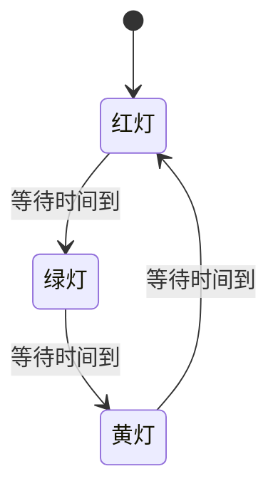
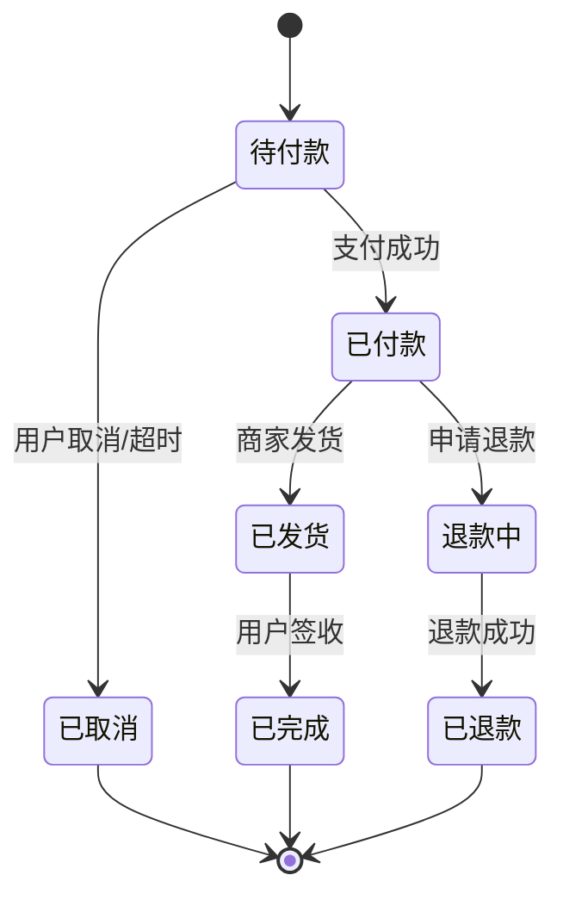
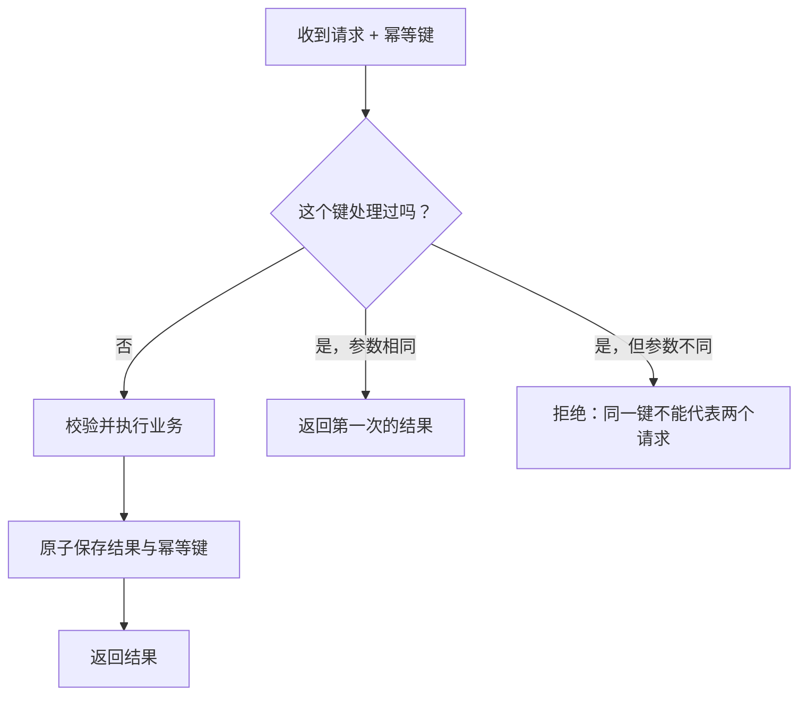

# 状态机与幂等性

> [!summary] 一句话解释
> **状态机规定一个对象“现在处于什么状态、遇到什么事件可以变成什么状态”；幂等性保证同一个操作即使重复执行，最终效果也不会被重复叠加。**

这两个概念经常一起出现，因为网络重试、消息重复和用户连续点击，都可能让同一个事件被系统处理多次。

---

## 一、状态机是什么

**State Machine（状态机）**读作“斯得特 machine”，是一种描述系统状态及其变化规则的模型。

最常见的是 **Finite State Machine（有限状态机，简称 FSM）**：系统只允许处于有限个预先定义的状态之一，并通过事件在状态之间转换。

例如一扇门可能只有：

```text
打开
关闭
锁定
```

“锁定的门”不能直接执行“打开”，必须先解锁。这种规则就是状态机的一部分。

## 为什么需要状态机

没有状态机时，程序可能到处写零散判断：

```text
如果订单付款了……
如果订单没有取消……
如果订单发货了但还没签收……
```

项目变大后，很容易出现矛盾状态：

```text
isPaid = false
isShipped = true
isCancelled = true
```

订单怎么可能既已经发货、又被取消、还没有付款？

状态机要求把合法状态和合法转换集中定义，从结构上减少这种矛盾。

## 状态机的五个核心组成

| 组成 | 英文 | 含义 | 订单例子 |
|---|---|---|---|
| 状态 | State | 对象当前所处阶段 | 待付款、已付款、已发货 |
| 事件 | Event | 促使系统尝试变化的事情 | 用户付款、商家发货 |
| 转换 | Transition | 从一个状态变成另一个状态 | 待付款 → 已付款 |
| 条件 | Guard | 转换前必须满足的判断 | 支付金额正确 |
| 动作 | Action | 转换时执行的工作 | 写付款记录、发通知 |

有些状态机还会明确：

- **Initial State（初始状态）**：对象创建时从哪里开始；
- **Final State（终止状态）**：流程到哪里结束；
- **Entry/Exit Action（进入/退出动作）**：进入或离开状态时做什么。

## 生活类比：交通信号灯

一个简化交通灯有三个状态：



规则规定绿灯后必须先变黄灯，不能随意直接跳到任意状态。

注意：真实交通系统还会有故障、闪烁、人工控制和行人信号等更多状态；图只是帮助理解。

## 订单状态机例子



这张图同时表达了哪些转换不允许：

- 已取消订单不能继续发货；
- 待付款订单不能直接变成已完成；
- 已退款订单不能再次正常发货。

## 用转换表表达规则

状态图适合观察整体，转换表适合程序实现和测试：

| 当前状态 | 事件 | 条件 | 下一个状态 |
|---|---|---|---|
| 待付款 | 支付成功 | 金额和订单匹配 | 已付款 |
| 待付款 | 取消 | 尚未支付 | 已取消 |
| 已付款 | 发货 | 库存已扣减 | 已发货 |
| 已付款 | 申请退款 | 满足退款规则 | 退款中 |
| 已发货 | 签收 | 物流确认 | 已完成 |

测试时应该同时检查：

- 所有允许的转换能成功；
- 所有不允许的转换被拒绝；
- 转换失败时状态没有只改一半；
- 转换动作失败时怎样回滚、重试或进入失败状态。

## 一个简短的 TypeScript 例子

```ts
type OrderState = 'pending' | 'paid' | 'shipped' | 'cancelled'
type OrderEvent = 'pay' | 'ship' | 'cancel'

function nextState(state: OrderState, event: OrderEvent): OrderState {
  if (state === 'pending' && event === 'pay') return 'paid'
  if (state === 'pending' && event === 'cancel') return 'cancelled'
  if (state === 'paid' && event === 'ship') return 'shipped'

  throw new Error(`非法转换：${state} + ${event}`)
}
```

这段代码做了三件事：

1. 用联合类型限定合法状态和事件；
2. 只实现允许发生的转换；
3. 对非法转换明确报错，而不是悄悄产生未知结果。

真实项目还需要数据库事务、并发控制、日志和转换动作，不能只靠这一个函数。

## 状态与事件不要混淆

```text
“已付款”是状态
“付款成功”是事件
“付款”也可能是命令
```

常见区分：

- **Command（命令）**：某人希望系统做什么，例如“请付款”；
- **Event（事件）**：已经发生的事实，例如“付款已成功”；
- **State（状态）**：事实累积后对象现在是什么情况，例如“订单已付款”。

命令可能失败，事件通常表示已经发生。

## 状态机不一定非要使用专门框架

状态机首先是一种建模方法，可以用：

- `switch`/`if`；
- 转换表；
- 类和方法；
- 数据库状态字段；
- 专门状态机库；
- 工作流引擎。

状态很少、规则简单时，清楚的转换函数通常足够。不要为了三个状态就引入庞大工作流系统。

## 状态爆炸是什么

**State Explosion（状态爆炸）**指多个互相独立的维度被强行组合后，状态数量急剧增加。

例如订单同时有：

- 支付：未付/已付/已退；
- 物流：未发/已发/签收；
- 售后：无/申请中/完成。

如果把所有组合都写成一个字符串，就可能出现几十个状态。

常见处理办法：

- 把真正独立的维度拆成多个状态机；
- 使用 Hierarchical State Machine（层次状态机）；
- 明确哪些维度必须联动；
- 避免用大量真假布尔值随意组合。

---

## 二、幂等性是什么

**Idempotency（幂等性）**读作“艾登坡腾西”，表示：

> **对同一目标重复执行同一个操作一次或多次，最终可观察效果与只执行一次相同。**

数学上常写作：

```text
f(f(x)) = f(x)
```

这里不是要求每次执行过程完全一样，而是最终效果不继续叠加。

## 生活类比

### 幂等操作：把灯设置为关闭

```text
设置为关闭 1 次 → 灯是关闭的
设置为关闭 10 次 → 灯仍是关闭的
```

### 非幂等操作：切换灯的开关

```text
切换 1 次 → 关灯
切换 2 次 → 又开灯
```

“设置为某个状态”通常比“在当前状态上增加/切换一次”更容易实现幂等。

## 常见例子

| 操作 | 通常是否幂等 | 原因 |
|---|---|---|
| 把用户名设置为“小明” | 是 | 重复设置后仍是同一个值 |
| 把余额增加 100 元 | 否 | 重复执行会不断加钱 |
| 把订单标记为已取消 | 可以设计为是 | 已取消时再次取消不继续改变结果 |
| 创建一笔新订单 | 通常否 | 重复执行可能创建多笔订单 |
| 删除指定资源 | 按 HTTP 语义通常幂等 | 删除一次后，再删不会让最终状态继续变化 |
| 发送一封邮件 | 通常否 | 重复执行会发送多封 |

“通常”很重要。是否幂等取决于具体 API 约定和实现，而不是只看函数名。

## 为什么网络系统特别需要幂等

客户端发出付款请求后，可能发生：

```text
客户端发送请求
→ 服务器扣款成功
→ 返回响应时网络断开
→ 客户端不知道是否成功
→ 客户端重试
```

第一次请求可能已经成功，只是响应丢了。如果第二次重试再次扣款，就会重复支付。

这叫“结果不确定”问题：

```text
超时 ≠ 操作一定失败
超时只表示客户端没有及时拿到结果
```

幂等设计让客户端可以安全重试。

## Idempotency Key 是什么

**Idempotency Key（幂等键）**是客户端为一次业务意图生成的唯一标识。

例如：

```http
Idempotency-Key: pay-order-20260817-0001
```

服务器的简化处理流程：



同一个幂等键应该代表同一次业务意图，而不是“同一个用户的所有请求”。

## 幂等键不能只存在内存里

如果服务器重启后忘记所有幂等键，重试仍可能重复执行。

重要业务通常会把幂等记录保存在：

- 数据库唯一约束；
- 持久化幂等表；
- 与业务结果同一个事务中；
- 具有明确持久性和过期策略的存储。

只使用单进程内存缓存，通常只能减少短时间重复，不能提供强保证。

## 原子性为什么重要

错误做法：

```text
1. 扣款成功
2. 程序崩溃
3. 还没写入“幂等键已处理”
4. 重试后再次扣款
```

因此业务结果与幂等记录最好 **Atomically（原子地）**提交：要么都成功，要么都不成功。

```text
业务变更 + 幂等记录
        ↓
同一个数据库事务或等价的一致性机制
```

幂等性和原子性不是同一个概念，但经常需要一起使用。

## 数据库中常见的实现方式

### 1. 唯一约束

例如每个支付请求的 `request_id` 必须唯一：

```sql
UNIQUE (request_id)
```

两个并发请求使用同一个 id 时，数据库只允许一个成功插入。

### 2. 设置值，而不是累加值

更容易幂等：

```sql
UPDATE orders SET status = 'cancelled' WHERE id = 123;
```

不容易幂等：

```sql
UPDATE accounts SET balance = balance + 100 WHERE id = 123;
```

第二种必须配合唯一业务事件或账本，避免同一笔入账重复执行。

### 3. Upsert

**Upsert** 是“存在就更新，不存在就插入”。它可以帮助实现某些设置型幂等操作，但不代表所有 Upsert 天然满足业务幂等，仍要检查更新内容是否会累加。

## HTTP 方法中的幂等语义

HTTP 规范通常把方法分为：

| 方法 | 规范语义是否幂等 | 常见用途 |
|---|---|---|
| `GET` | 是 | 读取资源 |
| `HEAD` | 是 | 只读取响应头 |
| `PUT` | 是 | 把资源设置为请求给出的完整状态 |
| `DELETE` | 是 | 删除指定资源 |
| `POST` | 不保证 | 创建、提交动作或触发业务 |
| `PATCH` | 不保证 | 部分修改，是否幂等取决于补丁语义 |

这里的幂等指“服务器预期效果”，不表示每次响应代码必须完全相同。

例如第一次 `DELETE` 可能返回成功，第二次返回“资源不存在”，但最终状态都是资源不存在，因此仍可符合幂等语义。

> [!warning] `GET` 不应该产生重要业务副作用
> 如果开发者错误地把“扣款”做成 `GET /pay`，方法名称不会神奇地让扣款变安全。实现必须遵守协议语义。

## 幂等不等于每次返回完全相同

重复请求可能出现：

- 第一次返回 `200`；
- 第二次返回缓存的第一次结果；
- 或第二次返回“已经处理”。

只要业务约定清楚、最终效果没有重复叠加，就可能仍然满足幂等目标。

支付等严格 API 通常会保存并重放第一次响应，让客户端更容易确认结果。

## 幂等不等于不执行

重复操作仍可能：

- 查询数据库；
- 检查幂等键；
- 写访问日志；
- 更新监控指标；
- 返回第一次结果。

幂等关注的是业务可观察效果不被重复叠加，不是要求 CPU 什么也不做。

## 幂等不等于去重

**Deduplication（去重）**是识别并丢弃重复项的一种实现手段。

幂等是外部性质：重复执行后结果是否等同一次执行。

```text
去重：怎样实现
幂等：最终表现出的性质
```

有些操作不保存所有请求 id，也可以因为“设置为固定值”而天然幂等。

## 幂等不等于加锁

锁解决多个操作同时执行时的互斥问题，但不能自动识别两个请求是否代表同一业务意图。

```text
锁：不要同时执行
幂等键：不要把同一业务执行两次
```

两个重复请求即使排队依次获得锁，也可能依次扣款两次。因此有锁仍可能需要幂等键或唯一约束。

## 幂等不等于可交换

**Commutativity（可交换性）**表示操作顺序互换后结果相同：

```text
A 后 B = B 后 A
```

幂等表示同一个操作重复后结果相同：

```text
A 后 A = A
```

二者解决不同问题。

---

## 三、状态机与幂等性有什么关系

状态机回答：

```text
这个事件在当前状态是否合法？
合法时应该转到哪里？
```

幂等性回答：

```text
同一个事件因为重试被处理两次，会不会产生两份效果？
```

### 订单付款例子

```text
状态：待付款
事件：支付请求 pay-001
```

第一次处理：

```text
检查 pay-001 未处理
→ 扣款
→ 订单 待付款 → 已付款
→ 保存 pay-001 的结果
```

重复处理：

```text
发现 pay-001 已处理
→ 不再次扣款
→ 返回第一次结果
→ 订单仍是已付款
```

状态机阻止“已付款订单重新走一次待付款转换”，幂等键则进一步识别这是不是同一次支付业务。

### 只检查状态为什么还不一定够

假设订单是“已付款”，用户又真的发起了一笔合法的补款。只看状态可能无法区分：

- 上一次请求的网络重试；
- 一次全新的支付意图。

因此业务系统通常同时需要：

- 状态；
- 事件/命令 id；
- 金额和请求参数；
- 唯一约束；
- 原子事务。

## Cordis 中的例子

[[Cordis运行时机制：Fiber、Effect与Scope|Cordis Fiber]] 使用状态机描述插件处于：

```text
PENDING → LOADING → ACTIVE → UNLOADING → DISPOSED
```

Effect 的 disposer 又使用幂等保护：第一次调用执行清理，重复调用不再清理第二次。

为什么需要幂等 disposer？因为资源可能通过不同路径触发清理：

- 插件主动卸载；
- 父插件卸载；
- 依赖失效；
- 加载失败后的清理；
- 进程关闭。

如果同一个清理动作执行两次会报错或破坏其他资源，生命周期系统就会很脆弱。

## Agent 工具中的例子

Agent 可能因为：

- 没看到工具返回；
- 网络超时；
- 模型判断错误；
- Loop 重试；
- 消息系统重复投递；

再次发起同一个操作。

读取文件通常容易重复；付款、发消息、创建工单等操作则应使用幂等键、审批和持久日志。详见 [[Agent工具运行时：执行流水线、并发调度与Code Mode]]。

## 常见误区

### 误区 1：状态机就是画流程图

状态图只是表示方式。真正的状态机还需要明确合法状态、事件、Guard、转换动作和非法转换处理。

### 误区 2：用了字符串 `status` 就是完整状态机

只有状态字段，没有集中转换规则，程序仍可能从任意状态写成任意值。

### 误区 3：幂等就是“不重复发送请求”

客户端无法保证网络和消息系统永不重复。幂等是服务器即使收到重复请求也能安全处理。

### 误区 4：超时表示操作没有成功

超时只说明没有及时得到响应。操作可能已经成功，因此重试前必须考虑幂等性。

### 误区 5：有数据库事务就自动幂等

事务保证一组操作整体提交或回滚，不自动识别第二次请求是不是同一业务。

### 误区 6：所有接口都必须幂等

不是所有操作都能天然幂等，但重要的可重试操作应设计幂等协议，或明确要求调用方不得自动重试并提供查询结果的办法。

## 初学者记忆法

```text
状态机：现在在哪，什么事情能让它去哪
幂等性：同一件事做很多次，业务效果仍像只做一次
原子性：一组改变要么都成功，要么都不成功
唯一约束：数据库层阻止同一标识出现多份
锁：避免多个操作同时争抢资源
```

## 学习建议

1. 先给“门”或“订单”画出状态图；
2. 再写一张“当前状态 + 事件 → 下一状态”的转换表；
3. 为每个非法转换写测试；
4. 模拟一次“服务器成功但响应丢失”的网络重试；
5. 给创建订单或付款接口增加幂等键；
6. 最后学习数据库事务、唯一约束、乐观并发控制和消息队列重复投递。

## 关联概念

- [[Cordis运行时机制：Fiber、Effect与Scope]]：Fiber 状态机与幂等 disposer。
- [[Agent工具运行时：执行流水线、并发调度与Code Mode]]：Agent 工具重试、并发和副作用。
- [[TCP、HTTP、HTTPS与WebSocket]]：网络超时、HTTP 方法和重试背景。
- [[SDK与API]]：API 应怎样向调用方声明幂等约定。
- [[ORM]]：状态和幂等记录通常需要数据库事务与唯一约束。
- [[Prompt Engineering与Loop Engineering]]：循环重试有可能重复执行有副作用的工具。

## 参考资料

- [IETF RFC 9110：HTTP Method Idempotency](https://www.rfc-editor.org/rfc/rfc9110.html#name-idempotent-methods)
- [AWS Builders' Library：Making retries safe with idempotent APIs](https://aws.amazon.com/builders-library/making-retries-safe-with-idempotent-APIs/)
- [Microsoft Learn：State Machine workflows](https://learn.microsoft.com/en-us/dotnet/framework/windows-workflow-foundation/state-machine-workflows)
- [DeepSeek Harness vendor Cordis：Fiber 源码](https://github.com/deepseek-ai/deepseek-harness/blob/master/vendor/cordis/src/fiber.ts)
