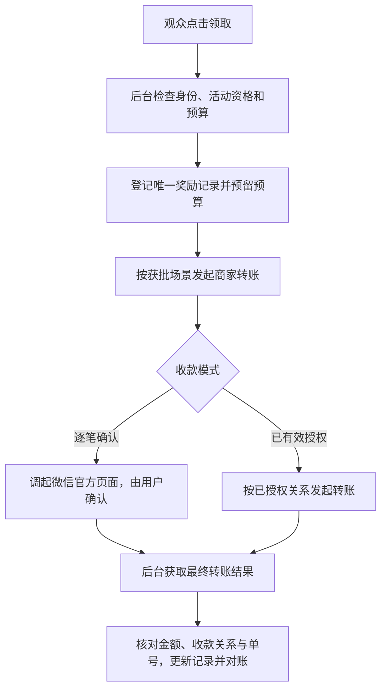
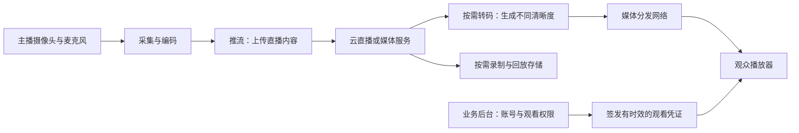

# 直播平台开发前的需求、架构、成本与验收清单

> [!summary] 一句话解释
> 找人开发直播平台，最重要的是先明确“给谁播、怎么互动、多少人看、谁负责内容、持续花多少钱、交付后谁能维护”，再选择团队和技术；能播放一场演示直播，只是起点。

本文按“准备找团队开发”的情况整理，并不代表已经确定采购、架构或上线方案。用户已明确场景为“私域营养品、讲师授课”，并需要商家向听课用户发放到账微信零钱的现金红包；产品法定类别、是否直接销售、地区、规模、预算和商户权限仍待确认，因此不直接给出固定报价或完整许可清单。法规与产品资料核对日期：2026-09-11。

## 先看具体场景：私域营养品、讲师授课

### 1. 先按课程直播系统评估，不默认建设开放型主播平台

当前可以优先评估“指定讲师开课、受邀客户观看、助教答疑、必要的回放与课程管理”。是否涉及现场销售、课后导购、付费课程或销售人员培训，要另行明确；这些都不能仅从“授课”两个字推断。

“私域”通常指通过社群、会员或自己的客户渠道持续接触用户，是一种客户运营方式。它不等于内网、私有化部署或只有本机能访问。一个微信群发出的直播链接，背后仍可能是公网服务。参见 [[内网、公网与私有化服务器部署]]。

### 2. 优先核对营养品类别与宣传方式

“营养品”是日常称呼，不能据此确定适用的监管类别。先拿实际包装、标签、注册/备案材料等，确认是普通食品、保健食品、特殊医学用途配方食品，还是其他类别；不要只根据“蛋白粉”“维生素”这样的名称判断。

面向中国大陆时，普通食品不能宣传保健功能或疾病防治效果；保健食品也不是治病药物。市场监管总局的风险提示明确覆盖口头宣讲、微信群与直播话术等营销形式。因此，不能因为只向老客户讲课，就把宣传审核省掉。[市场监管总局：食品宣传风险提示](https://www.samr.gov.cn/xw/sj/art/2025/art_e27f6eaa4c074317b256275698ba28d2.html)

对保健食品等规定类别，广告有发布前审查要求。尤其要注意：不得用健康科普包装变相广告；健康、养生知识内容与相关保健食品等的销售联系方式、购买入口，在同页或同一时间出现，受到明确限制。“加一句免责声明”“标注广告”或“换到群里成交”，都不能被当成自动合规的办法。课程、商品展示和导购流程应整体交专业人士审查。[《互联网广告管理办法》第七至九条](https://www.samr.gov.cn/zw/zfxxgk/fdzdgknr/fgs/art/2023/art_d93a579afd45413e8576e4623fab348f.html)

讲师真实身份与资历可以核验，但不能据此推断可以用专家或医师形象为保健食品作推荐、证明；相关广告内容也不能超出产品获准范围。是否构成广告、代言或其他商业宣传，需要结合实际课件、口播和销售安排判断。[相关广告审查办法第七、十一条](https://www.samr.gov.cn/zw/zfxxgk/fdzdgknr/fgs/art/2023/art_4ca076ac0eeb4a9e9204e0cee26e359b.html)

以上是上线前的风险检查方向，不是对尚未提供的具体产品与课程作违法判断。真正的营养知识教育与产品营销应当如实呈现，不能通过界面分拆掩盖其真实性质。

### 3. 更贴近本场景的首期功能

| 优先能力 | 具体要求 |
|---|---|
| 受邀观看 | 名单或账号授权、邀请有效期、撤销权限；不要仅靠所有人共用一个口令 |
| 讲师授课 | 电脑摄像头、麦克风、课件或屏幕共享；课前检查收音、网络与课件可读性 |
| 助教与管理员 | 管理提问、处理举报、静音/禁言、紧急停播；不同角色权限分开 |
| 观众体验 | 如果客户主要在微信，从微信中用真实手机打开测试；大字、清晰音频、简单进入步骤 |
| 内容审查 | 课件和讲稿留版本、审核状态、口播处置；必要的记录受控留存 |
| 回放 | 明确是否需要，设置观看范围与期限；面向客户发布回放与后台证据留存分开管理 |
| 基础统计 | 课程进入人数、观看时长、播放失败、卡顿；明确口径，不虚构在线人数或购买记录 |
| 售后入口 | 如涉及交易，提供清晰的经营主体、客服与争议处理方式；是否能挂商品入口先完成合规核对 |

普通单向讲课不一定需要所有观众都加入实时音视频通话。可以先用广播式直播加文字提问；确有连麦教学需求，再评估少数讲师/学员实时连麦、其他人观看的组合，兼顾体验和用量成本。

如果制作定时播放的录播课，应如实标示，不伪装成正在发生的实时互动。用户网络不好、拒绝摄像头权限或没有安装某个应用时，也应有易懂的提示。

### 4. 健康问答和客户数据尤其谨慎

不要默认让观众在公共弹幕中发送病历、体检报告、用药情况或完整联系方式。医疗健康信息属于敏感个人信息；如确有必要处理，应核对必要性、单独同意等条件并严格限制访问，不能随意向销售人员批量开放。[《个人信息保护法》第二十八至三十条](https://www.cac.gov.cn/2021-08/20/c_1631050028355286.htm)

课程答疑不应越界成为未经适当资质和流程的个体诊疗，尤其不应鼓励观众依据商品宣传自行停药。课件、回放和客户数据的权限设计需要分别处理；不能把“防止客户流失”作为无限制收集和共享信息的理由。

### 5. 找什么团队更对口

优先比较做过**企业培训、课程直播或合规私域教学**的服务商/开发团队，并要求演示讲师端、助教端和观众端。询问候选服务是否接受拟经营的产品类别、需要哪些资质和内容审核；成熟服务的使用条件同样要核对。

若标准产品已经覆盖主要需求，先试用验证再决定是否定制。需要自有流程时，可以定制课程与客户授权系统，底层使用成熟云直播能力；无需先自建各地分发节点。若将来涉及成交统计，再在合法、必要的数据范围内对接既有商城，而不是默认首期再造一整套商城和资金系统。

### 6. 到账微信零钱的红包：要接通什么，而不是“打通什么墙”

**现金红包需要把直播活动、用户微信身份、商户出资权限和转账结果接起来；通常不是翻墙，也不是关闭防火墙就能实现。** 这里讲的是商家给听课用户发钱，不能与观众向主播打赏混淆。

生活类比：红包动画相当于“奖励通知”，商户后台相当于“财务审核”，微信支付相当于“执行转账的出纳”。领取动画本身不产生现金，平台必须确认最终结果，才能显示实际到账。

现金到账、平台内待提现奖励、商品优惠券是三种不同状态或能力。平台显示“奖励余额 10 元”不代表微信零钱已经增加 10 元；提现仍需要实际出资。优惠券只能按规则抵扣，也不能冒充现金。

#### 6.1 先核对商户资格与现行产品

截至 2026-09-11 核对，微信支付旧版“现金红包”产品说明在 2026-06-18 更新时明确：不再向新商户开放，已开通存量商户仍可使用，建议接入“商家转账”。不要直接照搬旧“现金红包”“企业付款”等接口教程，也不能推断所有旧商户已被统一停用。[微信支付：现金红包产品说明](https://pay.wechatpay.cn/doc/v2/merchant/4011957949)

新项目应核对新版“商家转账”及对应场景权限。官方接入准备要求核查商户信用与风险情况、提交场景资料，当前不支持其产品定义下的“小微商户”；这个术语不能直接等同于所有小企业。**能微信收款，不等于已经获准向用户转账。**[微信支付：开发接入准备](https://pay.wechatpay.cn/doc/v3/merchant/4013740645)

听课活动奖励是否适用“现金营销”，应按实际方案向支付平台确认，不能自行改成佣金、退款等不真实场景。该场景的官方接口要求报备活动名称、奖励说明等业务背景。[微信支付：现金营销场景](https://pay.wechatpay.cn/doc/v3/merchant/4013774588)

#### 6.2 需要接通六个环节

| 环节 | 要解决的问题 | 主要负责人 |
|---|---|---|
| 商户与业务权限 | 谁实际出资，是否已开通对应转账场景 | 经营主体、商户管理员、微信支付审核 |
| 用户与应用身份 | 哪个应用下的哪个微信用户领取 | 开发团队、应用管理员 |
| 活动规则 | 谁能领、每人几次、每次多少、活动期限和总预算 | 运营制定，开发实现 |
| 资金与接口安全 | 账户余额、限额、请求签名、密钥保护 | 财务、管理员、开发团队 |
| 收款与对账 | 用户确认或授权、结果通知、主动查单、账单核对 | 用户、微信支付、后台系统 |
| 网络访问控制 | 正确的出口地址、接口安全名单、可达的通知入口 | 运维和开发团队 |

**API（Application Programming Interface，应用程序编程接口，按字母读）** 是后台提交和查询转账的通道。三个身份参数也不同：

- `mchid`：Merchant ID，商户标识，用于确定出资商户。
- `AppID`：Application ID，应用标识，读作“App + 字母 ID”，对应接入的公众号、小程序或移动应用。
- `OpenID`：微信文档中的用户标识字段名，读作“Open + 字母 ID”；在这里标识某一应用下的用户，不是昵称、手机号，也不是所有应用通用的同一个号码。这里讨论的是微信的字段，不是通用登录协议的介绍。

AppID 要与商户号正确关联；使用 OpenID 的流程中，用户标识必须与对应应用匹配。证书私钥、通知解密密钥等秘密只能在受控环境保管，不能放进直播网页或公开代码仓库。[微信支付：开发必要参数说明](https://pay.wechatpay.cn/doc/v3/merchant/4013070756)

#### 6.3 一次现金红包怎样真正到账

新版商家转账支持逐笔确认收款，以及先经用户授权、后续免逐笔确认的模式；“免确认”不等于“不需要授权”。



这是简化业务流程，不是完整接口状态图。开发团队应按观众所在的微信网页、小程序或移动应用，接入相应官方流程；普通浏览器不能被假定能原样调用所有微信能力。结果通知可能延迟或遗漏，需主动查单兜底，不能仅凭页面动画、前端返回或请求已受理判断到账。[微信支付：商家转账开发指引](https://pay.wechatpay.cn/doc/v3/merchant/4012715211)

#### 6.4 如果“墙”确实指防火墙，相关的是这些配置

**IP（Internet Protocol，互联网协议，按字母读）地址**用于网络寻址。微信商家转账要求配置接口安全 IP，仅允许设定来源调用。填写时核对服务器实际的公网出口地址；经过云网络出口转换时，它不一定等于服务器内网地址，更不是观众手机或 CDN 节点地址。[微信支付：设置接口安全 IP](https://pay.wechatpay.cn/doc/v3/merchant/4013751010)

- **出站**：业务服务器能访问微信支付官方接口；出口地址应可管理，并与支付平台配置一致。
- **入站**：用于接收转账结果的通知入口可达。公网部署通常通过 **HTTPS（Hypertext Transfer Protocol Secure，安全超文本传输协议，按字母读）** 网关或负载均衡入口接收，常用端口为 443，内部服务不必直接暴露。
- **应用核验**：后台验证通知签名、解密并核对订单，不能收到自称微信的请求就改余额。

这不是要求关闭防火墙或公开数据库。支付请求签名的商户证书私钥、验证通知的公钥与网站 HTTPS 证书用途不同。你自己电脑开不开代理，通常也不决定生产服务器是否具备转账资格。[支付安全参数用途](https://pay.wechatpay.cn/doc/v3/merchant/4013070756) 参见 [[防火墙与端口对外开放]]、[[TLS与数字证书]]、[[密钥管理：DEK、KEK、KMS、HSM与信封加密]]。

### 7. 现金红包怎样防止多发、错发和超预算

现金一旦实际转出，不能假设随时可追回；金额、收款对象、资格和预算都要由服务端验证，不能相信浏览器传来的“我该领多少钱”。

- **幂等**：用户连点、刷新、通知重复到达，仍只产生一次应有的发放。设计符合规则的业务唯一键，同一发放尝试使用稳定的商户单号。
- **状态机**：把待处理、等待确认、结果未知、成功、失败或撤销分开，依据合法事件转换状态。
- **结果不明先查单**：网络超时不等于没有发出，不能立即换新单号重发。官方明确提示，结果不明时换单重试可能重复出资。[商家转账重试与查询指引](https://pay.wechatpay.cn/doc/v3/merchant/4012715211)
- **并发预算控制**：检查、预留和更新金额要保持一致；未确定结束的转账不能提前释放预留金额。假设预算 1,000 元、每份 1 元，不能因为多人同时领取就超发。金额宜按“分”等最小货币单位用整数处理。

参见 [[状态机与幂等性]]、[[高并发系统：瓶颈分析、扩容与稳定性治理]]。以上是设计检查点，不是完整代码或实际付款授权。

验收至少覆盖：重复点击不多发、身份切换不错发、余额不足和限额有明确提示、用户取消确认或撤销授权能正确处理、通知遗漏可查单、失败与撤销按最终状态处理、账单与奖励记录可核对。除普通用户外，也要控制管理员误操作，并对异常领取做适度频率限制与人工复核，不为防刷过度收集个人信息。

活动规则要清楚说明金额或分配方式、名额、时间、领取条件和到账流程。抽奖、购买或分享条件需另核对法律与微信规则；支付权限获批不等于营养品宣传活动已全面合规。资金来源、会计处理和可能的税务义务应由财务核对，不在这里给出统一税务结论。

### 8. 可以直接发给开发商的红包需求

> 我需要商家给听课用户发放实际到账微信零钱的活动现金，不是仅显示平台余额。请说明现行微信支付产品和场景、商户申请条件、支持的领取端、身份授权与收款流程、预算及幂等控制、查单对账方式，以及怎样开展经授权的小额验收。请分开列出奖励本金、技术服务费和其他渠道费用。

成熟直播服务也要查清“谁出资、谁持有商户号、资金由谁保管、余额怎样退出”。不借用不明商户号，不虚报场景，不把个人微信自动化发红包当成正式商户集成方案。商户申请和账户问题找微信支付官方支持，业务代码找开发团队，直播服务限制找其官方客服；普通 CDN 节点服务不能代替这些环节。

## 一、生活类比：不是买一台摄像机，而是经营一座演播厅

把直播平台想象成一座对观众开放的演播厅：

| 演播厅里的事情 | 平台对应能力 |
|---|---|
| 摄像机、麦克风和导播 | 采集画面、声音，选择要播出的内容 |
| 将节目送到各地 | 音视频传输、转码和分发 |
| 观众拿票进场 | 登录、购买、观看权限检查 |
| 现场讨论和举手发言 | 聊天、弹幕、连麦 |
| 工作人员巡场 | 内容审核、举报、禁言、停播 |
| 电费、线路费、值班工资 | 云服务、带宽、存储和运营维护费用 |
| 钥匙、产权和维修图纸 | 账号控制权、代码权利、部署文档和可接手维护的交付物 |

所以“页面做得好看”和“平台可以长期稳定运营”，不是同一个验收目标。

## 二、报价前，先把需求写清楚

### 1. 是什么直播业务

| 类型 | 优先确认的问题 |
|---|---|
| 企业内部培训、内部活动 | 是否仅员工可看、企业账号登录、录制保密、数据存放地区 |
| 课程、公开讲座、会议直播 | 预约通知、课件、回放、付费观看、讲师与学员互动 |
| 娱乐、用户自行开播的平台 | 主播入驻、内容审核、举报处置、未成年人保护、打赏和运营规则 |
| 直播带货 | 商家与商品审核、订单、支付、退款、售后、直播交易记录 |
| 多人连麦、实时互动 | 发言者人数、端到端延迟、回声消除、弱网恢复和混流 |

这些类型可以重叠，但每增加一种，通常就增加一组业务规则、测试用例和运营责任。“有直播功能的网站”与“允许大量陌生人自行开播的平台”，工作量与风险差异很大。

### 2. 人数不能只填一个“用户量”

至少分别写明：

- **注册用户数**：有多少账户，不代表这些人同时观看。
- **同时开播的房间数**：一个活动还是很多主播一起直播。
- **单房间峰值观众数、全平台峰值观众数**：决定不同层面的承载目标。
- **平均观看人数与观看时长**：用于估算消耗，不能拿峰值人数直接当全天平均人数。
- **同时连麦人数**：只看直播的人和参与音视频对话的人，可能使用不同技术与计费方式。
- **集中进入速度**：一千人分一小时进入，与一千人在十秒内进入，登录和鉴权压力不同。

例如：“首期最多 5 个房间同时直播，每房间峰值 200 人，全平台峰值 800 人；每月累计 10,000 观众小时。”这里的“观众小时”是所有人的观看时长相加，不是主播总开播时长。这只是填写方式示例，不是对本项目规模的假设。

### 3. 明确使用地区与终端

观众主要在中国大陆、海外某个地区，还是多个地区？需要电脑浏览器、手机浏览器、微信内网页、小程序，还是独立手机应用？主播用电脑推流还是直接手机开播？

不要把“支持手机”写成一句话就结束：不同浏览器、应用内嵌网页、操作系统对摄像头授权、自动播放、后台运行和音视频格式的支持，需要实际测试。参见 [[Web端、桌面软件与CLI程序的区别]]。

## 三、平台里面到底有哪几层

### 1. 音视频链路：负责把画面送过去



这是常见广播式直播的简化示意，不是所有方案都必须转码。多人实时连麦可能采用不同的实时媒体架构，再把合成画面分发给普通观众。

- **编码**：把摄像头产生的原始数据压缩成适合传输的视频和音频。
- **推流**：主播把连续音视频数据上传给接收服务。
- **转码**：把输入转换为不同格式、清晰度或码率的输出。
- **码率**：每秒传输多少数据；它影响带宽和画质，但画质还受编码器、分辨率、帧率与画面内容影响。
- **拉流**：播放器从服务端获取直播音视频。
- **CDN（Content Delivery Network，内容分发网络，按字母读）**：把媒体等内容交付给各地用户。它不是整个直播平台，见 [[CDN内容分发网络：边缘缓存、回源与加速]]。

对一个主播、很多观众的场景，主播通常只需向接入服务发送一路或少数几路内容，不是用自己的家庭宽带给每位观众各发一路。面向观众的大规模分发由后续媒体基础设施承担。

### 2. 业务系统：负责谁能做什么

账号、房间、预约、聊天、付费、订单、管理后台、举报、审核、操作记录等属于业务能力。它们可以由开发团队定制，音视频能力则可以接入成熟服务。

**SDK（Software Development Kit，软件开发工具包，按字母读）** 常用来集成播放器或推流；**API（Application Programming Interface，应用程序编程接口，按字母读）** 用来创建直播间、管理录制或查询状态。参见 [[SDK与API]]。

WebSocket 是一种双向通信协议，常用于聊天、弹幕、状态通知。它也能传输二进制数据，但“支持 WebSocket”不等于已经具备完整的直播编码、分发、弱网处理和播放器能力。参见 [[TCP、HTTP、HTTPS与WebSocket]]。

### 3. 三个常见媒体技术名词

| 名词 | 全称、含义与用途 |
|---|---|
| RTMP | Real-Time Messaging Protocol，实时消息传输协议，按字母读；常见于主播推流。RTMPS 是其使用 TLS 加密传输的形式 |
| HLS | HTTP Live Streaming，基于 HTTP 的流媒体传输方案，按字母读；通过播放列表和媒体片段等组织内容，常用于大规模播放，也有低延迟扩展 |
| WebRTC | Web Real-Time Communication，Web 实时通信，读作“Web + 字母 RTC”；支持实时音视频与数据通信，常用于连麦等互动场景 |

HTTP 的全称是 Hypertext Transfer Protocol（超文本传输协议）；TLS 的全称是 Transport Layer Security（传输层安全协议），都按字母读。参见 [[TLS与数字证书]]。

不能只看到“低延迟”三个字就签约：要说明从摄像头发生动作，到观众屏幕显示动作的**端到端延迟**，在什么终端、地区和网络下测试。缓冲、转码、分发与播放器都会影响结果；云服务的典型指标不等于对你的整个平台作出保证。[Apple：HLS](https://developer.apple.com/streaming/)、[WebRTC 官方说明](https://webrtc.org/)、[Amazon IVS 直播服务说明](https://docs.aws.amazon.com/ivs/latest/LowLatencyUserGuide/what-is.html)

## 四、选成品、定制，还是自己搭媒体基础设施

| 路线 | 更适合什么情况 | 采购前要确认 |
|---|---|---|
| 使用成熟直播成品服务 | 主要想快速开展课程或活动，功能比较标准 | 品牌展示、业务限制、用户与回放导出、续费和退出方式 |
| 定制业务系统，接入云直播/实时音视频 | 有自己的账号、流程、品牌或业务整合需求 | 第三方依赖、持续费用、接口与播放器限制、迁移代价 |
| 自建媒体服务及运维体系 | 有明确控制需求与专业音视频团队，并经过成本论证 | 多地区网络、媒体兼容、容量、值守、故障恢复和长期人员投入 |

**SaaS（Software as a Service，软件即服务，常读作“萨斯”）** 指直接使用供应商持续提供的软件服务；不意味着你获得了它的全部源代码。

对第一次做这类项目的人，一个值得优先评估的路线是：**先用成熟服务验证业务；需要定制时，把业务层定制与媒体能力采购分开。** 这是项目风险控制建议，不是已经为本项目决定技术方案。

开源媒体软件不等于“全球直播免费”：服务器、出口网络、部署、升级、监控和人员成本仍然存在。也不需要为了做一个直播业务，就先自己去各个城市铺设 CDN 节点。

## 五、成本：开发费只是一部分

### 1. 让团队把报价拆开

- 一次性：需求梳理、界面、业务开发、媒体集成、测试、部署与培训。
- 使用量费用：直播分发流量或带宽、实时互动用量、转码、录制、存储、回放、聊天、短信等，视供应商计费项目而定。
- 固定或周期性费用：业务服务器、数据库、监控、安全服务、成品服务订阅。
- 人力费用：内容审核、客服、运维值班、主播支持、故障处理。
- 变更费用：后续新功能、新端适配、第三方接口变化和系统升级；与缺陷保修分开写。

例如，腾讯云直播将基础服务与转码、录制、审核等增值能力分别说明计费，相关存储或其他云产品还可能独立计费。实际费用应按选定地区、配置和当期规则核算，不能只问“一台服务器多少钱”。[腾讯云直播计费概述](https://cloud.tencent.com/document/product/267/52662)

### 2. 用一个算式理解观看人数为什么会影响费用

假设音视频合计平均码率为 **2 Mbps**，平均有 **1,000 人**观看 **2 小时**：

- Mbps：Megabits per second，兆比特每秒，按字母读，用来表示传输速率。
- MB：Megabyte，兆字节；GB：Gigabyte，吉字节；TB：Terabyte，太字节，都是数据量单位，按字母读。
- 1 字节 = 8 比特；本例按十进制换算：1 GB = 1,000 MB，1 TB = 1,000 GB。

```text
每位观众每秒数据量 = 2 / 8 = 0.25 MB
每位观众每小时数据量 = 0.25 × 3,600 = 900 MB = 0.9 GB
观众总观看时长 = 1,000 × 2 = 2,000 观众小时
总播放数据量约 = 0.9 × 2,000 = 1,800 GB = 1.8 TB
同一时刻 1,000 人都以此码率观看，分发端合计速率约为 2 Gbps
```

Gbps 是 Gigabits per second（吉比特每秒）。这里的 2 Gbps 是媒体分发端面向观众的合计速率，不是要求主播上传带宽达到 2 Gbps。

以上只是有效音视频数据量的简化估算，未计协议开销、重试、不同清晰度切换等；也不是账单报价。供应商可能按流量、峰值带宽、参与时长或套餐计费，还可能有其他项目。使用 CDN 会分担源站压力，但不会让观众接收的数据量消失。

### 3. 要求“低、预期、高”三档费用表

让报价注明观看时长、平均/峰值人数、码率、地区、连麦人数和录制保留期等假设，并列出超量后的单价。设置费用告警，并确认是否真的存在硬性限额、限额如何生效、是否会中断直播；不要把“发送余额提醒”误当成“自动封顶”。

## 六、内容、隐私与合规：上线前就要核对

> [!warning] 先确定适用范围
> 以下为面向中国大陆业务的核对方向，不是完整法律意见。具体义务取决于主体、公开或内部使用、新闻/表演/电商等内容和经营方式。应请熟悉该业务的专业人士及相关主管部门确认，不能只听开发团队一句“我们包上线”。

### 1. 不要把基础备案等同于全部许可

网站、应用的备案/许可要求，以及直播内容涉及的专项资质，需要按实际业务分别核对。新闻信息、网络表演、网络视听等不能仅凭“有服务器、有域名”推断可开展；也不是所有直播项目都机械需要同一套许可证。云服务商自己的资质，不自动成为运营方的资质。[《互联网直播服务管理规定》第五至七条](https://www.cac.gov.cn/2016-11/04/c_1119847629.htm)

### 2. 内容治理需要系统，也需要人

对适用的公众直播业务，要将身份核验、审核巡查、用户举报、紧急处置和记录留存纳入需求。技术上应能真正阻断违规直播，不能只在网页上隐藏一个房间入口；还要处理已有播放连接、权限和缓存缓冲的影响。自动审核可以辅助，但不应把运营责任写成“交给一个接口就结束”。[《互联网直播服务管理规定》](https://www.cac.gov.cn/2016-11/04/c_1119847629.htm)

### 3. 打赏与带货分别增加规则

- **有打赏**：2026-04-13 发布的通知涉及打赏规则、限额设置、提醒、异常行为、未成年人核验与投诉退款等。不要直接复用旧版功能模板而不核对。[《关于加强网络直播打赏规范管理的通知》](https://www.cac.gov.cn/2026-04/13/c_1777815804150225.htm)
- **有带货**：《直播电商监督管理办法》自 2026-02-01 起施行，涉及平台、直播间运营者等不同角色及身份核验、交易与消费者权益等责任。其第十六条对直播电商平台经营者的相关交易信息规定了自交易完成之日起不少于三年的保存要求；不能把普通技术日志保留期直接照搬到交易记录上。[《直播电商监督管理办法》](https://www.cac.gov.cn/2026-01/07/c_1769516655383334.htm)

这里列的是产品设计检查点，不是仅做完这几项即可合法运营的证明。若加入支付、商家分账或提现，还应先明确与合适支付服务商的责任分工，不自行把平台做成未经核实合规性的资金归集通道。

### 4. 摄像头授权不等于同意所有后续用途

设备允许调用摄像头，不自动等于同意公开直播、长期保存、对外提供录像或用于模型训练。应明确目的、范围、处理依据、告知方式、观看权限和保存期限，并检查第三方服务如何处理数据；不能为“将来可能用到”过度收集。法定留存义务与最短必要保存应结合具体数据分别设计。[《个人信息保护法》第六、十三、十七、十九、二十一条](https://www.cac.gov.cn/2021-08/20/c_1631050028355286.htm)

节目、音乐、课件、赛事画面和回放再利用的授权范围也应单独核对。“技术上可以转播”不是“已经获得传播权”。对跨境服务、未成年人或其他敏感信息，另做相应评估。

## 七、安全与稳定性，至少要问这些

### 1. 权限和费用保护

- 谁可以创建房间、推流、观看付费内容、管理主播？权限由服务端检查，不能只靠隐藏按钮。
- 推流密钥和云服务密钥是否只对必要角色开放？不能把管理密钥放进网页代码。
- 观看凭证是否有时效和适用范围？复制播放地址给别人能看多久？过期、退款、封号后，已有会话何时失效？
- 是否有盗链、异常流量、暴力登录监测与处置，能否避免费用被恶意消耗？
- 管理员账号是否有更强保护，敏感操作是否可审计？日志是否避免泄露密钥或不必要的个人信息？

短时签名地址、访问控制和水印可以降低滥用风险，但不能保证没人通过录屏或摄像机复制内容。参见 [[身份认证与授权：ACL、RBAC、MFA、OAuth、OIDC、SAML与SCIM]]、[[密钥管理：DEK、KEK、KMS、HSM与信封加密]]。

### 2. 把异常情况作为正式功能测试

- 主播网络短暂断开后，能否重连？是否错误生成多个直播间或漏掉录制？
- 观众切换无线网络与移动网络后，能否恢复播放？声音和画面是否同步？
- 一批人同时进入直播间，登录和观看授权会不会先于视频服务崩溃？
- 聊天故障时视频是否还能播放？付款结果通知重复到达时会不会重复记账？
- 封禁直播间后，已有播放连接是否在约定时间内终止？
- 发布新版失败、误删业务数据或存储故障时，怎样回滚、恢复和通知？

参见 [[高并发系统：瓶颈分析、扩容与稳定性治理]]、[[状态机与幂等性]]、[[高可用、健康检查与故障恢复]]。是否需要跨区容灾、双供应商等，要根据损失风险和预算确定，不是首期必须堆齐所有复杂架构。

## 八、找开发团队，重点查能力与交付控制权

### 1. 选择有相关真实项目经验的团队

要求看同类型项目中的实际播放、管理后台、弱网行为和运维数据，而不只是首页截图。询问对方具体负责了什么，哪些是采购或开源组件，哪些是自己开发；不要要求其泄露其他客户隐私或商业秘密。

找团队时可以先向候选云直播服务商询问其官方合作伙伴或解决方案渠道，再比较有对应案例的开发商。渠道推荐不等于质量担保，仍需独立核验。普通网站开发团队不必然具备实时音视频调试和直播值班能力。

### 2. 核心资产应当可控

- 域名、云账号、代码仓库、应用发布账号、支付商户等，原则上由你或正确的运营主体持有并管理。
- 给开发方必要的协作权限，而不是把所有主账号和密码长期交出去。
- 在合同中分别写明定制代码权利、已有组件许可、第三方服务订阅、可修改范围和数据导出权；“交付源码”不自动解决所有权利问题。
- 开发过程持续提交到约定仓库，而不是最后交一个无法追溯的压缩包。
- 交接时撤销不再需要的权限并轮换相关密钥，保留正常维护所需的受控入口。

### 3. 源码之外还需要这些交付物

需求与原型、架构图、数据库说明、接口说明、依赖版本及许可清单、构建和部署步骤、环境配置样例、测试报告、监控告警说明、备份恢复步骤、管理员使用手册、第三方服务和费用清单。

一个很有价值的验收方式：**由另一位具备相应能力的工程师，按交付文档在全新测试环境中构建和部署成功。** 成功后仍需业务、性能和安全验收；它不是完整验收的替代品。参见 [[开发、测试、预发布与生产环境]]、[[软件供应链：代码签名、SBOM与发布门禁]]。

## 九、验收：把“不卡、支持高并发”改成能测量的约定

以下各项应填写目标值与测试方法，而不是直接照搬某个供应商的宣传值：

| 验收项 | 应明确什么 |
|---|---|
| 首帧时间 | 从哪一刻开始，到第一帧画面显示；冷启动与已登录状态是否区分 |
| 端到端延迟 | 从拍摄事件到屏幕显示；指定地区、终端、网络、清晰度 |
| 卡顿与失败 | 卡顿时间占比、播放失败率、统计窗口与样本范围 |
| 容量 | 单房间与全平台观众数、同时开播数、同时连麦数、持续时间及突发进入速度 |
| 兼容性 | 指定真实手机、系统版本、浏览器和应用内网页；包括摄像头授权失败 |
| 业务正确性 | 未授权用户不能看；重复付款通知不重复处理；退款后权限按规则收回 |
| 审核处置 | 举报到后台、禁言、停播、记录和复核是否形成可验证流程 |
| 恢复与费用 | 故障告警到谁、恢复目标、回滚演练；测试用量是否与账单量级一致 |

如果采用 **P95（95th Percentile，第 95 百分位，读作“P 九十五”）**，意思是按相应口径收集的样本中，约 95% 不超过该值；不是平均值，也不保证剩余 5% 都正常。最好同时记录失败率与异常尾部情况。

“建立了 1,000 条聊天连接”不能证明“1,000 人能顺畅看视频”；必须验证真实媒体拉流、播放器与关键业务路径。负载测试可能产生明显费用，只能在明确授权的环境、容量和预算内进行。

**SLA（Service Level Agreement，服务等级协议，按字母读）** 要写清适用服务、可用性计算口径、故障响应、例外和补偿等。媒体供应商的 SLA 不会自动覆盖开发方的登录服务、数据库与业务系统。

## 十、合同与分阶段交付

建议围绕可验收成果划分里程碑，例如：需求和原型确认 → 核心链路演示 → 完整测试版本 → 容量与安全测试 → 正式交付和交接。付款条件与这些成果对应，具体合同条款请专业人士审阅。

尤其写清：

- 首期包含什么、不包含什么；新需求怎样评估费用与延期。
- 每阶段由谁验收、需要哪些证据、缺陷如何整改。
- 缺陷保修与新增功能、云费用、日常运维分别由谁承担。
- 故障谁接电话、多久响应、什么情况需要值守；“一年维护”不等于全天候保障。
- 团队退出、供应商停服或合作终止时，代码、数据、账号与服务怎样迁移。

## 十一、首期范围与可直接发给开发商的需求模板

**MVP（Minimum Viable Product，最小可行产品，按字母读）** 是能验证核心业务的一组最小功能，不是缺少权限、审核和安全底线的半成品。

如果业务允许，首期可优先完成一种观众端、明确的主播开播方式、观看权限、基本聊天、必要的内容治理、管理后台和监控；回放、支付是否首期必需由业务决定。复杂礼物钱包、推荐算法、多端齐发和商城体系，可以在并非核心需求时后置。

下面是询价模板，空项由项目负责人确认，数字不应由开发方随意猜测：

```text
业务用途与运营主体：
如涉及营养品：产品法定类别、授课对象、是否商品推广/销售：
主要观众地区：
谁可以开播，谁可以观看：
主播端与观众端范围：
同时开播数 / 单房间峰值观众 / 全平台峰值观众：
每月预计观众小时：
清晰度、目标延迟、是否连麦及连麦人数：
是否需要登录、付费、带货、打赏、录制与回放：
内容审核、举报处理与值班人员安排：
隐私、记录留存、数据地区与许可待确认事项：
首期必须功能 / 明确不做的功能：
开发预算 / 月度运营预算 / 期望上线时间：
请分开报价：定制开发、第三方用量、维护、变更。
请列明：第三方依赖、资产归属、完整交付物、验收方法、退出迁移方式。
```

## 十二、常见误区与学习建议

- “开发费付完就没费用了”：视频用量、存储、审核和维护通常持续发生。
- “买 CDN 就有直播平台”：CDN 是分发能力，不替代业务系统与运营。
- “用最快的语言就不会卡”：瓶颈也可能在主播网络、媒体服务、播放器、鉴权、数据库或第三方依赖。
- “页面显示停播就是真的停播”：必须验证已有流和观看权限的实际行为。
- “私有部署就不会向第三方发送数据”：只要用了外部媒体、审核、登录等服务，就要检查数据路径，见 [[内网、公网与私有化服务器部署]]。
- “有源码就一定能换人维护”：还需要合法可用的依赖、环境、文档、账号权限和部署验证。
- “一场内部测试成功就能正式开放”：还需测试目标终端、真实网络、容量、异常、安全与运营流程。

学习顺序建议：先读 [[CDN内容分发网络：边缘缓存、回源与加速]] 和 [[SDK与API]]，理解分工；再读 [[开发、测试、预发布与生产环境]]、[[高并发系统：瓶颈分析、扩容与稳定性治理]] 和 [[状态机与幂等性]]，理解为什么演示成功不等于完整交付。作为项目发起者，先能写清需求和判断验收证据，比先掌握全部音视频协议更重要。

## 十三、参考资料与使用边界

正文已在相应位置链接官方资料，包括 Apple HLS、WebRTC、Amazon IVS、腾讯云直播计费说明、微信支付现金红包与商家转账文档，以及网信办发布的直播、打赏、电商和个人信息保护相关文件、市场监管总局发布的食品宣传提示与互联网广告/相关广告审查规定。

技术服务功能、费用和法规适用判断应在正式选型及上线前再次核对。本文中的业务拆分、算式、询价与验收清单是学习和项目规划建议，不是供应商报价、性能承诺或完整法律意见。
