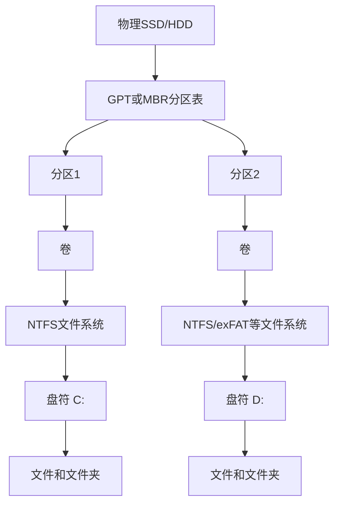

# 磁盘与网卡：存储设备和网络接口

> [!summary] 一句话解释
> **磁盘负责长期保存程序和数据，断电后通常仍然保留；网卡负责把计算机中的网络数据转换成有线或无线信号，并从网络接收数据。一个主要解决“存下来”，另一个主要解决“传出去、收进来”。**

---

## 一、先把它们放回整台电脑中理解

一台电脑需要多类部件合作：

| 部件 | 主要职责 | 生活类比 |
|---|---|---|
| CPU | 执行指令和计算 | 办公人员 |
| RAM 内存 | 临时保存正在使用的代码和数据 | 办公桌 |
| 磁盘 | 长期保存系统、程序和文件 | 档案室 |
| 网卡 | 与其他设备收发网络数据 | 收发室和运输通道 |
| GPU | 图形和大规模并行计算 | 专门处理图像的部门 |

例如打开一个从网上下载的视频：

```text
网卡从网络接收视频数据
→ 数据先进入内存
→ CPU和GPU处理、解码
→ 屏幕显示画面
→ 如果点击下载，系统再把数据写入磁盘
```

所以磁盘和网卡不是互相替代的部件。很多操作会同时使用二者。

---

## 二、磁盘是什么

### 1. 基本定义

**Disk（磁盘，读作“迪斯克”）**是操作系统用来长期保存数据的存储设备或逻辑存储对象。

它可以保存：

- Windows、Linux 等操作系统；
- 安装的软件；
- 照片、视频和文档；
- 数据库；
- 游戏资源；
- 日志、缓存和临时文件；
- Obsidian 仓库和 Git 仓库。

与普通 RAM 相比，磁盘属于 **Non-volatile Storage（非易失性存储）**：正常断电后，数据通常不会立即消失。

### 2. “磁盘”和“硬盘”不总是字面意思

传统 **HDD（Hard Disk Drive，硬盘驱动器）**内部确实有旋转的磁性盘片，因此叫“磁盘”。

但 **SSD（Solid-State Drive，固态硬盘）**内部没有旋转盘片，使用闪存保存数据。日常交流和操作系统界面仍经常把 SSD 也称为：

- 磁盘；
- 硬盘；
- Disk 0；
- 系统盘。

因此，今天说“磁盘”时，要根据上下文判断它指：

- 一块物理 HDD/SSD；
- 一个虚拟磁盘；
- 一个分区或卷；
- 操作系统中的磁盘设备对象；
- 泛指长期存储空间。

---

## 三、HDD 和 SSD 有什么区别

### 1. HDD：机械硬盘

HDD 主要包含：

- 旋转的磁性盘片；
- 读写磁头；
- 驱动盘片旋转的电机；
- 控制器和缓存；
- SATA、SAS 等连接接口。

读取数据时，盘片旋转，磁头移动到目标位置。因此 HDD 的随机访问会受到机械运动限制。

优点：

- 大容量价格通常较低；
- 适合大量冷数据、备份和媒体存储。

局限：

- 随机读取和写入延迟较高；
- 有噪声和振动；
- 怕跌落和机械损坏；
- 寻道时速度受磁头移动影响。

### 2. SSD：固态硬盘

SSD 主要包含：

- NAND Flash（NAND 闪存）颗粒；
- SSD 控制器；
- 固件；
- 可能存在的 DRAM 缓存；
- 用于断电保护或缓存管理的其他部件。

SSD 没有磁头和旋转盘片，控制器直接访问闪存，因此通常：

- 随机访问延迟更低；
- IOPS 更高；
- 没有机械寻道声；
- 抗一般震动能力更强；
- 体积和功耗可以更小。

但闪存单元的擦写次数有限。SSD 控制器会通过：

- Wear Leveling（磨损均衡）；
- Garbage Collection（垃圾回收）；
- Error Correction（错误校正）；
- Over-Provisioning（预留空间）；
- TRIM 提示；

延长寿命并维持性能。

### 3. 对比表

| 对比 | HDD | SSD |
|---|---|---|
| 存储介质 | 磁性盘片 | NAND 闪存 |
| 是否有机械运动 | 有 | 没有 |
| 随机访问 | 较慢 | 通常很快 |
| 噪声 | 可能有寻道和旋转声 | 基本无机械声 |
| 抗震 | 相对较弱 | 通常较强 |
| 单位容量价格 | 通常较低 | 通常较高 |
| 常见用途 | 大容量存储、备份 | 系统盘、软件、游戏、高性能存储 |

> [!warning]
> SSD 没有机械盘片，不等于永远不会坏。控制器、闪存、固件、电源和电路都可能故障。HDD 和 SSD 都不能代替备份。

---

## 四、SATA、NVMe、PCIe 和 M.2 分别是什么

这些词经常被混在一起。

### SATA

**SATA（Serial ATA，串行 ATA）**是一套存储连接和通信方式，常用于：

- 2.5 英寸 SATA SSD；
- 3.5 英寸或 2.5 英寸 HDD；
- 一些 M.2 SATA SSD。

### PCIe

**PCIe（Peripheral Component Interconnect Express，高速串行计算机扩展总线）**是一条高速总线，可以连接：

- 显卡；
- NVMe SSD；
- 独立网卡；
- 采集卡；
- 其他扩展设备。

### NVMe

**NVMe（Non-Volatile Memory Express，非易失性内存主机控制器接口规范）**是为非易失性高速存储设计的协议，个人电脑中的 NVMe SSD 通常通过 PCIe 与 CPU/芯片组通信。

NVMe 能利用多队列和并行能力，通常比 SATA 更适合高速 SSD。

### M.2

**M.2**主要是一种外形尺寸和连接器规范，不等于 NVMe。

可能存在：

```text
M.2外形 + SATA协议
M.2外形 + PCIe/NVMe协议
```

因此“它是 M.2”还不足以判断速度和协议。购买或安装时需要同时核对：

- 插槽支持 SATA 还是 PCIe；
- SSD 使用 SATA 还是 NVMe；
- PCIe 代数和通道数；
- 主板 BIOS/UEFI 是否支持；
- 长度规格是否兼容。

---

## 五、物理磁盘、分区、卷、文件系统和盘符

这几个概念非常容易混淆。

### 1. 物理磁盘

一块真实 HDD、SSD、U 盘或其他存储设备。在 Windows 磁盘管理中可能显示为：

```text
磁盘 0
磁盘 1
```

### 2. 分区表

分区表记录磁盘怎样划分。现代电脑常使用：

- **GPT（GUID Partition Table，GUID 分区表）**；
- 较老系统可能使用 **MBR（Master Boot Record，主引导记录）**。

### 3. 分区

**Partition（分区）**是在物理磁盘地址空间中划出的一段范围。

一块物理磁盘可以有多个分区，例如：

```text
物理SSD
├─ EFI系统分区
├─ Windows系统分区
└─ 恢复分区
```

### 4. 卷

**Volume（卷）**是操作系统可以管理和挂载的逻辑存储空间。简单电脑里，卷经常与一个分区对应，但更复杂的存储方案中，一个卷不一定只对应一个简单分区。

### 5. 文件系统

**File System（文件系统）**规定数据怎样组织成文件和文件夹，以及怎样记录：

- 文件名；
- 目录层级；
- 文件大小；
- 文件内容的位置；
- 时间戳；
- 权限；
- 空闲空间。

Windows 常见文件系统：

- NTFS；
- FAT32；
- exFAT。

### 6. 盘符

Windows 通常给卷分配入口：

```text
C:
D:
E:
```

`C:` 是盘符，不一定代表一整块物理磁盘。`C:` 和 `D:` 可能是：

- 同一块物理磁盘的两个分区；
- 两块不同物理磁盘；
- 虚拟磁盘或网络映射盘。

### 关系图



[[CHKDSK、SFC与DISM：Windows检查与修复工具|CHKDSK]]主要检查的是卷上的文件系统结构，不是直接修复 SSD 控制器或机械硬盘磁头。

---

## 六、保存一个文件时发生了什么

假设你在 Obsidian 中保存一篇笔记：


更详细地说：

1. Obsidian 请求 Windows 写文件；
2. Windows 文件系统把文件名、目录和内容转换为存储操作；
3. 数据可能先进入 RAM 中的缓存；
4. 存储驱动把通用请求翻译成设备理解的命令；
5. 控制器通过 DMA 等机制从内存取得数据；
6. SSD 控制器写入闪存，或 HDD 控制器驱动磁头写入盘片；
7. 设备报告操作完成；
8. 文件系统在合适时机更新元数据并保证必要的一致性。

**DMA（Direct Memory Access，直接内存访问）**让设备控制器在 CPU 安排后直接与 RAM 传输大量数据，避免 CPU 一字节一字节搬运。详细过程见 [[内存映射、MMIO与代码控制硬件]]。

### 为什么“点击保存”不一定等于已经落到物理介质

操作系统和设备可能使用写缓存提高速度。因此应用收到“写入完成”时，数据可能仍处在某层缓存中，随后才真正持久化。

这就是为什么：

- 不能直接拔掉正在写入的 U 盘；
- 数据库需要日志、事务和 `fsync` 等持久化机制；
- 突然断电可能造成最近写入丢失或文件系统不一致；
- 高可靠设备会使用断电保护等设计。

---

## 七、怎样判断磁盘快不快

不能只看一个“读取速度”。常见指标包括：

### 容量

例如：

```text
512 GB
1 TB
4 TB
```

厂商常按十进制计算容量，操作系统显示方式可能使用不同单位，因此标称容量和界面可见数字可能不同。格式化、恢复分区和文件系统元数据也会占用空间。

### 顺序吞吐量

**Sequential Throughput（顺序吞吐量）**表示连续读写大文件时，每秒可以传输多少数据，常用 MB/s 或 GB/s。

适合描述：

- 大视频；
- 大型压缩包；
- 磁盘镜像；
- 连续备份。

### 随机访问延迟

表示访问许多分散小数据需要多长时间。系统启动、打开大量小文件、数据库访问经常对随机延迟敏感。

### IOPS

**IOPS（Input/Output Operations Per Second，每秒输入/输出操作次数）**表示每秒能完成多少次 I/O 操作。

IOPS 会受到：

- 请求大小；
- 读写比例；
- 队列深度；
- 顺序还是随机；
- 缓存；
- 文件系统和驱动；
- 温度和设备剩余空间；

影响，不能脱离测试条件比较。

### 队列和响应时间

当很多程序同时读写时，请求会排队。任务管理器中磁盘“100% 活动时间”不一定表示正在达到标称 MB/s，也可能是设备延迟很高、存在大量小 I/O 或反复重试。

---

## 八、网卡是什么

### 1. 基本定义

**NIC（Network Interface Card/Controller，网络接口卡/网络接口控制器）**通常简称“网卡”，是计算机连接网络、发送和接收数据的硬件或虚拟设备。

Windows 界面中也常叫：

- Network Adapter（网络适配器）；
- Ethernet Adapter（以太网适配器）；
- Wi-Fi Adapter（无线网络适配器）；
- 网络接口。

网卡不一定是一张可以拔下来的扩展卡。它可能是：

- 主板集成的以太网芯片；
- 笔记本内置 Wi-Fi 芯片；
- PCIe 独立网卡；
- USB 网卡；
- 手机 USB 网络共享接口；
- 操作系统创建的虚拟网卡。

### 2. 网卡负责什么

网卡主要负责：

- 把内存中的网络帧送到网线或无线电链路；
- 从网线或无线信号接收数据；
- 处理链路速度和连接状态；
- 使用 MAC 地址参与局域网通信；
- 校验部分帧数据；
- 把收发完成情况通知驱动；
- 在硬件支持时卸载校验和、分段、队列分流等工作。

> [!important]
> 网卡只是接入网络的接口，不会凭空创造互联网。还需要网线或 Wi-Fi、交换机/无线路由器、正确的 IP 配置、网关、DNS，以及通往运营商或目标网络的路径。

---

## 九、有线网卡和无线网卡

### 1. 以太网卡

**Ethernet（以太网）**网卡常通过 RJ45 网口和双绞线连接交换机或路由器。

常见特点：

- 延迟通常稳定；
- 不容易受到墙体和无线干扰影响；
- 常见协商速度有 100 Mbps、1 Gbps、2.5 Gbps 等；
- 适合桌面电脑、服务器、NAS 和固定设备。

### 2. Wi-Fi 网卡

Wi-Fi 网卡通过无线电与 Access Point（接入点，家中通常由无线路由器提供）通信。

常见特点：

- 不需要网线，移动方便；
- 速度和延迟受距离、墙体、频段、信道拥堵和干扰影响；
- 需要选择 SSID 并进行安全认证；
- 天线设计和摆放会影响信号。

**SSID（Service Set Identifier，服务集标识符）**就是通常看到的 Wi-Fi 名称。它不是互联网账号，也不是网卡的 IP 地址。

### 3. 标称速率不等于实际下载速度

网卡显示“1.0 Gbps”或 Wi-Fi 显示某个协商速率，只表示链路层的协商能力或当前连接速率，不保证互联网下载也达到这个数字。

实际速度还受：

- 宽带套餐；
- 路由器和交换机端口；
- 网线类别和质量；
- Wi-Fi 信号；
- 服务器限速；
- 网络拥塞；
- TCP、加密和协议开销；
- 磁盘写入速度；

影响。

还要注意单位：

```text
1 Byte（字节） = 8 bits（比特）
```

所以 1 Gbps 链路的理论比特速率不能直接写成 1 GB/s 文件下载速度。

---

## 十、网卡、网络接口和虚拟网卡的区别

### 物理网卡

具有实际控制器、接口或天线，可以把数字数据变成电信号、光信号或无线电信号。

### 网络接口

**Network Interface（网络接口）**是操作系统向网络栈呈现的逻辑通信入口。

通常一张物理网卡会对应一个或多个接口，但不是严格的一对一关系。

### 虚拟网卡

**Virtual Network Adapter（虚拟网络适配器）**由软件模拟，不一定对应独立物理芯片。例如：

- VPN/TUN 接口；
- Hyper-V 虚拟交换机接口；
- VMware、VirtualBox 虚拟网卡；
- WSL 网络接口；
- Docker/容器网桥；
- Loopback（回环）接口。

虚拟网卡可以：

- 接收操作系统路由过来的数据包；
- 交给 VPN 加密程序；
- 转发到另一张物理网卡；
- 连接虚拟机或容器；
- 模拟一个独立网络环境。

这也是为什么开启代理软件的 TUN 模式后，系统里可能多出一张网卡。见 [[系统代理、VPN与端口]]。

---

## 十一、MAC 地址、IP 地址、端口和 DNS 不是一回事

| 概念 | 位于哪里 | 主要作用 | 示例 |
|---|---|---|---|
| MAC 地址 | 局域网链路层 | 在当前链路中标识网络接口 | `00-1A-2B-3C-4D-5E` |
| IP 地址 | 网络层 | 标识网络中的逻辑地址并支持跨网段路由 | `192.168.1.20` |
| 端口 | TCP/UDP 传输层 | 把数据交给主机上的具体网络程序 | `443` |
| DNS | 应用层系统 | 把域名查询为 IP 等记录 | `example.com` |

### MAC 地址

**MAC（Media Access Control，媒体访问控制）地址**通常与网络接口关联，用于局域网链路通信。

但不要把它理解成永远不变、全球可靠的身份证：

- 软件可以修改或伪装 MAC；
- 现代 Wi-Fi 可能使用随机 MAC 保护隐私；
- 虚拟网卡也会拥有软件生成的 MAC；
- MAC 地址通常不会像 IP 包一样被路由器原样带到整个互联网。

### IP 地址

IP 地址通常由：

- DHCP 自动分配；
- 用户或管理员手动配置；
- VPN/虚拟网络分配；

获得。

一张网卡可以有多个 IP；一个 IP 也可能在不同时间分配给不同设备。

### 端口

端口不是网卡上的物理插孔。`443`、`3000` 等网络端口是操作系统用于区分网络程序的逻辑编号。详细解释见 [[防火墙与端口对外开放]]。

### DNS

DNS 服务器地址是网络配置的一部分，但 DNS 不是网卡。它负责查询域名，详见 [[DNS域名系统]]。

---

## 十二、打开网页时网卡怎样工作

假设浏览器访问一个 HTTPS 网站：


发送时大致发生：

1. 浏览器通过 Socket 请求发送数据；
2. TLS 对 HTTPS 数据进行加密和认证；
3. TCP 将字节流组织为传输数据；
4. IP 层根据路由表选择从哪张网络接口发送；
5. 网络栈构造要交给链路层的数据；
6. 网卡驱动准备发送队列和描述符；
7. 网卡通过 DMA 从 RAM 读取待发送数据；
8. 网卡把数据编码成电信号或无线信号；
9. 交换机、路由器和互联网继续转发。

接收过程大致相反：

```text
信号到达网卡
→ 网卡检查并把数据写入内存队列
→ 网卡通知驱动
→ 操作系统网络栈处理以太网/IP/TCP
→ 根据端口交给浏览器进程
→ 浏览器解密并处理网页数据
```

详细协议关系见 [[TCP、HTTP、HTTPS与WebSocket]] 和 [[TLS与数字证书]]。

---

## 十三、驱动为什么重要

应用程序通常不能直接随意控制磁盘控制器或网卡寄存器。它通过操作系统提供的接口发出请求，再由设备驱动翻译给硬件。

```text
应用程序
→ 操作系统API
→ 文件系统或网络协议栈
→ 设备驱动
→ 控制器寄存器、队列、DMA
→ 磁盘或网卡硬件
```

驱动负责了解具体硬件：

- 支持哪些命令；
- 队列怎样组织；
- DMA 怎样设置；
- 中断怎样处理；
- 错误怎样上报；
- 省电和唤醒怎样实现。

没有正确驱动时，可能出现：

- 系统完全识别不到设备；
- 只能使用通用功能；
- 性能低于正常水平；
- 断网、掉盘或休眠唤醒异常；
- 驱动严重错误导致系统蓝屏。

驱动的分层、安装、签名与故障详见 [[设备驱动：操作系统控制硬件的翻译层]]；硬件控制原理见 [[内存映射、MMIO与代码控制硬件]]，蓝屏现场分析见 [[Minidump与Windows崩溃转储分析]]。

---

## 十四、磁盘和网卡有哪些相同点与不同点

| 对比 | 磁盘 | 网卡 |
|---|---|---|
| 主要目标 | 长期存储数据 | 与其他设备传输数据 |
| 数据最终去向 | 本地介质或存储后端 | 网线、无线链路或虚拟网络 |
| 断电后数据 | 已持久化的数据通常保留 | 正在传输的数据不会由网卡长期保存 |
| 上层组织 | 分区、卷、文件系统、文件 | 网络栈、IP、TCP/UDP、Socket |
| 常见身份 | 磁盘号、分区、卷、盘符 | 接口名、MAC、IP 地址 |
| 关键性能 | 容量、延迟、IOPS、吞吐量 | 带宽、延迟、丢包、抖动 |
| 操作系统依赖 | 存储驱动和文件系统驱动 | 网卡驱动和网络协议栈 |
| 常用 DMA | 是 | 是 |
| 可否虚拟化 | 可以，虚拟磁盘 | 可以，虚拟网卡 |

两者都属于 **I/O Device（Input/Output Device，输入/输出设备）**。CPU 通过操作系统、驱动、内存队列、中断和 DMA 与它们协作。

---

## 十五、网络磁盘为什么同时使用二者

**NAS（Network Attached Storage，网络附加存储）**、共享文件夹和云存储经常被叫“网络硬盘”。

当你从 NAS 打开文件时：

```text
你的电脑网卡接收文件数据
→ 数据进入内存
→ 应用读取或修改
→ 保存时再通过网卡发回NAS
→ NAS把数据写进它自己的磁盘
```

如果又把文件同步到本机，那么本机磁盘也会参与。

所以网络存储的速度可能受最慢环节限制：

```text
客户端网卡
网络链路
交换机/路由器
服务器网卡
服务器CPU和内存
服务器磁盘
文件共享协议
```

“千兆网卡”不保证 NAS 一定按千兆速度写文件，因为服务器磁盘或其他环节也可能成为瓶颈。

---

## 十六、Windows 中怎样查看磁盘和网卡

以下命令都是读取信息，适合初步观察。

### 查看磁盘

图形界面：

```text
任务管理器 → 性能 → 磁盘
设备管理器 → 磁盘驱动器
磁盘管理 → 查看磁盘、分区和卷
```

PowerShell：

```powershell
Get-Disk
Get-PhysicalDisk
Get-Volume
```

它们分别偏向查看：

- 操作系统识别到的磁盘；
- 存储池体系中的物理磁盘；
- 已有卷、盘符和文件系统。

不要仅凭一个命令的名称认定所有层级是一一对应的。

### 查看网卡

图形界面：

```text
任务管理器 → 性能 → 以太网/Wi-Fi
设置 → 网络和Internet
设备管理器 → 网络适配器
```

PowerShell：

```powershell
Get-NetAdapter
Get-NetIPConfiguration
```

传统命令：

```cmd
ipconfig /all
```

可以查看：

- 接口名称；
- 连接状态；
- 协商链路速度；
- MAC 地址；
- IPv4/IPv6 地址；
- 默认网关；
- DNS 服务器；
- DHCP 状态。

---

## 十七、常见故障怎样区分

### 磁盘方面

| 现象 | 可能方向 |
|---|---|
| 磁盘空间满 | 大文件、缓存、日志、回收站、更新文件 |
| 打开文件很慢 | 随机 I/O、磁盘繁忙、硬件重试、杀毒扫描 |
| 提示文件系统损坏 | 先备份，再评估 CHKDSK |
| HDD 异响、掉盘 | 优先备份和硬件诊断 |
| SSD 速度下降 | 剩余空间、温度、缓存、后台回收、接口模式 |
| 新盘看得见但没有盘符 | 可能尚未初始化、分区、格式化或分配盘符 |

> [!danger]
> 初始化、重新分区和格式化会改变磁盘结构，可能造成数据丢失。对有重要数据的磁盘不要因“没有盘符”就直接执行这些操作。

### 网卡方面

| 现象 | 可能方向 |
|---|---|
| 网卡列表中完全消失 | 驱动、BIOS/UEFI、硬件、设备被禁用 |
| 显示网线未连接 | 网线、端口、交换机、协商失败 |
| 连上 Wi-Fi 但不能上网 | IP、网关、DNS、路由器或运营商问题 |
| 只有域名打不开 | 优先检查 DNS |
| 只有某应用不能联网 | 代理、防火墙、应用配置、证书 |
| 开 VPN 后路径变化 | 虚拟网卡、路由和 DNS 被修改 |
| 协商只有 100 Mbps | 网线线序/质量、路由器端口、网卡设置 |

网络排查可以沿着下面顺序：

```text
网卡是否存在
→ 链路是否连接
→ 是否获得IP
→ 默认网关是否可达
→ DNS是否正常
→ 目标端口和防火墙
→ 应用代理与协议
```

---

## 十八、常见误区

### 误区 1：C 盘就是一块物理硬盘

不一定。C 盘是一个带盘符的卷，可能只是物理磁盘的一部分。

### 误区 2：SSD 不是磁盘，所以 Windows 不会叫它 Disk

错误。现代操作系统常把 SSD 也归入磁盘设备和存储栈。

### 误区 3：M.2 一定是 NVMe

错误。M.2 主要描述外形和连接器，可能承载 SATA 或 PCIe/NVMe。

### 误区 4：格式化等于把物理盘彻底修好

错误。格式化主要建立文件系统结构，不能修复损坏的控制器、闪存或磁头。

### 误区 5：网卡就是 IP 地址

错误。网卡/接口是设备或逻辑入口，IP 是配置在接口上的网络层地址。

### 误区 6：网络端口就是网线插口

日常硬件语境中“端口”可能指插口；TCP/UDP 语境中的端口则是逻辑编号，需要根据上下文判断。

### 误区 7：有 Wi-Fi 信号就一定有互联网

错误。Wi-Fi 只说明设备可能连接到无线局域网；路由器上游、DNS 或运营商仍可能故障。

### 误区 8：网卡显示 1 Gbps，下载就应该是 1 GB/s

错误。Gbps 和 GB/s 单位不同，而且实际速度受整条路径影响。

### 误区 9：虚拟网卡是“假的”，没有作用

错误。虚拟网卡没有独立物理接口，但会真实参与路由、VPN、虚拟机和容器通信。

### 误区 10：磁盘和网卡越忙，CPU 就必须亲自搬运每个字节

错误。现代设备广泛使用 DMA、队列和硬件卸载减轻 CPU 搬运负担，但 CPU 和驱动仍负责控制、协议处理和完成通知。

---

## 十九、学习时先记住的八句话

1. **磁盘负责长期保存数据，内存负责临时工作数据。**
2. **HDD 使用磁性盘片，SSD 使用闪存。**
3. **物理磁盘、分区、卷、文件系统和盘符是不同层级。**
4. **M.2 是外形/连接方式概念，不天然等于 NVMe。**
5. **网卡负责接入网络并收发链路数据。**
6. **网卡、MAC、IP、端口和 DNS 不是同一个东西。**
7. **物理网卡最终处理信号，虚拟网卡可以改变软件中的流量路径。**
8. **应用通常通过操作系统和驱动使用磁盘、网卡，而不是直接控制硬件。**

---

## 二十、相关概念

- [[设备驱动：操作系统控制硬件的翻译层]]：理解操作系统怎样用驱动栈、DMA 和中断控制具体设备。
- [[内存映射、MMIO与代码控制硬件]]：理解 CPU、驱动、寄存器、DMA 和中断怎样控制设备。
- [[CHKDSK、SFC与DISM：Windows检查与修复工具]]：区分物理磁盘故障和文件系统逻辑错误。
- [[Windows ACL与NTFS权限]]：理解文件系统中的访问权限。
- [[进程、线程、多进程与多线程]]：理解应用怎样发起磁盘和网络 I/O。
- [[TCP、HTTP、HTTPS与WebSocket]]：理解网卡上方的网络协议。
- [[DNS域名系统]]：理解域名怎样得到 IP 地址。
- [[系统代理、VPN与端口]]：理解虚拟网卡、TUN 和流量路径。
- [[防火墙与端口对外开放]]：理解网卡可达不等于服务一定开放。
- [[Minidump与Windows崩溃转储分析]]：驱动错误和硬件故障怎样留下崩溃线索。

---

## 参考资料

以下资料核对日期：**2026-08-27**。

- [Microsoft Learn：Windows Storage Driver Architecture](https://learn.microsoft.com/en-us/windows-hardware/drivers/storage/storage-driver-architecture)
- [Microsoft Learn：Driver Stacks](https://learn.microsoft.com/en-us/windows-hardware/drivers/gettingstarted/driver-stacks)
- [Microsoft Learn：Introduction to NDIS Network Interfaces](https://learn.microsoft.com/en-us/windows-hardware/drivers/network/ndis-network-interfaces2)
- [Microsoft Learn：Windows Network Driver Overview](https://learn.microsoft.com/en-us/windows-hardware/drivers/ddi/_netvista/)
- [Microsoft Learn：Kernel-Mode Driver Architecture](https://learn.microsoft.com/en-us/windows-hardware/drivers/kernel/)
- [NVM Express：NVMe Specifications](https://nvmexpress.org/specifications/)
