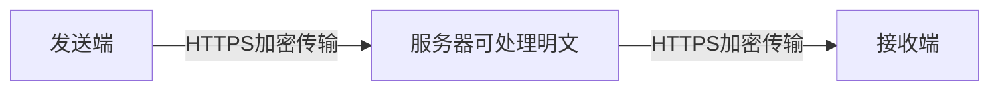
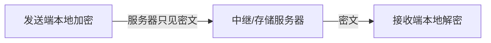

# 端到端加密 E2EE 与 MLS

> [!summary] 一句话解释
> **E2EE（End-to-End Encryption，端到端加密）让消息只在通信端点解密；MLS（Messaging Layer Security，消息层安全）是 IETF 为异步群组通信设计的密钥建立协议。**

## 生活类比

普通 HTTPS 像把信装进一辆上锁的运输车：路上的人看不到，但服务器收货后会打开。

E2EE 像发件人在自己手里把信装进只有收件人能打开的保险箱。运输服务器只搬运保险箱，没有开箱钥匙。

## HTTPS 和 E2EE 的区别





E2EE 通常仍然使用 [[TLS与数字证书|TLS/HTTPS]] 保护网络传输，两者不是二选一。

## E2EE 保护什么

理想情况下，即使服务器数据库或对象存储泄露，攻击者也只能得到密文。

它主要保护：

- 消息正文；
- 附件内容；
- 部分敏感元数据；
- 服务器被动读取内容的能力。

## E2EE 不自动隐藏什么

根据协议设计，服务器仍可能知道：

- 谁和谁通信；
- 消息时间和大小；
- 设备和账号关系；
- IP 地址；
- 群组成员变更；
- 举报时用户主动提交的内容。

端点设备如果已被控制，攻击者也可能读取解密后的明文。

## 群聊为什么更难

两个人通信只需要协调双方密钥。群聊还要处理：

- 新成员加入；
- 老成员退出；
- 一个用户拥有多台设备；
- 离线成员；
- 群组规模从 2 到上千；
- 成员变更后的密钥更新；
- 设备被入侵后的恢复。

如果每次变更都分别给所有人发送新密钥，成本可能随群组人数线性增长。

## MLS 是什么

**MLS（Messaging Layer Security）**由 RFC 9420 定义，用树结构为异步群组建立和更新共享密钥。

RFC 9420 的目标包括：

- 支持从两人到数千人的群组；
- 异步成员不必同时在线；
- 更新成本随群组规模近似对数增长；
- Forward Secrecy；
- Post-Compromise Security。

## Ratchet Tree

MLS 使用 **Ratchet Tree（棘轮树）**组织成员和密钥材料。

```text
          根
        /    \
      节点    节点
     /  \    /  \
   设备A B  C   D
```

成员更新自己到根路径上的密钥信息，就能高效更新群组秘密，而不必给每个成员单独重新分发全部内容。

## Epoch

**Epoch（纪元或群组状态代数）**表示群组某个确定的成员和密钥状态。

成员加入、移除或提交更新后，群组进入新 Epoch。消息必须绑定正确的群组和 Epoch，防止旧消息在新状态下被错误接受。

## KeyPackage、Proposal 和 Commit

- **KeyPackage**：设备用于被邀请加入群组的一次性或短期公钥材料；
- **Proposal**：提议添加、移除或更新成员；
- **Commit**：正式应用一批变更并进入新 Epoch；
- **Welcome**：让新成员获得加入新群组状态所需的信息。

## Forward Secrecy

**Forward Secrecy（前向保密）**表示当前密钥泄露后，攻击者不应因此解密已经安全删除密钥的旧消息。

前提是旧密钥真的被推进和清理，备份、日志或崩溃恢复也没有长期保留不该保留的秘密。

## Post-Compromise Security

**Post-Compromise Security（入侵后安全恢复，PCS）**表示设备曾经泄露后，只要攻击者不再持续控制端点，后续密钥更新可以逐渐恢复未来通信安全。

它不表示被入侵期间已经泄露的消息会自动变回秘密。

## 设备身份怎样验证

如果服务器能偷偷替换某人的设备公钥，用户可能与攻击者建立“安全”连接。因此需要：

- 安全号码；
- 二维码核验；
- 设备审批；
- Key Transparency（密钥透明日志）；
- 外部 Witness；
- 设备撤销和重新验证。

## E2EE 附件

常见思路是：

1. 每个文件生成独立随机 DEK；
2. 客户端分片加密文件；
3. 密文上传 [[S3与MinIO对象存储]]；
4. 文件名、MIME、明文大小和 DEK 通过 E2EE 认证消息发送；
5. 服务器只保存随机对象 ID、密文大小和权限绑定；
6. 下载时重新检查账号、设备、群组和 Epoch。

对象存储的 SSE-KMS 不能代替客户端 E2EE。

## 为什么“实现了 MLS”不等于可以宣传

协议标准只是第一步，生产实现还需要：

- 威胁模型；
- 密码库和跨语言边界审查；
- 恶意服务器测试；
- 回滚、分叉、重放和降级测试；
- 多设备和崩溃恢复；
- 密钥存储；
- 第三方密码学审计；
- 发布制品和批准证据。

## 常见误区

### HTTPS 就是端到端加密

HTTPS 通常保护客户端到服务器；服务器可能看到明文。E2EE 的端点通常是用户设备。

### 服务器只存密文就不需要权限

服务器仍要防止跨租户下载、设备注入、重放和流量分析。

### 新设备可以自动读取全部历史消息

如果服务器能自动恢复历史密钥，会削弱端到端边界。历史迁移通常需要明确的设备间授权和重封装。

### 使用开源密码库就等于通过审计

协议编排、密钥生命周期、存储和业务接口仍可能出错。

## 在 Otto 中的作用

在 [[Otto产品总体技术架构]] 中，手册描述了 OpenMLS 1.0 候选会话、多设备、崩溃恢复、安全号码、透明检查点和附件 Profile。

截至 2026-08-21，手册仍将其标记为候选，外部审计和生产批准未完成。因此可以说“实现候选协议并设置发布门禁”，不能说“已达到 Signal 等级”。

## 参考资料

- [RFC 9420：The Messaging Layer Security Protocol](https://www.rfc-editor.org/rfc/rfc9420.html)
- [IETF MLS Working Group](https://datatracker.ietf.org/wg/mls/about/)
- 核对日期：2026-08-21。
