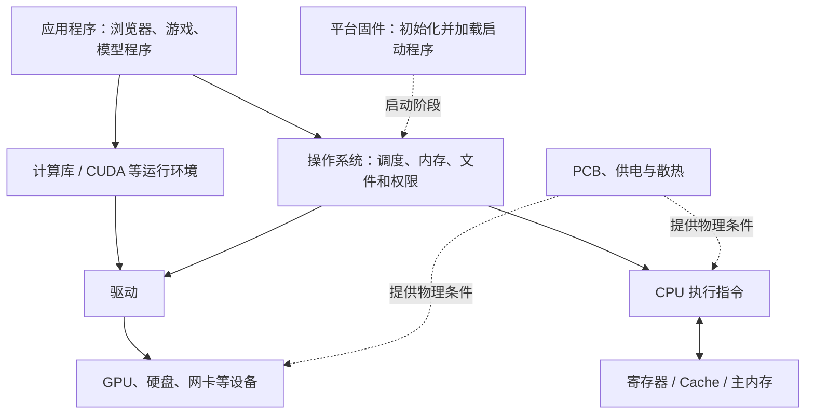

# 计算机硬件与底层软件学习地图

> [!summary] 一句话解释
> 一台计算机由电路、计算单元、存储和外设组成，固件建立启动环境，操作系统与驱动管理资源，程序经适当转换后利用这些硬件完成工作。

把电脑想成工厂：电路板是布线与安装基础，供电与散热是保障设施，处理器是执行计算的设备，内存像工作台，硬盘像仓库，固件负责开工准备，操作系统负责日常调度。类比只帮助记忆，处理器内部仍是电路，不是有意识的工人。

## 先纠正几组容易混淆的拼写

- **VRAM = Video Random-Access Memory（视频随机存取存储器，通称显存，读 V-RAM）**。你写的 varm 在“显存”语境下应是 VRAM。
- **VRM = Voltage Regulator Module（电压调节模块，读 V-R-M）**，属于供电，与 VRAM 不是一回事。
- **RAM = Random-Access Memory（随机存取存储器，读 RAM）**；Arm 则是处理器架构家族及相关品牌名称，不是某种内存。
- **PCB = Printed Circuit Board（印刷电路板，读 P-C-B）**，在这组硬件词里按这个含义理解。操作系统教材中 PCB 还可能指 Process Control Block（进程控制块），见 [[操作系统、内核与硬件管理]]。

## 按层次学习，不要把所有名词当作并列零件

| 学习位置 | 本次关键词 | 对应笔记 |
|---|---|---|
| 物理基础 | PCB、供电元件、VRM、散热 | [[PCB、供电与散热：计算机硬件的物理基础]] |
| 通用计算与架构 | CPU、Arm、x86、IBM 系列机 | [[CPU、指令集与计算机体系结构]] |
| 具体操作系统与平台选择 | Ubuntu、Linux 发行版、amd64/arm64 | [[Ubuntu：Linux发行版、软件管理与架构选择]] |
| 并行计算 | GPU、VRAM、CUDA | [[GPU、显存与CUDA并行计算]] |
| 存储层次 | 内存、RAM、SRAM、DRAM、Cache、ROM、Flash、硬盘 | [[存储层次：RAM、SRAM、DRAM、Cache与Flash]] |
| 持久存储设备 | 机械硬盘、固态硬盘、控制器与接口 | [[磁盘与网卡：存储设备和网络接口]] |
| 开机准备 | BIOS、UEFI、ROM 代码、固件 | [[固件、ROM代码与计算机启动链]] |
| 日常管理 | OS、内核、进程、内存与权限 | [[操作系统、内核与硬件管理]] |
| 设备适配 | 驱动、命令队列、设备寄存器 | [[设备驱动：操作系统控制硬件的翻译层]] |
| 描述计算或电路 | 机器语言、汇编、硬件描述语言、VHDL、Verilog | [[机器语言、汇编与硬件描述语言]] |

已有的驱动、固件、硬盘笔记继续使用，不再重复建同义文件。这份地图连接六篇硬件与底层软件专题，并通过 Ubuntu 等笔记延伸到具体系统与平台选择。

## 一张图：软件怎样使用硬件

**OS = Operating System（操作系统，读 O-S）**；CPU、GPU 和 CUDA 的全称在对应专题解释。图是职责图，不表示应用每执行一条普通算术指令都必须向操作系统发一次请求。应用被调度后，大量指令直接由处理器在受限权限下执行。

## 存储层次不是一串同义词

寄存器、处理器 Cache、系统主内存、GPU 设备内存和硬盘，承担不同距离、容量和成本的工作。

- RAM、ROM 是存储概念和类别。
- SRAM、DRAM、Flash 主要描述具体技术。
- Cache、主内存、显存主要描述在系统中承担的角色。
- 内存条、固态硬盘、显卡是具体模块或产品。

例如“CPU 缓存通常由 SRAM 实现”“系统主内存常用 DRAM”“显存常用面向图形或加速计算的 DRAM”。一种技术可以承担多种角色，不能画成互不相交的简单名单。

## 例子：从硬盘加载一个模型，再让 GPU 运算

1. 模型文件在硬盘中长期保存，关机不等于把文件删除。
2. 程序启动，操作系统建立进程和内存映射，按需读取文件数据。
3. CPU 处理输入和控制逻辑，计算库组织适合并行的任务。
4. 在常见独立 GPU 系统中，必要数据进入 GPU 设备内存，GPU 运行计算任务。
5. CPU/GPU 在供电和温度限制内运行，结果再由程序显示或保存。

统一内存、直接设备传输和文件映射等会改变具体复制路径。这里解释常见概念，不承诺所有系统都严格“每字节依次走同一条链”。

## 学习建议

先分清 CPU、内存、硬盘，再分清 GPU 和显卡；之后认识 Cache/DRAM/Flash、供电散热，最后学习指令集、启动链和语言层次。

IBM 系列机用于理解“共同体系结构可以有不同实现”，不是要求先研究全部 IBM 产品史。汇编和硬件描述语言用于理解软硬件边界，不是说普通软件开发者必须先会设计芯片。

进一步比较 x86 与 Arm 时，阅读 [[CPU、指令集与计算机体系结构#x86 与 Arm 各方面差别：先明确比较对象|架构、性能功耗与兼容差别]]；再用 [[Ubuntu：Linux发行版、软件管理与架构选择]] 理解为什么“发行版相同”与“架构相同”仍不足以保证全部软件、驱动和镜像互换。

本套内容是知识整理，不包含修改 BIOS、安装驱动、超频、拆机、刷固件或对本机硬件进行压力测试。

关联：[[算法复杂度与ASL：渐近符号、平均情况和查找长度]]、[[内存映射、MMIO与代码控制硬件]]、[[大模型从数据、Token到训练与本地部署]]。

## 参考资料

核对日期：2026-09-08。具体实现、兼容要求和参数须按实际设备文档核对。

- [Arm：体系结构与微架构](https://www.arm.com/architecture/cpu)
- [NVIDIA：CPU/GPU 异构编程模型](https://docs.nvidia.com/cuda/cuda-programming-guide/01-introduction/programming-model.html)
- [IBM：System/360 的共同体系结构](https://www.ibm.com/history/system-360)
- 各专题列出供电、存储、固件、操作系统和设计工具的对应官方参考。
