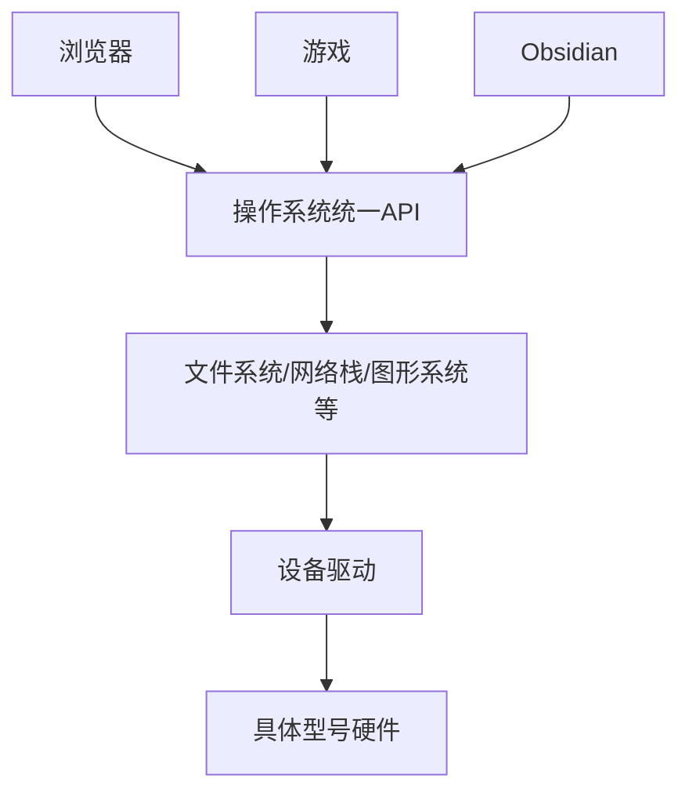
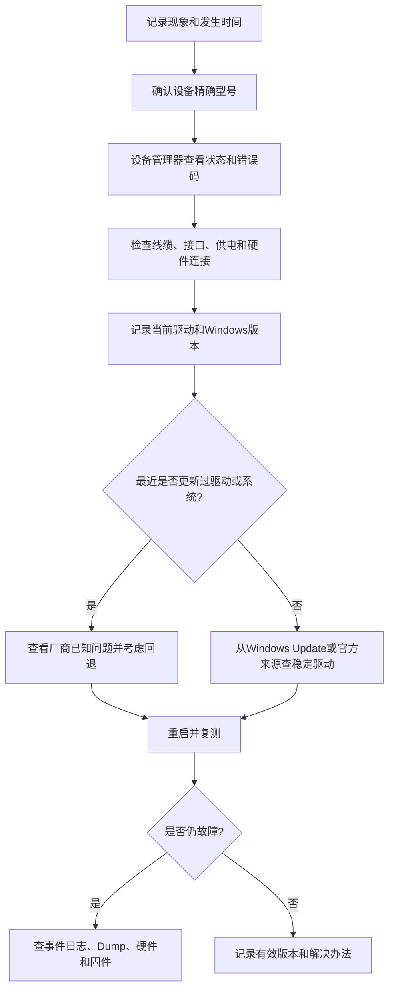

# 设备驱动：操作系统控制硬件的翻译层

> [!summary] 一句话解释
> **驱动（Device Driver，设备驱动程序）是参与操作系统与设备通信的系统软件：操作系统提出“读磁盘、发网络包、播放声音”等通用请求，驱动把它翻译成具体硬件能够执行的命令，再把结果和错误交回操作系统。**

---

## 一、生活类比：司机、翻译员和操作手册

“驱动”这个中文词容易让人想到汽车司机。这个类比有一部分是对的：

- 应用程序提出目的，例如“把这篇文档保存下来”；
- 操作系统提供统一规则和道路；
- 驱动知道具体型号的设备怎样操作；
- 硬件最终执行读、写、发送、显示等动作。

也可以把驱动理解成翻译员：

```text
应用程序：请保存这个文件
操作系统：请向这个存储设备写入这些数据块
驱动：把请求翻译成该控制器的队列和命令格式
硬件：执行命令并报告完成或错误
```

但驱动不只是把一句话翻译成另一句话。它还要管理：

- 设备初始化；
- 请求队列；
- 内存缓冲区；
- DMA；
- 中断；
- 并发访问；
- 插拔；
- 休眠和唤醒；
- 错误恢复；
- 安全权限。

---

## 二、为什么操作系统需要驱动

世界上有大量不同型号的设备：

- Intel、Realtek、Broadcom 等网卡；
- NVIDIA、AMD、Intel 显卡；
- NVMe、SATA、USB 存储设备；
- 打印机、摄像头、声卡、蓝牙和触摸板；
- 嵌入式设备上的传感器、GPIO 和显示控制器。

每个设备可能拥有不同的：

- 寄存器地址；
- 命令格式；
- 队列结构；
- 数据传输方式；
- 中断机制；
- 电源状态；
- 固件协议；
- 硬件缺陷和兼容要求。

如果每个应用都直接支持所有硬件，浏览器、游戏、播放器和 Obsidian 都要分别编写成千上万种硬件控制代码。

操作系统通过驱动建立分层：



这样：

- 应用主要面对稳定的操作系统接口；
- 操作系统负责权限、资源管理和统一抽象；
- 驱动处理具体设备差异；
- 厂商可以为自己的硬件提供支持。

---

## 三、驱动是软件，不是硬件

驱动程序是代码。它可能以以下形式存在：

- 编译进操作系统内核；
- 作为内核模块按需加载；
- 作为 Windows 的 `.sys` 文件；
- 作为用户模式驱动进程或组件；
- 作为多个驱动共同组成的驱动栈；
- 作为虚拟设备或安全过滤组件。

网卡芯片、显卡和 SSD 控制器是硬件；让操作系统能够控制它们的代码才是驱动。

可以这样区分：

```text
网卡硬件坏了 → 换驱动通常不能修复烧坏的芯片
网卡驱动坏了 → 硬件可能正常，但系统无法正确使用它
```

---

## 四、一次设备操作怎样经过驱动

### 示例一：保存文件到 SSD

```text
Obsidian保存Markdown
→ 调用Windows文件API
→ 文件系统决定文件内容放在哪里
→ I/O管理器创建请求
→ 存储驱动栈处理请求
→ NVMe或SATA驱动把请求放入设备队列
→ SSD控制器通过DMA读取RAM中的数据
→ SSD固件安排写入NAND闪存
→ 硬件报告完成
→ 驱动通知操作系统
→ 操作系统通知Obsidian
```

### 示例二：网卡发送网页请求

```text
浏览器通过Socket发送数据
→ TCP/IP网络栈处理协议
→ 路由表选择网络接口
→ 网卡驱动准备发送描述符
→ 网卡通过DMA读取RAM中的数据包
→ 网卡把数据转换成电信号或无线信号
→ 发送完成后触发中断或完成通知
→ 驱动回收队列资源
```

### 示例三：鼠标移动

```text
鼠标传感器检测移动
→ 通过USB或蓝牙发送报告
→ 控制器与总线驱动收到数据
→ HID驱动解释移动量和按键
→ Windows输入系统生成鼠标事件
→ 当前应用收到事件
```

这里的 **HID（Human Interface Device，人机接口设备）**是一类标准设备，例如键盘、鼠标和部分游戏控制器。

---

## 五、驱动怎样真正控制硬件

驱动可能使用以下机制。

### 1. 寄存器和 MMIO

硬件控制器内部有寄存器。操作系统把部分设备寄存器映射到地址空间后，驱动可以读写它们。

**MMIO（Memory-Mapped I/O，内存映射输入/输出）**让驱动以类似访问内存地址的方式访问设备寄存器。

例如驱动写入某个控制寄存器，含义可能是：

- 开始发送网络数据；
- 提交磁盘命令；
- 打开摄像头数据流；
- 设置显示模式；
- 清除中断状态。

### 2. DMA

**DMA（Direct Memory Access，直接内存访问）**允许设备在 CPU 安排和权限控制下，直接在设备与 RAM 之间传输大量数据。

如果没有 DMA，CPU 可能要亲自搬运每一小块数据，效率很低。

### 3. 中断

**Interrupt（中断）**是硬件通知 CPU“某件事需要处理”的机制。例如：

- 磁盘读写完成；
- 网卡收到数据；
- 键盘按下；
- 设备报告错误。

驱动的中断处理代码会快速记录状态，并安排后续工作。

### 4. 轮询和队列

高性能设备通常使用多个发送/接收或提交/完成队列。驱动可能结合中断和 **Polling（轮询）**处理大量请求，以平衡延迟与 CPU 开销。

这些机制在 [[内存映射、MMIO与代码控制硬件]] 中有更详细说明。

---

## 六、一个设备可能有一整条驱动栈

初学者常以为：

```text
一个硬件 = 一个驱动文件
```

实际经常是多个分层驱动共同处理一次 I/O 请求，这叫 **Driver Stack（驱动栈）**。

以 USB 移动硬盘为例，可能涉及：

```text
应用程序
→ 文件系统驱动
→ 卷管理相关驱动
→ 磁盘类驱动
→ USB大容量存储驱动
→ USB集线器/主控制器驱动
→ USB控制器硬件
→ 移动硬盘
```

不同驱动分别解决不同层级的问题。上层不需要了解 USB 控制器的全部细节，下层也不需要理解文件名和文件夹。

微软对驱动的更完整定义是：任何观察或参与操作系统与设备通信的软件组件，都可以属于驱动范畴；并非所有驱动都会直接触碰硬件。

---

## 七、常见驱动类型

### 1. Function Driver：功能驱动

**Function Driver（功能驱动）**承担某个设备的主要功能，通常最了解设备能力。

例如：

- 某型号网卡的主要驱动；
- 某个 PCIe 设备的功能驱动；
- 某款触摸板的功能驱动。

### 2. Bus Driver：总线驱动

**Bus Driver（总线驱动）**管理总线和连接在总线上的设备，例如：

- PCI/PCIe；
- USB；
- I²C；
- SPI。

它帮助操作系统：

- 发现设备；
- 分配资源；
- 建立设备树；
- 处理插拔和电源状态。

### 3. Class Driver：类驱动

**Class Driver（类驱动）**实现一整类标准设备的通用功能。例如 Windows 可以为遵守标准的键盘、鼠标、磁盘或 USB 存储提供通用支持。

### 4. Miniport/Minidriver：微型端口或小型驱动

系统提供通用框架，硬件厂商只实现与具体设备相关的部分。这可以减少重复代码。

例如：

```text
Microsoft提供通用网络/存储框架
        +
厂商提供具体网卡/控制器的miniport
```

### 5. Filter Driver：过滤驱动

**Filter Driver（过滤驱动）**位于驱动栈中，观察、记录或改变经过的请求。

可能用于：

- 杀毒扫描；
- 磁盘加密；
- 文件系统监控；
- 网络防火墙；
- 性能统计；
- 输入设备附加功能。

过滤驱动非常强大。如果设计错误，也可能引起性能下降、兼容问题或蓝屏。

### 6. Software Driver：软件驱动

有些驱动不对应物理硬件，而是为了在内核模式中提供受保护能力，例如：

- 虚拟网卡；
- 虚拟磁盘；
- 安全监控；
- 虚拟化；
- 某些反作弊或系统保护组件。

因此“驱动”不等于“硬件厂商附送的软件界面”。

---

## 八、内核模式驱动和用户模式驱动

### User Mode：用户模式

普通应用通常运行在 **User Mode（用户模式）**：

- 每个进程有受隔离的虚拟地址空间；
- 不能随意读取内核或其他进程内存；
- 不能直接随意访问硬件；
- 单个程序崩溃通常不会让整个系统崩溃。

### Kernel Mode：内核模式

很多核心驱动运行在 **Kernel Mode（内核模式）**：

- 可以访问操作系统核心资源；
- 可以处理中断、设备寄存器和 DMA；
- 权限很高；
- 错误可能破坏整个操作系统。

如果内核模式驱动访问了错误地址或破坏了内核数据，Windows 可能只能触发蓝屏来阻止损坏继续扩大。

### 并非所有驱动都在内核模式

Windows 也支持某些用户模式驱动，让部分设备逻辑在隔离更好的用户空间运行。这样驱动故障的影响可能更小，但是否适用取决于设备类型、性能和实时要求。

可以简单记成：

| 模式 | 权限 | 故障影响 | 常见对象 |
|---|---|---|---|
| 用户模式 | 受限制 | 通常影响单个进程 | 普通应用、部分用户模式驱动 |
| 内核模式 | 很高 | 可能导致整个系统蓝屏 | 内核、许多硬件驱动、文件系统驱动 |

---

## 九、Windows 驱动包里有什么

Windows 驱动通常不是只有一个文件。一个 **Driver Package（驱动程序包）**可能包含：

### `.sys` 文件

常见的驱动二进制代码，许多内核模式驱动使用此扩展名。

### `.inf` 文件

**INF（Setup Information File，安装信息文件）**告诉 Windows：

- 支持哪些硬件 ID；
- 要复制哪些文件；
- 注册哪些服务或配置；
- 设备类是什么；
- 安装时怎样匹配设备。

INF 主要是声明式安装说明，不等于驱动核心代码。

### `.cat` 文件

**Catalog（目录/编录）文件**用于把驱动包中的文件哈希和数字签名关联起来，帮助 Windows 验证包是否被篡改以及发布者是否可信。

### 其他文件

还可能包含：

- 用户模式 DLL；
- 固件文件；
- 控制面板或设置应用；
- 本地化资源；
- 服务程序；
- 配置数据。

因此下载一个显卡“驱动安装包”时，里面经常不只有最底层驱动，还包含控制面板、更新器、遥测、音频组件等可选软件。

---

## 十、Plug and Play 怎样匹配驱动

**PnP（Plug and Play，即插即用）**让操作系统发现设备、匹配驱动并管理插拔。

大致过程：

```text
设备接入或开机枚举
→ 总线驱动发现设备
→ 读取Hardware ID和Compatible ID
→ Windows在驱动存储中寻找匹配INF
→ 选择合适驱动包
→ 验证签名和策略
→ 安装并启动驱动
→ 创建设备接口供系统和应用使用
```

### Hardware ID

**Hardware ID（硬件 ID）**描述具体设备型号，例如 PCI 设备常包含厂商和设备编号。

### Compatible ID

**Compatible ID（兼容 ID）**描述更宽泛的设备类别。没有专用驱动时，系统可能匹配一个通用类驱动。

这就是为什么很多标准鼠标、键盘和 U 盘插上后不用手工下载驱动：设备遵守标准，Windows 已带有兼容的通用驱动。

---

## 十一、通用驱动和厂商驱动

### 通用驱动

由操作系统提供，优点是：

- 安装方便；
- 兼容标准设备；
- 通常经过系统测试；
- 能提供基本功能。

但可能没有厂商专有功能或最佳性能。

### 厂商驱动

由芯片或设备厂商提供，可能增加：

- 更完整的硬件功能；
- 性能优化；
- 控制面板；
- 新协议支持；
- 已知问题修复；
- 电源管理优化。

但“版本最新”不等于“对当前电脑最合适”。笔记本厂商可能针对散热、电源、屏幕和整机固件测试特定版本。

### 建议来源顺序

普通用户安装驱动时，通常优先考虑：

1. Windows Update 提供的稳定驱动；
2. 电脑整机厂商的官方支持页面；
3. 芯片或设备厂商的官方网站；
4. 有明确原因时使用经过验证的特定版本。

避免使用来源不明的“万能驱动包”和随机下载站。驱动权限很高，恶意或被篡改的驱动会带来严重安全风险。

---

## 十二、驱动签名是什么

**Driver Signing（驱动签名）**使用代码签名和目录签名帮助 Windows 验证：

- 发布者身份；
- 驱动包是否被修改；
- 是否满足相应平台的签名策略。

签名不代表代码绝对没有漏洞，但它提供来源和完整性证据。

现代 64 位 Windows 对内核驱动有严格的签名和加载策略。为了安装不可信驱动而长期关闭签名检查，会显著降低系统安全性。

驱动签名的密码学基础见 [[密码学基础：AES-GCM、scrypt、Ed25519与SHA-256]]，软件发布链见 [[软件供应链：代码签名、SBOM与发布门禁]]。

---

## 十三、驱动和固件、BIOS、应用有什么区别

| 名称 | 通常运行在哪里 | 主要作用 | 例子 |
|---|---|---|---|
| 应用程序 | 用户模式进程 | 完成用户任务 | 浏览器、Obsidian、游戏 |
| 驱动 | 操作系统用户/内核空间 | 让系统使用设备或核心能力 | 网卡驱动、显卡驱动 |
| Firmware 固件 | 设备内部控制器 | 控制设备自身内部行为 | SSD 固件、路由器固件 |
| BIOS/UEFI | 主板固件环境 | 初始化平台并启动操作系统 | UEFI 设置界面 |
| 操作系统内核 | 最高权限核心 | 调度、内存、I/O、安全 | Windows NT 内核、Linux 内核 |

以 SSD 为例：

```text
Windows存储驱动
→ 通过NVMe/SATA协议发命令
→ SSD控制器接收
→ SSD固件决定怎样管理闪存
→ NAND闪存实际保存数据
```

驱动和固件都可能需要更新，但更新方法、风险和目标不同。固件更新中断可能使设备无法启动，因此必须严格按照厂商说明操作；完整启动链和固件边界见 [[固件、ROM代码与计算机启动链]]。

---

## 十四、为什么驱动会导致蓝屏

普通应用运行在用户模式，错误通常只让自身崩溃。内核模式驱动拥有高权限，如果发生：

- 空指针或无效地址访问；
- 使用已经释放的内存；
- 并发和锁错误；
- DMA 地址设置错误；
- 中断处理错误；
- 与其他驱动不兼容；
- 电源状态切换处理错误；
- 硬件返回异常数据而驱动没有正确处理；

就可能破坏操作系统关键状态。Windows 无法确认还能安全继续运行时，会 Bug Check，也就是蓝屏。

蓝屏转储可能显示某个 `.sys` 文件，但它只是分析线索：

- 这个驱动可能确实有缺陷；
- 也可能是别的驱动先破坏了内存；
- 可能是 RAM 或硬件不稳定；
- 可能是驱动只在最后使用了错误数据。

详细分析边界见 [[Minidump与Windows崩溃转储分析]]。

---

## 十五、更新驱动是不是越新越好

不一定。

### 值得更新的情况

- 设备无法识别；
- 官方明确修复了你遇到的问题；
- 新版操作系统存在兼容要求；
- 出现已知安全漏洞；
- 游戏或专业软件需要新版图形能力；
- 厂商支持页面建议更新；
- 当前驱动引发断网、黑屏或蓝屏。

### 不必频繁更新的情况

- 设备长期稳定；
- 更新日志与你的硬件和问题无关；
- 新驱动刚发布且缺少验证；
- 整机厂商要求使用定制版本；
- 更新会影响关键生产环境。

### 安全更新流程

1. 确认设备精确型号；
2. 记录当前驱动版本；
3. 阅读官方更新说明；
4. 创建必要的还原点或备份；
5. 从可信来源下载；
6. 关闭不必要的高负载任务；
7. 安装并按要求重启；
8. 检查设备、休眠、网络和原问题；
9. 出现问题时使用“回退驱动程序”或已知稳定版本。

不要为了追求一个更大的版本号，同时批量更新所有驱动。这样出问题后很难判断是哪一个变化造成的。

---

## 十六、Windows 中怎样查看驱动

### 设备管理器

```text
开始菜单
→ 搜索“设备管理器”
→ 展开设备类别
→ 右键设备
→ 属性
→ 驱动程序
```

可以查看：

- 驱动提供者；
- 日期；
- 版本；
- 数字签名者；
- 驱动文件；
- 更新、回退、禁用和卸载入口。

> [!warning]
> “卸载设备”可能同时提供“尝试删除此设备的驱动程序”选项。不了解后果时不要勾选，更不要随意卸载存储控制器、芯片组或系统关键设备。

### PowerShell

查看已经签名的驱动信息可以使用：

```powershell
Get-CimInstance Win32_PnPSignedDriver |
  Select-Object DeviceName, DriverVersion, Manufacturer
```

这条命令读取信息，不会更新驱动。

### `driverquery`

```cmd
driverquery
```

它列出系统中的驱动模块，但输出中的名称不一定与设备管理器中的友好名称完全一致。

---

## 十七、驱动故障有哪些表现

| 现象 | 可能的驱动方向 |
|---|---|
| 设备管理器黄色感叹号 | 驱动未启动、资源冲突、设备错误 |
| 网卡消失或频繁断开 | 网卡驱动、电源管理、硬件或固件 |
| 游戏黑屏或图形异常 | 显卡驱动、GPU、游戏或超频 |
| 没有声音 | 音频驱动、输出设备选择、服务或硬件 |
| USB 设备无法识别 | USB 总线/设备驱动、线缆、供电 |
| 睡眠唤醒后设备失效 | 驱动电源状态处理或固件 |
| 蓝屏中出现 `.sys` | 驱动、硬件或内存损坏线索 |
| 更新驱动后立刻异常 | 新版本兼容或安装问题 |

但相同症状也可能来自：

- 硬件损坏；
- 线缆或供电；
- BIOS/UEFI 和固件；
- Windows 系统文件；
- 第三方过滤驱动；
- 杀毒、VPN、虚拟机或反作弊软件；
- 应用自身错误。

所以“出现故障”不能直接等同于“重装驱动一定解决”。

---

## 十八、驱动故障的初学者排查顺序



### 不建议一开始做的事

- 从陌生网站下载“万能驱动”；
- 一次更新十几个不相关驱动；
- 使用来源不明的驱动更新软件；
- 强行关闭驱动签名检查；
- 删除未知 `.sys` 文件；
- 随意卸载磁盘控制器或芯片组驱动；
- 因为蓝屏显示一个驱动名就直接删除它。

---

## 十九、驱动与 UAC、ACL 的关系

安装或更新系统级驱动通常需要管理员权限，所以可能触发 [[Windows UAC与管理员权限提升|UAC]]。

但 UAC 只是询问是否允许当前安装程序提升权限，并不保证驱动安全。安装过程还会受到：

- 驱动签名策略；
- 设备安装策略；
- 企业组策略；
- 文件和注册表 [[Windows ACL与NTFS权限|ACL]]；
- Secure Boot（安全启动）和内核保护；

影响。

一个普通用户点击了 UAC“是”，也不能绕过所有 Windows 内核安全策略。

---

## 二十、Linux 中的驱动是什么样

Linux 也需要设备驱动。驱动可以：

- 直接编译进 Linux 内核；
- 编译成可加载内核模块；
- 由用户空间框架承担部分功能。

可加载模块常见扩展名是：

```text
.ko = Kernel Object，内核对象
```

常见查看命令：

```bash
lspci -k
lsusb
lsmod
modinfo 模块名
```

- `lspci -k`：查看 PCI 设备及其正在使用的内核驱动；
- `lsusb`：查看 USB 设备；
- `lsmod`：查看已加载模块；
- `modinfo`：查看模块信息。

在嵌入式 Linux 中，设备树还会描述板载硬件的位置、中断和资源，内核驱动再与匹配的设备绑定。参见 [[嵌入式系统为什么经常使用Linux]]。

Windows 和 Linux 的驱动框架、安装形式与 API 不同，但核心思想相似：

> **让操作系统以可管理、可隔离的方式使用具体硬件。**

---

## 二十一、常见误区

### 误区 1：驱动就是硬件

错误。驱动是控制或参与设备通信的软件。

### 误区 2：一个设备永远只有一个驱动文件

错误。一次请求可能经过文件系统、类驱动、功能驱动、过滤驱动和总线驱动组成的驱动栈。

### 误区 3：所有驱动都由设备厂商编写

错误。遵循公开标准的设备可以使用 Microsoft、Linux 社区或系统提供的通用驱动。

### 误区 4：所有驱动都直接控制硬件

错误。过滤驱动和软件驱动可能只观察、修改请求或提供虚拟能力。

### 误区 5：驱动都运行在内核模式

错误。很多核心驱动在内核模式，但一些设备支持用户模式驱动框架。

### 误区 6：驱动越新越好

错误。兼容性、厂商验证、实际修复内容和稳定性比版本号更重要。

### 误区 7：驱动签名表示绝对安全

错误。签名主要证明来源和文件完整性；已签名代码也可能有漏洞。

### 误区 8：装错驱动只会让一个软件打不开

错误。关键内核驱动可能导致设备失效、数据损坏、无法启动或蓝屏。

### 误区 9：驱动问题运行 SFC 就一定能修

错误。SFC 检查受保护的 Windows 系统文件，不一定替换第三方厂商驱动。应根据设备、驱动来源和错误证据处理。

### 误区 10：应用可以绕过驱动直接随意控制硬件

普通应用通常受用户模式和权限限制，需要经过操作系统与驱动。某些受控映射、高性能框架或嵌入式环境存在特殊路径，但也需要内核、IOMMU 或其他机制授权。

---

## 二十二、先记住的七句话

1. **驱动是软件，是操作系统和设备之间的适配层。**
2. **应用提出通用请求，驱动处理具体硬件差异。**
3. **一个 I/O 请求可能经过多个驱动组成的驱动栈。**
4. **很多驱动运行在内核模式，因此错误可能导致蓝屏。**
5. **网卡、磁盘、显卡、USB 和虚拟设备都可能需要驱动。**
6. **驱动不等于固件，也不等于设备管理软件。**
7. **优先从 Windows Update、整机厂商或芯片厂商官方渠道获取驱动。**

---

## 二十三、相关概念

- [[计算机硬件与底层软件学习地图]]：从供电、处理器、存储和启动链定位驱动所处层次。
- [[操作系统、内核与硬件管理]]：区分操作系统、内核、应用与设备驱动的职责。
- [[GPU、显存与CUDA并行计算]]：区分显卡硬件、显存、GPU 驱动、CUDA 运行库与开发工具包。
- [[磁盘与网卡：存储设备和网络接口]]：两个典型硬件怎样通过驱动完成存储和网络 I/O。
- [[内存映射、MMIO与代码控制硬件]]：驱动怎样使用寄存器、DMA 和中断控制硬件。
- [[进程、线程、多进程与多线程]]：用户程序和内核执行单元怎样发起 I/O。
- [[Windows UAC与管理员权限提升]]：为什么安装驱动通常需要管理员权限。
- [[Windows ACL与NTFS权限]]：驱动安装和设备访问怎样受到权限控制。
- [[Minidump与Windows崩溃转储分析]]：内核驱动故障怎样产生蓝屏转储。
- [[CHKDSK、SFC与DISM：Windows检查与修复工具]]：系统文件、组件存储和磁盘文件系统分别怎样检查。
- [[软件供应链：代码签名、SBOM与发布门禁]]：驱动包为什么需要签名、版本和来源追溯。
- [[嵌入式系统为什么经常使用Linux]]：Linux 驱动生态为什么能帮助嵌入式产品支持复杂硬件。

---

## 参考资料

以下资料核对日期：**2026-08-27**。

- [Microsoft Learn：What is a Driver?](https://learn.microsoft.com/en-us/windows-hardware/drivers/gettingstarted/what-is-a-driver-)
- [Microsoft Learn：Driver Stacks](https://learn.microsoft.com/en-us/windows-hardware/drivers/gettingstarted/driver-stacks)
- [Microsoft Learn：User Mode and Kernel Mode](https://learn.microsoft.com/en-us/windows-hardware/drivers/gettingstarted/user-mode-and-kernel-mode)
- [Microsoft Learn：Windows Driver Technologies Overview](https://learn.microsoft.com/en-us/windows-hardware/drivers/device-and-driver-technologies)
- [Microsoft Learn：Kernel-Mode Driver Architecture](https://learn.microsoft.com/en-us/windows-hardware/drivers/kernel/)
- [Microsoft Learn：Windows Storage Driver Architecture](https://learn.microsoft.com/en-us/windows-hardware/drivers/storage/storage-driver-architecture)
- [Microsoft Learn：Introduction to NDIS Network Interfaces](https://learn.microsoft.com/en-us/windows-hardware/drivers/network/ndis-network-interfaces2)
- [Linux Kernel Documentation：The Linux Kernel Device Model](https://docs.kernel.org/driver-api/driver-model/overview.html)
