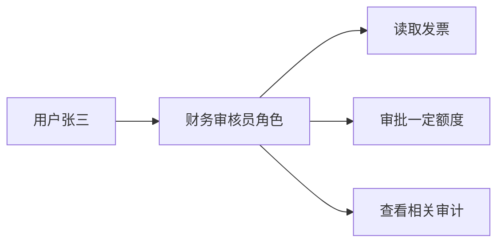
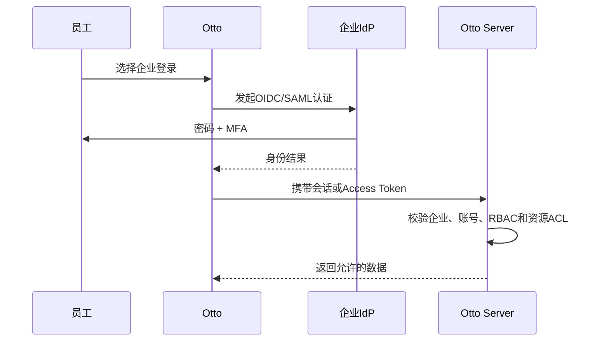

# 身份认证与授权：ACL、RBAC、MFA、OAuth、OIDC、SAML 与 SCIM

> [!summary] 一句话区分
> **Authentication 证明“你是谁”，Authorization 决定“你能做什么”；MFA 加强登录，ACL/RBAC 表达权限，OAuth 2.0 委托访问，OIDC 在 OAuth 上提供登录身份，SAML 常用于企业单点登录，SCIM 自动同步用户和群组。**

## 先分清四件事

| 问题 | 概念 |
|---|---|
| 你是谁？ | Authentication，身份认证 |
| 你能做什么？ | Authorization，授权 |
| 你在组织里是什么身份？ | Identity，身份资料、企业和角色 |
| 员工入职/离职怎样同步账号？ | Provisioning，账号供应与回收 |

成功登录不代表拥有管理员权限；有某项权限也不代表这次登录足够可信。

## MFA

**MFA（Multi-Factor Authentication，多因素认证）**要求来自不同类别的至少两个因素：

- 你知道的：密码、PIN；
- 你拥有的：手机、硬件安全密钥；
- 你本身的：指纹、面容等生物特征。

密码 + 两个安全问题通常仍是同一类“知道的东西”，不一定构成真正 MFA。

### TOTP

**TOTP（Time-Based One-Time Password，基于时间的一次性密码）**是认证器 App 常见的六位动态码。

TOTP 能减少单纯密码泄露风险，但仍可能被钓鱼网站实时转发。抗钓鱼能力更强的方向包括 FIDO2/WebAuthn 安全密钥。

## ACL

**ACL（Access Control List，访问控制列表）**直接记录“哪个主体对哪个资源有什么权限”。

```text
合同A：
- 用户Alice：read, comment
- 财务组：read, edit
- 外部访客：无权限
```

ACL 适合文档、对象和消息等资源级权限，但资源和用户很多时管理可能复杂。

Windows 文件、文件夹、注册表和服务中的具体实现，还涉及 SID、ACE、DACL、SACL、所有者和权限继承，详见 [[Windows ACL与NTFS权限]]。

## RBAC

**RBAC（Role-Based Access Control，基于角色的访问控制）**先给角色分配权限，再把用户分配到角色。



RBAC 适合企业岗位管理，但要避免角色爆炸、长期不复核和“超级管理员到处使用”。

## ACL 和 RBAC 怎样配合

常见做法：

- RBAC 决定某个岗位原则上能使用哪些功能；
- ACL 决定它能访问哪些具体文档、会话或对象；
- 条件策略再检查租户、时间、设备和数据等级。

只在前端隐藏按钮不是授权。服务端和数据访问层必须真正校验。

## OAuth 2.0

**OAuth 2.0（开放授权）**让用户授权一个客户端访问某个资源，而不把资源账号密码直接交给客户端。

生活类比：给代驾一把只能开车、不能开后备箱和家门的临时钥匙。

### 四个角色

- Resource Owner：资源所有者，通常是用户；
- Client：请求访问的应用；
- Authorization Server：签发 Token 的授权服务器；
- Resource Server：真正提供 API 数据的服务器。

### Access Token

客户端拿 Access Token 访问 API。Token 应限制：

- Scope；
- Audience；
- 有效期；
- 客户端或主体；
- 允许操作。

OAuth 2.0 本身主要解决授权，不提供一套完整标准来告诉客户端“登录用户是谁”。

## OIDC

**OIDC（OpenID Connect，开放身份连接）**是在 OAuth 2.0 上增加的身份层，用于登录和获取标准化用户身份 Claims。

OIDC 引入 **ID Token**，通常是经过签名的 JWT，包含：

- `iss`：谁签发；
- `sub`：用户稳定标识；
- `aud`：发给哪个客户端；
- `exp`：何时过期；
- `nonce` 等防重放信息。

### Access Token 和 ID Token 不要混用

| Access Token | ID Token |
|---|---|
| 给资源服务器调用 API | 给客户端确认登录身份 |
| 表达授权范围 | 表达认证结果和用户 Claims |
| 不一定是 JWT | OIDC 中通常是 JWT |

## SAML

**SAML（Security Assertion Markup Language，安全断言标记语言）**是基于 XML 的身份联合标准，常见于传统企业 Web 单点登录。

典型角色：

- IdP（Identity Provider，身份提供商）；
- SP（Service Provider，服务提供商）。

用户在企业 IdP 登录后，IdP 向 SP 发送签名 SAML Assertion，SP 验证后建立本地会话。

SAML 和 OIDC 都能做 SSO，但消息格式、生态和现代 API 适配不同。新系统常选 OIDC，已有企业环境可能要求 SAML。

## SCIM

**SCIM（System for Cross-domain Identity Management，跨域身份管理系统）**用于自动创建、更新、禁用用户和群组。

```text
员工入职 → 企业身份平台通过SCIM创建Otto账号
员工调岗 → 更新部门和群组
员工离职 → 及时禁用账号和撤销访问
```

SCIM 不是登录协议。它解决账号生命周期同步；登录仍由 OIDC/SAML 等协议完成。

## SSO 是什么

**SSO（Single Sign-On，单点登录）**表示用户登录企业身份平台后，可以进入多个受信系统，而不为每个系统重新输入独立密码。

SSO 减少密码数量并便于统一撤权，但身份平台故障或账号被攻破的影响也更大，因此需要 MFA、设备策略、审计和高可用。

## 一个企业登录与授权流程



## 服务账号

服务到服务调用不应该冒充普通员工。服务账号需要：

- 明确用途；
- 最小权限；
- 短期凭据或工作负载身份；
- 密钥轮换；
- 所有者；
- 审计和定期复核。

## 常见误区

### OAuth 就是登录

OAuth 主要是授权。登录身份应使用 OIDC 或明确的认证协议。

### JWT 签名有效就一定可信

还要验证签发者、受众、时间、算法、Nonce 和密钥来源。

### 前端不显示按钮就没有权限

攻击者可以直接调用 API。服务端必须重新授权。

### 用户离职后删除企业通讯录就够了

还要通过 SCIM/流程禁用应用账号、撤销会话、设备、Token 和高风险权限。

### 管理员角色永久有效最方便

高权限应最小化、按需提升、定期复核并记录审计。

## 在 Otto 中的作用

在 [[Otto产品总体技术架构]] 中：

- OIDC/SAML 用于企业统一登录；
- SCIM 用于入职、调岗和离职同步；
- MFA 保护高风险登录和管理操作；
- RBAC 管理企业角色和功能；
- ACL 约束知识、附件、会话和对象；
- 界面需要持续显示当前企业、账号和服务端权威角色。

手册将统一身份列为仍需生产化补齐的能力，不能把协议名称存在等同于完整上线。

## 参考资料

- [RFC 6749：OAuth 2.0](https://www.rfc-editor.org/rfc/rfc6749.html)
- [OpenID Connect Core 1.0](https://openid.net/specs/openid-connect-core-1_0.html)
- [OASIS SAML 2.0](https://docs.oasis-open.org/security/saml/v2.0/)
- [RFC 7644：SCIM Protocol](https://www.rfc-editor.org/rfc/rfc7644.html)
- 核对日期：2026-08-21。
