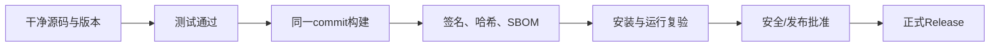

# 软件供应链：代码签名、SBOM 与发布门禁

> [!summary] 一句话解释
> **软件供应链安全要证明“源码从哪里来、用什么依赖构建、产物是否被篡改、谁批准发布”；代码签名验证发布者和完整性，SBOM 列出组件，时间戳证明签名时间，发布门禁要求证据齐全后才能交付。**

## 什么是软件供应链

软件从源代码到用户手中会经过：

```text
源码 → 依赖 → 构建工具 → CI → 制品 → 签名 → 发布平台 → 更新 → 用户安装
```

任何一环被攻击，都可能把恶意代码送给用户。

## 依赖投毒：包名抢注、仿冒包与依赖混淆

> [!summary] 一句话解释
> **攻击者把恶意代码藏进项目会安装或执行的软件包，借正常的开发、构建和更新流程进入你的电脑或产品；锁文件有助于固定依赖，但不能证明依赖没有恶意代码。**

本节于 2026-09-17 核对 npm、pnpm、pip 官方文档和安全指南；原有签名及产品案例章节保留原内容，不表示本次重新审计了对应产品。

### 先理解包、依赖和软件源

- **Package（软件包）**：别人整理好的一组代码、资源和说明，例如日期处理、图片处理或网页组件。
- **Dependency（依赖）**：你的程序需要借助的软件包。你选中的叫直接依赖；它继续依赖的包叫间接依赖，也叫传递依赖。
- **Package Manager（包管理器）**：负责查找、下载、安装和管理这些包的工具，例如 npm、pnpm、pip；名称通常逐字母读，pip 也常直接读作“皮普”。
- **Registry / Index（包仓库或包索引）**：供包管理器寻找软件包的服务，日常也称“软件源”。

一个助手项目可能依赖某个框架，框架又依赖网络和数据处理组件。因此，“我只主动装了一个包”不代表只引入了一份外部代码。前置知识见 [[Node.js与pnpm]]、[[Anaconda与Python环境管理]]。

生活类比：餐厅从供货商采购食材，供货商又从别处进货。攻击者不必直接闯进餐厅，也可能在上游食材里动手脚。“供应链投毒”说的是这个信任传递过程，并不是某一种特定病毒的名称。

### 形近拼写仿冒：你拿到了名字相似的另一个包

**Typosquatting（拼写仿冒或错拼抢注）**利用拼写错误、字母顺序相近等方式，让用户装错包。

假设官方包名叫 `example-widget`，仿冒名写成 `exampel-widget`。这里仅是虚构命名示意，不是安装建议，也不认定这些名字在现实中是否存在或是否恶意。

两个名字只差字母顺序，包管理器却可能把它们当成完全不同的包。如果名字有效且仓库里确实有对应包，安装成功也只说明“找到了这个名字”，不说明它是你原本想要的项目。

有些仿冒包还会复制介绍、图标和正常功能。不同仓库对名称字符有不同限制，并不是所有看起来相似的字符都能注册。可信项目的官网与官方仓库给出的准确包名，比搜索排名和相似名称更有参考价值。

### 同名内部包抢占：名字没拼错，来源却选错了

**Dependency Confusion（依赖混淆）**指内部包与公共包同名时，解析配置不当使安装工具选中了错误来源。

假设公司内部有一个包叫 `acme-internal-utils`，只打算从公司仓库下载；攻击者却在公共仓库发布了同名包。当安装配置把两个来源混合搜索，或者内部查找失败后错误回退到公共源，就可能误选公共包。

是否会误选，取决于包管理器、版本约束和源路由规则；不能笼统说“公共源一定优先”或“攻击者版本号更高就一定成功”。这里也不是攻击者必须先进入公司仓库，而是利用了公共命名空间和来源选择规则。

两种攻击的区别是：**拼写仿冒是名字认错；依赖混淆是相同名字的来源认错。**[依赖链滥用指南](https://owasp.github.io/www-project-top-10-ci-cd-security-risks/CICD-SEC-03-Dependency-Chain-Abuse)区分了这些机制；[pip 官方文档](https://pip.pypa.io/en/stable/cli/pip_install/)明确警告，用 `--extra-index-url` 混入私有包来源可能产生依赖混淆。

另一个入口是原本正常的包维护者账户被盗，攻击者用正确包名发布恶意更新。因此，核对拼写是必要步骤，但不是全部防护。

### 为什么安装软件包就可能执行代码

安装不总是“只下载和解压”。有的包需要编译组件、准备资源，所以包管理器提供安装生命周期脚本，例如 `preinstall`、`install` 和 `postinstall`，分别表示安装前、安装阶段和安装后执行的脚本。

合法脚本可以准备正常运行所需文件，恶意脚本则可能试图读取凭据、修改代码或下载额外程序。是否自动执行，取决于包管理器版本、配置和脚本审批策略，不能一概而论。[npm 脚本文档](https://docs.npmjs.com/cli/v11/using-npm/scripts/)

典型风险链条是：

```text
误选包或引入被污染的依赖
→ 安装、构建或运行时执行其中代码
→ 利用当前进程已有的文件、凭据和网络访问能力
→ 泄露信息，或污染最终交付的软件
```

**密钥或访问令牌**可以理解成程序使用的“通行证”，例如云服务凭据、代码仓库令牌。**API = Application Programming Interface，应用程序编程接口**，逐字母读 A-P-I；模型服务的 API Key 是调用服务时使用的一种凭据，被盗后可能导致冒用或费用损失。

**Backdoor（后门）**是绕过正常控制的隐藏访问或执行途径；不等于任何后台运行程序。攻击者是否能读到某个秘密、写入某个位置，仍受进程权限和隔离环境限制，并不是装一个包就必然拿到整台电脑的管理员权限。

但是，普通用户权限往往已经能访问该用户的项目、配置和部分凭据。不弹出 [[Windows UAC与管理员权限提升|管理员授权窗口]] 不代表没有风险；不把 `.env` 提交到 Git，也不代表本机运行的依赖代码无法读取它。参见 [[Windows ACL与NTFS权限]]。

恶意逻辑也可能在导入模块、执行测试、构建项目或启动服务时触发，所以“禁用安装脚本”不能替代后续运行隔离。开发依赖虽然不一定进入生产环境，也可能接触开发机或污染构建产物。

### 锁文件和哈希校验究竟能保护什么

**Lockfile（锁文件）**记录实际解析出的依赖，例如 `package-lock.json` 和 `pnpm-lock.yaml`。以仓库下载的 npm 包为例，记录可包含具体版本、下载位置与 `integrity` 完整性信息；不同生态和依赖类型的记录方式并不完全相同。[npm 锁文件格式](https://docs.npmjs.com/cli/v11/configuring-npm/package-lock-json)

**Hash（哈希）**可理解成根据文件内容计算的指纹。安全校验需要把下载内容的指纹，与事先可信的预期指纹比较，而不是下载后随便计算一个值就算安全。

| 机制 | 能帮助回答的问题 | 不能据此推出的结论 |
| --- | --- | --- |
| 精确版本与锁文件 | 这次安装是否沿用已经选定的依赖组合 | 被选中的版本肯定没有恶意代码 |
| 可信哈希校验 | 下载的字节是否与预期记录一致 | 这些字节的行为一定安全 |
| 数字签名或来源证明 | 谁签署了它，或有哪些可核验的构建来源记录 | 发布者不会作恶、账户不会被盗 |
| 漏洞或恶意行为扫描 | 是否命中了已知风险或检测规则 | 未告警就绝对没有风险 |

**如果第一次选中的就是恶意包，锁文件可能把这个恶意包及其正确哈希一起记下来；下次校验通过，只表示你再次拿到了同一份恶意内容。**如果攻击者连锁文件都能修改，保护效果也会被削弱。因此锁文件变更本身需要审查。

锁定安装通常也不覆盖脚本自行从其他地址下载的额外文件，更不是对整个操作系统的完整性证明。

#### “新项目首次安装有风险”是什么意思

更准确地说：**首次引入新依赖、重新解析依赖、升级依赖以及运行不可信项目，都需要重新判断信任。**不是所有新项目都有问题，也不是只有第一次安装有风险。

- 新项目没有经过审查的锁文件，需要决定相信哪些包和版本。
- 老项目升级或随手删除锁文件，也可能重新选择不同版本。
- 从陌生仓库拿到的锁文件，不能只因它存在就被当作可信基线。
- 锁文件长期不更新也会保留已知漏洞；正确做法是审查、测试后有计划地更新，而不是永远冻结。

类比：采购清单和批次指纹能帮助你复购同一批食材，但不能代替食品安全检查。哈希原理另见 [[密码学基础：AES-GCM、scrypt、Ed25519与SHA-256]]。[pip 安全安装说明](https://pip.pypa.io/en/stable/topics/secure-installs/)也区分了可信本地哈希与由远端随文件提供的哈希。

### 企业私有镜像源为什么有用，又有什么局限

原文的“同意管控”应理解为“**统一管控**”。镜像源主要复制或缓存上游包；私有仓库可以存放企业自己的包；准入网关则决定哪些包和版本允许进入。实际产品可能同时承担这些职责。

**单纯把公共包复制到内网，并不会自动把恶意代码过滤掉。**有价值的是围绕统一入口建立规则：

1. 内部包名或命名空间只允许从指定内部源获取，缺失时明确报错，不自动回退到公共同名包。
2. 外部依赖通过审核、扫描和版本批准后再供项目使用；缓存也要能追踪来源和风险版本。
3. 管控谁可以发布、升级和批准依赖，保护发布账户与凭据。
4. 构建环境限制可访问的来源、敏感信息和网络出口，避免绕过统一入口。
5. 持续复查已引入的包，发现风险后能定位受影响产品并更新或停用。

例如 npm 生态常用 `@公司名/包名` 形式表达 Scope（命名空间）；但仅加一个前缀不够，还要控制对应命名空间并配置来源路由。不同包管理器的实现不能照搬。微软的 [Package Source Mapping](https://learn.microsoft.com/en-us/nuget/consume-packages/package-source-mapping)说明了把包名模式绑定到指定来源的思路；具体配置应使用各生态的官方规则。

### 个人日常防护：把原文变成可执行的习惯

1. **从官方文档确认准确包名和安装方式**。不盲信搜索广告、评论区命令或人工智能生成的包名，也不因“下载量高”就跳过核对。
2. **保留并审查锁文件**。通常将应用项目的锁文件提交到 Git；遇到安装错误先查版本、配置和冲突，不把删锁文件作为默认修复。
3. **安装命令、临时工具也属于执行外部代码**。`npx`、`pnpm dlx` 在需要时可以下载并运行包；复制即运行的远程脚本也需要审查，不因“一次性执行、不永久安装”就更安全。
4. **减少安装阶段的执行机会**。按项目需求禁用或逐项批准安装脚本，不为让安装成功而无条件批准所有脚本；某些合法包因此无法正常工作，需要单独确认其构建需求。
5. **测试环境不放生产凭据**。采用低权限、无敏感信息的隔离环境；Python 虚拟环境主要隔离依赖，不是恶意代码沙箱。容器也要检查目录挂载、凭据注入及网络权限，见 [[Docker容器与DI容器：运行隔离和对象装配]]。
6. **持续扫描与受控更新**。安装前、依赖变更时和使用期间都要关注风险，而不是半年后才检查一次。报告要核实和修复，不能只看“扫描通过”。

下面是说明机制的命令示例，本次笔记整理没有执行这些命令；两种包管理器按项目选择一种，不要混用。

```text
npm ci --ignore-scripts
```

在已有匹配的 npm 锁文件时按锁定结果进行干净安装，并关闭相关生命周期脚本；清单与锁文件不一致时会报错。**它会移除已有 `node_modules` 后重装**，不是只读检查，也不适用于凭空生成第一份锁文件。禁用脚本不是安全沙箱，也不会让你随后主动运行的项目代码变安全。[npm ci](https://docs.npmjs.com/cli/v11/commands/npm-ci/)

```text
pnpm install --frozen-lockfile --ignore-scripts
```

`--frozen-lockfile` 表示不重新生成或更新锁文件，需要更新或没有锁文件时失败；`--ignore-scripts` 禁止这次安装执行项目和依赖清单中的脚本。它也不是不可信项目的完整安全隔离方案。具体行为应匹配项目要求的包管理器版本。[pnpm install](https://pnpm.io/cli/install)

遇到完整性校验失败，应先核实来源与变更原因，不要直接接受新哈希或绕过校验。“让命令通过”不等于“问题已解决”。

#### 定期扫描依赖风险在扫什么

常见扫描包括：比对包名和版本与已知漏洞库、检测已知恶意包、审查可疑脚本或异常依赖变更。不同工具覆盖的范围不同。

例如 `npm audit` 主要针对已知漏洞，会向配置的包仓库提交依赖描述来获取报告；它不是能证明所有代码无害的万能杀毒程序。企业使用外部扫描服务前还应确认依赖信息能否外发。[npm audit 官方说明](https://docs.npmjs.com/cli/v11/commands/npm-audit/)

**有漏洞**可能是正常开发中留下的缺陷；**恶意包**则包含蓄意有害行为。两类风险都值得处理，但检测手段不能混为一谈。

### 如果已经误运行了可疑依赖

这段原理介绍不代表你的电脑已经中毒。如果确实发现可疑执行，应停止相关任务、隔离受影响环境、保留包版本与日志，在可信设备上撤销或轮换可能暴露的凭据，并联系负责安全的人排查。必要时从可信环境重新构建受影响制品。

单纯卸载包或删除 `node_modules`，不能撤回已经泄露的凭据，也不能证明留下的修改或后门已经清除。不要为“试一下有没有危险”而再次运行可疑代码。

### 学习建议与记忆句

学习顺序：[[Node.js与pnpm|包与依赖]] → [[密码学基础：AES-GCM、scrypt、Ed25519与SHA-256|哈希和签名]] → 本节的锁文件与来源校验 → [[Windows ACL与NTFS权限|运行权限]] → 后面的组件清单与发布门禁。

**记忆句：核对是谁的包，锁住哪一版，校验是否一致，限制它能做什么，持续检查有没有新风险。**

## SHA-256 文件指纹

SHA-256 可以判断下载文件是否与发布者给出的字节一致。

```text
发布者公布：installer.exe SHA-256 = ABC...
用户计算： installer.exe SHA-256 = ABC...
```

但哈希本身不证明发布者身份。如果攻击者同时替换文件和哈希，结果仍会匹配。详见 [[密码学基础：AES-GCM、scrypt、Ed25519与SHA-256]]。

## 数字签名

发布者使用私钥签名文件或清单，用户使用可信公钥验证。

签名可以帮助确认：

- 内容没有在签名后改变；
- 签名者持有对应私钥；
- 版本、commit、哈希和批准信息可以绑定。

签名不能证明软件没有漏洞，也不能代替测试。

## Authenticode

**Authenticode（微软代码签名技术）**用于 Windows 可执行文件、安装包、驱动或 Catalog。

它结合：

- 文件数字签名；
- 代码签名证书；
- CA 信任链；
- 发布者身份；
- 完整性验证。

Windows 可以显示发布者名称，并检测文件签名后是否改变。

### Authenticode 不等于业务 License

- Authenticode：证明软件发布者和制品完整性；
- License 签名：证明到期时间、席位、模块等业务授权未被简单修改。

两者保护对象不同。

## RFC 3161 时间戳

代码签名证书会过期。**RFC 3161 Time-Stamp Protocol（时间戳协议）**让可信 TSA 证明某个数据摘要在某个时间之前已经存在。

在代码签名中，它可以帮助证明签名发生在证书有效期内。时间戳不是简单写一个本机时间字符串，而是由可信时间戳服务签发可验证 Token。

## SBOM

**SBOM（Software Bill of Materials，软件物料清单）**像食品配料表，列出制品包含的：

- 组件名称和版本；
- 依赖关系；
- 包标识；
- 许可证；
- 哈希；
- 供应商和来源；
- 可选漏洞或构建信息。

CycloneDX 是常见 SBOM 标准之一。

### SBOM 的用途

发现某个依赖曝出漏洞时，可以快速回答：

- 哪些产品版本包含它；
- 它是直接还是间接依赖；
- 哪些客户需要升级；
- 当前制品是否确实已经移除。

### SBOM 不是漏洞扫描报告

SBOM 是组件清单。它可以与漏洞数据库结合，但“列出组件”不等于“没有漏洞”。错误或不完整 SBOM 也会误导判断。

## 固定依赖与可复现构建

构建应尽量固定：

- 源码 commit；
- Lockfile；
- Node/Rust/Python 等工具版本；
- 原生二进制来源；
- 构建参数；
- CI 镜像；
- 时间和环境差异。

目标是让同一输入尽可能产生相同或可核对的输出，并能追踪每个制品来自哪个 commit。

## CI Checks

CI 应真实执行：

- 类型检查和 Lint；
- 单元、集成和 E2E 测试；
- 安全扫描；
- 构建和打包；
- 制品运行验证；
- SBOM、哈希和签名；
- 发布审批。

如果 GitHub Actions 因 Runner、权限或账单问题没有执行实际 Steps，不能把空白状态当作通过。

## Canary

**[[金丝雀发布、灰度发布与渐进式交付|Canary Release（金丝雀发布）]]**先把新版本交给很小范围用户、设备、实例或流量，比较候选版本与稳定版本的错误、延迟和业务指标，再决定继续扩大、暂停还是回滚。

```text
内部测试 → 1% Canary → 10% → 50% → Stable
```

必须预先定义：

- 观察指标；
- 停止条件；
- 回滚版本；
- 数据库兼容性；
- 回滚后怎样处理已经写入的新数据。

它不是发布前测试的替代品，而是生产环境中的最后风险控制之一。它与灰度发布、滚动更新、蓝绿部署、发布环、Feature Flag、A/B 测试、影子流量和冒烟测试的区别，参见 [[金丝雀发布、灰度发布与渐进式交付]]。

## 发布门禁

发布门禁是“证据不足就不允许进入下一阶段”的自动或人工规则。



高风险候选能力，例如新的密码协议，不应因为代码合并就自动对外宣传。

## 六层完成度

| 层级 | 证据 |
|---|---|
| 设计完成 | 威胁模型、接口和状态机 |
| 代码完成 | 主路径和单元测试 |
| 集成完成 | 组件契约和 E2E |
| 制品完成 | 真实打包、签名、哈希和 SBOM |
| 生产验收 | 容量、故障、恢复和审计 |
| 正式发布 | 可追溯 Release 和部署证据 |

## 私钥保护

代码签名和 Release 私钥是高价值资产，应：

- 与普通开发账号分离；
- 存在 HSM/硬件令牌或受控 KMS；
- 最小权限；
- 双人审批；
- 审计每次签名；
- 支持轮换和撤销；
- 不写进仓库、CI 日志和镜像。

相关知识：[[密钥管理：DEK、KEK、KMS、HSM与信封加密]]。

## 常见误区

### 文件有签名就一定安全

签名证明来源和完整性，不证明代码没有恶意逻辑或漏洞。

### 有 SBOM 就完成供应链安全

还需要准确生成、漏洞匹配、修复、签名、构建来源和发布流程。

### 开发电脑直接签正式版最方便

开发环境暴露面大。正式签名应在受控环境和审批流程中进行。

### 测试都通过就可以销售

还需要证书、真实制品、安装复验、硬件/平台兼容、回滚和支持流程。

## 在 Otto 中的作用

在 [[Otto USB便携智能体]] 中，正式信任链包括：

- 内置许可证公钥验证 `license.bin`；
- License 钉住发布公钥指纹；
- Ed25519 验证发布清单；
- 清单逐文件 SHA-256；
- CycloneDX SBOM；
- 固定 Node 运行时；
- Windows Authenticode 和 RFC 3161 时间戳。

手册明确区分“代码已具备门禁”与“正式证书、私钥、最终介质和 Release 已完成”。

## 参考资料

- [Microsoft Authenticode Digital Signatures](https://learn.microsoft.com/en-us/windows-hardware/drivers/install/authenticode)
- [Microsoft：Time Stamping Authenticode Signatures](https://learn.microsoft.com/en-us/windows/win32/seccrypto/time-stamping-authenticode-signatures)
- [RFC 3161：Time-Stamp Protocol](https://www.rfc-editor.org/rfc/rfc3161.html)
- [CycloneDX Specification Overview](https://cyclonedx.org/specification/overview/)
- 核对日期：2026-08-21。

### 依赖投毒与包管理补充资料（核对于 2026-09-17）

- [OWASP：Dependency Chain Abuse](https://owasp.github.io/www-project-top-10-ci-cd-security-risks/CICD-SEC-03-Dependency-Chain-Abuse)：仿冒、混淆、维护者账户劫持及防护原则。
- [OWASP：NPM Security](https://cheatsheetseries.owasp.org/cheatsheets/NPM_Security_Cheat_Sheet.html)：依赖审查、凭据保护和持续治理。
- [npm：package-lock.json](https://docs.npmjs.com/cli/v11/configuring-npm/package-lock-json)、[Scripts](https://docs.npmjs.com/cli/v11/using-npm/scripts/)、[npm ci](https://docs.npmjs.com/cli/v11/commands/npm-ci/)、[npm audit](https://docs.npmjs.com/cli/v11/commands/npm-audit/)：锁文件、脚本、锁定安装与已知漏洞检查。
- [pnpm：install](https://pnpm.io/cli/install)：冻结锁文件和禁止安装脚本的参数。
- [pip：install](https://pip.pypa.io/en/stable/cli/pip_install/)、[Secure installs](https://pip.pypa.io/en/stable/topics/secure-installs/)：多来源依赖混淆警告与哈希校验边界。
- [Microsoft：Package Source Mapping](https://learn.microsoft.com/en-us/nuget/consume-packages/package-source-mapping)：限制包从哪些来源解析的实例。
