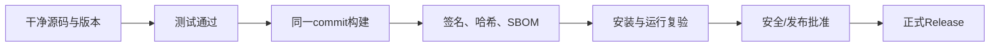

# 软件供应链：代码签名、SBOM 与发布门禁

> [!summary] 一句话解释
> **软件供应链安全要证明“源码从哪里来、用什么依赖构建、产物是否被篡改、谁批准发布”；代码签名验证发布者和完整性，SBOM 列出组件，时间戳证明签名时间，发布门禁要求证据齐全后才能交付。**

## 什么是软件供应链

软件从源代码到用户手中会经过：

```text
源码 → 依赖 → 构建工具 → CI → 制品 → 签名 → 发布平台 → 更新 → 用户安装
```

任何一环被攻击，都可能把恶意代码送给用户。

## SHA-256 文件指纹

SHA-256 可以判断下载文件是否与发布者给出的字节一致。

```text
发布者公布：installer.exe SHA-256 = ABC...
用户计算： installer.exe SHA-256 = ABC...
```

但哈希本身不证明发布者身份。如果攻击者同时替换文件和哈希，结果仍会匹配。详见 [[密码学基础：AES-GCM、scrypt、Ed25519与SHA-256]]。

## 数字签名

发布者使用私钥签名文件或清单，用户使用可信公钥验证。

签名可以帮助确认：

- 内容没有在签名后改变；
- 签名者持有对应私钥；
- 版本、commit、哈希和批准信息可以绑定。

签名不能证明软件没有漏洞，也不能代替测试。

## Authenticode

**Authenticode（微软代码签名技术）**用于 Windows 可执行文件、安装包、驱动或 Catalog。

它结合：

- 文件数字签名；
- 代码签名证书；
- CA 信任链；
- 发布者身份；
- 完整性验证。

Windows 可以显示发布者名称，并检测文件签名后是否改变。

### Authenticode 不等于业务 License

- Authenticode：证明软件发布者和制品完整性；
- License 签名：证明到期时间、席位、模块等业务授权未被简单修改。

两者保护对象不同。

## RFC 3161 时间戳

代码签名证书会过期。**RFC 3161 Time-Stamp Protocol（时间戳协议）**让可信 TSA 证明某个数据摘要在某个时间之前已经存在。

在代码签名中，它可以帮助证明签名发生在证书有效期内。时间戳不是简单写一个本机时间字符串，而是由可信时间戳服务签发可验证 Token。

## SBOM

**SBOM（Software Bill of Materials，软件物料清单）**像食品配料表，列出制品包含的：

- 组件名称和版本；
- 依赖关系；
- 包标识；
- 许可证；
- 哈希；
- 供应商和来源；
- 可选漏洞或构建信息。

CycloneDX 是常见 SBOM 标准之一。

### SBOM 的用途

发现某个依赖曝出漏洞时，可以快速回答：

- 哪些产品版本包含它；
- 它是直接还是间接依赖；
- 哪些客户需要升级；
- 当前制品是否确实已经移除。

### SBOM 不是漏洞扫描报告

SBOM 是组件清单。它可以与漏洞数据库结合，但“列出组件”不等于“没有漏洞”。错误或不完整 SBOM 也会误导判断。

## 固定依赖与可复现构建

构建应尽量固定：

- 源码 commit；
- Lockfile；
- Node/Rust/Python 等工具版本；
- 原生二进制来源；
- 构建参数；
- CI 镜像；
- 时间和环境差异。

目标是让同一输入尽可能产生相同或可核对的输出，并能追踪每个制品来自哪个 commit。

## CI Checks

CI 应真实执行：

- 类型检查和 Lint；
- 单元、集成和 E2E 测试；
- 安全扫描；
- 构建和打包；
- 制品运行验证；
- SBOM、哈希和签名；
- 发布审批。

如果 GitHub Actions 因 Runner、权限或账单问题没有执行实际 Steps，不能把空白状态当作通过。

## Canary

**Canary Release（金丝雀发布）**先把新版本交给很小范围用户或实例，观察错误、性能和兼容性，再逐步扩大。

```text
内部测试 → 1% Canary → 10% → 50% → Stable
```

必须预先定义：

- 观察指标；
- 停止条件；
- 回滚版本；
- 数据库兼容性；
- 回滚后怎样处理已经写入的新数据。

## 发布门禁

发布门禁是“证据不足就不允许进入下一阶段”的自动或人工规则。



高风险候选能力，例如新的密码协议，不应因为代码合并就自动对外宣传。

## 六层完成度

| 层级 | 证据 |
|---|---|
| 设计完成 | 威胁模型、接口和状态机 |
| 代码完成 | 主路径和单元测试 |
| 集成完成 | 组件契约和 E2E |
| 制品完成 | 真实打包、签名、哈希和 SBOM |
| 生产验收 | 容量、故障、恢复和审计 |
| 正式发布 | 可追溯 Release 和部署证据 |

## 私钥保护

代码签名和 Release 私钥是高价值资产，应：

- 与普通开发账号分离；
- 存在 HSM/硬件令牌或受控 KMS；
- 最小权限；
- 双人审批；
- 审计每次签名；
- 支持轮换和撤销；
- 不写进仓库、CI 日志和镜像。

相关知识：[[密钥管理：DEK、KEK、KMS、HSM与信封加密]]。

## 常见误区

### 文件有签名就一定安全

签名证明来源和完整性，不证明代码没有恶意逻辑或漏洞。

### 有 SBOM 就完成供应链安全

还需要准确生成、漏洞匹配、修复、签名、构建来源和发布流程。

### 开发电脑直接签正式版最方便

开发环境暴露面大。正式签名应在受控环境和审批流程中进行。

### 测试都通过就可以销售

还需要证书、真实制品、安装复验、硬件/平台兼容、回滚和支持流程。

## 在 Otto 中的作用

在 [[Otto USB便携智能体]] 中，正式信任链包括：

- 内置许可证公钥验证 `license.bin`；
- License 钉住发布公钥指纹；
- Ed25519 验证发布清单；
- 清单逐文件 SHA-256；
- CycloneDX SBOM；
- 固定 Node 运行时；
- Windows Authenticode 和 RFC 3161 时间戳。

手册明确区分“代码已具备门禁”与“正式证书、私钥、最终介质和 Release 已完成”。

## 参考资料

- [Microsoft Authenticode Digital Signatures](https://learn.microsoft.com/en-us/windows-hardware/drivers/install/authenticode)
- [Microsoft：Time Stamping Authenticode Signatures](https://learn.microsoft.com/en-us/windows/win32/seccrypto/time-stamping-authenticode-signatures)
- [RFC 3161：Time-Stamp Protocol](https://www.rfc-editor.org/rfc/rfc3161.html)
- [CycloneDX Specification Overview](https://cyclonedx.org/specification/overview/)
- 核对日期：2026-08-21。
