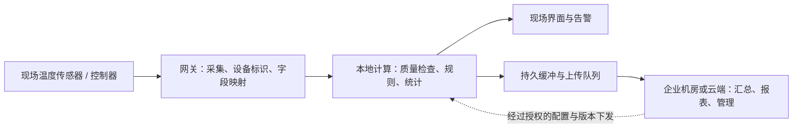

# 边缘计算模块与边缘网关

> [!summary] 一句话解释
> 边缘计算把一部分数据处理放在靠近数据来源的位置；计算模块提供或承载本地计算能力，边缘网关负责现场设备与上层系统之间的接入、汇聚和受控通信，两类能力可以集成在同一台设备中。

把工厂想成一家连锁企业：传感器像一线员工，计算模块像现场分析人员，网关像收发室和翻译人员，总部系统负责跨门店汇总与统一管理。角色可以由同一套设备承担，不要求每个角色都单独买一台机器。

> [!important] 本篇语境
> 这里主要讲工业、物联网和设备侧的边缘计算。已有笔记 [[Control Plane、Data Plane、Edge Gateway与Federation]] 中的 Otto Edge Gateway 是模型调用入口，不应仅因为英文同名就把它当成连接传感器的工业硬件。

## 一、“边缘”究竟在哪里

**Edge Computing（边缘计算，Edge 近似读“诶吉”）** 强调把计算、存储或数据处理靠近数据产生与使用的位置，而不是所有事情都交给远方的中心系统。

这个位置可以是摄像头内部、机器人机身、机器旁的计算盒、工厂机房、门店服务器或其他就近节点。它不一定是互联网的地理边界，也不一定只有一块小芯片。

**IoT = Internet of Things（物联网，读 I-o-T）**，指设备通过网络等方式交换数据并参与应用的体系。边缘计算常用于物联网，但两者不是同义词：物联网强调设备连接，边缘计算强调处理位置和分工。

中心可以是公有云，也可以是企业自己的机房。并不是“有边缘就必须购买某家云服务”，也不是“在本地放一台服务器就自动完成边缘架构”。

AWS 的工业架构资料把边缘范围从设备、网关延伸到本地节点和数据中心；这里引用其稳定的架构概念，不用历史白皮书里的产品细节判断当前支持情况。[工业物联网架构模式（历史资料）](https://docs.aws.amazon.com/pdfs/whitepapers/latest/industrial-iot-architecture-patterns/industrial-iot-architecture-patterns.pdf)

## 二、为什么不把全部数据先传给云端

### 延迟与网络波动

摄像头发现异常后，如果必须上传、等待远方计算、接收结果，网络延迟或抖动就进入处理链。现场计算可以缩短部分路径，但采集、排队、推理和本地通信本身仍会耗时。

### 带宽与上传量

很多设备持续产生大量数据。现场可以先筛选、汇总、压缩或识别，只上传需要的结果与样本，减少上行数据量。不能只为省流量而丢掉业务、追溯或模型评估必需的原始数据。

### 断网时的部分工作能力

已经部署好的本地采集、规则和推理任务，有机会在外网中断时继续工作；依赖云端登录、远程模型或在线授权的环节则可能停止。离线能力是设计与验收出来的，不是名称自动附送。

### 数据外发范围

在现场识别图像，可能不必上传全部原始视频。但结果、截图、日志和遥测仍可能外发；边缘部署不自动意味着隐私保护、完全离线或私有化。

这些收益要和设备采购、分散运维、升级、故障恢复成本一起权衡。边缘不是全面替代云，而是重新分配哪些工作在哪一层完成。

## 三、边缘计算模块：先分硬件与软件两种含义

### 1. 硬件语境：一块提供计算能力的模块

常见例子是核心板或 **SoM = System on Module（系统级模块，读 S-O-M，也写 SOM）**。它可能把处理器、内存、部分存储和供电管理等组织在一块板上，再接到载板使用。

**SoC = System on Chip（片上系统，读 S-O-C）** 则强调一颗芯片中集成多个功能。SoC 可以是 SoM 上的一颗关键芯片，但 SoC、SoM 与完整计算盒不是同一个层级。

```text
处理器等芯片与内存 → 计算模块/核心板
计算模块 + 载板接口 + 供电散热 + 存储与外壳 + 系统软件 → 完整边缘设备
```

这是常见组成示意，不要求所有产品都采用模块加独立载板的形式。NVIDIA 的 Jetson 开发套件就是理解“模块与载板分开”的一个具体例子；开发套件与最终工业产品的认证、寿命和环境要求也不能直接等同。[NVIDIA 模块与载板说明](https://docs.nvidia.com/jetson/archives/r39.2/DeveloperGuide/HR/JetsonModuleAdaptationAndBringUp/JetsonAgxOrinSeries.html)

模块中的处理能力可能包括：

- **CPU = Central Processing Unit（中央处理器，读 C-P-U）**：运行系统、业务逻辑、采集与通用计算。
- **GPU = Graphics Processing Unit（图形处理器，读 G-P-U）**：适合相应并行计算和图像处理任务。
- **NPU = Neural Processing Unit（神经网络处理器，读 N-P-U）**：针对受支持神经网络运算进行加速，实际能力依实现与软件工具而定。
- 内存与存储：保存运行数据、模型、系统和必要缓存。

并非每个模块都同时拥有三类处理器。仅做温度汇总和简单规则判断，未必需要 GPU/NPU；本地模型推理也不等于在现场重新训练大模型。

### 2. 软件语境：部署到边缘设备上的计算单元

在某些平台中，“module”指一个软件组件，比如图像识别程序、采集服务、规则引擎或容器。

例如 Azure IoT Edge 把业务逻辑作为模块管理，其模块镜像是软件包，运行后的模块实例是设备上的容器。它不是每部署一个模块就物理插入一块电路板。[Microsoft：IoT Edge 模块](https://learn.microsoft.com/en-us/azure/iot-edge/iot-edge-modules)

因此看到产品宣传中的“边缘计算模块”，应先问：它卖的是核心板、整机、加速卡，还是一个可部署的软件组件？名称本身不足以确定产品形态。

## 四、边缘网关：现场设备与上层系统之间的中间层

**Edge Gateway（边缘网关，Gateway 近似读“盖特维”）**，在本篇语境下负责连接现场设备与企业系统、云端或其他上层服务。

常见能力包括：

1. 接入传感器、仪表、控制器、摄像头等设备。
2. 按设备支持的方式读取状态或接收事件。
3. 做必要的协议适配、字段映射和数据格式统一。
4. 汇聚多个设备的数据，并保留设备来源、时间和质量信息。
5. 本地缓存、断线重连、重试与限速上传。
6. 根据配置运行过滤、聚合、规则甚至模型推理。
7. 提供设备身份、访问控制、加密连接与管理能力。
8. 在明确授权与安全机制下转交部分配置或控制请求。

这些是常见职责，不表示任何标着“网关”的产品都具备全部能力。工业网关可以是专用盒子，也可以是运行在工控机或边缘服务器上的软件服务。[AWS SiteWise Edge 网关](https://docs.aws.amazon.com/iot-sitewise/latest/userguide/gateways.html)

### 南向与北向怎么理解

- Southbound（南向）：朝现场设备一侧的接口。
- Northbound（北向）：朝上层平台、企业系统或云端一侧的接口。

这是架构图中的相对方向，不是地理上的南北，也不是说数据只能单向流动。

### 网关一定会“翻译协议”吗

不一定。有的网关主要代理和转发已有兼容协议，有的需要转换协议、数据格式或设备身份，几类功能也可能并存。

例如 Azure IoT Edge 区分透明网关与转换网关。特定工业协议的转换仍可能需要额外模块，并不是安装基础运行环境后自动理解所有设备。[Microsoft：边缘网关模式](https://learn.microsoft.com/en-us/azure/iot-edge/iot-edge-as-gateway)

## 五、模块与网关的区别：一个偏计算能力，一个偏连接职责

| 对比维度 | 边缘计算模块 | 边缘网关 |
|---|---|---|
| 重点问题 | 怎样在现场处理数据？ | 怎样让现场设备与上层系统可靠、受控地交换数据？ |
| 名称主要强调 | 计算资源或软件计算单元 | 系统中的接入与通信角色 |
| 常见工作 | 图像识别、信号处理、规则计算、过滤 | 设备采集、协议适配、汇聚、缓存、转发 |
| 常见形态 | 核心板、加速模块、软件模块 | 专用设备或服务，也可集成在其他设备中 |
| 是否必须有 AI | 不需要 | 不需要 |
| 是否必须联网到公有云 | 不需要 | 不需要，上层也可在企业内网 |
| 能否互相重叠 | 可运行网关软件 | 可包含计算模块并运行本地分析 |

**AI = Artificial Intelligence（人工智能，读 A-I）**。边缘计算不是只有 AI；把每秒的温度读数在现场汇总成每分钟平均值，也是一种边缘数据处理。

买到计算模块并不等于已经拥有工业协议适配和设备管理软件；买到网关也不代表它能运行任意大型视觉或语言模型。

## 六、一套具体流程：工厂温度监测

以下是教学场景，不是连接真实工业设备的操作步骤。



图中的采集、本地计算和缓冲，可以运行在同一台网关中，也可以分布在多个设备上；它不是要求一定串联三台盒子。

假设设备说明书规定某读数按 0.1 摄氏度缩放，原始数值 872 才能解释为 87.2 ℃。另一种设备可能使用不同单位、编码或缩放，网关不能仅凭收到数字就猜测含义。

转换后的教学消息可以是：

```json
{
  "device_id": "sensor-07",
  "event_id": "sensor-07:boot-42:000123",
  "observed_at": "2026-09-08T09:00:00+08:00",
  "temperature_c": 87.2,
  "quality": "good"
}
```

**JSON = JavaScript Object Notation（JavaScript 对象表示法，常读“杰森”）**，这里是交换结构化数据的文本格式，并不要求接收方用 JavaScript 编程。

- `device_id`：来自哪个设备。
- `event_id`：供追踪、去重使用的事件标识；实际生成与持久化策略要保证需要范围内的唯一性。
- `observed_at`：采样时间，不是上传到中心的时间。
- `temperature_c`：已经明确单位与缩放的温度值。
- `quality`：这次读数是否可靠；缺失或采集失败不能随意伪装成 0 ℃。

本地可运行“有效读数超过演示阈值就生成告警”的规则，中心再汇总各车间情况。真实报警阈值、控制动作与失效策略必须按设备和工艺设计，不能采用本文数字直接控制机器。

## 七、协议、接口和数据含义不是同一层

网线、串口等解决一部分连接与信号传输问题；应用协议规定双方怎样请求、响应或发布消息；业务模型说明数据代表什么。

例如：

- RS-485 是电气接口标准，不能仅凭两边都有它，就认为数据协议一定相同。
- Modbus 是常见工业通信协议家族，可用于相应寄存器等数据的读写；设备地址、寄存器表、编码和单位仍需确认。
- **OPC UA = OPC Unified Architecture（OPC 统一架构，读 O-P-C U-A）**；OPC 现指 Open Platform Communications（开放平台通信）。它不仅涉及交换数据，还包含信息建模和相应安全机制。
- **MQTT（读 M-Q-T-T，轻量发布/订阅消息协议）**：本篇沿用标准中的协议名称。发布者把消息交给消息服务，再由它分发给订阅者，而不是要求每个设备分别联系所有接收方。

协议转换不等于知道设备所有业务语义。两台设备都提供“温度”字段，也可能一台使用摄氏度、一台使用华氏度；字段名相同不代表含义已经对齐。

这些协议的能力也有版本、设备与实现差异，不是某条网线自身附带所有工业协议。[Modbus 规范入口](https://www.modbus.org/modbus-specifications)、[OPC Foundation](https://opcfoundation.org/about/what-is-opc/)、[MQTT FAQ](https://mqtt.org/faq/)、[MQTT 5.0 标准](https://www.oasis-open.org/standard/mqtt-v5-0-os/)

## 八、断网缓存：不等于无限保存或绝不重复

要让外网中断后继续工作，需要提前在设备上准备好代码、模型、配置、必要身份材料，以及不依赖每次联网的业务路径。

某些平台还要求预先联网登记或同步。不能因为设备标注支持离线，就假设全新设备无需任何初始化即可无限独立运行。

**Store-and-forward（存储后转发）**：先把待上传数据存到本地，网络恢复后继续发送。这里还要明确存储是否持久、是否过期，以及确认和重试规则。

缓存容量例子：每秒 100 条记录，每条有效载荷假设 200 字节，断网一小时的有效载荷为：

$$
100\times200\times3600=72{,}000{,}000\ \text{字节}
$$

约 72 MB；**MB = Megabyte（兆字节）**，这里按 100 万字节计。这只是有效载荷，没有计入消息封装、索引、日志、重试副本与安全余量。

实际需要检查：

- 缓存满了，是停止采集、丢弃旧数据、降低频率还是报警？
- 断电重启后，本地队列和发送进度是否保留？
- 消息过期后怎样处理？
- 网络恢复后的补传是否挤占实时消息和现场计算资源？
- 同一条消息重复到达时，中心是否按事件标识幂等处理？
- 时钟误差和晚到数据会不会让报表的时间顺序错误？

**TTL = Time to Live（存活时间，读 T-T-L）**，在消息缓存语境下可表示允许保留多久，不是无限保存承诺。Azure IoT Edge 文档也明确说明离线存储受 TTL 与可用磁盘空间约束。[Microsoft：离线能力](https://learn.microsoft.com/en-us/azure/iot-edge/offline-capabilities)

关联 [[状态机与幂等性]]、[[高可用、健康检查与故障恢复]]。

## 九、边缘、内网、私有化、离线不是同一个概念

| 概念 | 主要回答的问题 |
|---|---|
| 边缘计算 | 工作放在离数据来源多近的位置执行？ |
| 内网 | 哪些网络路径可以访问？ |
| 私有化部署 | 谁控制部署、数据和管理边界？ |
| 离线运行 | 外部连接和在线依赖不可用时，哪些功能还能工作？ |

一个工厂里的边缘盒子可以由云平台统一管理，也可以由企业独立管理。它可能只做初步处理，再把图片或提示词发送给外部模型服务。

如果本地设备仍调用远程模型接口，相关请求数据仍可能离开本地网络。“边缘计算”这个名字不改变真实的数据流向。需要检查原始数据、识别结果、失败样本、日志、遥测和备份，而不仅是主界面显示的位置。

详见 [[内网、公网与私有化服务器部署]] 与 [[大模型从数据、Token到训练与本地部署]]。

## 十、边缘网关与普通路由器、默认网关、模型网关

| 名称 | 侧重点 | 不应误认为 |
|---|---|---|
| 路由器/默认网关 | 让网络数据沿相应路由到达其他网络 | 默认就理解传感器单位、工业寄存器和业务规则 |
| 工业边缘网关 | 现场设备接入、数据适配、汇聚与本地处理 | 一定只是转发数据，或者一定具有强大 AI 算力 |
| 模型/API 网关 | 应用请求的认证、路由、限流、计量等 | 一定是插在工厂里的实体采集设备 |

**API = Application Programming Interface（应用程序编程接口，读 A-P-I）**。Otto 手册里的 Edge Gateway 就应按该产品的模型入口职责理解，见 [[Control Plane、Data Plane、Edge Gateway与Federation]]。

一台产品可以把路由、防火墙、设备采集和分析组合起来，但功能能集成不代表这些概念完全相同。网关也不一定承担现场设备的默认路由，它可能只是同一局域网中的一个应用服务。

## 十一、与 Arm、x86、Ubuntu、Linux 有什么关系

边缘设备可使用 Arm 或 x86 等架构，不是只有 Arm 才叫边缘。选什么架构取决于程序、驱动、接口、性能、功耗、成本与长期支持。

复杂设备常用 Linux 来复用网络、驱动、文件系统和进程能力；也可使用其他适合的系统。资源很小或对确定性时序要求很高的部分，可能由专用控制器或实时系统负责。

Ubuntu 是一种 Linux 发行版，不是边缘硬件的万能固件。模块与载板可能需要厂商对应的内核、启动配置和驱动，不能仅凭 arm64 或 amd64 标签随意刷入通用镜像。

硬件职责也仍然成立：处理器要有匹配的内存和带宽，模块要有正确供电与散热，软件要能在目标架构与加速器上运行。并非把笔记本上的程序目录复制进去就完成产品化。

关联 [[CPU、指令集与计算机体系结构]]、[[Ubuntu：Linux发行版、软件管理与架构选择]]、[[嵌入式系统为什么经常使用Linux]]、[[PCB、供电与散热：计算机硬件的物理基础]]。

## 十二、工程上还要考虑什么

### 低延迟不等于硬实时，更不等于功能安全

本地响应常能减少网络等待，但不能自动保证在所有负载下都按截止时间完成。普通采集网关或模型推理程序不应未经验证就替代急停、保护联锁等安全控制。

**PLC = Programmable Logic Controller（可编程逻辑控制器，读 P-L-C）** 常用于工业控制，但普通 PLC 与安全控制器也不能混为一谈。实际控制与安全职责应由专业方案和相应验证确定；本篇没有对任何设备下发控制命令。

### 网关可能成为单点与安全集中点

如果多台设备都依赖同一网关，它坏了可能影响全部上报或转发。同机运行模型分析和采集时，还要防止分析任务耗尽内存、存储或计算资源，拖垮采集链。

**TLS = Transport Layer Security（传输层安全，读 T-L-S）** 可保护使用它的那段通信；网关到中心使用 TLS，不会自动给传感器到网关的另一段明文连接加密。

应考虑设备身份、最小权限、网络分区、密钥保护、日志脱敏，以及远程管理和控制权限。只有向外发起连接也不等于没有攻击面，尤其不能把所有现场设备直接暴露给互联网。

### 分散设备的升级、维护与环境可靠性

设备可能分布在很多现场，需要监控版本与健康状态，验证升级来源，在失败时恢复，并处理掉电、存储磨损、过热和网络波动。

**OTA = Over-the-Air（空中下载/远程更新，读 O-T-A）** 在此泛指远程下发更新的机制，也可经有线网络完成。需要签名验证、分批发布、可恢复设计和实际回滚测试，不能只做到“包能传过去”。

开发板能在办公室运行，并不代表通过现场温度、供电波动、电气隔离、机械安装或长期无人值守要求。具体参数必须看整机和使用环境，不凭“工业级”“边缘 AI”营销名称判断。

## 十三、读产品资料时的检查清单

- [ ] “模块”是芯片、核心板、整机还是软件？还需要哪些载板、电源、散热与存储？
- [ ] 接哪些设备？接口、电气条件、协议、字段与单位是否明确？
- [ ] 哪些工作本地完成，哪些依赖企业机房或公有云？
- [ ] 每条消息、每路视频的数据量和延迟要求是多少？
- [ ] 支持哪些系统、处理器架构、驱动和模型运算？
- [ ] 断网能继续哪些功能，持续多久？首次初始化是否需要联网？
- [ ] 掉电、缓存满、重复消息、晚到数据和网关故障如何处理？
- [ ] 哪些原始数据、结果和日志会外发？谁有权限发控制命令？
- [ ] 怎样升级、验证来源、回滚和长期修补？
- [ ] 设备数量增加之后，谁负责现场维护与替换？

本篇没有连接真实传感器、扫描网络、修改端口、安装边缘平台或推荐具体购买型号。消息与容量计算是教学示例，不是本机或工厂的实测参数。

## 十四、学习建议与关联概念

先用一句话复述“传感器采集、模块计算、网关接入与通信、中心汇总管理”，再看角色怎样合并，最后学习协议、离线队列、权限和运维。

- [[计算机硬件与底层软件学习地图]]：从处理器、存储和电路板理解实体设备。
- [[GPU、显存与CUDA并行计算]]：本地推理需要怎样的计算与存储配合。
- [[设备驱动：操作系统控制硬件的翻译层]]：接口硬件怎样被系统与应用使用。
- [[Docker容器与DI容器：运行隔离和对象装配]]：软件模块与运行环境隔离。
- [[TLS与数字证书]]、[[防火墙与端口对外开放]]：通信保护与网络访问边界。
- [[软件供应链：代码签名、SBOM与发布门禁]]、[[金丝雀发布、灰度发布与渐进式交付]]：边缘设备的升级与验证。
- [[Control Plane、Data Plane、Edge Gateway与Federation]]：与产品中的控制面、数据面和模型入口区分。

## 参考资料

核对日期：2026-09-08。引用产品文档用于解释机制，不把某个平台的默认值、版本或全部功能泛化到所有边缘设备。

- [AWS：工业物联网架构模式（历史白皮书，仅参考架构概念）](https://docs.aws.amazon.com/pdfs/whitepapers/latest/industrial-iot-architecture-patterns/industrial-iot-architecture-patterns.pdf)
- [AWS：SiteWise Edge 网关](https://docs.aws.amazon.com/iot-sitewise/latest/userguide/gateways.html)
- [NVIDIA：Jetson 模块](https://developer.nvidia.com/embedded/jetson-modules)
- [NVIDIA：模块、载板与平台适配](https://docs.nvidia.com/jetson/archives/r39.2/DeveloperGuide/HR/JetsonModuleAdaptationAndBringUp/JetsonAgxOrinSeries.html)
- [Microsoft：IoT Edge 软件模块](https://learn.microsoft.com/en-us/azure/iot-edge/iot-edge-modules)
- [Microsoft：透明与转换网关](https://learn.microsoft.com/en-us/azure/iot-edge/iot-edge-as-gateway)
- [Microsoft：离线能力、消息缓存与限制](https://learn.microsoft.com/en-us/azure/iot-edge/offline-capabilities)
- [Modbus：规范入口](https://www.modbus.org/modbus-specifications)
- [OPC Foundation：OPC 与 OPC UA](https://opcfoundation.org/about/what-is-opc/)
- [MQTT：协议用途与常见问题](https://mqtt.org/faq/)
- [OASIS：MQTT 5.0 标准](https://www.oasis-open.org/standard/mqtt-v5-0-os/)
