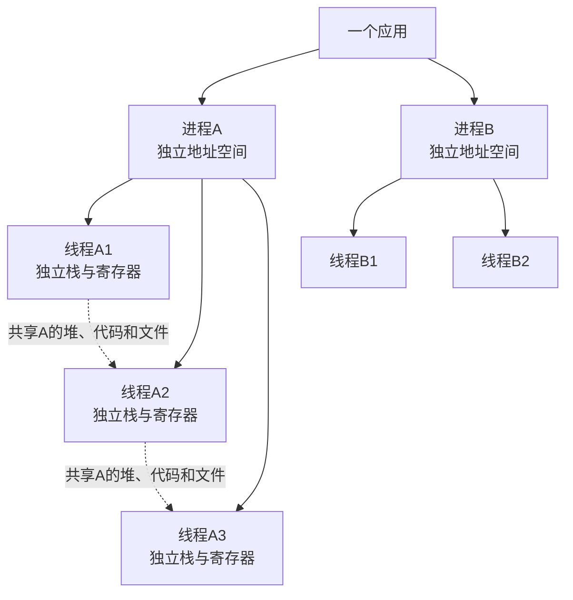
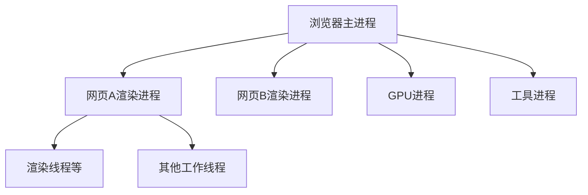
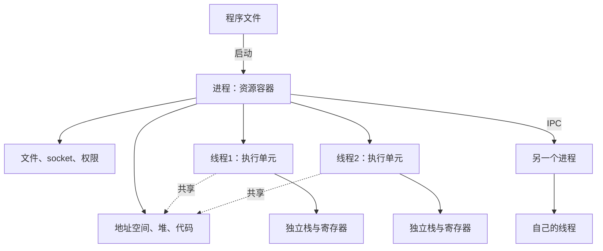

# 进程、线程、多进程与多线程

> [!summary] 一句话结论
> **进程是操作系统分配内存、文件、权限等资源的运行环境，线程是进程内部实际执行代码的工作单元；多进程用多个相对隔离的运行环境工作，多线程则让同一个进程里的多个执行单元共享资源、协同工作。**

最简记忆：

```text
进程 = 资源容器
线程 = 容器里的执行工人

多进程 = 多个相对独立的车间
多线程 = 同一个车间里的多个工人
```

一个进程通常至少包含一个线程。CPU 调度和执行的基本对象主要是线程，而线程必须存在于某个进程提供的环境中。

---

## 一、先用餐厅类比

把一个应用想成餐厅：

| 计算机概念 | 餐厅类比 |
|---|---|
| 程序文件 | 餐厅的菜谱和开店说明书 |
| 进程 | 一家真正营业中的餐厅 |
| 进程内存 | 这家餐厅自己的仓库和工作台 |
| 线程 | 餐厅里的厨师或服务员 |
| 多线程 | 同一家餐厅里有多个员工同时工作 |
| 多进程 | 开了多家彼此相对独立的分店 |
| IPC | 分店之间的电话、传单和运输通道 |
| 锁 | 同一时间只允许一人使用保险柜的钥匙 |

### 多线程餐厅

所有员工共享：

- 同一个厨房；
- 同一批食材；
- 同一本订单记录；
- 同一个收银系统。

协作很方便，但两个员工同时修改同一张订单，可能把数据弄乱。

### 多进程餐厅

每家分店有自己的：

- 厨房；
- 仓库；
- 员工；
- 订单记录副本；
- 营业环境。

一家分店厨房出问题，不一定直接破坏另一家分店。但分店间要交换订单，就需要电话、消息或配送系统，沟通成本更高。

---

## 二、程序、应用和进程不是同一个东西

### Program：程序

**Program（程序）**通常指磁盘上的代码和数据，例如：

```text
chrome.exe
java.exe
python
/usr/bin/ls
```

它是尚未或可以被运行的程序文件。

### Process：进程

**Process（进程）**是程序被操作系统加载并开始运行后形成的执行环境。

同一个程序可以同时启动多次，形成多个进程：

```text
同一个 notepad.exe
    ├── 进程 PID 1001
    ├── 进程 PID 1048
    └── 进程 PID 2107
```

它们运行相同程序代码，但拥有不同的运行状态、内存和 PID。

### Application：应用

**Application（应用）**是用户眼中的完整软件。一个应用可能只使用一个进程，也可能由许多进程组成。

例如浏览器看起来是一个应用，但通常包含：

- 浏览器主进程；
- 多个网页渲染进程；
- GPU 进程；
- 网络或实用工具进程；
- 每个进程内部的多个线程。

所以：

```text
一个应用 ≠ 一定只有一个进程
一个程序文件 ≠ 一次具体运行
```

---

## 三、进程里面通常有什么

进程不是只有一段代码。操作系统会为它维护一组运行资源和状态，例如：

- 独立的虚拟地址空间；
- 已加载的程序代码和动态库；
- 堆内存；
- 一个或多个线程；
- 打开的文件、socket 或句柄；
- 当前工作目录；
- 环境变量；
- 用户身份和安全令牌；
- PID；
- 信号、异常和退出状态；
- 资源限制和统计信息。

### PID 是什么

**PID（Process Identifier，进程标识符）**是操作系统用来识别一次具体进程运行的编号。

例如：

```text
java.exe  PID 5236
```

PID 在进程结束后可能被操作系统重新分配，所以它不是某个程序永久不变的身份证号。

### 地址空间是什么

**Address Space（地址空间）**是进程看到的内存地址范围。

现代操作系统通常给不同进程提供相互隔离的虚拟地址空间：


进程 A 中地址 `0x1234` 指向的内容，不等于进程 B 中相同数字地址的内容。

这种隔离能减少一个程序随意破坏另一个程序内存的风险。

---

## 四、线程是什么

**Thread（线程）**是进程内部的一条执行路线，也是操作系统进行 CPU 调度的基本执行单元之一。

线程需要记录“代码执行到哪里、下一步做什么”。每个线程通常有自己的：

- 指令位置或程序计数器；
- CPU 寄存器状态；
- 调用栈；
- 局部变量；
- 线程 ID；
- 线程本地存储；
- 调度状态和优先级等。

同一进程中的线程通常共享：

- 程序代码；
- 堆内存中的对象；
- 全局变量或静态变量；
- 打开的文件和 socket；
- 进程权限；
- 进程地址空间中的其他资源。

### 为什么每个线程要有自己的栈

**Stack（栈）**用于保存函数调用、参数、返回位置和许多局部变量。

如果线程 A 正在执行：

```text
handleOrder(订单A)
```

线程 B 正在执行：

```text
handleOrder(订单B)
```

两者必须分别记住自己的调用进度和局部状态，因此需要各自的栈。

### 为什么线程共享堆

**Heap（堆）**通常保存动态创建、需要跨函数或跨线程使用的对象。

共享堆让线程之间能快速访问同一份业务对象和缓存，但也带来数据竞争风险。

---

## 五、进程和线程的结构关系



一句话：

> **进程之间默认隔离；同一进程的线程之间默认共享许多资源。**

“默认”很重要，因为：

- 进程可以通过共享内存等机制显式共享资源；
- 线程也有独立的栈和线程本地状态；
- 操作系统、语言运行时和沙箱可能增加额外边界。

---

## 六、什么是多进程

**Multiprocessing（多进程）**表示一个任务或应用使用多个进程共同完成工作。

例如一个 Web 服务器启动四个 Worker 进程：

```text
主进程
├── Worker进程1
├── Worker进程2
├── Worker进程3
└── Worker进程4
```

操作系统可以把不同 Worker 安排到不同 CPU 核心运行。

### 多进程的主要优点

#### 1. 隔离更强

每个进程通常拥有独立地址空间。一个 Worker 错误写坏自己的内存，通常不会直接把另一个 Worker 的堆内存一起改坏。

#### 2. 故障影响更容易限制

一个子进程崩溃，管理进程可能只重启它，其他进程继续服务。

这也是浏览器把不同网页放进不同渲染进程的重要思路之一。

#### 3. 可以使用多个 CPU 核心

多个进程可以真正并行执行，适合 CPU 密集计算或需要进程隔离的任务。

#### 4. 可以使用不同权限和环境

不同进程可以运行在不同用户、权限、沙箱、环境变量或资源限制下。

#### 5. 可运行不同程序甚至不同语言

主程序可以通过子进程调用 Python、Rust、FFmpeg 或其他工具。

### 多进程的主要代价

- 创建和管理通常比普通线程更重；
- 每个进程需要独立地址空间和运行时资源；
- 数据不能像同一进程线程那样直接通过普通对象引用共享；
- 需要 IPC；
- 序列化和复制数据可能产生开销；
- 部署、日志、监控和关闭流程更复杂；
- 多个进程仍可能争抢磁盘、数据库或其他外部资源。

---

## 七、什么是多线程

**Multithreading（多线程）**表示一个进程中同时存在多个线程，共同执行这个进程的代码。

例如一个 Java 服务：

```text
一个JVM进程
├── 主线程
├── HTTP工作线程1
├── HTTP工作线程2
├── GC相关线程
├── 日志线程
└── 定时任务线程
```

### 多线程的主要优点

#### 1. 创建和切换通常比进程更轻

线程共享进程的地址空间和许多资源，不必为每个线程建立完整、独立的运行环境。

#### 2. 通信方便

线程可以直接读写同一个堆对象：

```text
线程A ─┐
       ├→ 同一个队列、缓存或对象
线程B ─┘
```

#### 3. 适合同时处理多个任务

例如一个线程等待数据库时，其他线程可以继续处理请求。

#### 4. 可以在多核上并行

如果操作系统线程模型和硬件支持，同一进程中的不同线程可以在不同 CPU 核心上同时运行。

#### 5. 共享缓存和连接等资源容易

多个线程可以使用同一个进程中的缓存、连接池和配置对象，减少跨进程复制。

### 多线程的主要风险

共享内存既是优点，也是最难的部分。

- 数据竞争；
- 丢失更新；
- 可见性问题；
- 死锁；
- 活锁；
- 饥饿；
- 锁竞争；
- 一个线程破坏共享状态，影响整个进程；
- 某些致命错误可能导致整个进程退出。

---

## 八、最重要的对比表

| 对比 | 多进程 | 多线程 |
|---|---|---|
| 基本结构 | 多个独立进程 | 一个进程内多个线程 |
| 地址空间 | 通常相互隔离 | 共享同一进程地址空间 |
| 堆内存 | 默认不直接共享 | 通常共享 |
| 栈 | 每个进程内的每个线程各有栈 | 每个线程各有栈 |
| 通信 | 需要 IPC | 可直接访问共享对象 |
| 通信成本 | 通常较高 | 通常较低 |
| 创建成本 | 通常较高 | 平台线程通常较低；虚拟线程更轻 |
| 故障隔离 | 较强 | 较弱，共享进程状态 |
| 编程难点 | IPC、序列化、生命周期、分布式状态 | 锁、可见性、数据竞争、死锁 |
| 多核并行 | 可以 | 可以 |
| 权限隔离 | 容易按进程设置 | 同进程线程通常共享进程权限 |
| 适合场景 | 隔离、CPU Worker、插件沙箱、多个服务 | 共享缓存、请求处理、进程内并发 |

“线程更快、进程更安全”只是粗略印象，实际选择还取决于操作系统、运行时、任务大小、数据交换量和故障模型。

---

## 九、IPC：进程怎样通信

由于进程默认不能直接读取另一个进程的普通内存，它们需要 **IPC（Inter-Process Communication，进程间通信）**。

常见 IPC 包括：

### Pipe：管道

一个进程的输出交给另一个进程：

```bash
producer | consumer
```

详见 [[Unix与Linux设计哲学：文件、小工具与管道]]。

### Named Pipe：命名管道

具有系统名称或文件系统入口的管道，可以让没有直接父子关系的进程通信。

### Socket：套接字

进程可以通过：

- Unix Domain Socket；
- TCP；
- UDP；

在本机或不同机器之间通信。

### Shared Memory：共享内存

操作系统把一块内存显式映射给多个进程。

速度可能很高，但共享内存不会自动解决并发安全；进程仍需锁、信号量或其他同步机制。

### Message Queue：消息队列

进程通过结构化消息交换数据，可以是操作系统本地队列，也可以是 Redis、RabbitMQ、Kafka 等外部系统。

### File：文件

一个进程写文件，另一个读取。实现简单，但要处理：

- 并发写入；
- 文件锁；
- 完整性；
- 延迟；
- 清理和权限。

### RPC：远程过程调用

**RPC（Remote Procedure Call，远程过程调用）**让调用方看起来像在调用函数，底层通过消息、socket 和序列化与另一个进程或机器通信。

---

## 十、线程之间为什么也需要同步

线程虽然能直接共享对象，但同时读写会出现竞争。

### 丢失更新例子

假设共享计数器初始值为 10，两个线程同时执行：

```text
count = count + 1
```

它可能实际分为：

```text
读取 count
计算 +1
写回 count
```

一种交错顺序：

```text
线程A读取10
线程B读取10
线程A写入11
线程B写入11
```

正确结果应为 12，最终却得到 11。这叫 **Lost Update（丢失更新）**。

### 常见同步工具

- Mutex / Lock：互斥锁；
- Read-Write Lock：读写锁；
- Semaphore：信号量；
- Atomic operation：原子操作；
- Condition variable：条件变量；
- Channel / Queue：通道或线程安全队列；
- Immutable object：不可变对象；
- Thread confinement：线程封闭，让数据只属于一个线程。

不同语言提供的具体工具不同。Java 相关内容详见 [[Java为什么适合高并发]]。

---

## 十一、死锁是什么

**Deadlock（死锁）**表示多个执行单元互相等待对方持有的资源，谁也不能继续。

例如：


多线程容易在共享锁上发生死锁；多进程使用文件锁、共享内存锁、数据库锁或 IPC 时也可能死锁。

减少死锁的常见做法：

- 固定锁获取顺序；
- 缩小锁范围；
- 不在持锁时执行长时间 I/O；
- 使用超时；
- 减少共享可变状态；
- 使用更高层的并发结构；
- 监控长期等待和线程 dump。

---

## 十二、CPU 到底执行进程还是线程

初学阶段可以这样理解：

> **操作系统把 CPU 时间主要分配给可运行线程；进程提供线程运行所需的地址空间和资源环境。**

### 单核 CPU

一个时刻通常只能真正执行一个线程，但操作系统快速切换：

```text
线程A运行几毫秒
→ 保存A状态
→ 线程B运行几毫秒
→ 保存B状态
→ 线程C运行
```

这叫 **Time Slicing（时间片轮转）**的一类效果，让多个任务看起来同时进行。

### 多核 CPU

如果有多个核心，可以真正并行执行多个线程：

```text
核心1 → 线程A
核心2 → 线程B
核心3 → 线程C
核心4 → 线程D
```

### Concurrency 和 Parallelism

- **Concurrency（并发）**：多个任务在一段时间内共同推进；
- **Parallelism（并行）**：多个任务在同一时刻真的执行。

单核也能并发，多核才有更充分的并行能力。

---

## 十三、上下文切换是什么

**Context Switch（上下文切换）**是操作系统暂停当前线程或进程，保存其执行状态，再恢复另一个执行单元的过程。

需要保存或恢复的内容可能包括：

- 寄存器；
- 指令位置；
- 栈位置；
- 调度状态；
- 地址空间相关状态；
- CPU 缓存和内存映射产生的间接影响。

### 为什么切换有成本

切换期间 CPU 没有直接推进当前业务计算；工作集变化还可能降低缓存命中率。

一般来说，跨进程切换可能涉及更明显的地址空间变化，普通线程切换往往较轻，但具体成本取决于操作系统、CPU、缓解机制和工作负载，不能简单使用一个固定倍数。

线程或进程不是越多越好。过多执行单元可能导致：

- 调度开销上升；
- 缓存抖动；
- 内存占用增加；
- 锁竞争；
- 延迟变差。

---

## 十四、多进程和多线程都能利用多核吗

可以。

### 多进程

操作系统可以把不同进程中的线程放到不同核心。

### 多线程

同一进程中的多个平台线程也可以被安排到不同核心。

因此“只有多进程才能使用多核”是错误的。

真正要看语言和运行时：

- Java 平台线程能在多核并行；
- Go 的 goroutine 由运行时调度到多个 OS 线程；
- Node.js 的 JavaScript 主线程通常只有一个事件循环，但可用 Worker 或子进程；
- 某些语言运行时可能限制同一进程内特定代码的并行方式；
- Java 虚拟线程提高并发规模，但 CPU 密集并行仍受核心数限制。

---

## 十五、I/O 密集和 CPU 密集怎样影响选择

### I/O-bound：I/O 密集

任务多数时间在等待：

- 网络；
- 数据库；
- 磁盘；
- 用户输入；
- 其他服务。

多线程、异步 I/O 或虚拟线程可以在一个任务等待时推进其他任务。

### CPU-bound：CPU 密集

任务多数时间在持续计算：

- 视频编码；
- 压缩；
- 图像处理；
- 科学计算；
- 加密；
- 大规模解析。

并行度受 CPU 核心数限制。多进程或多线程都可能使用多核，选择要看语言运行时、共享数据量和隔离需求。

```text
I/O密集：重点减少等待资源浪费
CPU密集：重点合理利用核心，避免过度调度
```

---

## 十六、Java 中的进程和线程

### 一个 JVM 通常是一个操作系统进程

启动：

```bash
java MyApplication
```

通常会产生一个 JVM 进程。

这个 JVM 进程内部可能有很多线程：

- `main` 主线程；
- Web 请求工作线程；
- 垃圾回收相关线程；
- JIT 编译线程；
- 定时任务；
- 日志或网络线程。

### Java 多线程

Java 常使用：

- `Thread`；
- `ExecutorService`；
- 线程池；
- `CompletableFuture`；
- 虚拟线程；
- `java.util.concurrent` 工具。

它们主要在一个 JVM 进程内部组织并发。

### Java 多进程

Java 可以通过 `ProcessBuilder` 启动子进程，也可以把系统部署成多个独立 JVM：

```text
订单服务 JVM进程
支付服务 JVM进程
库存服务 JVM进程
```

多个 JVM 之间通常通过 HTTP、RPC、消息队列或数据库通信。

### 虚拟线程是不是进程

不是。

Java Virtual Thread 是 JVM 管理的轻量线程抽象：

- 它不是独立操作系统进程；
- 不拥有独立 JVM 堆；
- 与同一 JVM 中其他线程共享进程资源；
- 它能降低大量 I/O 并发任务的线程成本；
- 它不提供进程级安全隔离。

---

## 十七、浏览器和 Electron 为什么使用多进程

现代浏览器要运行不可信网页、扩展、GPU 和网络功能，多进程可以建立更清楚的故障和权限边界。

简化结构：



一个网页崩溃时，浏览器可能只终止对应渲染进程，而不是整个浏览器一起退出。

Electron 也有：

- Main Process：主进程；
- Renderer Process：渲染进程；
- Utility Process：实用工具进程；
- 进程内部的多个线程。

这些进程通过 IPC 交换经过定义的消息。详见 [[Electron桌面应用架构]]。

> [!warning] 多进程不是自动安全
> 进程隔离只是基础，还需要沙箱、最小权限、参数校验、安全 IPC、更新和操作系统保护。

---

## 十八、Web 服务器中的几种组合

### 单进程单线程

```text
一个进程
└── 一个主要执行线程
```

实现简单，但一个长任务可能阻塞其他工作。

### 单进程多线程

```text
一个进程
├── 线程1处理请求A
├── 线程2处理请求B
└── 线程3处理请求C
```

共享缓存和连接池方便，但要处理线程安全。

### 多进程单线程

```text
进程1 → 一个事件循环
进程2 → 一个事件循环
进程3 → 一个事件循环
```

常用于隔离 Worker 并利用多核。

### 多进程多线程

```text
多个服务进程
└── 每个进程内部又有多个线程
```

现实中的大型系统经常是这种混合结构。

所以“多进程还是多线程”并不总是二选一。

---

## 十九、怎样选择

### 更倾向多进程的情况

- 需要更强故障隔离；
- 运行不可信插件或任务；
- 不同任务需要不同权限；
- CPU 密集任务适合独立 Worker；
- 使用不同语言或运行时；
- 一个 Worker 崩溃后希望单独重启；
- 需要明确限制每个任务的内存和 CPU。

### 更倾向多线程的情况

- 线程需要频繁共享大量内存数据；
- 希望较低通信延迟；
- 任务属于同一个可信应用；
- 共享缓存、连接池或对象很重要；
- 语言和运行时提供成熟线程安全工具；
- 可以正确管理锁和共享状态。

### 更倾向事件循环或异步模型的情况

- 大量连接多数时间在等待；
- 单个任务计算很短；
- 框架有成熟的非阻塞 I/O 支持；
- 能保证不在事件循环上执行阻塞任务。

### 更倾向虚拟线程的情况

- Java 21+；
- 大量相互独立的 I/O 等待任务；
- 希望保留顺序代码；
- 仍会明确限制数据库连接等稀缺资源。

---

## 二十、常见误区

### 误区 1：一个程序只能有一个进程

错误。一个应用可以由多个进程组成，同一个程序文件也可以启动多个实例。

### 误区 2：进程就是线程的集合

不完整。进程除了线程，还包含地址空间、文件、权限和其他运行资源。

### 误区 3：线程拥有独立内存

不准确。线程有独立栈和寄存器等状态，但同一进程线程通常共享堆、代码和打开的资源。

### 误区 4：多线程一定比单线程快

错误。任务太小、锁竞争严重或线程过多时，多线程可能更慢。

### 误区 5：多进程绝对不会互相影响

错误。它们仍可能争抢 CPU、内存、磁盘、端口和数据库；也可能通过共享内存或 IPC 传播错误数据。

### 误区 6：多进程不能共享数据

错误。默认地址空间隔离，但可以通过共享内存、文件、socket 和其他 IPC 显式交换或共享。

### 误区 7：只有多进程能利用多核

错误。多个操作系统线程同样能被多个核心并行执行。

### 误区 8：一个线程崩溃一定让整个进程退出

不一定。普通未处理异常的行为取决于语言和运行时；Java 中某个线程未捕获异常通常会终止该线程，但不必然立刻结束全部 JVM。内存破坏、致命运行时错误或主流程退出则可能终止整个进程。

### 误区 9：创建越多进程或线程，吞吐越高

错误。资源有限，过多执行单元会增加内存、调度、上下文切换和竞争。

### 误区 10：进程隔离等于完整安全沙箱

错误。进程可能仍拥有文件、网络和系统权限。真正沙箱还需要操作系统访问控制、命名空间、容器策略、权限令牌等机制。

---

## 二十一、怎样在 Windows 查看

### 任务管理器

打开任务管理器后，可以查看：

- 进程；
- PID；
- CPU；
- 内存；
- 某些线程和句柄相关信息需要更高级工具。

### PowerShell 查看进程

```powershell
Get-Process | Sort-Object CPU -Descending
```

查看指定进程：

```powershell
Get-Process -Id 5236
```

部分进程信息受权限限制，以普通用户运行时可能看不到全部细节。

---

## 二十二、怎样在 Linux 查看

查看进程：

```bash
ps aux
```

查看进程树：

```bash
pstree
```

动态查看：

```bash
top
```

查看指定进程的线程：

```bash
ps -T -p 5236
```

不同 Unix/Linux 系统的 `ps` 选项可能不同，应以本机 `man ps` 为准。

---

## 二十三、排查时应该问什么

面对“程序卡住、CPU 很高或内存很大”，可以先问：

```text
1. 用户看到的是一个应用，还是内部有多个进程？
2. 每个进程的PID是什么？
3. 哪个进程占用CPU或内存？
4. 进程内部有多少线程？
5. 线程是在运行、等待I/O，还是等待锁？
6. 数据通过共享内存还是IPC传递？
7. 是否存在死锁、无界队列或无限创建？
8. 问题需要进程级隔离，还是线程级协作？
```

只有先定位到“哪个进程、哪条线程、什么资源”，后续排障才不会过于笼统。

---

## 二十四、记忆地图



最终记住四句话：

> **程序是代码文件，进程是运行实例。**
>
> **进程装资源，线程跑代码。**
>
> **多进程隔离强，通信要 IPC。**
>
> **多线程共享快，但必须处理竞争和同步。**

---

## 关联概念

- [[Java为什么适合高并发]]：Java 平台线程、线程池、NIO 与虚拟线程怎样处理大量任务。
- [[Unix与Linux设计哲学：文件、小工具与管道]]：进程、标准流、管道、文件描述符和 Shell 的关系。
- [[Electron桌面应用架构]]：Main、Renderer、Preload、IPC 与多进程安全边界。
- [[状态机与幂等性]]：并发任务、消息和重试怎样避免重复业务效果。
- [[Windows ACL与NTFS权限]]：进程访问令牌和对象权限怎样限制资源访问。
- [[TCP、HTTP、HTTPS与WebSocket]]：进程通过 socket 与本机或远程服务通信。
- [[高可用、健康检查与故障恢复]]：使用多进程、冗余和重启进行故障隔离与恢复。

## 参考资料

以下内容于 2026-08-22 核对：

- [Microsoft Learn：Processes and Threads](https://learn.microsoft.com/en-us/windows/win32/procthread/processes-and-threads)
- [Microsoft Learn：Windows Kernel-Mode Process and Thread Manager](https://learn.microsoft.com/en-us/windows-hardware/drivers/kernel/windows-kernel-mode-process-and-thread-manager)
- [Linux man-pages：pthreads](https://man7.org/linux/man-pages/man7/pthreads.7.html)
- [Oracle Java Tutorials：Processes and Threads](https://docs.oracle.com/javase/tutorial/essential/concurrency/procthread.html)
- [Oracle Java SE：Concurrency](https://docs.oracle.com/en/java/javase/25/core/concurrency.html)
- [Electron 官方文档：Process Model](https://www.electronjs.org/docs/latest/tutorial/process-model)
