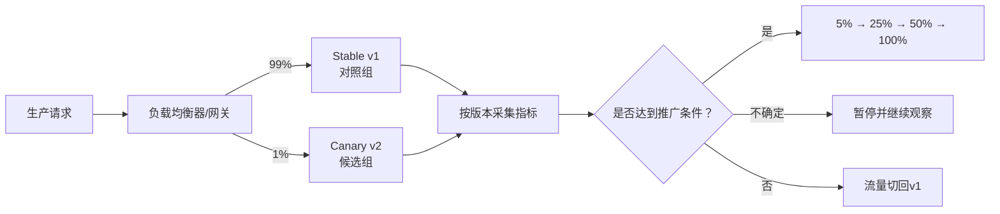
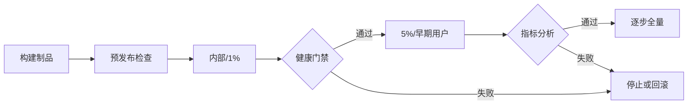
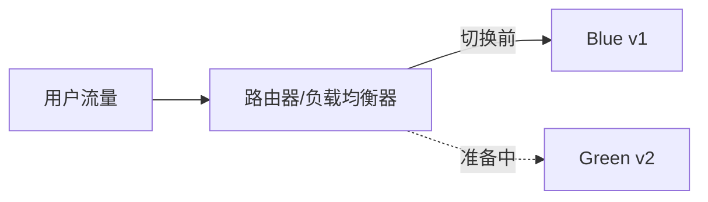
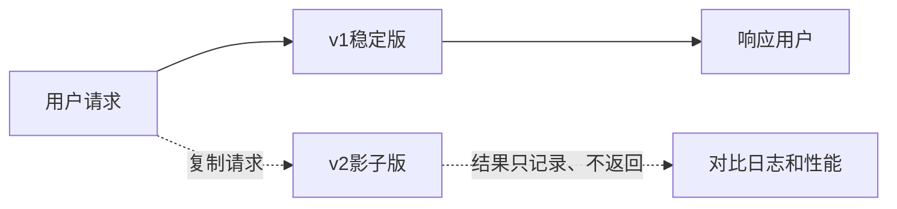
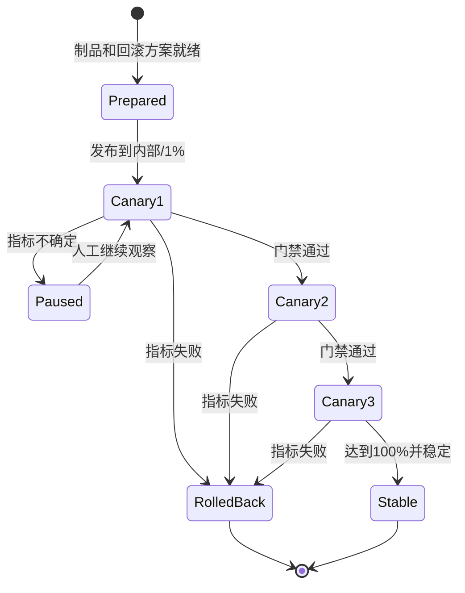
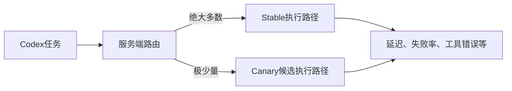

# 金丝雀发布、灰度发布与渐进式交付

> [!summary] 一句话解释
> **Canary Release / Canary Deployment（金丝雀发布 / 金丝雀部署）是先让极少量真实用户或流量使用新版本，比较新旧版本的错误率、延迟和业务指标，确认安全后再逐步扩大；一旦指标越界就暂停或回滚。**

“金丝雀测试”是常见口语，但更准确的名称通常是“金丝雀发布”或“金丝雀部署”，因为它不只是执行一个测试用例，而是一整套 **小范围部署、生产流量暴露、指标分析和推广/回滚决策**。

---

## 一、为什么叫“金丝雀”

过去矿工会把金丝雀带入矿井。金丝雀体型小，对一氧化碳等危险气体更敏感；如果它先出现异常，矿工就知道环境可能危险，需要撤离。

软件发布借用了这个比喻：

```text
矿井里的少量金丝雀
        ↓ 类比
先接触新版本的少量实例、用户、设备或请求
```

如果新版本有问题，先受影响的是很小范围，而不是所有用户。

> [!warning] 这个名称不代表“拿用户当实验动物”
> 正确目标是用可控流量、明确指标、快速回滚和知情的早期用户降低整体风险，而不是把未经测试的软件随意扔给用户。

---

## 二、完整的金丝雀发布包含什么

Google SRE 对 canarying 的核心描述可以概括为：**对某项变更进行局部、限时部署，并评价是否继续推广。**

因此完整流程至少包含四部分：

1. 同时保留 Stable（稳定版本）和 Canary（候选版本）；
2. 只把少量生产流量或用户导向 Canary；
3. 比较 Canary 与 Control（对照组）的指标；
4. 根据预先定义的规则继续、暂停或回滚。



只部署一台新服务器但不看指标，不算成熟的金丝雀流程；只跑自动化测试而没有小范围真实流量，也通常不叫金丝雀发布。

---

## 三、用一个支付服务例子理解

假设支付服务当前是 v1，现在准备发布 v2。

### 第一步：部署候选版本但暂不扩大

```text
v1：99个实例或99%的流量
v2：1个实例或1%的流量
```

### 第二步：观察一段时间

比较：

| 指标 | v1 稳定版 | v2 金丝雀 | 结论示例 |
|---|---:|---:|---|
| HTTP 5xx 错误率 | 0.10% | 2.80% | v2 明显异常，应停止 |
| P95 延迟 | 180 ms | 190 ms | 轻微变化，需要结合阈值 |
| 支付成功率 | 98.9% | 92.0% | 严重业务回归，应回滚 |
| CPU 使用率 | 45% | 70% | 可能存在性能问题 |

### 第三步：自动或人工决策

假设预先定义：

```text
观察至少30分钟
有效请求至少20,000次
v2错误率不得超过v1的1.5倍
支付成功率下降不得超过0.3个百分点
P95延迟增加不得超过15%
```

一旦越界：

```text
停止扩大 → 流量切回v1 → 保留日志和指标 → 调查v2
```

如果通过：

```text
1% → 5% → 25% → 50% → 100%
```

百分比和时间都不是固定标准，要根据流量规模、风险、指标噪声和业务周期设计。

---

## 四、“少量”到底可以怎样划分

金丝雀不一定只按随机请求百分比划分。

### 1. 按请求流量

```text
每100个请求，大约1个进入v2
```

适合高流量、无状态服务。通常由负载均衡器、API Gateway、Ingress 或 Service Mesh 控制。

### 2. 按用户

对用户 ID 做稳定哈希，让同一个用户始终进入同一版本：

```text
hash(userId) % 100 < 5 → v2
其他用户               → v1
```

这样不会出现用户刷新一次是新界面、再刷新又回旧界面的混乱。

### 3. 按组织或租户

先选择内部租户、测试租户、愿意尝鲜的客户，再扩大到普通客户。

### 4. 按地区或可用区

先部署到一个区域、一个机房或一个 Availability Zone，再逐步扩展。

### 5. 按设备环

桌面软件、手机 App、操作系统或驱动更新经常使用 Rings（发布环）：

```text
开发团队 → 公司内部 → 早期采用者 → 普通用户 → 关键设备
```

### 6. 按实例数量

例如 10 个 Pod 中有 1 个运行 v2。但要注意：

```text
1/10个Pod ≠ 一定精确获得10%的请求
```

实例性能、长连接、会话粘性、请求耗时和负载均衡算法都会影响真实流量比例。Argo Rollouts 等工具在没有流量路由器时，也只能用副本数量近似权重。

---

## 五、应该观察哪些指标

### 1. 技术正确性

- HTTP 4xx/5xx 比例；
- 异常数量和崩溃率；
- 超时率；
- 请求重试率；
- 数据校验失败；
- 消息消费失败和死信队列；
- 前端 JavaScript 错误；
- 桌面应用崩溃和启动失败。

### 2. 性能

- P50、P95、P99 延迟；
- CPU、内存、磁盘和网络；
- 数据库连接数；
- 队列长度和积压时间；
- 缓存命中率；
- GC（Garbage Collection，垃圾回收）暂停；
- 线程池或连接池耗尽。

P95 表示 95% 的请求都比这个值快，剩下 5% 更慢。平均值正常，不代表尾部用户没有遇到严重延迟。

### 3. 业务指标

- 登录成功率；
- 支付成功率；
- 下单完成率；
- 搜索无结果率；
- 文件保存成功率；
- 用户放弃率；
- 客服工单和投诉数量。

技术指标正常但支付成功率下降，发布仍然可能失败。

### 4. 安全与数据指标

- 权限拒绝异常增加；
- 审计日志缺失；
- 数据损坏或不一致；
- 意外暴露敏感字段；
- 异常网络访问；
- 风险操作数量。

### 5. 指标必须按版本分组

如果只看全站错误率：

```text
v1处理99%流量，错误率0.1%
v2处理 1%流量，错误率20%
```

全站平均可能仍显得“不太严重”，从而掩盖 v2 的故障。日志、指标和 Trace 应带上：

```text
version=v2
deployment=canary
region=...
instance=...
```

再把 v2 与同一时间、相似请求的 v1 对照组比较。

---

## 六、怎样决定继续还是回滚

### 1. 先写规则，再发版本

不要等看到图表后才临时决定什么叫“正常”。发布前应该定义：

- 成功指标；
- 失败阈值；
- 最小样本量；
- 最短观察时间；
- 必须覆盖的高峰或业务周期；
- 谁可以人工批准；
- 什么条件自动暂停；
- 什么条件自动回滚。

### 2. 同时比较绝对阈值和相对变化

例如：

```text
绝对阈值：v2错误率不得超过1%
相对阈值：v2错误率不得超过v1的1.5倍
```

只看绝对阈值可能忽略明显退化；只看相对倍数又可能在基线接近零时被微小数字误导。

### 3. 样本太少不能说明安全

如果一个严重错误只会影响万分之一请求，那么 100 个 Canary 请求没有报错并不能证明它不存在。

低流量系统可能需要：

- 更长观察时间；
- 主动生成合成流量；
- 更大的初始用户组；
- 对高风险路径做专门验证；
- 结合预发布压测和回放测试。

### 4. 避免把环境噪声当版本问题

Canary 所在机器可能恰好 CPU 过载，或者所在可用区网络异常。因此最好让 Canary 和 Control：

- 位于相近环境；
- 接收相似请求；
- 同时观察；
- 有足够多个实例；
- 排除明显的基础设施异常。

这能减少 false positive（误报）和 false negative（漏报）。

---

## 七、灰度发布是什么

**灰度发布**在中文技术语境中通常指“不要一次全量，而是逐步扩大新版本或新功能的暴露范围”。它是一个较宽泛、并非所有团队都严格统一的术语。

常见关系可以理解为：

```text
灰度发布 / 渐进式暴露
├─ 金丝雀流量：1% → 5% → 25% → 100%
├─ 发布环：内部 → 早期用户 → 普通用户
├─ 地域灰度：一个区域 → 多个区域
└─ 功能开关：指定用户 → 百分比用户 → 全部用户
```

因此：

- 金丝雀发布通常可以看作灰度发布的一种；
- 灰度发布不一定严格包含自动对照分析；
- 不同公司说“灰度”时，必须继续问按用户、流量、实例、地区还是功能开关划分。

---

## 八、Progressive Delivery 是什么

**Progressive Delivery（渐进式交付）**是更完整的工程思想：把发布分成多个阶段，并用自动化流量控制、指标分析、审批和回滚逐步扩大影响范围。



它强调的不只是“分批”，还包括：

- 自动化；
- 可观测性；
- 风险门禁；
- 持续分析；
- 人工批准点；
- 可回滚或可前滚；
- 控制 blast radius（爆炸半径/影响范围）。

金丝雀、蓝绿、发布环和 Feature Flag 都可以成为渐进式交付的一部分。

---

## 九、相关发布方式对比

| 方式 | 核心做法 | 流量怎样变化 | 主要目标 | 主要代价 |
|---|---|---|---|---|
| All-at-once 全量发布 | 一次替换全部版本 | 0% → 100% | 简单、快速 | 故障影响全部用户 |
| Recreate 重建 | 先停旧版本，再启动新版本 | 可能中断 | 适合不能并存的新旧版本 | 有停机时间 |
| Rolling Update 滚动更新 | 分批替换实例 | 随实例逐步变化 | 保持服务可用、节省额外资源 | 不一定有精确流量或自动分析 |
| Canary 金丝雀 | 少量流量先进入新版本 | 1% → 5% → 25% → 100% | 用真实流量控制风险 | 路由、观测、分析更复杂 |
| Linear 线性发布 | 按固定步长持续增加 | 10% → 20% → 30%… | 平滑迁移流量 | 发布耗时更长 |
| Blue-Green 蓝绿 | 同时保留两套环境，再切换 | 常见是一次切换，也可渐进 | 快速切换和快速切回 | 接近双倍资源、数据兼容复杂 |
| Ring 发布环 | 按用户、设备或租户分组 | 环0 → 环1 → 环2 | 让低风险群体先收到版本 | 分组代表性和版本碎片 |
| Feature Flag 功能开关 | 代码已部署，按配置开放功能 | 0%用户 → 部分用户 → 全部用户 | 部署与功能发布解耦 | 开关债务、组合复杂度 |
| A/B Test | 不同群体看到不同方案 | A组与B组并行 | 比较产品或业务效果 | 需要实验设计和统计分析 |
| Shadow / Mirroring | 复制真实请求给新版本 | 用户响应仍来自旧版本 | 无用户影响地验证处理能力 | 写操作和异步副作用必须隔离 |
| Smoke Test 冒烟测试 | 快速检查最关键路径 | 不负责分流 | 判断版本是否基本可运行 | 覆盖浅，不能证明整体正确 |

这些方式可以组合。例如：

```text
先建立Blue/Green两套环境
→ 给Green镜像流量做Shadow测试
→ 再用Canary方式逐步把真实响应流量切给Green
→ 用Feature Flag只开放其中一个新功能
```

---

## 十、Rolling Update 为什么不等于 Canary

**Rolling Update（滚动更新）**关注的是“怎样逐批替换旧实例”；Canary 关注的是“怎样限制真实影响、比较新旧版本并据此决策”。

Kubernetes Deployment 默认的 `RollingUpdate` 会逐渐减少旧 ReplicaSet、增加新 ReplicaSet，并通过 `maxUnavailable`、`maxSurge` 控制可用实例和额外实例数量。

但普通滚动更新不一定自动完成：

- 精确把 1% 流量导向新版本；
- 按用户固定分组；
- 同时保留明确的 Control；
- 比较新旧版本指标；
- 达到阈值后自动暂停；
- 根据分析结果自动回滚。

因此：

```text
滚动更新 + 流量控制 + 指标分析 + 暂停/回滚门禁
≈ 可以形成金丝雀式渐进发布
```

Argo Rollouts、Flagger、服务网格或云平台发布服务常用于补充这些能力。

---

## 十一、Blue-Green 蓝绿部署

**Blue-Green Deployment（蓝绿部署）**同时维护两个相似的生产环境：

```text
Blue：当前v1，正在服务用户
Green：新v2，部署和验证中
```

验证完成后，把入口从 Blue 切到 Green：



优点：

- 新环境可以在接流量前检查；
- 切换通常很快；
- 旧环境仍在时，流量可以快速切回。

代价：

- 两套环境可能接近双倍资源；
- 数据库通常还是共享的，数据变化不一定能切回；
- 切换瞬间会让全部用户进入新版本；
- 缓存、连接和长任务需要额外迁移。

蓝绿和金丝雀并不排斥。Green 环境准备好后，可以先导入 1% 流量，再逐步增加，而不是一次切换 100%。

---

## 十二、Feature Flag 功能开关

**Feature Flag / Feature Toggle（功能开关）**让程序根据配置决定某项功能是否开启：

```ts
if (featureFlags.newCheckout) {
  showNewCheckout()
} else {
  showOldCheckout()
}
```

它把两个动作分开：

```text
Deployment（部署）：新代码已经进入服务器
Release（开放）：用户是否实际看到或执行新功能
```

可以先把包含新功能的代码部署到所有服务器，但保持开关关闭，再逐步对内部用户、5% 用户、50% 用户和全部用户开启。

优点：

- 不重新部署就能快速关闭有问题的功能；
- 可以按用户、租户、地区、套餐或时间开放；
- 同一版本中不同功能可以独立控制；
- 适合 Kill Switch（紧急关闭开关）。

风险：

- 开关组合过多，测试状态爆炸；
- 旧开关不清理会形成技术债；
- 开关系统故障可能改变大量用户行为；
- 关闭界面不一定停止后台副作用；
- 权限和安全功能不能只依赖前端开关。

Feature Flag 可以配合金丝雀，但它控制的是“功能暴露”，不一定替换二进制或服务器版本。

---

## 十三、A/B 测试与金丝雀的区别

两者都可能把用户分组，但目的不同：

### 金丝雀发布主要问

```text
新版本是否安全、稳定、性能可接受？
```

重点是错误率、延迟、资源、数据正确性和事故风险，最终通常希望全部用户升级到新版本。

### A/B Test 主要问

```text
方案B是否比方案A带来更好的产品或业务效果？
```

重点是转化率、点击率、留存率等，需要随机分组、样本量、实验周期和统计显著性。实验结束后，可能选择 A，也可能选择 B，甚至都不选。

```text
Canary：风险控制问题
A/B：产品效果和因果实验问题
```

同一次分流可以同时观察安全和业务指标，但不能因为“没有报错”就断言方案 B 的转化率更好。

---

## 十四、Shadow Traffic / Traffic Mirroring

**Shadow Traffic（影子流量）**或 **Traffic Mirroring（流量镜像）**把真实请求复制一份给新版本，但用户真正收到的响应仍来自稳定版本。



优点：

- 可以用真实请求形态验证新版本；
- v2 响应错误通常不会直接影响用户；
- 适合性能、兼容性和结果对比。

最大风险是副作用：

```text
一笔真实付款请求被复制给v2
→ 如果v2也真的扣款
→ 用户可能被扣两次
```

所以影子版本必须禁用、隔离或幂等处理：

- 支付、发邮件、发短信；
- 写生产数据库；
- 创建订单；
- 删除文件；
- 调用第三方计费 API；
- 消费不能重复的消息。

相关概念参见 [[状态机与幂等性]]。

---

## 十五、Smoke Test 冒烟测试

**Smoke Test（冒烟测试）**是快速检查系统最基本功能是否能运行：

- 服务能否启动；
- 健康检查是否通过；
- 首页能否打开；
- 登录是否能完成；
- 数据库能否连接；
- 最关键 API 是否返回正常；
- 安装包能否安装和启动。

“冒烟”来自硬件测试类比：设备通电后如果直接冒烟，说明连更深入测试都没必要继续。

它和金丝雀的关系：

```text
部署Canary实例
→ 先跑Smoke Test确认基本可用
→ 再接少量真实流量
→ 进行Canary指标分析
```

Smoke Test 覆盖面浅，不能代替完整自动化测试、压力测试和金丝雀观察。

---

## 十六、Dark Launch 暗发布

**Dark Launch（暗发布）**通常指代码或基础设施已经进入生产，但普通用户还看不到或不会真正使用。

常见实现：

- 功能开关保持关闭；
- 只允许内部账号访问；
- 只做后台计算，不把结果显示给用户；
- 镜像真实流量预热缓存或验证性能；
- 新 API 已部署但没有公开入口。

它有助于提前验证容量和集成，但“用户看不到”不等于没有风险。隐藏功能仍可能写数据、消耗资源、暴露接口或引入安全漏洞。

---

## 十七、Release Rings 发布环

**Release Rings / Deployment Rings（发布环 / 部署环）**按风险承受能力和代表性，把设备、用户、租户或区域放入固定阶段。

一个示例：

| 环 | 人群 | 目的 |
|---|---|---|
| Ring 0 | 开发团队自己的设备和租户 | 最早发现明显问题 |
| Ring 1 | 公司内部用户 | 扩大真实使用场景 |
| Ring 2 | 自愿早期采用者 | 验证外部环境和多样性 |
| Ring 3 | 普通用户 | 大范围发布 |
| Ring 4 | 关键系统或保守客户 | 最后更新，追求稳定 |

发布环特别适合：

- 桌面软件；
- 操作系统和驱动；
- 手机 App；
- 多租户 SaaS；
- 按区域部署的云服务。

早期环不能只放“最不重要的人”。它还要包含有代表性的硬件、地区、网络、数据规模和使用方式，否则通过也不能证明后续环安全。

---

## 十八、数据库为什么让回滚变困难

程序版本可以切回，但数据不一定能自动恢复。

危险例子：

```text
v2把用户姓名字段拆成first_name和last_name
v2处理了1%真实数据
发现问题后程序切回v1
v1仍只认识旧的name字段
```

这时“把流量切回 v1”并不能撤销已经发生的数据变化。

### 常见兼容思路：Expand-Migrate-Contract

1. **Expand（扩展）**：先增加新字段或新表，旧代码仍能工作；
2. **Migrate（迁移）**：逐步回填数据，新旧版本都兼容；
3. **Contract（收缩）**：确认旧版本完全退出后，再删除旧字段。

发布期间通常要保证：

- v1 和 v2 能同时读取共享数据库；
- 消息格式向前、向后兼容；
- 写入具有幂等性；
- 缓存 Key 和序列化格式可共存；
- 回滚不会读不懂新数据；
- 不可逆迁移有备份、前滚和人工处置方案。

> [!important] 回滚程序不等于回滚世界
> 用户已经收到的邮件、发生的扣款、调用的第三方接口和被修改的数据，不会因为部署回滚而自动撤销。

---

## 十九、异步任务和长连接的特殊问题

### 异步任务

Web 请求可能由 v2 接收，但后台任务晚一些由 v1 Worker 处理。要检查：

- 新旧版本消息格式；
- 重试和幂等；
- 队列里遗留任务；
- 回滚后谁能处理 v2 创建的任务；
- 定时任务是否被两个版本重复执行。

### WebSocket 和长连接

[[TCP、HTTP、HTTPS与WebSocket|WebSocket]] 连接可能持续数小时。把路由权重从 1% 调到 50%，不代表现有连接立刻重新分配。

需要考虑：

- 新连接和旧连接分别怎样路由；
- 版本切换时是否主动断开；
- 会话状态是否共享；
- 客户端是否会自动重连；
- 协议版本是否兼容。

### 桌面和手机应用

服务端可以立即把流量切回 v1，但已经安装到用户设备的新客户端可能无法强制降级。因此客户端发布更依赖：

- 发布环；
- 远程功能开关；
- 服务端兼容多个客户端版本；
- 崩溃遥测；
- 可撤回下载或停止扩大；
- 数据格式向后兼容。

---

## 二十、常见失败方式

### 1. Canary 人群不具代表性

内部员工的账号、权限、网络和数据量与真实客户不同，容易错过兼容性问题。

### 2. 流量太少或观察太短

没有出现错误可能只是样本不足。需要覆盖业务高峰、定时任务、缓存过期和日结等周期。

### 3. 只看整体指标

大量 v1 流量会稀释 v2 的异常。必须按版本、区域和用户组拆分。

### 4. 没有稳定对照组

如果全站同时受到上游故障影响，只看 Canary 自身可能误判是新版本问题。

### 5. 一次变更太多

同时升级运行时、数据库、网络和业务逻辑，出问题后很难知道是哪一项导致。

### 6. 回滚按钮没有真正演练

脚本存在不等于能回滚。要验证旧版本制品、容量、配置、数据库和路由是否真的可恢复。

### 7. 旧版本容量被过早释放

如果刚把 10% 流量切给 v2 就删除大部分 v1 实例，回滚时 v1 可能承受不了突然恢复的全部流量。

### 8. 只监控服务器，不监控业务

CPU 和错误率正常，但用户无法完成付款，发布仍然失败。

### 9. 指标告警过于敏感

噪声导致频繁误报，团队最终会忽略告警或绕过发布门禁。

### 10. 忽略 Side Effect

重复扣款、重复发送消息、错误迁移数据等副作用可能无法靠流量回切恢复。

---

## 二十一、一个较完整的发布状态机

金丝雀发布本身可以设计成 [[状态机与幂等性|状态机]]：



每个阶段都应该记录：

- 当前版本和制品哈希；
- 流量权重；
- 开始时间；
- 指标快照；
- 自动判定结果；
- 人工批准人；
- 暂停、恢复或回滚原因。

这样发布才是可审计、可复盘的流程，而不是“某个人手动改了几次负载均衡”。

---

## 二十二、需要哪些技术组件

一个自动化金丝雀系统通常包含：

```text
CI/CD流水线
├─ 构建与测试
├─ 制品仓库
├─ 部署控制器
├─ 流量路由器
├─ 指标/日志/Trace系统
├─ Canary分析器
├─ 审批和通知
└─ 回滚/前滚机制
```

常见实现能力包括：

- Kubernetes Deployment：基础滚动更新；
- Argo Rollouts / Flagger：渐进式发布控制；
- Istio、Ingress、云负载均衡器：流量权重和镜像；
- Prometheus 等监控系统：提供指标；
- Feature Flag 平台：按用户开放功能；
- GitHub Actions、GitLab CI、Jenkins、Azure Pipelines 等：编排发布流程。

工具只是执行手段。没有可靠指标、阈值、兼容性和回滚设计，再先进的控制器也只能自动化一个不安全的流程。

---

## 二十三、金丝雀是否等于“在生产环境测试”

可以说它使用生产环境和真实流量做最后验证，但必须加上边界：

```text
金丝雀验证
≠ 跳过单元测试、集成测试、E2E测试和预发布测试
```

理想顺序是：

```text
代码审查
→ 单元/集成/E2E测试
→ 安全扫描和制品验证
→ Staging预发布环境
→ Smoke Test
→ 生产Canary
→ 指标门禁
→ 逐步全量
```

某些问题只有生产流量、真实数据规模、真实网络和真实用户组合才会出现，所以 Canary 是最后一道风险控制，而不是第一道测试。

---

## 二十四、在 Codex 中看到 Canary 是什么意思

> [!summary] 针对 Codex 的结论
> **如果 Canary 出现在 Codex 的界面状态、诊断信息或内部处理日志里，它通常可以理解为“某个候选版本或候选执行路径正在接受小范围真实任务验证”；它不是一种编程语言，也不等于某个固定的“Canary 模型”。**

截至 2026-08-29，检索公开的 OpenAI Codex 文档与更新日志，没有找到一个正式面向用户、可由用户选择的“Canary 模式”或“Canary 功能”。因此，在没有看到原始文字位置时，下面只能作为基于常见软件发布实践的解释，而不能冒充 OpenAI 对某个内部字段的正式定义。

### 可能性 1：Codex 服务端候选版本

Codex 背后不只有模型，还可能包含：

- 请求路由器；
- 工具调用和审批系统；
- 沙箱执行环境；
- 文件读写服务；
- 任务调度器；
- 上下文压缩逻辑；
- 模型快照或推理配置；
- 桌面端与服务端的通信协议。

其中任何一层发布新版本时，都可能先处理很小比例的任务：



如果你的任务恰好进入 Canary 路径，系统可能监控：

- 响应是否成功；
- 首次响应和总耗时；
- 工具调用失败率；
- 沙箱启动失败率；
- 文件补丁是否异常；
- 应用崩溃或断连；
- 用户是否需要重试。

这不一定改变你在界面里选择的模型名称。Canary 也可能只是模型之外的某个基础设施组件。

### 可能性 2：Codex 桌面端或 CLI 候选构建

软件团队可能同时维护：

```text
Stable：大多数用户使用的稳定构建
Canary：更早获得改动、更新频繁的候选构建
```

如果 Canary 出现在版本号、安装包名、更新通道或启动日志附近，它更可能表示客户端构建渠道，而不是当前单个任务的路由。

### 可能性 3：Feature Flag 实验组

Codex 某项新界面、工具能力或交互流程可能先通过 Feature Flag 对部分账号、设备或会话开放。内部诊断信息可能把这一组称为 Canary cohort（Canary 分组）。

### 可能性 4：你正在处理的项目自己的 Canary

如果这个词出现在终端、测试名称、配置文件、CI 日志或仓库代码中，它可能完全不是 Codex 自身的状态。例如：

```text
npm dist-tag：canary
包版本：2.0.0-canary.3
测试环境：canary
部署任务：deploy-canary
浏览器版本：Canary
```

Codex 只是把命令输出展示给你。此时应该沿着输出来源查配置或脚本，不能看到 Canary 就认定是 OpenAI 在灰度模型。

### 单凭 Canary 不能推出什么

单凭这个词，不能证明：

- 存在一个叫“Canary”的独立 Codex 模型；
- 你的账号主动加入了 Beta；
- 你的项目被公开；
- 你的代码被用于训练模型；
- 当前任务一定更快、更慢或更不稳定；
- 发生了故障或安全问题。

这些是不同问题，需要查看具体产品设置、数据控制说明、版本信息和原始日志，不能从发布标签反推。

### 怎样判断你看到的是哪一种

看它周围的词：

| 出现位置 | 更可能表示什么 |
|---|---|
| 应用版本、更新通道、安装包名 | Codex 客户端候选构建 |
| 请求路由、worker、backend、experiment | 服务端候选路径或实验组 |
| model、snapshot、inference | 可能与模型候选版本有关，但仍需官方上下文 |
| `package.json`、npm、依赖版本 | 项目的预发布依赖 |
| CI/CD、deploy、cluster、region | 项目的金丝雀部署 |
| Chrome/Edge 名称旁 | 浏览器 Canary 渠道 |

如果以后再次看到，最好复制包含 Canary 的完整一行，或者截取它前后几行。这样才能从“常见解释”进一步判断到具体组件。

---

## 二十五、初学者记忆法

```text
滚动更新：逐步换机器
金丝雀：少量真实流量先试，比较后决定
灰度发布：中文里的逐步扩大总称
渐进式交付：把逐步发布、指标门禁和自动化连成系统
蓝绿部署：两套环境准备好再切换
发布环：一圈一圈扩大用户或设备
功能开关：代码已部署，功能何时对谁开启
A/B测试：比较两个方案哪个业务效果更好
影子流量：复制请求给新版本，但不用它的响应
冒烟测试：快速确认最基本功能能运行
```

---

## 二十六、发布前检查清单

- Canary 和 Stable 是否来自可追溯的制品？
- 能否按版本拆分指标、日志和 Trace？
- Canary 人群和请求是否具有代表性？
- 初始比例、每阶段比例和观察时间是多少？
- 成功、暂停和失败阈值是否提前定义？
- 样本量是否足够？
- 旧版本是否保留足够容量供快速回滚？
- 数据库和消息格式是否支持新旧版本并存？
- 写操作、支付、邮件等副作用是否幂等？
- 长连接和异步任务怎样处理？
- 回滚是切流量、关功能开关，还是重新部署？
- 已产生的新数据怎样处理？
- 谁可以推广、暂停和紧急回滚？
- 发布状态和审批是否有审计记录？
- 全量后还要观察多久才释放旧版本？

---

## 二十七、关联概念

- [[软件供应链：代码签名、SBOM与发布门禁]]：发布前怎样证明制品来源、完整性和检查证据。
- [[高可用、健康检查与故障恢复]]：怎样判断实例健康、自动切换和恢复。
- [[状态机与幂等性]]：怎样控制发布阶段，并防止重试造成重复副作用。
- [[SSE与流式响应]]、[[TCP、HTTP、HTTPS与WebSocket]]：理解长连接怎样影响流量切换。
- [[DNS域名系统]]：某些地域或入口切换会涉及 DNS，但 DNS 缓存使它不适合所有快速回滚场景。
- [[软件供应链：代码签名、SBOM与发布门禁#发布门禁|发布门禁]]：指标和证据不足时阻止进入下一阶段。
- [[区块链基础：原理、共识、钱包与智能合约#智能合约|智能合约]]：不可轻易回滚的链上逻辑尤其需要小范围、测试网和升级边界设计。

---

## 参考资料

以下内容于 **2026-08-29** 按官方或原始工程文档核对：

- [Google SRE Workbook：Canarying Releases](https://sre.google/workbook/canarying-releases/)
- [Kubernetes：Deployments / RollingUpdate](https://kubernetes.io/docs/concepts/workloads/controllers/deployment/)
- [Argo Rollouts：Canary Strategy](https://argoproj.github.io/argo-rollouts/features/canary/)
- [Argo Rollouts：Analysis](https://argoproj.github.io/argo-rollouts/features/analysis/)
- [Argo Rollouts：Blue-Green Strategy](https://argoproj.github.io/argo-rollouts/features/bluegreen/)
- [Istio：Traffic Mirroring](https://istio.io/latest/docs/tasks/traffic-management/mirroring/)
- [Microsoft Azure：Safe Deployment Practices](https://learn.microsoft.com/en-us/azure/well-architected/operational-excellence/safe-deployments)
- [Microsoft Azure：Feature Management](https://learn.microsoft.com/en-us/azure/azure-app-configuration/concept-feature-management)
- [Microsoft：Multitenant Update Rings](https://learn.microsoft.com/en-us/azure/architecture/guide/multitenant/considerations/updates)
- [AWS：Deployment Strategies](https://docs.aws.amazon.com/AmazonECS/latest/developerguide/ecs_service-options.html)
- [OpenAI：ChatGPT & Codex Changelog](https://learn.chatgpt.com/docs/changelog)（截至核对日期，未将 Canary 列为公开的 Codex 用户功能）
