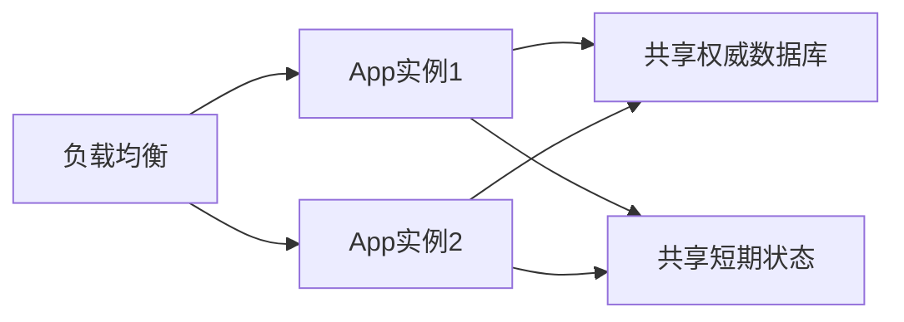

# 高可用、健康检查与故障恢复

> [!summary] 一句话解释
> **高可用不是“永远不坏”，而是通过冗余、故障检测、流量摘除、自动或人工切换、备份恢复和演练，把故障影响控制在可接受范围。**

## 生活类比

一家医院不会因为有备用发电机就认为永不故障。它还需要：

- 定期检查发电机；
- 自动发现停电；
- 切换电源；
- 保证燃料；
- 记录故障；
- 定期演练。

软件高可用也是同样的系统工程。

## HA

**HA（High Availability，高可用）**关注服务在一定时间内可正常使用的比例，以及发生故障后能否快速恢复。

常见手段：

- 多实例；
- 负载均衡；
- 主备或多副本；
- 自动重启；
- 故障转移；
- 超时、重试和熔断；
- 备份与恢复；
- 容量余量；
- 监控和告警。

## 单点故障

**SPOF（Single Point of Failure，单点故障）**是一个组件失败就让整个系统不可用的点。

例如应用有三台，但只有一台 PostgreSQL 且没有备份，数据库仍是单点。

消除一个单点可能产生新单点，例如所有服务依赖同一个 DNS、KMS、证书或机房。

## 无状态服务

**Stateless（无状态）**服务实例不把唯一权威数据只存在自己的内存或本地磁盘。



这样某个实例坏了，流量可以交给另一个实例。

## 三种健康检查

### Startup Probe

**Startup（启动探针）**回答：“应用是否已经完成启动？”

慢启动应用在成功之前不应该被 Liveness 反复杀死。

### Liveness Probe

**Liveness（存活探针）**回答：“进程是否已经陷入无法自行恢复的故障，需要重启？”

它不应该检查每个外部依赖。否则数据库短暂抖动可能导致所有应用同时重启，形成雪崩。

### Readiness Probe

**Readiness（就绪探针）**回答：“这个实例现在是否适合接收新流量？”

失败时通常把实例从负载均衡摘除，但不一定重启进程。

| 情况 | Liveness | Readiness |
|---|---|---|
| 进程死锁 | 失败，考虑重启 | 失败 |
| 正在启动和预热 | 不应过早失败 | 失败，不接流量 |
| 数据库短暂不可达 | 谨慎，不一定重启 | 可失败，暂停流量 |
| 应用完全正常 | 成功 | 成功 |

## 备份、复制和高可用的区别

### 复制

把数据同步到副本，便于故障切换。但误删除和勒索软件也可能被同步过去。

### 备份

保存历史副本，用于恢复误删、损坏或灾难。备份不能自动接管实时请求。

### 高可用

让服务在组件故障时尽快继续提供服务，通常结合复制和故障转移。

三者互补，不能互相替代。

## RTO 和 RPO

### RTO

**RTO（Recovery Time Objective，恢复时间目标）**：故障后最多允许多久恢复服务。

### RPO

**RPO（Recovery Point Objective，恢复点目标）**：最多允许丢失多长时间的数据。

例如：

```text
RTO = 30分钟
RPO = 5分钟
```

表示希望 30 分钟内恢复，最多丢失最近 5 分钟数据。

RTO/RPO 是业务目标，不是买了某个数据库就自动获得。

## Failover 和 Switchover

- **Failover（故障转移）**：主节点意外失败后切换到副本；
- **Switchover（计划切换）**：维护或升级时有计划切换。

切换要防止 Split Brain（脑裂）：两个节点都认为自己是主节点并接受写入。

## 重试、超时和熔断

### 超时

没有超时的网络调用可能永久占用连接和 Worker。

### 重试

只对可能恢复的错误进行有界重试，并使用退避和抖动。写操作需要 [[状态机与幂等性|幂等]]。

### 熔断

依赖持续失败时暂时停止大量请求，防止拖垮自身和下游，并在冷却后试探恢复。

## 容量余量

如果正常流量已经占满 100% CPU，坏掉一个实例后其他实例无法接管。高可用需要保留容量余量，并测试：

- 单实例故障；
- 一个可用区故障；
- 慢请求；
- 突发流量；
- 依赖降速；
- 连接池耗尽。

## 监控和 SLO

不仅要看“进程在线”，还要看：

- 成功率；
- P50/P95/P99 延迟；
- 吞吐；
- 饱和度；
- 队列长度；
- 数据库连接和复制延迟；
- Redis/S3/KMS 状态；
- 备份年龄和恢复演练结果。

## 故障演练

可靠性不能只靠文档声明，需要主动测试：

- 杀死进程；
- 断开网络；
- 数据库只读或锁住；
- Redis/S3/KMS 超时；
- 磁盘满；
- 证书过期；
- 备份恢复；
- 回滚旧版本；
- 24/72 小时长稳。

## Fail-closed 与高可用的关系

安全依赖失败时拒绝不安全降级是 [[Otto产品总体技术架构#Fail-closed|Fail-closed]]。它可能暂时降低可用性，因此需要通过冗余、缓存有效期和备用路由减少影响，而不是关闭安全检查。

## 常见误区

### 有两台服务器就是高可用

还要检查数据库、缓存、对象存储、DNS、证书、KMS 和部署控制面是否仍有单点。

### 自动重启能解决所有故障

错误配置、数据损坏和依赖故障可能让重启形成循环。

### 有副本就不需要备份

误删和逻辑错误会复制到副本。需要独立历史备份和恢复演练。

### 健康接口返回 200 就没问题

接口要真实反映当前能否启动、存活和接流量，而且三个问题不能混成一个。

## 在 Otto 中的作用

在 [[Otto产品总体技术架构]] 中：

- Otto Server 目标是无状态多实例；
- PostgreSQL 高可用由数据库平台或托管服务负责；
- Redis 管共享协调；
- S3/MinIO 管对象多副本；
- Control、Edge、Federation 需要独立实例和共享权威状态；
- 每个组件需要 Startup/Liveness/Readiness、日志、容量和回滚证据。

手册中的“未来高可用”是目标架构，不等于实际生产部署已经验收。

## 参考资料

- [Kubernetes：Liveness、Readiness 与 Startup Probes](https://kubernetes.io/docs/concepts/workloads/pods/probes/)
- [PostgreSQL：High Availability、Load Balancing 与 Replication](https://www.postgresql.org/docs/current/high-availability.html)
- [PostgreSQL：Continuous Archiving 与 PITR](https://www.postgresql.org/docs/current/continuous-archiving.html)
- 核对日期：2026-08-21。
