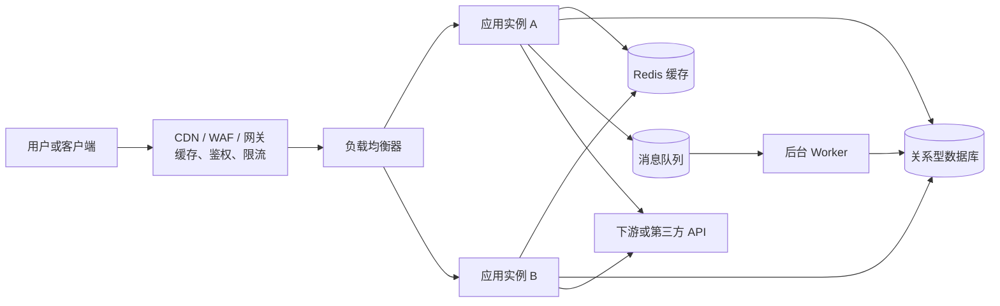
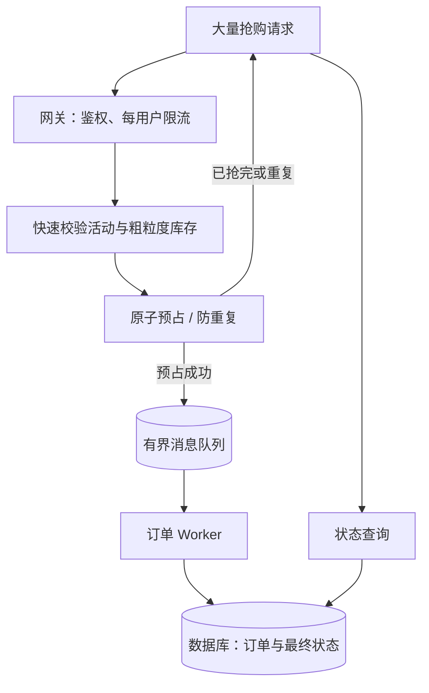

# 高并发系统：瓶颈分析、扩容与稳定性治理

> [!summary] 一句话结论
> **解决高并发不是盲目增加线程或服务器，而是先用指标和压测找出最先耗尽的资源，再从“减少单次请求的工作量、增加有效容量、平滑突发流量、保护稀缺资源、保证并发正确性”五个方向逐层治理。**

还要记住一条底线：

> **正常流量下要跑得快，超出容量后也要能够拒绝一部分请求、保住核心功能并迅速恢复，不能让整个系统一起崩溃。**

---

## 一、先理解“高并发”到底高在哪里

### 1. Concurrency：并发

**Concurrency（并发，读作“肯卡伦西”）**表示一段时间内有许多尚未结束的任务同时存在。

这些任务可能正在：

- 使用 CPU 计算；
- 等待数据库返回；
- 等待磁盘读写；
- 等待另一个网络服务；
- 排在线程池、连接池或消息队列中。

因此，“并发数”不是“这一秒收到多少请求”，而是“此刻有多少请求还没有完成”。

### 2. QPS、RPS、TPS 和吞吐量

- **QPS（Queries Per Second，每秒查询数）**：每秒处理多少次查询；
- **RPS（Requests Per Second，每秒请求数）**：每秒收到或完成多少个请求；
- **TPS（Transactions Per Second，每秒事务数）**：每秒完成多少个业务事务，例如订单；
- **Throughput（吞吐量）**：单位时间内系统完成的工作量，是更宽泛的说法；
- **Latency（延迟）**：一次请求从开始到结束花了多久；
- **Error Rate（错误率）**：请求中有多少比例失败；
- **Saturation（饱和度）**：CPU、线程池、连接池等资源已经繁忙到什么程度。

QPS 高不一定并发数高，并发数高也不一定 QPS 高。

例如：

- 系统每秒处理 1,000 个请求，每个平均用 0.2 秒，大约有 200 个请求同时在途；
- 仍是每秒 1,000 个请求，但每个平均用 2 秒，大约有 2,000 个请求同时在途。

可以用一个近似关系帮助理解：

```text
平均在途并发数 ≈ 每秒完成量 × 平均响应时间（秒）
```

这就是排队论中 **Little's Law（利特尔法则）**的一种直观应用。延迟变成原来的十倍，在相同流量下，在途请求也可能接近原来的十倍；它们又会占用更多内存、连接和线程，形成恶性循环。

### 3. 在线用户、连接数和活跃请求也不相同

以下三个数字不能混为一谈：

- 10 万名注册用户；
- 1 万条空闲 WebSocket 长连接；
- 1 万个同时执行复杂 SQL 的请求。

空闲连接主要占套接字和少量内存，复杂请求还会争抢 CPU、数据库连接、锁和磁盘 I/O，压力完全不同。

### 4. 不要只看平均延迟

假设 100 次请求中：

- 95 次为 50 毫秒；
- 4 次为 500 毫秒；
- 1 次为 10 秒。

平均数可能掩盖最慢用户的体验，因此常看：

- **P50**：50% 的请求不超过这个时间；
- **P95**：95% 的请求不超过这个时间；
- **P99**：99% 的请求不超过这个时间。

高并发时，P95、P99 突然上升往往比平均值更早暴露排队、锁竞争或下游变慢。

---

## 二、用餐厅理解高并发

把一个网站想成餐厅：

| 计算机系统 | 餐厅类比 |
|---|---|
| 用户请求 | 顾客点单 |
| 应用服务器 | 厨师和工作台 |
| 线程或协程 | 厨师正在处理的一张单 |
| 线程池 | 同时允许处理的订单数量 |
| 数据库 | 后厨总账本和仓库 |
| 数据库连接池 | 能够进入仓库取货的通行证 |
| 缓存 | 前台预先备好的常用餐品 |
| 消息队列 | 按顺序挂起来的订单票 |
| 限流 | 每分钟只接一定数量订单 |
| 背压 | 后厨通知前台暂时少接单 |
| 降级 | 爆满时暂停复杂定制菜，只卖核心套餐 |
| 熔断 | 发现仓库故障后暂时停止继续取货 |

如果仓库一次只能进入 20 人，前台增加到 500 名服务员没有意义。500 人会一起堵在仓库门口，还会消耗工资、空间和管理成本。

对应到软件系统：数据库连接池只有 20 个可用连接时，盲目把 Web 工作线程从 100 个加到 5,000 个，通常只会制造更长的等待队列、更多内存占用和上下文切换。

这就是高并发治理的第一原则：

> **系统的有效吞吐量由最先饱和的关键资源决定。**

---

## 三、高并发不是单独一种故障

大家口中的“高并发问题”可能是完全不同的问题：

1. 请求很多，CPU 用满；
2. CPU 不高，但大量线程都在等数据库；
3. 数据库查询很慢或连接池耗尽；
4. 多个请求争抢同一把锁或同一行数据；
5. Redis 热点 Key 或缓存失效压垮数据库；
6. 第三方 API 变慢，拖住自己的请求；
7. 消息进入速度大于 Worker 消费速度；
8. 网络带宽、文件句柄或端口等系统资源耗尽；
9. 重试不断放大流量，引发级联故障；
10. 两个并发请求都修改同一份数据，产生超卖或重复扣款。

所以“怎么解决高并发”没有一个固定按钮。应先回答：

> **哪一层在什么流量下先饱和？用户看到的是变慢、报错、数据错误，还是全部同时发生？**

---

## 四、一次请求会经过哪些层



每一层都有容量上限：

- 网关有连接数和带宽上限；
- 应用有 CPU、内存、线程池和文件句柄上限；
- Redis 有单节点吞吐、内存和热点 Key 上限；
- 数据库有连接、CPU、磁盘 IOPS、锁和查询吞吐上限；
- 消息队列有存储、生产和消费速率上限；
- 第三方 API 可能规定每分钟只能调用多少次。

只扩应用层，可能把原来每秒 1,000 次数据库访问放大到 10,000 次，反而更快压垮数据库。

---

## 五、正确顺序：先定义目标，再找瓶颈

### 第一步：明确“要扛多少”和“多快算合格”

至少需要定义：

- 日常流量和峰值流量是多少；
- 峰值会持续几秒、几分钟还是几小时；
- 读请求和写请求各占多少；
- P95、P99 延迟目标是多少；
- 可接受错误率是多少；
- 哪些功能必须保住，哪些可以临时关闭；
- 数据是否允许短暂不一致；
- 需要预留多少容量余量。

这类目标通常写进 **SLO（Service Level Objective，服务等级目标）**。没有目标，“系统能扛高并发”就无法验证。

### 第二步：先看四类信号

可以先用下面四类指标建立最小监控：

1. **Rate（速率）**：RPS、QPS、消息生产和消费速率；
2. **Errors（错误）**：HTTP 5xx、超时、数据库错误、任务失败；
3. **Duration（耗时）**：P50、P95、P99，总耗时及各下游耗时；
4. **Saturation（饱和）**：CPU、内存、队列长度、线程池和连接池使用率。

前三项常合称 **RED Method（速率、错误、耗时方法）**。但高并发排障时必须再看饱和度，因为“请求暂时没报错，但队列越来越长”已经是在积累故障。

### 第三步：按证据定位

| 现象 | 更可能的原因 | 应继续查看的证据 |
|---|---|---|
| CPU 长时间接近 100% | 计算太重、序列化、压缩、GC 或忙等 | CPU Profile、火焰图、GC 时间 |
| CPU 不高但请求很慢 | I/O 等待、连接池或锁等待 | Trace、线程状态、池等待时间 |
| 数据库连接池一直满 | 慢 SQL、长事务、连接泄漏或池太小 | 借用等待、活跃 SQL、事务时长 |
| 数据库 CPU/磁盘很高 | 缺索引、扫描过多、写放大 | `EXPLAIN`、慢查询、IOPS、命中率 |
| 少量接口拖慢全部接口 | 共用线程池或连接池导致相互挤占 | 各接口池占用、调用链、队列长度 |
| 错误后流量反而增加 | 客户端或多层服务同时重试 | 每层调用次数、重试次数、Trace |
| Redis 正常但数据库突然被打满 | 热点缓存同时过期或大量不存在的 Key | 缓存命中率、过期时间分布、回源量 |
| 消息堆积不断增加 | 生产速度超过消费能力 | 入队/出队速率、最老消息年龄 |
| 延迟周期性尖峰 | GC、定时任务、批处理或缓存集中失效 | 时间相关性、GC 暂停、定时任务日志 |
| 数据重复或库存变负 | 竞态条件、重复消息、非幂等写入 | 请求 ID、状态流转、唯一约束、审计日志 |

### 第四步：做受控压测

常见测试包括：

- **Load Test（负载测试）**：验证预期流量能否达到目标；
- **Stress Test（压力测试）**：继续加压，找到系统极限和失效方式；
- **Spike Test（突发测试）**：模拟流量在极短时间突然增长；
- **Soak Test（浸泡/耐久测试）**：长时间运行，发现内存泄漏、连接泄漏和缓慢堆积。

压测时要逐级加压并观察“拐点”：吞吐量不再增加，但延迟、错误和队列长度急剧上升的位置，就是接近饱和的位置。

> [!warning] 压测边界
> 不要未经授权直接对生产系统或第三方服务猛烈压测。压测本身可能造成真实故障或触发安全防护。

---

## 六、第一类办法：让每个请求少做一点工作

这是最值得优先做的优化。相同机器上，如果每个请求消耗的 CPU、数据库查询和网络调用减少一半，容量往往会明显提高。

### 1. 优化算法和热点代码

- 避免不必要的循环和重复计算；
- 避免重复解析、序列化同一份数据；
- 预先计算变化不频繁的结果；
- 用 CPU Profile 找真正消耗时间的函数，不凭感觉改代码。

### 2. 减少网络往返

假设一个页面需要 100 条数据：

- 逐条调用 100 次远程 API，网络往返成本很高；
- 一次批量查询或有限批次查询通常更高效。

但批量也不是越大越好。过大的响应会占用内存、带宽并增加单次延迟，所以应设上限和分页。

### 3. 解决 ORM 的 N+1 查询

**N+1 查询**是指先查 1 次列表，再为 N 条记录分别查询关联数据，共执行 N+1 次 SQL。

例如显示 100 个订单：

```text
1 次：查询 100 个订单
100 次：分别查询每个订单的用户
总计：101 次数据库查询
```

可以根据实际关系用联表查询、预加载或批量查询减少往返。可联系 [[ORM]] 理解。

### 4. 缩短临界区和事务

持有锁或数据库事务期间，不要做无关的慢操作，例如：

- 等待用户输入；
- 调用耗时的第三方 API；
- 上传大文件；
- 做长时间 CPU 计算。

锁持有越久，其他请求排队越久。

---

## 七、第二类办法：增加有效容量

### 1. Vertical Scaling：纵向扩容

**Vertical Scaling（纵向扩容）**就是给一台机器增加：

- 更多 CPU 核心；
- 更多内存；
- 更快磁盘；
- 更高网络带宽。

优点是简单，缺点是机器有上限，成本可能陡增，而且一台机器仍可能成为单点故障。

### 2. Horizontal Scaling：横向扩容

**Horizontal Scaling（横向扩容）**就是增加应用实例，并让负载均衡器把请求分散出去。

要做到这一点，应用最好接近 **Stateless（无状态）**：

- 不把用户会话只保存在某一个进程的内存里；
- 文件不只保存在某一台应用服务器的本地磁盘；
- 共享状态放在合适的数据库、缓存或对象存储中。

这样任意一个实例都能处理任意请求，也更容易滚动发布和故障切换。

### 3. 负载均衡并不等于无限容量

增加 10 个应用实例后：

- 应用 CPU 容量可能变成原来的 10 倍；
- 数据库仍可能只有一套；
- Redis 或第三方 API 仍有原来的上限。

所以扩容后必须重新压测完整链路，不能只看应用层。

### 4. 自动扩缩容有反应时间

以 Kubernetes 的 **HPA（Horizontal Pod Autoscaler，水平 Pod 自动扩缩器）**为例，它根据 CPU、内存或自定义指标周期性调整 Pod 数量。

但是自动扩容不是瞬移：

1. 指标先升高；
2. 监控采集到变化；
3. 控制器作出决定；
4. 新实例调度、下载镜像并启动；
5. 初始化完成、通过就绪检查后才能接流量。

如果突发流量在 1 秒内到来，新实例可能还没准备好。因此仍需要容量余量、限流、排队或提前扩容。

CPU 也不是唯一的扩容指标。对于消息消费者，队列长度和最老消息年龄有时更合适；对于 Web 服务，在途请求数或每实例 RPS 也可能更贴近真实压力。

---

## 八、线程、异步和并发模型怎么选

### 1. 多线程不是通用加速按钮

线程数太少，CPU 或 I/O 资源可能没有充分利用；线程数太多，又会带来：

- 线程栈内存开销；
- 上下文切换；
- 锁竞争；
- 更长的等待队列；
- 同时冲击数据库和下游。

线程池应当**有上限**，队列也应当**有上限**。

### 2. I/O 密集任务

**I/O-bound（I/O 密集）**任务的大部分时间在等网络、数据库或磁盘。

常见办法：

- 异步 I/O；
- Event Loop（事件循环）；
- 协程；
- Java 虚拟线程；
- 连接复用和合理超时。

这些方法主要减少“等待期间占用昂贵线程”的成本，并不会让数据库本身自动变快。

### 3. CPU 密集任务

**CPU-bound（CPU 密集）**任务的大部分时间在真正计算，例如视频编码、模型推理、压缩和大量密码学运算。

常见办法：

- 优化算法和实现；
- 使用与 CPU 核心数匹配的进程/线程并行；
- 增加 CPU 或专用硬件；
- 将大任务放入后台任务队列；
- 对同一输入复用计算结果。

创建十万个异步任务不会创造十万个 CPU 核心。关于语言层面的并发工具可看 [[Java为什么适合高并发]] 和 [[进程、线程、多进程与多线程]]。

---

## 九、缓存：把重复读取挡在数据库之前

### 1. 缓存解决什么问题

对于“读得多、变化少、允许短暂旧数据”的内容，可以把结果放到 Redis、应用内存或 CDN：

```text
请求 → 先查缓存
       ├─ 命中：直接返回
       └─ 未命中：查数据库 → 写入缓存 → 返回
```

这样可以降低数据库查询量和响应时间。详细概念见 [[Redis缓存与分布式协调]]。

### 2. 缓存不是事实来源的替代品

订单、余额、库存等关键数据通常仍要由数据库和业务约束保证正确。缓存可能：

- 过期；
- 丢失；
- 与数据库暂时不一致；
- 被淘汰；
- 整个节点故障。

### 3. 三种典型缓存风险

#### 缓存穿透

大量请求查询根本不存在的数据，每次都穿过缓存访问数据库。

常见措施：

- 参数校验；
- 对“不存在”结果做短时间负缓存；
- 必要时使用布隆过滤器；
- 对异常来源限流。

#### 缓存击穿或缓存惊群

一个极热门 Key 刚过期，大量请求同时发现未命中，并一起访问数据库。

常见措施：

- Request Coalescing / Singleflight（请求合并）：只允许一个请求回源，其余等待或复用结果；
- 短租约或互斥重建；
- 逻辑过期并在后台刷新；
- 热点内容提前刷新。

#### 缓存雪崩

大量 Key 在相近时间同时过期，或缓存集群整体不可用，数据库突然承受全部流量。

常见措施：

- 过期时间加入随机抖动；
- 分批预热；
- 缓存高可用；
- 数据库入口仍要限流和降级；
- 演练缓存整体失效时的系统行为。

---

## 十、数据库通常是最先需要保护的稀缺资源

### 1. 先优化查询，再谈分库分表

优先检查：

- 查询条件是否有合适索引；
- 是否扫描了远多于返回数量的数据；
- 是否取出了根本不用的列；
- 是否存在 N+1 查询；
- 是否能批量写入；
- 事务是否太长；
- 是否有行锁、表锁或热点行竞争；
- 查询计划是否符合预期。

数据库的 `EXPLAIN`、慢查询日志和锁等待信息比“猜一个索引”更可靠。

### 2. 使用连接池，但不要无限增加连接

建立数据库连接通常有成本，所以应用使用 **Connection Pool（连接池）**复用有限数量的连接。

连接池的作用不是让数据库同时执行无限查询，而是：

- 避免每次重新建立连接；
- 控制同时进入数据库的工作量；
- 让多余请求在应用侧有限等待或快速失败。

PostgreSQL 官方资料指出，`max_connections` 增大时会增加相应资源分配；连接过多、资源已经饱和后，更多活跃查询还会增加内存、上下文切换和竞争。池大小应通过真实负载测试调优，并预留运维连接。

### 3. 读写分离

读多写少时，可以让只读副本承担一部分查询：

- 主库负责写入；
- 副本复制主库数据并处理部分读取。

但副本可能有复制延迟。因此“刚写入立即读取”的业务不能盲目去读副本。

### 4. 分区和分片是后期手段

- **Partition（分区）**：在一个数据库逻辑表内按规则拆分数据；
- **Sharding（分片）**：把数据分散到不同数据库实例。

它们能扩大容量，但会增加跨分片查询、事务、迁移、路由和运维复杂度。应在索引、SQL、数据模型、缓存、读副本和归档仍不能满足目标，且证据表明数据库单节点确实成为瓶颈时再采用。

### 5. 避免热点行

例如所有订单都更新同一行“总订单数”，这行会成为串行化热点。可以考虑：

- 分桶计数后汇总；
- 异步统计；
- 使用数据库原子更新；
- 区分强一致核心数据和可延迟统计数据。

---

## 十一、消息队列：削峰和解耦，但不会创造处理能力

假设系统平时每秒能处理 1,000 个任务，活动瞬间收到每秒 5,000 个任务：

```text
入口每秒 5,000 个任务
        ↓
     消息队列暂存
        ↓
Worker 每秒稳定处理 1,000 个任务
```

消息队列把短时洪峰变成后台慢慢消化的积压，这叫 **Peak Shaving（削峰）**。

它适合：

- 发邮件、短信；
- 图片和视频处理；
- 报表生成；
- 搜索索引更新；
- 可以异步完成的订单后续步骤。

但如果入口永远每秒 5,000 个、消费者永远只能每秒 1,000 个，队列每天都会增加，最终仍会耗尽存储。必须监控：

- 入队速率；
- 出队速率；
- 积压数量；
- 最老消息年龄；
- 重试和死信数量。

消费者还必须处理重复投递，关键写操作要做 [[状态机与幂等性|幂等]]。Python/Celery 的具体例子可看 [[Celery分布式任务队列]]。

---

## 十二、限流、背压和负载丢弃：超载时主动保护系统

### 1. Rate Limiting：限流

**Rate Limiting（限流）**是在一定时间内只允许一定数量的请求进入。

常见维度：

- 每个用户；
- 每个 IP；
- 每个 API Key；
- 每个租户；
- 每个接口；
- 整个系统。

常见算法：

- 固定窗口；
- 滑动窗口；
- **Token Bucket（令牌桶）**：按固定速度产生令牌，有令牌才能通过，允许一定程度的突发；
- **Leaky Bucket（漏桶）**：像漏水一样按较稳定速度处理流量。

超过配额时，HTTP API 常返回 `429 Too Many Requests`，并可用 `Retry-After` 告诉客户端多久后再试。

### 2. Backpressure：背压

**Backpressure（背压）**是下游处理不过来时，把“请放慢速度”的信号向上游传递。

例如：

- 队列满后生产者暂停或失败；
- 流式消费者只在有能力时继续请求数据；
- 下游连接池满后，入口减少接收新请求；
- 客户端根据服务端响应降低并发。

没有背压，压力只会从一个队列转移到另一个队列，最后以内存耗尽或全面超时结束。

### 3. Load Shedding：负载丢弃

**Load Shedding（负载丢弃）**是在系统接近过载时，主动拒绝一部分工作，保住剩余请求和核心功能。

例如：

- 在途请求超过安全上限，立即返回 `503 Service Unavailable`；
- 优先保障付款，暂停推荐和复杂报表；
- 拒绝匿名高成本查询，保留已登录用户的核心操作；
- 关闭非必要图片处理和日志增强功能。

“让少部分请求明确失败”通常优于“让所有请求等待 30 秒后一起失败”。

### 4. 队列必须有边界

无限队列看起来可以“不丢请求”，实际可能导致：

1. 请求不断进入；
2. 处理速度跟不上；
3. 队列越来越长；
4. 内存越来越高；
5. 排队时间超过用户超时时间；
6. 即使处理完成，用户早已离开；
7. 进程最终因内存耗尽而崩溃。

因此线程池、连接池、消息队列和内存缓冲区都应有容量上限、超时和满载策略。

---

## 十三、超时、重试、熔断和隔离必须一起设计

### 1. Timeout：超时

每次远程调用都应该有超时，否则一个下游请求可能永久占用连接和线程。

最好使用 **Deadline（截止时间）**表达整条请求还剩多少时间。

例如入口只允许总共 2 秒：

```text
入口总预算：2 秒
认证：最多 200 ms
数据库：最多 500 ms
支付 API：最多 800 ms
保留返回和清理时间：500 ms
```

如果每层都独立等 2 秒，层层串联后总时间可能远超用户的 2 秒预算。

### 2. Retry：重试

重试只适合可能短暂恢复的故障，例如偶发网络抖动。以下情况通常不应立即重试：

- 参数错误；
- 没有权限；
- 明确的业务拒绝；
- 下游已经持续过载；
- 操作不幂等且无法判断第一次是否成功。

合理重试通常需要：

- 少量次数；
- 总时间预算；
- **Exponential Backoff（指数退避）**：等待时间逐次增加；
- **Jitter（随机抖动）**：让不同客户端不要在同一时刻再次冲击服务；
- 只在一层统一重试；
- 幂等键或其他去重机制。

概念公式：

```text
等待时间 = min(最大等待, 基础时间 × 2^重试次数) + 随机抖动
```

如果三个服务层各自最多尝试 3 次，一个入口请求在极端情况下可能放大成很多次下游调用。因此“重试提高可靠性”只在有预算、有退避、可幂等并且下游仍有恢复机会时成立。

### 3. Circuit Breaker：熔断器

**Circuit Breaker（熔断器）**类似家里的空气开关：发现某个下游持续失败时，暂时不再把新请求送过去，而是快速失败或返回替代结果。

常见状态：

- Closed：正常调用；
- Open：失败率过高，暂时拒绝调用；
- Half-Open：过一段时间放少量探测请求，成功后恢复。

熔断器不能修好下游，但能避免自己不断等待和重试，从而阻断级联故障。

### 4. Bulkhead：舱壁隔离

**Bulkhead（舱壁隔离）**来自轮船分舱：一个舱进水，不让整艘船沉没。

软件里可以让不同业务使用不同的：

- 线程池；
- 连接池；
- 队列；
- 并发上限；
- 机器实例。

例如“复杂报表”不能把所有线程都占满，导致“登录”和“付款”也无法处理。

---

## 十四、并发性能之外，还必须保证数据正确

高并发下不仅会变慢，还会出现多个操作交错执行的问题。

### 超卖例子

库存只剩 1 件，两个请求同时执行：

```text
请求 A 读取库存：1
请求 B 读取库存：1
请求 A 扣减并成功
请求 B 也扣减并成功
结果：卖出了 2 件
```

可能的保护方式包括：

- 数据库原子条件更新，例如“库存大于 0 才减 1”；
- 唯一约束；
- 乐观锁和版本号；
- 必要时的行锁；
- 正确的事务隔离；
- 状态机限制合法转换；
- 幂等键防止重复下单或重复扣款。

一个概念性的原子更新是：

```sql
UPDATE product
SET stock = stock - 1
WHERE id = 123 AND stock > 0;
```

然后检查真正更新了几行：

- 更新 1 行：抢到库存；
- 更新 0 行：库存不足。

不要只在应用内执行“先查询，再修改”，因为两次操作之间可能插入另一个并发请求。更完整的状态与去重设计见 [[状态机与幂等性]]。

---

## 十五、不同负载需要不同解法

| 负载类型          | 主要压力           | 常用方向                   |
| ------------- | -------------- | ---------------------- |
| 读多写少          | 数据库查询和网络流量     | CDN、缓存、合适索引、只读副本       |
| 写入很多          | 数据库日志、锁和磁盘     | 批量写、短事务、分区、异步处理、幂等     |
| CPU 密集        | CPU 核心         | 算法优化、有限并行、更多计算节点、专用硬件  |
| I/O 密集        | 等待网络/磁盘、连接数    | 异步 I/O、协程/虚拟线程、连接复用、超时 |
| 突发流量          | 短时间超过稳定容量      | 预扩容、队列削峰、缓存、限流、负载丢弃    |
| WebSocket 长连接 | 套接字、内存、心跳和消息扇出 | 事件驱动、连接分片、心跳治理、发送背压    |
| 热点抢购          | 热点 Key/行、瞬间写入  | 入口限流、库存原子预占、队列、幂等、状态机  |
| 依赖第三方 API     | 对方配额和延迟        | 本地并发上限、缓存、超时、退避重试、熔断   |

不存在一套方案同时最适合所有负载。

---

## 十六、一个抢购系统的简化治理示例

假设 10 秒内有 10 万人抢 1,000 件商品。

### 错误的直觉

让 10 万个请求全部直接访问数据库并执行：

```text
SELECT stock ...
UPDATE stock ...
INSERT order ...
```

结果可能是数据库连接池耗尽、热点行锁等待、超时后重复提交，甚至超卖。

### 更合理的分层思路



需要注意：

- 网关限制单个用户疯狂重复请求；
- 每位用户使用业务键防止重复抢购；
- 预占必须是原子操作，不能简单“先读后写”；
- 队列有容量上限，不能无限承诺接单；
- Worker 重复消费时不能重复建单；
- 数据库约束作为最后防线；
- 用户可以先收到“已受理”，再查询最终状态；
- 失败时需要明确补偿预占库存。

这不是唯一架构，但它展示了限流、原子性、队列、幂等和状态机如何配合。

---

## 十七、怎样估算需要多少应用实例

不要直接拿“CPU 核心数”猜。先在接近生产的环境中测出一个实例的**安全容量**。

假设：

- 在 P95 延迟和错误率仍满足目标时，一个实例安全处理 400 RPS；
- 预计峰值为 4,000 RPS；
- 希望只使用总容量的 70%，保留约 30% 余量。

概念估算：

```text
实例数 ≈ 峰值 RPS ÷ 单实例安全 RPS ÷ 目标利用率
       ≈ 4000 ÷ 400 ÷ 0.7
       ≈ 14.3
```

可从 15 个实例作为估算起点，再通过完整链路压测验证。

这个计算仍没有证明数据库能承受 4,000 RPS。还要逐层计算：

- 每个请求平均执行几条 SQL；
- 缓存命中率是多少；
- 每个请求调用几次下游；
- 写入速率和消息速率是多少；
- 一个实例会打开多少连接；
- 任何一个实例故障后是否仍有余量。

---

## 十八、事故发生时先怎么止血

如果系统已在高流量下崩溃，优先目标是恢复核心服务，而不是现场做复杂重构。

建议顺序：

1. 确认入口流量、错误率、延迟和最先饱和的组件；
2. 限制异常用户、高成本接口或非核心流量；
3. 暂停推荐、报表、图片处理等非核心功能；
4. 检查并制止无上限重试；
5. 保护数据库，限制新查询并终止明确异常的长任务；
6. 如果近期发布后才发生，按发布预案停止放量或回滚；
7. 有证据表明横向扩容有效且下游仍有余量时，再扩实例；
8. 持续观察恢复时是否出现“重试洪峰”；
9. 恢复后保留指标、Trace、日志和时间线，做根因分析；
10. 补压测、容量模型、告警和故障演练。

扩容不总是第一步。如果数据库已经过载，继续增加应用实例可能进一步加重数据库压力。

渐进发布和快速回滚可联系 [[金丝雀发布、灰度发布与渐进式交付]]；故障恢复框架见 [[高可用、健康检查与故障恢复]]。

---

## 十九、最常见的误区

### 误区 1：线程越多，并发能力越强

线程超过有效资源后，更多线程主要增加排队、内存和切换成本。

### 误区 2：队列无限大就不会丢请求

无限队列会把明确失败变成内存耗尽和所有请求超时。

### 误区 3：上 Redis 就解决高并发

缓存只适合一部分读取场景，还会引入一致性、热点 Key、雪崩和失效问题。

### 误区 4：增加数据库连接一定更快

数据库资源饱和后，更多活跃连接可能增加竞争，吞吐量反而下降。

### 误区 5：异步就一定更快

异步主要提高等待型任务的资源利用率，不能减少 CPU 计算量，也不能扩大下游容量。

### 误区 6：失败就立即重试

系统越忙，重试越可能放大流量。必须有限次、退避、抖动并保证幂等。

### 误区 7：服务平均延迟正常就没问题

平均值可能掩盖 P99 长尾、局部用户或某个关键接口的严重问题。

### 误区 8：用了微服务就能扛高并发

微服务增加了远程调用、超时、重试、数据一致性和运维复杂度。它是组织和架构选择，不是免费性能优化。

### 误区 9：一次压测通过就永远安全

数据规模、缓存状态、下游依赖、软件版本和流量形态都会变化。容量管理是持续工作。

---

## 二十、一份可直接使用的排查清单

### 先描述问题

- [ ] 峰值 RPS/QPS/TPS 是多少？
- [ ] 同时在途请求和连接数是多少？
- [ ] P50、P95、P99 延迟是多少？
- [ ] 错误是超时、拒绝、崩溃还是业务数据错误？
- [ ] 读写比例和请求大小如何？
- [ ] 问题持续多久，是否只在突发时发生？

### 查资源瓶颈

- [ ] CPU 是否饱和，时间花在哪个函数？
- [ ] 内存、GC、交换空间是否异常？
- [ ] 线程池活跃数、队列长度和拒绝数如何？
- [ ] 数据库连接池等待多久，是否有泄漏？
- [ ] 慢 SQL、查询计划、锁等待和热点行如何？
- [ ] Redis 命中率、热点 Key、延迟和内存如何？
- [ ] 下游 API 的延迟、错误和配额如何？
- [ ] 消息入队、出队和最老消息年龄如何？
- [ ] 网络带宽、文件句柄和套接字是否接近上限？

### 查稳定性保护

- [ ] 每个远程调用是否有合理超时？
- [ ] 重试是否有限、退避、带抖动并且幂等？
- [ ] 队列和池是否有明确上限？
- [ ] 是否按用户、租户和接口限流？
- [ ] 是否能负载丢弃和优先保障核心请求？
- [ ] 慢接口是否与核心接口做了资源隔离？
- [ ] 下游持续失败时是否熔断？
- [ ] 缓存整体失效时数据库是否还有保护？

### 查数据正确性

- [ ] 重复请求是否会重复扣款、建单或发货？
- [ ] 是否有唯一约束、版本号或原子条件更新？
- [ ] 消息重复和乱序是否有处理策略？
- [ ] 状态转换是否合法且可审计？
- [ ] 失败补偿是否可能再次执行？

### 上线前验证

- [ ] 做过负载、压力、突发和耐久测试吗？
- [ ] 测试数据量和缓存状态接近生产吗？
- [ ] 找到系统容量拐点和安全容量了吗？
- [ ] 预留故障和发布期间的容量余量了吗？
- [ ] 告警能在用户大面积受影响前触发吗？
- [ ] 限流、降级、熔断和回滚真的演练过吗？

---

## 二十一、初学者应该按什么顺序学习

1. 先理解 [[进程、线程、多进程与多线程]]；
2. 分清并发、并行、吞吐、延迟和 P99；
3. 学会 HTTP 请求、数据库连接和线程池的基本工作方式；
4. 学习 SQL、索引、事务和锁；
5. 理解 [[Redis缓存与分布式协调|缓存]] 和失效风险；
6. 理解消息队列、背压和 [[Celery分布式任务队列|Celery]]；
7. 学习超时、有限重试、限流、熔断和舱壁隔离；
8. 学习 [[状态机与幂等性|幂等]]、唯一约束和并发写正确性；
9. 学会使用指标、日志、Trace、Profile 和数据库执行计划；
10. 最后再研究自动扩容、读写分离、分片和更复杂的分布式架构。

不要一开始就背“微服务、分库分表、Kafka、Kubernetes”这些名词。先能用证据回答“瓶颈在哪”，后面的架构才有依据。

---

## 二十二、最终记忆框架

```text
高并发治理
│
├─ 看清负载：RPS、并发数、延迟、错误、流量形态
├─ 找到瓶颈：CPU、内存、锁、池、数据库、缓存、队列、下游
├─ 减少工作：算法、批量、索引、少查数据、减少网络往返
├─ 增加容量：纵向扩容、无状态实例、负载均衡、合理自动扩容
├─ 平滑流量：CDN、缓存、消息队列、预扩容
├─ 保护系统：有界池、限流、背压、负载丢弃、降级、隔离
├─ 阻止雪崩：超时、有限重试、指数退避、抖动、熔断
├─ 保证正确：原子操作、事务、唯一约束、状态机、幂等
└─ 持续验证：压测、容量余量、监控、告警、演练、复盘
```

最重要的不是记住某一种中间件，而是掌握这个判断顺序：

> **先量化目标 → 再定位瓶颈 → 优先减少工作 → 扩大有效容量 → 用有界队列和准入控制保护稀缺资源 → 用幂等和事务保证结果正确 → 用压测和故障演练验证。**

---

## 关联概念

- [[Java为什么适合高并发]]：Java 在线程、并发库、NIO、Netty 和虚拟线程方面提供了哪些工具。
- [[进程、线程、多进程与多线程]]：理解执行单元、资源共享、隔离和同步。
- [[Redis缓存与分布式协调]]：缓存、限流、分布式锁和热点数据治理。
- [[Celery分布式任务队列]]：后台任务、Broker、Worker、重试和背压。
- [[ORM]]：对象操作怎样变成 SQL，以及 N+1 查询从哪里产生。
- [[SQLite、SQLCipher与PostgreSQL]]：数据库类型、连接和部署边界。
- [[状态机与幂等性]]：重复请求、重复消息和合法状态转换。
- [[高可用、健康检查与故障恢复]]：冗余、超时、熔断、降级和故障恢复。
- [[金丝雀发布、灰度发布与渐进式交付]]：逐步放量如何降低性能回归风险。
- [[TCP、HTTP、HTTPS与WebSocket]]：请求和长连接在网络层如何工作。

## 参考资料

以下内容于 2026-08-29 核对，优先使用官方资料：

- [Google SRE Book：Addressing Cascading Failures](https://sre.google/sre-book/addressing-cascading-failures/)
- [Google SRE Book：Production Services Best Practices](https://sre.google/sre-book/service-best-practices/)
- [Google SRE Book：Reliable Product Launches](https://sre.google/sre-book/reliable-product-launches/)
- [Kubernetes 官方文档：Horizontal Pod Autoscaling](https://kubernetes.io/docs/concepts/workloads/autoscaling/horizontal-pod-autoscale/)
- [IETF RFC 6585：429 Too Many Requests](https://datatracker.ietf.org/doc/html/rfc6585)
- [AWS Builders' Library：Making retries safe with idempotent APIs](https://aws.amazon.com/builders-library/making-retries-safe-with-idempotent-APIs/)
- [AWS Well-Architected Framework：Control and limit retry calls](https://docs.aws.amazon.com/wellarchitected/latest/framework/rel_mitigate_interaction_failure_limit_retries.html)
- [PostgreSQL 官方文档：Connections and Authentication](https://www.postgresql.org/docs/current/runtime-config-connection.html)
- [PostgreSQL Wiki：Number Of Database Connections](https://wiki.postgresql.org/wiki/Number_Of_Database_Connections)
- [Redis 官方文档：Cache-aside 与 Stampede Protection 示例](https://redis.io/docs/latest/develop/use-cases/cache-aside/go/)
