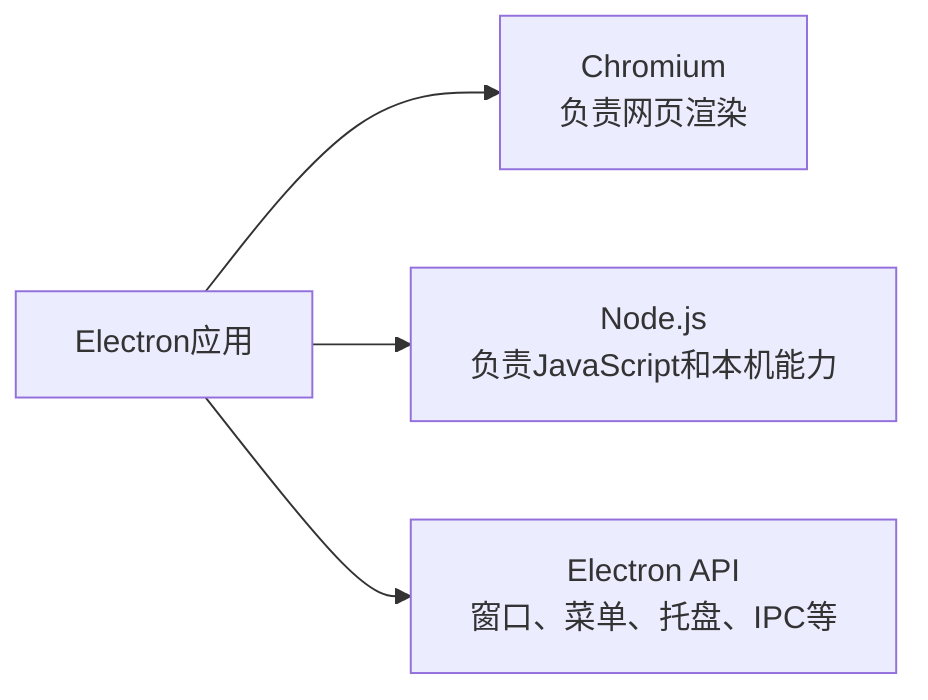
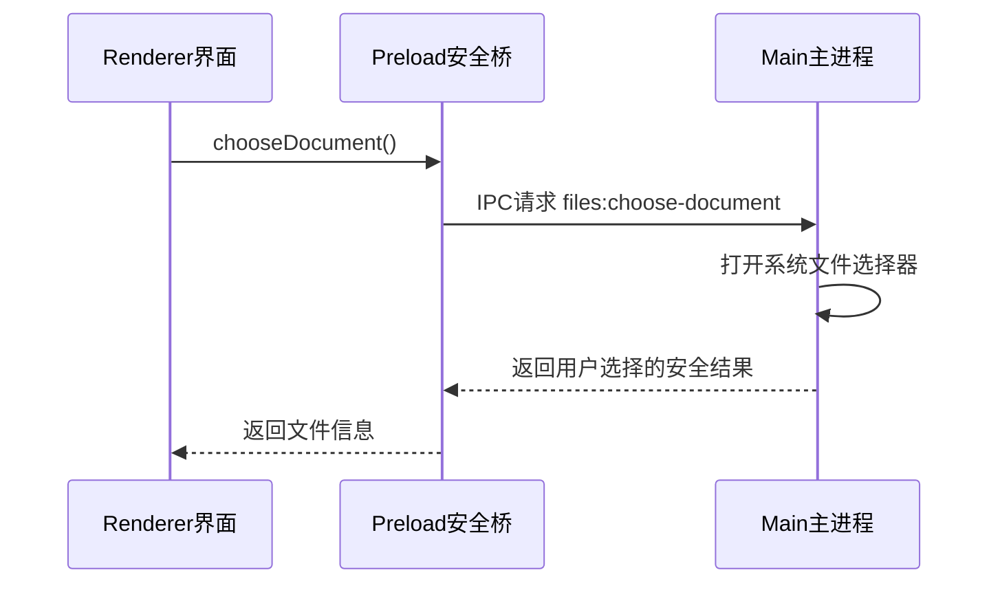

# Electron 桌面应用架构

> [!summary] 一句话解释
> **Electron（读作“伊莱克创”）是使用 HTML、CSS 和 JavaScript 开发 Windows、macOS、Linux 桌面应用的框架，它把 Chromium 浏览器内核和 Node.js 运行环境一起打包进应用。**

## 生活类比

可以把 Electron 应用想成一家银行：

- **Renderer（渲染进程）**是用户看到的营业大厅；
- **Preload（预加载脚本）**是有明确办事清单的柜台；
- **Main（主进程）**是能够接触文件、窗口和操作系统的后台；
- **IPC（Inter-Process Communication，进程间通信）**是柜台和后台之间的内部传单。

大厅不能直接打开金库。它只能通过柜台提出规定格式的请求，后台审核后执行。

## Electron 为什么存在

普通网页可以跨平台运行，但浏览器会限制网页直接访问：

- 任意本机文件；
- 系统菜单和托盘；
- 操作系统窗口；
- 本机进程和命令；
- 系统密钥库；
- 自动更新和桌面通知。

原生桌面开发可以使用这些能力，但 Windows、macOS 和 Linux 往往需要不同技术栈。Electron 让 Web 开发者复用 [[HTML]]、[[CSS]] 和 [[TypeScript与JavaScript|JavaScript/TypeScript]] 开发跨平台桌面界面。

## Electron 里面包含什么



因此 Electron 应用通常比普通网页更大，因为它经常随程序一起分发 Chromium 和 Node.js。

## 三层结构

### Main Process：主进程

每个 Electron 应用通常有一个主进程。它负责：

- 应用启动和退出；
- 创建与管理 `BrowserWindow`；
- 系统菜单、托盘和文件对话框；
- 调用 Node.js 和操作系统 API；
- 管理更新和高权限本机能力；
- 与渲染进程通信。

主进程像控制塔。长时间阻塞主进程可能导致整个应用卡顿，因此耗时任务应该异步执行，或放到 Worker/Utility Process。

### Renderer Process：渲染进程

每个窗口的网页通常在独立渲染进程中运行。它负责：

- HTML 页面结构；
- CSS 样式；
- React/Vue 等界面；
- 用户输入和界面状态；
- 把数据画到屏幕。

渲染进程的思维方式更接近普通浏览器页面。安全配置下，它不应该直接拥有完整 Node.js 权限。

### Preload Script：预加载脚本

Preload 在页面加载前执行，可以访问部分 Node.js/Electron 能力，并通过 `contextBridge` 向界面暴露非常小的安全 API。

例如，不直接把整个文件系统交给页面，而只暴露：

```js
contextBridge.exposeInMainWorld('files', {
  chooseDocument: () => ipcRenderer.invoke('files:choose-document')
})
```

渲染层只能调用 `chooseDocument()`，不能任意读取整块磁盘。

## IPC 是什么

**IPC（Inter-Process Communication，进程间通信）**让主进程和渲染进程交换消息。



IPC 不是天然安全的。主进程仍要验证：

- 调用来自哪个窗口；
- 参数类型和长度；
- 路径是否越界；
- 当前用户是否授权；
- 返回结果是否包含敏感信息。

## `contextIsolation` 和 Sandbox

### Context Isolation

**Context Isolation（上下文隔离）**让 Preload 的高权限环境与网页 JavaScript 的普通环境分开，防止页面脚本直接篡改预加载变量。

### Sandbox

启用 Renderer Sandbox 后，渲染进程获得的 Node.js 能力更少。它能降低页面漏洞扩大成系统权限漏洞的风险，但不能代替安全的 IPC 设计。

## Electron 和 WebView 的区别

| Electron | [[WebView]] |
|---|---|
| 用 Web 技术构建完整桌面应用 | 在现有 App 中嵌入网页区域 |
| 自带或依赖 Chromium 与 Node.js | 通常使用系统或应用提供的网页引擎 |
| 主进程可以使用本机能力 | WebView 页面通常受宿主桥接接口限制 |
| 负责整个应用生命周期 | 只是应用中的一个显示组件 |

## Electron 的优点

- Web 开发者容易上手；
- 一套代码可覆盖多个桌面平台；
- NPM 和前端生态丰富；
- 适合复杂桌面 UI；
- 可以同时调用浏览器与 Node.js 能力。

## Electron 的缺点

- 安装包和内存占用通常较大；
- Chromium、Node.js 和 Electron 都需要及时更新；
- 高权限能力与网页界面结合会扩大安全风险；
- 不当 IPC、关闭上下文隔离或加载不可信远程页面可能导致严重漏洞；
- 平台签名、自动更新和原生模块打包仍有跨平台差异。

## 常见误区

### Electron 就是浏览器网页

界面确实使用网页技术，但 Electron 还包含主进程、Node.js 和桌面 API。

### Renderer 可以直接拥有所有 Node 权限

技术上可以配置，但这会显著扩大风险。更稳妥的做法是通过 Preload 暴露最小 API。

### 有多进程就绝对安全

多进程只是隔离基础。参数验证、权限、路径检查、更新和代码签名仍然必须存在。

### Electron 一定很慢

它的资源占用通常高于小型原生应用，但是否“慢”取决于主进程是否阻塞、渲染逻辑、内存管理和业务规模。

## 在 Otto 中的作用

在 [[Otto产品总体技术架构]] 中：

- Main 管窗口、本机工具、系统安全存储和更新；
- Preload 只暴露允许的桥接 API；
- Renderer 展示聊天、企业身份、设置和任务状态；
- Core 与本机高权限操作不直接交给普通页面。

这种分层体现了“界面不直接拿总钥匙”的原则。

## 学习建议

1. 先学 [[HTML]]、[[CSS]] 和 [[TypeScript与JavaScript]]。
2. 理解浏览器 [[渲染逻辑]]。
3. 理解进程、IPC 和权限边界。
4. 再尝试创建只有一个窗口的 Electron 小应用。
5. 最后学习打包、代码签名和自动更新。

## 参考资料

- [Electron 官方介绍](https://www.electronjs.org/docs/latest)
- [Electron 官方进程模型](https://www.electronjs.org/docs/latest/tutorial/process-model)
- [Electron 官方安全建议](https://www.electronjs.org/docs/latest/tutorial/security)
- 核对日期：2026-08-21。
