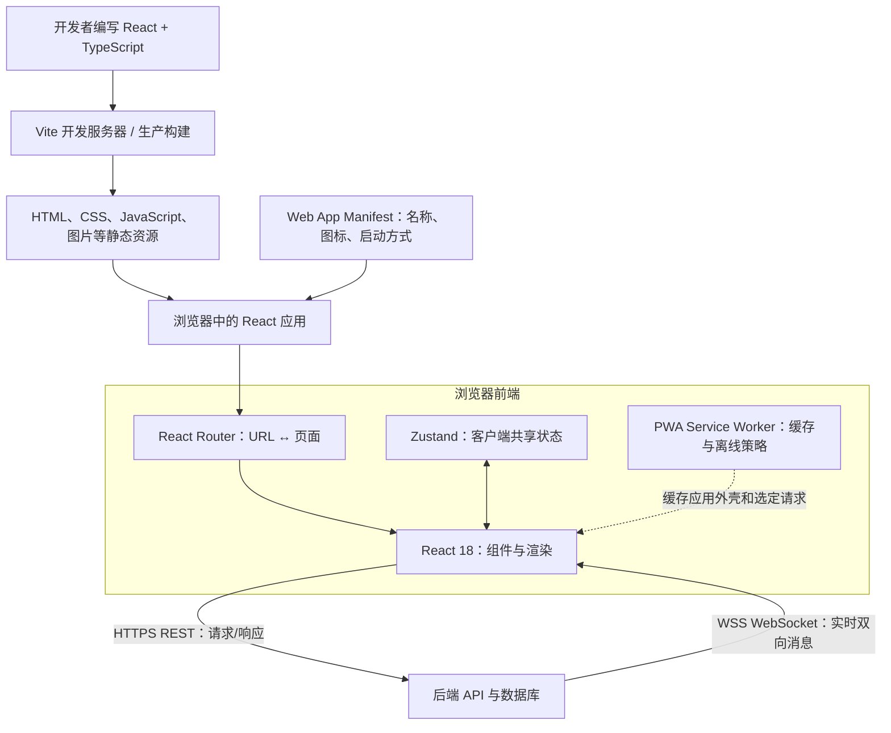
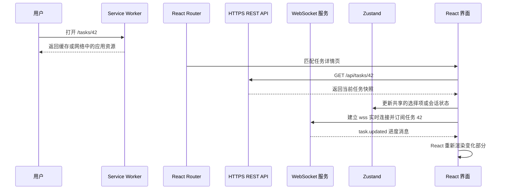

# React 前端技术栈：Vite、Router、Zustand 与 PWA

> [!summary] 一句话解释
> 这是一套典型的现代 Web 前端技术栈：**React 18 负责组件界面，TypeScript 负责类型检查，Vite 负责开发与构建，React Router 负责 URL 和页面的对应关系，Zustand 负责跨组件共享状态，HTTPS REST 与 WebSocket 负责连接后端，PWA 让网站具备可安装、缓存和部分离线能力。**

这七项不是互相替代的七个框架，而是分别解决不同问题。把它们放在一起，才能形成一个较完整的前端应用。

---

## 一、先看七项技术分别站在哪里

| 技术 | 类型 | 主要负责什么 | 通常在什么时候工作 | 不负责什么 |
|---|---|---|---|---|
| React 18 | UI（User Interface，用户界面）库 | 组件、状态驱动渲染、事件和界面更新 | 浏览器运行时 | 不自带完整路由、数据库和后端 |
| TypeScript | JavaScript 的类型层和开发语言 | 在运行前检查变量、函数和数据结构是否匹配 | 编写、检查和构建阶段 | 类型不会自动检查真实的网络数据 |
| Vite | 前端开发服务器与构建工具 | 启动开发环境、处理模块、HMR、生产构建 | 主要在开发和构建阶段 | 不是业务后端，也不是完整类型检查器 |
| React Router | React 路由库 | 根据 URL 选择页面，完成跳转、嵌套路由和参数读取 | 浏览器运行时，也可参与框架式服务端流程 | 不保存业务数据，也不代替权限校验 |
| Zustand | 状态管理库 | 保存多个组件都要使用的客户端共享状态 | 浏览器运行时 | 不是数据库，也不天然等于服务端数据缓存 |
| HTTPS REST | 请求—响应式通信 | 查询、创建、修改和删除服务端资源 | 浏览器与后端通信时 | 不适合服务器频繁、主动地连续推送 |
| WebSocket | 长连接双向通信 | 实时消息、进度、协作、状态推送 | 浏览器与后端建立长连接后 | 不自动处理鉴权、断线恢复和消息落库 |
| PWA | Web 应用能力与交付方式 | 安装图标、独立窗口、资源缓存、部分离线与后台能力 | 浏览器、Service Worker 和操作系统协作时 | 不会自动把网站变成完全等价的原生 App |

注意：表中实际有八行，是因为用户写的“HTTPS REST + WebSocket”包含了两种不同通信方式。

### 最短记忆法

```text
React       = 画界面
TypeScript  = 检查代码中的类型约定
Vite        = 开发和打包项目
Router      = URL 应该显示哪个页面
Zustand     = 多个组件共享什么状态
REST        = 主动请求服务器办一件事
WebSocket   = 与服务器保持实时双向通道
PWA         = 让网站更像可安装的应用
```

---

## 二、生活类比：把它们想成一家实时物流公司的前台

假设要开发一个“物流任务看板”：

- **React** 是搭建窗口、表格、按钮和弹窗的装修队；
- **TypeScript** 是施工图纸上的尺寸和接口规范，提前发现“方插头接圆插座”一类问题；
- **Vite** 是施工现场的工具间，负责快速启动、发现改动并制作正式交付物；
- **React Router** 是商场导览和门牌系统，例如 `/orders/123` 对应订单 123 的详情页；
- **Zustand** 是前台所有窗口都能看到的内部白板，例如当前用户、侧边栏状态和已选择仓库；
- **REST API** 像柜台按单办事：查询订单、创建订单、取消订单；
- **WebSocket** 像持续开着的对讲机：车辆位置或任务进度一变化，后台马上通知前台；
- **PWA** 像把这个网页前台安装到桌面，并准备一份断网时还能打开的基础资料。

关键区别是：**施工工具 Vite 不会随成品一起在顾客电脑上持续工作；React、Router、Zustand 的一部分代码则会被构建成 JavaScript，交给浏览器运行。**

---

## 三、完整关系图



这里要区分两种“服务器”：“Vite 开发服务器”方便开发者本地调试；“业务后端服务器”负责账号、权限、业务逻辑和数据库。二者不是一回事。

---

## 四、React 18：用组件和状态描述界面

**React** 是构建 UI 的 JavaScript 库。更完整的组件、Props、State、Hooks、Render 和 Commit 说明见 [[React组件化前端开发]]。

### React 18 特别表示什么

“React 18”指 React 的第 18 个主版本，不是另一种语言。这个版本的重要变化包括：

- 使用新的 Root API，例如 `createRoot`；
- 更多更新场景可以进行 Automatic Batching（自动批处理），把多次状态更新合并，减少不必要的渲染；
- 引入 `startTransition`、`useTransition` 和 `useDeferredValue` 等并发相关能力；
- 为 Suspense 与流式服务端渲染等能力提供基础。

一个简化入口：

```tsx
import { StrictMode } from 'react'
import { createRoot } from 'react-dom/client'
import { App } from './App'

createRoot(document.getElementById('root')!).render(
  <StrictMode>
    <App />
  </StrictMode>,
)
```

逐行理解：

1. `createRoot` 告诉 React 接管页面中的 `root` 容器；
2. `<App />` 是应用根组件；
3. `StrictMode` 帮助开发阶段发现不安全的副作用，某些逻辑在开发环境中可能被额外执行，以暴露问题；
4. `!` 是 TypeScript 的非空断言，只影响类型检查，不会在运行时替你确认元素一定存在。

### 不要误解“并发 React”

它不等于“React 自动把所有 JavaScript 放到多个 CPU 核并行执行”。React 18 的 Concurrent Renderer（并发渲染器）重点是让渲染工作能够被暂停、继续或放弃，从而优先响应更紧急的更新。

---

## 五、TypeScript：先检查约定，浏览器仍主要运行 JavaScript

**TS** 是 **TypeScript（类型脚本语言，通常读作 Type-Script）** 的简称。它在 JavaScript 上增加静态类型系统，详细介绍见 [[TypeScript与JavaScript]]。

```ts
type Task = {
  id: string
  title: string
  status: 'pending' | 'running' | 'done'
}

function showTask(task: Task) {
  return `${task.title}: ${task.status}`
}
```

这个类型告诉编辑器和检查器：

- `id`、`title` 必须是字符串；
- `status` 只能是三个指定值之一；
- 把数字当作 `Task` 传入时，应在开发阶段报错。

### 最重要的边界：类型会被擦除

TypeScript 类型通常不会留在最终 JavaScript 里。因此下面的声明：

```ts
const task = (await response.json()) as Task
```

主要是在告诉 TypeScript“请相信我是 `Task`”，并没有真的检查服务器返回的数据。对不可信的 API 响应，仍应使用手写判断或 Zod、Valibot 等 Runtime Validation（运行时校验）方案。

---

## 六、Vite：开发时快，发布前负责构建

**Vite** 官方读音是 `/viːt/`，接近英文 “veet”，名称来自法语“快速”。它是前端开发与构建工具。

### 开发阶段

```text
pnpm dev
→ Node.js 启动 Vite 开发服务器
→ 浏览器按需加载源模块
→ 修改文件后通过 HMR 快速更新页面
```

**HMR** 是 **Hot Module Replacement（热模块替换，读作 H-M-R）**。详细原理见 [[Webpack与HMR]]。

Vite 开发时利用浏览器原生 ESM（ECMAScript Modules，ECMAScript 模块）按需提供模块，因此通常不必在启动前先把整个大型应用完整打包。

### 生产阶段

```text
pnpm build
→ Vite 分析依赖
→ 转换、拆分和优化代码
→ 输出 dist 等可部署静态资源
```

Vite 具体使用的底层构建器会随大版本演进；阅读旧教程时可能看到 Rollup，当前官方文档可能介绍 Rolldown。学习重点应先放在“开发服务器、模块、HMR、生产构建”这些稳定概念上。

### Vite 处理 TypeScript，但默认不完整检查类型

Vite 可以快速把 `.ts`、`.tsx` 转成浏览器可执行的 JavaScript，但官方明确说明：它默认只做 Transpilation（转译），不负责完整的 Type Checking（类型检查）。常见项目会单独运行：

```text
pnpm exec tsc --noEmit
```

或在 `package.json` 中配置：

```json
{
  "scripts": {
    "dev": "vite",
    "typecheck": "tsc --noEmit",
    "build": "tsc --noEmit && vite build"
  }
}
```

这三个命令分别是开发、只检查类型、检查通过后生产构建。

### Vite 与 Webpack 的关系

二者都能承担前端工程化职责，但开发机制和生态选择不同：

| 方面 | Vite | Webpack |
|---|---|---|
| 角色 | 开发服务器 + 构建工具 | 静态模块打包器及完整构建生态 |
| 开发启动思路 | 以原生 ESM 按需提供源码模块 | 经典方案通常先建立并打包依赖图 |
| 热更新 | 内置开发体验 | webpack-dev-server + HMR 运行时 |
| 配置体验 | 新项目通常较简洁 | 对复杂老项目和深度定制很成熟 |

不是“Vite 永远比 Webpack 好”，而是项目目标、旧系统兼容、插件生态和团队经验不同。

---

## 七、React Router：让 URL 对应正确页面

**Router（路由器）**在前端里的核心任务是：看当前 URL，决定渲染哪些组件；用户点击链接时更新 URL 和界面。

```tsx
import { BrowserRouter, Link, Route, Routes } from 'react-router-dom'

export function App() {
  return (
    <BrowserRouter>
      <nav>
        <Link to="/tasks">任务列表</Link>
      </nav>

      <Routes>
        <Route path="/" element={<HomePage />} />
        <Route path="/tasks" element={<TaskListPage />} />
        <Route path="/tasks/:taskId" element={<TaskDetailPage />} />
      </Routes>
    </BrowserRouter>
  )
}
```

- `/` 显示首页；
- `/tasks` 显示任务列表；
- `/tasks/:taskId` 中的 `:taskId` 是动态参数，例如 `/tasks/42`；
- `<Link>` 做应用内导航，通常避免每次都让浏览器完整加载页面。

React Router 不同大版本的 API 会变化，当前官方还区分 Declarative、Data 和 Framework 三种使用模式。看到教程时先确认项目 `package.json` 中安装的是哪个版本，不要直接混用不同版本写法。

### 一个常见部署坑：刷新子页面出现 404

在客户端单页应用中，浏览器直接访问：

```text
https://example.com/tasks/42
```

服务器可能误以为它要找磁盘上的 `/tasks/42` 文件。服务器需要配置 History Fallback：对于前端页面路由返回 `index.html`，再由 React Router 接管；但 `/api/...`、静态资源和真正不存在的文件不能被无条件改写。

路由也不是安全权限系统。隐藏一个管理页面链接，只是隐藏界面入口；后端 API 仍必须独立验证用户身份和权限。

---

## 八、Zustand：轻量的客户端共享状态容器

**Zustand** 的名称来自德语“状态”。它是常与 React 配合使用的轻量状态管理库，使用 Hook 风格 API。

```ts
import { create } from 'zustand'

type AppStore = {
  selectedTaskId: string | null
  selectTask: (id: string) => void
}

export const useAppStore = create<AppStore>()((set) => ({
  selectedTaskId: null,
  selectTask: (id) => set({ selectedTaskId: id }),
}))
```

组件只订阅自己需要的字段：

```tsx
const selectedTaskId = useAppStore((state) => state.selectedTaskId)
const selectTask = useAppStore((state) => state.selectTask)
```

这种 `(state) => state.selectedTaskId` 叫 Selector（选择器）。该字段变化时，订阅它的组件才需要重新渲染；这比不加区分地订阅整个大 Store 更容易控制更新范围。

### 什么状态应该放在哪里

| 状态种类 | 更适合放在哪里 | 例子 |
|---|---|---|
| 只属于一个组件的临时状态 | React `useState` | 输入框是否展开 |
| 应该被复制、收藏、前进后退的状态 | URL / React Router | 当前页码、搜索词、任务 ID |
| 多个远距离组件共享的客户端状态 | Zustand | 当前用户摘要、主题、侧栏、选择项 |
| 以服务器为权威来源的数据 | API 数据层或专门的服务器状态缓存 | 订单、任务、权限列表 |
| 需要离线长期保存的大量数据 | IndexedDB 等浏览器存储 | 离线草稿、同步队列 |

Zustand 能保存任何 JavaScript 数据，不代表所有数据都应该塞进去。尤其不要把 Store 当作数据库，也不要因为使用了 `persist` 中间件就随意长期保存访问令牌或敏感资料。

---

## 九、HTTPS REST：适合明确的请求与响应

**HTTPS** 是 **Hypertext Transfer Protocol Secure（安全超文本传输协议，通常读作 H-T-T-P-S）**，本质上是受 TLS 保护的 HTTP。详见 [[TCP、HTTP、HTTPS与WebSocket]] 与 [[TLS与数字证书]]。

**REST** 是 **Representational State Transfer（表述性状态转移，通常直接读作 rest）**。它是一种设计网络接口的架构风格，不是一种与 HTTP 平级的新传输协议。

典型资源接口：

| 目的 | HTTP 请求示例 | 含义 |
|---|---|---|
| 查询任务列表 | `GET /api/tasks` | 获取资源表示 |
| 创建任务 | `POST /api/tasks` | 提交数据，让服务器创建或处理 |
| 修改任务 | `PATCH /api/tasks/42` | 修改资源的一部分 |
| 删除任务 | `DELETE /api/tasks/42` | 请求删除资源 |

JSON 很常见，但 REST 不等于 JSON；HTTP 也可以传输表单、文件、文本和其他媒体类型。

### HTTPS 保护什么，不保护什么

HTTPS 通常保护传输过程中的机密性和完整性，并验证目标服务器证书。但它不会自动保证：

- 登录用户有权访问某条数据；
- 前端没有 XSS 等漏洞；
- 服务器自身没有泄露数据；
- API 返回内容一定符合 TypeScript 类型；
- 业务请求不会被重复提交。

鉴权、授权、输入校验和 [[状态机与幂等性|幂等性]] 仍要单独设计。

---

## 十、WebSocket：适合持续实时双向消息

**WebSocket** 是一种在客户端和服务器之间建立长期、全双工消息通道的协议。生产环境通常使用 `wss://`，即由 TLS 保护的 WebSocket。

适合它的场景包括：

- AI 任务或文件处理的实时进度；
- 即时聊天；
- 多人协作编辑；
- 设备状态和实时监控；
- 高频变化的行情或看板。

### 为什么常把 REST 与 WebSocket 一起用

```text
REST：取得一份当前完整快照、执行明确的增删改查
WebSocket：在快照之后持续接收增量变化
```

例如打开任务 42：

1. `GET /api/tasks/42` 获得权威的当前状态；
2. 建立 `wss://example.com/realtime`；
3. 收到 `task.updated` 消息后更新界面；
4. 如果网络断开，指数退避后重连；
5. 重连成功后重新请求快照，或带上最后消息序号恢复缺失事件。

### WebSocket 工程上还必须补什么

- Authentication（身份认证）和 Authorization（权限验证）；
- 心跳与超时，发现“看似连接、其实已断”的情况；
- 断线重连与退避，避免所有客户端同时猛烈重连；
- 消息 ID、版本号或序号，处理重复、乱序和丢失；
- 限流和 Backpressure（背压），防止生产速度超过消费速度；
- 多实例部署时的连接路由、消息广播和扩容方案；
- 重新同步机制，不能只相信内存里收到的最后一条消息。

WebSocket 是通信通道，不是数据库。消息是否持久化、用户离线后是否补发，都要由业务系统另行实现。

---

## 十一、PWA：把 Web 应用逐步增强得更像 App

**PWA** 是 **Progressive Web App（渐进式 Web 应用，读作 P-W-A）**。它仍以 Web 技术运行，但可在支持的平台上获得安装、独立窗口、缓存、离线和部分后台能力。

“Progressive（渐进式）”强调：

- 支持能力较少的浏览器仍可以把它当普通网站使用；
- 支持更多能力的浏览器可提供安装、离线等增强体验；
- 不应把核心功能完全建立在某个平台独有的能力上。

### PWA 的两个核心部件

#### 1. Web App Manifest（Web 应用清单）

一个 JSON 文件，用来描述：

- 应用名称与简称；
- 图标；
- 启动 URL；
- 显示模式，例如独立窗口；
- 主题色和背景色。

它让浏览器和操作系统知道“安装后叫什么、用什么图标、从哪里启动”。

#### 2. Service Worker（服务工作线程）

Service Worker 是浏览器在网页之外管理网络请求、缓存和部分后台事件的脚本。常见作用：

- 预缓存应用外壳，例如 HTML、CSS、JavaScript 和图标；
- 断网时返回离线页面或缓存内容；
- 根据资源类型选择 Cache First、Network First 等策略；
- 在新版本到达时管理缓存升级。

注意：Manifest 是可安装性的核心；Service Worker 常用于离线体验，但“安装”和“离线”不是完全相同的概念。

### PWA 为什么通常要求 HTTPS

Service Worker 能拦截请求并返回内容，权限很强。如果传输链路可被篡改，攻击者可能植入长期驻留的恶意脚本。因此 PWA 的可安装部署通常要求 HTTPS；本地开发的 `localhost` 或 `127.0.0.1` 是常见例外。

### PWA 不会自动完成离线业务

缓存了页面外壳，只能保证“界面可能打开”，不等于业务数据完整可用：

- 断网时 WebSocket 无法连接；
- 新数据无法从服务器读取；
- 离线修改需要本地队列、冲突解决和重试；
- 重试写请求时需要幂等键，避免重复创建；
- Service Worker 更新不当可能让用户长期使用旧资源。

浏览器与操作系统对安装、推送和后台能力的支持也不同，发布前必须在目标平台实际测试。

---

## 十二、一次真实运行流程

用户打开一个已安装的任务管理 PWA：



Vite 没有出现在这段用户运行流程中，因为生产环境一般只部署它构建出的静态资源，而不是让每个用户连接开发服务器。

---

## 十三、建议的项目目录边界

```text
src/
├─ app/
│  ├─ App.tsx              应用根组件
│  └─ router.tsx           路由配置
├─ features/
│  └─ tasks/               按业务功能组织组件和逻辑
├─ stores/
│  └─ app-store.ts         Zustand 客户端共享状态
├─ api/
│  └─ http.ts              REST 请求、错误转换、鉴权入口
├─ realtime/
│  └─ socket.ts            WebSocket 连接、重连和消息分发
├─ components/             可复用通用组件
├─ pwa/
│  └─ service-worker.ts    缓存与离线策略（实际位置依工具而定）
└─ main.tsx                React 入口
```

这不是唯一正确目录，而是在提醒团队把职责分开：组件不要到处自己创建 WebSocket；REST 错误处理不要复制到每个按钮；Store 也不要变成一个无边界的大杂物箱。

---

## 十四、这套技术栈还没有包含什么

列出这些技术，不等于完整产品已经拥有以下能力：

- 后端语言与框架；
- 数据库、缓存与对象存储；
- 用户登录、令牌刷新和权限模型；
- API 数据运行时校验；
- 服务端数据缓存与请求去重方案；
- 表单、UI 组件库和国际化；
- 单元测试、组件测试和端到端测试；
- 日志、错误监控、性能监控和埋点；
- CI/CD（持续集成与持续交付）；
- WebSocket 多实例扩容、消息中间件和离线消息；
- PWA 离线数据同步与冲突解决。

所以看到一张“技术栈清单”时，应继续问：**每个技术解决哪一层问题，没写出来的层由谁负责？**

---

## 十五、最常见的误区

### 误区 1：React 18 是一个完整 Web 框架

React 核心主要处理组件和界面。路由、数据获取、构建、后端和部署需要其他工具或更完整框架。

### 误区 2：用了 TypeScript，API 数据就一定安全

TypeScript 类型在运行时会被擦除。来自网络的数据仍需运行时校验。

### 误区 3：Vite 能处理 TS，所以不需要 `tsc`

Vite 默认主要做快速转译。项目仍应单独执行类型检查。

### 误区 4：前端路由控制了页面，就控制了权限

前端路由只能改善界面体验。真正的资源权限必须由后端验证。

### 误区 5：所有共享数据都放 Zustand

组件局部状态、URL 状态、服务端权威数据和离线数据库各有更合适的位置。

### 误区 6：WebSocket 可以替代所有 REST 接口

实时连接状态复杂，普通查询和写操作使用 HTTPS API 通常更清晰。两者组合比全盘替代更常见。

### 误区 7：加了 Manifest 就有完整离线能力

Manifest 主要描述安装和外观；离线要设计 Service Worker 缓存、数据存储、重试和冲突处理。

### 误区 8：PWA 与原生 App 完全相同

PWA 仍受浏览器安全模型和平台能力支持范围限制。摄像头、文件、后台运行、通知和应用商店分发在不同平台可能表现不同。

---

## 十六、初学者建议学习顺序

1. 先掌握 [[HTML]]、[[CSS]] 和 JavaScript 基础；
2. 学 TypeScript 的对象、函数、联合类型和类型收窄；
3. 用 Vite 建一个 React 18 小项目，理解 `src`、`public`、`package.json` 和 `dist`；
4. 学 React 的组件、Props、State、事件和 Effect；
5. 加 React Router，制作列表页与详情页；
6. 先用 `useState`，真的出现跨组件共享需求后再加 Zustand；
7. 用 HTTPS REST 完成一次列表查询和表单提交；
8. 再为“实时进度”增加 WebSocket，并练习断线重连；
9. 最后增加 Manifest、Service Worker 和离线页面，把它升级成 PWA；
10. 每一步都运行 TypeScript 检查、ESLint、测试和生产构建。

一个合适的练习项目是“实时任务看板”：它刚好能覆盖列表、详情路由、共享筛选状态、REST 初始数据、WebSocket 进度和 PWA 离线外壳。

---

## 十七、版本与选型提醒

- React 18、React Router、Vite、Zustand 和 PWA 插件各自独立发布，版本号不会同步；
- 以项目 `package.json` 和锁文件中的真实版本为准；
- 复制教程前先检查它对应的主版本；
- Vite 的新主版本可能要求较新的 Node.js；
- 升级 Router 或 PWA 插件前先看迁移说明，并验证直接刷新、离线缓存和旧客户端更新；
- 不要只验证 `pnpm dev`，还要验证 `pnpm build` 后的正式产物。

---

## 十八、关联概念

- [[React组件化前端开发]]：组件、Props、State、Hooks、Render 与 Commit。
- [[TypeScript与JavaScript]]：静态类型、类型推断、类型擦除和运行时校验边界。
- [[Webpack与HMR]]：模块构建、打包和热模块替换的通用原理。
- [[Node.js与pnpm]]：Vite、TypeScript 等开发工具怎样安装和运行。
- [[TCP、HTTP、HTTPS与WebSocket]]：请求—响应、TLS 安全连接和实时双向通信。
- [[SSE与流式响应]]：只需要服务器向浏览器持续推送时的另一种方案。
- [[TLS与数字证书]]：HTTPS 与 WSS 怎样保护传输。
- [[SDK与API]]：前端怎样通过接口使用后端能力。
- [[渲染逻辑]]：React 渲染和浏览器布局、绘制之间的关系。
- [[状态机与幂等性]]：离线重试、WebSocket 事件和业务状态怎样避免重复副作用。
- [[Web端、桌面软件与CLI程序的区别]]：PWA、普通网站和原生/桌面应用的边界。
- [[ESLint与JavaScript静态代码检查]]：代码规则、类型检查和构建的分工。

---

## 参考资料

以下资料均在 **2026-09-04** 核对；技术版本会继续变化，具体项目应以锁定版本的官方文档为准。

- [React 官方：React v18.0](https://react.dev/blog/2022/03/29/react-v18)
- [React 官方：createRoot](https://react.dev/reference/react-dom/client/createRoot)
- [TypeScript 官方：TypeScript for JavaScript Programmers](https://www.typescriptlang.org/docs/handbook/typescript-in-5-minutes.html)
- [Vite 官方指南](https://vite.dev/guide/)
- [Vite 官方：Features（含 TypeScript 转译边界）](https://vite.dev/guide/features.html#typescript)
- [React Router 官方：使用模式](https://reactrouter.com/start/modes)
- [Zustand 官方：Introduction](https://zustand.docs.pmnd.rs/learn/getting-started/introduction)
- [Zustand 官方：Beginner TypeScript Guide](https://zustand.docs.pmnd.rs/learn/guides/beginner-typescript)
- [RFC 9110：HTTP Semantics](https://www.rfc-editor.org/rfc/rfc9110.html)
- [RFC 6455：The WebSocket Protocol](https://www.rfc-editor.org/rfc/rfc6455)
- [MDN：What is a progressive web app?](https://developer.mozilla.org/en-US/docs/Web/Progressive_web_apps/Guides/What_is_a_progressive_web_app)
- [MDN：Making PWAs installable](https://developer.mozilla.org/en-US/docs/Web/Progressive_web_apps/Guides/Making_PWAs_installable)
