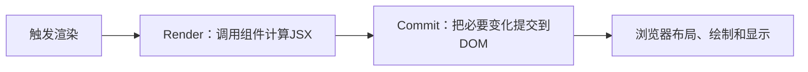

# React组件化前端开发

> [!summary] 一句话解释
> **React（读作“瑞艾克特”）是一个使用 JavaScript/TypeScript 构建用户界面的库：开发者把界面拆成组件，用 Props 提供外部输入、用 State 记录内部状态，React 根据状态重新计算界面并把必要变化提交给浏览器。**

---

## 一、先用积木和自动记分牌理解 React

假设要做一个购物网站，不使用组件化思路时，可能把页面写成一大堆互相纠缠的 HTML 和 JavaScript：

```text
顶部导航
商品列表
商品卡片
购物车
登录框
弹窗
分页
```

当商品数量、购物车状态或登录状态变化时，开发者需要自己找到许多 DOM 节点并逐个修改。

React 提供另一种思路：

```text
页面 = 多个组件组合
组件输出 = 当前Props和State对应的界面描述
状态变化 → React重新计算 → 更新需要变化的界面
```

例如：

```text
App
├─ Header
│  ├─ Logo
│  └─ UserMenu
├─ ProductList
│  ├─ ProductCard
│  ├─ ProductCard
│  └─ ProductCard
└─ ShoppingCart
```

每块积木可以拥有自己的显示逻辑，也可以被重复使用。

React 又像一个自动记分牌。你不必反复命令它：

```text
找到数字标签
→ 删除旧文字
→ 写入新文字
→ 根据分数改变颜色
```

你可以描述：

```text
当score是10时，界面应该显示“10”
```

当 `score` 改变时，React 重新计算并更新界面。

---

## 二、React 是什么，不是什么

### React 是 UI 库

**UI（User Interface，用户界面）**是用户看到并操作的界面。

React 主要负责：

- 定义和组合组件；
- 把数据描述成界面；
- 保存组件状态；
- 响应点击、输入等事件；
- 调度组件重新渲染；
- 把必要变化提交给目标平台。

### React 不是编程语言

React 程序通常使用：

- JavaScript；
- TypeScript；
- JSX 或 TSX；
- HTML 和 CSS 相关知识。

React 本身不是 JavaScript 的替代品。语言基础见 [[TypeScript与JavaScript]]。

### React 不是浏览器

React 最终仍要通过 `react-dom` 和浏览器 DOM API 创建或更新网页节点。浏览器继续负责：

- 解析 HTML/CSS；
- 样式计算；
- 布局；
- 绘制；
- 合成；
- 显示到屏幕。

所以 React 的“渲染”不等于浏览器完成的全部渲染流水线。详见 [[渲染逻辑]]。

### React 不是完整后端

React 核心不负责：

- 数据库；
- 用户密码验证；
- 服务端权限控制；
- 文件存储；
- 后台定时任务；
- API 的业务实现。

React 前端通常通过 API 与 Django、Java、Go、Node.js 等后端通信。API 概念见 [[SDK与API]]。

### React 核心不等于完整应用框架

大型产品还需要处理：

- 路由；
- 数据加载；
- 服务端渲染；
- 构建和打包；
- 缓存；
- 身份认证；
- 部署；
- 错误和性能监控。

这些能力通常由 React 框架和周边库组合提供。React 官方当前建议新应用优先考虑推荐的框架；如果框架不合适、需要自行搭建或只是学习基础，也可以从头构建 React 应用。

---

## 三、React 的核心思想：UI 是状态的函数

初学时可以记成：

```text
UI = f(state)
```

意思是：

> 给定当前状态，组件应该返回与之对应的界面描述。

例如：

```text
isLoggedIn = false → 显示“登录”按钮
isLoggedIn = true  → 显示头像和“退出”按钮
```

```jsx
function UserArea({ isLoggedIn }) {
  return isLoggedIn
    ? <button>退出</button>
    : <button>登录</button>;
}
```

这里不是直接找到原按钮再修改文字，而是声明当前状态应该对应什么界面。

这种方式叫 **Declarative UI（声明式界面）**。

### 声明式和命令式对比

命令式写法强调步骤：

```text
找到节点
→ 改文字
→ 加class
→ 隐藏另一个节点
```

声明式写法强调结果：

```text
当状态是登录时，界面应长成这样
```

React 负责把新描述与旧界面协调起来。

---

## 四、Component 组件是什么

**Component（组件）**是具有自身逻辑和外观的一块 UI。它可以小到一个按钮，也可以大到整个页面。

现代 React 通常使用 JavaScript 函数定义组件：

```jsx
function Welcome() {
  return <h1>欢迎学习 React</h1>;
}
```

这个函数：

1. 名字是 `Welcome`；
2. 返回 JSX；
3. React 调用它来计算应该显示什么。

使用组件：

```jsx
function App() {
  return (
    <main>
      <Welcome />
      <Welcome />
    </main>
  );
}
```

### 组件名称为什么首字母大写

在 JSX 中：

- `<button>`、`<div>` 等小写标签代表浏览器内置元素；
- `<Welcome>`、`<ProductCard>` 等大写标签代表自定义 React 组件。

如果自定义组件写成小写，React 会把它当成未知 HTML 标签。

### 组件有什么价值

- 复用相同界面和逻辑；
- 把大页面拆成小单元；
- 局部理解和测试；
- 通过组合形成复杂界面；
- 让数据依赖和职责更清楚。

### 不是越小越好

如果把每个文字和 `<div>` 都拆成组件，反而会增加跳转和理解成本。更适合拆组件的信号包括：

- 会重复使用；
- 有独立职责；
- 有自己的交互或状态；
- 结构复杂，拆开后更容易命名和理解；
- 需要独立测试或延迟加载。

---

## 五、JSX 是什么

**JSX（JavaScript Syntax Extension，JavaScript 语法扩展）**允许在 JavaScript 文件中写类似 HTML 的标记：

```jsx
const name = '小明';

function Greeting() {
  return <h1>你好，{name}</h1>;
}
```

JSX 不是字符串，也不是浏览器直接理解的普通 HTML。构建工具会把 JSX 转换成 JavaScript 调用和 React 元素描述。

React 和 JSX 是两个概念：

- React 是 JavaScript UI 库；
- JSX 是一种语法扩展；
- React 可以不用 JSX，但绝大多数项目使用 JSX；
- JSX 也可以被其他工具使用。

### JSX 和 HTML 的常见区别

#### 1. 标签必须闭合

```jsx

```

#### 2. 通常返回一个根节点

错误：

```jsx
return (
  <h1>标题</h1>
  <p>正文</p>
);
```

可以用 Fragment：

```jsx
return (
  <>
    <h1>标题</h1>
    <p>正文</p>
  </>
);
```

#### 3. 使用 `className`

```jsx
<div className="card">内容</div>
```

因为 `class` 在 JavaScript 里是关键字，而且 JSX 属性更接近 DOM 属性命名。

#### 4. 用花括号插入 JavaScript 表达式

```jsx
<p>{user.name}</p>
<p>{price * count}</p>
```

花括号中可以放表达式，但不能直接放普通 `if` 语句。条件显示通常使用提前返回、三元表达式或逻辑运算。

### `.jsx` 和 `.tsx`

| 扩展名 | 常见用途 |
|---|---|
| `.jsx` | 含 JSX 的 JavaScript |
| `.tsx` | 含 JSX 的 TypeScript |

`.tsx` 让 TypeScript 检查组件 Props、事件和数据结构，适合中大型项目。

---

## 六、Props：父组件传进来的参数

**Props（Properties，属性）**是父组件传给子组件的数据，类似函数参数。

```jsx
function Greeting({ name }) {
  return <h1>你好，{name}</h1>;
}

function App() {
  return (
    <>
      <Greeting name="小明" />
      <Greeting name="小红" />
    </>
  );
}
```

这里：

- `Greeting` 是组件；
- `name` 是 Prop；
- 两次使用同一个组件，传入不同数据；
- 分别显示不同姓名。

Props 可以传递：

- 字符串；
- 数字；
- 布尔值；
- 对象；
- 数组；
- 函数；
- JSX；
- 其他 React 节点。

### Props 是只读输入

子组件不应该直接修改收到的 Props。它应该根据 Props 计算输出；需要通知父组件时，可以调用父组件传下来的事件函数。

```jsx
function SaveButton({ onSave }) {
  return <button onClick={onSave}>保存</button>;
}
```

### `children`

嵌套在组件标签中间的内容通常通过 `children` Prop 获得：

```jsx
function Card({ children }) {
  return <section className="card">{children}</section>;
}

function App() {
  return (
    <Card>
      <p>卡片里的内容</p>
    </Card>
  );
}
```

这体现了 React 很重要的 **Composition（组合）**思想。

---

## 七、State：组件的记忆

**State（状态）**是组件在多次渲染之间需要记住的数据。

例如计数器需要记住当前次数：

```jsx
import { useState } from 'react';

function Counter() {
  const [count, setCount] = useState(0);

  return (
    <button onClick={() => setCount(count + 1)}>
      点击了 {count} 次
    </button>
  );
}
```

逐行解释：

```jsx
const [count, setCount] = useState(0);
```

- `useState(0)`：初始状态是 `0`；
- `count`：当前这次渲染看到的状态；
- `setCount`：请求更新状态的函数。

```jsx
onClick={() => setCount(count + 1)}
```

- 用户点击按钮；
- 事件处理函数调用 `setCount`；
- React 把状态更新加入队列；
- React 重新调用 `Counter`；
- 新 JSX 包含新的数字；
- React 把必要变化提交到 DOM。

### 普通变量为什么不够

```jsx
let count = 0;
```

普通局部变量：

- 组件再次调用时不会自动保存为组件状态；
- 修改它不会通知 React 重新渲染。

State 同时解决：

1. 在渲染之间保留值；
2. 更新时通知 React 重新渲染。

### State 是一次渲染的快照

在某次事件处理函数中，`count` 代表触发该次渲染时的值。调用 `setCount` 是请求后续渲染，不会让当前正在执行的 `count` 变量立刻变成新值。

需要基于前一个状态连续更新时，使用更新函数：

```jsx
setCount(previous => previous + 1);
```

### 不要直接修改对象和数组状态

不推荐：

```jsx
user.name = '小明';
setUser(user);
```

更合适：

```jsx
setUser(previous => ({
  ...previous,
  name: '小明'
}));
```

React 状态通常按不可变数据思路更新：创建新对象或新数组，而不是原地修改旧值。

---

## 八、Props 和 State 的区别

| 对比 | Props | State |
|---|---|---|
| 数据来源 | 父组件传入 | 组件自己声明和管理 |
| 类比 | 函数参数 | 组件记忆 |
| 组件能否直接改 | 不应该 | 通过 setter/dispatch 请求更新 |
| 是否影响渲染 | 会 | 会 |
| 常见用途 | 配置、数据、回调、children | 输入值、展开状态、选中项、计数 |

可以记成：

```text
Props = 别人告诉组件什么
State = 组件自己需要记住什么
```

---

## 九、事件怎样改变界面

React 使用事件处理函数响应用户行为：

```jsx
function LoginButton() {
  function handleClick() {
    console.log('用户点击了登录');
  }

  return <button onClick={handleClick}>登录</button>;
}
```

注意：

```jsx
onClick={handleClick}
```

表示把函数交给 React，等待点击时调用。

而：

```jsx
onClick={handleClick()}
```

会在渲染过程中立刻调用函数，通常不是想要的行为。

### 事件处理函数适合做什么

- 更新状态；
- 提交表单；
- 发送由本次点击直接触发的请求；
- 打开或关闭弹窗；
- 导航；
- 调用父组件回调。

渲染函数应该保持纯粹；真正由用户操作触发的副作用通常放在事件处理函数中。

---

## 十、Hook 是什么

**Hook（钩子）**是以 `use` 开头、让函数组件使用 React 功能的函数。

常见 Hook：

| Hook | 主要用途 |
|---|---|
| `useState` | 保存组件状态 |
| `useEffect` | 与 React 外部系统同步 |
| `useRef` | 保存可变引用或访问 DOM，不因修改自动重渲染 |
| `useContext` | 读取深层共享上下文 |
| `useReducer` | 用 reducer 管理复杂状态转换 |
| `useMemo` | 在依赖未变时复用计算结果，主要用于性能优化 |
| `useCallback` | 在依赖未变时复用函数引用，主要用于性能优化 |

### Hook 的基本规则

Hook 通常必须：

- 在 React 函数组件顶层调用；
- 或在自定义 Hook 顶层调用；
- 不能随意放进 `if`、循环和普通嵌套函数；
- 每次渲染保持稳定调用顺序。

React 依赖 Hook 调用顺序把状态与组件中的对应位置关联起来。

### 自定义 Hook

自定义 Hook 用于复用有状态逻辑：

```jsx
function useOnlineStatus() {
  // 状态和Effect逻辑
}
```

它复用的是逻辑，不会让不同组件自动共享同一份 State。每次调用通常拥有自己的状态实例。

---

## 十一、useEffect 到底是什么

`useEffect` 经常被误解成“组件运行后什么都放进去”。更准确地说：

> **Effect 用来让 React 组件与外部系统保持同步。**

外部系统包括：

- 浏览器 DOM API；
- WebSocket 连接；
- 定时器；
- 第三方地图或视频播放器；
- 事件订阅；
- 某些网络请求；
- 浏览器存储。

例如建立连接并清理：

```jsx
import { useEffect } from 'react';

function ChatRoom({ roomId }) {
  useEffect(() => {
    const connection = createConnection(roomId);
    connection.connect();

    return () => {
      connection.disconnect();
    };
  }, [roomId]);

  return <h1>房间：{roomId}</h1>;
}
```

这里：

- 组件提交到页面后建立连接；
- `roomId` 改变时，先清理旧连接，再建立新连接；
- 组件卸载时清理连接。

### 不是所有计算都需要 Effect

如果一个值可以直接由 Props 和 State 计算，就直接计算：

```jsx
const fullName = firstName + ' ' + lastName;
```

不要再创建 `fullName` State，然后用 Effect 同步；重复状态容易产生不一致。

### 开发模式为什么 Effect 可能执行两次

在 Strict Mode 开发检查中，React 会额外挂载/清理/再挂载，帮助发现没有正确清理的连接、订阅和定时器。生产模式不会因为这个开发检查而做相同的额外重挂载。

正确方向是实现幂等或清理逻辑，而不是简单用变量阻止第二次执行。幂等概念见 [[状态机与幂等性]]。

---

## 十二、React 的 Render 和 Commit

React 官方把一次界面更新分成三个重要阶段：



### 1. Trigger：触发

常见触发原因：

- 应用第一次启动；
- 组件 State 更新；
- 父组件重新渲染；
- Context 值变化；
- 框架发起相应更新。

### 2. Render：渲染计算

React 调用组件函数，递归计算新的 UI 描述。

渲染应该是纯计算：

- 相同输入得到相同输出；
- 不在渲染中修改外部变量；
- 不直接发网络请求或设置定时器；
- 不直接修改 DOM。

这里的“重新渲染”不等于“删除并重建整个真实网页”。

### 3. Commit：提交

React 比较新旧结果，并对真实 DOM 执行必要操作，例如：

- 创建节点；
- 修改文字；
- 更新属性；
- 删除节点；
- 调整节点位置。

如果计算结果没有引起实际 DOM 差异，提交阶段可能不需要修改 DOM。

### 4. Browser Paint：浏览器显示

DOM 更新后，浏览器根据 HTML、CSS 和布局情况进行样式计算、布局、绘制与合成，最后用户才看到画面。

---

## 十三、Virtual DOM 和 Reconciliation

很多教程用 **Virtual DOM（虚拟 DOM）**解释 React：

```text
先在内存中生成界面描述
→ 比较新旧描述
→ 更新真实DOM中必要部分
```

这个类比有帮助，但不能理解成：

- React 保存一个完整浏览器 DOM 的简单复制品；
- React 每次都把整棵树做昂贵的逐节点深度比较；
- 使用 Virtual DOM 就必然比原生 DOM 快；
- Virtual DOM 是 React 唯一价值。

更准确的相关概念是：

- React Element：组件返回的界面描述；
- Component Tree：组件关系树；
- Reconciliation（协调）：React 决定哪些组件和宿主节点被保留、更新或重建；
- Fiber：React 内部表示和调度工作的一种架构；
- Commit：最终对 DOM 或其他宿主环境应用变化。

> [!note]
> React Fiber 与 [[Cordis运行时机制：Fiber、Effect与Scope|Cordis Fiber]] 不是同一个概念，也不是操作系统线程。

React 的核心价值更在于声明式组件模型、状态组织、组合和跨平台渲染抽象，而不仅是一句“虚拟 DOM 更快”。

---

## 十四、列表中的 key 为什么重要

渲染列表时：

```jsx
function TodoList({ todos }) {
  return (
    <ul>
      {todos.map(todo => (
        <li key={todo.id}>{todo.text}</li>
      ))}
    </ul>
  );
}
```

`key` 帮助 React 在同一层列表中识别：

- 哪一项仍然存在；
- 哪一项被新增；
- 哪一项被删除；
- 哪一项移动了位置。

好的 Key 应该：

- 在兄弟项中唯一；
- 在该项生命周期内稳定；
- 来自数据本身，例如数据库 ID。

### 为什么不总用数组下标

如果列表会插入、删除、排序，使用数组下标作为 Key 可能让 React 错把旧组件状态关联到另一项。

如果列表完全静态、不会重排，使用下标的风险较低，但仍应理解边界。

`key` 不是普通 Prop，子组件不会通过 `props.key` 直接获得它。需要使用 ID 时，应另传一个 Prop。

---

## 十五、单向数据流和状态提升

React 通常采用 **One-way Data Flow（单向数据流）**：

```text
父组件State
↓ Props
子组件
↓ 调用父组件传下来的回调
父组件更新State
↓
重新渲染
```

如果两个子组件需要共享状态，常把状态移动到它们最近的共同父组件，这叫：

> **Lifting State Up（状态提升）**

```text
Parent：保存selectedId
├─ List：接收selectedId并触发onSelect
└─ Detail：根据selectedId显示详情
```

这样可以建立 **Single Source of Truth（单一事实来源）**，避免两个组件分别保存一份互相不同步的数据。

对于层级很深的共享信息，可以考虑 Context；对于大型复杂状态，可以配合 reducer 或专门状态管理库。但不要一开始就为很小的页面引入复杂全局状态方案。

---

## 十六、受控表单是什么

React 常让输入框的值由 State 控制：

```jsx
import { useState } from 'react';

function NameInput() {
  const [name, setName] = useState('');

  return (
    <>
      <input
        value={name}
        onChange={event => setName(event.target.value)}
      />
      <p>你好，{name}</p>
    </>
  );
}
```

流程：

```text
用户输入
→ onChange事件
→ setName更新State
→ 组件重新渲染
→ input的value和文字一起更新
```

这种由 React State 决定表单值的元素叫 **Controlled Component（受控组件）**。

也可以使用非受控表单，让浏览器 DOM 自己保存当前值，再通过 `ref` 或表单提交读取。选择取决于验证、联动和性能需求。

---

## 十七、React 如何显示条件和列表

### 条件渲染

使用三元表达式：

```jsx
return isLoading
  ? <p>加载中……</p>
  : <Article />;
```

使用逻辑与：

```jsx
return (
  <section>
    {error && <p className="error">{error}</p>}
  </section>
);
```

返回 `null` 可以不显示内容：

```jsx
if (!visible) return null;
```

### 列表渲染

```jsx
const items = ['HTML', 'CSS', 'React'];

function TopicList() {
  return (
    <ul>
      {items.map(item => (
        <li key={item}>{item}</li>
      ))}
    </ul>
  );
}
```

这里仍然是普通 JavaScript 数组的 `map` 方法，React 只是接收产生的元素列表。

---

## 十八、React、HTML、CSS、JavaScript 怎样配合

| 技术 | 主要职责 |
|---|---|
| HTML | 页面内容和语义结构 |
| CSS | 样式、布局、动画和响应式设计 |
| JavaScript/TypeScript | 数据、逻辑、事件和网络请求 |
| React | 用组件和状态组织 UI 更新 |
| 构建工具 | 转换 JSX/TS、打包模块、开发服务器和优化 |

一个 React 组件可能同时关联：

```tsx
import './Button.css';

type ButtonProps = {
  label: string;
  onClick: () => void;
};

export function Button({ label, onClick }: ButtonProps) {
  return (
    <button className="primary-button" onClick={onClick}>
      {label}
    </button>
  );
}
```

- TypeScript 检查 Props 类型；
- JSX 描述按钮结构；
- CSS 定义外观；
- React 组合组件并绑定事件；
- 浏览器最终显示真实按钮。

React 不会替代 [[HTML]] 和 [[CSS]] 的基础知识。

---

## 十九、React 和 Node.js、pnpm、Webpack 的关系

### Node.js

React 网页运行在浏览器中，但开发工具通常运行在 Node.js 中，例如：

- 开发服务器；
- JSX/TypeScript 转换；
- 打包；
- 测试；
- ESLint；
- 服务端渲染框架。

### pnpm/npm

包管理器安装：

```text
react
react-dom
构建工具
路由库
测试库
其他依赖
```

详见 [[Node.js与pnpm]]。

### Webpack/Vite 等构建工具

构建工具负责：

- 解析模块依赖；
- 转换 JSX/TSX；
- 处理 CSS 和资源；
- 开发服务器；
- HMR；
- 生产构建和代码分割。

React 不等于 Webpack，也不强制使用某一个打包器。详见 [[Webpack与HMR]]。

### ESLint

ESLint 可以检查：

- Hook 调用规则；
- Effect 依赖；
- 未使用变量；
- JSX 常见错误；
- 团队代码规范。

详见 [[ESLint与JavaScript静态代码检查]]。

---

## 二十、React 和 Next.js 的关系

可以简单理解：

```text
React = UI组件和渲染模型
Next.js等框架 = React + 路由 + 构建 + 服务端能力 + 部署约定
```

React 核心本身不会完整规定：

- 页面路由；
- 服务端数据加载；
- API 路由；
- 生产服务器；
- 图片优化；
- 静态生成；
- 缓存策略；
- 文件目录约定。

Next.js 是 React 框架的常见例子，但 React 不等于 Next.js，React 也可以在其他框架、桌面应用或自行搭建的前端项目中使用。

---

## 二十一、CSR、SSR、Hydration 和 Server Components

### CSR：客户端渲染

**CSR（Client-Side Rendering，客户端渲染）**：浏览器下载 JavaScript，React 在浏览器中计算和创建主要界面。

```text
服务器发送HTML外壳和JS
→ 浏览器下载并执行JS
→ React请求数据
→ React创建界面
```

### SSR：服务端渲染

**SSR（Server-Side Rendering，服务端渲染）**：服务器先把 React 组件渲染成 HTML，再把 HTML 发给浏览器。

优点可能包括更早看到内容和便于搜索引擎读取；代价是服务端渲染、缓存和数据一致性更复杂。

### Hydration：水合

服务器生成的 HTML 到达浏览器后，客户端 React 会将事件和组件逻辑连接到已有 HTML，这个过程叫 **Hydration（水合）**。

如果服务端和客户端第一次计算出的内容不一致，可能出现 Hydration 错误。

### React Server Components

**RSC（React Server Components，React 服务端组件）**是在客户端应用或 SSR 服务器之外的服务端/构建环境提前渲染的一类组件。

它们可以：

- 在服务端读取数据；
- 不把组件代码和部分依赖发送到浏览器；
- 把数据和 JSX 结果组合给客户端组件；
- 在框架支持下与 Suspense、流式传输配合。

它们不能直接使用客户端交互能力，例如 `useState`。交互部分需要 Client Component。

> [!warning]
> Server Components、SSR 和普通后端 API 是三个相关但不同的概念。学习 React 基础时不必先掌握 RSC；先把组件、Props、State、事件和 Render/Commit 学好。

---

## 二十二、React DOM 和 React Native

React 的组件和状态思想可以适配不同宿主平台。

### React DOM

`react-dom` 把 React 组件提交到浏览器 DOM，使用：

```jsx
<div>
<button>
<input>
```

最终得到网页元素。

### React Native

React Native 使用 React 模型构建手机应用，但主要对应原生平台组件，例如：

```jsx
<View>
<Text>
<Pressable>
```

它通常不是把完整网页塞进 [[WebView]]。React Native 和 React Web 会共享部分组件思想、JavaScript/TypeScript 和状态逻辑，但布局、组件、平台 API 和构建发布不同。

### Electron

Electron 在桌面应用中嵌入 Chromium 和 Node.js。React 经常用于 Electron 的 Renderer 界面，但 Electron 负责桌面运行环境，React 负责 UI 组织。详见 [[Electron桌面应用架构]]。

---

## 二十三、React、Vue、Angular 和 Svelte 的区别

下面是帮助初学者定位的粗略比较，不代表绝对优劣：

| 技术 | 常见定位 | 典型特点 |
|---|---|---|
| React | UI 库及生态基础 | JSX、函数组件、Hooks、组合，框架选择多 |
| Vue | 渐进式前端框架 | 单文件组件、模板、响应式系统，上手路径完整 |
| Angular | 完整 Web 应用框架 | TypeScript、依赖注入、路由和表单等体系较完整 |
| Svelte | 编译型 UI 框架 | 在构建阶段转换组件，运行时模型不同 |

选择时考虑：

- 团队经验；
- 现有代码；
- 招聘和生态；
- 框架与部署环境；
- 产品复杂度；
- 性能、可访问性和维护要求。

不需要在学会 HTML、CSS、JavaScript 前同时学习四套框架。

---

## 二十四、什么时候适合用 React

React 常适合：

- 管理后台；
- 聊天界面；
- 电商前端；
- 数据仪表盘；
- 交互复杂的表单；
- 社交和内容应用；
- Electron 桌面界面；
- 跨多个页面复用组件；
- 状态变化频繁的 UI。

### 什么时候可能不需要

- 只有几段静态文字的网页；
- 简单活动页，只需少量原生 JavaScript；
- 不需要构建工具和复杂状态；
- 团队已有稳定且合适的其他技术栈；
- 设备资源非常受限且 React 运行时不合适。

“流行”不是必须使用的理由。技术选择要看交互复杂度、维护成本和团队能力。

---

## 二十五、性能应该怎样理解

React 不保证所有写法自动高性能。性能受以下因素影响：

- 组件树规模；
- 状态放置位置；
- 是否进行昂贵计算；
- 是否渲染超长列表；
- 网络和图片；
- JavaScript 包大小；
- Effect 和订阅；
- 浏览器布局与绘制；
- 服务端与缓存策略。

### 常见优化工具

- `memo`：Props 未变时跳过部分组件重新渲染；
- `useMemo`：复用昂贵计算结果；
- `useCallback`：复用函数引用；
- 代码分割和懒加载；
- 列表虚拟化；
- 把 State 放在真正需要它的最近位置；
- 避免不必要 Effect 和重复 State。

这些工具不是越多越好。它们也有比较、内存和理解成本。先测量真实瓶颈，再优化。

### 重新渲染不等于性能错误

React 调用组件函数重新计算，并不一定会修改真实 DOM。许多重新渲染很便宜；盲目阻止每一次渲染反而会增加复杂度。

---

## 二十六、安全边界

React 会把普通字符串作为文本处理，而不是直接当成 HTML 执行，这有助于降低部分注入风险：

```jsx
<p>{userInput}</p>
```

但 React 不会自动解决所有安全问题。

### `dangerouslySetInnerHTML`

```jsx
<div dangerouslySetInnerHTML={{ __html: html }} />
```

如果 `html` 来自不可信用户，可能造成 **XSS（Cross-Site Scripting，跨站脚本）**。使用前必须经过适合上下文的可信清洗，并尽量避免直接插入 HTML。

### 前端权限不等于服务端授权

隐藏按钮只能改变界面：

```text
普通用户看不到“删除用户”按钮
```

攻击者仍可以直接构造 API 请求。因此后端必须独立验证身份和权限。

React 也不会自动解决：

- CSRF；
- Token 泄露；
- 不安全依赖；
- 敏感信息写入前端包；
- 错误 CORS；
- 服务端注入。

---

## 二十七、常见误区

### 误区 1：React 是编程语言

错误。React 是 JavaScript UI 库，通常配合 JavaScript/TypeScript 和 JSX。

### 误区 2：JSX 就是 HTML

错误。JSX 是 JavaScript 语法扩展，最终会被转换；它比 HTML 更严格，并有不同属性命名。

### 误区 3：State 改变后 React 重建整个网页

错误。React 重新计算相关组件，并在 Commit 阶段执行必要 DOM 操作。

### 误区 4：Props 和 State 是同一个东西

错误。Props 是外部输入，State 是组件自己的记忆。

### 误区 5：可以直接修改 State 对象

不推荐。应通过 setter/dispatch 创建新对象或数组，保持状态变化可追踪。

### 误区 6：所有逻辑都应该放进 useEffect

错误。Effect 主要用于同步外部系统；可在渲染中计算的派生值通常不需要 Effect。

### 误区 7：依赖数组想写什么就写什么

错误。Effect 使用的响应式值决定依赖；遗漏依赖容易产生陈旧闭包和同步错误。

### 误区 8：Virtual DOM 保证 React 永远最快

错误。性能依赖具体工作负载、框架、实现和代码结构。

### 误区 9：React 自带路由、数据库和认证

错误。这些通常来自框架、后端和周边库。

### 误区 10：React Native 就是 WebView

错误。React Native 主要驱动原生 UI 组件；WebView 是应用内部嵌入网页容器。

### 误区 11：开发模式 Effect 执行两次就是 React 出错

错误。Strict Mode 会进行额外开发检查，正确做法是清理副作用。

### 误区 12：类组件已经不能用了

错误。类组件仍受支持，但 React 官方推荐新代码优先使用函数组件。

---

## 二十八、一个小项目的思考流程

假设要做待办列表：

### 第一步：拆组件

```text
TodoApp
├─ TodoInput
├─ TodoFilter
└─ TodoList
   └─ TodoItem
```

### 第二步：确定数据

```ts
type Todo = {
  id: string;
  text: string;
  completed: boolean;
};
```

### 第三步：找出最小 State

可能需要：

- `todos`：待办数据；
- `filter`：当前筛选条件；
- `draft`：输入框内容。

不需要再保存：

- `completedTodos`；
- `visibleTodos`；
- `completedCount`。

这些都可以从已有 State 计算，避免重复来源。

### 第四步：确定 State 放在哪里

如果列表和筛选都需要 `todos`，就把它放在最近共同父组件 `TodoApp`。

### 第五步：数据向下，事件向上

```text
TodoApp把todos通过Props传给TodoList
TodoList把todo传给TodoItem
TodoItem通过onToggle回调通知TodoApp更新
```

### 第六步：最后再接外部系统

例如把数据保存到服务器或 Local Storage。只有真正需要与外部系统同步时，再设计 Effect、请求状态、错误处理和取消逻辑。

---

## 二十九、适合初学者的学习顺序

1. HTML：元素、表单和语义；
2. CSS：盒模型、布局和响应式设计；
3. JavaScript：变量、函数、对象、数组、模块、异步；
4. DOM 和浏览器事件；
5. React 组件和 JSX；
6. Props、State 和事件；
7. 列表、Key、表单和状态提升；
8. Hook 规则、`useEffect` 和清理；
9. TypeScript + React；
10. 路由、数据请求、错误处理和测试；
11. 框架、SSR、Hydration 和 Server Components；
12. 性能、可访问性与安全。

不要一开始同时学习 Redux、Next.js、复杂组件库、Server Components 和十几个 Hook。先用一个小项目把：

```text
组件 + Props + State + 事件 + 数据流
```

真正写熟。

---

## 三十、先记住的十句话

1. **React 是构建 UI 的 JavaScript 库，不是编程语言。**
2. **组件是带有逻辑和外观的可组合 UI 单元。**
3. **JSX 是 JavaScript 语法扩展，不是普通 HTML 字符串。**
4. **Props 是外部输入，State 是组件记忆。**
5. **调用 State setter 会请求 React 重新渲染。**
6. **Render 是计算界面，Commit 才真正修改 DOM。**
7. **组件渲染应该保持纯粹，副作用放在事件或必要的 Effect 中。**
8. **Effect 用于同步外部系统，不是所有逻辑的容器。**
9. **React 不自带完整路由、数据库、认证和部署方案。**
10. **学习 React 前仍要掌握 HTML、CSS 和 JavaScript。**

---

## 三十一、相关概念

- [[HTML]]：React DOM 最终创建的网页结构基础。
- [[CSS]]：React 组件仍需要 CSS 完成样式和布局。
- [[TypeScript与JavaScript]]：React 组件、事件、异步和 TSX 的语言基础。
- [[渲染逻辑]]：区分框架 Render/Commit 与浏览器布局、绘制和合成。
- [[Webpack与HMR]]：JSX/TSX 怎样转换，开发保存后怎样热更新。
- [[Node.js与pnpm]]：React 项目开发工具和依赖怎样安装运行。
- [[ESLint与JavaScript静态代码检查]]：Hooks 规则、Effect 依赖和 JSX 怎样静态检查。
- [[SDK与API]]：React 前端怎样调用后端接口。
- [[TCP、HTTP、HTTPS与WebSocket]]：React 应用网络通信的协议基础。
- [[Django]]：React 前端可以怎样与 Python 后端 API 配合。
- [[WebView]]：React Native 与嵌入网页容器的边界。
- [[Electron桌面应用架构]]：React 怎样作为桌面应用 Renderer 的 UI 层。
- [[状态机与幂等性]]：复杂交互状态和 Effect 清理为什么需要明确状态转换与重复执行边界。
- [[Cordis运行时机制：Fiber、Effect与Scope]]：避免把 React Fiber/Effect 与 Cordis 同名概念混淆。

---

## 参考资料

以下资料均为 React 官方文档，核对日期：**2026-08-29**。

- [React Quick Start](https://react.dev/learn)
- [Writing Markup with JSX](https://react.dev/learn/writing-markup-with-jsx)
- [Your First Component](https://react.dev/learn/your-first-component)
- [Passing Props to a Component](https://react.dev/learn/passing-props-to-a-component)
- [State: A Component's Memory](https://react.dev/learn/state-a-components-memory)
- [Render and Commit](https://react.dev/learn/render-and-commit)
- [Managing State](https://react.dev/learn/managing-state)
- [Synchronizing with Effects](https://react.dev/learn/synchronizing-with-effects)
- [Thinking in React](https://react.dev/learn/thinking-in-react)
- [React Installation](https://react.dev/learn/installation)
- [React DOM APIs](https://react.dev/reference/react-dom)
- [React Server Components](https://react.dev/reference/rsc/server-components)
